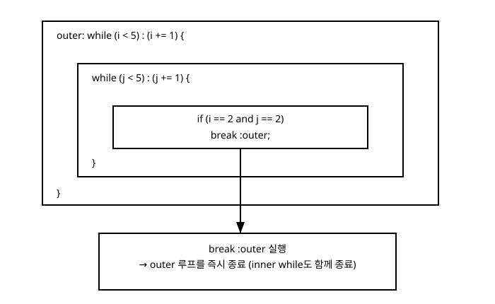

# 6장. 반복문

[◀ 이전: 5장. 제어문](ch05-제어문.md) | [📖 목차](00-목차.md) | [다음: 7장. 함수 ▶](ch07-함수.md)


## 이 장에서 다루는 내용

5장에서는 조건에 따라 실행 경로를 나누는 `if`와 `switch`를 살펴보았습니다. 이번 장에서는 같은 작업을 여러 번 되풀이하는 반복문을 다룹니다. Zig의 반복문은 `while`과 `for` 두 가지이며, 둘 다 `if`나 `switch`처럼 값을 반환하는 표현식으로도 쓸 수 있다는 공통점을 가지고 있습니다. 이 장에서는 다음을 다룹니다.

- `while` 반복문과 continue 표현식
- `for` 반복문으로 배열과 슬라이스를 순회하는 방법
- `break`와 `continue`로 반복을 제어하는 방법
- 레이블(label)을 이용해 중첩된 반복문의 바깥쪽 루프를 직접 지정해 제어하는 방법
- `break 값;`으로 반복문 자체를 표현식으로 만들어 값을 만들어내는 방법

## while 반복문

`while`은 조건이 참인 동안 블록을 반복해서 실행합니다.

```zig
const std = @import("std");

pub fn main() void {
    var i: u32 = 0;
    while (i < 5) {
        std.debug.print("i = {d}\n", .{i});
        i += 1;
    }
}
```

조건을 검사하고, 참이면 블록을 실행하고, 다시 조건을 검사하는 과정을 반복합니다. 조건이 거짓이 되는 순간 반복이 끝나고 다음 코드로 넘어갑니다. 위 예제처럼 반복 변수를 블록 안에서 직접 증가시켜도 되지만, Zig의 `while`은 조건 뒤에 콜론과 괄호로 "continue 표현식"을 붙이는 문법을 별도로 제공합니다.

```zig
const std = @import("std");

pub fn main() void {
    var i: u32 = 0;
    while (i < 5) : (i += 1) {
        std.debug.print("i = {d}\n", .{i});
    }
}
```

`: (i += 1)` 부분은 블록을 한 번 실행한 뒤 다음 조건 검사로 넘어가기 직전에 자동으로 실행됩니다. C의 `for (i = 0; i < 5; i += 1)`에서 세 번째 칸에 해당하는 부분을 `while`에 붙여 놓은 것과 같은 역할을 합니다. 반복 변수를 갱신하는 코드를 조건 옆에 모아 둘 수 있어서, 블록 안 어딘가에 증가 코드가 숨어 있어 놓치기 쉬운 상황을 줄여 줍니다.

조건에 항상 참인 값을 두면 무한 루프가 됩니다. 이 경우 블록 안에서 `break`로 직접 반복을 끝내야 합니다.

```zig
const std = @import("std");

pub fn main() void {
    var attempts: u32 = 0;
    while (true) {
        attempts += 1;
        if (attempts >= 3) break;
    }
    std.debug.print("총 {d}번 시도했습니다.\n", .{attempts});
}
```

## for 반복문으로 배열과 슬라이스 순회하기

8장과 13장에서 각각 다룰 배열과 슬라이스는 연속된 값들의 모음입니다. Zig의 `for`는 이런 모음을 순회하는 데 특화된 반복문입니다.

```zig
const std = @import("std");

pub fn main() void {
    const scores = [_]i32{ 90, 85, 77, 100 };

    for (scores) |score| {
        std.debug.print("점수: {d}\n", .{score});
    }
}
```

`for (scores) |score|`는 `scores`의 원소를 처음부터 끝까지 하나씩 꺼내 `score`라는 이름으로 블록에 전달합니다. C의 `for`문처럼 시작값·종료조건·증감식을 직접 관리할 필요가 없어서, 원소를 순서대로 방문하는 것이 목적이라면 `while`보다 `for`가 훨씬 간결합니다.

### 인덱스와 함께 순회하기

원소의 값뿐 아니라 그 위치(인덱스)도 함께 필요할 때는 두 번째 순회 대상으로 `0..`을 추가합니다.

```zig
const std = @import("std");

pub fn main() void {
    const scores = [_]i32{ 90, 85, 77, 100 };

    for (scores, 0..) |score, i| {
        std.debug.print("{d}번째 점수: {d}\n", .{ i, score });
    }
}
```

`0..`은 0부터 시작해서 첫 번째 대상(`scores`)의 길이만큼 이어지는 열린 범위입니다. `for`는 이 범위와 `scores`를 나란히 순회하며, 각 자리에서 원소값과 인덱스를 `|score, i|`로 함께 꺼내 줍니다.

### 정수 범위 자체를 순회하기

배열이나 슬라이스 없이 정수 범위만 순회하고 싶다면, 범위를 `for`의 유일한 대상으로 둘 수 있습니다.

```zig
const std = @import("std");

pub fn main() void {
    for (0..5) |i| {
        std.debug.print("i = {d}\n", .{i});
    }
}
```

`for (0..5) |i|`는 `i`가 0, 1, 2, 3, 4를 차례로 갖도록 반복합니다(5는 포함되지 않는 반열림 범위입니다). 앞서 본 `while (i < 5) : (i += 1)`과 결과는 같지만, 반복 변수를 직접 선언하고 증가시키는 코드가 없어 더 간결합니다. 단순히 정해진 횟수만큼 반복하거나 정수 범위를 순회할 때는 `while`보다 이 형태의 `for`를 쓰는 것이 Zig에서 더 자연스러운 방식입니다.

### 여러 개의 대상을 나란히 순회하기

`for`는 길이가 같은 여러 배열이나 슬라이스를 동시에 순회할 수도 있습니다.

```zig
const std = @import("std");

pub fn main() void {
    const names = [_][]const u8{ "철수", "영희", "민수" };
    const scores = [_]i32{ 88, 95, 79 };

    for (names, scores) |name, score| {
        std.debug.print("{s}: {d}점\n", .{ name, score });
    }
}
```

`for (names, scores) |name, score|`는 매 반복마다 `names`와 `scores`에서 같은 위치의 원소를 각각 꺼내 옵니다. 이때 두 대상의 길이는 반드시 같아야 합니다.

## break와 continue

`break`는 반복문을 즉시 끝내고 반복문 다음 코드로 넘어갑니다. `continue`는 현재 반복을 즉시 끝내고 다음 반복으로 넘어갑니다(`while`을 쓰고 있다면 continue 표현식이 있는 경우 그것부터 실행한 뒤 조건을 다시 검사합니다).

```zig
const std = @import("std");

pub fn main() void {
    var i: u32 = 0;
    while (i < 10) : (i += 1) {
        if (i % 2 != 0) continue; // 홀수는 건너뛴다
        if (i >= 8) break; // 8 이상이면 반복을 끝낸다
        std.debug.print("i = {d}\n", .{i});
    }
}
```

`for`문에서도 `break`와 `continue`는 같은 방식으로 동작합니다.

```zig
const std = @import("std");

pub fn main() void {
    const numbers = [_]i32{ 3, 7, -2, 9, 15, 4 };

    for (numbers) |n| {
        if (n < 0) continue;
        if (n > 10) break;
        std.debug.print("처리 중: {d}\n", .{n});
    }
}
```

## 레이블을 이용한 중첩 반복문 제어

반복문 안에 또 다른 반복문이 있는 중첩 구조에서 `break`나 `continue`를 그냥 쓰면 가장 안쪽 반복문에만 영향을 줍니다. 하지만 바깥쪽 반복문을 직접 끝내거나 건너뛰어야 할 때도 있습니다. 이럴 때는 반복문에 레이블을 붙이고, `break`나 `continue`에서 그 레이블을 지정합니다.

```zig
const std = @import("std");

pub fn main() void {
    var i: u32 = 0;
    outer: while (i < 5) : (i += 1) {
        var j: u32 = 0;
        while (j < 5) : (j += 1) {
            if (i == 2 and j == 2) break :outer;
            std.debug.print("i={d}, j={d}\n", .{ i, j });
        }
    }
    std.debug.print("루프 종료. i={d}\n", .{i});
}
```

`outer: while (...)`처럼 반복문 앞에 이름과 콜론을 붙이면 그 반복문에 `outer`라는 레이블이 생깁니다. 안쪽 `while`에서 `break :outer;`를 실행하면, 안쪽 반복문뿐 아니라 `outer` 레이블이 붙은 바깥쪽 반복문까지 한 번에 끝납니다. 다음 그림은 이 흐름을 보여줍니다.



`continue`도 레이블을 지정할 수 있습니다. `continue :outer;`는 안쪽 반복문을 즉시 빠져나와 바깥쪽 반복문의 다음 반복(있다면 continue 표현식부터)으로 넘어갑니다.

```zig
const std = @import("std");

pub fn main() void {
    var i: u32 = 0;
    outer: while (i < 3) : (i += 1) {
        var j: u32 = 0;
        while (j < 3) : (j += 1) {
            if (j == 1) continue :outer; // 안쪽 반복문을 그만두고 바깥쪽을 계속한다
            std.debug.print("i={d}, j={d}\n", .{ i, j });
        }
    }
}
```

레이블은 `for`문에도 똑같이 붙일 수 있습니다. 여러 겹의 `for`나 `while`이 뒤섞여 있을 때, 어떤 레이블도 지정하지 않은 `break`/`continue`는 언제나 자신을 감싸는 가장 가까운 반복문에만 적용된다는 점을 기억해 두면 헷갈리지 않습니다.

## 표현식으로서의 while과 for

5장에서 `if`와 `switch`가 값을 만들어내는 표현식으로도 쓰인다는 것을 보았습니다. `while`과 `for`도 마찬가지로, `break` 뒤에 값을 적으면 그 값이 반복문 전체의 결과가 됩니다. 이 용법은 주로 "무언가를 찾을 때까지 반복하고, 찾은 값을 결과로 돌려주는" 패턴에서 쓰입니다.

```zig
const std = @import("std");

fn findFirstNegative(numbers: []const i32) ?i32 {
    var i: usize = 0;
    const result = while (i < numbers.len) : (i += 1) {
        if (numbers[i] < 0) break numbers[i];
    } else null;
    return result;
}

pub fn main() void {
    const data = [_]i32{ 4, 8, -3, 6 };
    const found = findFirstNegative(&data);
    std.debug.print("{any}\n", .{found});
}
```

여기서 `while` 뒤에 붙은 `else null`은 `break`로 끝나지 않고 조건이 그냥 거짓이 되어 반복문이 정상적으로 끝났을 때의 값을 정합니다. 즉 이 `while` 표현식은 반복 중 `break numbers[i];`를 만나면 그 값을, 끝까지 아무것도 찾지 못하면 `else` 뒤의 `null`을 결과로 냅니다. `break`로 만드는 값과 `else` 뒤의 값은 서로 같은 타입이어야 하며(위 예제에서는 둘 다 `?i32`에 맞도록 컴파일러가 처리합니다), 이렇게 얻은 값을 `const result = ...`로 바로 받을 수 있습니다.

`for`도 똑같은 방식으로 값을 반환할 수 있습니다.

```zig
const std = @import("std");

fn indexOf(haystack: []const i32, needle: i32) ?usize {
    return for (haystack, 0..) |value, i| {
        if (value == needle) break i;
    } else null;
}

pub fn main() void {
    const data = [_]i32{ 10, 20, 30, 40 };
    const idx = indexOf(&data, 30);
    std.debug.print("{any}\n", .{idx});
}
```

`break`에 값을 주지 않는 `break;`, `continue;`와 값을 주는 `break 값;`은 서로 다른 상황에서 쓰입니다. 단순히 반복을 제어하고 싶다면 값이 없는 `break`/`continue`를 쓰고, 반복문 자체의 결과가 필요하다면 `break 값;`과 `else 값`을 조합해서 씁니다. 값을 반환하는 `while`/`for`에는 `else`가 없다면 반복문이 끝까지 실행되고 `break`도 없었을 경우 어떤 값을 결과로 삼아야 할지 알 수 없으므로, 이런 경우에는 `else` 뒤에 기본값을 반드시 명시해야 합니다.

## 요약

- `while (조건) { ... }`은 조건이 참인 동안 반복하며, `while (조건) : (증감식) { ... }` 형태로 반복마다 실행할 continue 표현식을 붙일 수 있다.
- `for (배열이나 슬라이스) |원소| { ... }`로 모음을 순회하고, `for (대상, 0..) |원소, i|`로 인덱스를 함께 얻을 수 있다.
- `for (시작..끝) |i| { ... }`처럼 정수 범위 자체를 순회 대상으로 쓸 수 있고, `for (a, b) |x, y|`처럼 길이가 같은 여러 대상을 나란히 순회할 수도 있다.
- `break`는 반복문을 즉시 끝내고, `continue`는 현재 반복만 끝내고 다음 반복으로 넘어간다.
- 반복문에 `이름: while (...)`처럼 레이블을 붙이고 `break :이름;`, `continue :이름;`을 쓰면 중첩된 반복문에서 특정 바깥쪽 반복문을 직접 지정해 제어할 수 있다.
- `while`과 `for`도 표현식으로 쓸 수 있다. `break 값;`으로 만든 값이 반복문 전체의 결과가 되며, `break` 없이 반복이 정상적으로 끝났을 때를 위한 기본값은 `else 값`으로 지정한다.

## 연습문제

1. `while`과 continue 표현식을 사용해 1부터 10까지의 합을 구하는 코드를 작성해 보세요.
2. 정수 슬라이스를 받아 그 안의 모든 원소의 합을 반환하는 함수를 `for` 반복문으로 작성해 보세요.
3. 정수 슬라이스와 인덱스를 함께 출력하되, 값이 음수인 원소는 `continue`로 건너뛰고 0이 나오면 `break`로 반복을 즉시 끝내는 코드를 작성해 보세요.
4. 2차원으로 중첩된 `for` 반복문에서, 특정 조건을 만족하는 순간 레이블을 이용해 바깥쪽 반복문까지 한 번에 끝내는 예제를 작성해 보세요.
5. 정수 슬라이스에서 특정 값을 찾아 그 인덱스를 옵셔널 타입(`?usize`)으로 반환하는 함수를, `for` 표현식과 `break`/`else`를 이용해 작성해 보세요. 값을 찾지 못했을 때는 `null`을 반환해야 합니다.

---

[◀ 이전: 5장. 제어문](ch05-제어문.md) | [📖 목차](00-목차.md) | [다음: 7장. 함수 ▶](ch07-함수.md)
