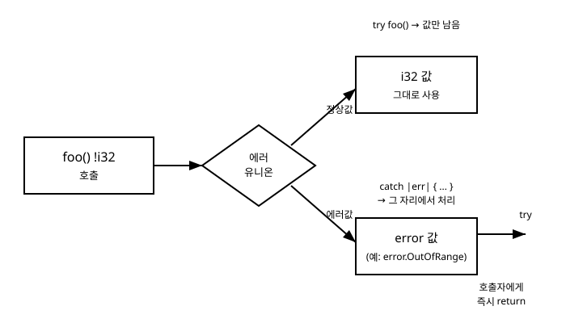

# 11장. 에러 처리(Error Union)

[◀ 이전: 10장. 옵셔널 타입](ch10-옵셔널타입.md) | [📖 목차](00-목차.md) | [다음: 12장. defer와 errdefer ▶](ch12-defer와errdefer.md)


지금까지 작성한 함수들은 대부분 "항상 성공한다"고 가정할 수 있는 계산이었습니다. 하지만 실제 프로그램은 파일이 없거나, 네트워크가 끊기거나, 사용자가 잘못된 값을 입력하는 상황을 늘 마주칩니다. 이런 실패 가능성을 언어가 어떻게 표현하느냐는 그 언어의 성격을 가장 잘 드러내는 부분 중 하나입니다.

Zig는 예외(exception)라는 별도의 제어 흐름을 두지 않습니다. 대신 "실패할 수 있다"는 사실을 함수의 반환 타입에 그대로 새겨 넣습니다. 이 장에서는 에러셋(error set), 에러 유니온 타입(`!T`), 그리고 이를 다루는 두 가지 핵심 도구인 `try`와 `catch`를 살펴봅니다. 1장에서 언급했던 "숨겨진 제어 흐름이 없다(no hidden control flow)"는 Zig의 철학이 에러 처리에서 어떻게 구체적으로 실현되는지 확인하는 것이 이 장의 목표입니다.

## 에러셋 정의하기

Zig에서 에러는 특별한 매직 값이 아니라, `error` 타입에 속하는 평범한 값입니다. 에러셋(error set)은 특정 함수가 반환할 수 있는 에러들의 집합을 이름 붙여 정의한 것입니다.

```zig
const std = @import("std");

const MyError = error{
    OutOfRange,
    InvalidInput,
};
```

`MyError`는 이제 하나의 타입입니다. 이 타입의 값은 `MyError.OutOfRange` 또는 `MyError.InvalidInput` 둘 중 하나입니다. 에러셋 안의 각 이름은 전역적으로 유일한 값을 가지는데, 같은 이름의 에러를 여러 곳에서 선언해도 Zig 컴파일러는 이들을 동일한 값으로 취급합니다. 즉 `error.OutOfRange`라는 이름 자체가 프로그램 전체에서 하나의 값을 가리킵니다.

에러 이름은 관례적으로 PascalCase를 사용합니다. 일반 값이 아니라 "무엇이 잘못되었는지"를 설명하는 이름이므로 `OutOfRange`, `FileNotFound`, `InvalidInput`처럼 짧고 명확하게 짓는 것이 좋습니다.

에러셋을 미리 이름 붙이지 않고 함수 정의 안에서 바로 인라인으로 쓸 수도 있습니다.

```zig
fn parse_digit(c: u8) error{InvalidInput}!u8 {
    if (c < '0' or c > '9') return error.InvalidInput;
    return c - '0';
}
```

여기서 `error.InvalidInput`처럼 에러셋을 명시하지 않고 바로 `error.이름` 형태로 값을 만들면, Zig는 그 이름을 포함하는 전역 에러셋(anyerror의 부분집합)의 한 값으로 취급합니다. 함수의 반환 타입에 어떤 에러셋을 명시했는지에 따라 그 함수가 실제로 반환할 수 있는 에러의 범위가 정해집니다.

## 에러 유니온 타입: `!T`

함수가 정상적인 값을 반환하거나, 혹은 에러를 반환할 수 있다는 것을 표현하는 타입이 에러 유니온(error union) 타입입니다. 문법은 에러셋과 `!`, 그리고 정상 값의 타입을 이어 쓰는 것입니다.

```zig
fn divide(a: i32, b: i32) error{DivisionByZero}!i32 {
    if (b == 0) return error.DivisionByZero;
    return @divTrunc(a, b);
}
```

`error{DivisionByZero}!i32`는 "이 함수는 `error.DivisionByZero`이거나 `i32` 값, 둘 중 하나를 반환한다"는 뜻입니다. 에러셋 부분을 생략하고 `!i32`라고만 쓰면, Zig 컴파일러가 함수 본문을 분석해서 실제로 어떤 에러들이 발생할 수 있는지 자동으로 추론합니다. 실무에서는 이 추론된 에러셋(inferred error set)을 가장 많이 사용합니다.

```zig
fn divide(a: i32, b: i32) !i32 {
    if (b == 0) return error.DivisionByZero;
    return @divTrunc(a, b);
}
```

두 정의는 사용하는 쪽에서 거의 동일하게 동작하지만, 명시적 에러셋은 "이 함수가 던질 수 있는 에러는 정확히 이것뿐"이라는 계약을 API 문서처럼 드러낸다는 장점이 있고, 추론된 에러셋은 함수 본문이 바뀔 때마다 자동으로 갱신되어 유지보수 부담이 적다는 장점이 있습니다. 라이브러리의 공개 API에는 명시적 에러셋을, 내부 헬퍼 함수에는 추론된 에러셋을 쓰는 경우가 흔합니다.

중요한 것은 `!i32` 자체가 `i32`도 아니고 `error{DivisionByZero}`도 아닌, 완전히 새로운 하나의 타입이라는 점입니다. 이 값을 실제로 사용하려면 "에러인가, 아닌가"를 먼저 구분해야만 합니다. 구분하지 않고 바로 산술 연산 등에 사용하려고 하면 컴파일 에러가 발생합니다. 이것이 핵심입니다. Zig는 컴파일 시점에 "이 값은 에러일 수도 있다"는 사실을 잊지 않도록 강제합니다.

## 에러 유니온 값을 다루는 방법: `try`와 `catch`

에러 유니온 값을 얻었다면 반드시 다음 중 하나를 선택해야 합니다.

1. 에러가 나면 나도 그냥 에러를 반환하고 손을 뗀다 → `try`
2. 에러가 나면 지금 여기서 직접 처리한다 → `catch`

### `try`: 에러를 즉시 상위로 전파하기

`try` 표현식은 Zig에서 가장 자주 쓰는 에러 처리 문법입니다. 다음 두 코드는 완전히 동일하게 동작합니다.

```zig
// try를 사용한 버전
fn calc(a: i32, b: i32) !i32 {
    const result = try divide(a, b);
    return result * 2;
}
```

```zig
// try를 풀어서 쓴 버전 (동일한 의미)
fn calc(a: i32, b: i32) !i32 {
    const result = blk: {
        const tmp = divide(a, b);
        if (tmp) |value| {
            break :blk value;
        } else |err| {
            return err;
        }
    };
    return result * 2;
}
```

즉 `try expr`는 정확히 다음과 같은 동작의 축약형입니다.

- `expr`를 평가한다.
- 평가 결과가 에러이면, 그 에러 값을 그대로 현재 함수의 반환값으로 즉시 `return`한다.
- 평가 결과가 에러가 아니면, 에러 유니온을 벗겨낸 정상 값 자체가 `try expr` 표현식의 값이 된다.

`try`는 새로운 제어 흐름 메커니즘이 아니라 이미 존재하는 `if (expr) |value| { ... } else |err| { return err; }` 패턴을 짧게 쓰도록 컴파일러가 제공하는 문법적 설탕(syntactic sugar)입니다. 이 사실은 뒤에서 살펴볼 "예외와의 차이"를 이해하는 데 핵심적인 역할을 합니다.

`try`를 사용하려면 그것을 사용하는 함수 자신도 에러를 반환할 수 있는 타입(`!T`)을 가져야 합니다. `try`가 에러 발생 시 `return err`를 수행하기 때문에, 함수의 반환 타입이 그 에러를 받아줄 수 있어야 하는 것은 당연합니다. `main` 함수처럼 에러를 반환하지 않는 함수 안에서 에러를 반환할 수 있는 표현식에 `try`를 쓰려면, `main` 자체의 반환 타입도 `!void` 등으로 바꿔야 합니다.

```zig
pub fn main() !void {
    const value = try divide(10, 2);
    std.debug.print("결과: {d}\n", .{value});
}
```

`zig`는 `main`이 `!void`를 반환하도록 정의되어 있으면, 프로그램 실행 중 처리되지 않은 에러가 최상위까지 올라왔을 때 에러 이름과 스택 트레이스를 출력하고 실행을 종료해 줍니다.

### `catch`: 에러를 그 자리에서 처리하기

전파하는 대신 에러가 발생한 그 지점에서 바로 대응하고 싶다면 `catch`를 사용합니다.

```zig
const value = divide(10, 0) catch |err| blk: {
    std.debug.print("나눗셈 실패: {}\n", .{err});
    break :blk 0;
};
```

`catch |err| { ... }` 블록 안에서는 발생한 에러 값을 `err`라는 이름으로 받아 검사할 수 있습니다. 블록의 마지막 값(또는 `break :blk`로 지정한 값)이 에러 대신 사용할 값이 됩니다.

에러 값을 굳이 검사할 필요 없이 그냥 기본값으로 대체하고 싶다면 더 짧게 쓸 수 있습니다.

```zig
const value = divide(10, 0) catch 0;
```

`catch 기본값` 형태는 "에러가 나면 이 값을 대신 쓰고, 에러가 아니면 원래 값을 쓴다"는 뜻입니다. 설정값을 읽어오다 실패하면 기본 설정으로 대체하는 경우처럼, 에러 자체의 종류는 중요하지 않고 그냥 "실패 시 대안값"만 있으면 되는 상황에 적합합니다.

에러가 발생한 경우 함수 실행을 중단하고 값을 반환하고 싶을 때도 `catch` 블록 안에서 `return`을 사용할 수 있습니다.

```zig
fn run() !void {
    const value = divide(10, 0) catch |err| {
        std.debug.print("오류 발생: {}\n", .{err});
        return err; // 또는 return; (void 반환이라면), 혹은 다른 값을 return
    };
    _ = value;
}
```

이 형태는 `try`와 거의 같은 결과를 내지만, `return` 전에 로그를 남기거나 다른 정리 작업을 하고 싶을 때 유용합니다. 사실 `try expr`는 정확히 "`catch |err| return err`를 붙인 것"과 동일하다고 볼 수 있습니다.

### 에러 값을 switch로 구분해서 처리하기

에러의 종류에 따라 다르게 대응해야 한다면 `catch` 블록 안에서 `switch`를 사용합니다.

```zig
const value = divide(a, b) catch |err| switch (err) {
    error.DivisionByZero => 0,
    else => return err,
};
```

이렇게 하면 특정 에러(`DivisionByZero`)만 기본값으로 흡수하고, 예상하지 못한 나머지 에러는 그대로 위로 전파할 수 있습니다.

## Zig의 에러는 예외가 아니라 값이다

C++이나 Java의 예외(exception)는 함수 호출 스택을 따라 "보이지 않게" 위로 전파됩니다. `try { ... } catch (Exception e) { ... }` 블록으로 감싸지 않은 코드에서 예외가 발생하면, 그 사이에 있는 모든 함수는 마치 순간이동하듯 건너뛰어지고 스택이 풀립니다(unwinding). 코드를 눈으로만 봐서는 특정 줄이 예외를 던질 수 있는지, 어디서 잡힐지 알기 어렵습니다. 실행 흐름의 일부가 타입 시스템이나 함수 시그니처에는 드러나지 않은 채 런타임에만 결정되는 것입니다.

Zig는 이런 숨겨진 제어 흐름을 허용하지 않습니다. 1장에서 살펴본 것처럼 Zig는 "코드를 읽으면 무슨 일이 일어나는지 알 수 있어야 한다"는 원칙을 지킵니다. 에러 처리에서 이 원칙은 다음과 같은 방식으로 구현됩니다.

- 함수가 실패할 수 있는지는 반환 타입 `!T`만 보면 바로 알 수 있습니다. 함수 시그니처에 드러나지 않은 에러는 발생할 수 없습니다.
- 에러가 발생했을 때 무슨 일이 일어나는지는 호출부의 `try` 또는 `catch`를 보면 정확히 알 수 있습니다. `try`는 "여기서 즉시 return한다"는 뜻이고, `catch`는 "여기서 바로 처리한다"는 뜻입니다. 둘 다 코드에 명시적으로 적혀 있습니다.
- `try`가 있는 줄에서 에러가 발생하면 정확히 그 함수를 즉시 빠져나가며, 이는 일반적인 `return`문과 동일한 방식으로 동작합니다. 예외처럼 여러 스택 프레임을 건너뛰며 별도의 unwinding 절차를 거치지 않습니다. 각 함수는 자신을 호출한 함수에게 값(정상값 또는 에러값)을 반환할 뿐이고, 그 함수가 다시 `try`로 받았다면 또 자신의 호출자에게 반환합니다. 결과적으로 에러가 여러 단계를 거쳐 위로 "전파"되는 것처럼 보이지만, 이는 각 단계마다 명시적으로 `try`가 반복 적용된 결과일 뿐 언어가 별도로 제공하는 마법이 아닙니다.
- 에러 값 자체는 정수 하나 정도의 크기를 가지는 평범한 값입니다. 예외 객체처럼 힙 할당이 필요하거나, 클래스 계층 구조를 가지거나, 던져지는 시점에 스택 트레이스를 수집하는 비용이 들지 않습니다.

정리하면, Zig에서 "에러 처리"는 사실 특별한 것이 아니라 그저 "반환값의 종류가 두 가지(정상/에러)인 함수를 `if`나 `try`로 분기하는 것"에 지나지 않습니다. 새로운 제어 흐름 개념이 아니라, 이미 익숙한 값과 분기의 조합입니다.

아래 그림은 `!i32`를 반환하는 함수 호출이 정상값과 에러값 두 갈래로 나뉘고, 각각을 `try`와 `catch`가 어떻게 처리하는지를 보여줍니다.



## 에러셋 병합하기

여러 함수를 호출하는 함수를 작성하다 보면, 그 함수는 호출하는 함수들 각각의 에러셋을 모두 반환할 수 있어야 합니다. 명시적으로 에러셋을 나열하고 싶다면 `||` 연산자로 두 개 이상의 에러셋을 합칠 수 있습니다.

```zig
const ParseError = error{InvalidInput};
const IoError = error{FileNotFound};

const ReadError = ParseError || IoError;
// ReadError는 error{InvalidInput, FileNotFound}와 동일

fn parse_number(text: []const u8) ParseError!i32 {
    _ = text;
    return error.InvalidInput;
}

fn read_file(path: []const u8) IoError![]const u8 {
    _ = path;
    return error.FileNotFound;
}

fn read_and_parse(path: []const u8) ReadError!i32 {
    const text = try read_file(path);
    const number = try parse_number(text);
    return number;
}
```

`read_and_parse`는 `read_file`에서 올 수 있는 `error.FileNotFound`와 `parse_number`에서 올 수 있는 `error.InvalidInput`을 모두 반환할 가능성이 있으므로, 반환 타입에 `ReadError`(두 에러셋을 합친 것)를 사용했습니다. 물론 이 경우에도 반환 타입을 그냥 `!i32`로 적어 Zig가 에러셋을 자동으로 추론하게 맡길 수도 있습니다. 실무에서는 함수 몸통이 자주 바뀌는 내부 로직에서는 추론에 맡기고, 외부에 공개하는 API의 경계에서는 `||`로 명시적인 에러셋을 만들어 문서화하는 방식을 함께 사용하는 경우가 많습니다.

## 요약

- 에러셋은 `error{ 이름1, 이름2 }` 형태로 정의하며, 그 안의 각 이름은 전역적으로 유일한 `error` 값입니다.
- `!T`는 에러 유니온 타입으로, "에러값 또는 T 타입의 정상값 중 하나"를 의미합니다. 반환 타입을 `error{...}!T` 대신 `!T`로만 쓰면 컴파일러가 함수 본문에서 발생 가능한 에러셋을 자동으로 추론합니다.
- `try expr`는 `expr`가 에러이면 즉시 `return`하고, 아니면 정상 값을 꺼내 쓰는 문법의 축약형입니다. `try`를 쓰는 함수는 자신도 에러를 반환할 수 있는 타입이어야 합니다.
- `catch |err| { ... }`는 에러를 그 자리에서 처리합니다. `catch 기본값`은 에러 시 대체할 값만 지정하는 더 짧은 형태입니다.
- Zig에는 예외가 없습니다. 에러는 그저 평범한 값이고, `try`/`catch`는 코드에 명시적으로 드러나는 분기일 뿐입니다. 함수 시그니처만 보면 실패 가능성을 알 수 있고, 스택이 갑자기 풀리는 숨겨진 제어 흐름도 없습니다.
- 여러 함수의 에러셋은 `||` 연산자로 합칠 수 있습니다.

## 연습문제

1. 정수를 문자열로 나눗셈하되, 나누는 값이 0이면 `error.DivisionByZero`, 결과가 `i32` 범위를 벗어나면 `error.Overflow`를 반환하는 함수 `safe_divide(a: i32, b: i32) !i32`를 작성해 보세요. 에러셋을 명시적으로 선언할지, 추론에 맡길지 직접 결정하고 그 이유를 설명해 보세요.
2. 1번에서 작성한 함수를 호출하는 코드를 두 가지 버전으로 작성해 보세요. 하나는 `try`로 에러를 상위로 전파하는 버전, 다른 하나는 `catch`로 에러 종류에 따라 다른 기본값(0 또는 -1)을 사용하는 버전입니다.
3. `try expr`가 실제로 어떤 `if`/`else` 코드의 축약형인지, 이 장의 예제를 참고하여 직접 풀어서 써 보세요.
4. `error{A, B}`와 `error{B, C}`를 `||`로 합친 에러셋에는 어떤 이름들이 포함되는지 설명하고, 실제로 코드로 확인해 보세요.
5. 예외 기반 언어(C++, Java 등)의 에러 처리와 Zig의 에러 유니온 방식을 비교했을 때, "코드를 읽는 것만으로 실패 가능성과 처리 지점을 알 수 있다"는 관점에서 어떤 차이가 있는지 자신의 언어로 정리해 보세요.

---

[◀ 이전: 10장. 옵셔널 타입](ch10-옵셔널타입.md) | [📖 목차](00-목차.md) | [다음: 12장. defer와 errdefer ▶](ch12-defer와errdefer.md)
