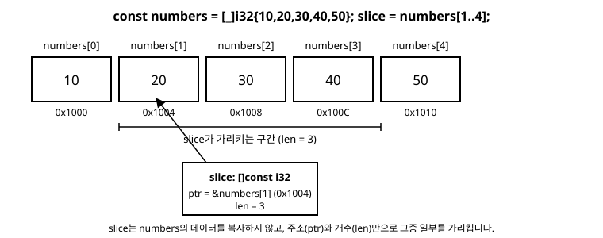

# 13장. 슬라이스

[◀ 이전: 12장. defer와 errdefer](ch12-defer와errdefer.md) | [📖 목차](00-목차.md) | [다음: 14장. comptime 기초 ▶](ch14-comptime기초.md)


8장에서 배열 `[N]T`는 크기가 타입에 고정된, 메모리에 나란히 놓인 값들의 묶음이라고 배웠습니다. 그리고 포인터 `*T`는 어떤 값이 놓인 주소를 가리킬 뿐, 그 뒤로 값이 몇 개나 더 이어지는지는 전혀 알지 못한다는 점도 확인했습니다. 배열을 함수에 포인터로 넘기면 주소는 전달되지만 길이 정보는 함께 따라가지 않는다는 것이 문제였고, 8장 끝에서는 이 문제를 해결하는 **슬라이스(slice)**를 `[]T`라는 타입으로 아주 짧게 맛보기만 했습니다.

이번 장에서는 그 슬라이스를 처음부터 제대로 파헤칩니다. 슬라이스가 정확히 무엇으로 이루어져 있는지, 배열에서 슬라이스를 어떻게 만드는지, 배열과 달리 슬라이스가 왜 함수 인자로 훨씬 유연한지, 그리고 왜 Zig에 문자열만을 위한 별도의 타입이 없는지까지 차례로 살펴봅니다.

## 슬라이스란 무엇인가

슬라이스의 타입은 `[]T` 형태로 씁니다. 배열 타입 `[N]T`와 비교하면 괄호 안에 길이가 없다는 점이 눈에 띕니다. 길이가 타입에 없는 대신, 슬라이스는 값 자체에 길이 정보를 들고 다닙니다.

런타임에서 슬라이스가 실제로 가지고 있는 정보는 딱 두 가지뿐입니다.

- `ptr`: 첫 번째 원소를 가리키는 포인터
- `len`: 그 포인터로부터 몇 개의 원소가 이어지는가 (`usize`)

즉 슬라이스는 개념적으로 다음과 같은 구조체 하나와 다를 게 없습니다.

```zig
// 슬라이스 []T가 런타임에 실제로 들고 있는 정보를 흉내 낸 것일 뿐,
// 이런 구조체를 직접 선언해서 쓸 필요는 없습니다.
const SliceLike = struct {
    ptr: [*]i32,
    len: usize,
};
```



실제로 Zig 코드에서 슬라이스 값의 `.ptr`과 `.len` 필드에 바로 접근할 수 있습니다.

```zig
const std = @import("std");

pub fn main() void {
    const numbers = [_]i32{ 10, 20, 30, 40, 50 };
    const slice: []const i32 = numbers[1..4];

    std.debug.print("ptr: {*}\n", .{slice.ptr});
    std.debug.print("len: {}\n", .{slice.len});
    std.debug.print("slice[0]: {}\n", .{slice[0]}); // 20 (numbers[1]과 같은 메모리)
}
```

`slice.ptr`은 `numbers[1]`의 주소를, `slice.len`은 `3`을 담고 있습니다. 슬라이스는 배열의 데이터를 복사하지 않습니다. 원본 배열 `numbers`가 가진 메모리를 그대로 가리키면서, 그중 몇 개를 어디서부터 볼 것인지에 대한 "창(window)"을 제공할 뿐입니다. 그래서 슬라이스를 만드는 비용은 배열의 크기와 무관하게 항상 일정합니다.

## 배열에서 슬라이스 만들기

배열의 일부 구간을 가리키는 슬라이스는 `array[start..end]` 문법으로 만듭니다. `start`는 포함되고 `end`는 포함되지 않는, 반열림 구간입니다.

```zig
const std = @import("std");

pub fn main() void {
    const numbers = [_]i32{ 10, 20, 30, 40, 50 };

    var start: usize = 1;
    var end: usize = 4;

    const middle: []const i32 = numbers[start..end];
    std.debug.print("{any}\n", .{middle}); // { 20, 30, 40 }

    start = 0;
    end = 2;
    const from_start: []const i32 = numbers[start..end];
    std.debug.print("{any}\n", .{from_start}); // { 10, 20 }

    const to_end: []const i32 = numbers[3..numbers.len];
    std.debug.print("{any}\n", .{to_end}); // { 40, 50 }

    const whole: []const i32 = numbers[0..numbers.len];
    std.debug.print("{any}\n", .{whole}); // { 10, 20, 30, 40, 50 }
}
```

`end` 자리에 배열의 끝을 그대로 쓰는 경우가 많기 때문에, Zig는 끝 경계를 생략하는 문법도 지원합니다. `numbers[3..]`은 `numbers[3..numbers.len]`과 같고, `numbers[..2]`처럼 시작을 생략할 수는 없지만 `numbers[0..2]`로 충분히 짧게 쓸 수 있습니다.

```zig
const tail: []const i32 = numbers[3..];      // { 40, 50 }과 동일한 슬라이스
const all:  []const i32 = numbers[0..];      // 배열 전체를 가리키는 슬라이스
```

위 예제에서는 `start`와 `end`를 `var`로 선언해서 런타임에 결정되는 값처럼 다뤘습니다. 여기에는 이유가 있습니다.

> Zig는 슬라이싱에 쓰인 시작과 끝이 **둘 다 컴파일 타임에 알 수 있는 값**이면, 결과 타입을 `[]T`가 아니라 `*[end-start]T`(고정 길이 배열을 가리키는 포인터)로 만듭니다.

예를 들어 `numbers[1..4]`처럼 리터럴 인덱스만 사용하면 그 결과는 원래 `*[3]i32` 타입입니다. 다만 `*[3]i32`는 `[]i32`로 자동 변환(coercion)되기 때문에, 위 예제처럼 `const middle: []const i32 = numbers[1..4];`처럼 슬라이스 타입을 명시해 두면 아무 문제 없이 슬라이스로 취급됩니다. 반면 시작이나 끝 중 하나라도 런타임에만 알 수 있는 값(`var`로 선언된 변수 등)이라면 애초에 결과가 `[]T`로 결정됩니다. 지금 단계에서는 "인덱스가 변수면 결과가 곧바로 슬라이스가 된다" 정도만 기억해 두면 충분하고, `*[N]T`와 `[]T`의 관계는 14장에서 comptime을 배우면 훨씬 명확하게 이해할 수 있습니다.

## 슬라이스는 크기가 타입에 없다

배열의 가장 큰 불편함은 길이가 타입의 일부라는 점입니다. `[3]i32`와 `[5]i32`는 원소 타입이 같아도 서로 다른 타입이기 때문에, 매개변수를 고정 길이 배열로 받는 함수는 딱 그 길이의 배열만 받을 수 있습니다.

```zig
fn sumFixed(values: [3]i32) i32 {
    var total: i32 = 0;
    for (values) |v| total += v;
    return total;
}

pub fn main() void {
    const a = [3]i32{ 1, 2, 3 };
    const b = [5]i32{ 1, 2, 3, 4, 5 };

    _ = sumFixed(a);
    // _ = sumFixed(b); // 컴파일 오류: 예상 타입은 [3]i32인데 [5]i32가 왔다
}
```

`b`를 넘기려면 `sumFixed`와 똑같은 함수를 `[5]i32`용으로 또 만들어야 합니다. 길이가 다른 배열마다 함수를 새로 작성하는 것은 현실적이지 않습니다. 슬라이스를 매개변수 타입으로 쓰면 이 문제가 사라집니다. 슬라이스 타입 `[]const i32`는 원소 타입과 가변성만 명시할 뿐 길이를 말하지 않으므로, 길이가 몇이든 상관없이 하나의 함수로 받을 수 있습니다.

```zig
fn sumAny(values: []const i32) i32 {
    var total: i32 = 0;
    for (values) |v| total += v;
    return total;
}

pub fn main() void {
    const a = [3]i32{ 1, 2, 3 };
    const b = [5]i32{ 1, 2, 3, 4, 5 };

    _ = sumAny(a[0..]);      // a 전체를 슬라이스로 전달
    _ = sumAny(b[0..]);      // 길이가 다른 b도 같은 함수로 전달
    _ = sumAny(b[1..4]);     // b의 일부 구간만 전달해도 된다
}
```

`sumAny`는 배열의 길이와 완전히 무관합니다. 배열 전체든, 그 일부 구간이든, 심지어 나중에 15장에서 배울 할당자로 힙에 만든 동적 크기의 데이터든, 슬라이스 하나로 받아 처리할 수 있습니다. 함수의 매개변수를 배열이 아니라 슬라이스로 설계하는 것이 Zig에서는 거의 기본값에 가까운 습관입니다.

## 문자열은 사실 `[]const u8`이다

Zig에는 다른 언어들이 흔히 제공하는 `String`이나 `str` 같은 전용 문자열 타입이 없습니다. 대신 Zig의 문자열은 그냥 **바이트 슬라이스** `[]const u8`입니다. 텍스트를 인코딩된 바이트의 나열로 보고, 이미 배운 슬라이스 타입 하나로 표현하는 것입니다.

```zig
const std = @import("std");

pub fn main() void {
    const greeting: []const u8 = "hello, zig";
    std.debug.print("{s}\n", .{greeting});
    std.debug.print("길이(바이트): {}\n", .{greeting.len}); // 10
}
```

`"hello, zig"` 같은 문자열 리터럴의 원래 타입은 `*const [10:0]u8`, 즉 길이가 10이고 끝에 널(`0`) 바이트가 하나 더 붙어 있는 배열을 가리키는 포인터입니다. 이 타입은 문맥에 따라 자연스럽게 `[]const u8`로 변환되기 때문에, 위 예제처럼 `[]const u8` 타입의 변수에 문자열 리터럴을 그냥 대입해도 됩니다. 별도의 문자열 타입이 없다는 것은 문자열을 다루기 위한 특수한 문법이나 메서드가 언어에 따로 있는 것이 아니라, 지금까지 배운 슬라이스 문법(`s[0..3]`)과 for 문(6장)을 그대로 문자열에도 쓸 수 있다는 뜻입니다.

```zig
const std = @import("std");

pub fn main() void {
    const message: []const u8 = "Ziglang";
    const first_three = message[0..3];
    std.debug.print("{s}\n", .{first_three}); // Zig
}
```

두 바이트 슬라이스가 같은 내용을 담고 있는지는 `==`로 비교할 수 없습니다(양쪽의 `ptr`이 다르면 서로 다른 메모리를 가리킬 뿐이므로). 대신 표준 라이브러리의 `std.mem.eql`처럼 내용을 바이트 단위로 비교하는 함수를 사용합니다.

```zig
const std = @import("std");

pub fn main() void {
    const a: []const u8 = "zig";
    const b = "zig";

    std.debug.print("{}\n", .{std.mem.eql(u8, a, b)}); // true
}
```

### 바이트 길이와 문자 개수는 다를 수 있다

Zig 소스 코드는 UTF-8로 인코딩됩니다. 영어 알파벳 한 글자는 보통 1바이트지만, 한글 한 글자는 3바이트를 차지합니다. `[]const u8`의 `.len`은 항상 **바이트 개수**를 뜻하므로, 한글이 섞인 문자열에서는 `.len`이 눈에 보이는 글자 수와 일치하지 않습니다.

```zig
const std = @import("std");

pub fn main() !void {
    const greeting = "안녕하세요"; // 5글자

    std.debug.print("바이트 길이: {}\n", .{greeting.len}); // 15 (5글자 * 3바이트)

    var count: usize = 0;
    var iter = (try std.unicode.Utf8View.init(greeting)).iterator();
    while (iter.nextCodepoint()) |_| count += 1;
    std.debug.print("문자 개수: {}\n", .{count}); // 5
}
```

Zig는 `[]const u8`을 그냥 바이트의 나열로 다루기 때문에, `greeting[0..1]`처럼 한글 문자 중간을 잘라내는 것도 문법적으로는 아무 문제 없이 허용됩니다(다만 그 결과는 더 이상 유효한 UTF-8이 아닌, 깨진 바이트 조각일 뿐입니다). 언어가 문자 경계를 대신 검사해 주지 않는 대신, `std.unicode` 모듈이 코드포인트 단위로 안전하게 순회할 수 있는 도구를 제공합니다. 바이트를 있는 그대로 다룰지, 코드포인트 단위로 다룰지는 프로그래머가 상황에 맞게 직접 선택하는 것이 Zig의 방식입니다.

## for 문으로 슬라이스 순회하기

슬라이스는 배열과 마찬가지로 6장에서 배운 `for` 문으로 순회할 수 있습니다.

```zig
const std = @import("std");

pub fn main() void {
    const scores = [_]i32{ 88, 92, 75, 100, 63 };
    const view: []const i32 = scores[1..4];

    for (view) |score| {
        std.debug.print("점수: {}\n", .{score});
    }
}
```

인덱스가 함께 필요하면 `0..`을 두 번째 순회 대상으로 넘겨서 인덱스를 같이 캡처합니다.

```zig
for (view, 0..) |score, i| {
    std.debug.print("{}번째 점수: {}\n", .{ i, score });
}
```

슬라이스가 `[]T`처럼 `const`가 붙지 않은 가변 슬라이스라면, 캡처 변수 앞에 `*`를 붙여 원소를 가리키는 포인터로 받아 그 자리에서 값을 바꿀 수도 있습니다.

```zig
const std = @import("std");

pub fn main() void {
    var buffer = [_]i32{ 1, 2, 3, 4, 5 };
    const view: []i32 = buffer[0..];

    for (view) |*value| {
        value.* *= 10;
    }

    std.debug.print("{any}\n", .{buffer}); // { 10, 20, 30, 40, 50 }
}
```

`view`는 `buffer`를 가리키는 슬라이스일 뿐 별도의 복사본이 아니므로, `view`를 통해 값을 바꾸면 원본 배열 `buffer`도 함께 바뀝니다. 이는 슬라이스가 항상 "누군가의 데이터를 빌려 보는 창"이라는 사실을 다시 한번 보여줍니다.

## const 슬라이스와 mutable 슬라이스

슬라이스 타입에도 배열이나 포인터와 마찬가지로 `const` 여부가 있습니다. `[]T`는 원소를 바꿀 수 있는 슬라이스이고, `[]const T`는 원소를 읽기만 할 수 있는 슬라이스입니다. 함수가 데이터를 읽기만 한다면 매개변수를 `[]const T`로 선언하는 것이 좋습니다. 호출하는 쪽의 데이터가 가변이든 불변이든 모두 받을 수 있고, 함수가 실수로 원본을 건드리지 않는다는 것을 타입으로 보장하기 때문입니다. 이번 장의 `sumAny`나 `sumFixed`도 값을 읽기만 하므로 `[]const i32`로 선언했습니다.

## 요약

- 슬라이스 `[]T`는 배열처럼 보이지만, 실제로는 `ptr`(첫 원소를 가리키는 포인터)과 `len`(원소 개수)의 쌍으로 이루어진 값입니다. 8장에서 배운 배열과 포인터의 관계를 하나로 합친 형태라고 볼 수 있습니다.
- `array[start..end]`로 배열의 일부(또는 전체)를 가리키는 슬라이스를 만듭니다. `end`는 생략하면 배열의 끝까지를 뜻합니다.
- 배열 타입 `[N]T`는 길이가 타입에 포함되어 있어 길이가 다르면 서로 다른 타입이 되지만, 슬라이스 타입 `[]T`는 길이를 값으로만 들고 있어서 함수 매개변수로 쓰면 어떤 길이의 데이터든 하나의 함수로 받을 수 있습니다.
- Zig에는 전용 문자열 타입이 없습니다. 문자열은 그냥 바이트 슬라이스 `[]const u8`이며, 슬라이스와 for 문에 대해 배운 문법을 그대로 문자열에도 적용할 수 있습니다.
- `[]const u8`의 `.len`은 바이트 개수이며, UTF-8에서는 문자마다 차지하는 바이트 수가 다르기 때문에 코드포인트(문자) 개수와 다를 수 있습니다.
- 슬라이스도 6장의 `for` 문으로 순회할 수 있고, `for (slice, 0..) |v, i|`로 인덱스를 함께 받거나 `for (slice) |*v|`로 원소를 직접 수정할 수 있습니다.

## 연습문제

1. 정수 배열 `[_]i32{ 3, 1, 4, 1, 5, 9, 2, 6 }`을 만들고, 앞의 절반과 뒤의 절반을 각각 슬라이스로 나눈 뒤 두 부분의 합을 각각 출력하는 프로그램을 작성하세요.
2. 배열의 길이에 상관없이 최댓값을 찾아 반환하는 함수 `fn maxOf(values: []const i32) i32`를 작성하고, 길이가 서로 다른 두 배열로 테스트해보세요.
3. 문자열 `[]const u8`을 받아 그 안에 특정 바이트(예: 공백 `' '`)가 몇 번 나오는지 세는 함수를 작성하세요. `for (slice, 0..) |byte, i|` 문법을 사용해보세요.
4. 한글이 포함된 문자열 하나를 준비하고, `.len`이 반환하는 바이트 수와 `std.unicode.Utf8View`로 센 문자 수가 왜 다른지 직접 출력해서 확인해보세요.
5. `var` 슬라이스(`[]i32`)를 매개변수로 받아 모든 원소를 2배로 만드는 함수를 작성하고, 함수 호출 후 원본 배열이 실제로 바뀌었는지 확인해보세요.

---

[◀ 이전: 12장. defer와 errdefer](ch12-defer와errdefer.md) | [📖 목차](00-목차.md) | [다음: 14장. comptime 기초 ▶](ch14-comptime기초.md)
