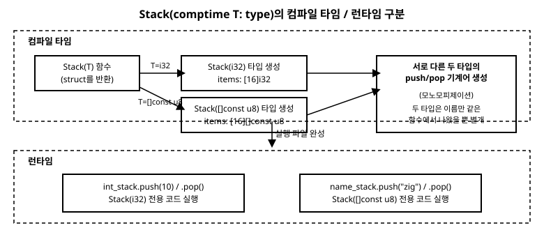

# 14장. comptime 기초

[◀ 이전: 13장. 슬라이스](ch13-슬라이스.md) | [📖 목차](00-목차.md) | [다음: 15장. 메모리 할당자(Allocator) ▶](ch15-메모리할당자.md)


1장에서 Zig는 C의 전처리기(`#define`, `#ifdef`)나 C++의 템플릿 같은 별도의 매크로 언어 없이도 강력한 메타프로그래밍이 가능하다고 예고했습니다. 그 약속을 지키는 실체가 바로 이번 장에서 다룰 **comptime**입니다. comptime은 새로운 문법이 아니라, 지금까지 배운 것과 똑같은 Zig 코드를 컴파일이 끝나기 전에 실행해 버리는 Zig 컴파일러의 능력입니다. 이번 장을 마치면 7장에서 잠깐 등장했던 `max(comptime T: type, a: T, b: T) T`라는 시그니처가 정확히 무슨 뜻이었는지 완전히 이해하게 될 것입니다.

## comptime이란 무엇인가

대부분의 언어에서 "컴파일"과 "실행"은 완전히 분리된 두 단계입니다. 컴파일러는 코드를 기계어로 옮기기만 하고, 그 코드가 실제로 무엇을 계산하는지는 프로그램이 실행될 때에만 알 수 있습니다. Zig는 이 경계를 의도적으로 허뭅니다. Zig 컴파일러는 자체적으로 Zig 코드를 해석하고 실행할 수 있는 평가기를 내장하고 있어서, 입력값이 컴파일 시점에 이미 다 알려져 있는 코드라면 그 코드를 실행 파일을 만들기 **전에** 미리 실행해서 결과값만 실행 파일에 남길 수 있습니다. 이렇게 컴파일 시점에 코드를 실행하는 것을 **comptime 평가**라고 부릅니다.

가장 중요한 특징은, comptime으로 평가되는 코드가 런타임 코드와 **완전히 같은 문법**이라는 점입니다. 새로운 매크로 언어를 배울 필요가 없습니다. `if`, `while`, `for`, 함수 호출, 구조체 선언까지, 여러분이 지금까지 이 책에서 배운 문법 그대로가 컴파일 시점에도 그대로 실행됩니다. 다음 코드를 봅시다.

```zig
const std = @import("std");

pub fn main() void {
    const seconds_per_day = 60 * 60 * 24; // 86400
    std.debug.print("{}\n", .{seconds_per_day});
}
```

`60 * 60 * 24`라는 계산은 실행 시점에 CPU가 곱셈 명령어를 수행하는 게 아닙니다. `seconds_per_day`의 값을 만드는 데 필요한 모든 정보(`60`, `60`, `24`라는 리터럴)가 이미 컴파일 시점에 알려져 있으므로, 컴파일러가 미리 계산을 끝내고 `86400`이라는 값 하나만 실행 파일에 남깁니다. 사실 이 정도의 상수 폴딩(constant folding)은 C나 C++ 컴파일러도 최적화 단계에서 흔히 해 줍니다. Zig가 특별한 지점은, 이 "컴파일 시점 실행"을 최적화의 부수 효과가 아니라 **언어가 보장하는 정식 기능**으로 끌어올려서, 함수 호출·분기·반복·타입 정의까지 전부 컴파일 시점에 실행할 수 있게 열어 두었다는 점입니다.

이번 장에서는 그 능력을 세 가지 형태로 나누어 살펴봅니다.

1. `comptime` 키워드로 변수를 컴파일타임 값으로 강제하기
2. `comptime` 매개변수로 제네릭 함수와 제네릭 자료구조 만들기
3. `comptime` 블록으로 컴파일 시점에 반복문과 계산을 직접 실행하기

## comptime 키워드로 컴파일타임 상수 만들기

`60 * 60 * 24`처럼 컴파일러가 스스로 알아서 컴파일 시점에 계산해 주는 경우도 있지만, 어떤 값은 문맥상 **반드시** 컴파일 시점에 알려져 있어야만 코드가 성립합니다. 대표적인 예가 배열의 길이입니다. 8장에서 배웠듯 배열 타입 `[N]T`의 `N`은 타입의 일부이므로, 런타임에 결정되는 평범한 `var`로는 배열 크기를 줄 수 없습니다.

```zig
fn makeBuffer(size: usize) void {
    // var buffer: [size]u8 = undefined; // 컴파일 오류: size는 런타임에만 알 수 있는 값
    _ = size;
}
```

이럴 때 `comptime` 키워드를 변수 선언 앞에 붙이면, "이 변수의 값은 런타임까지 미루지 말고 반드시 컴파일 시점에 확정하라"고 컴파일러에게 요구할 수 있습니다.

```zig
pub fn main() void {
    comptime var max_size: usize = 10;
    max_size += 5; // 이 덧셈도 컴파일 시점에 일어난다

    var buffer: [max_size]u8 = undefined;
    buffer[0] = 1;
    _ = buffer;
}
```

`max_size`는 `var`처럼 값을 바꿀 수 있지만, 그 변화는 프로그램이 실행되는 동안 일어나는 게 아니라 컴파일러가 코드를 분석하는 동안 일어납니다. 프로그램이 실제로 실행될 때는 `max_size`라는 변수 자체가 존재하지 않고, 이미 확정된 `15`라는 길이를 가진 `[15]u8` 타입만 남아 있습니다. `comptime`을 변수에 붙이는 것은 "이 값을 계산하는 데 시간을 들이지 말라"는 뜻이 아니라 "이 값은 실행 파일이 만들어지기 전에 이미 결정되어 있어야 한다"는 제약을 거는 것입니다.

## comptime 매개변수와 제네릭 함수

`comptime`의 진짜 힘은 변수보다 **함수 매개변수**에 붙였을 때 드러납니다. Zig에서는 타입(`type`) 자체가 하나의 값입니다. `i32`, `f64`, `bool`, 여러분이 만든 구조체까지, 이 모든 것이 `type`이라는 타입을 가진 값으로 취급됩니다. 그리고 함수 매개변수를 `comptime T: type`처럼 선언하면, 그 함수는 "타입을 값으로 받아서 컴파일 시점에 그 타입에 꽉 맞는 코드를 새로 만들어 내는" 함수가 됩니다.

7장에서 미리 봤던 예제를 이제 완전히 풀어 보겠습니다.

```zig
const std = @import("std");

fn max(comptime T: type, a: T, b: T) T {
    return if (a > b) a else b;
}

pub fn main() void {
    std.debug.print("{}\n", .{max(i32, 3, 7)});     // 7
    std.debug.print("{}\n", .{max(f64, 3.5, 2.1)}); // 3.5
}
```

`max(i32, 3, 7)`을 호출하면 컴파일러는 먼저 `T`에 `i32`를 대입하고, 그 결과로 나오는 `fn max(a: i32, b: i32) i32`라는 함수 본문을 실제로 만들어 낸 뒤에야 `3 > 7` 같은 런타임 비교 코드를 컴파일합니다. `max(f64, 3.5, 2.1)`을 호출하면 이번에는 `T`에 `f64`가 들어간, 완전히 별개의 `max` 버전이 하나 더 만들어집니다. 이렇게 호출에 쓰인 구체적인 타입마다 함수를 통째로 다시 생성하는 과정을 **모노모피제이션(monomorphization)**이라고 부르며, C++ 템플릿이나 Rust 제네릭도 내부적으로 이와 비슷한 과정을 거칩니다.

여기서 `comptime T: type`이 없었다면 어떻게 될까요? `a: T`, `b: T`, 반환 타입 `T`를 쓰려면 `T`가 무엇인지 컴파일 시점에 알아야만 `a > b` 같은 비교 연산이 그 타입에서 허용되는지, 함수의 시그니처가 무엇인지 확정할 수 있습니다. `comptime` 없이 `T: type`이라고만 쓰면 "T의 값은 런타임에 결정된다"는 뜻이 되어 버리는데, 타입은 애초에 런타임에 존재하는 개념이 아니므로 이는 모순입니다. 그래서 매개변수가 `type`이면 거의 항상 `comptime`이 함께 붙습니다.

비슷한 결과를 `anytype`으로도 얻을 수 있습니다.

```zig
fn maxAny(a: anytype, b: anytype) @TypeOf(a) {
    return if (a > b) a else b;
}
```

`anytype`은 "이 매개변수의 타입은 호출하는 쪽을 보고 그때그때 추론하라"는 뜻으로, 내부적으로는 여전히 컴파일 시점 타입 추론에 의존합니다. 다만 `anytype`으로는 그 타입에 이름을 붙여 여러 매개변수나 반환 타입에서 재사용하기가 번거롭습니다. 반대로 `comptime T: type`은 `T`라는 이름을 얻어서 함수 시그니처 전체에서, 그리고 다음 절에서 볼 것처럼 함수 본문 안에서도 자유롭게 재사용할 수 있습니다. 두 방식 모두 쓰이지만, 이름이 있는 타입 매개변수가 필요한 제네릭 자료구조에는 `comptime T: type`이 표준적인 선택입니다.

### comptime 매개변수로 제약 검사하기

`comptime` 매개변수로 받은 타입은 `@typeInfo`라는 내장 함수로 그 구조를 컴파일 시점에 들여다볼 수 있습니다. 이를 이용하면 "이 함수는 정수나 실수 타입에만 써야 한다"는 제약을 런타임 검사가 아니라 컴파일 오류로 만들 수 있습니다.

```zig
const std = @import("std");

fn max(comptime T: type, a: T, b: T) T {
    switch (@typeInfo(T)) {
        .int, .float => {},
        else => @compileError("max는 정수 또는 실수 타입에만 사용할 수 있습니다"),
    }
    return if (a > b) a else b;
}

pub fn main() void {
    std.debug.print("{}\n", .{max(i32, 3, 7)});

    // const bad = max(bool, true, false);
    // ↑ 이 줄의 주석을 해제하면 컴파일이 실패하며 위에서 지정한 오류 메시지가 그대로 출력됩니다.
}
```

`@compileError`는 실행되면 컴파일 자체를 즉시 실패시키는 특별한 함수입니다. `max(bool, true, false)`처럼 호출하면 `T`에 `bool`이 들어가고, `@typeInfo(bool)`은 `.int`도 `.float`도 아니므로 `else` 분기에서 `@compileError`가 실행되어 컴파일이 멈춥니다. 이런 검사는 C++의 `static_assert`나 `concepts`, Rust의 트레이트 경계(trait bound)와 목적은 같지만, Zig에서는 별도의 문법 없이 그냥 `switch`와 `if`, `@compileError`라는 평범한 도구로 표현합니다.

## 제네릭 자료구조: 타입을 반환하는 함수

`comptime T: type` 매개변수를 받는 함수가 꼭 값을 반환할 필요는 없습니다. **타입을 반환**할 수도 있습니다. 이 패턴이 Zig에서 제네릭 자료구조를 만드는 표준적인 방법입니다.

```zig
const std = @import("std");

fn Stack(comptime T: type) type {
    return struct {
        items: [16]T = undefined,
        len: usize = 0,

        const Self = @This();

        pub fn push(self: *Self, value: T) void {
            self.items[self.len] = value;
            self.len += 1;
        }

        pub fn pop(self: *Self) ?T {
            if (self.len == 0) return null;
            self.len -= 1;
            return self.items[self.len];
        }
    };
}

pub fn main() void {
    var int_stack = Stack(i32){};
    int_stack.push(10);
    int_stack.push(20);
    int_stack.push(30);

    while (int_stack.pop()) |value| {
        std.debug.print("{}\n", .{value}); // 30, 20, 10
    }

    var name_stack = Stack([]const u8){};
    name_stack.push("hello");
    name_stack.push("zig");
    std.debug.print("{s}\n", .{name_stack.pop().?}); // zig
}
```

`Stack`은 함수지만, 매개변수와 반환값이 모두 `type`입니다. `Stack(i32)`를 호출하면 컴파일러는 `T`에 `i32`를 대입해서 `struct { items: [16]i32 = undefined, len: usize = 0, ... }`라는 구조체 정의를 그 자리에서 만들어 내고, 그 **타입 자체**를 반환값으로 돌려줍니다. `Stack([]const u8)`을 호출하면 완전히 다른 구조체, `items` 필드가 `[16][]const u8`인 타입이 새로 만들어집니다. 13장에서 `[3]i32`와 `[5]i32`가 서로 다른 타입이었던 것처럼, `Stack(i32)`와 `Stack([]const u8)`도 이름만 같은 함수에서 나왔을 뿐 완전히 서로 다른 타입입니다.

`Stack(i32)` 자체는 값이 아니라 타입이므로, 그 타입의 값을 만들 때는 9장에서 배운 구조체 리터럴 문법을 그대로 씁니다. `Stack(i32){}`는 `items`와 `len`에 대해 구조체에 정의해 둔 기본값(`undefined`와 `0`)을 그대로 사용해서 값을 만드는 것입니다. 구조체 안에서 쓴 `const Self = @This();`는 자기 자신, 즉 지금 정의되고 있는 `Stack(T)` 타입을 가리키는 이름입니다. 메서드의 매개변수 목록에서 `T`나 `Stack(i32)`처럼 매번 구체적인 이름을 다시 쓰지 않고 `Self`라는 짧은 이름으로 재사용할 수 있어 편리합니다.

이번 `Stack(T)`는 comptime 설명에 집중하기 위해 `push`가 배열이 꽉 찼는지는 검사하지 않았습니다. 실제로 쓸 자료구조라면 `self.len == self.items.len`인 경우를 미리 확인해서 11장에서 배운 에러 유니온을 반환하거나, 최소한 `std.debug.assert`로 그 상황이 일어나면 안 된다는 것을 명시해 두어야 합니다.



이 패턴이 낯설게 느껴진다면 이렇게 정리해도 좋습니다. **"타입"도 Zig에서는 그냥 값이고, `comptime`은 그 값을 다른 값들처럼 함수에 넘기고 함수에서 돌려받을 수 있게 해 주는 도구다.** 실제로 15장에서 배울 `std.ArrayList(T)`나 표준 라이브러리의 여러 컨테이너 타입들도 지금 만든 `Stack(T)`와 원리상 동일한 패턴으로 구현되어 있습니다.

## comptime 블록으로 컴파일 시점에 반복문 실행하기

`comptime` 키워드는 블록 앞에도 붙일 수 있습니다. `comptime { ... }`는 "이 블록 안의 모든 문장을 지금, 컴파일 시점에 실행해 버려라"라는 명령입니다. 블록 안에서는 `var`, `while`, `for`, `if` 등 여러분이 아는 문법을 그대로 쓸 수 있고, 그 실행은 100% 컴파일러 내부에서 일어납니다.

```zig
const std = @import("std");

fn sumUpTo(n: u32) u32 {
    var total: u32 = 0;
    var i: u32 = 0;
    while (i <= n) : (i += 1) {
        total += i;
    }
    return total;
}

pub fn main() void {
    const value = comptime sumUpTo(10);
    std.debug.print("{}\n", .{value}); // 55
}
```

`sumUpTo`는 평범한 함수입니다. 하지만 `comptime sumUpTo(10)`처럼 호출 앞에 `comptime`을 붙이면, 함수 안의 `while` 반복문 전체가 컴파일 시점에 다 실행되고, 실행 파일에는 반복문이 아니라 이미 계산이 끝난 값 `55` 하나만 남습니다. `sumUpTo(n)`을 런타임 변수를 넘겨 평범하게 호출했다면 반복문 코드가 그대로 실행 파일에 들어가서 프로그램이 실행될 때마다 반복 계산이 일어났을 것입니다. 어느 쪽으로 호출하느냐에 따라 똑같은 함수가 "컴파일 시점 계산"과 "런타임 계산" 중 하나로 자유롭게 쓰이는 것입니다.

top-level(파일 최상위)에 있는 `const` 선언의 초깃값은 어차피 컴파일 시점에 확정되어야 하므로, 별도로 `comptime`을 쓰지 않아도 그 안의 반복문이 자동으로 컴파일 시점에 실행됩니다. 이를 이용해 프로그램이 시작하기도 전에 표(table)를 미리 계산해 둘 수 있습니다.

```zig
const std = @import("std");

const squares: [10]u32 = blk: {
    var table: [10]u32 = undefined;
    for (&table, 0..) |*slot, i| {
        slot.* = @as(u32, @intCast(i * i));
    }
    break :blk table;
};

pub fn main() void {
    std.debug.print("{any}\n", .{squares});
    std.debug.print("{}\n", .{squares[7]}); // 49
}
```

`squares`는 `0`부터 `9`까지의 제곱을 담은 배열입니다. 이 배열을 채우는 `for` 반복문은 프로그램이 실행될 때 도는 것이 아니라, 컴파일러가 `squares`의 값을 확정하기 위해 컴파일하는 동안 한 번 실행됩니다. 실행 파일에는 이미 `{0, 1, 4, 9, 16, 25, 36, 49, 64, 81}`이라는 완성된 데이터가 그대로 박혀 있을 뿐, 이를 계산하는 반복문 코드는 전혀 남지 않습니다. C였다면 이런 표를 프로그래머가 손으로 직접 나열하거나, 전처리기 매크로로 억지로 흉내 내야 했을 자리를, Zig에서는 평범한 `for` 문 하나로 해결하는 것입니다.

> 참고로, 각 반복마다 서로 다른 타입을 다루어야 하는 좀 더 고급 상황(예를 들어 구조체의 필드를 하나씩 순회하며 필드마다 다른 처리를 하는 경우)에는 `inline for`와 `inline while`이라는, 반복문을 컴파일 시점에 완전히 펼쳐 쓰는 전용 문법이 따로 있습니다. 이 책의 범위를 넘어서는 내용이지만, 표준 라이브러리 코드를 읽다가 마주치면 "컴파일 시점에 반복 횟수만큼 코드를 그대로 복제해서 펼친다"는 것만 기억해 두면 낯설지 않을 것입니다.

## C++ 템플릿, Rust 제네릭과 비교했을 때 comptime이 단순한 이유

C++의 템플릿과 Rust의 제네릭은 모두 강력하지만, 둘 다 본체가 되는 언어와는 구별되는 **별도의 규칙 체계**를 갖습니다. C++ 템플릿은 SFINAE, 부분 특수화, `concept` 같은 자기만의 문법과 관례를 발전시켜 왔고, 템플릿 인스턴스화가 잘못되었을 때 나오는 오류 메시지가 수십 줄에 걸쳐 중첩된 템플릿 인스턴스를 나열하는 것으로 악명이 높습니다. Rust의 제네릭은 트레이트(trait)와 트레이트 경계, 연관 타입(associated type) 같은 독자적인 개념 체계를 바탕으로 제네릭 코드가 무엇을 할 수 있는지를 미리 선언해 두어야 합니다.

Zig의 comptime은 이런 별도의 체계를 두지 않습니다. `comptime T: type`은 평범한 함수 매개변수 문법이고, 제네릭 함수는 그냥 매개변수 목록에 `comptime` 하나가 더 붙은 평범한 함수이며, 제네릭 자료구조는 `type`을 반환하는 평범한 함수입니다. 제약을 걸고 싶으면 트레이트나 concept 같은 새 문법을 배우는 게 아니라, 이미 알고 있는 `if`와 `switch`, `@compileError`로 직접 검사 코드를 짜면 됩니다. 즉 Zig에서 "컴파일 시점 코드"와 "실행 시점 코드"는 서로 다른 두 언어가 아니라, **같은 언어를 언제 실행하느냐**의 차이일 뿐입니다. 이것이 1장에서 예고했던 "매크로나 전처리기 없이도 강력한 메타프로그래밍이 가능하다"는 말의 실체입니다.

## 요약

- comptime은 Zig 컴파일러가 컴파일 시점에 코드를 직접 실행하는 기능이며, 런타임 코드와 완전히 같은 문법을 사용합니다. 별도의 매크로 언어나 템플릿 언어가 필요 없습니다.
- `comptime` 키워드를 변수 선언에 붙이면 그 변수의 값이 반드시 컴파일 시점에 확정되도록 강제할 수 있습니다. 배열 길이처럼 애초에 컴파일 시점 값이 필요한 자리에 유용합니다.
- Zig에서 `type`은 하나의 값입니다. 함수 매개변수를 `comptime T: type`으로 선언하면 그 함수는 호출될 때마다 구체적인 타입에 맞춰 새로 생성되는 제네릭 함수가 됩니다(모노모피제이션). `@typeInfo`와 `@compileError`를 조합하면 허용할 타입에 제약을 걸 수도 있습니다.
- `type`을 반환하는 함수(예: `Stack(comptime T: type) type`)는 Zig에서 제네릭 자료구조를 만드는 표준적인 방법입니다. `Stack(i32)`와 `Stack([]const u8)`은 이름만 같은 함수에서 나왔을 뿐 서로 완전히 다른 타입입니다.
- `comptime` 블록(또는 `comptime` 표현식)은 그 안의 `var`, `while`, `for` 같은 반복문과 계산을 컴파일 시점에 실행합니다. top-level `const`의 초깃값은 자동으로 컴파일 시점에 평가되므로, 이를 이용해 실행 파일에 미리 계산된 표나 상수를 박아 넣을 수 있습니다.
- C++ 템플릿이나 Rust 제네릭은 본체 언어와 구별되는 별도의 규칙(SFINAE, concept, 트레이트 경계 등)을 필요로 하지만, Zig의 comptime은 별도의 체계 없이 "같은 언어를 컴파일 시점에 실행한다"는 원칙 하나로 제네릭과 메타프로그래밍을 모두 설명합니다.

## 연습문제

1. `comptime T: type` 매개변수를 받아 두 값 중 작은 값을 반환하는 함수 `min(comptime T: type, a: T, b: T) T`를 작성하고, `i32`와 `f64` 각각으로 호출해보세요.
2. `min` 함수에 `@typeInfo`와 `@compileError`를 사용해 `T`가 정수나 실수가 아니면 컴파일 오류가 나도록 제약을 추가해보세요.
3. 이번 장의 `Stack(comptime T: type) type`을 참고해서, 값을 앞뒤 양쪽에서 넣고 뺄 수 있는 `Queue(comptime T: type) type`를 최대 길이 8짜리 고정 배열로 만들어보세요.
4. `comptime` 블록을 사용해 1부터 20까지의 숫자 중 3의 배수만 담은 고정 길이 배열을 컴파일 시점에 만들고, `main`에서 그 배열을 출력해보세요.
5. `comptime`이 없는 평범한 `T: type` 매개변수로 함수를 선언하려고 시도해서 실제로 어떤 컴파일 오류가 나는지 확인하고, 왜 그런 오류가 나는지 이번 장의 내용을 근거로 설명해보세요.

---

[◀ 이전: 13장. 슬라이스](ch13-슬라이스.md) | [📖 목차](00-목차.md) | [다음: 15장. 메모리 할당자(Allocator) ▶](ch15-메모리할당자.md)
