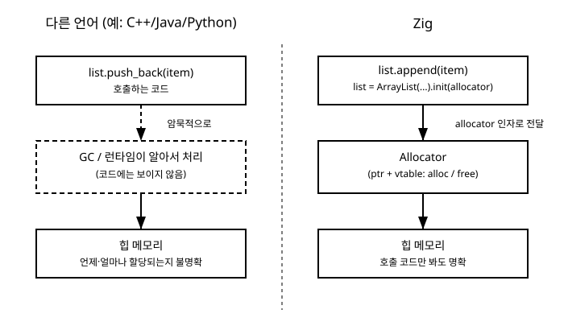

# 15장. 메모리 할당자(Allocator)

[◀ 이전: 14장. comptime 기초](ch14-comptime기초.md) | [📖 목차](00-목차.md) | [다음: 16장. 열거형과 유니온 ▶](ch16-열거형과유니온.md)


1장에서 Zig의 핵심 설계 철학 중 하나로 "숨겨진 메모리 할당이 없다(no hidden memory allocations)"는 원칙을 소개했습니다. 그리고 12장에서는 `defer`와 `errdefer`로 자원 해제를 예약하는 관용구를 배웠습니다. 이 장에서는 이 두 가지를 하나로 묶어, Zig가 실제로 힙 메모리를 어떻게 다루는지 그 실체를 자세히 들여다봅니다.

Zig에는 C++이나 Java, Python 같은 언어에 있는 가비지 컬렉터(GC)가 없습니다. `new`를 누르면 어딘가에서 자동으로 메모리가 마련되고, 더 이상 쓰이지 않으면 런타임이 알아서 회수해주는 방식도 없습니다. 대신 Zig의 표준 라이브러리는 메모리가 필요한 모든 함수와 자료구조에 **할당자(allocator)**를 명시적인 인자로 요구합니다. 이 장을 마치면 왜 지금까지 예제에서 `std.ArrayList(i32).init(allocator)`처럼 `allocator`라는 값을 계속 전달해야 했는지, 그리고 그 값이 실제로 무엇을 하는지 정확히 이해하게 될 것입니다.

## 이 장에서 다루는 내용

- 왜 Zig는 메모리 할당을 항상 명시적인 매개변수로 다루는가
- `std.mem.Allocator`라는 공통 인터페이스의 개념과 그것이 vtable 기반으로 동작한다는 사실
- 대표적인 할당자들: `GeneralPurposeAllocator`, `ArenaAllocator`, `page_allocator`
- `alloc()`/`free()`로 메모리를 직접 다루고, `defer`로 해제를 예약하는 관용구
- 표준 컨테이너가 할당자를 어떻게 넘겨받는지, 그리고 할당 실패가 에러로 표현된다는 점

## 왜 할당자를 매개변수로 넘기는가

먼저 메모리를 두 종류로 구분해 보겠습니다. 함수 안에서 선언한 지역 변수는 보통 스택(stack)에 놓입니다. 스택 메모리는 함수가 호출될 때 자동으로 마련되고, 함수가 끝나면 자동으로 회수됩니다. 다루기 쉽지만 크기가 컴파일 시점에 정해져 있어야 하고, 함수가 끝나면 사라진다는 제약이 있습니다.

반면 크기가 실행 중에야 결정되는 데이터(예: 사용자가 입력한 만큼의 문자열, 파일에서 읽어온 만큼의 바이트)나, 함수가 끝난 뒤에도 계속 살아 있어야 하는 데이터는 힙(heap)에 놓아야 합니다. 힙 메모리는 프로그래머가 명시적으로 "이만큼 달라"고 요청하고, 다 쓰고 나면 명시적으로 "이제 돌려준다"고 알려주어야 합니다.

C++의 `std::vector`나 자바의 `ArrayList`, 파이썬의 리스트는 이 힙 메모리 요청을 내부적으로 알아서 처리합니다. `vec.push_back(x)`라는 한 줄만 보면 그 안에서 힙 할당이 일어나는지, 일어난다면 어떤 전략으로 일어나는지 코드만 봐서는 알 수 없습니다. 대부분의 상황에서는 편리하지만, 정확히 언제 얼마나 할당이 일어나는지를 통제해야 하는 상황—메모리가 극도로 제한된 임베디드 장치, 지연 시간이 예측 가능해야 하는 실시간 시스템, 혹은 요청마다 메모리 사용량을 엄격히 추적해야 하는 서버—에서는 이 "안 보이는 할당"이 오히려 걸림돌이 됩니다.

Zig는 이 문제를 아주 단순한 규칙으로 해결합니다. **메모리가 필요한 함수는 항상 할당자를 매개변수로 받는다.** 그 결과 함수 시그니처만 봐도 이 함수가 힙 메모리를 쓰는지 아닌지 곧바로 알 수 있고, 호출하는 쪽이 어떤 할당 전략을 쓸지 직접 선택할 수 있습니다.

아래 그림은 이 차이를 요약해서 보여줍니다. 다른 언어에서는 컬렉션에 값을 넣는 코드 한 줄 뒤에 할당 로직이 숨어 있지만, Zig에서는 그 로직을 담당하는 `Allocator` 값이 호출하는 코드에 항상 드러나 있습니다.



## std.mem.Allocator: 하나의 인터페이스, 여러 구현

Zig에는 클래스나 상속이 없습니다. 그런데 `GeneralPurposeAllocator`든 `ArenaAllocator`든, `std.ArrayList(i32).init(allocator)`처럼 똑같은 자리에 넘길 수 있다는 것은 이들이 어떤 공통된 형태를 공유하기 때문입니다. 그 공통 형태가 바로 `std.mem.Allocator`입니다.

`std.mem.Allocator`는 개념적으로 아래와 같은 모습을 하고 있습니다(정확한 필드와 함수 시그니처는 Zig 버전마다 조금씩 다를 수 있지만, 구조 자체는 동일합니다).

```zig
pub const Allocator = struct {
    ptr: *anyopaque,
    vtable: *const VTable,

    pub const VTable = struct {
        alloc: *const fn (*anyopaque, usize, u8, usize) ?[*]u8,
        resize: *const fn (*anyopaque, []u8, u8, usize, usize) bool,
        free: *const fn (*anyopaque, []u8, u8, usize) void,
    };
};
```

`ptr`은 실제 할당자 구현체(예: `GeneralPurposeAllocator`의 내부 상태)를 가리키는 불투명한 포인터이고, `vtable`은 `alloc`, `resize`, `free` 같은 실제 동작을 수행하는 함수 포인터들의 모음입니다. 이런 구조를 흔히 **vtable 기반 인터페이스**라고 부릅니다. C++이나 Java의 상속 기반 인터페이스와 목적은 같습니다—"이 타입은 이런 연산을 지원한다"는 계약을 표현하는 것—하지만 Zig에는 클래스 상속이 없으므로, 함수 포인터 테이블을 직접 담은 평범한 구조체로 그 역할을 대신합니다.

이 덕분에 `GeneralPurposeAllocator`, `ArenaAllocator`, `page_allocator`처럼 서로 완전히 다르게 구현된 할당자들도 각자 `.allocator()`라는 메서드(혹은 그 자체)를 통해 똑같은 `Allocator` 값을 만들어낼 수 있고, 이 값을 받는 함수 쪽에서는 실제 구현이 무엇인지 전혀 신경 쓸 필요가 없습니다. `list.append(x)` 안에서 호출되는 `allocator.alloc(...)`는 그 `allocator`가 실제로 어떤 할당자인지에 따라 완전히 다른 코드를 실행하지만, `ArrayList`를 작성하는 사람은 그 차이를 전혀 알 필요가 없습니다. 이 장에서는 `vtable`을 직접 다룰 일은 없습니다. 표준 라이브러리가 제공하는 할당자들의 `.allocator()` 메서드를 호출해서 `Allocator` 값을 얻고, 그 값을 다른 함수에 넘기는 사용법만 알면 충분합니다.

## 대표적인 할당자들

Zig 표준 라이브러리는 상황에 맞게 고를 수 있는 여러 할당자를 제공합니다. 이 절에서는 가장 자주 쓰이는 세 가지를 살펴봅니다.

### GeneralPurposeAllocator: 안전장치가 달린 범용 할당자

`std.heap.GeneralPurposeAllocator`는 특별한 이유가 없다면 기본으로 선택할 만한 범용 할당자입니다. 이름 그대로 다양한 크기와 패턴의 할당 요청을 무리 없이 처리하도록 설계되었고, 그보다 더 중요한 특징은 **디버그 빌드와 안전 검사가 켜진 빌드에서 메모리 관련 실수를 잡아낸다**는 점입니다. 메모리 누수(할당했지만 해제하지 않은 메모리), 이중 해제(같은 메모리를 두 번 해제), 해제 후 사용(free한 메모리를 다시 읽거나 쓰는 것) 같은 실수들을 프로그램이 종료되는 시점에 구체적인 위치와 함께 알려줍니다.

```zig
const std = @import("std");

pub fn main() !void {
    var gpa = std.heap.GeneralPurposeAllocator(.{}){};
    defer _ = gpa.deinit();
    const allocator = gpa.allocator();

    const message = try allocator.alloc(u8, 5);
    defer allocator.free(message);

    @memcpy(message, "hello");
    std.debug.print("{s}\n", .{message});
}
```

`GeneralPurposeAllocator(.{})`에서 `.{}`는 설정 옵션을 담는 구조체 리터럴로, 여기서는 기본 설정을 그대로 사용한다는 뜻입니다. `gpa.allocator()`를 호출하면 실제로 코드 전체에서 넘겨 쓰는 `Allocator` 값을 얻습니다. `gpa.deinit()`은 할당자를 정리하면서, 그 사이에 해제되지 않은 메모리가 남아 있는지 검사한 결과를 돌려줍니다. 만약 `allocator.free(message)`를 실수로 지우고 실행하면, `gpa.deinit()`이 실행되는 시점에 "메모리 누수가 있었다"는 사실을 디버그 로그로 알려줍니다.

애플리케이션 전체에서 하나의 `GeneralPurposeAllocator`를 만들어 두고, 프로그램 곳곳에 이 할당자를 계속 전달하며 쓰는 것이 일반적인 사용 패턴입니다.

### ArenaAllocator: 한꺼번에 할당하고 한꺼번에 해제

때로는 개별 할당을 하나하나 해제하는 것보다, "이 작업이 끝나면 그동안 할당한 모든 메모리를 한꺼번에 버린다"는 접근이 더 자연스러운 경우가 있습니다. 예를 들어 서버가 요청(request) 하나를 처리하는 동안 문자열을 파싱하고, 임시 구조체를 여러 개 만들고, 응답을 조립하는 과정에서 수많은 작은 할당이 일어날 수 있습니다. 이 할당들을 하나씩 추적하며 해제하는 대신, 요청 처리가 끝나는 순간 그동안 쓴 메모리를 통째로 반납하는 것이 훨씬 간단하고 빠릅니다. 이런 용도에 맞춰 설계된 것이 `std.heap.ArenaAllocator`입니다.

```zig
const std = @import("std");

fn handle_request(arena_allocator: std.mem.Allocator, input: []const u8) !void {
    // 요청 하나를 처리하는 동안 필요한 만큼 자유롭게 할당한다.
    const upper = try arena_allocator.alloc(u8, input.len);
    for (input, 0..) |ch, i| {
        upper[i] = std.ascii.toUpper(ch);
    }
    std.debug.print("처리 결과: {s}\n", .{upper});
    // 여기서 upper를 개별적으로 free할 필요가 없다.
}

pub fn main() !void {
    var arena = std.heap.ArenaAllocator.init(std.heap.page_allocator);
    defer arena.deinit();
    const allocator = arena.allocator();

    try handle_request(allocator, "hello, zig");
    try handle_request(allocator, "another request");
}
```

`ArenaAllocator.init`은 밑바탕이 되는 다른 할당자(위 예제에서는 `page_allocator`)를 받아, 그 위에서 자신만의 방식으로 메모리를 관리합니다. 이 arena를 통해 이루어진 개별 할당들은 따로따로 `free`를 호출할 필요가 없습니다—사실 호출해도 대부분 실질적인 효과가 없습니다. 대신 `arena.deinit()`이 호출되는 순간, 그동안 arena가 확보해 둔 메모리 블록들이 한꺼번에 시스템에 반납됩니다.

이 패턴은 "요청 단위(request-scoped)"로 메모리를 다루는 상황에 특히 잘 맞습니다. 웹 서버의 요청 처리, 한 파일을 파싱하는 동안의 임시 데이터, 게임의 한 프레임(frame) 동안만 필요한 임시 계산 결과 등이 대표적인 예입니다. 반대로 프로그램 전체 수명 동안 계속 살아 있어야 하는 데이터를 arena에 담으면, 그 arena가 해제되는 순간 함께 사라져 버리므로 주의해야 합니다. arena에는 지금까지의 할당을 모두 되돌리고 같은 arena를 다음 작업에 재사용할 수 있게 해주는 `reset()` 메서드도 있어서, 반복되는 요청을 처리할 때마다 새 arena를 만드는 대신 기존 arena를 재사용하는 최적화도 가능합니다.

### page_allocator: 운영체제에 직접 요청하기

`std.heap.page_allocator`는 가장 밑바탕에 있는 할당자로, 할당 요청이 들어올 때마다 운영체제에 직접 메모리 페이지를 요청합니다(리눅스의 `mmap`, 윈도우의 `VirtualAlloc` 같은 시스템 호출을 통해서입니다). 다른 할당자를 거치지 않고 곧바로 커널과 대화하는 셈입니다.

```zig
const std = @import("std");

pub fn main() !void {
    const allocator = std.heap.page_allocator;

    const buffer = try allocator.alloc(u8, 4096);
    defer allocator.free(buffer);

    std.debug.print("페이지 크기만큼의 버퍼를 확보했습니다: {} 바이트\n", .{buffer.len});
}
```

`page_allocator`는 함수 하나를 호출하는 것만으로 바로 쓸 수 있어 간단하지만, 시스템 호출은 상대적으로 비용이 큰 작업이라 작은 메모리를 자주 할당하고 해제하는 패턴에는 비효율적입니다. 그래서 `page_allocator`는 앞서 본 `ArenaAllocator`처럼 다른 할당자가 그 위에서 더 정교한 전략을 구현하기 위한 밑바탕으로 쓰이는 경우가 많고, 애플리케이션 코드에서 직접 쓰는 일은 상대적으로 드뭅니다.

## alloc과 free로 메모리 직접 다루기

세 할당자 모두 `Allocator` 값을 통해 똑같은 방식으로 메모리를 요청하고 반납합니다. 가장 기본이 되는 두 함수는 `alloc`과 `free`입니다.

```zig
const std = @import("std");

pub fn main() !void {
    var gpa = std.heap.GeneralPurposeAllocator(.{}){};
    defer _ = gpa.deinit();
    const allocator = gpa.allocator();

    const count = 10;
    const numbers = try allocator.alloc(i32, count);
    defer allocator.free(numbers);

    for (numbers, 0..) |*slot, i| {
        slot.* = @as(i32, @intCast(i)) * @as(i32, @intCast(i));
    }

    var sum: i32 = 0;
    for (numbers) |n| {
        sum += n;
    }
    std.debug.print("0부터 {}까지 제곱의 합: {}\n", .{ count - 1, sum });
}
```

`allocator.alloc(T, n)`은 타입 `T`의 값 `n`개를 담을 수 있는 메모리를 요청하고, 성공하면 `[]T` 타입의 슬라이스를 돌려줍니다(슬라이스는 13장에서 자세히 다룹니다). 메모리 할당은 항상 실패할 수 있는 작업이므로—운영체제가 더 이상 내줄 메모리가 없을 수도 있으니까요—`alloc`의 반환 타입은 실제로 `![]T`라는 에러 유니온입니다. 그래서 `try`를 붙여 호출해야 합니다. 이 에러 처리 방식은 11장에서 배운 그대로입니다.

`allocator.free(slice)`는 그 슬라이스가 가리키던 메모리를 할당자에게 돌려줍니다. 여기서 아주 중요한 관용구가 등장합니다. **할당에 성공한 바로 다음 줄에 `defer allocator.free(...)`를 적어 두는 것**입니다. 12장에서 배운 대로 `defer`는 현재 스코프가 끝나는 순간(정상 종료든, 중간에 `return`으로 빠져나가든) 예약된 코드를 실행합니다. 할당과 해제를 이렇게 짝지어 두면, 이후 함수 안에 `return`이 몇 개나 추가되어도 메모리 해제를 빠뜨릴 걱정이 없습니다.

```zig
fn read_and_process(allocator: std.mem.Allocator, should_process: bool) !void {
    const buffer = try allocator.alloc(u8, 256);
    defer allocator.free(buffer); // 이 함수의 모든 반환 경로에서 실행된다

    if (!should_process) {
        return; // 여기서 반환해도 buffer는 정확히 해제된다
    }

    // ... buffer를 이용한 처리 ...
}
```

## 표준 컨테이너와 할당자

지금까지 `alloc`/`free`로 메모리를 직접 다뤘지만, 실전에서는 크기가 변하는 배열을 직접 관리하기보다 표준 라이브러리가 제공하는 컨테이너를 쓰는 경우가 훨씬 많습니다. 이런 컨테이너들도 예외 없이 생성 시점에 할당자를 요구합니다.

```zig
const std = @import("std");

pub fn main() !void {
    var gpa = std.heap.GeneralPurposeAllocator(.{}){};
    defer _ = gpa.deinit();
    const allocator = gpa.allocator();

    var list = std.ArrayList(i32).init(allocator);
    defer list.deinit();

    var i: i32 = 1;
    while (i <= 5) : (i += 1) {
        try list.append(i * i);
    }

    std.debug.print("제곱수 목록: ", .{});
    for (list.items) |value| {
        std.debug.print("{} ", .{value});
    }
    std.debug.print("\n", .{});
}
```

`std.ArrayList(i32).init(allocator)`는 빈 리스트를 만들면서 앞으로 필요한 메모리를 어디서 얻어올지 그 자리에서 정합니다. `list.append(...)`를 호출할 때 내부 버퍼가 가득 차 있으면, `ArrayList`는 이 `allocator`에게 더 큰 버퍼를 요청해서 기존 값을 옮기고 새 값을 추가합니다. 이 과정에서 할당이 실패할 수 있으므로 `append` 역시 에러를 반환할 수 있는 함수이고, 그래서 `try`가 붙습니다. 그리고 리스트를 다 쓴 뒤에는 `list.deinit()`으로 내부 버퍼를 할당자에게 돌려주어야 하며, 이 역시 `defer`와 짝을 지어 예약해 두는 것이 관용적입니다.

`ArrayList` 외에도 `std.AutoHashMap`, `std.StringHashMap`처럼 크기가 가변적인 자료구조를 다루는 표준 컨테이너들은 모두 같은 규칙을 따릅니다. 생성할 때 `Allocator`를 넘겨받고, 다 쓴 뒤에는 `deinit()`으로 해제합니다. 어떤 컨테이너를 쓰든 이 패턴—`init(allocator)`로 시작해서 `defer x.deinit()`으로 마무리하는 흐름—은 항상 동일하므로, 한 번 익혀 두면 표준 라이브러리의 다른 자료구조를 만나도 낯설지 않을 것입니다.

## 할당 실패는 평범한 에러다

Zig에서는 메모리 할당이 실패해도 프로그램이 갑자기 죽거나 예외가 튀어 오르지 않습니다. 대신 11장에서 배운 것과 똑같은 방식으로, 실패 가능성이 `error.OutOfMemory`라는 평범한 에러 값으로 반환 타입에 드러납니다.

```zig
const std = @import("std");

fn try_allocate_big(allocator: std.mem.Allocator) void {
    const huge = allocator.alloc(u8, 1024 * 1024 * 1024 * 1024) catch |err| {
        std.debug.print("할당 실패: {}\n", .{err});
        return;
    };
    defer allocator.free(huge);
}
```

1TB 크기의 메모리를 요청하면 대부분의 환경에서 실패할 것이고, 그 실패는 `error.OutOfMemory`라는 값으로 고스란히 드러납니다. 호출하는 쪽은 이를 `try`로 위임하거나, `catch`로 직접 처리하거나, 아니면 재시도 로직을 짤 수도 있습니다. 다른 언어에서 흔히 `OutOfMemoryError` 같은 예외로 처리되던 상황이, Zig에서는 다른 모든 실패 가능성과 동일하게 함수의 반환 타입에 나타나는 평범한 값으로 취급됩니다. 이는 1장과 11장에서 강조한 "숨겨진 제어 흐름이 없다"는 원칙이 메모리 할당에도 예외 없이 적용된 결과입니다.

## 요약

- Zig는 가비지 컬렉터나 숨겨진 `malloc` 없이, 메모리가 필요한 모든 표준 라이브러리 함수와 자료구조에 `Allocator`를 명시적인 매개변수로 요구합니다.
- `std.mem.Allocator`는 `ptr`(구현체를 가리키는 포인터)과 `vtable`(alloc/resize/free 함수 포인터 모음)로 이루어진 인터페이스로, 서로 다른 할당자 구현들이 동일한 방식으로 코드에 전달될 수 있게 해줍니다.
- `GeneralPurposeAllocator`는 메모리 누수·이중 해제 등을 감지하는 범용 할당자로, 특별한 이유가 없다면 기본 선택입니다.
- `ArenaAllocator`는 개별 해제 대신 마지막에 한꺼번에 해제하는 전략을 쓰며, 요청 단위 처리처럼 수명이 짧고 명확한 작업에 적합합니다.
- `page_allocator`는 운영체제로부터 직접 메모리를 요청하는 가장 밑바탕의 할당자입니다.
- `allocator.alloc()`으로 메모리를 얻고 `allocator.free()`로 돌려주며, 할당한 직후 `defer allocator.free(...)`를 적어 해제를 예약하는 것이 관용적인 패턴입니다.
- `std.ArrayList(i32).init(allocator)`처럼 표준 컨테이너는 생성 시점에 할당자를 받고, `deinit()`으로 내부 메모리를 반납합니다.
- 메모리 할당 실패는 `error.OutOfMemory`라는 평범한 에러 값으로 표현되며, 다른 에러와 동일한 방식(`try`/`catch`)으로 처리합니다.

## 연습문제

1. C++의 `std::vector`와 Zig의 `std.ArrayList`가 메모리를 할당받는 방식의 차이를 한 문단으로 설명해 보세요. 이 차이가 왜 "숨겨진 메모리 할당이 없다"는 원칙과 연결되는지도 함께 적어 보세요.
2. `GeneralPurposeAllocator`와 `ArenaAllocator`는 각각 어떤 상황에 더 적합한지, 구체적인 예를 하나씩 들어 설명해 보세요.
3. `allocator.alloc(i32, 20)`으로 정수 20개를 담을 슬라이스를 할당하고, 각 원소에 인덱스의 세 배 값을 채운 뒤 합계를 출력하는 프로그램을 작성해 보세요. `defer`로 해제도 잊지 마세요.
4. `GeneralPurposeAllocator`로 메모리를 할당한 뒤 `free`를 호출하는 줄을 일부러 지우고 프로그램을 실행해 보세요. `gpa.deinit()`이 어떤 결과를 알려주는지 관찰해 보세요.
5. `std.ArrayList(u8)`을 사용해 사용자가 지정한 개수만큼 알파벳을 순서대로 채워 넣는 함수를 작성하고, 어떤 할당자를 넘겨도 동작하도록 매개변수 타입을 `std.mem.Allocator`로 받아보세요.

---

[◀ 이전: 14장. comptime 기초](ch14-comptime기초.md) | [📖 목차](00-목차.md) | [다음: 16장. 열거형과 유니온 ▶](ch16-열거형과유니온.md)
