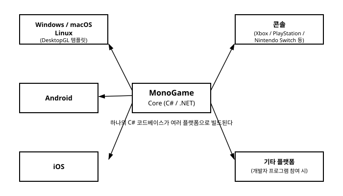

# 1장. MonoGame이란 무엇인가

[◀ 이전: 목차](00-목차.md) | [📖 목차](00-목차.md) | [다음: 2장. 개발 환경 설정과 첫 프로젝트 ▶](ch02-개발환경설정과첫프로젝트.md)

게임을 만들고 싶다는 마음으로 이 책을 펼친 독자라면, 아마 한 번쯤 "어떤 도구로 시작해야 할까"라는 질문 앞에서 망설여본 적이 있을 것이다. 유니티(Unity)나 언리얼(Unreal) 같은 거대한 상용 엔진도 있고, 파이썬의 Pygame이나 C의 raylib처럼 가벼운 라이브러리도 있다. 이 책이 다루는 MonoGame은 이 스펙트럼에서 조금 독특한 위치를 차지한다. C#과 .NET이라는 성숙한 생태계 위에서, 게임 개발에 필요한 저수준 기능(그래픽, 입력, 오디오, 콘텐츠 관리)만을 충실히 제공하는 프레임워크다. 이번 장에서는 MonoGame이 어디서 왔고, 무엇을 할 수 있으며, 비슷한 도구들과 비교했을 때 어떤 위치에 있는지를 살펴본다.

## XNA의 유산에서 시작된 오픈소스 프로젝트

MonoGame의 역사를 이해하려면 먼저 마이크로소프트의 XNA Framework 이야기부터 해야 한다. 2006년, 마이크로소프트는 Xbox 360과 Windows에서 동작하는 게임을 C#으로 만들 수 있게 해주는 XNA Framework를 발표했다. 당시로서는 상당히 파격적인 시도였다. C++와 DirectX를 직접 다루던 게임 개발 방식 대신, 관리되는(managed) 언어인 C#으로 게임 루프와 그래픽스 파이프라인을 다룰 수 있게 되면서 많은 인디 개발자와 학생들이 XNA를 통해 게임 프로그래밍에 입문했다. Visual Studio와의 긴밀한 통합, `Game` 클래스를 중심으로 한 명확한 구조, 콘텐츠를 자동으로 변환해주는 콘텐츠 파이프라인 등은 당시 개발자들에게 큰 인상을 남겼다.

하지만 마이크로소프트는 2013년경 XNA에 대한 공식 지원을 사실상 종료했다. 더 이상 새로운 버전이 나오지 않고, Windows 8 이후의 플랫폼이나 새로운 콘솔 세대를 지원하지 않게 된 것이다. XNA로 게임을 만들던 개발자와 이미 XNA 기반 게임을 출시한 스튜디오 입장에서는 곤란한 상황이었다. 자신들이 투자한 코드베이스가 미래를 잃어버릴 위기에 처했기 때문이다.

바로 이 지점에서 MonoGame이 등장한다. MonoGame은 XNA의 API를 최대한 그대로 재현하면서, 이를 오픈소스로 새롭게 구현한 프로젝트로 시작되었다. 즉 MonoGame은 XNA를 계승했다기보다는, XNA가 남긴 API와 개발 방식이라는 "정신"을 이어받아 완전히 새로운 구현체를 오픈소스 커뮤니티가 만들어낸 것에 가깝다. 덕분에 기존 XNA 프로젝트는 비교적 적은 수정만으로 MonoGame으로 이전할 수 있었고, `Game`, `GraphicsDeviceManager`, `SpriteBatch` 같은 핵심 타입들의 이름과 사용법이 여전히 낯익게 느껴지는 이유도 여기에 있다. 이후 MonoGame은 XNA가 멈춰 선 지점에서 만족하지 않고, 오픈소스 커뮤니티의 기여를 통해 XNA가 다루지 못했던 새로운 플랫폼과 그래픽 API로 계속 영역을 넓혀왔다.

## MonoGame의 특징

MonoGame을 한 문장으로 요약하면 "C#/.NET 기반의 오픈소스 크로스플랫폼 게임 프레임워크"라고 할 수 있다. 이 짧은 문장 안에는 몇 가지 중요한 특징이 담겨 있다.

**C#과 .NET 생태계에 기반한다.** MonoGame으로 게임을 만든다는 것은 곧 C# 언어와 .NET 런타임 위에서 게임을 만든다는 뜻이다. NuGet 패키지 관리, `dotnet` CLI, 강력한 타입 시스템과 최신 C# 언어 기능(패턴 매칭, 레코드, nullable 참조 타입 등)을 게임 코드에서도 그대로 활용할 수 있다. 게임 로직뿐 아니라 데이터 파싱, 네트워킹, 파일 입출력 같은 주변 작업에도 .NET의 방대한 표준 라이브러리와 서드파티 패키지를 자유롭게 끌어다 쓸 수 있다는 것은 MonoGame의 큰 장점이다.

**폭넓은 플랫폼 지원.** MonoGame은 이름 그대로 "모노(mono, 단일한)"라는 어원처럼 하나의 코드베이스로 다양한 플랫폼을 겨냥한다. 데스크톱에서는 Windows, macOS, Linux를 `DesktopGL`이라는 이름의 템플릿을 통해 지원하는데, 이는 내부적으로 OpenGL 기반 렌더링을 사용해 세 운영체제에서 동일한 코드로 동작하는 실행 파일을 만들 수 있게 해준다. 여기에 더해 Android와 iOS 같은 모바일 플랫폼, 그리고 별도의 개발자 프로그램을 통해 Xbox, PlayStation, Nintendo Switch 같은 콘솔 플랫폼까지도 지원 범위에 포함된다. 아래 그림은 MonoGame 코어를 중심으로 이런 플랫폼들이 뻗어나가는 구조를 보여준다.

물론 이 책에서는 별도의 콘솔 개발 키트나 유료 라이선스 없이 누구나 시작할 수 있는 데스크톱(DesktopGL) 환경을 기준으로 실습을 진행한다. 하지만 뒤에서 배울 `Game`, `SpriteBatch`, 콘텐츠 파이프라인 같은 핵심 개념은 플랫폼이 바뀌어도 거의 그대로 적용된다는 점을 기억해두면 좋다. 이 부분은 17장 크로스플랫폼 배포에서 다시 다룬다.

**오픈소스이자 커뮤니티 중심.** MonoGame은 Microsoft Public License(Ms-PL) 아래 공개된 오픈소스 프로젝트로, 소스 코드가 GitHub에 공개되어 있으며 전 세계 기여자들이 개발에 참여한다. 상용 프로젝트에 사용하는 데도 제약이 없어, 개인 인디 개발자부터 소규모 스튜디오까지 부담 없이 채택할 수 있다.

## 검증된 프레임워크

"오픈소스 커뮤니티가 유지하는 프레임워크"라고 하면 실제 프로덕션 수준의 게임을 만들 수 있을지 의문이 들 수도 있다. 하지만 MonoGame은 등장한 지 십 년이 넘는 시간 동안 다양한 규모의 인디 게임과 상용 게임을 통해 꾸준히 검증되어 왔다. 스팀(Steam)이나 콘솔 플랫폼의 스토어를 둘러보면, MonoGame으로 개발되었다고 밝힌 게임들을 어렵지 않게 찾아볼 수 있다. 이는 MonoGame이 단순히 학습용 장난감이 아니라, 실제 출시 가능한 완성도의 게임을 만들어낼 수 있는 실전 프레임워크임을 보여주는 좋은 증거다. 물론 유니티나 언리얼처럼 방대한 에디터와 에셋 생태계를 기대할 수는 없지만, "코드로 직접 게임을 설계하고 싶은" 개발자에게는 오히려 이런 담백함이 매력으로 다가온다.

## raylib와 비교해보는 MonoGame의 위치

게임 프로그래밍 입문서를 여러 권 살펴본 독자라면 C 언어 기반의 raylib를 먼저 접했을 수도 있다. 두 도구를 나란히 놓고 보면 MonoGame이 어떤 성격의 프레임워크인지 더 선명하게 드러난다.

raylib는 C로 작성된 가볍고 단순한 라이브러리다. `InitWindow` 하나로 창을 띄우고, `while` 반복문 안에서 직접 그리기 함수를 호출하는 식으로, 프로그래머가 게임 루프 자체를 손으로 작성한다. 별도의 클래스 구조나 강제되는 아키텍처가 없어서, 최소한의 코드로 즉시 결과를 확인할 수 있다는 것이 raylib의 강점이다.

반면 MonoGame은 C#/.NET 생태계에 완전히 통합된, 더 구조화된 프레임워크다. 게임 루프는 `Game`이라는 기반 클래스가 대신 관리해주고, 개발자는 `Initialize`, `LoadContent`, `Update`, `Draw`처럼 정해진 생명주기 메서드를 오버라이드하는 방식으로 게임을 구성한다. 이미지나 사운드 같은 에셋도 직접 파일을 읽어 들이기보다, 콘텐츠 파이프라인(Content Pipeline)이라는 별도의 빌드 단계를 거쳐 플랫폼에 최적화된 형태로 미리 가공한 뒤 코드에서는 이름만으로 불러 쓰는 구조를 취한다. 이런 구조는 초반에 익혀야 할 개념이 조금 더 많다는 단점이 있지만, 프로젝트가 커질수록 코드의 역할이 명확하게 분리되고 유지보수하기 쉬워진다는 장점으로 돌아온다.

정리하면, raylib가 "최소한의 껍데기로 그래픽스 API에 가깝게 다가가는 라이브러리"라면, MonoGame은 "C#이라는 언어와 .NET이라는 생태계의 힘을 빌려, 게임 개발에 필요한 구조를 미리 갖춰놓은 프레임워크"라고 할 수 있다. 어느 쪽이 더 우월하다기보다는, 목표로 하는 개발 경험과 언어 생태계가 다른 것이다. 이 책은 그중에서도 MonoGame이 제공하는 `Game` 클래스 기반의 구조와 콘텐츠 파이프라인을 차근차근 익혀가는 데 초점을 맞춘다. 다음 장부터는 실제로 개발 환경을 갖추고, MonoGame이 만들어주는 첫 프로젝트의 뼈대를 직접 살펴본다.

## 요약

- MonoGame은 마이크로소프트의 XNA Framework(2013년경 공식 지원 종료)가 남긴 API와 개발 방식을 이어받아, 오픈소스 커뮤니티가 처음부터 새롭게 구현한 크로스플랫폼 게임 프레임워크다.
- C#과 .NET 생태계를 기반으로 하며, `Game`, `GraphicsDeviceManager`, `SpriteBatch` 같은 XNA 시절부터 이어진 핵심 타입들을 그대로 사용한다.
- Windows/macOS/Linux(DesktopGL 템플릿) 데스크톱 환경은 물론, Android/iOS 같은 모바일 플랫폼, 그리고 콘솔 플랫폼까지 폭넓게 지원한다.
- 십 년 넘게 다양한 인디/상용 게임을 통해 실전에서 검증된 프레임워크다.
- raylib가 가벼운 C 라이브러리로서 그래픽스 API에 가깝게 다가간다면, MonoGame은 `Game` 클래스 기반 아키텍처와 콘텐츠 파이프라인을 갖춘, C#/.NET 생태계에 완전히 통합된 더 구조화된 프레임워크다.

## 연습문제

1. XNA Framework와 MonoGame의 관계를 자신의 말로 설명해보자. MonoGame은 XNA를 "계승"한 것과 "재구현"한 것 중 어느 쪽에 더 가까운가?
2. 마이크로소프트가 XNA에 대한 공식 지원을 종료했을 때, 기존 XNA 개발자들이 겪었을 어려움은 무엇이었을지 생각해보고, MonoGame이 그 문제를 어떻게 해결해주었는지 설명해보자.
3. MonoGame이 지원하는 플랫폼 중 데스크톱 플랫폼(Windows/macOS/Linux)을 하나로 묶어주는 템플릿의 이름은 무엇이며, 왜 그런 방식이 가능한지 이번 장의 내용을 바탕으로 설명해보자.
4. raylib와 MonoGame을 비교했을 때, 게임 루프를 다루는 방식에 어떤 차이가 있는지 설명해보자.
5. 만약 여러분이 짧은 게임 잼(game jam)을 위해 도구를 골라야 한다면 raylib와 MonoGame 중 어느 쪽을 선택하겠는가? 그리고 오랜 기간 유지보수할 상용 프로젝트라면 어떨지, 그 이유와 함께 생각해보자.

---

[◀ 이전: 목차](00-목차.md) | [📖 목차](00-목차.md) | [다음: 2장. 개발 환경 설정과 첫 프로젝트 ▶](ch02-개발환경설정과첫프로젝트.md)
