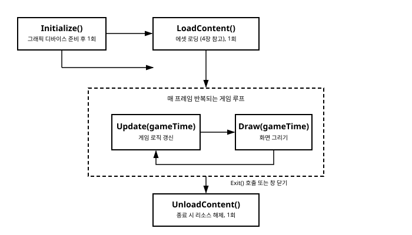

# 3장. 게임 루프와 Game 클래스 수명주기

[◀ 이전: 2장. 개발 환경 설정과 첫 프로젝트](ch02-개발환경설정과첫프로젝트.md) | [📖 목차](00-목차.md) | [다음: 4장. 콘텐츠 파이프라인(Content Pipeline) ▶](ch04-콘텐츠파이프라인.md)


2장에서 새 MonoGame 프로젝트를 만들면 `Game1.cs`라는 파일이 자동으로 생성되고, 그 안에는 이미 `Initialize`, `LoadContent`, `Update`, `Draw` 같은 메서드들이 뼈대만 갖춘 채로 놓여 있는 것을 보았을 것이다. 이번 장에서는 이 메서드들이 정확히 언제, 어떤 순서로, 왜 호출되는지를 하나씩 뜯어본다. 이 수명주기를 제대로 이해하지 못하면 "왜 텍스처가 null인가", "왜 캐릭터가 컴퓨터 성능에 따라 다른 속도로 움직이는가" 같은 문제에 부딪혔을 때 원인을 짚어내기 어렵다. 반대로 이 장의 내용을 확실히 익혀두면 이후 장들에서 다루는 모든 기법—콘텐츠 로딩, 그리기, 입력 처리, 애니메이션—이 "게임 루프의 어느 지점에서 무엇을 해야 하는가"라는 하나의 틀 안에 자연스럽게 자리 잡는다.

## Game 클래스를 상속한다는 것

MonoGame 프로젝트의 `Game1` 클래스는 다음과 같이 `Microsoft.Xna.Framework.Game`을 상속한다.

```csharp
public class Game1 : Game
{
    private GraphicsDeviceManager _graphics;
    private SpriteBatch _spriteBatch;

    public Game1()
    {
        _graphics = new GraphicsDeviceManager(this);
        Content.RootDirectory = "Content";
        IsMouseVisible = true;
    }

    protected override void Initialize()
    {
        base.Initialize();
    }

    protected override void LoadContent()
    {
        _spriteBatch = new SpriteBatch(GraphicsDevice);
    }

    protected override void Update(GameTime gameTime)
    {
        base.Update(gameTime);
    }

    protected override void Draw(GameTime gameTime)
    {
        GraphicsDevice.Clear(Color.CornflowerBlue);
        base.Draw(gameTime);
    }
}
```

`Game` 클래스는 내부적으로 게임 루프를 돌리는 엔진 역할을 한다. 우리가 할 일은 이 엔진이 정해진 시점마다 호출해주는 메서드들을 재정의(override)해서 그 안에 우리 게임의 로직을 채워 넣는 것뿐이다. 즉 "루프를 언제 어떻게 돌릴지"는 `Game` 클래스가 책임지고, "루프의 각 단계에서 무엇을 할지"는 우리가 책임진다. 이런 구조를 템플릿 메서드 패턴이라고 부르기도 하는데, MonoGame을 비롯한 대부분의 게임 프레임워크가 이 구조를 채택하고 있다.

`Main` 메서드에서 `using var game = new Game1(); game.Run();`을 호출하면, `Run()` 내부에서 아래에서 설명할 수명주기 메서드들이 정해진 순서대로 호출되기 시작한다.

## 수명주기 메서드의 호출 순서

`Game.Run()`이 호출된 이후 각 메서드는 다음 순서로 실행된다.

1. **`Initialize()`** — 게임 시작 시 딱 한 번 호출된다.
2. **`LoadContent()`** — `Initialize()` 직후, 역시 한 번 호출된다.
3. **`Update(GameTime gameTime)`** / **`Draw(GameTime gameTime)`** — 게임이 종료될 때까지 매 프레임 반복해서 번갈아 호출된다.
4. **`UnloadContent()`** — 게임이 종료될 때(창을 닫거나 `Exit()`을 호출했을 때) 한 번 호출된다.



### Initialize() — 그래픽 디바이스 준비 후의 초기화

`Initialize()`는 `GraphicsDevice`가 생성되고 사용할 준비가 끝난 직후에 호출된다. 그래픽과 무관한 게임 상태를 초기화하는 데 적합한 곳이다. 예를 들어 게임 오브젝트의 초기 위치·속도 값을 설정하거나, 화면 해상도를 결정하거나(`_graphics.PreferredBackBufferWidth` 등을 설정하고 `_graphics.ApplyChanges()`를 호출), 물리 상수를 세팅하는 작업이 여기에 들어간다.

```csharp
protected override void Initialize()
{
    _graphics.PreferredBackBufferWidth = 1280;
    _graphics.PreferredBackBufferHeight = 720;
    _graphics.ApplyChanges();

    _playerPosition = new Vector2(100, 100);
    _playerSpeed = 200f; // 초당 픽셀 이동량

    base.Initialize();
}
```

주의할 점은, `Initialize()` 시점에는 아직 콘텐츠(텍스처, 사운드 등)를 로드하기에 적합하지 않다는 것이다. 물론 기술적으로는 `Initialize()` 안에서 `Content.Load<T>()`를 호출해도 동작은 하지만, MonoGame의 관례상 콘텐츠 로딩은 다음 단계인 `LoadContent()`에 위임한다. 관심사를 이렇게 분리해두면 "그래픽 관련 설정"과 "에셋 로딩"이 코드 상에서도 명확히 구분되어 유지보수가 쉬워진다.

### LoadContent() — 에셋을 불러오는 곳

`LoadContent()`는 게임에서 사용할 텍스처, 폰트, 사운드 등의 에셋을 불러오는 자리다. 이 메서드는 `Initialize()` 이후 한 번 호출되며, `GraphicsDevice`가 완전히 준비된 상태이므로 `SpriteBatch` 같은, 그래픽 디바이스를 필요로 하는 객체도 안전하게 생성할 수 있다.

```csharp
protected override void LoadContent()
{
    _spriteBatch = new SpriteBatch(GraphicsDevice);
    _playerTexture = Content.Load<Texture2D>("player");
    _jumpSound = Content.Load<SoundEffect>("jump");
}
```

여기서 사용한 `Content.Load<Texture2D>("player")`가 바로 4장에서 자세히 다룰 콘텐츠 파이프라인의 진입점이다. `Content`는 `Game` 클래스가 기본으로 제공하는 `ContentManager` 프로퍼티이며, MGCB로 미리 빌드해둔 `.xnb` 파일을 찾아 메모리에 올려준다. 지금 단계에서는 "에셋 로딩은 `LoadContent()` 안에서 한다"는 규칙만 기억해두면 충분하다.

그래픽 디바이스가 재설정되는 경우(예: 창 크기 변경, 전체화면 전환, 디바이스 손실 복구 등)에는 `LoadContent()`가 다시 호출될 수도 있다. 따라서 `LoadContent()` 안의 코드는 여러 번 호출되어도 문제가 없도록 작성하는 것이 안전하다.

### Update(GameTime gameTime) — 게임 로직의 심장

`Update()`는 게임이 실행되는 동안 매 프레임 호출되며, 게임의 모든 논리적 상태 변화가 이곳에서 일어난다. 캐릭터 이동, 충돌 판정, 입력 처리, AI 계산, 애니메이션 프레임 갱신 등—화면에 "그리는" 작업을 제외한 거의 모든 게임 로직이 `Update()`에 들어간다고 생각하면 된다.

```csharp
protected override void Update(GameTime gameTime)
{
    if (GamePad.GetState(PlayerIndex.One).Buttons.Back == ButtonState.Pressed ||
        Keyboard.GetState().IsKeyDown(Keys.Escape))
    {
        Exit();
    }

    float deltaTime = (float)gameTime.ElapsedGameTime.TotalSeconds;
    KeyboardState keyboard = Keyboard.GetState();

    if (keyboard.IsKeyDown(Keys.Right))
    {
        _playerPosition.X += _playerSpeed * deltaTime;
    }

    base.Update(gameTime);
}
```

`Update()`는 그래픽을 직접 건드리지 않는다는 원칙을 지키는 것이 좋다. 즉 `SpriteBatch.Draw()` 같은 호출은 `Update()`가 아니라 `Draw()` 안에서만 이루어져야 한다. 이렇게 역할을 나누면 "논리"와 "표현"이 분리되어, 나중에 고정 타임스텝을 조정하거나 화면 갱신 빈도를 바꾸는 등의 변경이 훨씬 쉬워진다.

### Draw(GameTime gameTime) — 화면을 그리는 곳

`Draw()` 역시 매 프레임 호출되지만, 여기서 하는 일은 오직 "현재 게임 상태를 화면에 그려내는 것"뿐이다. 게임 상태 자체를 변경하는 로직(위치 갱신, 점수 계산 등)은 `Draw()`에 넣지 않는다.

```csharp
protected override void Draw(GameTime gameTime)
{
    GraphicsDevice.Clear(Color.CornflowerBlue);

    _spriteBatch.Begin();
    _spriteBatch.Draw(_playerTexture, _playerPosition, Color.White);
    _spriteBatch.End();

    base.Draw(gameTime);
}
```

`SpriteBatch`를 이용한 2D 그리기는 5장에서 본격적으로 다룬다. 여기서는 `Draw()`가 매 프레임 반복 호출되며, 그 시작 부분에서 항상 화면을 지운다는 점에 주목하자.

### GraphicsDevice.Clear()를 매 프레임 호출하는 이유

`GraphicsDevice.Clear(Color.CornflowerBlue)`는 화면(정확히는 현재 렌더 타깃의 색상 버퍼)을 지정한 색으로 초기화한다. 이 호출을 매 프레임 빠뜨리지 않고 해주어야 하는 이유는 MonoGame의 그리기 방식이 "즉시 모드(immediate mode)"에 가깝기 때문이다. 즉 화면에 그려진 내용은 자동으로 유지되지 않으며, 각 프레임마다 그려야 할 것을 처음부터 다시 그려야 한다.

만약 `Clear()`를 생략하면 어떻게 될까? 이전 프레임에 그렸던 내용의 잔상이나, 그래픽 카드 메모리에 남아 있던 임의의 데이터가 그대로 화면에 남아 지저분하게 겹쳐 보이는 현상(더블 버퍼링 환경에서는 두 프레임이 번갈아 나타나는 "깜빡임"으로 보이기도 한다)이 발생한다. 이는 raylib 같은 다른 즉시 모드 렌더링 기반 프레임워크에서도 동일하게 나타나는 특성으로, "매 프레임 지우고 다시 그린다"는 원칙은 실시간 그래픽 프로그래밍 전반에 걸친 공통 패턴이다. `Draw()`의 맨 앞에서 `Clear()`를 호출하는 습관을 들여두면 이런 문제를 원천적으로 피할 수 있다.

### UnloadContent() — 종료 시 리소스 해제

`UnloadContent()`는 게임이 종료될 때 한 번 호출되며, `LoadContent()`에서 명시적으로 관리해야 하는 리소스를 정리하는 자리다.

```csharp
protected override void UnloadContent()
{
    // ContentManager를 통해 로드한 대부분의 리소스는
    // Content.Unload()가 알아서 해제해준다.
    // 이 메서드는 ContentManager로 관리하지 않는
    // 별도의 리소스(직접 생성한 GraphicsResource 등)를 정리할 때 사용한다.
}
```

실제로는 `Content.Load<T>()`로 불러온 리소스 대부분은 `ContentManager`가 내부적으로 추적하고 있다가 게임 종료 시 자동으로 해제해주므로, `UnloadContent()`에서 직접 손댈 일이 많지는 않다. 다만 `ContentManager`를 거치지 않고 직접 만든 `RenderTarget2D`나 `VertexBuffer` 같은 그래픽 리소스가 있다면 여기서 `Dispose()`를 호출해 정리해주는 것이 안전하다.

## GameTime과 델타타임

`Update()`와 `Draw()`는 둘 다 `GameTime` 타입의 매개변수를 받는다. `GameTime`은 프레임 간의 시간 흐름에 대한 정보를 담고 있으며, 주로 쓰이는 두 프로퍼티는 다음과 같다.

- **`gameTime.ElapsedGameTime`** — 바로 이전 프레임에서 지금 프레임까지 경과한 시간(`TimeSpan`).
- **`gameTime.TotalGameTime`** — 게임이 시작된 이후 지금까지 누적된 총 경과 시간(`TimeSpan`).

이 둘을 혼동하면 안 된다. `ElapsedGameTime`은 "한 프레임의 폭"이고, `TotalGameTime`은 "게임 시작부터 지금까지의 누적 시간"이다. 캐릭터를 부드럽게 이동시키려면 프레임 간 시간 차이인 `ElapsedGameTime`을 사용해야 하고, "게임 시작 후 10초가 지나면 몬스터를 출현시킨다"처럼 절대적인 경과 시간이 필요할 때는 `TotalGameTime`을 사용한다.

### 델타타임 기반 이동

프레임 레이트가 항상 일정하다고 가정하고 "매 프레임 5픽셀씩 이동"과 같은 코드를 짜면, 컴퓨터 성능에 따라 초당 프레임 수(FPS)가 달라질 때 게임 속도도 함께 달라지는 문제가 생긴다. 이를 해결하는 표준적인 방법이 델타타임(delta time)을 사용하는 것이다.

```csharp
protected override void Update(GameTime gameTime)
{
    double deltaSeconds = gameTime.ElapsedGameTime.TotalSeconds;

    // 초당 200픽셀의 속도로 이동 (프레임 레이트와 무관하게 일정한 속도 유지)
    _playerPosition.X += (float)(_playerSpeed * deltaSeconds);

    base.Update(gameTime);
}
```

`ElapsedGameTime.TotalSeconds`는 `TimeSpan`을 초 단위의 `double`로 환산한 값이다. "초당 이동 속도 × 경과 시간(초)"의 형태로 계산하면, 프레임이 자주 갱신되는 환경에서는 한 번에 조금씩, 프레임이 드물게 갱신되는 환경에서는 한 번에 크게 이동하게 되어 결과적으로 실제 시간 기준의 이동 속도가 일정하게 유지된다. 이 패턴은 이후 7장에서 벡터 연산과 함께 캐릭터·발사체 이동을 다룰 때도 계속 사용하게 될 기본기다.

## 고정 타임스텝과 가변 타임스텝

MonoGame의 `Game` 클래스는 게임 루프를 얼마나 자주 돌릴지를 두 가지 방식 중 하나로 제어할 수 있다.

- **`IsFixedTimeStep`** (`bool`, 기본값 `true`) — 고정 타임스텝을 사용할지 여부.
- **`TargetElapsedTime`** (`TimeSpan`, 기본값 1/60초, 약 16.67ms) — 고정 타임스텝 사용 시 목표로 하는 프레임 간격.

```csharp
public Game1()
{
    _graphics = new GraphicsDeviceManager(this);
    Content.RootDirectory = "Content";

    IsFixedTimeStep = true;
    TargetElapsedTime = TimeSpan.FromSeconds(1.0 / 60.0); // 기본값과 동일
}
```

### 고정 타임스텝 (기본값)

`IsFixedTimeStep`이 `true`이면 MonoGame은 `TargetElapsedTime`에 지정된 간격(기본 1/60초)으로 `Update()`를 호출하려고 시도한다. 실제 프레임 처리가 이 간격보다 빨리 끝나면 남는 시간만큼 대기했다가 다음 `Update()`를 호출하고, 처리가 간격보다 오래 걸리면(예: 순간적으로 부하가 커진 경우) 밀린 시간을 보충하기 위해 `Update()`를 한 프레임에 여러 번 호출하기도 한다(이 경우 `Draw()`가 매번 호출되지는 않을 수 있다).

고정 타임스텝의 가장 큰 장점은 **게임 로직의 예측 가능성**이다. `Update()`가 항상 일정한 시간 간격으로 호출된다고 가정할 수 있으면, 물리 시뮬레이션이나 네트워크 동기화 로직에서 "한 스텝은 항상 1/60초에 해당한다"는 전제를 깔고 계산을 단순화할 수 있다. 반대로 타임스텝이 매번 들쭉날쭉하다면, 같은 입력에도 프레임 레이트에 따라 미묘하게 다른 결과(부동소수점 오차 누적, 충돌 감지 정밀도 차이 등)가 나올 위험이 커진다. 대부분의 2D 게임에서는 기본값인 고정 타임스텝을 그대로 사용하는 것이 권장된다.

### 가변 타임스텝

```csharp
IsFixedTimeStep = false;
```

`IsFixedTimeStep`을 `false`로 설정하면 MonoGame은 목표 간격을 유지하려 애쓰지 않고, 매 프레임 실제로 걸린 시간을 그대로 `ElapsedGameTime`에 담아 넘겨준다. 이 방식은 하드웨어가 허용하는 한 최대한 빠르게 루프를 돌리고 싶을 때(예: 벤치마크, 혹은 수직 동기화 없이 프레임 레이트 상한을 두지 않으려는 경우) 유용하다. 다만 이 경우 앞서 설명한 델타타임 기반 이동 코드(`gameTime.ElapsedGameTime.TotalSeconds` 사용)를 반드시 적용해야 프레임 레이트 변화에도 게임 속도가 일정하게 유지된다. 즉 가변 타임스텝을 쓰든 고정 타임스텝을 쓰든, 이동이나 물리 계산에는 항상 델타타임을 곱하는 습관을 들이는 것이 안전하다.

## 정리하면

`Game` 클래스를 상속하는 순간부터 우리는 "언제 무엇을 하는가"라는 질문에 이미 답이 정해진 틀 안에서 코드를 작성하게 된다. 초기화는 `Initialize()`에서, 에셋 로딩은 `LoadContent()`에서, 게임 로직은 `Update()`에서, 화면 표현은 `Draw()`에서, 마무리는 `UnloadContent()`에서 각각 담당한다. 이 역할 분담을 지키는 것만으로도 코드의 구조가 훨씬 명확해지고, 이후 장에서 다룰 복잡한 기능들—콘텐츠 파이프라인(4장), 스프라이트 그리기(5장), 입력 처리(6장)—을 어디에 배치해야 할지 자연스럽게 판단할 수 있게 된다.

## 요약

- `Game` 클래스는 `Initialize()` → `LoadContent()` → (`Update()`/`Draw()` 반복) → `UnloadContent()` 순서로 수명주기 메서드를 호출한다.
- `Initialize()`는 그래픽 디바이스 준비 후 1회 호출되며 그래픽과 무관한 초기화를 담당하고, `LoadContent()`는 그 직후 1회 호출되며 에셋 로딩을 담당한다.
- `Update(GameTime gameTime)`은 게임 로직 갱신을, `Draw(GameTime gameTime)`은 화면 그리기를 매 프레임 담당하며, 서로의 책임을 침범하지 않도록 분리하는 것이 좋다.
- `GameTime.ElapsedGameTime`은 이전 프레임 이후 경과 시간, `GameTime.TotalGameTime`은 게임 시작 이후 누적 시간이며, `ElapsedGameTime.TotalSeconds`를 이동량에 곱하는 델타타임 계산으로 프레임 레이트와 무관하게 일정한 속도를 낼 수 있다.
- `IsFixedTimeStep`(기본 `true`)과 `TargetElapsedTime`(기본 1/60초)은 고정 타임스텝을 제어하며, 고정 타임스텝은 게임 로직의 예측 가능성을 높여준다.
- `Draw()`의 시작에서 `GraphicsDevice.Clear()`를 매 프레임 호출해야 이전 프레임의 잔상 없이 깨끗한 화면에 그릴 수 있다.

## 연습문제

1. `Initialize()`와 `LoadContent()`는 둘 다 게임 시작 시 한 번만 호출된다는 공통점이 있다. 그런데도 왜 하나로 합치지 않고 두 메서드로 분리해 두었을지, 각 메서드가 호출되는 시점의 차이를 근거로 설명해보라.
2. `Update()` 안에서 `_playerPosition.X += 5;`처럼 델타타임을 곱하지 않고 매 프레임 고정된 값을 더하는 코드를 작성했다고 하자. 이 코드가 60FPS 환경과 30FPS 환경에서 각각 어떻게 다르게 동작할지 설명해보라.
3. `IsFixedTimeStep = true`인 상태에서 `Update()` 내부의 로직이 매우 무거워서 처리 시간이 `TargetElapsedTime`을 초과하는 경우, MonoGame은 어떻게 대응하는지 설명해보라.
4. `Draw()` 메서드 안에서 `GraphicsDevice.Clear()` 호출을 실수로 제거하면 화면에 어떤 현상이 나타날지, 그 이유와 함께 설명해보라.
5. `gameTime.TotalGameTime.TotalSeconds`가 10을 넘는 순간 화면에 메시지를 한 번만 출력하고 싶다면, `Update()` 안에서 어떤 조건과 상태 변수를 사용해야 할지 코드로 스케치해보라.

---

[◀ 이전: 2장. 개발 환경 설정과 첫 프로젝트](ch02-개발환경설정과첫프로젝트.md) | [📖 목차](00-목차.md) | [다음: 4장. 콘텐츠 파이프라인(Content Pipeline) ▶](ch04-콘텐츠파이프라인.md)
