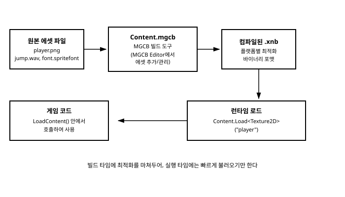

# 4장. 콘텐츠 파이프라인(Content Pipeline)

[◀ 이전: 3장. 게임 루프와 Game 클래스 수명주기](ch03-게임루프와Game클래스수명주기.md) | [📖 목차](00-목차.md) | [다음: 5장. SpriteBatch와 2D 그리기 ▶](ch05-SpriteBatch와2D그리기.md)


3장에서 `LoadContent()` 안에 `Content.Load<Texture2D>("player")`라는 코드를 잠깐 등장시켰다. 이 한 줄 뒤에는 MonoGame이 다른 많은 프레임워크와 차별화되는 독자적인 시스템, 바로 **콘텐츠 파이프라인(Content Pipeline)**이 자리하고 있다. 이번 장에서는 콘텐츠 파이프라인이 왜 필요한지, MGCB Editor로 에셋을 어떻게 추가하고 빌드하는지, 빌드된 결과물을 코드에서 어떻게 불러오는지를 차례로 살펴본다.

## 콘텐츠 파이프라인이 왜 필요한가

게임을 만들다 보면 이미지, 사운드, 폰트, 3D 모델 같은 다양한 원본 에셋 파일을 다루게 된다. 가장 단순한 방법은 이런 파일을 게임이 실행될 때 있는 그대로 읽어들이는 것이다. 실제로 MonoGame은 이런 방식도 지원한다(`Texture2D.FromStream` 등, 뒤에서 다시 다룬다). 하지만 MonoGame은 이보다 한 단계 더 나아간 방식을 기본으로 채택하고 있다. 바로 원본 에셋을 게임을 빌드하는 시점에 미리 각 플랫폼에 최적화된 바이너리 포맷인 **.xnb** 파일로 컴파일해두는 것이다.

이 방식이 주는 이점은 크게 두 가지다.

첫째, **로딩 속도**다. PNG나 WAV 같은 원본 포맷은 사람이 다루기 편한 범용 포맷이지만, 압축을 풀고 GPU가 곧바로 사용할 수 있는 형태로 변환하는 과정이 필요하다. 이 변환 작업을 게임이 실행될 때마다 매번 반복하는 대신, 빌드 시점에 미리 끝내두고 그 결과를 .xnb에 담아두면 런타임에는 이미 가공된 데이터를 그대로 읽어들이기만 하면 되므로 로딩이 훨씬 빨라진다.

둘째, **플랫폼 호환성**이다. MonoGame은 Windows, macOS, Linux, Android, iOS, 각종 콘솔 등 서로 다른 그래픽 API와 하드웨어 특성을 가진 플랫폼을 지원한다(1장 참고). 텍스처 압축 포맷 하나만 보아도 플랫폼마다 선호하는 방식이 다르다. 콘텐츠 파이프라인은 빌드 시점에 대상 플랫폼을 지정받아, 그 플랫폼에 맞는 형식으로 .xnb를 생성해준다. 즉 원본 에셋 파일 하나로 여러 플랫폼에 맞는 최적화된 결과물을 각각 만들어낼 수 있다는 뜻이다. 이는 원본 파일을 직접 읽어들이는 방식으로는 얻기 어려운 이점이다.

정리하면, 콘텐츠 파이프라인은 "에셋 가공"이라는 무거운 작업을 개발 중(빌드 타임)에 미리 끝내두고, 게임을 실제로 플레이하는 시점(런타임)에는 그 결과물을 빠르게 불러오기만 하도록 만들어주는 시스템이다.



## Content.mgcb와 MGCB Editor

MonoGame 프로젝트를 새로 만들면 프로젝트 폴더 안에 `Content` 폴더와 그 안에 `Content.mgcb`라는 파일이 함께 생성되어 있다. 이 `.mgcb` 파일이 바로 "어떤 원본 에셋을, 어떤 설정으로 .xnb로 빌드할 것인가"를 기록해두는 프로젝트 파일이다. 사람이 직접 텍스트로 편집할 수도 있지만, 보통은 **MGCB Editor**라는 전용 GUI 도구를 사용해 관리한다.

MGCB Editor는 MonoGame 프로젝트 템플릿을 설치할 때 함께 설치되는 `dotnet` 도구이며, 프로젝트 폴더에서 다음과 같이 실행할 수 있다.

```
dotnet mgcb-editor Content/Content.mgcb
```

대부분의 IDE(Visual Studio, Visual Studio Code, Rider 등)에서는 `Content.mgcb` 파일을 더블 클릭하거나 열기만 해도 MGCB Editor가 자동으로 실행되도록 연동되어 있다.

### 에셋을 추가하고 빌드하는 기본 흐름

MGCB Editor에서 이미지 파일 하나를 추가하는 과정은 대략 다음과 같다.

1. MGCB Editor를 열고, 왼쪽 트리에서 `Content` 루트 노드를 선택한다.
2. 메뉴에서 **Add → Existing Item...**을 선택하고, 프로젝트에 포함시킬 `player.png` 같은 이미지 파일을 지정한다.
3. 추가된 항목을 선택하면 오른쪽 Properties 패널에 `Importer`와 `Processor` 설정이 나타난다. 이미지 파일이라면 보통 `Importer`는 `Texture Importer`, `Processor`는 `Texture Processor`가 자동으로 선택된다.
4. 필요하다면 `Processor` 옵션(예: 색상 키(ColorKey) 투명 처리, 압축 방식 등)을 조정한다.
5. 메뉴에서 **Build → Build**를 실행하면, MGCB가 지정된 원본 파일들을 읽어 대상 플랫폼에 맞는 `.xnb` 파일로 컴파일해 `bin` 폴더(정확히는 프로젝트의 콘텐츠 출력 디렉터리) 아래에 만들어낸다.
6. 저장(`Ctrl+S` 등)하면 `Content.mgcb` 파일에 방금 추가한 항목의 정보(경로, Importer, Processor 설정)가 기록된다.

이 과정에서 저장되는 `Content.mgcb` 파일 안의 내용은 대략 다음과 같은 형태를 띤다(직접 편집할 일은 많지 않지만 구조를 알아두면 도움이 된다).

```
#begin player.png
/importer:TextureImporter
/processor:TextureProcessor
/processorParam:ColorKeyColor=255,0,255,255
/processorParam:ColorKeyEnabled=True
/processorParam:TextureFormat=Color
/build:player.png
#end player.png
```

사운드 파일(`.wav`, `.ogg` 등)은 `Sound Effect - MP3`나 `Sound Effect - XACT` 같은 Importer/Processor 조합이, `SpriteFont`를 정의하는 `.spritefont` XML 파일은 `SpriteFont Importer`/`SpriteFont Description Processor` 조합이 각각 자동으로 배정된다. 폰트와 오디오를 다루는 구체적인 방법은 각각 10장과 11장에서 자세히 다룬다.

MSBuild와 통합된 프로젝트라면 `dotnet build`를 실행할 때 `Content.mgcb`에 등록된 항목들이 자동으로 함께 빌드되도록 설정되어 있는 경우가 많으므로, 매번 MGCB Editor를 열어 수동으로 Build를 누르지 않아도 되는 경우가 대부분이다. 다만 새 에셋을 추가하거나 Processor 설정을 바꾼 직후에는 MGCB Editor에서 한 번 Build를 실행해 오류 없이 빌드되는지 확인해보는 습관을 들이는 것이 좋다.

## 빌드된 콘텐츠를 코드에서 불러오기

`.xnb`로 빌드가 끝난 콘텐츠는 게임 코드에서 `ContentManager`의 `Load<T>()` 메서드로 불러온다. `Game` 클래스는 `Content`라는 이름의 `ContentManager` 프로퍼티를 기본으로 제공한다.

```csharp
protected override void LoadContent()
{
    _spriteBatch = new SpriteBatch(GraphicsDevice);

    // Content/player.png → 빌드 → player.xnb를 불러온다.
    Texture2D playerTexture = Content.Load<Texture2D>("player");

    // 하위 폴더에 있는 경우 폴더 구분자로 경로를 지정한다.
    Texture2D enemyTexture = Content.Load<Texture2D>("Sprites/enemy");

    SoundEffect jumpSound = Content.Load<SoundEffect>("jump");
}
```

여기서 반드시 기억해야 할 두 가지 규칙이 있다.

**첫째, 확장자를 붙이지 않고 이름만 지정한다.** `Content.Load<Texture2D>("player.png")`가 아니라 `Content.Load<Texture2D>("player")`다. 이는 실제로 로드되는 대상이 원본 `player.png`가 아니라 빌드 결과물인 `player.xnb`이기 때문이다. `ContentManager`는 지정된 이름 뒤에 자동으로 `.xnb`를 붙여 파일을 찾는다. `Content.RootDirectory`(보통 `"Content"`)를 기준으로 한 상대 경로를 문자열로 넘겨준다는 점도 함께 기억해두자.

**둘째, `Content.Load<T>()`는 `LoadContent()` 안에서 호출하는 것이 원칙이다.** 3장에서 살펴보았듯 `LoadContent()`는 `GraphicsDevice`가 준비된 이후 호출되므로, `Texture2D`나 `SpriteFont`처럼 그래픽 리소스를 필요로 하는 콘텐츠를 안전하게 로드할 수 있는 시점이다. 게임 도중 새로운 스테이지로 전환하면서 추가 에셋을 불러와야 하는 경우(14장의 게임 상태 관리에서 다시 다룬다)에는 `LoadContent()` 바깥에서 `Content.Load<T>()`를 호출하기도 하지만, 이 경우에도 `GraphicsDevice`가 이미 초기화되어 있는 시점이어야 한다는 조건은 동일하게 적용된다.

또한 `ContentManager`는 같은 이름으로 이미 로드한 적이 있는 에셋을 캐싱해두므로, 같은 텍스처를 여러 번 `Content.Load<Texture2D>("player")`로 호출해도 매번 새로 디스크에서 읽어들이지 않고 캐시된 인스턴스를 재사용한다. 즉 여러 곳에서 같은 에셋을 참조하더라도 메모리 낭비를 걱정할 필요는 없다.

## 파이프라인을 거치지 않고 직접 로드하는 방법

콘텐츠 파이프라인이 기본이자 권장되는 방식이지만, MonoGame은 파이프라인을 거치지 않고 원본 파일을 직접 읽어들이는 방법도 함께 제공한다. 대표적인 예가 `Texture2D.FromStream`이다.

```csharp
using (var stream = TitleContainer.OpenStream("Sprites/player.png"))
{
    Texture2D texture = Texture2D.FromStream(GraphicsDevice, stream);
}
```

이 방식은 PNG나 JPEG 같은 원본 이미지 파일을 `.xnb`로 미리 빌드하지 않고도 직접 읽어 `Texture2D`를 만들어낸다. 사용자가 게임 실행 중 임의로 추가한 이미지 파일을 불러와야 하는 경우(예: 사용자 지정 아바타, 모드(mod) 지원, 스크린샷 다시 불러오기 등)처럼 빌드 시점에 어떤 파일이 필요할지 미리 알 수 없는 상황에서 유용하다.

다만 이 방식에는 콘텐츠 파이프라인이 제공하는 이점—플랫폼별 최적화, 압축 포맷 변환, 빠른 로딩—이 빠져 있다. 원본 이미지 포맷을 그대로 디코딩해야 하므로 파이프라인을 거친 `.xnb`를 로드하는 것보다 느릴 수 있고, 플랫폼에 따라 지원되는 이미지 포맷이나 성능 특성이 달라질 수도 있다. 따라서 게임에 포함되어 배포되는 고정된 에셋(캐릭터 스프라이트, 배경음악, UI 폰트 등)은 콘텐츠 파이프라인을 통해 `.xnb`로 빌드해 `Content.Load<T>()`로 불러오고, `Texture2D.FromStream` 같은 직접 로드 방식은 런타임에 동적으로 결정되는 외부 파일을 다루는 예외적인 경우로 한정하는 것이 일반적인 권장 사항이다.

## 정리하면

콘텐츠 파이프라인은 "원본 에셋을 빌드 타임에 미리 최적화해둔다"는 단순한 아이디어에서 출발하지만, 이 덕분에 MonoGame 게임은 여러 플랫폼에서 빠르고 일관되게 에셋을 불러올 수 있다. MGCB Editor로 `Content.mgcb`에 에셋을 등록하고 빌드하면 `.xnb` 파일이 만들어지고, 코드에서는 `Content.Load<T>("이름")`으로 확장자 없이 그 결과물을 불러온다. 이 흐름은 앞으로 다룰 텍스처(5장, 8장), 폰트(10장), 오디오(11장), 3D 모델(13장) 등 거의 모든 에셋 로딩의 공통 기반이 되므로, 지금 단계에서 확실히 익혀두는 것이 좋다.

## 요약

- 콘텐츠 파이프라인은 원본 에셋 파일을 빌드 타임에 각 플랫폼에 최적화된 바이너리 포맷인 `.xnb`로 미리 컴파일해두는 MonoGame 고유의 시스템으로, 런타임 로딩 속도와 플랫폼 호환성을 함께 향상시킨다.
- `Content.mgcb`는 어떤 에셋을 어떤 Importer/Processor로 빌드할지 기록하는 프로젝트 파일이며, MGCB Editor로 에셋을 추가(Add → Existing Item)하고 빌드(Build → Build)한다.
- 코드에서는 `Content.Load<T>("이름")`으로 빌드된 콘텐츠를 불러오며, 확장자는 붙이지 않고 `Content.RootDirectory` 기준 상대 경로만 지정한다.
- 그래픽 리소스를 필요로 하는 콘텐츠 로딩은 `GraphicsDevice`가 준비된 이후인 `LoadContent()` 안에서 이루어져야 하며, `ContentManager`는 같은 이름의 에셋을 캐싱해 재사용한다.
- `Texture2D.FromStream` 등으로 파이프라인을 거치지 않고 원본 파일을 직접 읽어들일 수도 있지만, 대부분의 경우 플랫폼 최적화와 로딩 속도 면에서 콘텐츠 파이프라인을 사용하는 것이 권장된다.

## 연습문제

1. 콘텐츠 파이프라인이 존재하지 않고 게임이 항상 원본 PNG/WAV 파일을 직접 읽어들여야 한다면, 어떤 상황에서 문제가 생길 수 있을지 로딩 속도와 플랫폼 호환성 두 관점에서 각각 설명해보라.
2. `Content.Load<Texture2D>("Sprites/player.png")`처럼 확장자를 포함해 호출하면 어떤 문제가 발생하는지, 그 이유를 `ContentManager`가 실제로 찾는 파일이 무엇인지에 근거해 설명해보라.
3. MGCB Editor에서 이미지 파일 하나를 추가한 뒤 Build를 실행하지 않고 곧바로 게임을 실행하면 어떤 일이 벌어질지 예상해보라.
4. `Content.Load<T>()`를 `Initialize()` 안에서 호출하면 안전하지 않을 수 있는 이유를, 3장에서 다룬 `Initialize()`와 `LoadContent()`의 호출 시점 차이를 근거로 설명해보라.
5. 사용자가 게임 실행 중 폴더에서 자유롭게 배경 이미지를 선택해 불러오는 기능을 만들고 싶다. 이 경우 `Content.Load<Texture2D>()`와 `Texture2D.FromStream` 중 어느 쪽이 더 적합한지, 그 이유와 함께 설명해보라.

---

[◀ 이전: 3장. 게임 루프와 Game 클래스 수명주기](ch03-게임루프와Game클래스수명주기.md) | [📖 목차](00-목차.md) | [다음: 5장. SpriteBatch와 2D 그리기 ▶](ch05-SpriteBatch와2D그리기.md)
