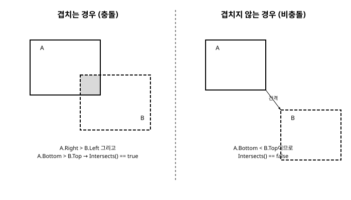

# 9장. 충돌 감지

[◀ 이전: 8장. 텍스처와 스프라이트 애니메이션](ch08-텍스처와스프라이트애니메이션.md) | [📖 목차](00-목차.md) | [다음: 10장. SpriteFont와 텍스트 렌더링 ▶](ch10-SpriteFont와텍스트렌더링.md)


게임에서 "충돌"은 단순히 물리적으로 부딪히는 상황만을 뜻하지 않습니다. 플레이어 캐릭터가 아이템 위를 지나가면 아이템을 획득하고, 총알이 적에게 닿으면 데미지를 주고, 공이 벽에 부딪히면 방향을 바꾸는 것 — 이 모든 상호작용의 기반이 바로 충돌 감지(Collision Detection)입니다.

MonoGame은 물리 엔진을 내장하고 있지 않습니다. Box2D나 Unity의 Physics 시스템 같은 것은 없고, 대신 `Rectangle` 구조체와 `Vector2` 연산이라는 기본 도구만 제공합니다. 처음에는 불편해 보일 수 있지만, 오히려 이 덕분에 충돌 감지가 어떻게 동작하는지 원리 수준에서 이해하게 됩니다. 이번 장에서는 가장 널리 쓰이는 두 가지 충돌 판정 방식 — 사각형 기반의 AABB와 원형 충돌 — 을 직접 구현하고, 이를 이용해 공이 화면 경계에서 튕기는 간단한 충돌 응답까지 만들어 보겠습니다.

## 9.1 AABB 충돌 판정의 원리

AABB는 Axis-Aligned Bounding Box의 약자로, "좌표축에 정렬된 경계 상자"라는 뜻입니다. 회전하지 않고 화면의 가로축·세로축에 나란히 놓인 사각형을 말합니다. 스프라이트 기반 2D 게임에서 가장 많이 쓰이는 충돌 판정 방식인데, 이유는 간단합니다. 계산이 매우 빠르고 코드가 단순하기 때문입니다.

두 사각형이 겹치는지 판단하는 원리는 직관적입니다. 한 사각형이 다른 사각형의 왼쪽에 완전히 벗어나 있거나, 오른쪽에 벗어나 있거나, 위쪽에 벗어나 있거나, 아래쪽에 벗어나 있으면 두 사각형은 겹치지 않습니다. 이 네 가지 "벗어난" 경우가 모두 아니라면, 두 사각형은 반드시 겹칩니다.



MonoGame은 이 판정 로직을 직접 짤 필요 없이 `Rectangle` 구조체에 이미 구현해 두었습니다.

```csharp
public struct Rectangle
{
    public int X;
    public int Y;
    public int Width;
    public int Height;

    public Rectangle(int x, int y, int width, int height) { ... }

    public bool Intersects(Rectangle value);
}
```

`Intersects` 메서드 하나만 호출하면 두 사각형의 겹침 여부를 `bool` 값으로 즉시 알 수 있습니다.

```csharp
Rectangle playerBox = new Rectangle(100, 100, 32, 32);
Rectangle enemyBox = new Rectangle(120, 110, 32, 32);

if (playerBox.Intersects(enemyBox))
{
    // 충돌 발생
}
```

`Rectangle`은 `X`, `Y`(왼쪽 위 모서리 좌표), `Width`, `Height` 필드로 구성되며, `Left`, `Right`, `Top`, `Bottom`, `Center`처럼 유용한 읽기 전용 속성도 함께 제공합니다. 참고로 `Rectangle`의 모든 필드는 `int`이므로, 5장에서 다룬 `SpriteBatch.Draw`의 대상 사각형 오버로드와도 그대로 호환됩니다.

## 9.2 매 프레임 바운딩 박스 계산하기

실전에서는 사각형 좌표를 손으로 입력하는 일이 없습니다. 대신 캐릭터나 아이템의 현재 위치와 텍스처 크기로부터 매 프레임 `Rectangle`을 새로 계산합니다. 8장에서 만든 스프라이트 애니메이션 구조를 떠올려 보면, 캐릭터는 `Position`(월드 좌표)과 `Texture2D`(또는 프레임 크기)를 가지고 있었습니다. 이 정보만 있으면 바운딩 박스를 구할 수 있습니다.

```csharp
public class Player
{
    public Vector2 Position;
    public Texture2D Texture;

    public Rectangle BoundingBox
    {
        get
        {
            return new Rectangle(
                (int)Position.X,
                (int)Position.Y,
                Texture.Width,
                Texture.Height);
        }
    }
}
```

`BoundingBox`를 프로퍼티로 만들어 두면 `Position`이 바뀔 때마다 자동으로 최신 사각형을 반환하므로 별도로 동기화할 필요가 없습니다. 스프라이트시트에서 프레임 하나만 그리는 경우(8장 참고)라면 `Texture.Width` 대신 실제로 그려지는 프레임의 너비·높이를 사용해야 정확한 판정이 나옵니다.

```csharp
public Rectangle BoundingBox
{
    get
    {
        return new Rectangle(
            (int)Position.X,
            (int)Position.Y,
            frameWidth,   // 스프라이트시트 한 프레임의 너비
            frameHeight); // 스프라이트시트 한 프레임의 높이
    }
}
```

두 오브젝트의 바운딩 박스를 매 프레임 `Update` 안에서 비교하면 충돌 감지가 완성됩니다.

```csharp
protected override void Update(GameTime gameTime)
{
    player.Position += velocity * (float)gameTime.ElapsedGameTime.TotalSeconds;

    if (player.BoundingBox.Intersects(enemy.BoundingBox))
    {
        // 충돌 처리: 데미지, 게임오버, 아이템 획득 등
    }

    base.Update(gameTime);
}
```

여러 개의 적이 있다면 리스트를 순회하며 각각에 대해 `Intersects`를 호출합니다.

```csharp
foreach (var enemy in enemies)
{
    if (bullet.BoundingBox.Intersects(enemy.BoundingBox))
    {
        enemy.IsAlive = false;
        break;
    }
}
```

## 9.3 원형 충돌 판정

사각형 충돌은 빠르지만 부정확할 때가 있습니다. 공이나 동전처럼 둥근 오브젝트를 사각형으로 감싸면, 사각형의 모서리 부분에 실제 그림에는 없는 "여백"이 생겨서 아직 닿지 않았는데도 충돌로 판정되는 경우가 생깁니다. 이런 오브젝트에는 원형(Circle) 충돌 판정이 더 자연스럽습니다.

문제는 MonoGame에 `Circle` 구조체나 `Intersects` 같은 내장 기능이 없다는 점입니다. `Rectangle`과 달리 원형 충돌은 직접 구현해야 합니다. 원리 자체는 간단합니다. 두 원의 중심점 사이 거리가 두 원의 반지름을 더한 값보다 작거나 같으면 두 원은 겹칩니다.

이 거리 계산에는 `Vector2.Distance` 정적 메서드를 사용합니다.

```csharp
public static float Distance(Vector2 value1, Vector2 value2);
```

원형 충돌을 판정하는 헬퍼 메서드는 다음과 같이 작성할 수 있습니다.

```csharp
public static bool CircleIntersects(Vector2 centerA, float radiusA,
                                     Vector2 centerB, float radiusB)
{
    float distance = Vector2.Distance(centerA, centerB);
    return distance <= radiusA + radiusB;
}
```

공 오브젝트 클래스에 중심점과 반지름을 속성으로 노출해 두면 이 헬퍼를 그대로 사용할 수 있습니다.

```csharp
public class Ball
{
    public Vector2 Center;
    public float Radius;
}

// Update 안에서
if (CircleIntersects(ballA.Center, ballA.Radius, ballB.Center, ballB.Radius))
{
    // 두 공이 충돌함
}
```

성능이 중요한 상황이라면 `Vector2.Distance` 내부의 제곱근 계산을 생략할 수도 있습니다. 거리를 직접 구하지 않고 거리의 제곱과 반지름 합의 제곱을 비교해도 결과는 동일합니다.

```csharp
public static bool CircleIntersectsFast(Vector2 centerA, float radiusA,
                                         Vector2 centerB, float radiusB)
{
    float radiusSum = radiusA + radiusB;
    return Vector2.DistanceSquared(centerA, centerB) <= radiusSum * radiusSum;
}
```

수십, 수백 개의 오브젝트를 매 프레임 서로 비교해야 하는 파티클 시스템(15장에서 다룹니다)이나 다수의 탄막을 처리하는 슈팅 게임에서는 이런 최적화가 프레임 드랍을 막는 데 실질적으로 도움이 됩니다.

## 9.4 충돌 응답: 화면 경계에서 튕기는 공

충돌을 "감지"하는 것과 충돌에 "반응"하는 것은 별개의 문제입니다. 이번 절에서는 원형 충돌 판정을 응용해, 화면 안에서 움직이다가 경계에 부딪히면 방향을 반전시켜 튕겨 나가는 공을 만들어 보겠습니다. 벡터와 속도 개념은 7장에서 다룬 내용을 그대로 사용합니다.

```csharp
public class Game1 : Game
{
    private GraphicsDeviceManager graphics;
    private SpriteBatch spriteBatch;

    private Texture2D ballTexture;
    private Vector2 position;
    private Vector2 velocity;
    private float radius;

    public Game1()
    {
        graphics = new GraphicsDeviceManager(this);
        Content.RootDirectory = "Content";
    }

    protected override void LoadContent()
    {
        spriteBatch = new SpriteBatch(GraphicsDevice);
        ballTexture = Content.Load<Texture2D>("ball");

        radius = ballTexture.Width / 2f;
        position = new Vector2(400, 240);
        velocity = new Vector2(220f, 160f); // 초당 이동 픽셀 수
    }

    protected override void Update(GameTime gameTime)
    {
        float dt = (float)gameTime.ElapsedGameTime.TotalSeconds;
        position += velocity * dt;

        int screenWidth = GraphicsDevice.Viewport.Width;
        int screenHeight = GraphicsDevice.Viewport.Height;

        // 왼쪽 또는 오른쪽 경계 충돌
        if (position.X - radius < 0)
        {
            position.X = radius;
            velocity.X = -velocity.X;
        }
        else if (position.X + radius > screenWidth)
        {
            position.X = screenWidth - radius;
            velocity.X = -velocity.X;
        }

        // 위쪽 또는 아래쪽 경계 충돌
        if (position.Y - radius < 0)
        {
            position.Y = radius;
            velocity.Y = -velocity.Y;
        }
        else if (position.Y + radius > screenHeight)
        {
            position.Y = screenHeight - radius;
            velocity.Y = -velocity.Y;
        }

        base.Update(gameTime);
    }

    protected override void Draw(GameTime gameTime)
    {
        GraphicsDevice.Clear(Color.CornflowerBlue);

        spriteBatch.Begin();
        spriteBatch.Draw(
            ballTexture,
            position,
            null,
            Color.White,
            0f,
            new Vector2(ballTexture.Width / 2f, ballTexture.Height / 2f), // 원점을 중심으로
            1f,
            SpriteEffects.None,
            0f);
        spriteBatch.End();

        base.Draw(gameTime);
    }
}
```

여기서 눈여겨볼 부분이 두 가지 있습니다.

첫째, 원점(origin)을 텍스처 중심으로 지정했습니다. `Draw`의 기본 동작은 `position`을 텍스처의 왼쪽 위 모서리로 삼는 것이지만, 원형 충돌 판정에서는 `position`이 원의 중심을 의미하도록 맞추는 편이 계산이 훨씬 단순해집니다. 그래서 원점을 텍스처의 절반 크기로 지정해 그리기 좌표와 충돌 판정 좌표의 기준점을 일치시켰습니다.

둘째, 경계를 벗어난 후에 속도만 반전시키는 것이 아니라 위치도 경계 안쪽으로 보정하고 있습니다(`position.X = radius;` 등). 이 보정이 없으면 공이 한 프레임 동안 경계를 살짝 넘어간 상태에서 다음 프레임에도 여전히 "경계를 넘었다"는 조건이 참이 되어, 속도가 반전과 재반전을 반복하며 공이 벽에 붙어 떠는 현상이 발생할 수 있습니다. 프레임 시간이 길어지거나(`ElapsedGameTime`이 커지는 경우) 공의 속도가 빠를수록 이 현상이 두드러지므로, 실무에서는 항상 위치 보정을 함께 적용하는 것이 안전합니다.

같은 원리를 여러 개의 공에 적용하면 서로 부딪히며 튕기는 장면도 만들 수 있습니다. 두 공이 `CircleIntersects`로 충돌했을 때 단순히 각자의 `velocity.X`, `velocity.Y` 부호를 반전시키는 것만으로도 그럴듯한 반사 효과를 낼 수 있습니다. 물리적으로 완벽한 반사(질량과 운동량을 고려한 탄성 충돌)를 원한다면 두 중심을 잇는 벡터를 법선으로 삼아 속도를 반사시키는 공식이 필요하지만, 이는 이 책의 범위를 벗어나는 좀 더 심화된 주제입니다.

## 9.5 사각형과 원형, 어떤 것을 선택할까

두 방식은 서로 배타적이지 않습니다. 실제 게임에서는 오브젝트의 형태에 따라 섞어서 사용하는 경우가 흔합니다.

- 캐릭터, 플랫폼, UI 버튼처럼 대체로 네모난 형태거나 정밀도가 크게 중요하지 않은 오브젝트에는 `Rectangle.Intersects`가 적합합니다. 계산이 저렴하고 코드가 간결합니다.
- 공, 총알, 동전처럼 둥근 형태이거나 회전하는 오브젝트에는 원형 충돌이 더 자연스러운 결과를 냅니다.
- 정밀도가 중요한 상황에서는 먼저 값싼 AABB로 "대략 가까운지"를 걸러내고, 통과한 경우에만 원형 충돌 같은 정밀한 검사를 수행하는 2단계 방식(broad phase / narrow phase)을 쓰기도 합니다. 오브젝트 수가 많아질수록 이런 최적화의 효과가 커집니다.

어느 쪽을 선택하든 핵심 원리는 같습니다. 매 프레임 현재 위치로부터 판정용 도형(사각형 또는 원)을 새로 계산하고, 그 도형들을 비교해서 겹침 여부를 얻어낸다는 것입니다. 이 패턴은 이후 12장에서 카메라 좌표 변환을 다룰 때나, 18장의 실전 프로젝트에서 여러 종류의 오브젝트가 뒤섞여 상호작용할 때도 그대로 확장되어 쓰입니다.

## 요약

- MonoGame은 물리 엔진을 내장하지 않으며, `Rectangle`과 `Vector2` 연산을 조합해 충돌 감지를 직접 구현합니다.
- `Rectangle.Intersects(Rectangle other)`는 두 사각형이 겹치는지를 `bool`로 반환하며, AABB(축 정렬 경계 상자) 판정에 사용됩니다.
- 오브젝트의 `Position`과 텍스처 크기로부터 매 프레임 `Rectangle`을 새로 계산하는 프로퍼티 패턴을 사용하면 충돌 판정용 바운딩 박스를 항상 최신 상태로 유지할 수 있습니다.
- 원형 충돌은 내장 API가 없으므로 `Vector2.Distance`(또는 최적화를 위한 `Vector2.DistanceSquared`)로 두 중심점 사이 거리를 구해 반지름의 합과 비교하는 방식으로 직접 구현합니다.
- 충돌 응답의 한 예로, 공이 화면 경계에 닿으면 속도 성분의 부호를 반전시키고 위치를 경계 안쪽으로 보정해 튕기는 동작을 구현했습니다. 위치 보정을 생략하면 공이 벽에 붙어 떠는 문제가 생길 수 있습니다.
- 오브젝트의 형태와 요구되는 정밀도에 따라 AABB와 원형 충돌을 상황에 맞게 선택하거나 함께 사용합니다.

## 연습문제

1. `Rectangle.Intersects`를 사용해 플레이어와 여러 개의 아이템(예: 코인) 사이의 충돌을 검사하고, 충돌한 코인을 리스트에서 제거해 사라지게 만들어 보세요.
2. 본문의 원형 충돌 헬퍼 `CircleIntersects`를 이용해 화면에 여러 개의 공을 배치하고, 공끼리 충돌했을 때 서로의 속도를 교환하는(단순 반사) 코드를 작성해 보세요.
3. 9.4절의 튕기는 공 예제에서 위치 보정 코드(`position.X = radius;` 등)를 제거하면 어떤 현상이 나타나는지 직접 실행해 확인하고, 왜 그런 현상이 발생하는지 설명해 보세요.
4. 플레이어 캐릭터는 사각형 바운딩 박스로, 적은 원형 충돌로 판정하는 상황을 가정해 보세요. 사각형과 원이 겹치는지 판정하는 메서드를 직접 설계하고 구현해 보세요. (힌트: 원의 중심에서 사각형 위의 가장 가까운 점까지의 거리를 구합니다.)
5. AABB 판정과 원형 판정을 각각 1,000개의 오브젝트 쌍에 대해 반복 수행하는 간단한 벤치마크를 작성하여 두 방식의 성능 차이를 비교해 보세요. `Vector2.Distance` 대신 `Vector2.DistanceSquared`를 사용했을 때 성능이 어떻게 달라지는지도 함께 확인해 보세요.

---

[◀ 이전: 8장. 텍스처와 스프라이트 애니메이션](ch08-텍스처와스프라이트애니메이션.md) | [📖 목차](00-목차.md) | [다음: 10장. SpriteFont와 텍스트 렌더링 ▶](ch10-SpriteFont와텍스트렌더링.md)
