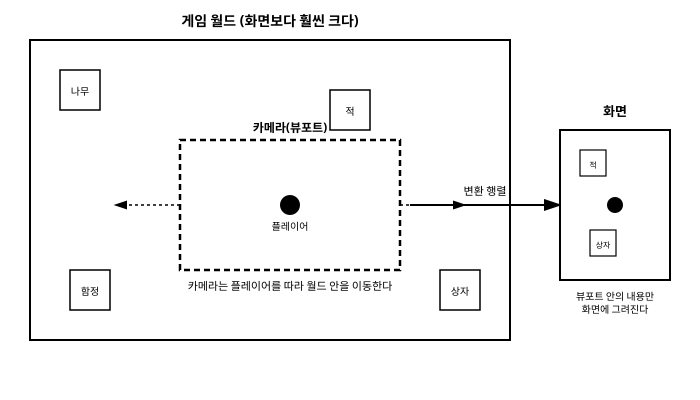

# 12장. 카메라와 변환 행렬

[◀ 이전: 11장. 오디오](ch11-오디오.md) | [📖 목차](00-목차.md) | [다음: 13장. 3D 기초 ▶](ch13-3D기초.md)


지금까지 우리가 다뤄온 게임 화면은 대부분 화면 전체가 곧 게임 월드였다. 하지만 실제 게임, 특히 플랫포머나 탑다운 액션 게임에서는 게임 월드가 화면보다 훨씬 넓은 경우가 대부분이다. 플레이어는 넓은 맵의 일부만을 화면으로 보며, 캐릭터가 이동함에 따라 화면에 보이는 부분도 함께 바뀐다. 이런 기능을 흔히 "카메라" 또는 "스크롤링"이라고 부른다. 이번 장에서는 MonoGame에서 카메라를 어떻게 구현하는지, 그리고 그 밑바탕이 되는 변환 행렬(transformation matrix)의 개념을 살펴본다.

## 게임 월드가 화면보다 클 때: 카메라라는 개념

간단한 예를 생각해보자. 게임 월드의 크기가 3200×2400픽셀이고, 화면(백버퍼) 크기는 800×480픽셀이라고 하자. 플레이어 캐릭터는 이 넓은 월드 안 어딘가에 있고, 우리는 캐릭터 주변의 800×480픽셀 영역만을 화면에 보여주고 싶다. 캐릭터가 오른쪽으로 이동하면 화면에 보이는 영역도 오른쪽으로 따라 움직여야 하고, 캐릭터가 월드의 왼쪽 끝에 있다면 화면은 월드의 왼쪽 부분을 보여줘야 한다.

이렇게 "월드 전체 중 화면에 보여줄 일부 영역을 결정하고, 그 영역을 화면 크기에 맞게 그려주는" 역할을 하는 것이 카메라다. 아래 그림은 넓은 게임 월드 안에서 카메라(뷰포트)가 플레이어를 따라 이동하며, 그 안에 들어온 내용만 화면에 그려지는 개념을 보여준다.



raylib 같은 라이브러리를 먼저 접해본 독자라면 `Camera2D`라는 전용 구조체가 카메라의 위치, 회전, 줌을 필드로 담고 있고, 그리기 함수 호출 전후로 `BeginMode2D`/`EndMode2D` 같은 함수를 감싸주기만 하면 카메라가 자동으로 적용되던 경험이 있을 것이다. MonoGame에는 이런 전용 카메라 타입이 없다. 대신 MonoGame은 카메라를 "월드 좌표를 화면 좌표로 옮겨주는 변환 행렬(`Matrix`)"로 취급하고, 이 행렬을 5장에서 배운 `spriteBatch.Begin`의 `transformMatrix` 매개변수에 전달하는 방식으로 카메라를 구현한다.

```csharp
spriteBatch.Begin(transformMatrix: cameraMatrix);
// ... 월드 좌표 기준으로 스프라이트를 그린다 ...
spriteBatch.End();
```

`Begin`에 변환 행렬을 넘겨주면, 그 이후 `Draw`로 그리는 모든 스프라이트의 좌표에 이 행렬이 적용된 뒤 화면에 그려진다. 즉 개발자는 여전히 "월드 좌표계" 기준으로 객체의 위치를 계산하고, 그 결과를 화면에 어떻게 투영할지는 카메라 행렬 하나가 전담하는 구조다. 이는 곧 "카메라를 구현한다"는 것이 결국 "매 프레임 적절한 `Matrix`를 계산하는 것"과 같은 의미라는 뜻이다. 이번 장의 핵심은 바로 이 행렬을 어떻게 구성하느냐에 있다.

## Matrix.CreateTranslation으로 카메라 이동 구현하기

7장에서 벡터를 다룰 때 `Vector2`로 위치를 표현했던 것을 떠올려보자. 카메라도 결국 월드 안의 어떤 위치를 "중심"으로 삼아 그 주변을 보여주는 것이므로, 카메라의 위치를 `Vector2`로 관리할 수 있다.

카메라 이동의 핵심 아이디어는 다음과 같다. 카메라가 오른쪽으로 이동한다는 것은, 화면에 그려지는 모든 객체가 상대적으로 왼쪽으로 이동한 것처럼 보여야 한다는 뜻이다. 즉 카메라의 이동은 월드 전체를 카메라 위치의 "반대 방향"으로 밀어내는 변환과 동일하다. 이를 행렬로 표현하면 `Matrix.CreateTranslation(-카메라위치, 0)`이 된다.

```csharp
private Vector2 cameraPosition = Vector2.Zero;

private Matrix GetTransformMatrix()
{
    return Matrix.CreateTranslation(
        new Vector3(-cameraPosition.X, -cameraPosition.Y, 0));
}
```

`Matrix.CreateTranslation`은 `Vector3`를 인자로 받으므로, 2D에서는 Z값을 0으로 채워서 넘겨준다. 카메라 위치에 마이너스(`-`) 부호를 붙이는 이유를 다시 한번 짚어보면, 카메라가 `(100, 0)`만큼 오른쪽으로 이동했다면 월드의 모든 점은 화면 기준으로 `(-100, 0)`만큼 왼쪽으로 이동한 것처럼 그려져야 하기 때문이다.

이 행렬을 `spriteBatch.Begin`에 넘기고 캐릭터를 원래 월드 좌표(예를 들어 `player.Position`)로 그리기만 하면, 카메라가 이동함에 따라 화면에 보이는 위치가 자연스럽게 바뀐다.

```csharp
protected override void Draw(GameTime gameTime)
{
    GraphicsDevice.Clear(Color.CornflowerBlue);

    Matrix transform = GetTransformMatrix();

    spriteBatch.Begin(transformMatrix: transform);
    spriteBatch.Draw(playerTexture, player.Position, Color.White);
    spriteBatch.Draw(enemyTexture, enemy.Position, Color.White);
    spriteBatch.End();

    base.Draw(gameTime);
}
```

## Matrix.CreateScale로 줌 인/아웃 결합하기

카메라 이동만으로도 스크롤링은 구현되지만, 게임에 따라서는 카메라를 확대(줌 인)하거나 축소(줌 아웃)하고 싶을 때가 있다. 확대/축소는 `Matrix.CreateScale(zoom)`으로 표현하는데, 여기서 `zoom`이 1.0보다 크면 확대되어 더 가까이 보이고, 1.0보다 작으면 축소되어 더 넓은 영역이 화면에 들어온다.

이동 행렬과 확대/축소 행렬을 함께 사용하려면 두 행렬을 곱해야 하는데, 이때 **곱셈 순서가 결과에 큰 영향을 미친다**는 점을 반드시 기억해야 한다. 행렬 곱셈은 교환법칙이 성립하지 않으므로 `A * B`와 `B * A`는 서로 다른 결과를 만든다.

카메라의 자연스러운 동작(카메라 중심을 기준으로 확대/축소되는 것)을 얻으려면, 먼저 카메라 위치만큼 이동시켜 카메라를 원점으로 옮긴 뒤, 그 상태에서 확대/축소를 적용해야 한다. 즉 "이동 먼저, 그다음 확대/축소" 순서로 곱해야 한다.

```csharp
private float zoom = 1.0f;

private Matrix GetTransformMatrix()
{
    return Matrix.CreateTranslation(new Vector3(-cameraPosition.X, -cameraPosition.Y, 0))
         * Matrix.CreateScale(zoom);
}
```

만약 이 순서를 반대로 하면(`CreateScale(zoom) * CreateTranslation(...)`), 확대/축소가 먼저 적용된 좌표계 위에서 이동이 일어나기 때문에 카메라가 줌 배율에 비례해 훨씬 빠르거나 느리게 이동하는 것처럼 보이는 예상치 못한 결과가 나타난다. 실제로 화면 중앙을 기준으로 카메라를 배치하고 싶다면, 화면 크기의 절반만큼 다시 이동시켜주는 행렬을 마지막에 곱해주는 것이 일반적이다.

```csharp
private Matrix GetTransformMatrix(Viewport viewport)
{
    return Matrix.CreateTranslation(new Vector3(-cameraPosition.X, -cameraPosition.Y, 0))
         * Matrix.CreateScale(zoom)
         * Matrix.CreateTranslation(new Vector3(viewport.Width / 2f, viewport.Height / 2f, 0));
}
```

이 세 단계는 각각 "카메라 위치를 원점으로", "원점을 기준으로 확대/축소", "화면 중앙으로 다시 이동"이라는 순서로 동작한다. 순서를 바꾸면 카메라가 화면 좌상단을 기준으로 확대/축소되는 등 의도와 다른 결과가 나오므로, 행렬을 조합할 때는 항상 "어떤 변환이 어떤 좌표계 위에서 일어나는가"를 순서대로 그려보는 습관이 중요하다.

## 화면 좌표와 월드 좌표 변환하기: 역행렬 활용

카메라가 적용된 상태에서는 화면에 보이는 좌표와 실제 게임 월드 좌표가 더 이상 일치하지 않는다. 예를 들어 마우스로 화면의 `(400, 300)` 지점을 클릭했을 때, 그 지점이 게임 월드에서는 정확히 어디에 해당하는지를 알아야 하는 경우가 많다. 타일 기반 게임에서 클릭한 타일을 찾거나, 마우스 클릭으로 유닛을 선택하는 기능이 대표적인 예다.

이럴 때 사용하는 것이 카메라 행렬의 역행렬이다. 카메라 행렬이 "월드 좌표 → 화면 좌표"로 변환하는 역할을 한다면, 그 역행렬은 정반대로 "화면 좌표 → 월드 좌표"로 변환해준다. MonoGame은 `Matrix.Invert` 정적 메서드로 이 역행렬을 손쉽게 구할 수 있게 해준다.

```csharp
private Vector2 ScreenToWorld(Vector2 screenPosition, Matrix cameraMatrix)
{
    Matrix inverseMatrix = Matrix.Invert(cameraMatrix);
    return Vector2.Transform(screenPosition, inverseMatrix);
}
```

`Vector2.Transform`은 `Vector2`에 `Matrix`를 적용해 변환된 결과를 반환하는 메서드로, 이미 앞선 장들에서 좌표 변환에 사용해본 적이 있을 것이다. 여기서는 화면 좌표(마우스 위치 등)를 역행렬로 변환함으로써 월드 좌표를 얻어낸다.

```csharp
MouseState mouseState = Mouse.GetState();
Vector2 mouseScreenPosition = new Vector2(mouseState.X, mouseState.Y);
Vector2 mouseWorldPosition = ScreenToWorld(mouseScreenPosition, cameraTransform);

// 이제 mouseWorldPosition을 이용해 클릭된 위치의 월드 오브젝트를 판별할 수 있다
```

반대로 월드 좌표를 화면 좌표로 바꾸고 싶다면(예를 들어 월드에 있는 적의 머리 위에 화면 고정 UI로 체력바를 그리고 싶을 때), 역행렬이 아닌 원래의 카메라 행렬을 그대로 `Vector2.Transform`에 사용하면 된다. "월드 → 화면"은 카메라 행렬 자체가, "화면 → 월드"는 그 역행렬이 담당한다는 대응 관계를 기억해두면 헷갈리지 않는다.

## 플레이어를 따라다니는 카메라 만들기

지금까지 배운 내용을 종합해, 플레이어 캐릭터를 화면 중앙에 두고 따라다니는 간단한 카메라를 구현해보자.

```csharp
public class Camera2D
{
    public Vector2 Position { get; set; } = Vector2.Zero;
    public float Zoom { get; set; } = 1.0f;

    private readonly Viewport viewport;

    public Camera2D(Viewport viewport)
    {
        this.viewport = viewport;
    }

    public Matrix GetViewMatrix()
    {
        return Matrix.CreateTranslation(new Vector3(-Position.X, -Position.Y, 0))
             * Matrix.CreateScale(Zoom)
             * Matrix.CreateTranslation(new Vector3(viewport.Width / 2f, viewport.Height / 2f, 0));
    }

    public void Follow(Vector2 targetPosition)
    {
        Position = targetPosition;
    }
}
```

`Camera2D`라는 이름을 붙이긴 했지만, 이는 raylib의 `Camera2D` 구조체를 흉내 낸 것이 아니라 우리가 직접 만든 평범한 클래스일 뿐이다. MonoGame 자체는 이런 타입을 제공하지 않으므로, 이렇게 카메라의 위치·줌 상태를 담고 그에 맞는 `Matrix`를 계산해주는 헬퍼 클래스를 직접 작성해 재사용하는 것이 일반적인 관례다.

`Game1` 클래스에서는 이 카메라를 다음과 같이 활용할 수 있다.

```csharp
private Camera2D camera;
private Player player;

protected override void Initialize()
{
    camera = new Camera2D(GraphicsDevice.Viewport);

    base.Initialize();
}

protected override void Update(GameTime gameTime)
{
    player.Update(gameTime);
    camera.Follow(player.Position);

    base.Update(gameTime);
}

protected override void Draw(GameTime gameTime)
{
    GraphicsDevice.Clear(Color.CornflowerBlue);

    spriteBatch.Begin(transformMatrix: camera.GetViewMatrix());
    spriteBatch.Draw(playerTexture, player.Position, Color.White);
    spriteBatch.Draw(enemyTexture, enemy.Position, Color.White);
    spriteBatch.End();

    base.Draw(gameTime);
}
```

매 프레임 `camera.Follow(player.Position)`를 호출해 카메라 위치를 플레이어 위치와 동기화하면, 플레이어가 이동할 때마다 카메라도 함께 이동해 항상 화면 중앙에 플레이어가 보이게 된다. 여기에 맵의 경계를 벗어나지 않도록 카메라 위치를 클램프(clamp)하거나, 카메라가 플레이어를 즉시 따라가지 않고 부드럽게 보간(lerp)하며 뒤따르도록 만드는 등의 개선도 충분히 가능하다. 이런 보간 계산에는 7장에서 다룬 `Vector2.Lerp` 같은 함수를 그대로 활용할 수 있다.

## 요약

- 게임 월드가 화면보다 클 때, 월드의 일부만을 화면에 보여주는 역할을 카메라가 담당한다. 이를 흔히 스크롤링이라고 부른다.
- MonoGame에는 raylib의 `Camera2D` 같은 전용 카메라 구조체가 없다. 대신 카메라를 `Matrix` 변환 행렬로 직접 구성하고, 이를 `spriteBatch.Begin(transformMatrix: 행렬)`에 전달하는 방식으로 구현한다.
- `Matrix.CreateTranslation(-카메라위치, 0)`으로 카메라의 이동을 구현한다. 카메라가 이동한 방향과 반대 방향으로 월드 전체를 밀어내는 것과 같은 원리다.
- `Matrix.CreateScale(zoom)`으로 줌 인/아웃을 구현할 수 있으며, 이동 행렬과 확대/축소 행렬을 곱할 때는 순서가 중요하다. 일반적으로 "이동 → 확대/축소 → 화면 중앙 정렬" 순서로 곱해야 카메라 중심을 기준으로 자연스럽게 확대/축소된다.
- 화면 좌표를 월드 좌표로 바꿔야 할 때는(예: 마우스 클릭 위치 판별) 카메라 행렬의 역행렬(`Matrix.Invert`)을 `Vector2.Transform`과 함께 사용한다.
- 카메라의 위치와 줌 상태, 그리고 뷰 행렬 계산 로직을 담은 헬퍼 클래스(예: `Camera2D`)를 직접 작성해두면, 플레이어를 따라다니는 카메라 같은 기능을 재사용하기 편리해진다.

## 연습문제

1. MonoGame에 raylib의 `Camera2D` 같은 전용 카메라 타입이 없는 이유를 이번 장의 내용을 바탕으로 설명하고, 대신 MonoGame이 카메라를 어떤 방식으로 구현하도록 유도하는지 서술해보자.
2. `Matrix.CreateTranslation`에 카메라 위치를 그대로 넣지 않고 마이너스 부호를 붙여서(`-카메라위치`) 넣는 이유를 설명해보자.
3. 카메라의 줌을 구현할 때 `Matrix.CreateScale(zoom) * Matrix.CreateTranslation(...)`처럼 곱셈 순서를 바꾸면 어떤 문제가 발생하는지, 그리고 올바른 순서는 무엇인지 설명해보자.
4. 마우스 클릭 위치를 게임 월드 좌표로 변환하려고 할 때 왜 카메라 행렬을 그대로 사용하지 않고 역행렬(`Matrix.Invert`)을 사용해야 하는지 설명해보자.
5. 플레이어를 따라다니는 카메라가 매 프레임 플레이어 위치로 순간 이동하듯 정확히 일치하는 대신, 조금 지연되며 부드럽게 따라가도록(카메라 댐핑) 만들려면 `Camera2D.Follow` 메서드를 어떻게 수정하면 좋을지 7장에서 배운 벡터 보간을 활용해 구상해보자.

---

[◀ 이전: 11장. 오디오](ch11-오디오.md) | [📖 목차](00-목차.md) | [다음: 13장. 3D 기초 ▶](ch13-3D기초.md)
