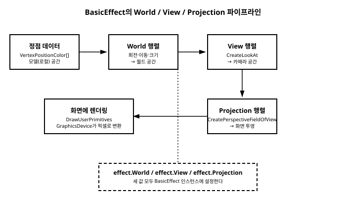

# 13장. 3D 기초

[◀ 이전: 12장. 카메라와 변환 행렬](ch12-카메라와변환행렬.md) | [📖 목차](00-목차.md) | [다음: 14장. 게임 상태 관리와 화면 전환 ▶](ch14-게임상태관리와화면전환.md)


지금까지 이 책에서 다룬 내용은 전부 2D였다. `SpriteBatch`로 텍스처를 그리고(5장), 벡터로 위치와 속도를 계산하고(7장), 스프라이트 애니메이션과 충돌을 다루고(8, 9장), 행렬로 카메라를 흉내 냈다(12장). 그런데 12장에서 카메라의 이동·회전·줌을 구현할 때 이미 `Matrix`라는, 원래는 3D 그래픽스를 위해 설계된 도구를 사용했던 것을 기억할 것이다. 사실 MonoGame은 2D 전용 프레임워크가 아니다. 오히려 그 반대에 가깝다. 이번 장에서는 MonoGame이 3D 그래픽스를 어떻게 다루는지, 그 뼈대를 이루는 최소한의 개념을 살펴본다.

## XNA는 원래 3D 그래픽스 API였다

1장에서 MonoGame이 마이크로소프트의 XNA Framework를 이어받은 오픈소스 프로젝트라고 설명했다. 여기서 한 가지 짚고 넘어갈 배경이 있다. XNA는 처음부터 Xbox 360용 3D 게임을 염두에 두고 설계된 프레임워크였다. Direct3D를 감싼 저수준 그래픽스 API가 XNA의 핵심이었고, 정점(vertex), 인덱스, 셰이더, 변환 행렬 같은 개념이 API 설계의 중심에 있었다.

그렇다면 이 책에서 5장부터 줄곧 사용해온 `SpriteBatch`는 어디서 왔을까? `SpriteBatch`는 사실 이런 3D 렌더링 파이프라인 위에 얹힌 "2D 전용 편의 계층"이다. 텍스처가 입혀진 평면 사각형(quad) 두 개의 삼각형을 카메라를 정면으로 고정한 상태에서 반복해서 그려주는 것이 `SpriteBatch`의 내부 동작이며, 이 사각형들을 효율적으로 배치하고 한꺼번에 그리는 작업을 자동화해준 것이 `SpriteBatch`가 개발자에게 주는 편리함이다. 즉 2D 그리기는 3D 렌더링 파이프라인의 특수한 활용 사례이지, 별개의 시스템이 아니다.

이 유산 덕분에 MonoGame은 처음부터 3D 렌더링에 필요한 모든 저수준 도구를 그대로 가지고 있다. `GraphicsDevice`, 정점 구조체, `Matrix`, 이펙트(effect) 같은 것들이 그 예다. 이번 장에서는 이 도구들을 사용해 화면에 회전하는 삼각형 하나를 3D 공간에 띄워보면서, MonoGame이 3D를 다루는 기본 흐름을 경험해본다.

## BasicEffect: 셰이더 없이 3D를 그리는 법

본격적인 3D 그래픽스 프로그래밍에서는 정점과 픽셀을 어떻게 처리할지를 셰이더(HLSL로 작성한 프로그램)로 직접 기술하는 것이 일반적이다. 하지만 셰이더를 처음부터 작성하는 것은 이 책의 범위를 크게 벗어나는 별도의 학습 곡선을 요구한다. 다행히 MonoGame은 `BasicEffect`라는 클래스를 기본으로 제공한다.

`BasicEffect`는 XNA 시절부터 내려온, 자체 셰이더를 작성하지 않고도 다음과 같은 흔한 렌더링 작업을 처리해주는 내장 이펙트다.

- 정점 색상을 그대로 사용하거나(`VertexColorEnabled`), 텍스처를 입히거나(`TextureEnabled`, `Texture`)
- 월드/뷰/투영 변환(`World`, `View`, `Projection` 속성)
- 간단한 방향광 조명(`EnableDefaultLighting()` 또는 `DirectionalLight0` 등)

`BasicEffect`는 말 그대로 "기본적인" 이펙트이기 때문에 물리 기반 렌더링(PBR)이나 복잡한 그림자 기법 같은 것은 제공하지 않는다. 하지만 교육용으로 3D의 기본 원리를 익히거나, 간단한 3D 요소를 게임에 곁들이는 정도라면 `BasicEffect` 하나로 충분하다.

## 정점 정의하기: VertexPositionColor

3D에서 무언가를 그리려면 먼저 "정점(vertex)"이 필요하다. 정점은 3D 공간상의 한 점으로, 위치 외에도 색상, 텍스처 좌표, 법선 벡터 같은 부가 정보를 함께 가질 수 있다. MonoGame은 흔히 쓰이는 조합들을 미리 구조체로 정의해두었는데, 그중 가장 단순한 것이 위치와 색상만 가지는 `VertexPositionColor`다.

```csharp
VertexPositionColor[] vertices = new VertexPositionColor[3];

vertices[0] = new VertexPositionColor(
    new Vector3(0f, 0.5f, 0f), Color.Red);
vertices[1] = new VertexPositionColor(
    new Vector3(0.5f, -0.5f, 0f), Color.Green);
vertices[2] = new VertexPositionColor(
    new Vector3(-0.5f, -0.5f, 0f), Color.Blue);
```

이 배열은 삼각형 하나를 이루는 세 정점을 정의한다. 각 정점은 3D 좌표(`Vector3`)와 색상(`Color`)을 가진다. 이 정점들을 화면에 그리려면 `GraphicsDevice.DrawUserPrimitives` 메서드를 사용한다.

```csharp
GraphicsDevice.DrawUserPrimitives(
    PrimitiveType.TriangleList, vertices, 0, 1);
```

`DrawUserPrimitives<T>`는 CPU 메모리에 있는 정점 배열을 매 호출마다 직접 GPU로 전달해서 그리는 메서드다. `VertexBuffer`를 미리 만들어 GPU에 올려두는 방식보다는 성능이 떨어지지만, 코드가 훨씬 단순해서 3D의 기본 개념을 익히는 예제로는 안성맞춤이다. 매개변수는 순서대로 그릴 도형의 종류(`PrimitiveType.TriangleList`는 정점 3개마다 삼각형 하나), 정점 배열, 배열에서 읽기 시작할 오프셋, 그릴 도형(이 경우 삼각형)의 개수다.

다만 이 메서드 하나만으로는 아무것도 그려지지 않는다. `DrawUserPrimitives`는 "현재 활성화된 이펙트가 정한 방식으로" 정점을 그리기 때문에, 그리기 전에 `BasicEffect`를 준비하고 적용하는 과정이 필요하다.

## 최소 3D 예제: 회전하는 삼각형

이제 지금까지의 조각들을 모아, 화면 중앙에서 천천히 회전하는 삼각형을 그리는 완전한 예제를 만들어보자.

```csharp
public class Game1 : Game
{
    private GraphicsDeviceManager _graphics;
    private BasicEffect _effect;
    private VertexPositionColor[] _vertices;
    private float _rotation;

    public Game1()
    {
        _graphics = new GraphicsDeviceManager(this);
        Content.RootDirectory = "Content";
    }

    protected override void Initialize()
    {
        _vertices = new VertexPositionColor[3];
        _vertices[0] = new VertexPositionColor(
            new Vector3(0f, 0.5f, 0f), Color.Red);
        _vertices[1] = new VertexPositionColor(
            new Vector3(0.5f, -0.5f, 0f), Color.Green);
        _vertices[2] = new VertexPositionColor(
            new Vector3(-0.5f, -0.5f, 0f), Color.Blue);

        base.Initialize();
    }

    protected override void LoadContent()
    {
        _effect = new BasicEffect(GraphicsDevice)
        {
            VertexColorEnabled = true
        };
    }

    protected override void Update(GameTime gameTime)
    {
        float seconds = (float)gameTime.ElapsedGameTime.TotalSeconds;
        _rotation += seconds;

        base.Update(gameTime);
    }

    protected override void Draw(GameTime gameTime)
    {
        GraphicsDevice.Clear(Color.CornflowerBlue);

        float aspectRatio = GraphicsDevice.Viewport.AspectRatio;

        _effect.World = Matrix.CreateRotationY(_rotation);
        _effect.View = Matrix.CreateLookAt(
            new Vector3(0f, 0f, 3f), Vector3.Zero, Vector3.Up);
        _effect.Projection = Matrix.CreatePerspectiveFieldOfView(
            MathHelper.PiOver4, aspectRatio, 0.1f, 100f);

        foreach (EffectPass pass in _effect.CurrentTechnique.Passes)
        {
            pass.Apply();
            GraphicsDevice.DrawUserPrimitives(
                PrimitiveType.TriangleList, _vertices, 0, 1);
        }

        base.Draw(gameTime);
    }
}
```

이 예제를 하나씩 뜯어보자.

**World 행렬.** `Matrix.CreateRotationY(_rotation)`은 삼각형을 Y축을 기준으로 회전시키는 변환 행렬이다. `_rotation` 값이 `Update`에서 매 프레임 조금씩 증가하므로, 삼각형은 제자리에서 계속 회전하는 것처럼 보인다. World 행렬은 "정점이 정의된 모델 공간(로컬 좌표)을 게임 세계 속 실제 위치·회전·크기로 옮기는" 역할을 한다. 아무 변환도 하지 않으려면 `Matrix.Identity`를 사용하면 된다.

**View 행렬.** `Matrix.CreateLookAt(cameraPosition, cameraTarget, cameraUp)`은 카메라의 위치와 시선 방향으로부터 뷰 행렬을 만들어준다. 위 예제에서는 카메라를 원점에서 Z축으로 3만큼 떨어진 지점(`(0, 0, 3)`)에 두고, 원점(`Vector3.Zero`)을 바라보게 했다. 12장에서 2D 카메라를 만들 때 `Matrix.CreateTranslation`과 `Matrix.CreateScale`을 조합했던 것과 마찬가지로, View 행렬 역시 "세계를 카메라 기준 좌표로 다시 표현하는" 변환이라는 점에서 본질은 같다.

**Projection 행렬.** `Matrix.CreatePerspectiveFieldOfView`는 3D 공간을 2D 화면에 투영할 때 원근감(멀리 있는 물체가 작게 보이는 효과)을 만들어주는 행렬이다. 매개변수는 순서대로 시야각(field of view, 라디안 단위 — `MathHelper.PiOver4`는 45도), 화면 가로세로 비율(`GraphicsDevice.Viewport.AspectRatio`), 그리고 카메라가 볼 수 있는 가장 가까운 거리(near plane)와 가장 먼 거리(far plane)다. near와 far 사이를 벗어난 물체는 그려지지 않는다.

이렇게 계산한 세 행렬을 `_effect.World`, `_effect.View`, `_effect.Projection`에 각각 대입하면, `BasicEffect`가 내부적으로 이 세 행렬을 합성해 각 정점을 최종적으로 화면 어디에 그릴지 계산해준다. 이 세 행렬의 관계는 아래 그림에 정리했다.



마지막으로 실제 그리기는 `_effect.CurrentTechnique.Passes`를 순회하며 이루어진다. `BasicEffect`는 내부적으로 하나 이상의 렌더링 "패스(pass)"로 구성되는데, 대부분의 경우 패스는 하나뿐이지만 관례적으로 `foreach`로 순회하며 각 패스마다 `pass.Apply()`를 호출한 뒤 그리기 명령(`DrawUserPrimitives`)을 실행하는 패턴을 사용한다. `pass.Apply()`는 지금까지 설정한 `World`/`View`/`Projection`, 조명, 텍스처 등의 상태를 GPU 파이프라인에 실제로 적용하는 역할을 한다.

> **참고: 후면 컬링과 정점 순서.** MonoGame의 기본 래스터라이저 상태는 시계 반대 방향(counter-clockwise)으로 감긴 삼각형만 화면 앞면으로 간주하고, 반대 방향으로 감긴 삼각형(카메라에서 보이는 뒷면)은 그리지 않는다. 이를 후면 컬링(backface culling)이라고 한다. 만약 삼각형이 화면에 보이지 않는다면, 정점을 나열한 순서가 카메라 기준으로 시계 방향이 되어 뒷면이 컬링되고 있을 가능성이 크다. 학습 단계에서 이 문제로 혼란스럽다면 `GraphicsDevice.RasterizerState = RasterizerState.CullNone;`을 `Draw` 초반에 설정해 컬링을 잠시 꺼두고 확인해볼 수 있다.

> **참고: 2D와 3D를 같은 프레임에서 함께 그리기.** `SpriteBatch.Begin()`과 `End()`는 내부적으로 블렌드 상태나 깊이 판정 같은 그래픽스 상태를 2D 그리기에 맞게 바꿔놓는다. 만약 같은 `Draw` 메서드 안에서 3D 오브젝트와 2D UI를 함께 그리고 싶다면, 보통 3D 오브젝트를 먼저 그린 뒤 `SpriteBatch`로 2D 요소를 나중에 그리는 순서를 사용한다.

## 이 책에서 다루는 3D의 범위

이번 장에서 살펴본 것은 3D 렌더링 파이프라인의 가장 바깥쪽 뼈대, 즉 "정점을 정의하고, 세 개의 행렬을 통해 화면에 투영한다"는 원리뿐이다. 실전에서 3D 게임을 만들려면 이보다 훨씬 많은 것이 필요하다. 예를 들어 Blender나 Maya 같은 3D 모델링 툴로 만든 모델 파일(FBX 등)을 콘텐츠 파이프라인을 통해 가져와 `Model` 클래스로 로딩하는 방법, 여러 메시와 뼈대(스켈레톤)로 구성된 애니메이션 모델을 다루는 방법, 커스텀 HLSL 셰이더를 작성해 조명과 재질을 세밀하게 제어하는 방법, 3D 충돌 감지와 물리 엔진을 연동하는 방법 등이 있다.

이런 주제들은 3D 전용 서적 한 권을 채울 만큼 방대하고, 이 책이 지향하는 "2D 게임 프로그래밍 입문"이라는 범위를 크게 벗어난다. 이번 장의 목표는 어디까지나 MonoGame이 2D에 국한된 도구가 아니라는 것을 확인하고, `BasicEffect`와 World/View/Projection이라는 3D 그래픽스의 가장 근본적인 개념을 한 번쯤 손으로 만져보는 데 있다. 다음 장부터는 다시 2D로 돌아와서, 여러 화면을 오가는 실전적인 게임 구조를 다룬다.

## 요약

- MonoGame의 뿌리인 XNA는 원래 3D 그래픽스 API로 설계되었으며, 이 책에서 계속 사용해온 `SpriteBatch`는 그 위에 얹힌 2D 전용 편의 계층이다.
- `BasicEffect`는 셰이더를 직접 작성하지 않고도 정점 색상/텍스처, 기본 조명, World/View/Projection 변환을 처리해주는 내장 이펙트다.
- `VertexPositionColor`로 위치와 색상을 가진 정점을 정의하고, `GraphicsDevice.DrawUserPrimitives<VertexPositionColor>(PrimitiveType.TriangleList, vertices, 0, 1)`로 CPU 메모리의 정점 배열을 직접 그릴 수 있다.
- `Matrix.CreateLookAt`으로 카메라의 View 행렬을, `Matrix.CreatePerspectiveFieldOfView`로 원근감을 만드는 Projection 행렬을 생성하며, 여기에 오브젝트의 위치·회전·크기를 나타내는 World 행렬까지 합쳐 `BasicEffect.World`/`View`/`Projection`에 설정한다.
- 그리기는 `effect.CurrentTechnique.Passes`를 순회하며 각 패스마다 `pass.Apply()`를 호출한 뒤 그리기 명령을 실행하는 패턴을 따른다.
- 외부 3D 모델 파일 임포트, 스켈레탈 애니메이션, 커스텀 셰이더, 3D 물리 같은 심화 주제는 이 책의 범위를 벗어나며, 이번 장은 3D 렌더링의 기본 원리를 맛보는 수준에 머문다.

## 연습문제

1. `SpriteBatch`가 내부적으로 3D 렌더링 파이프라인 위에서 동작한다는 것이 왜 가능한지, 2D 그리기를 3D 파이프라인의 특수한 경우로 볼 수 있는 이유를 설명해보자.
2. `BasicEffect`를 사용하는 것과 커스텀 HLSL 셰이더를 직접 작성하는 것의 차이는 무엇이며, 각각 어떤 상황에 적합할지 생각해보자.
3. 이번 장의 회전하는 삼각형 예제에서 `Matrix.CreateLookAt`의 두 번째 인자(카메라가 바라보는 대상 지점)를 원점이 아닌 다른 좌표로 바꾸면 화면에는 어떤 변화가 나타날지 예상해보고 직접 실행해서 확인해보자.
4. 후면 컬링(backface culling)이 무엇인지, 그리고 정점을 나열하는 순서가 왜 삼각형이 화면에 보이는지 여부에 영향을 주는지 설명해보자.
5. `Matrix.CreatePerspectiveFieldOfView`의 near plane과 far plane 값을 극단적으로 좁게(예: `0.1f`와 `1f`) 설정하면 삼각형이 카메라와의 거리에 따라 어떻게 보이거나 사라지는지 실험해보자.

---

[◀ 이전: 12장. 카메라와 변환 행렬](ch12-카메라와변환행렬.md) | [📖 목차](00-목차.md) | [다음: 14장. 게임 상태 관리와 화면 전환 ▶](ch14-게임상태관리와화면전환.md)
