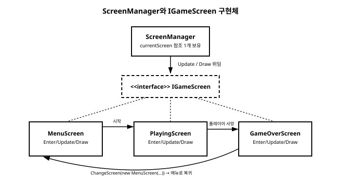

# 14장. 게임 상태 관리와 화면 전환

[◀ 이전: 13장. 3D 기초](ch13-3D기초.md) | [📖 목차](00-목차.md) | [다음: 15장. 파티클 시스템 ▶](ch15-파티클시스템.md)


지금까지 만들어본 예제들은 대부분 "게임이 시작되면 곧바로 플레이가 시작되는" 단순한 구조였다. 하지만 실제 게임을 떠올려보면 사정이 다르다. 게임을 실행하면 먼저 타이틀 화면이나 메인 메뉴가 뜨고, 플레이어가 "시작하기"를 선택해야 비로소 게임 플레이가 시작되며, 캐릭터가 죽으면 게임 오버 화면으로 넘어가고, 거기서 다시 메뉴로 돌아가거나 재시작할 수 있어야 한다. 여기에 일시정지 화면, 설정 화면, 결과 화면까지 더해지면 하나의 게임 안에 여러 개의 독립된 "화면(screen)"이 공존하게 된다.

이런 화면들을 아무렇게나 관리하면 코드가 금방 뒤엉킨다. `Update`와 `Draw` 안에 메뉴 로직, 플레이 로직, 게임 오버 로직이 전부 뒤섞여 들어가고, 조건문이 겹겹이 쌓이면서 어디서 어떤 상태 전환이 일어나는지 파악하기 어려워진다. 이번 장에서는 이 문제를 해결하는 두 가지 단계의 해법을 살펴본다. 먼저 `enum`과 `switch`를 이용한 가장 단순한 접근을 보고, 이어서 각 화면을 독립된 클래스로 분리하는 스크린 매니저 패턴을 직접 구현해본다.

## 문제 상황: 하나의 Game1 안에 모든 로직이 뒤섞이는 경우

메뉴, 플레이, 게임 오버라는 세 가지 상태만 있는 아주 단순한 게임을 생각해보자. 가장 손쉬운 접근은 현재 상태를 나타내는 열거형을 하나 만들고, `Update`와 `Draw`에서 그 값에 따라 분기하는 것이다.

```csharp
public enum GameState
{
    Menu,
    Playing,
    GameOver
}
```

```csharp
public class Game1 : Game
{
    private GraphicsDeviceManager _graphics;
    private SpriteBatch _spriteBatch;
    private SpriteFont _font;
    private GameState _state = GameState.Menu;
    private int _score;

    protected override void Update(GameTime gameTime)
    {
        var keyboard = Keyboard.GetState();

        switch (_state)
        {
            case GameState.Menu:
                if (keyboard.IsKeyDown(Keys.Enter))
                {
                    _score = 0;
                    _state = GameState.Playing;
                }
                break;

            case GameState.Playing:
                _score += 1;
                if (keyboard.IsKeyDown(Keys.Escape))
                {
                    _state = GameState.GameOver;
                }
                break;

            case GameState.GameOver:
                if (keyboard.IsKeyDown(Keys.Enter))
                {
                    _state = GameState.Menu;
                }
                break;
        }

        base.Update(gameTime);
    }

    protected override void Draw(GameTime gameTime)
    {
        GraphicsDevice.Clear(Color.Black);

        _spriteBatch.Begin();

        switch (_state)
        {
            case GameState.Menu:
                _spriteBatch.DrawString(_font, "Press Enter to Start",
                    new Vector2(200, 200), Color.White);
                break;

            case GameState.Playing:
                _spriteBatch.DrawString(_font, $"Score: {_score}",
                    new Vector2(20, 20), Color.White);
                break;

            case GameState.GameOver:
                _spriteBatch.DrawString(_font, $"Game Over - Score: {_score}",
                    new Vector2(180, 200), Color.White);
                break;
        }

        _spriteBatch.End();

        base.Draw(gameTime);
    }
}
```

이 정도 규모라면 `enum`과 `switch` 조합으로도 충분히 감당할 수 있다. 실제로 게임 잼처럼 짧은 기간에 작은 게임을 완성해야 하는 상황이라면, 이런 단순한 구조가 오히려 더 빠르고 실용적인 선택일 수 있다. `_state = GameState.Playing`으로 넘어가는 시점에 `_score = 0`으로 점수를 초기화하는 것처럼, "화면에 진입하는 순간 해야 할 일"을 상태 전환 코드 바로 옆에 적어두면 되기 때문이다.

하지만 화면이 늘어나고 각 화면이 처리해야 할 로직이 복잡해질수록 이 구조는 한계를 드러낸다. `Update`와 `Draw`라는 두 메서드 안에 모든 화면의 코드가 함께 들어있으므로, 메뉴 화면의 버튼 애니메이션이나 플레이 화면의 적 스폰 로직처럼 각 화면 고유의 상태(필드)까지 전부 `Game1` 클래스 하나에 욱여넣어야 한다. `switch` 문도 화면이 늘어날 때마다 함께 길어지고, 한 화면의 코드를 수정하다가 실수로 다른 화면의 `case` 블록을 건드릴 위험도 커진다.

## IGameScreen 인터페이스로 화면 분리하기

이 문제를 해결하는 전형적인 방법은 각 화면을 독립된 클래스로 만들고, 공통된 인터페이스를 통해 다루는 것이다. 먼저 모든 화면이 구현해야 할 최소한의 인터페이스를 정의한다.

```csharp
public interface IGameScreen
{
    void Enter();
    void Update(GameTime gameTime);
    void Draw(GameTime gameTime, SpriteBatch spriteBatch);
}
```

- `Enter()`는 이 화면이 활성화되는 순간, 즉 다른 화면에서 이 화면으로 전환되는 시점에 한 번 호출된다. 점수 초기화처럼 "화면에 들어올 때마다 다시 세팅해야 하는 것"을 여기에 모아둔다.
- `Update(GameTime)`와 `Draw(GameTime, SpriteBatch)`는 이 화면이 활성 상태인 동안 매 프레임 호출된다.

그리고 현재 활성화된 화면을 하나만 들고 있다가, 필요할 때 다른 화면으로 교체해주는 `ScreenManager` 클래스를 만든다.

```csharp
public class ScreenManager
{
    private IGameScreen _currentScreen;

    public void ChangeScreen(IGameScreen newScreen)
    {
        _currentScreen = newScreen;
        _currentScreen.Enter();
    }

    public void Update(GameTime gameTime)
    {
        _currentScreen?.Update(gameTime);
    }

    public void Draw(GameTime gameTime, SpriteBatch spriteBatch)
    {
        _currentScreen?.Draw(gameTime, spriteBatch);
    }
}
```

`ScreenManager`가 하는 일은 단순하다. 현재 화면 하나를 필드로 들고 있다가, `Update`와 `Draw` 호출을 그대로 현재 화면에 전달(위임)해줄 뿐이다. 화면을 바꾸고 싶을 때는 `ChangeScreen`을 호출해서 새 화면 인스턴스를 넘겨주면 되고, 이때 자동으로 새 화면의 `Enter()`가 호출된다. 이 구조를 그림으로 정리하면 다음과 같다.



## 화면 구현하기: MenuScreen, PlayingScreen, GameOverScreen

이제 `IGameScreen`을 구현하는 실제 화면 클래스들을 만들어보자. 각 화면은 다른 화면으로 전환해야 할 때가 있으므로, `ScreenManager`에 대한 참조를 생성자로 받아둔다. 텍스트를 그리는 데 필요한 `SpriteFont`도 마찬가지로 필요한 화면에 전달한다.

```csharp
public class MenuScreen : IGameScreen
{
    private readonly ScreenManager _screenManager;
    private readonly SpriteFont _font;

    public MenuScreen(ScreenManager screenManager, SpriteFont font)
    {
        _screenManager = screenManager;
        _font = font;
    }

    public void Enter()
    {
        // 메뉴는 매번 특별히 초기화할 상태가 없다.
    }

    public void Update(GameTime gameTime)
    {
        var keyboard = Keyboard.GetState();
        if (keyboard.IsKeyDown(Keys.Enter))
        {
            _screenManager.ChangeScreen(
                new PlayingScreen(_screenManager, _font));
        }
    }

    public void Draw(GameTime gameTime, SpriteBatch spriteBatch)
    {
        spriteBatch.DrawString(_font, "Press Enter to Start",
            new Vector2(200, 200), Color.White);
    }
}
```

```csharp
public class PlayingScreen : IGameScreen
{
    private readonly ScreenManager _screenManager;
    private readonly SpriteFont _font;
    private int _score;

    public PlayingScreen(ScreenManager screenManager, SpriteFont font)
    {
        _screenManager = screenManager;
        _font = font;
    }

    public void Enter()
    {
        // 이 화면에 들어올 때마다 점수를 0부터 다시 시작한다.
        _score = 0;
    }

    public void Update(GameTime gameTime)
    {
        _score += 1;

        var keyboard = Keyboard.GetState();
        if (keyboard.IsKeyDown(Keys.Escape))
        {
            _screenManager.ChangeScreen(
                new GameOverScreen(_screenManager, _font, _score));
        }
    }

    public void Draw(GameTime gameTime, SpriteBatch spriteBatch)
    {
        spriteBatch.DrawString(_font, $"Score: {_score}",
            new Vector2(20, 20), Color.White);
    }
}
```

```csharp
public class GameOverScreen : IGameScreen
{
    private readonly ScreenManager _screenManager;
    private readonly SpriteFont _font;
    private readonly int _finalScore;

    public GameOverScreen(ScreenManager screenManager, SpriteFont font, int finalScore)
    {
        _screenManager = screenManager;
        _font = font;
        _finalScore = finalScore;
    }

    public void Enter()
    {
        // 최종 점수는 생성자에서 이미 전달받았으므로 별도 초기화가 없다.
    }

    public void Update(GameTime gameTime)
    {
        var keyboard = Keyboard.GetState();
        if (keyboard.IsKeyDown(Keys.Enter))
        {
            _screenManager.ChangeScreen(
                new MenuScreen(_screenManager, _font));
        }
    }

    public void Draw(GameTime gameTime, SpriteBatch spriteBatch)
    {
        spriteBatch.DrawString(_font, $"Game Over - Score: {_finalScore}",
            new Vector2(180, 200), Color.White);
    }
}
```

여기서 눈여겨볼 부분은 `PlayingScreen`이 게임 오버로 전환될 때 자기 점수(`_score`)를 `GameOverScreen`의 생성자에 그대로 넘겨준다는 점이다. 각 화면이 자신의 상태를 스스로 책임지고, 필요한 데이터만 다음 화면에 명시적으로 전달하기 때문에 `Game1` 클래스가 모든 화면의 데이터를 알고 있을 필요가 없다. 이것이 화면을 분리했을 때 얻는 핵심적인 이점이다.

마지막으로 `Game1`은 이제 `ScreenManager`를 소유하고, `Update`와 `Draw`를 그대로 위임하는 아주 얇은 껍데기가 된다.

```csharp
public class Game1 : Game
{
    private GraphicsDeviceManager _graphics;
    private SpriteBatch _spriteBatch;
    private ScreenManager _screenManager;
    private SpriteFont _font;

    public Game1()
    {
        _graphics = new GraphicsDeviceManager(this);
        Content.RootDirectory = "Content";
    }

    protected override void LoadContent()
    {
        _spriteBatch = new SpriteBatch(GraphicsDevice);
        _font = Content.Load<SpriteFont>("DefaultFont");

        _screenManager = new ScreenManager();
        _screenManager.ChangeScreen(new MenuScreen(_screenManager, _font));
    }

    protected override void Update(GameTime gameTime)
    {
        _screenManager.Update(gameTime);
        base.Update(gameTime);
    }

    protected override void Draw(GameTime gameTime)
    {
        GraphicsDevice.Clear(Color.Black);

        _spriteBatch.Begin();
        _screenManager.Draw(gameTime, _spriteBatch);
        _spriteBatch.End();

        base.Draw(gameTime);
    }
}
```

`Game1.Update`와 `Game1.Draw`가 각각 한 줄로 줄어든 것이 눈에 띈다. 화면과 관련된 모든 판단과 로직은 각 화면 클래스 안에 캡슐화되었고, `Game1`은 그저 "지금 활성화된 화면에게 매 프레임 할 일을 넘겨주는" 역할만 담당한다. 새로운 화면(예: 일시정지 화면)을 추가하고 싶다면 `IGameScreen`을 구현하는 클래스를 하나 더 만들고, 필요한 곳에서 `ChangeScreen`을 호출하기만 하면 된다. 기존 화면들의 코드는 건드릴 필요가 없다.

## 화면 진입 시점의 초기화, 그리고 확장 방향

`Enter()` 메서드가 담당하는 역할을 조금 더 짚어보자. 점수 리셋처럼 간단한 예뿐 아니라, 실전에서는 다음과 같은 작업들이 흔히 `Enter()`에 들어간다.

- 배경음악을 해당 화면에 맞는 트랙으로 교체하기(11장의 `SoundEffect`/`Song` 재생과 연결된다)
- 화면 전용 리소스(예: 게임 플레이 중에만 필요한 적 목록, 파티클 목록)를 새로 생성하거나 초기화하기
- 타이머나 카운트다운 값을 리셋하기

이렇게 "화면에 들어오는 시점"과 "화면이 활성 상태인 동안"을 명확히 분리해두면, 나중에 화면 전환에 페이드 인/아웃 같은 연출을 추가하거나, 화면을 떠날 때 정리 작업이 필요한 `Exit()` 같은 메서드를 인터페이스에 추가하는 확장도 자연스럽게 이어진다. 예를 들어 `IGameScreen`에 `Exit()`를 추가하고 `ScreenManager.ChangeScreen`에서 이전 화면의 `Exit()`를 먼저 호출해준다면, 화면을 떠나면서 구독 중이던 이벤트를 해제하거나 리소스를 정리하는 작업도 깔끔하게 처리할 수 있다.

## 8장에서 본 상태 머신과 본질적으로 같은 개념

이번 장에서 만든 구조를 곰곰이 살펴보면, 8장에서 스프라이트 애니메이션의 상태(예: 정지, 걷기, 점프)를 전환하던 방식과 본질적으로 다르지 않다는 것을 알 수 있다. 8장에서는 캐릭터가 "지금 어떤 애니메이션 상태에 있는가"를 관리하며 조건에 따라 다른 상태로 넘어가고, 상태가 바뀔 때 애니메이션 프레임을 처음부터 다시 재생하도록 리셋했다. 이번 장의 `ScreenManager`는 그 아이디어를 게임 전체 스케일로 그대로 확장한 것이다.

- 8장의 "애니메이션 상태"가 이번 장에서는 "게임 화면"이 되었다.
- 8장에서 상태 전환 시 애니메이션 프레임을 리셋하던 것이, 이번 장에서는 `Enter()`에서 점수나 리소스를 초기화하는 것으로 나타난다.
- 8장에서 하나의 애니메이션만 활성화되어 재생되던 것처럼, `ScreenManager`도 언제나 정확히 하나의 화면만 활성화한다.

즉 상태 머신(state machine)이라는 개념은 캐릭터 애니메이션처럼 작은 단위에도, 게임 전체의 흐름처럼 큰 단위에도 똑같이 적용될 수 있는 범용적인 설계 패턴이다. 규모가 커지고 각 상태가 다루어야 할 데이터와 로직이 많아질수록, 8장처럼 열거형과 조건문으로 표현하던 것을 이번 장처럼 독립된 클래스와 인터페이스로 승격시키는 것이 자연스러운 흐름이다. 이 패턴은 16장에서 세이브/로드 기능을 붙일 때도 유용하게 쓰인다. 예를 들어 `PlayingScreen.Enter()`에서 저장된 세이브 데이터를 불러와 초기 상태를 복원하는 식으로 자연스럽게 확장할 수 있다.

## 요약

- 게임에 메뉴, 플레이, 게임 오버 같은 여러 화면이 생기면, 모든 로직을 `Game1`의 `Update`/`Draw`에 몰아넣는 방식은 화면이 늘어날수록 유지보수하기 어려워진다.
- 가장 단순한 해법은 `enum GameState`와 `switch` 문으로 현재 상태에 따라 분기하는 것으로, 작은 규모의 게임에는 충분히 실용적이다.
- 더 확장 가능한 구조는 `IGameScreen` 인터페이스(`Enter`, `Update`, `Draw`)를 정의하고, 각 화면을 독립된 클래스로 구현하는 것이다.
- `ScreenManager`는 현재 활성화된 화면 하나만 들고 있다가 `Update`/`Draw` 호출을 그대로 위임하며, `ChangeScreen`으로 화면을 교체할 때마다 새 화면의 `Enter()`를 호출해 초기화를 수행한다.
- 점수 리셋처럼 화면에 진입할 때마다 필요한 초기화 작업은 `Enter()`에 모아두면, 화면 전환 로직과 초기화 로직이 한곳에 정리된다.
- 이 구조는 8장에서 다룬 스프라이트 애니메이션의 상태 전환과 본질적으로 같은 상태 머신 패턴이며, 규모가 커질수록 열거형 기반 분기에서 클래스 기반 분리로 자연스럽게 발전한다.

## 연습문제

1. `enum`과 `switch` 기반의 화면 관리와 `IGameScreen` 기반의 화면 관리 중, 화면이 2~3개뿐인 작은 게임 잼 프로젝트에는 어느 쪽이 더 적합할지 이유와 함께 설명해보자.
2. 이번 장의 `ScreenManager`에 일시정지(`PauseScreen`) 기능을 추가한다고 할 때, 단순히 `ChangeScreen`으로 전환하는 방식의 단점은 무엇일까? (힌트: 일시정지 후 플레이 화면으로 돌아오면 플레이 중이던 상태가 유지되어야 한다.)
3. `IGameScreen`에 `Exit()` 메서드를 추가하고, `ScreenManager.ChangeScreen`이 화면을 바꾸기 전에 이전 화면의 `Exit()`를 호출하도록 구현해보자. 어떤 상황에서 `Exit()`가 유용할지 예를 들어보자.
4. 이번 장의 `PlayingScreen`이 `GameOverScreen`에게 점수를 생성자로 직접 전달하는 방식 대신, 만약 화면 사이에 공유해야 할 데이터가 훨씬 많아진다면(예: 인벤토리, 레벨 진행도) 어떤 구조로 데이터를 관리하는 것이 좋을지 생각해보자.
5. 8장에서 다룬 스프라이트 애니메이션 상태 전환과 이번 장의 화면 전환을 비교했을 때, "상태가 바뀌는 시점에 무언가를 리셋한다"는 공통점이 나타나는 각각의 코드 위치를 찾아 서로 대응시켜 설명해보자.

---

[◀ 이전: 13장. 3D 기초](ch13-3D기초.md) | [📖 목차](00-목차.md) | [다음: 15장. 파티클 시스템 ▶](ch15-파티클시스템.md)
