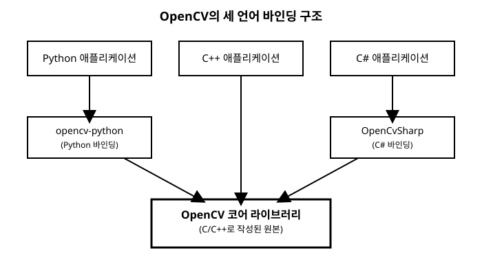

# 1장. OpenCV란 무엇인가

[◀ 이전: 목차](00-목차.md) | [📖 목차](00-목차.md) | [다음: 2장. 개발 환경 설정과 첫 프로그램 ▶](ch02-개발환경설정과첫프로그램.md)

컴퓨터 비전(Computer Vision)은 카메라나 이미지 파일로부터 얻은 픽셀 데이터를 분석해서, 그 안에 무엇이 있는지, 어떤 변화가 일어나고 있는지를 컴퓨터가 이해하도록 만드는 분야입니다. 사람은 사진 한 장을 보고 즉시 "고양이가 소파 위에 앉아 있다"거나 "이 문서는 기울어져 스캔되었다"는 사실을 파악하지만, 컴퓨터에게 이미지란 그저 숫자로 가득 찬 배열일 뿐입니다. 이 숫자 더미에서 의미 있는 정보를 뽑아내는 도구 모음이 바로 컴퓨터 비전 라이브러리이고, 그중 가장 널리 쓰이는 것이 OpenCV입니다.

이 장에서는 OpenCV가 어떤 배경에서 만들어졌고 왜 지금까지도 업계 표준처럼 쓰이는지 살펴본 다음, 이 책이 Python·C++·C# 세 언어를 나란히 다루기로 한 이유와 그 세 언어가 OpenCV 안에서 어떤 관계를 맺고 있는지 짚어보겠습니다. 마지막으로 이 책 전체에서 계속 마주치게 될 아주 중요한 규칙 하나, 바로 "OpenCV의 이미지는 RGB가 아니라 BGR 순서로 저장된다"는 사실을 확인하고 넘어갑니다.

## OpenCV의 탄생과 목적

OpenCV(Open Source Computer Vision Library)는 1999년 인텔(Intel)의 연구 프로젝트로 시작되었습니다. 당시 목표는 컴퓨터 비전 알고리즘을 연구자들이 매번 처음부터 새로 구현하지 않도록, 최적화된 표준 구현체를 공개된 형태로 제공하는 것이었습니다. 2000년에 첫 공개 버전이 나온 이후 지금까지 활발히 개발되고 있으며, 현재는 비영리 재단인 OpenCV.org가 프로젝트를 관리하고 있습니다.

OpenCV는 처음부터 C와 C++로 작성되었습니다. 이는 우연이 아니라 명확한 설계 목표에서 나온 선택입니다. 이미지 한 장은 수십만~수백만 개의 픽셀로 이루어져 있고, 비디오라면 초당 수십 장의 이미지를 실시간으로 처리해야 합니다. 이런 작업을 빠르게 처리하려면 하드웨어에 가까운 저수준 언어로 메모리와 연산을 직접 제어할 수 있어야 했고, C++가 그 요구에 가장 잘 맞았습니다. 라이선스 또한 처음부터 개방적으로 설계되어(현재는 Apache 2.0 라이선스), 상업적 용도로 제품에 포함시키는 것도 자유롭게 허용됩니다. 이 두 가지, 즉 "네이티브 코드 수준의 성능"과 "자유로운 사용 조건"이 OpenCV가 학계뿐 아니라 산업계에서도 표준처럼 자리 잡게 된 핵심 이유입니다.

## 왜 이렇게 널리 쓰이는가

OpenCV가 20년 넘게 컴퓨터 비전의 기본 도구로 남아있는 데는 몇 가지 이유가 있습니다.

첫째, **다루는 범위가 매우 넓습니다.** 단순한 이미지 파일 입출력부터 색공간 변환, 필터링, 기하 변환, 엣지 검출, 컨투어 분석, 특징점 매칭, 얼굴 검출, 최근에는 딥러닝 모델을 불러와 추론하는 DNN 모듈까지 하나의 라이브러리 안에 다 들어 있습니다. 이 책의 목차만 봐도 5장 색공간 변환부터 17장 얼굴·객체 검출까지, 컴퓨터 비전에서 실무적으로 쓰이는 거의 모든 기법이 OpenCV 하나로 커버된다는 것을 알 수 있습니다.

둘째, **성능이 뛰어납니다.** 핵심 연산이 최적화된 C++ 코드로 구현되어 있고, 많은 함수가 내부적으로 멀티스레딩과 SIMD(단일 명령 다중 데이터) 명령어를 활용합니다. 그래서 인터프리터 언어인 Python에서 OpenCV를 쓰더라도, 실제 연산은 컴파일된 네이티브 코드가 처리하기 때문에 순수 Python으로 같은 알고리즘을 구현했을 때보다 훨씬 빠릅니다.

셋째, **플랫폼과 언어를 가리지 않습니다.** Windows, Linux, macOS는 물론 안드로이드와 iOS까지 지원하고, 뒤에서 설명할 바인딩을 통해 Python, Java, C#, JavaScript 등 다양한 언어에서도 거의 동일한 기능을 사용할 수 있습니다.

넷째, **커뮤니티와 생태계가 거대합니다.** 수십 년간 쌓인 튜토리얼, 스택오버플로우 질문, 예제 코드가 존재하고, 최신 딥러닝 프레임워크(TensorFlow, PyTorch, ONNX 등)로 학습한 모델을 OpenCV의 DNN 모듈로 바로 불러와 실행할 수도 있습니다. 이 내용은 17장에서 자세히 다룹니다.

## 이 책이 세 언어를 나란히 다루는 이유

시중의 OpenCV 책이나 강좌는 보통 한 언어만 골라서 설명합니다. Python은 문법이 간결해 입문자에게 인기가 많고, C++는 실제 성능이 중요한 제품에 쓰이며, C#은 WPF나 Unity 같은 .NET 생태계 안에서 비전 기능을 넣고 싶을 때 선택됩니다. 그런데 이 세 언어는 겉모습만 다를 뿐, 내부적으로는 정확히 같은 OpenCV 알고리즘을 호출합니다. 즉 `cv2.GaussianBlur()`와 `cv::GaussianBlur()`와 `Cv2.GaussianBlur()`는 함수 이름의 표기 방식만 다르고, 실행되는 계산 자체는 동일합니다.

이 책은 이 사실을 거꾸로 활용합니다. 하나의 개념을 세 언어로 동시에 보여주면, "OpenCV가 이 문제를 어떻게 푸는가"라는 알고리즘 차원의 이해와 "이 언어는 이런 것을 이렇게 표현하는구나"라는 언어 차원의 이해를 한 번에 얻을 수 있습니다. 예를 들어 Python에서는 이미지가 NumPy 배열이라 슬라이싱으로 관심 영역을 잘라낼 수 있지만, C++에서는 `cv::Mat`의 참조 시맨틱과 `cv::Rect`를 이용한 서브 매트릭스 개념을 이해해야 합니다. C#에서는 `Mat`이 관리되지 않는(unmanaged) 리소스를 감싸고 있어 `Dispose()` 또는 `using` 구문으로 해제해줘야 한다는, .NET 특유의 사정도 따라옵니다. 이처럼 같은 결과를 얻는 세 가지 경로를 나란히 비교하다 보면, 특정 언어에 국한되지 않는 컴퓨터 비전 자체의 원리와 각 언어의 고유한 스타일을 동시에 몸에 익히게 됩니다.

이런 이유로 이 책의 거의 모든 예제는 Python, C++, C# 세 가지 코드로 나란히 제공됩니다. 하나의 언어만 필요하다면 해당 절만 따라가도 되고, 이미 한 언어의 OpenCV 사용법을 알고 있다면 다른 두 언어의 절을 비교하며 "내가 알던 이 함수가 저 언어에서는 이렇게 생겼구나"를 확인하는 용도로 읽어도 좋습니다.

## OpenCV의 세 얼굴: C++ 코어와 그 위의 바인딩

세 언어를 나란히 배우기 전에, 이 셋이 서로 어떤 관계인지 정확히 알아둘 필요가 있습니다. OpenCV는 하나의 라이브러리가 세 언어로 각각 독립적으로 재구현된 것이 아닙니다. 실제로는 다음과 같은 하나의 구조입니다.

- **C++ 코어**: OpenCV 본체입니다. 모든 알고리즘의 실제 구현이 이곳에 있습니다.
- **opencv-python**: 이 C++ 코어를 감싸서 Python에서 호출할 수 있도록 만든 바인딩(공식 프로젝트)입니다. `import cv2`로 불러오는 이 패키지의 내부는 C++ 코드에 대한 얇은 래퍼(wrapper)이며, `pip install opencv-python`으로 설치합니다.
- **OpenCvSharp**: 역시 C++ 코어를 감싸는 바인딩이지만, 이번엔 .NET/C# 진영을 위한 커뮤니티 프로젝트입니다. NuGet의 `OpenCvSharp4` 패키지로 설치합니다.

즉 C++만이 OpenCV의 "원본"이고, Python과 C#에서 쓰는 OpenCV는 그 원본 위에 얹힌 껍데기라고 볼 수 있습니다. 이 구조 때문에 몇 가지 실용적인 결과가 따라옵니다.

먼저, **알고리즘의 동작과 성능은 세 언어에서 본질적으로 동일합니다.** Python에서 `cv2.Canny()`를 호출해도 실제 엣지 검출 연산은 C++로 컴파일된 코드가 수행하므로, 순수 Python 반복문으로 같은 알고리즘을 짰을 때보다 훨씬 빠릅니다. 물론 이미지를 픽셀 단위로 하나씩 순회하며 Python 코드를 직접 실행하는 경우라면 이 이야기가 달라지는데, 이 점은 18장에서 성능 최적화를 다룰 때 다시 짚습니다.

다음으로, **API의 이름 짓는 방식과 자료형은 각 언어의 관용구를 따릅니다.** C++ API는 `cv::` 네임스페이스와 `snake_case` 또는 `camelCase`가 섞인 함수 이름을 쓰고 이미지를 `cv::Mat` 클래스로 표현합니다. opencv-python은 이 C++ 함수들을 Python 관용구에 맞춰 `cv2.functionName()` 형태의 모듈 함수로 노출하고, 이미지는 C++의 `Mat` 대신 NumPy의 `np.ndarray`로 표현합니다. OpenCvSharp은 .NET의 명명 규칙에 맞춰 정적 클래스 `Cv2`의 메서드를 PascalCase(`Cv2.GaussianBlur()`처럼 각 단어의 첫 글자를 대문자로 쓰는 표기법)로 제공하며, 이미지는 OpenCvSharp 자체의 `Mat` 클래스(C++의 `cv::Mat`과 이름은 같지만 별개의 클래스)로 표현합니다. 3장에서 이 세 가지 이미지 표현 방식의 차이를 자세히 다룹니다.

이 관계를 그림으로 정리하면 다음과 같습니다.

C++ 애플리케이션은 코어 라이브러리를 직접 호출하고, Python과 C# 애플리케이션은 각각의 바인딩 계층을 한 번 거쳐서 같은 코어에 도달합니다. 이 책에서 세 언어의 코드가 다르게 보이더라도, 그 아래에서는 결국 같은 연산이 실행되고 있다는 점을 기억해 두면 이후 장에서 세 코드를 비교할 때 훨씬 편하게 읽을 수 있습니다.

## 채널 순서에 대한 중요한 사실: BGR

OpenCV를 처음 접하는 사람들이 가장 자주 놀라는 지점이 하나 있습니다. 컬러 이미지를 불러오면 색상 채널이 우리가 흔히 생각하는 R-G-B(빨강-초록-파랑) 순서가 아니라 **B-G-R(파랑-초록-빨강)** 순서로 저장된다는 점입니다.

이 순서는 세 언어 모두에서 동일하게 적용되는 OpenCV의 기본 관례입니다. Python의 `cv2.imread()`, C++의 `cv::imread()`, C#의 `Cv2.ImRead()`는 모두 이미지를 BGR 순서로 메모리에 채워 넣습니다. 이는 OpenCV가 처음 만들어질 당시 널리 쓰이던 Windows 비트맵 포맷 등에서 BGR 순서가 관례였던 역사적 배경 때문인데, 지금까지도 하위 호환성을 위해 그대로 유지되고 있습니다.

이 사실이 왜 중요한지는 직접 겪어보면 바로 알게 됩니다. 예를 들어 OpenCV로 읽은 이미지를 RGB를 기대하는 다른 라이브러리(matplotlib, 웹 브라우저, 딥러닝 프레임워크의 시각화 도구 등)에 그대로 넘기면, 붉은색이었어야 할 부분이 파랗게, 파란색이었어야 할 부분이 붉게 뒤바뀐 채로 나타납니다. 이런 문제를 피하려면 필요할 때 `cv2.cvtColor()`(및 각 언어의 대응 함수)로 BGR과 RGB 사이를 명시적으로 변환해줘야 합니다. 이 변환은 5장 색공간 변환에서 실제 코드와 함께 자세히 다루고, 4장에서 이미지를 처음 읽고 화면에 띄워볼 때도 다시 한번 짚고 넘어갑니다. 지금 단계에서는 "OpenCV는 기본적으로 BGR을 쓴다"는 규칙 하나만 확실히 기억해두면 충분합니다.

## 컴퓨터 비전으로 할 수 있는 것들 미리보기

이 책 전체에서 다룰 내용을 간단히 미리 보면, 컴퓨터 비전이 실제로 어떤 문제를 풀어내는지 감이 잡힐 것입니다.

- **이미지를 읽고 다루기**: 사진 파일이나 웹캠 영상을 프로그램 안으로 불러오고, 픽셀 값을 직접 들여다보거나 수정하는 방법 (3장, 4장)
- **필터링과 블러**: 노이즈를 줄이거나 이미지를 부드럽게, 혹은 선명하게 만드는 방법 (9장)
- **임계처리와 모폴로지**: 이미지를 흑백 이진 영역으로 나누고, 그 영역의 구멍을 메우거나 잔가지를 없애는 방법 (10장, 11장)
- **엣지와 컨투어**: 물체의 윤곽선을 찾아내고, 그 윤곽으로부터 면적·둘레·중심 같은 정보를 뽑아내는 방법 (12장, 13장)
- **특징점 매칭**: 두 이미지에서 서로 대응하는 지점을 찾아 사진을 이어붙이거나 물체를 인식하는 방법 (15장)
- **비디오와 배경 제거**: 움직이는 영상에서 배경과 움직이는 물체를 구분해내는 방법 (16장)
- **얼굴·객체 검출**: 사진 속에서 얼굴이나 특정 물체가 어디 있는지 찾아내는 방법, 그리고 딥러닝 모델을 활용하는 방법 (17장)

이 모든 기능이 앞서 설명한 것처럼 Python, C++, C# 세 언어에서 거의 동일한 이름과 인자로 제공됩니다. 다음 장에서는 각 언어별로 OpenCV를 설치하고, 이미지 한 장을 불러와 화면에 띄워보는 첫 프로그램을 함께 작성해보겠습니다.

## 요약

- OpenCV는 1999년 인텔에서 시작된 오픈소스 컴퓨터 비전 라이브러리로, 원래 C/C++로 작성되었으며 현재 Apache 2.0 라이선스로 배포됩니다.
- 다루는 알고리즘의 범위가 넓고, 네이티브 코드 수준의 성능을 내며, 여러 플랫폼과 언어를 지원하고, 거대한 커뮤니티를 갖고 있어 컴퓨터 비전의 사실상 표준 라이브러리로 자리 잡았습니다.
- C++가 OpenCV의 원본 코어이며, Python의 opencv-python과 C#의 OpenCvSharp은 그 위에 얹힌 바인딩입니다. 세 언어 모두 결국 같은 알고리즘을 호출하지만, API의 이름 규칙과 이미지 표현 방식은 각 언어의 관용구를 따릅니다.
- OpenCV는 컬러 이미지를 RGB가 아닌 **BGR** 순서로 다룹니다. 이 책의 세 언어 모두에서 동일하게 적용되는 규칙이며, 다른 라이브러리와 이미지를 주고받을 때 반드시 기억해야 합니다.
- 이 책은 모든 주요 예제를 Python, C++, C# 세 언어로 나란히 제공하여, 알고리즘 자체에 대한 이해와 각 언어의 관용구에 대한 이해를 동시에 얻도록 구성되어 있습니다.

## 연습문제

1. OpenCV가 처음 C/C++로 개발된 이유를 컴퓨터 비전 작업의 특성과 연결지어 한두 문장으로 설명해보세요.
2. C++ 코어, opencv-python, OpenCvSharp 세 가지의 관계를 그림 없이 말로 설명해보세요. 어느 것이 "원본"이고 어느 것이 "바인딩"인가요?
3. OpenCV의 이미지가 BGR 순서로 저장된다는 사실을 모른 채 다른 라이브러리와 이미지를 주고받으면 어떤 문제가 생길 수 있는지 예를 들어 설명해보세요.
4. 이 책에서 세 언어를 나란히 배우는 방식이 한 언어만 배우는 것과 비교해 어떤 장점이 있다고 생각하는지 자신의 말로 정리해보세요.
5. 이 책의 목차를 훑어보고, 여러분이 가장 흥미를 느끼는 장 세 개를 골라 그 이유를 적어보세요.

---

[◀ 이전: 목차](00-목차.md) | [📖 목차](00-목차.md) | [다음: 2장. 개발 환경 설정과 첫 프로그램 ▶](ch02-개발환경설정과첫프로그램.md)
