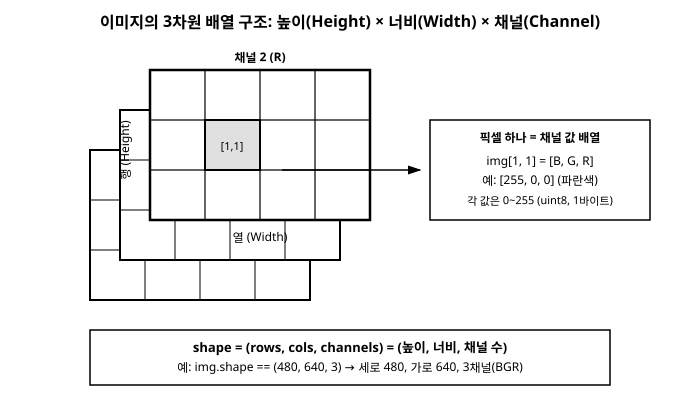

# 3장. 이미지의 기본 구조(Mat과 NumPy 배열)

[◀ 이전: 2장. 개발 환경 설정과 첫 프로그램](ch02-개발환경설정과첫프로그램.md) | [📖 목차](00-목차.md) | [다음: 4장. 이미지 입출력과 비디오 캡처 기초 ▶](ch04-이미지입출력과비디오캡처기초.md)


디지털 이미지를 다루는 프로그램을 작성하려면, 가장 먼저 "이미지가 메모리에서 실제로 어떤 모습을 하고 있는가"를 정확히 이해해야 한다. OpenCV의 함수들은 하나같이 이 내부 구조를 전제로 동작하기 때문에, 구조를 모르고 함수만 외워서 쓰면 픽셀 좌표를 잘못 짚거나 채널 순서를 헷갈리는 실수를 반복하게 된다. 이번 장에서는 이미지가 메모리에 저장되는 방식을 먼저 살펴보고, 그것이 Python에서는 NumPy 배열로, C++에서는 `cv::Mat` 클래스로, C#에서는 OpenCvSharp의 `Mat` 클래스로 각각 어떻게 표현되는지 나란히 비교한다.

## 3.1 이미지는 숫자의 3차원 배열이다

디지털 이미지는 결국 픽셀(pixel, picture element)이라는 작은 점들의 격자다. 컬러 사진 한 장을 확대해서 들여다보면, 사각형 모눈 하나하나에 색이 칠해져 있는 모습을 보게 된다. 컴퓨터는 이 각각의 모눈, 즉 픽셀을 숫자로 저장한다.

흑백(그레이스케일) 이미지라면 픽셀 하나당 숫자 하나만 있으면 충분하다. 이 숫자가 클수록 밝고(255에 가까울수록 흰색), 작을수록 어둡다(0에 가까울수록 검은색). 그래서 그레이스케일 이미지는 "높이 × 너비" 크기의 2차원 배열로 표현할 수 있다.

컬러 이미지는 여기에 "채널"이라는 차원이 하나 더 필요하다. 픽셀 하나의 색을 표현하려면 보통 빨강(R), 초록(G), 파랑(B) 세 가지 색의 강도를 각각 저장해야 하기 때문이다. 그래서 컬러 이미지는 "높이 × 너비 × 채널 수"의 3차원 배열이 된다. 세로로 몇 개의 행(row)이 있고, 가로로 몇 개의 열(column)이 있으며, 각 칸(픽셀)마다 채널 수만큼의 숫자가 들어 있는 구조다.

> **주의: OpenCV는 RGB가 아니라 BGR 순서를 쓴다**
> 대부분의 이미지 포맷과 다른 라이브러리들은 채널을 R, G, B(빨강-초록-파랑) 순서로 저장하지만, OpenCV는 역사적인 이유로 B, G, R(파랑-초록-빨강) 순서를 기본으로 사용한다. `imread`로 읽은 컬러 이미지의 채널 0번은 파랑, 1번은 초록, 2번은 빨강이다. 이 순서는 이 책 전체에서 계속 등장하므로 지금 확실히 기억해 두자.

각 픽셀, 각 채널의 값은 보통 0부터 255까지의 정수 하나로 표현된다. 이는 1바이트(8비트)로 표현할 수 있는 정수의 범위와 정확히 일치하며, 이런 자료형을 "8비트 부호 없는 정수(8-bit unsigned integer)"라고 부르고 흔히 `uint8`이라는 이름으로 줄여 쓴다. 부호가 없다는 것은 음수를 표현하지 않는다는 뜻이고, 8비트이므로 $2^8 = 256$가지 값, 즉 0~255를 표현할 수 있다.

정리하면, 컬러 이미지 한 장은 다음과 같은 3차원 배열이다.

```
shape = (높이, 너비, 채널 수)
```

예를 들어 세로 480픽셀, 가로 640픽셀 크기의 컬러(3채널) 이미지라면 `(480, 640, 3)` 형태의 배열이 되고, 이 배열이 담고 있는 원소(숫자)의 총 개수는 $480 \times 640 \times 3 = 921{,}600$개다. 이 구조를 그림으로 나타내면 다음과 같다.



이 3차원 배열이라는 개념 하나만 확실히 잡아 두면, 이제부터 Python의 NumPy 배열, C++의 `cv::Mat`, C#의 `Mat`이 각각 이 개념을 어떤 방식으로 감싸서 제공하는지를 비교하는 일만 남는다. 세 언어의 문법은 다르지만 가리키는 대상은 완전히 동일하다.

## 3.2 Python: 이미지는 곧 NumPy 배열이다

Python OpenCV(`cv2`)에서 가장 먼저 이해해야 할 사실은, **이미지가 별도의 특수한 "이미지 객체"가 아니라 그냥 NumPy의 `ndarray`라는 것**이다. `cv2.imread()`가 반환하는 값도, 우리가 직접 만드는 빈 이미지도, 모두 `numpy.ndarray` 타입이다. 그래서 OpenCV 전용 문법을 배우기 전에 NumPy 배열을 다루는 법을 알면 이미지의 절반은 이미 다룰 줄 아는 셈이다.

배열의 형태(shape)와 자료형(dtype)은 다음과 같이 확인한다.

### Python

```python
import cv2
import numpy as np

img = cv2.imread("photo.jpg")  # 컬러(BGR)로 읽어 들임

print(type(img))       # <class 'numpy.ndarray'>
print(img.shape)        # (480, 640, 3) 같은 형태: (높이, 너비, 채널)
print(img.dtype)        # uint8
print(img.size)         # 전체 원소 개수: 480 * 640 * 3

height, width, channels = img.shape
print(f"세로: {height}, 가로: {width}, 채널 수: {channels}")
```

`img.shape`는 튜플을 반환하며, 순서는 항상 **(높이, 너비, 채널)**이다. 흔히 실수하는 부분이 바로 이 순서인데, 수학이나 좌표계에서 익숙한 (x, y)가 아니라 (행, 열) 순서, 즉 (세로, 가로) 순서라는 점을 기억해야 한다. `img.dtype`은 배열에 저장된 값의 자료형을 알려주며, 일반적인 8비트 이미지라면 `uint8`이 출력된다.

만약 그레이스케일로 이미지를 읽었다면 채널 차원 자체가 없어져서 `shape`가 `(480, 640)`처럼 2개의 값만 가진 튜플이 된다. 이 차이는 4장에서 컬러/그레이스케일 읽기 옵션을 다룰 때 다시 짚는다.

### C++

C++에서는 `cv::Mat` 클래스가 이미지를 표현한다. `Mat`은 내부적으로 픽셀 데이터가 저장된 메모리 버퍼에 대한 포인터와, 그 데이터를 해석하는 데 필요한 정보(행 수, 열 수, 채널 수, 자료형 등)를 함께 가지고 있는 객체다.

```cpp
#include <opencv2/opencv.hpp>
#include <iostream>

int main() {
    cv::Mat img = cv::imread("photo.jpg");  // 컬러(BGR)로 읽어 들임

    std::cout << "rows(높이): " << img.rows << std::endl;
    std::cout << "cols(너비): " << img.cols << std::endl;
    std::cout << "channels(채널 수): " << img.channels() << std::endl;
    std::cout << "type(): " << img.type() << std::endl;   // 예: CV_8UC3 -> 16
    std::cout << "depth(): " << img.depth() << std::endl; // 예: CV_8U -> 0

    return 0;
}
```

`img.rows`와 `img.cols`는 각각 Python의 `img.shape[0]`(높이), `img.shape[1]`(너비)에 대응한다. `img.channels()`는 채널 수를 돌려주는 함수이며, `img.type()`은 자료형과 채널 수를 합쳐 인코딩한 정수 코드를 반환한다. 예를 들어 8비트 부호 없는 정수 3채널 이미지의 타입 코드는 `CV_8UC3`이라는 이름의 상수로 정의되어 있다. `CV_8U`는 "8비트 unsigned", `C3`은 "채널 3개"를 뜻한다. 채널 수만 따로 알고 싶다면 `img.depth()`로 자료형(정밀도)만 뽑아낼 수도 있다.

Python의 `dtype == uint8`이라는 사실은 C++에서 `img.depth() == CV_8U`라는 사실과 같은 의미이고, Python의 `shape[2] == 3`이라는 사실은 C++의 `img.channels() == 3`과 같은 의미다. 즉 표현하는 방식(속성 이름)만 다를 뿐 담고 있는 정보는 완전히 동일하다.

### C#

C#에서 OpenCvSharp을 사용할 때도 마찬가지로 `Mat` 클래스가 이미지를 표현한다. C++의 `cv::Mat`을 감싸는 래퍼(wrapper)이기 때문에 개념은 거의 동일하지만, .NET 관례에 따라 속성과 메서드 이름이 PascalCase로 되어 있다.

```csharp
using System;
using OpenCvSharp;

class Program
{
    static void Main()
    {
        Mat img = Cv2.ImRead("photo.jpg");  // 컬러(BGR)로 읽어 들임

        Console.WriteLine($"Rows(높이): {img.Rows}");
        Console.WriteLine($"Cols(너비): {img.Cols}");
        Console.WriteLine($"Channels(채널 수): {img.Channels()}");
        Console.WriteLine($"Type: {img.Type()}");   // 예: CV_8UC3
        Console.WriteLine($"Depth: {img.Depth()}"); // 예: CV_8U
    }
}
```

`img.Rows`, `img.Cols`, `img.Channels()`는 C++의 `rows`, `cols`, `channels()`와 이름만 대문자로 시작할 뿐 동작이 완전히 같다. `img.Type()` 역시 `MatType` 값을 반환하며, 화면에 출력하면 `CV_8UC3`처럼 사람이 읽기 좋은 문자열로 나온다.

세 언어의 대응 관계를 표로 정리하면 다음과 같다.

| 정보 | Python (`ndarray`) | C++ (`cv::Mat`) | C# (`Mat`) |
|---|---|---|---|
| 높이(행 수) | `img.shape[0]` | `img.rows` | `img.Rows` |
| 너비(열 수) | `img.shape[1]` | `img.cols` | `img.Cols` |
| 채널 수 | `img.shape[2]` | `img.channels()` | `img.Channels()` |
| 자료형 | `img.dtype` (`uint8`) | `img.depth()` (`CV_8U`) | `img.Depth()` (`CV_8U`) |
| 전체 형태/타입 코드 | `img.shape` | `img.type()` (`CV_8UC3`) | `img.Type()` (`CV_8UC3`) |

## 3.3 픽셀 값 직접 읽고 쓰기

이미지가 3차원 배열이라는 것을 알았으니, 이제 특정 좌표에 있는 픽셀의 값을 직접 읽고 바꾸는 방법을 살펴보자. 이 작업은 이미지 처리의 가장 근본적인 연산이며, 이후 장에서 배우는 필터링이나 변환 함수들도 결국 내부적으로는 이런 픽셀 접근을 대량으로 수행하는 것이다.

좌표를 지칭할 때 다시 한번 순서에 주의해야 한다. 배열의 차원 순서가 (높이, 너비)이므로, 픽셀에 접근할 때도 **(y, x)**, 즉 (행, 열) 순서로 지정하는 것이 배열 인덱싱의 기본이다. 이는 우리가 흔히 그림에서 좌표를 말할 때 쓰는 (x, y) 순서와는 반대이므로 항상 주의해야 한다.

### Python

```python
import cv2
import numpy as np

img = cv2.imread("photo.jpg")

y, x = 100, 200  # 세로 100, 가로 200 위치

# 픽셀 값 읽기: [B, G, R] 순서의 배열이 반환됨
pixel = img[y, x]
print(pixel)          # 예: [120 180  90] -> B=120, G=180, R=90

# 개별 채널만 읽기
b = img[y, x, 0]
g = img[y, x, 1]
r = img[y, x, 2]
print(f"B={b}, G={g}, R={r}")

# 픽셀 값 쓰기: 해당 좌표를 파란색으로 변경
img[y, x] = [255, 0, 0]

# 특정 영역(슬라이싱)을 한 번에 초록색으로 변경
img[50:150, 50:150] = [0, 255, 0]
```

NumPy에서는 인덱싱만으로 픽셀 하나를 읽고 쓸 수 있으며, 슬라이싱(`50:150`)을 이용하면 반복문 없이도 영역 전체를 한 번에 값으로 채울 수 있다. 이는 NumPy가 내부적으로 C로 구현된 벡터화 연산을 수행하기 때문에 매우 빠르다. 단, 이미지 전체를 한 픽셀씩 반복문으로 순회하며 읽고 쓰는 방식은 Python에서는 매우 느리므로, 가능하면 슬라이싱이나 NumPy/OpenCV의 벡터화 함수를 사용하는 것이 좋다는 점을 기억해 두자.

### C++

C++에서 개별 픽셀에 접근하는 가장 표준적인 방법은 `.at<T>(row, col)` 템플릿 메서드를 사용하는 것이다. 3채널 8비트 이미지의 픽셀 하나는 `cv::Vec3b` 타입(byte 3개로 이루어진 벡터)으로 표현된다.

```cpp
#include <opencv2/opencv.hpp>
#include <iostream>

int main() {
    cv::Mat img = cv::imread("photo.jpg");

    int y = 100, x = 200;  // 세로 100, 가로 200 위치

    // 픽셀 값 읽기: Vec3b는 [B, G, R] 순서
    cv::Vec3b pixel = img.at<cv::Vec3b>(y, x);
    uchar b = pixel[0];
    uchar g = pixel[1];
    uchar r = pixel[2];
    std::cout << "B=" << (int)b << ", G=" << (int)g << ", R=" << (int)r << std::endl;

    // 픽셀 값 쓰기: 해당 좌표를 파란색으로 변경
    img.at<cv::Vec3b>(y, x) = cv::Vec3b(255, 0, 0);

    // 특정 영역(ROI)을 한 번에 초록색으로 변경
    cv::Rect roi(50, 50, 100, 100);  // x, y, width, height
    img(roi).setTo(cv::Scalar(0, 255, 0));

    return 0;
}
```

`.at<cv::Vec3b>(y, x)`처럼 꺾쇠괄호(`<>`) 안에 픽셀의 실제 자료형을 명시해야 한다는 점이 C++만의 특징이다. `Mat`은 내부적으로 어떤 자료형이든 담을 수 있는 범용 컨테이너이기 때문에, 컴파일 시점에 "이 이미지는 8비트 3채널이니 Vec3b로 해석해 달라"고 알려주는 것이다. 그레이스케일(1채널) 이미지라면 `img.at<uchar>(y, x)`처럼 스칼라 타입을 직접 사용한다. 영역을 한꺼번에 채울 때는 `cv::Rect`로 관심 영역(Region of Interest, ROI)을 정의하고 `setTo()`를 호출하면 된다.

> **참고**: `.at<T>()`는 안전하지만(경계 검사를 수행하므로) 상대적으로 느리다. 성능이 중요한 반복 접근에는 `Mat::ptr<T>()`로 각 행의 시작 포인터를 얻어 순회하는 방법이 더 빠르지만, 이 책에서는 우선 명확성을 위해 `.at<T>()`를 기본으로 사용하고, 성능 최적화는 18장에서 별도로 다룬다.

### C#

C#에서도 `.At<T>(row, col)` 메서드나 인덱서를 통해 동일한 방식으로 픽셀에 접근할 수 있다.

```csharp
using System;
using OpenCvSharp;

class Program
{
    static void Main()
    {
        Mat img = Cv2.ImRead("photo.jpg");

        int y = 100, x = 200;  // 세로 100, 가로 200 위치

        // 픽셀 값 읽기: Vec3b는 [B, G, R] 순서
        Vec3b pixel = img.At<Vec3b>(y, x);
        byte b = pixel.Item0;
        byte g = pixel.Item1;
        byte r = pixel.Item2;
        Console.WriteLine($"B={b}, G={g}, R={r}");

        // 픽셀 값 쓰기: 해당 좌표를 파란색으로 변경
        img.At<Vec3b>(y, x) = new Vec3b(255, 0, 0);

        // 특정 영역(ROI)을 한 번에 초록색으로 변경
        Rect roi = new Rect(50, 50, 100, 100);  // x, y, width, height
        img[roi].SetTo(new Scalar(0, 255, 0));
    }
}
```

`img.At<Vec3b>(y, x)`는 C++의 `img.at<cv::Vec3b>(y, x)`와 이름의 대소문자만 다를 뿐 동일하게 동작한다. `Vec3b` 값의 개별 채널은 `Item0`, `Item1`, `Item2` 속성으로 접근한다. 영역을 지정할 때는 `img[roi]` 인덱서로 관심 영역을 얻고 `SetTo()`를 호출하는데, 이 역시 C++의 `img(roi).setTo(...)`와 대응된다.

세 언어의 픽셀 접근 문법을 나란히 정리하면 다음과 같다.

| 동작 | Python | C++ | C# |
|---|---|---|---|
| 픽셀 읽기 | `img[y, x]` | `img.at<cv::Vec3b>(y, x)` | `img.At<Vec3b>(y, x)` |
| 개별 채널 읽기 | `img[y, x, 0]` | `img.at<cv::Vec3b>(y, x)[0]` | `img.At<Vec3b>(y, x).Item0` |
| 픽셀 쓰기 | `img[y, x] = [b, g, r]` | `img.at<cv::Vec3b>(y, x) = cv::Vec3b(b, g, r)` | `img.At<Vec3b>(y, x) = new Vec3b(b, g, r)` |

## 3.4 빈 이미지 새로 만들기

이미지 처리를 하다 보면 결과를 그려 넣을 새로운 이미지, 예를 들어 완전히 검은 화면이나 흰 화면을 처음부터 만들어야 하는 경우가 자주 있다. "모든 픽셀 값이 0인 3차원 배열"을 만든다는 것은 곧 "완전히 검은 이미지"를 만든다는 뜻이다.

### Python

```python
import numpy as np

height, width = 480, 640

# 세로 480, 가로 640, 3채널(BGR), 모든 값이 0인 검은 이미지
black_img = np.zeros((height, width, 3), dtype=np.uint8)
print(black_img.shape)  # (480, 640, 3)
print(black_img.dtype)  # uint8

# 모든 값이 255인 흰 이미지
white_img = np.full((height, width, 3), 255, dtype=np.uint8)

# 그레이스케일(1채널) 검은 이미지
gray_black = np.zeros((height, width), dtype=np.uint8)
```

`np.zeros()`는 지정한 형태(shape)의 배열을 만들면서 모든 원소를 0으로 채운다. 이때 `dtype=np.uint8`을 반드시 명시해야 한다. 지정하지 않으면 NumPy는 기본적으로 실수형(`float64`)으로 배열을 만드는데, OpenCV의 이미지 관련 함수들은 대부분 8비트 정수 이미지를 기대하므로 자료형이 맞지 않으면 오류가 나거나 예상치 못한 결과가 나온다.

### C++

```cpp
#include <opencv2/opencv.hpp>

int main() {
    int height = 480, width = 640;

    // 세로 480, 가로 640, 3채널(BGR), 모든 값이 0인 검은 이미지
    cv::Mat black_img = cv::Mat::zeros(height, width, CV_8UC3);

    // 모든 값이 255인 흰 이미지
    cv::Mat white_img(height, width, CV_8UC3, cv::Scalar(255, 255, 255));

    // 그레이스케일(1채널) 검은 이미지
    cv::Mat gray_black = cv::Mat::zeros(height, width, CV_8UC1);

    return 0;
}
```

`cv::Mat::zeros(height, width, CV_8UC3)`는 정적(static) 메서드로, 지정한 크기와 타입의 이미지를 만들고 모든 값을 0으로 초기화한다. `CV_8UC3`는 "8비트 unsigned, 3채널"을 뜻하는 타입 코드이며, 그레이스케일이라면 `CV_8UC1`을 사용한다. 특정 값(예: 흰색)으로 채우려면 생성자에 `cv::Scalar`로 초기값을 직접 지정하는 방법이 더 편리하다.

### C#

```csharp
using OpenCvSharp;

class Program
{
    static void Main()
    {
        int height = 480, width = 640;

        // 세로 480, 가로 640, 3채널(BGR), 모든 값이 0인 검은 이미지
        Mat blackImg = new Mat(height, width, MatType.CV_8UC3, Scalar.All(0));

        // 모든 값이 255인 흰 이미지
        Mat whiteImg = new Mat(height, width, MatType.CV_8UC3, new Scalar(255, 255, 255));

        // 그레이스케일(1채널) 검은 이미지
        Mat grayBlack = new Mat(height, width, MatType.CV_8UC1, Scalar.All(0));
    }
}
```

C#에서는 `Mat`의 생성자에 크기, 타입(`MatType.CV_8UC3`), 초기값(`Scalar`)을 함께 넘겨주는 방식이 자연스럽다. `Scalar.All(0)`은 모든 채널을 0으로 채우라는 뜻이고, `new Scalar(255, 255, 255)`처럼 채널별 값을 따로 지정할 수도 있다.

세 방식 모두 결과적으로 "세로 480 × 가로 640 × 3채널, 모든 값이 0(또는 255)인 8비트 배열"이라는 동일한 데이터를 만든다는 점을 기억하자. 문법의 생김새는 각 언어의 관례를 따르지만, 그 밑바탕에 있는 개념은 3.1절에서 그린 그림 그대로다.

## 요약

- 컬러 디지털 이미지는 (높이, 너비, 채널 수) 형태의 3차원 배열이며, 각 원소는 보통 0~255 범위의 8비트 부호 없는 정수(`uint8`)다.
- OpenCV는 채널을 R, G, B가 아니라 **B, G, R** 순서로 저장한다는 점을 항상 기억해야 한다.
- Python에서는 이미지가 그냥 NumPy `ndarray`이며, `.shape`로 (높이, 너비, 채널)을, `.dtype`으로 `uint8` 여부를 확인한다.
- C++에서는 `cv::Mat` 클래스가 이미지를 표현하며, `.rows`, `.cols`, `.channels()`, `.type()`, `.depth()`로 동일한 정보를 얻는다.
- C#에서는 OpenCvSharp의 `Mat` 클래스가 C++의 `cv::Mat`을 PascalCase로 감싼 형태이며, `.Rows`, `.Cols`, `.Channels()`, `.Type()`으로 대응된다.
- 픽셀 접근은 (y, x), 즉 (행, 열) 순서를 따른다: Python `img[y, x]`, C++ `img.at<cv::Vec3b>(y, x)`, C# `img.At<Vec3b>(y, x)`.
- 빈 이미지를 새로 만들 때는 Python `np.zeros((h, w, 3), dtype=np.uint8)`, C++ `cv::Mat::zeros(h, w, CV_8UC3)`, C# `new Mat(h, w, MatType.CV_8UC3, Scalar.All(0))`을 사용한다.

## 연습문제

1. 세로 300, 가로 400 크기의 완전히 빨간색(BGR 기준으로 R=255, G=0, B=0)인 이미지를 Python, C++, C# 세 언어로 각각 만들어 보아라.
2. `img.shape`가 `(360, 640)`으로 나오는(채널 정보가 없는) 이미지는 어떤 종류의 이미지인지 설명하고, 이런 이미지의 특정 픽셀 값을 읽는 코드를 세 언어로 작성해 보아라.
3. 세로 200, 가로 200인 검은 이미지를 만들고, 정확히 중앙의 100×100 영역만 흰색으로 채우는 코드를 세 언어로 작성해 보아라. (힌트: 슬라이싱 또는 ROI를 사용한다.)
4. C++의 `img.at<cv::Vec3b>(y, x)[0]`이 나타내는 값은 B, G, R 중 무엇인지 답하고, 그 이유를 설명해 보아라.
5. NumPy 배열에서 `img[y, x]`로 픽셀 하나를 읽는 것과 `img[y, x, :]`로 읽는 것의 차이가 있는지, 있다면 무엇인지 실습을 통해 확인해 보아라.

---

[◀ 이전: 2장. 개발 환경 설정과 첫 프로그램](ch02-개발환경설정과첫프로그램.md) | [📖 목차](00-목차.md) | [다음: 4장. 이미지 입출력과 비디오 캡처 기초 ▶](ch04-이미지입출력과비디오캡처기초.md)
