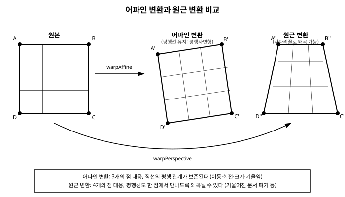

# 8장. 기하 변환(리사이즈·회전·워프)

[◀ 이전: 7장. 이미지 연산과 채널 처리](ch07-이미지연산과채널처리.md) | [📖 목차](00-목차.md) | [다음: 9장. 필터링과 블러 ▶](ch09-필터링과블러.md)


지금까지는 이미지의 밝기나 색, 픽셀 값을 다루는 방법을 배웠습니다. 이 장에서는 이미지의 **모양과 위치**를 바꾸는 기하 변환(geometric transformation)을 다룹니다. 크기를 조절하는 리사이즈, 회전과 이동을 함께 표현하는 어파인 변환, 카메라 각도로 기울어진 물체를 정면으로 펴는 원근 변환, 그리고 좌우/상하로 뒤집는 플립까지 살펴봅니다.

기하 변환은 데이터 증강(data augmentation), 문서 스캔 보정, 이미지 정합(image registration) 등 실전에서 매우 자주 쓰이는 기법이며, 15장에서 다룰 특징점 매칭 후 이미지를 정렬하는 작업의 기초가 되기도 합니다.

## 8.1 리사이즈(resize)와 보간법

`resize`는 이미지의 가로·세로 크기를 바꾸는 함수입니다. 크기를 줄이거나 늘릴 때는 원래 없던 픽셀 값을 새로 계산해서 채워야 하는데, 이 계산 방식을 **보간법(interpolation)**이라고 부릅니다. OpenCV가 지원하는 주요 보간법은 다음과 같습니다.

| 보간법 | 설명 | 특징 |
|---|---|---|
| `INTER_NEAREST` (최근접 이웃) | 가장 가까운 픽셀 값을 그대로 사용 | 계산이 가장 빠르지만 결과가 계단처럼 거칠다 |
| `INTER_LINEAR` (양선형) | 주변 4개 픽셀을 거리 기반으로 선형 보간 | 기본값. 속도와 품질의 균형이 좋다 |
| `INTER_CUBIC` (3차 보간) | 주변 16개 픽셀을 3차 함수로 보간 | 더 부드럽고 선명하지만 계산량이 많다 |
| `INTER_AREA` | 픽셀 영역의 평균을 사용 | 이미지를 축소할 때 특히 품질이 좋다 |
| `INTER_LANCZOS4` | 8×8 Lanczos 커널 사용 | 가장 고품질이지만 가장 느리다 |

일반적인 규칙은 "확대할 때는 `INTER_CUBIC`이나 `INTER_LINEAR`, 축소할 때는 `INTER_AREA`"입니다. 실시간 처리처럼 속도가 중요한 경우에는 `INTER_NEAREST`나 `INTER_LINEAR`를 선택합니다.

`resize`는 목표 크기를 `(width, height)` 튜플로 직접 지정할 수도 있고, `fx`, `fy` 배율을 지정할 수도 있습니다.

### Python

```python
import cv2

img = cv2.imread('lena.jpg')
print('원본 크기:', img.shape[:2])  # (height, width)

# 1) 목표 크기를 직접 지정 (가로 300, 세로 200)
resized_fixed = cv2.resize(img, (300, 200), interpolation=cv2.INTER_LINEAR)

# 2) 배율로 지정 (가로세로 각각 1.5배 확대)
resized_scale = cv2.resize(img, None, fx=1.5, fy=1.5, interpolation=cv2.INTER_CUBIC)

# 3) 보간법 비교: 같은 축소 작업을 여러 방법으로
small_nearest = cv2.resize(img, None, fx=0.2, fy=0.2, interpolation=cv2.INTER_NEAREST)
small_area = cv2.resize(img, None, fx=0.2, fy=0.2, interpolation=cv2.INTER_AREA)

cv2.imshow('Fixed size', resized_fixed)
cv2.imshow('Scaled up (cubic)', resized_scale)
cv2.imshow('Shrunk (nearest)', small_nearest)
cv2.imshow('Shrunk (area)', small_area)
cv2.waitKey(0)
cv2.destroyAllWindows()
```

### C++

```cpp
#include <opencv2/opencv.hpp>
#include <iostream>

int main() {
    cv::Mat img = cv::imread("lena.jpg");
    std::cout << "원본 크기: " << img.size() << std::endl;

    // 1) 목표 크기를 직접 지정 (가로 300, 세로 200)
    cv::Mat resizedFixed;
    cv::resize(img, resizedFixed, cv::Size(300, 200), 0, 0, cv::INTER_LINEAR);

    // 2) 배율로 지정 (가로세로 각각 1.5배 확대)
    cv::Mat resizedScale;
    cv::resize(img, resizedScale, cv::Size(), 1.5, 1.5, cv::INTER_CUBIC);

    // 3) 보간법 비교: 같은 축소 작업을 여러 방법으로
    cv::Mat smallNearest, smallArea;
    cv::resize(img, smallNearest, cv::Size(), 0.2, 0.2, cv::INTER_NEAREST);
    cv::resize(img, smallArea, cv::Size(), 0.2, 0.2, cv::INTER_AREA);

    cv::imshow("Fixed size", resizedFixed);
    cv::imshow("Scaled up (cubic)", resizedScale);
    cv::imshow("Shrunk (nearest)", smallNearest);
    cv::imshow("Shrunk (area)", smallArea);
    cv::waitKey(0);
    return 0;
}
```

### C#

```csharp
using System;
using OpenCvSharp;

class Program
{
    static void Main()
    {
        Mat img = Cv2.ImRead("lena.jpg");
        Console.WriteLine($"원본 크기: {img.Size()}");

        // 1) 목표 크기를 직접 지정 (가로 300, 세로 200)
        Mat resizedFixed = new Mat();
        Cv2.Resize(img, resizedFixed, new Size(300, 200), 0, 0, InterpolationFlags.Linear);

        // 2) 배율로 지정 (가로세로 각각 1.5배 확대)
        Mat resizedScale = new Mat();
        Cv2.Resize(img, resizedScale, new Size(), 1.5, 1.5, InterpolationFlags.Cubic);

        // 3) 보간법 비교: 같은 축소 작업을 여러 방법으로
        Mat smallNearest = new Mat();
        Mat smallArea = new Mat();
        Cv2.Resize(img, smallNearest, new Size(), 0.2, 0.2, InterpolationFlags.Nearest);
        Cv2.Resize(img, smallArea, new Size(), 0.2, 0.2, InterpolationFlags.Area);

        Cv2.ImShow("Fixed size", resizedFixed);
        Cv2.ImShow("Scaled up (cubic)", resizedScale);
        Cv2.ImShow("Shrunk (nearest)", smallNearest);
        Cv2.ImShow("Shrunk (area)", smallArea);
        Cv2.WaitKey(0);
    }
}
```

## 8.2 이동과 회전: warpAffine과 getRotationMatrix2D

**어파인 변환(affine transformation)**은 이동, 회전, 크기 조절, 기울임(shear)을 하나의 2×3 행렬로 표현하는 변환입니다. 어파인 변환의 중요한 성질은 변환 전에 평행했던 두 직선이 변환 후에도 평행을 유지한다는 점입니다. 이는 뒤에서 다룰 원근 변환과 구분되는 핵심적인 차이입니다.

이동만 표현하려면 다음과 같은 2×3 행렬을 사용합니다.

```
M = [ 1  0  tx ]
    [ 0  1  ty ]
```

여기서 `tx`, `ty`는 각각 x축, y축으로 이동할 픽셀 수입니다. 회전을 표현하려면 회전 중심, 회전 각도(도 단위), 크기 배율(scale)을 입력받아 자동으로 2×3 회전 행렬을 만들어 주는 `getRotationMatrix2D`를 사용하는 것이 편리합니다. 이렇게 만든 행렬 `M`을 `warpAffine`에 넘기면 실제 이미지에 변환이 적용됩니다.

### Python

```python
import cv2
import numpy as np

img = cv2.imread('lena.jpg')
h, w = img.shape[:2]

# 1) 평행 이동: x축으로 50px, y축으로 30px 이동
M_translate = np.float32([[1, 0, 50], [0, 1, 30]])
translated = cv2.warpAffine(img, M_translate, (w, h))

# 2) 회전: 이미지 중심을 기준으로 45도 회전, 크기는 그대로(scale=1.0)
center = (w // 2, h // 2)
M_rotate = cv2.getRotationMatrix2D(center, angle=45, scale=1.0)
rotated = cv2.warpAffine(img, M_rotate, (w, h))

# 3) 회전 + 축소를 동시에 (scale=0.7)
M_rotate_scale = cv2.getRotationMatrix2D(center, angle=30, scale=0.7)
rotated_scaled = cv2.warpAffine(img, M_rotate_scale, (w, h))

cv2.imshow('Translated', translated)
cv2.imshow('Rotated 45deg', rotated)
cv2.imshow('Rotated+Scaled', rotated_scaled)
cv2.waitKey(0)
cv2.destroyAllWindows()
```

### C++

```cpp
#include <opencv2/opencv.hpp>

int main() {
    cv::Mat img = cv::imread("lena.jpg");
    int h = img.rows, w = img.cols;

    // 1) 평행 이동: x축으로 50px, y축으로 30px 이동
    cv::Mat M_translate = (cv::Mat_<double>(2, 3) << 1, 0, 50, 0, 1, 30);
    cv::Mat translated;
    cv::warpAffine(img, translated, M_translate, cv::Size(w, h));

    // 2) 회전: 이미지 중심을 기준으로 45도 회전, 크기는 그대로(scale=1.0)
    cv::Point2f center(w / 2.0f, h / 2.0f);
    cv::Mat M_rotate = cv::getRotationMatrix2D(center, 45.0, 1.0);
    cv::Mat rotated;
    cv::warpAffine(img, rotated, M_rotate, cv::Size(w, h));

    // 3) 회전 + 축소를 동시에 (scale=0.7)
    cv::Mat M_rotateScale = cv::getRotationMatrix2D(center, 30.0, 0.7);
    cv::Mat rotatedScaled;
    cv::warpAffine(img, rotatedScaled, M_rotateScale, cv::Size(w, h));

    cv::imshow("Translated", translated);
    cv::imshow("Rotated 45deg", rotated);
    cv::imshow("Rotated+Scaled", rotatedScaled);
    cv::waitKey(0);
    return 0;
}
```

### C#

```csharp
using OpenCvSharp;

class Program
{
    static void Main()
    {
        Mat img = Cv2.ImRead("lena.jpg");
        int h = img.Rows, w = img.Cols;

        // 1) 평행 이동: x축으로 50px, y축으로 30px 이동
        Mat mTranslate = new Mat(2, 3, MatType.CV_64F, new double[] { 1, 0, 50, 0, 1, 30 });
        Mat translated = new Mat();
        Cv2.WarpAffine(img, translated, mTranslate, new Size(w, h));

        // 2) 회전: 이미지 중심을 기준으로 45도 회전, 크기는 그대로(scale=1.0)
        Point2f center = new Point2f(w / 2f, h / 2f);
        Mat mRotate = Cv2.GetRotationMatrix2D(center, 45.0, 1.0);
        Mat rotated = new Mat();
        Cv2.WarpAffine(img, rotated, mRotate, new Size(w, h));

        // 3) 회전 + 축소를 동시에 (scale=0.7)
        Mat mRotateScale = Cv2.GetRotationMatrix2D(center, 30.0, 0.7);
        Mat rotatedScaled = new Mat();
        Cv2.WarpAffine(img, rotatedScaled, mRotateScale, new Size(w, h));

        Cv2.ImShow("Translated", translated);
        Cv2.ImShow("Rotated 45deg", rotated);
        Cv2.ImShow("Rotated+Scaled", rotatedScaled);
        Cv2.WaitKey(0);
    }
}
```

> **참고**: `warpAffine`으로 회전을 하면 이미지의 모서리 부분이 캔버스 밖으로 잘려 나갈 수 있습니다. 회전 후 전체 내용을 보존하려면 회전 각도에 따라 필요한 새 캔버스 크기를 계산하고, 회전 행렬의 이동 성분(`M[0,2]`, `M[1,2]`)을 그만큼 보정해 주어야 합니다.

## 8.3 원근 변환: 기울어진 문서를 정면으로 펴기

어파인 변환은 평행선을 그대로 유지하기 때문에, 카메라를 비스듬히 기울여 촬영한 문서처럼 "원근감" 때문에 사각형이 사다리꼴로 찍힌 이미지는 어파인 변환만으로 완벽하게 펼 수 없습니다. 이런 경우에는 **원근 변환(perspective transformation)**이 필요합니다.

원근 변환은 3×3 행렬을 사용하며, 어파인 변환과 달리 평행선이 평행하지 않게(또는 그 반대로) 바뀔 수 있습니다. 어파인 변환에는 3개의 대응점만 있으면 행렬을 유일하게 구할 수 있지만, 원근 변환에는 4개의 대응점이 필요합니다.

사용 순서는 다음과 같습니다.

1. 원본 이미지에서 네 모서리(왜곡된 사각형)의 좌표 4개를 찾는다.
2. 이 점들이 옮겨갈 목표 좌표 4개(보통 정사각형이나 직사각형의 네 모서리)를 정한다.
3. `getPerspectiveTransform(src_points, dst_points)`로 3×3 변환 행렬을 구한다.
4. `warpPerspective`에 이 행렬을 넘겨 실제 변환을 적용한다.

아래 예제는 기울어진 각도에서 촬영된 문서의 네 꼭짓점을 지정해서, 이를 정면에서 본 것처럼 평평하게 펴는 작업을 보여줍니다.

### Python

```python
import cv2
import numpy as np

img = cv2.imread('document.jpg')

# 1) 원본 이미지에서 기울어진 문서의 네 모서리 좌표
#    (좌상, 우상, 우하, 좌하 순서로 지정하는 것이 관례)
src_points = np.float32([
    [120, 80],    # 좌상
    [430, 60],    # 우상
    [460, 500],   # 우하
    [80, 480],    # 좌하
])

# 2) 목표: 가로 400 x 세로 500 크기의 정면 문서로 편다
dst_w, dst_h = 400, 500
dst_points = np.float32([
    [0, 0],
    [dst_w, 0],
    [dst_w, dst_h],
    [0, dst_h],
])

# 3) 원근 변환 행렬 계산
M = cv2.getPerspectiveTransform(src_points, dst_points)

# 4) 변환 적용
warped = cv2.warpPerspective(img, M, (dst_w, dst_h))

# 참고용으로 원본에 선택한 4점을 표시
preview = img.copy()
for pt in src_points:
    cv2.circle(preview, tuple(pt.astype(int)), 6, (0, 0, 255), -1)

cv2.imshow('Original with points', preview)
cv2.imshow('Warped (flattened)', warped)
cv2.waitKey(0)
cv2.destroyAllWindows()
```

### C++

```cpp
#include <opencv2/opencv.hpp>
#include <vector>

int main() {
    cv::Mat img = cv::imread("document.jpg");

    // 1) 원본 이미지에서 기울어진 문서의 네 모서리 좌표
    //    (좌상, 우상, 우하, 좌하 순서로 지정하는 것이 관례)
    std::vector<cv::Point2f> srcPoints = {
        {120, 80},    // 좌상
        {430, 60},    // 우상
        {460, 500},   // 우하
        {80, 480},    // 좌하
    };

    // 2) 목표: 가로 400 x 세로 500 크기의 정면 문서로 편다
    int dstW = 400, dstH = 500;
    std::vector<cv::Point2f> dstPoints = {
        {0, 0},
        {(float)dstW, 0},
        {(float)dstW, (float)dstH},
        {0, (float)dstH},
    };

    // 3) 원근 변환 행렬 계산
    cv::Mat M = cv::getPerspectiveTransform(srcPoints, dstPoints);

    // 4) 변환 적용
    cv::Mat warped;
    cv::warpPerspective(img, warped, M, cv::Size(dstW, dstH));

    // 참고용으로 원본에 선택한 4점을 표시
    cv::Mat preview = img.clone();
    for (const auto& pt : srcPoints) {
        cv::circle(preview, pt, 6, cv::Scalar(0, 0, 255), -1);
    }

    cv::imshow("Original with points", preview);
    cv::imshow("Warped (flattened)", warped);
    cv::waitKey(0);
    return 0;
}
```

### C#

```csharp
using OpenCvSharp;

class Program
{
    static void Main()
    {
        Mat img = Cv2.ImRead("document.jpg");

        // 1) 원본 이미지에서 기울어진 문서의 네 모서리 좌표
        //    (좌상, 우상, 우하, 좌하 순서로 지정하는 것이 관례)
        Point2f[] srcPoints = new Point2f[]
        {
            new Point2f(120, 80),    // 좌상
            new Point2f(430, 60),    // 우상
            new Point2f(460, 500),   // 우하
            new Point2f(80, 480),    // 좌하
        };

        // 2) 목표: 가로 400 x 세로 500 크기의 정면 문서로 편다
        int dstW = 400, dstH = 500;
        Point2f[] dstPoints = new Point2f[]
        {
            new Point2f(0, 0),
            new Point2f(dstW, 0),
            new Point2f(dstW, dstH),
            new Point2f(0, dstH),
        };

        // 3) 원근 변환 행렬 계산
        Mat M = Cv2.GetPerspectiveTransform(srcPoints, dstPoints);

        // 4) 변환 적용
        Mat warped = new Mat();
        Cv2.WarpPerspective(img, warped, M, new Size(dstW, dstH));

        // 참고용으로 원본에 선택한 4점을 표시
        Mat preview = img.Clone();
        foreach (var pt in srcPoints)
        {
            Cv2.Circle(preview, (Point)pt, 6, Scalar.Red, -1);
        }

        Cv2.ImShow("Original with points", preview);
        Cv2.ImShow("Warped (flattened)", warped);
        Cv2.WaitKey(0);
    }
}
```

아래 다이어그램은 같은 정사각형 이미지가 어파인 변환과 원근 변환을 각각 거쳤을 때 결과 모양이 어떻게 다른지 비교해서 보여줍니다. 어파인 변환은 변의 평행 관계를 유지한 채 평행사변형으로만 바뀌지만, 원근 변환은 사다리꼴처럼 평행 관계가 무너지는 왜곡까지 표현할 수 있습니다.



## 8.4 뒤집기(flip)

`flip`은 이미지를 좌우 또는 상하로 뒤집는 간단하지만 자주 쓰이는 함수입니다. 플래그 값으로 방향을 지정합니다.

- `1` (양수): 좌우 반전(수평 방향, 가로축을 기준으로 좌우 대칭)
- `0`: 상하 반전(수직 방향, 가로축을 기준으로 위아래 대칭)
- `-1` (음수): 좌우와 상하를 모두 반전(180도 회전과 같은 효과)

### Python

```python
import cv2

img = cv2.imread('lena.jpg')

flipped_horizontal = cv2.flip(img, 1)   # 좌우 반전
flipped_vertical = cv2.flip(img, 0)     # 상하 반전
flipped_both = cv2.flip(img, -1)        # 좌우 + 상하 반전

cv2.imshow('Horizontal flip', flipped_horizontal)
cv2.imshow('Vertical flip', flipped_vertical)
cv2.imshow('Both flip', flipped_both)
cv2.waitKey(0)
cv2.destroyAllWindows()
```

### C++

```cpp
#include <opencv2/opencv.hpp>

int main() {
    cv::Mat img = cv::imread("lena.jpg");

    cv::Mat flippedHorizontal, flippedVertical, flippedBoth;
    cv::flip(img, flippedHorizontal, 1);   // 좌우 반전
    cv::flip(img, flippedVertical, 0);     // 상하 반전
    cv::flip(img, flippedBoth, -1);        // 좌우 + 상하 반전

    cv::imshow("Horizontal flip", flippedHorizontal);
    cv::imshow("Vertical flip", flippedVertical);
    cv::imshow("Both flip", flippedBoth);
    cv::waitKey(0);
    return 0;
}
```

### C#

```csharp
using OpenCvSharp;

class Program
{
    static void Main()
    {
        Mat img = Cv2.ImRead("lena.jpg");

        Mat flippedHorizontal = new Mat();
        Mat flippedVertical = new Mat();
        Mat flippedBoth = new Mat();
        Cv2.Flip(img, flippedHorizontal, FlipMode.Y);   // 좌우 반전
        Cv2.Flip(img, flippedVertical, FlipMode.X);     // 상하 반전
        Cv2.Flip(img, flippedBoth, FlipMode.XY);        // 좌우 + 상하 반전

        Cv2.ImShow("Horizontal flip", flippedHorizontal);
        Cv2.ImShow("Vertical flip", flippedVertical);
        Cv2.ImShow("Both flip", flippedBoth);
        Cv2.WaitKey(0);
    }
}
```

> **참고**: OpenCvSharp는 정수 플래그(1, 0, -1) 대신 `FlipMode` 열거형(`FlipMode.Y`, `FlipMode.X`, `FlipMode.XY`)을 제공하여 방향을 더 명확하게 표현합니다. Python과 C++에서도 정수 대신 의미를 알아보기 쉬운 이름을 쓰고 싶다면 상수를 직접 정의해 사용할 수 있습니다.

## 요약

- `resize`는 이미지 크기를 바꾸며, 보간법(`INTER_NEAREST`, `INTER_LINEAR`, `INTER_CUBIC`, `INTER_AREA`, `INTER_LANCZOS4`)에 따라 속도와 품질이 달라진다. 확대에는 `CUBIC`/`LINEAR`, 축소에는 `AREA`가 일반적으로 권장된다.
- 어파인 변환은 2×3 행렬로 이동·회전·크기·기울임을 표현하며, 평행선을 그대로 유지한다. `getRotationMatrix2D`로 회전 행렬을 만들고 `warpAffine`으로 적용한다.
- 원근 변환은 3×3 행렬과 4개의 대응점을 사용하며, 평행선이 평행하지 않게 바뀔 수 있어 카메라 각도로 왜곡된 문서나 평면을 정면 시점으로 펴는 데 쓰인다. `getPerspectiveTransform`으로 행렬을 구하고 `warpPerspective`로 적용한다.
- `flip`은 플래그 값(1: 좌우, 0: 상하, -1: 양쪽 모두)으로 이미지를 반전시킨다.

## 연습문제

1. 같은 이미지를 `INTER_NEAREST`와 `INTER_CUBIC`으로 각각 5배 확대한 뒤, 두 결과의 가장자리(edge) 부분을 확대해서 비교하고 어떤 차이가 보이는지 설명해 보세요.
2. `getRotationMatrix2D`를 사용해 이미지를 90도, 180도, 270도로 회전시키는 각각의 회전 행렬을 만들고, 회전 후 이미지의 일부가 캔버스 밖으로 잘려 나가는 현상을 관찰해 보세요. 이를 방지하려면 캔버스 크기를 어떻게 조정해야 할지 생각해 보세요.
3. 스마트폰으로 비스듬히 촬영한 문서나 명함 사진을 준비하고, 네 모서리 좌표를 직접 확인하여 `getPerspectiveTransform`과 `warpPerspective`로 정면 시점처럼 펴는 프로그램을 작성해 보세요.
4. 어파인 변환과 원근 변환에 같은 정사각형 이미지를 입력했을 때, 결과가 평행사변형이 되는 경우와 사다리꼴이 되는 경우를 각각 만들어 두 변환의 차이를 코드로 직접 확인해 보세요.
5. `flip`으로 이미지를 좌우 반전시킨 뒤, 다시 좌우 반전을 적용하면 원본과 동일한 이미지가 되는지 확인하는 코드를 작성해 보세요. 상하 반전과 좌우+상하 반전에 대해서도 같은 실험을 반복해 보세요.

---

[◀ 이전: 7장. 이미지 연산과 채널 처리](ch07-이미지연산과채널처리.md) | [📖 목차](00-목차.md) | [다음: 9장. 필터링과 블러 ▶](ch09-필터링과블러.md)
