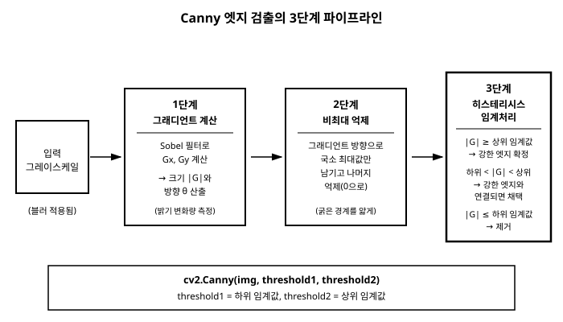

# 12장. 엣지 검출

[◀ 이전: 11장. 모폴로지 연산](ch11-모폴로지연산.md) | [📖 목차](00-목차.md) | [다음: 13장. 컨투어 검출과 분석 ▶](ch13-컨투어검출과분석.md)


## 12.1 엣지란 무엇인가

이미지에서 엣지(edge, 경계)는 픽셀의 밝기 값이 짧은 거리 안에서 급격하게 변하는 지점을 말한다. 배경과 물체의 경계, 물체와 물체가 겹치는 선, 그림자의 가장자리 같은 곳이 대표적이다. 사람이 사진을 보고 "이것은 컵의 윤곽이다"라고 인식할 때 실제로 눈이 반응하는 것도 밝기가 급변하는 이 지점들이다.

수학적으로 보면 엣지는 이미지를 하나의 밝기 함수 `f(x, y)`로 놓았을 때 이 함수의 변화율, 즉 미분값이 크게 나타나는 위치다. 평탄한 벽처럼 밝기가 거의 일정한 영역에서는 미분값이 0에 가깝고, 물체의 경계처럼 밝기가 갑자기 뛰는 곳에서는 미분값이 크게 튄다. 9장에서 다룬 블러가 "주변 픽셀을 평균 내어 변화를 완만하게 만드는" 연산이었다면, 엣지 검출은 정반대로 "변화가 급격한 곳을 찾아내는" 연산이라고 볼 수 있다.

밝기 함수의 변화율을 구하는 방법에는 크게 두 갈래가 있다. 하나는 1차 미분(그래디언트)을 이용하는 방법으로, 밝기가 얼마나 빠르게 변하는지를 직접 계산한다. 이 절에서 다룰 소벨(Sobel) 필터가 대표적이다. 다른 하나는 2차 미분을 이용하는 방법으로, 밝기 변화율이 증가하다가 감소로 꺾이는 지점(변곡점)을 찾는다. 이는 뒤에서 다룰 라플라시안(Laplacian)이 사용하는 원리다. 이 장에서는 1차 미분 도구인 소벨에서 시작해 2차 미분 도구인 라플라시안을 살펴보고, 그래디언트의 방향까지 계산해 본 뒤, 마지막으로 실무에서 가장 널리 쓰이는 캐니(Canny) 엣지 검출기까지 순서대로 다룬다.

## 12.2 소벨 필터: 방향별 그래디언트 계산

이미지에서 밝기의 변화율을 구하는 것을 그래디언트(gradient)를 계산한다고 표현한다. 그래디언트는 방향을 가진 값이므로, 가로 방향(x축)으로 얼마나 급격히 변하는지와 세로 방향(y축)으로 얼마나 급격히 변하는지를 각각 따로 구해야 한다.

소벨 필터는 이 두 방향의 변화율을 근사적으로 계산하기 위한 작은 커널이다. x 방향 소벨 커널은 가로로 인접한 픽셀들의 밝기 차이를 강조하도록 설계되어 있어서, 세로로 뻗은 엣지(수직선)에 강하게 반응한다. 반대로 y 방향 소벨 커널은 세로로 인접한 픽셀들의 밝기 차이를 강조해 가로로 뻗은 엣지(수평선)에 강하게 반응한다. 두 방향의 소벨 커널은 서로 90도 회전된 관계에 있다.

x 방향 미분 결과를 `Gx`, y 방향 미분 결과를 `Gy`라 하면, 한 픽셀에서 엣지의 세기(그래디언트의 크기)는 다음과 같이 계산한다.

```
magnitude = sqrt(Gx^2 + Gy^2)
```

그리고 엣지가 뻗은 방향은 다음과 같이 각도로 계산할 수 있다.

```
direction = atan2(Gy, Gx)
```

OpenCV의 `cv2.Sobel` 함수는 `dx`, `dy` 매개변수로 몇 차 미분을 구할지를 지정한다. `dx=1, dy=0`이면 x 방향 1차 미분(`Gx`), `dx=0, dy=1`이면 y 방향 1차 미분(`Gy`)을 얻는다.

```python
import cv2
import numpy as np

gray = cv2.imread("shapes.png", cv2.IMREAD_GRAYSCALE)

# x, y 방향 그래디언트 계산 (부호가 있는 값이므로 float나 16비트로 받는다)
grad_x = cv2.Sobel(gray, cv2.CV_64F, 1, 0, ksize=3)
grad_y = cv2.Sobel(gray, cv2.CV_64F, 0, 1, ksize=3)

# 그래디언트 크기 계산 후 시각화를 위해 8비트로 변환
magnitude = cv2.magnitude(grad_x, grad_y)
magnitude = cv2.convertScaleAbs(magnitude)

cv2.imshow("Sobel X", cv2.convertScaleAbs(grad_x))
cv2.imshow("Sobel Y", cv2.convertScaleAbs(grad_y))
cv2.imshow("Gradient Magnitude", magnitude)
cv2.waitKey(0)
cv2.destroyAllWindows()
```

여기서 그래디언트를 `CV_8U`가 아니라 `CV_64F`(또는 `CV_16S`)로 받는 이유를 짚어둘 필요가 있다. 그래디언트는 밝기가 증가하는 방향과 감소하는 방향에 따라 양수와 음수 값을 모두 가질 수 있는데, 8비트 unsigned 타입은 음수를 표현할 수 없어서 절반의 정보(예: 어두운 곳에서 밝은 곳으로 가는 엣지)가 잘려 나가 버린다. 그래서 부호 있는 타입으로 미분을 계산한 뒤, 화면에 보여줄 때만 `cv2.convertScaleAbs`로 절댓값을 취해 8비트로 변환한다.

`ksize` 매개변수는 소벨 커널의 크기를 지정한다. 기본값에 가까운 3(3×3 커널)이 가장 널리 쓰이지만, 5나 7처럼 더 큰 커널을 쓰면 더 넓은 범위의 밝기 변화를 반영해 노이즈에는 조금 더 둔감해지는 대신 엣지의 위치가 다소 뭉개진다. 특수하게 `ksize=-1`을 지정하면 3×3 소벨 대신 Scharr 커널이라는, 대각선 방향 정확도가 더 높은 커널이 사용된다. OpenCV는 이 Scharr 커널을 `cv2.Scharr(gray, cv2.CV_64F, 1, 0)`처럼 별도의 함수로도 제공하므로, 대각선 방향의 정밀도가 중요한 경우라면 `cv2.Sobel(..., ksize=-1)`과 `cv2.Scharr(...)` 중 코드의 의도가 더 분명히 드러나는 쪽을 선택하면 된다.

소벨 필터는 그래디언트를 직접 눈으로 확인하거나 간단한 방향성 엣지를 뽑을 때 유용하지만, 그 자체로는 엣지가 여러 픽셀에 걸쳐 두껍게 나타나고 노이즈에도 민감하게 반응한다는 한계가 있다. 이 한계를 보완한 것이 이 장 뒷부분에서 다룰 캐니 엣지 검출이다.

참고로 `dx`와 `dy`를 둘 다 1보다 큰 값으로 지정하면 더 높은 차수의 미분(예: `dx=2, dy=0`은 x 방향 2차 미분)도 계산할 수 있지만, 실무에서는 대부분 1차 미분(`dx=1, dy=0` 또는 `dx=0, dy=1`)만으로 충분하며 더 높은 차수의 미분이 필요한 경우는 드물다.

## 12.3 라플라시안: 2차 미분으로 엣지 찾기

소벨은 1차 미분을 이용해 "밝기가 얼마나 빠르게 변하는가"를 직접 측정했다. 라플라시안(Laplacian)은 여기서 한 걸음 더 나가 2차 미분, 즉 "밝기의 변화율이 얼마나 빠르게 변하는가"를 측정한다. 1차원으로 단순화해서 생각하면, 밝기가 완만하게 상승하다가 급격히 상승하고 다시 완만해지는 구간이 엣지라면, 1차 미분(기울기)은 이 구간에서 봉우리 모양으로 커지고, 2차 미분은 그 봉우리의 앞쪽에서는 양수, 뒤쪽에서는 음수를 가지며 정확히 엣지의 중심에서 0을 지나간다. 이렇게 2차 미분값이 양에서 음으로(또는 음에서 양으로) 바뀌며 0을 지나는 지점을 영교차(zero-crossing)라고 부르고, 라플라시안 기반 엣지 검출은 바로 이 영교차 지점을 엣지로 간주한다.

라플라시안은 x 방향과 y 방향의 2차 미분을 각각 구해서 더한 값으로 정의된다.

```
Laplacian(f) = ∂²f/∂x² + ∂²f/∂y²
```

소벨처럼 x, y 방향을 따로 계산해서 나중에 합치는 것이 아니라, 라플라시안 자체가 방향에 무관한(isotropic) 하나의 값을 바로 내놓는다는 점이 특징이다. 즉 라플라시안은 "이 방향으로 엣지가 있다"는 방향 정보 없이, "여기 어딘가에 엣지가 있다"는 존재 여부만 알려준다. 방향 정보가 필요하다면 다음 절에서 다룰 소벨 기반의 방향 계산을 써야 한다.

```python
import cv2

gray = cv2.imread("shapes.png", cv2.IMREAD_GRAYSCALE)

laplacian = cv2.Laplacian(gray, cv2.CV_64F, ksize=3)
laplacian_display = cv2.convertScaleAbs(laplacian)

cv2.imshow("Laplacian", laplacian_display)
cv2.waitKey(0)
cv2.destroyAllWindows()
```

`cv2.Laplacian`도 `cv2.Sobel`과 마찬가지로 값이 양수와 음수를 모두 가질 수 있으므로 `CV_64F`처럼 부호 있는 타입으로 계산한 뒤 `convertScaleAbs`로 화면 표시용 8비트 이미지로 바꾼다.

소벨과 라플라시안의 차이를 실무 관점에서 정리하면 다음과 같다.

- **소벨(1차 미분)**은 x, y 방향을 따로 계산하므로 엣지의 방향 정보를 함께 얻을 수 있고, 결과가 비교적 두껍고 완만한 봉우리 형태로 나타난다.
- **라플라시안(2차 미분)**은 방향 정보 없이 하나의 스칼라 값만 내놓지만, 엣지의 정확한 중심 위치(영교차)를 원리적으로 더 좁게 짚어낼 수 있다.
- 2차 미분은 1차 미분보다 노이즈에 훨씬 민감하다. 미분을 한 번 더 하는 과정에서 픽셀 값의 미세한 흔들림까지 크게 증폭되기 때문이다. 그래서 라플라시안은 대부분 가우시안 블러로 노이즈를 먼저 눌러준 뒤에 적용하는 것이 일반적이며, 이 순서를 하나의 이름으로 묶어 LoG(Laplacian of Gaussian)라고 부른다.

```python
# 라플라시안은 노이즈에 특히 민감하므로 블러를 먼저 적용하는 것이 일반적이다 (LoG)
blurred = cv2.GaussianBlur(gray, (3, 3), sigmaX=0)
log_result = cv2.Laplacian(blurred, cv2.CV_64F, ksize=3)
log_display = cv2.convertScaleAbs(log_result)

cv2.imshow("Laplacian of Gaussian", log_display)
cv2.waitKey(0)
cv2.destroyAllWindows()
```

이렇게 얻은 `grad_x`, `grad_y`, `magnitude`는 이후 12.4절에서 그래디언트 방향을 계산할 때, 그리고 12.5절부터 다룰 캐니 엣지 검출의 내부 1단계를 이해할 때 그대로 다시 등장하는 값들이므로, 여기서 각 변수가 무엇을 의미하는지 확실히 짚어두는 것이 이 장 전체를 이해하는 데 중요하다.

## 12.4 그래디언트 방향 계산과 시각화

소벨로 구한 `Gx`, `Gy`는 각 픽셀에서 밝기가 가장 빠르게 증가하는 방향을 가리키는 벡터의 x, y 성분이다. 이 두 값으로 그래디언트의 방향(각도)을 계산하려면 `np.arctan2(Gy, Gx)`를 쓴다. 일반적인 `arctan`이 아니라 `arctan2`를 쓰는 이유는, `arctan2`가 `Gx`, `Gy`의 부호를 함께 고려해서 -π부터 π까지(또는 사용법에 따라 0도부터 360도까지) 전체 방향을 구분해 주기 때문이다. 단순 `arctan(Gy / Gx)`는 `Gx`가 0일 때 계산이 불가능하고, 상반된 두 방향(예: 왼쪽에서 오른쪽, 오른쪽에서 왼쪽)을 같은 각도로 혼동한다.

```python
import cv2
import numpy as np

gray = cv2.imread("shapes.png", cv2.IMREAD_GRAYSCALE)
blurred = cv2.GaussianBlur(gray, (5, 5), sigmaX=1.0)

grad_x = cv2.Sobel(blurred, cv2.CV_64F, 1, 0, ksize=3)
grad_y = cv2.Sobel(blurred, cv2.CV_64F, 0, 1, ksize=3)

magnitude, angle = cv2.cartToPolar(grad_x, grad_y, angleInDegrees=True)
```

OpenCV는 `cv2.cartToPolar`라는 함수로 `magnitude`와 `angle`(방향)을 한 번에 계산해 준다. 내부적으로는 `magnitude = sqrt(Gx^2 + Gy^2)`, `angle = atan2(Gy, Gx)`와 동일한 계산을 수행하지만, 두 값을 따로 호출하지 않고 한 번에 얻을 수 있어 편리하다. `angleInDegrees=True`로 지정하면 라디안 대신 0~360도 범위의 각도로 반환된다. 만약 `np.arctan2`를 직접 쓰고 싶다면 다음과 같이 계산해도 결과는 같다.

```python
angle_rad = np.arctan2(grad_y, grad_x)          # -π ~ π 라디안
angle_deg = np.degrees(angle_rad) % 360          # 0 ~ 360도로 정규화
```

방향 값을 숫자로만 보면 감이 잘 오지 않으므로, 방향을 색으로 표현하는 시각화를 해보면 이해가 훨씬 쉬워진다. 색상(hue)에는 방향을, 명도(value)에는 그래디언트 크기를 대응시키면 HSV 색공간을 이용해 "어느 방향으로 얼마나 강한 엣지가 있는지"를 한 장의 컬러 이미지로 표현할 수 있다.

```python
# 방향(0~360도) -> Hue(0~179, OpenCV의 8비트 HSV 범위에 맞춤)
hue = (angle / 2).astype(np.uint8)

# 그래디언트 크기 -> Value (0~255로 정규화)
value = cv2.normalize(magnitude, None, 0, 255, cv2.NORM_MINMAX).astype(np.uint8)

saturation = np.full_like(hue, 255)

hsv = cv2.merge([hue, saturation, value])
direction_map = cv2.cvtColor(hsv, cv2.COLOR_HSV2BGR)

cv2.imshow("Gradient Direction (color = angle, brightness = strength)", direction_map)
cv2.waitKey(0)
cv2.destroyAllWindows()
```

이 시각화 결과에서는 색상이 같은 픽셀들이 같은 방향으로 뻗은 엣지에 속한다는 것을 한눈에 볼 수 있고, 그래디언트가 약한 평탄한 영역(배경, 벽면 등)은 어둡게(명도가 낮게) 표시되어 자연스럽게 걸러진다. 원형 물체의 윤곽선을 이 방식으로 시각화하면, 원의 둘레를 따라 색이 부드럽게 한 바퀴 회전하는 모습(그래디언트 방향이 물체 중심에서 바깥쪽을 향해 연속적으로 변하는 모습)을 확인할 수 있어, 그래디언트 방향의 의미를 직관적으로 이해하는 데 좋은 예제가 된다.

그래디언트 방향은 시각화 용도 외에도 실질적인 쓸모가 있다. 예를 들어 문서 이미지에서 글자가 얼마나 기울어져 있는지(기울기 보정, deskewing)를 추정할 때, 글자 획에서 뽑은 그래디언트 방향들의 분포를 분석해 전체적으로 우세한 방향을 찾아내는 방식이 실제로 활용된다. 또한 다음 절에서 다룰 캐니의 비최대 억제 단계도 내부적으로 바로 이 방향 값을 이용해 "어느 이웃과 비교할지"를 결정하므로, 여기서 계산한 `angle`의 의미를 이해해 두면 캐니의 동작을 훨씬 깊이 이해할 수 있다.

## 12.5 캐니 엣지 검출: 세 단계로 이해하기

캐니(Canny) 엣지 검출기는 소벨 필터로 얻은 그래디언트를 다듬어서, 얇고 끊어짐이 적은 엣지 지도를 만들어내는 알고리즘이다. 내부적으로 세 단계를 순서대로 거친다.

**1단계: 그래디언트 계산.** 앞 절에서 다룬 것과 같은 방식으로 소벨 필터를 이용해 각 픽셀의 그래디언트 크기와 방향을 구한다. 이 단계까지는 소벨 필터의 결과와 다르지 않으며, 엣지 후보 영역이 여전히 두껍게 나타난다.

**2단계: 비최대 억제(non-maximum suppression).** 그래디언트 방향을 따라 각 픽셀을 살펴보면서, 그 방향으로 인접한 픽셀들과 비교해 자신이 국소적으로 가장 큰 값(최대값)이 아니면 억제(0으로 만든다). 예를 들어 어떤 픽셀의 그래디언트 방향이 수평이라면, 그 픽셀의 왼쪽과 오른쪽 픽셀의 그래디언트 크기와 비교해서 자신이 가장 크지 않으면 지워버린다. 이 과정을 거치면 여러 픽셀에 걸쳐 두껍게 나타났던 엣지가 한 픽셀 두께의 얇은 선으로 다듬어진다. 12.4절에서 계산한 방향(`angle`)이 바로 이 단계에서 "어느 방향의 이웃과 비교할지"를 결정하는 데 쓰이는 값이다.

**3단계: 히스테리시스 임계처리(hysteresis thresholding).** 비최대 억제를 거친 결과에도 노이즈로 인한 약한 엣지 후보들이 남아 있다. 이를 정리하기 위해 캐니는 하나가 아니라 두 개의 임계값(하위 임계값, 상위 임계값)을 사용한다.

- 그래디언트 크기가 상위 임계값보다 큰 픽셀은 "강한 엣지"로 확정한다.
- 그래디언트 크기가 하위 임계값보다 작은 픽셀은 엣지가 아닌 것으로 확정하고 제거한다.
- 그 사이(하위 임계값과 상위 임계값 사이)에 있는 픽셀은 "약한 엣지 후보"로 남겨두는데, 이 후보는 강한 엣지에 연결되어 있을 때만 최종적으로 엣지로 채택되고, 그렇지 않으면 제거된다.

이 마지막 단계가 히스테리시스라는 이름을 가진 이유는, 마치 릴레이 스위치가 한 번 켜지면 주변 값이 완전히 꺼지기 전까지 계속 켜진 상태를 "끌고 가는" 것처럼, 강한 엣지 하나가 자신과 연결된 약한 엣지 후보들을 함께 살려주기 때문이다. 이 방식 덕분에 어떤 선이 중간에 그래디언트가 살짝 약해지는 부분이 있어도, 그 부분이 강한 엣지와 이어져 있기만 하면 끊어지지 않고 하나의 연속된 선으로 남는다.

아래 그림은 지금까지 설명한 캐니 엣지 검출의 세 단계를 하나의 파이프라인으로 정리한 것이다.



## 12.6 Canny 함수와 두 임계값의 역할

OpenCV에서는 이 세 단계를 `cv2.Canny` 함수 하나로 실행할 수 있다. 함수는 입력 이미지와 두 개의 임계값(`threshold1`, `threshold2`)을 받는다.

```python
edges = cv2.Canny(gray, threshold1=50, threshold2=150)
```

두 임계값 중 작은 값이 하위 임계값, 큰 값이 상위 임계값으로 취급된다(OpenCV는 어느 쪽을 먼저 넘겨도 내부에서 자동으로 크기를 비교해서 정렬한다). 이 두 값이 결과에 미치는 영향은 다음과 같이 정리할 수 있다.

- **상위 임계값을 낮추면** 더 많은 픽셀이 "강한 엣지"로 인정되어 엣지가 늘어나지만, 노이즈로 인한 잘못된 엣지도 함께 늘어난다.
- **상위 임계값을 높이면** 확실히 강한 변화가 있는 곳만 엣지로 인정되어 결과가 깔끔해지지만, 약한 경계선은 놓칠 수 있다.
- **하위 임계값을 낮추면** 약한 엣지 후보의 폭이 넓어져서, 강한 엣지에 연결된 흐릿한 선들이 더 잘 이어지지만 노이즈도 더 많이 살아난다.
- **하위 임계값을 높이면** 약한 엣지 후보 구간이 좁아져서, 강한 엣지와 아주 가까운 값만 이어지고 나머지는 끊어진다.

실무에서는 두 임계값의 비율을 대략 1:2에서 1:3 사이로 잡는 것이 흔히 추천되는 경험적 기준이며, 절대적인 값은 이미지의 밝기 분포와 노이즈 수준에 따라 실험을 통해 조정해야 한다.

`cv2.Canny`는 세 번째로 선택적 매개변수 `apertureSize`(내부적으로 사용하는 소벨 커널 크기, 기본값 3)와 `L2gradient`(그래디언트 크기 계산 방식을 지정하는 불(bool) 값)도 받는다. `L2gradient=True`로 지정하면 `magnitude = sqrt(Gx^2 + Gy^2)`라는 더 정확한(그러나 계산이 더 무거운) 방식을 쓰고, 기본값인 `False`에서는 `magnitude = |Gx| + |Gy|`라는 더 빠른 근사식을 쓴다. 대부분의 경우 기본값으로도 충분하지만, 임계값의 의미를 좀 더 엄밀하게 다루고 싶다면 `L2gradient=True`를 지정하는 것이 이론적으로 더 정확하다.

실무에서 자주 마주치는 실수 하나는 컬러 이미지를 그레이스케일로 변환하지 않고 그대로 `cv2.Canny`에 넘기는 것이다. `cv2.Canny`는 8비트 단일 채널(그레이스케일) 이미지를 입력으로 기대하므로, `cv2.imread`로 컬러 이미지를 읽었다면 반드시 `cv2.cvtColor(img, cv2.COLOR_BGR2GRAY)`로 먼저 변환해야 한다. 컬러 이미지를 그대로 넘기면 오류가 나거나(버전에 따라) 채널별로 예상과 다른 결과가 나올 수 있으므로, 이 장의 모든 예제가 `cv2.IMREAD_GRAYSCALE`로 이미지를 읽는 것도 이 때문이다.

## 12.7 실전 실험: 두 임계값을 바꿔가며 결과 비교하기

두 임계값이 결과에 미치는 영향을 말로만 이해하는 것과 실제로 눈으로 확인하는 것은 차이가 크다. 같은 이미지에 여러 임계값 조합을 적용해서 나란히 비교해 보자.

```python
import cv2
import numpy as np

gray = cv2.imread("shapes.png", cv2.IMREAD_GRAYSCALE)
blurred = cv2.GaussianBlur(gray, (5, 5), sigmaX=1.0)

threshold_pairs = [
    (30, 90),    # 낮은 임계값: 엣지가 많지만 노이즈도 많음
    (50, 150),   # 중간값: 흔히 쓰이는 기본 조합
    (100, 200),  # 높은 임계값: 확실한 경계만 남고 약한 경계는 소실
    (150, 250),  # 매우 높은 임계값: 결과가 지나치게 희박해짐
]

results = []
for low, high in threshold_pairs:
    edges = cv2.Canny(blurred, low, high)
    labeled = cv2.cvtColor(edges, cv2.COLOR_GRAY2BGR)
    cv2.putText(labeled, f"{low}/{high}", (10, 25),
                cv2.FONT_HERSHEY_SIMPLEX, 0.7, (0, 0, 255), 2, cv2.LINE_AA)
    results.append(labeled)

top_row = np.hstack(results[:2])
bottom_row = np.hstack(results[2:])
grid = np.vstack([top_row, bottom_row])

cv2.imshow("Canny threshold comparison", grid)
cv2.waitKey(0)
cv2.destroyAllWindows()
```

이 실험을 실제로 돌려 보면, 임계값이 낮을 때는 배경의 질감이나 미세한 조명 변화까지 짧은 선들로 잡혀 화면이 어지럽고, 임계값이 지나치게 높을 때는 뚜렷한 경계조차 중간에 끊기거나 아예 사라지는 구간이 생긴다. 두 극단 사이의 어딘가에 "노이즈는 걸러지면서 필요한 경계는 끊어지지 않는" 적정 구간이 존재하며, 그 구간은 이미지마다 다르다. 그래서 실무에서는 고정된 임계값 한 쌍을 코드에 박아 넣기보다, 다음 절에서 만들 도구처럼 값을 즉시 바꿔가며 결과를 확인할 수 있는 환경을 마련해 두는 것이 훨씬 효율적이다.

## 12.8 실전 도구: 트랙바로 Canny 임계값 실시간 조절하기

5장에서는 트랙바(trackbar)를 이용해 슬라이더로 값을 조절하면서 그 결과를 실시간으로 창에 반영하는 방법을 다뤘다. 같은 기법을 Canny의 두 임계값에 적용하면, 슬라이더를 움직이는 즉시 엣지 검출 결과가 바뀌는 대화형 도구를 만들 수 있다. 이런 도구는 특정 이미지에 맞는 임계값을 찾는 과정을 코드를 고쳐서 다시 실행하는 반복 대신, 슬라이더를 움직이는 것만으로 훨씬 빠르게 끝내준다.

```python
import cv2

gray = cv2.imread("shapes.png", cv2.IMREAD_GRAYSCALE)
blurred = cv2.GaussianBlur(gray, (5, 5), sigmaX=1.0)

window_name = "Canny Threshold Tuner"
cv2.namedWindow(window_name)

# 5장: 트랙바는 콜백 함수와 함께 등록한다.
# 트랙바 값이 바뀔 때마다 이 함수가 호출되지만,
# 실제 처리는 아래 메인 루프에서 매 프레임 다시 수행해도 무방하다.
def on_trackbar_change(value):
    pass

cv2.createTrackbar("Lower", window_name, 50, 500, on_trackbar_change)
cv2.createTrackbar("Upper", window_name, 150, 500, on_trackbar_change)

while True:
    lower = cv2.getTrackbarPos("Lower", window_name)
    upper = cv2.getTrackbarPos("Upper", window_name)

    # 두 값이 뒤바뀌어도 Canny가 자동으로 정렬하지만,
    # 화면에 표시되는 값의 의미를 명확히 하기 위해 직접 정렬해 둔다.
    low_th, high_th = sorted((lower, upper))

    edges = cv2.Canny(blurred, low_th, high_th)
    cv2.imshow(window_name, edges)

    # ESC 키를 누르면 종료
    if cv2.waitKey(30) & 0xFF == 27:
        break

cv2.destroyAllWindows()
```

이 도구를 실행하면 두 개의 슬라이더가 있는 창이 뜨고, 슬라이더를 움직일 때마다 `while` 루프가 매번 최신 슬라이더 값을 읽어(`cv2.getTrackbarPos`) 새로 Canny를 계산하고 화면을 갱신한다. `cv2.waitKey(30)`은 30밀리초마다 루프를 반복하며 키 입력을 확인하는 역할도 겸한다. 이런 실시간 튜닝 도구를 한 번 만들어 두면, 새로운 이미지를 받을 때마다 적절한 임계값 구간을 눈으로 빠르게 찾아낼 수 있고, 여기서 찾은 값을 실제 처리 파이프라인의 고정 임계값으로 옮겨 쓸 수 있다.

## 12.9 실전 예제: 블러를 먼저 적용해 노이즈로 인한 잘못된 엣지 줄이기

캐니 엣지 검출은 그래디언트 계산 단계에서 픽셀 값의 미세한 변화에도 반응하기 때문에, 이미지에 노이즈가 조금이라도 섞여 있으면 실제 객체의 경계와 무관한 잔 엣지들이 무수히 검출된다. 12.3절에서 다룬 라플라시안이 소벨보다도 노이즈에 훨씬 민감했던 것과 마찬가지로, 캐니 내부의 그래디언트 계산 단계 역시 노이즈에 취약하다. 9장에서 다룬 가우시안 블러(`GaussianBlur`)를 캐니 이전에 적용하면, 노이즈로 인한 미세한 밝기 변화가 평탄해지면서 진짜 경계만 또렷하게 남는다. 아래 예제는 같은 이미지에 대해 블러 없이 캐니를 적용한 결과와, 블러를 먼저 적용한 뒤 캐니를 적용한 결과를 나란히 비교한다.

```python
import cv2

gray = cv2.imread("noisy_scene.jpg", cv2.IMREAD_GRAYSCALE)

# (1) 블러 없이 바로 Canny 적용 → 노이즈로 인한 잔 엣지가 많이 검출됨
edges_raw = cv2.Canny(gray, 50, 150)

# (2) 9장: 가우시안 블러로 노이즈를 먼저 평탄화
blurred = cv2.GaussianBlur(gray, (5, 5), sigmaX=1.0)

# (3) 블러 처리된 이미지에 Canny 적용 → 잔 엣지가 크게 줄어듦
edges_blurred = cv2.Canny(blurred, 50, 150)

cv2.imshow("Canny without blur", edges_raw)
cv2.imshow("Canny after Gaussian blur", edges_blurred)
cv2.waitKey(0)
cv2.destroyAllWindows()
```

두 결과를 나란히 놓고 보면, 블러 없이 캐니를 적용한 쪽은 배경의 텍스처나 미세한 조명 얼룩까지 짧은 선들로 검출되어 화면이 어지럽지만, 블러를 먼저 적용한 쪽은 그런 잔 엣지가 크게 줄고 실제 객체의 윤곽선만 선명하게 남는다. 다만 블러의 커널 크기나 표준편차를 지나치게 크게 잡으면 진짜 경계까지 뭉개져서 캐니가 아예 검출하지 못하게 되므로, 노이즈 제거와 경계 보존 사이의 균형을 실험적으로 찾아야 한다.

이 균형을 찾는 과정에도 12.8절에서 만든 트랙바 도구의 아이디어를 그대로 확장할 수 있다. Canny의 두 임계값 슬라이더에 더해 블러 커널 크기를 조절하는 슬라이더를 하나 더 추가하면, "블러 강도"와 "임계값" 두 가지 변수를 동시에 눈으로 튜닝하는 종합 도구가 된다.

블러 강도를 늘리는 것과 Canny의 임계값을 높이는 것은 둘 다 "잔 엣지를 줄인다"는 결과로 이어지지만 원리는 서로 다르다. 블러는 그래디언트 계산 이전에 밝기 값 자체를 평탄화해서 애초에 작은 변화가 만들어지지 않도록 막는 반면, 임계값을 높이는 것은 이미 계산된 그래디언트 중에서 약한 값을 사후적으로 걸러낸다. 그래서 두 방법을 함께 조절할 때는 "블러로 노이즈의 크기 자체를 줄이고, 임계값으로 남은 약한 신호를 걸러낸다"는 역할 분담을 염두에 두면 값을 훨씬 직관적으로 찾을 수 있다.

```python
import cv2

gray = cv2.imread("noisy_scene.jpg", cv2.IMREAD_GRAYSCALE)

window_name = "Blur + Canny Tuner"
cv2.namedWindow(window_name)

def on_trackbar_change(value):
    pass

cv2.createTrackbar("Blur (odd)", window_name, 1, 15, on_trackbar_change)
cv2.createTrackbar("Lower", window_name, 50, 500, on_trackbar_change)
cv2.createTrackbar("Upper", window_name, 150, 500, on_trackbar_change)

while True:
    blur_size = cv2.getTrackbarPos("Blur (odd)", window_name)
    blur_size = blur_size if blur_size % 2 == 1 else blur_size + 1  # 커널 크기는 홀수여야 함
    lower = cv2.getTrackbarPos("Lower", window_name)
    upper = cv2.getTrackbarPos("Upper", window_name)
    low_th, high_th = sorted((lower, upper))

    if blur_size >= 3:
        prepared = cv2.GaussianBlur(gray, (blur_size, blur_size), sigmaX=0)
    else:
        prepared = gray

    edges = cv2.Canny(prepared, low_th, high_th)
    cv2.imshow(window_name, edges)

    if cv2.waitKey(30) & 0xFF == 27:
        break

cv2.destroyAllWindows()
```

`GaussianBlur`의 커널 크기는 항상 홀수여야 하므로, 트랙바에서 짝수 값이 들어오면 1을 더해 보정하는 처리를 넣었다. 이런 방식으로 여러 매개변수를 한 창에서 동시에 조절할 수 있게 만들어 두면, 새로운 촬영 환경이나 새로운 카메라로 들어온 이미지에 대해서도 코드를 수정하지 않고 빠르게 최적의 전처리 조합을 찾을 수 있다.

이렇게 트랙바로 찾아낸 값들은 그 자체로도 유용하지만, 여러 장의 대표 이미지에 대해 각각 값을 찾아 기록해 두면 "이 카메라, 이 조명 환경에서는 대략 이 범위의 값을 쓰면 된다"는 경험적인 기준표를 만들 수 있다. 이 기준표는 이후 자동화된 파이프라인에서 트랙바 없이 고정값으로 `cv2.Canny`를 호출할 때 근거가 되는 값으로 쓰인다.

## 12.10 어떤 엣지 검출 방법을 언제 쓸까

이 장에서 다룬 소벨, 라플라시안, 캐니는 모두 "밝기가 급격히 변하는 곳을 찾는다"는 같은 목표를 갖지만, 실무에서 어떤 것을 선택할지는 상황에 따라 달라진다. 세 방법을 나란히 정리하면 다음과 같다.

- **소벨(Sobel)**: 방향별 그래디언트(`Gx`, `Gy`)가 직접 필요할 때 쓴다. 예를 들어 12.4절처럼 엣지의 방향 분포를 분석하거나, 특정 방향(수평/수직)의 구조물만 강조하고 싶을 때 적합하다. 결과가 두껍고 노이즈에 다소 민감하므로 후처리(비최대 억제 등) 없이 최종 결과로 쓰기에는 부족한 경우가 많다.
- **라플라시안(Laplacian)**: 방향에 무관하게 "여기에 변화가 있다"는 사실만 빠르게 확인하고 싶을 때, 또는 초점이 맞았는지를 가늠하는 블러 정도 측정(라플라시안 값의 분산이 낮으면 초점이 흐린 이미지) 같은 용도에 자주 쓰인다. 노이즈에 가장 민감하므로 가우시안 블러와 함께 쓰는 것이 거의 필수적이다.
- **캐니(Canny)**: 최종적으로 "이진화된, 얇고 끊어짐이 적은 엣지 지도"가 필요할 때 쓴다. 컨투어 검출(13장), 도형 인식, 차선 검출처럼 엣지 자체를 다음 단계의 입력으로 사용하는 대부분의 실무 파이프라인은 소벨이나 라플라시안을 그대로 쓰지 않고 캐니를 최종 단계로 채택한다.

라플라시안이 초점 측정에 쓰이는 예를 간단히 살펴보자. 이미지가 흐릴수록 밝기 변화가 완만해서 2차 미분 값의 분산이 작아지고, 초점이 잘 맞아 경계가 뚜렷할수록 분산이 커진다는 성질을 이용한다.

```python
import cv2

def measure_focus(gray_img):
    """라플라시안 값의 분산으로 초점(선명도)을 대략 가늠한다.
    값이 클수록 경계가 뚜렷하다는 뜻이며, 값이 작으면
    흐릿하게 촬영되었을 가능성이 크다."""
    laplacian = cv2.Laplacian(gray_img, cv2.CV_64F)
    return laplacian.var()


sharp = cv2.imread("in_focus.jpg", cv2.IMREAD_GRAYSCALE)
blurry = cv2.imread("out_of_focus.jpg", cv2.IMREAD_GRAYSCALE)

print(f"선명한 이미지의 초점 점수: {measure_focus(sharp):.2f}")
print(f"흐릿한 이미지의 초점 점수: {measure_focus(blurry):.2f}")
```

이 기법은 별도의 엣지 지도를 화면에 표시할 필요 없이 숫자 하나로 "촬영이 잘 됐는지"를 판단할 수 있어서, 문서 스캔 앱이나 자동 촬영 시스템에서 흐린 사진을 자동으로 걸러내는 용도로 실제로 쓰인다.

마지막으로, 세 방법을 조합해서 쓰는 것도 가능하다는 점을 기억해 두자. 예를 들어 라플라시안으로 전체적인 선명도를 먼저 점검하고, 문제가 없으면 소벨로 방향 정보를 확인한 뒤, 최종적으로 캐니로 다음 단계에 넘길 엣지 지도를 만드는 식으로 하나의 파이프라인 안에서 세 방법이 서로 다른 역할을 맡을 수 있다.

이 장에서 다룬 소벨, 라플라시안, 캐니는 모두 그레이스케일 밝기 값의 미분에 뿌리를 두고 있지만, 계산 비용과 결과의 형태가 서로 다르기 때문에 어느 하나가 절대적으로 우월하다고 말할 수는 없다. 실제 프로젝트에서는 처리해야 할 이미지의 특성(노이즈 수준, 조명 조건, 객체의 크기)과 다음 단계에서 결과를 어떻게 소비할 것인지(방향 분석인지, 선명도 판단인지, 컨투어 검출을 위한 이진 엣지 지도인지)를 먼저 정하고, 그에 맞는 방법을 고르는 것이 순서다.

## 요약

- 엣지는 픽셀 밝기 값이 짧은 거리 안에서 급격히 변하는 지점이며, 수학적으로는 밝기 함수의 미분값이 크게 나타나는 위치다.
- 소벨(Sobel) 필터는 x, y 방향의 1차 미분(`Gx`, `Gy`)을 근사적으로 계산하며, 두 값으로부터 그래디언트의 크기(`magnitude`)와 방향(`direction`)을 구할 수 있다.
- 라플라시안(`cv2.Laplacian`)은 2차 미분을 이용해 밝기 변화율이 꺾이는 영교차 지점을 엣지로 간주한다. 방향 정보 없이 하나의 스칼라 값만 내놓으며, 소벨보다 노이즈에 더 민감해서 가우시안 블러와 함께 쓰는 것(LoG)이 일반적이다.
- 그래디언트 방향은 `np.arctan2(Gy, Gx)` 또는 `cv2.cartToPolar`로 계산할 수 있으며, 방향을 색상(Hue)에, 크기를 명도(Value)에 대응시켜 HSV로 시각화하면 엣지의 방향 분포를 한눈에 파악할 수 있다.
- 캐니(Canny) 엣지 검출은 그래디언트 계산 → 비최대 억제(엣지를 한 픽셀 두께로 얇게 만듦) → 히스테리시스 임계처리(두 임계값으로 강한 엣지와 약한 엣지 후보를 구분하고, 약한 후보는 강한 엣지와 연결될 때만 채택)의 세 단계로 동작한다.
- `cv2.Canny` 함수의 두 임계값 중 상위 임계값은 강한 엣지를 확정하는 기준이고, 하위 임계값은 약한 엣지 후보로 남길 최소 기준이다. 5장에서 배운 트랙바 기법을 활용하면 두 임계값(과 블러 강도)을 실시간으로 조절하며 최적의 조합을 눈으로 찾을 수 있다.
- 캐니는 미세한 밝기 변화에도 민감하게 반응하므로, 9장의 가우시안 블러 같은 노이즈 제거 전처리를 먼저 적용하면 노이즈로 인한 잘못된 엣지를 크게 줄일 수 있다.
- 세 방법은 목적이 다르다. 방향 정보가 필요하면 소벨, 전체적인 변화의 존재 여부나 초점(선명도) 측정처럼 방향 없이 빠르게 확인하고 싶으면 라플라시안, 다음 단계(컨투어 검출 등)에 바로 넘길 얇고 끊어짐 없는 최종 엣지 지도가 필요하면 캐니를 선택한다.

## 연습문제

1. 소벨 필터의 결과를 `CV_8U` 대신 `CV_64F`나 `CV_16S`로 받아야 하는 이유를 그래디언트 값의 부호와 연결지어 설명하라.
2. 소벨(1차 미분)과 라플라시안(2차 미분)이 엣지를 찾는 방식의 차이를 설명하고, 라플라시안이 소벨보다 노이즈에 더 민감한 이유를 미분의 횟수와 연관지어 서술하라.
3. `np.arctan2(Gy, Gx)` 대신 단순히 `np.arctan(Gy / Gx)`를 사용하면 어떤 문제가 생기는지, `Gx`가 0인 경우와 방향이 반대인 두 경우를 예로 들어 설명하라.
4. 12.7절의 임계값 비교 실험을 직접 실행해 보고, 상위 임계값만 크게 높이고 하위 임계값은 그대로 두었을 때 검출되는 엣지의 양과 연속성(끊어짐 정도)이 각각 어떻게 달라지는지 관찰 결과를 서술하라.
5. 12.8절의 트랙바 도구를 직접 실행하여 블러 커널 크기를 (1, 즉 블러 없음), (5, 5), (11, 11)로 바꿔가며 Canny 결과를 비교하고, 11장에서 다룬 모폴로지 팽창을 Canny 결과에 추가로 적용했을 때 끊어진 엣지가 어떻게 달라지는지 확인하라. 이 방법이 히스테리시스 임계처리와 어떻게 다른 방식으로 "끊어짐"을 완화하는지 비교하라.

---

[◀ 이전: 11장. 모폴로지 연산](ch11-모폴로지연산.md) | [📖 목차](00-목차.md) | [다음: 13장. 컨투어 검출과 분석 ▶](ch13-컨투어검출과분석.md)
