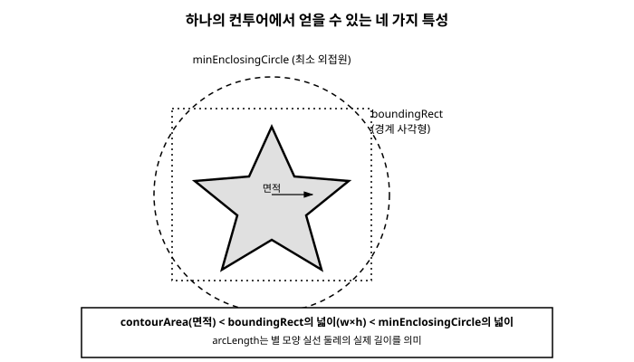

# 13장. 컨투어 검출과 분석

[◀ 이전: 12장. 엣지 검출](ch12-엣지검출.md) | [📖 목차](00-목차.md) | [다음: 14장. 히스토그램 ▶](ch14-히스토그램.md)


앞선 두 장에서는 이진 이미지를 만드는 방법(10장의 임계처리)과 그 이진 이미지를 다듬는 방법(11장의 모폴로지 연산)을 다뤘습니다. 그런데 흰색 덩어리가 이미지 위에 흩어져 있다는 사실을 아는 것과, "그 덩어리가 몇 개이고 각각 어디에 있으며 얼마나 큰가"를 아는 것은 다른 문제입니다. 이 장에서는 이진 이미지 속의 덩어리들을 하나하나의 도형으로 인식하고, 그 형태를 수치로 분석하는 방법을 배웁니다.

## 13.1 컨투어란 무엇인가

**컨투어(contour)**란 같은 색이나 밝기를 가진 영역의 경계를 따라 연결한 곡선입니다. 쉽게 말해, 이진 이미지에서 흰색(또는 0이 아닌) 픽셀들이 모여 있는 영역의 윤곽선을 점들의 연속으로 표현한 것입니다.

예를 들어 흰 종이 위에 검은 동전 사진을 찍어 이진화하면, 동전이 있던 자리는 하나의 흰색(혹은 검은색) 덩어리로 남습니다. 이 덩어리의 바깥 경계를 따라가며 점을 찍으면 동전의 윤곽이 대략 원 모양의 폐곡선으로 나타나는데, 이것이 바로 컨투어입니다.

컨투어는 다음과 같은 특징을 가집니다.

- 컨투어는 좌표 점들의 목록(배열)입니다. 각 점은 이미지 위의 한 픽셀 위치 `(x, y)`를 가리킵니다.
- 하나의 이미지 안에는 여러 개의 컨투어가 존재할 수 있습니다. 동전이 세 개 찍힌 사진이라면 컨투어도 세 개가 검출됩니다.
- 객체 안에 구멍이 있으면(예: 도넛 모양) 바깥 경계와 안쪽 구멍 경계가 각각 별도의 컨투어로 검출될 수 있습니다.

컨투어를 찾으려면 대상 이미지가 **이진 이미지**여야 합니다. 그레이스케일이나 컬러 이미지를 그대로 넣으면 원하는 결과를 얻을 수 없으므로, 보통 10장에서 배운 `threshold`나 `adaptiveThreshold`, 12장에서 배운 캐니 엣지 검출 결과를 먼저 만들어 놓고 그 결과에 컨투어 검출을 적용합니다.

## 13.2 findContours로 컨투어 찾기

OpenCV는 이진 이미지에서 컨투어를 찾는 `findContours` 함수를 제공합니다. 이 함수를 사용할 때 결정해야 할 두 가지 중요한 옵션이 있습니다.

**검색 모드(retrieval mode)**: 컨투어들 사이의 계층 관계를 얼마나 자세히 알아낼 것인지를 정합니다.

- `RETR_EXTERNAL`: 가장 바깥쪽 컨투어만 찾습니다. 객체 내부에 구멍이 있어도 무시하고, 서로 겹치지 않는 객체들의 개수를 셀 때 가장 간단하고 흔히 쓰입니다.
- `RETR_LIST`: 모든 컨투어를 찾지만 계층 구조(부모-자식 관계)는 따지지 않고 단순히 나열합니다.
- `RETR_TREE`: 모든 컨투어를 찾고, 바깥 경계와 안쪽 구멍 경계 사이의 포함 관계까지 트리 구조로 구성합니다.
- `RETR_CCOMP`: 모든 컨투어를 찾되 2단계(바깥 경계, 구멍 경계)로만 계층을 구성합니다.

이 장의 예제에서는 대부분 객체의 개수를 세거나 각 객체의 바깥 윤곽만 필요하므로 `RETR_EXTERNAL`을 기본으로 사용합니다.

**근사 방법(approximation method)**: 컨투어를 이루는 점들을 얼마나 촘촘하게 저장할 것인지를 정합니다.

- `CHAIN_APPROX_NONE`: 경계를 이루는 모든 픽셀 좌표를 하나도 빠짐없이 저장합니다. 메모리를 많이 사용합니다.
- `CHAIN_APPROX_SIMPLE`: 직선으로 이어지는 구간은 양 끝점만 저장하여 점의 개수를 크게 줄입니다. 대부분의 경우 이 옵션으로 충분하며, 실무에서 가장 널리 사용됩니다.

### Python

```python
import cv2

img = cv2.imread("shapes.png")
gray = cv2.cvtColor(img, cv2.COLOR_BGR2GRAY)
_, binary = cv2.threshold(gray, 127, 255, cv2.THRESH_BINARY)

contours, hierarchy = cv2.findContours(
    binary, cv2.RETR_EXTERNAL, cv2.CHAIN_APPROX_SIMPLE
)

print(f"검출된 컨투어 개수: {len(contours)}")
print(f"첫 번째 컨투어의 점 개수: {len(contours[0])}")
```

### C++

```cpp
#include <opencv2/opencv.hpp>
#include <iostream>

int main() {
    cv::Mat img = cv::imread("shapes.png");
    cv::Mat gray, binary;
    cv::cvtColor(img, gray, cv::COLOR_BGR2GRAY);
    cv::threshold(gray, binary, 127, 255, cv::THRESH_BINARY);

    std::vector<std::vector<cv::Point>> contours;
    std::vector<cv::Vec4i> hierarchy;
    cv::findContours(binary, contours, hierarchy,
                      cv::RETR_EXTERNAL, cv::CHAIN_APPROX_SIMPLE);

    std::cout << "검출된 컨투어 개수: " << contours.size() << std::endl;
    std::cout << "첫 번째 컨투어의 점 개수: " << contours[0].size() << std::endl;
    return 0;
}
```

### C#

```csharp
using OpenCvSharp;

Mat img = Cv2.ImRead("shapes.png");
Mat gray = new Mat();
Mat binary = new Mat();
Cv2.CvtColor(img, gray, ColorConversionCodes.BGR2GRAY);
Cv2.Threshold(gray, binary, 127, 255, ThresholdTypes.Binary);

Cv2.FindContours(binary, out Point[][] contours, out HierarchyIndex[] hierarchy,
                  RetrievalModes.External, ContourApproximationModes.ApproxSimple);

Console.WriteLine($"검출된 컨투어 개수: {contours.Length}");
Console.WriteLine($"첫 번째 컨투어의 점 개수: {contours[0].Length}");
```

세 언어의 함수 시그니처에는 미묘한 차이가 있습니다. Python은 컨투어 리스트와 계층 정보를 튜플로 반환하고, C++은 참조 매개변수로 결과를 채워 넣으며, C#은 `out` 매개변수를 사용합니다. 반환되는 컨투어의 자료형도 각각 넘파이 배열의 리스트, `std::vector<cv::Point>`의 벡터, `Point[]`의 배열로 언어의 관례를 따릅니다.

> 참고: OpenCV 3.x 버전의 C++/Python API에서는 `findContours`가 컨투어와 함께 원본 이미지를 변형된 형태로 반환값 맨 앞에 추가로 돌려주었지만, OpenCV 4.x부터는 이 동작이 사라지고 컨투어와 계층 정보만 반환합니다. 이 책은 4.x 기준으로 설명합니다.

## 13.3 drawContours로 컨투어 시각화하기

컨투어는 좌표 점들의 배열일 뿐이므로, 눈으로 확인하려면 이미지 위에 그려야 합니다. `drawContours`는 6장에서 배운 도형 그리기 함수들과 비슷하게 동작하며, 컨투어 전체 또는 특정 인덱스의 컨투어만 골라 그릴 수 있습니다.

### Python

```python
import cv2

img = cv2.imread("shapes.png")
gray = cv2.cvtColor(img, cv2.COLOR_BGR2GRAY)
_, binary = cv2.threshold(gray, 127, 255, cv2.THRESH_BINARY)

contours, _ = cv2.findContours(binary, cv2.RETR_EXTERNAL, cv2.CHAIN_APPROX_SIMPLE)

result = img.copy()
# -1을 넘기면 모든 컨투어를 그린다
cv2.drawContours(result, contours, -1, (0, 255, 0), 2)

cv2.imshow("Contours", result)
cv2.waitKey(0)
cv2.destroyAllWindows()
```

### C++

```cpp
#include <opencv2/opencv.hpp>

int main() {
    cv::Mat img = cv::imread("shapes.png");
    cv::Mat gray, binary;
    cv::cvtColor(img, gray, cv::COLOR_BGR2GRAY);
    cv::threshold(gray, binary, 127, 255, cv::THRESH_BINARY);

    std::vector<std::vector<cv::Point>> contours;
    cv::findContours(binary, contours, cv::RETR_EXTERNAL, cv::CHAIN_APPROX_SIMPLE);

    cv::Mat result = img.clone();
    cv::drawContours(result, contours, -1, cv::Scalar(0, 255, 0), 2);

    cv::imshow("Contours", result);
    cv::waitKey(0);
    return 0;
}
```

### C#

```csharp
using OpenCvSharp;

Mat img = Cv2.ImRead("shapes.png");
Mat gray = new Mat();
Mat binary = new Mat();
Cv2.CvtColor(img, gray, ColorConversionCodes.BGR2GRAY);
Cv2.Threshold(gray, binary, 127, 255, ThresholdTypes.Binary);

Cv2.FindContours(binary, out Point[][] contours, out HierarchyIndex[] hierarchy,
                  RetrievalModes.External, ContourApproximationModes.ApproxSimple);

Mat result = img.Clone();
Cv2.DrawContours(result, contours, -1, Scalar.FromRgb(0, 255, 0), 2);

Cv2.ImShow("Contours", result);
Cv2.WaitKey(0);
```

세 번째 인수(인덱스)에 -1을 넘기면 찾아낸 모든 컨투어를 그리고, 0, 1, 2와 같은 특정 값을 넘기면 그 인덱스에 해당하는 컨투어 하나만 그립니다. 마지막 인수로 선의 두께를 지정하는데, 이 값을 음수(예: `-1`)로 주면 컨투어 내부를 색으로 채워 그립니다.

## 13.4 컨투어의 특성 분석하기

컨투어를 찾았다면 이제 그 형태를 수치로 분석할 수 있습니다. 자주 쓰이는 네 가지 함수를 살펴봅니다.

- `contourArea`: 컨투어가 감싸는 영역의 **면적**을 계산합니다. 픽셀 개수와 비슷하지만 정확히는 그린의 정리(Green's theorem)를 이용해 계산한 다각형의 면적입니다.
- `arcLength`: 컨투어의 **둘레** 길이를 계산합니다. 두 번째 인수를 `True`로 주면 컨투어가 폐곡선(닫힌 도형)이라고 가정합니다.
- `boundingRect`: 컨투어를 완전히 감싸는 축에 평행한 **최소 직사각형**을 구합니다. `(x, y, width, height)` 형태로 반환됩니다.
- `minEnclosingCircle`: 컨투어의 모든 점을 포함하는 **최소 외접원**을 구합니다. 중심 좌표와 반지름을 반환합니다.

### Python

```python
import cv2

img = cv2.imread("shapes.png")
gray = cv2.cvtColor(img, cv2.COLOR_BGR2GRAY)
_, binary = cv2.threshold(gray, 127, 255, cv2.THRESH_BINARY)

contours, _ = cv2.findContours(binary, cv2.RETR_EXTERNAL, cv2.CHAIN_APPROX_SIMPLE)

for cnt in contours:
    area = cv2.contourArea(cnt)
    perimeter = cv2.arcLength(cnt, True)
    x, y, w, h = cv2.boundingRect(cnt)
    (cx, cy), radius = cv2.minEnclosingCircle(cnt)

    print(f"면적: {area:.1f}, 둘레: {perimeter:.1f}")
    print(f"경계 사각형: x={x}, y={y}, w={w}, h={h}")
    print(f"외접원: 중심=({cx:.1f}, {cy:.1f}), 반지름={radius:.1f}")
```

### C++

```cpp
#include <opencv2/opencv.hpp>
#include <iostream>

int main() {
    cv::Mat img = cv::imread("shapes.png");
    cv::Mat gray, binary;
    cv::cvtColor(img, gray, cv::COLOR_BGR2GRAY);
    cv::threshold(gray, binary, 127, 255, cv::THRESH_BINARY);

    std::vector<std::vector<cv::Point>> contours;
    cv::findContours(binary, contours, cv::RETR_EXTERNAL, cv::CHAIN_APPROX_SIMPLE);

    for (const auto& cnt : contours) {
        double area = cv::contourArea(cnt);
        double perimeter = cv::arcLength(cnt, true);
        cv::Rect box = cv::boundingRect(cnt);

        cv::Point2f center;
        float radius;
        cv::minEnclosingCircle(cnt, center, radius);

        std::cout << "면적: " << area << ", 둘레: " << perimeter << std::endl;
        std::cout << "경계 사각형: x=" << box.x << ", y=" << box.y
                   << ", w=" << box.width << ", h=" << box.height << std::endl;
        std::cout << "외접원: 중심=(" << center.x << ", " << center.y
                   << "), 반지름=" << radius << std::endl;
    }
    return 0;
}
```

### C#

```csharp
using OpenCvSharp;

Mat img = Cv2.ImRead("shapes.png");
Mat gray = new Mat();
Mat binary = new Mat();
Cv2.CvtColor(img, gray, ColorConversionCodes.BGR2GRAY);
Cv2.Threshold(gray, binary, 127, 255, ThresholdTypes.Binary);

Cv2.FindContours(binary, out Point[][] contours, out HierarchyIndex[] hierarchy,
                  RetrievalModes.External, ContourApproximationModes.ApproxSimple);

foreach (var cnt in contours)
{
    double area = Cv2.ContourArea(cnt);
    double perimeter = Cv2.ArcLength(cnt, true);
    Rect box = Cv2.BoundingRect(cnt);
    Cv2.MinEnclosingCircle(cnt, out Point2f center, out float radius);

    Console.WriteLine($"면적: {area:F1}, 둘레: {perimeter:F1}");
    Console.WriteLine($"경계 사각형: x={box.X}, y={box.Y}, w={box.Width}, h={box.Height}");
    Console.WriteLine($"외접원: 중심=({center.X:F1}, {center.Y:F1}), 반지름={radius:F1}");
}
```

`contourArea`가 계산하는 면적과 단순히 경계 사각형(`boundingRect`)의 넓이(`w * h`)는 서로 다르다는 점에 주의해야 합니다. 경계 사각형은 컨투어를 감싸는 상자일 뿐이므로 도형이 원형이나 별 모양처럼 복잡할수록 실제 면적보다 훨씬 크게 나옵니다. 따라서 "객체의 실제 크기"를 판단할 때는 `contourArea`를, "객체가 화면에서 차지하는 대략적인 위치와 범위"를 판단할 때는 `boundingRect`를 사용하는 것이 적절합니다.

아래 그림은 하나의 별 모양 컨투어에 대해 면적, 둘레, 경계 사각형, 외접원이 각각 어떤 영역을 가리키는지를 보여줍니다.



## 13.5 실전 예제: 객체 개수 세기

지금까지 배운 내용을 종합해, 이진화된 이미지에서 일정 면적 이상인 컨투어만 골라 개수를 세고 각 객체에 경계 사각형을 그리는 예제를 만들어 보겠습니다. 이런 기법은 부품 검사, 세포 계수, 동전 인식처럼 "화면 안에 특정 크기 이상의 객체가 몇 개 있는가"를 판단해야 하는 실무 상황에서 널리 쓰입니다.

작은 노이즈로 인한 잡티나 먼지가 이진화 과정에서 작은 컨투어로 함께 검출되는 경우가 많으므로, 면적이 일정 기준(`MIN_AREA`) 이상인 컨투어만 실제 객체로 인정하는 필터링 단계가 핵심입니다.

### Python

```python
import cv2

MIN_AREA = 500  # 이 값보다 작은 컨투어는 노이즈로 간주하고 무시

img = cv2.imread("coins.png")
gray = cv2.cvtColor(img, cv2.COLOR_BGR2GRAY)
blurred = cv2.GaussianBlur(gray, (5, 5), 0)
_, binary = cv2.threshold(blurred, 0, 255, cv2.THRESH_BINARY + cv2.THRESH_OTSU)

contours, _ = cv2.findContours(binary, cv2.RETR_EXTERNAL, cv2.CHAIN_APPROX_SIMPLE)

result = img.copy()
count = 0

for cnt in contours:
    area = cv2.contourArea(cnt)
    if area < MIN_AREA:
        continue

    count += 1
    x, y, w, h = cv2.boundingRect(cnt)
    cv2.rectangle(result, (x, y), (x + w, y + h), (0, 255, 0), 2)
    cv2.putText(result, f"#{count}", (x, y - 5),
                cv2.FONT_HERSHEY_SIMPLEX, 0.6, (0, 0, 255), 2)

print(f"검출된 객체 개수: {count}")
cv2.imshow("Detected Objects", result)
cv2.waitKey(0)
cv2.destroyAllWindows()
```

### C++

```cpp
#include <opencv2/opencv.hpp>
#include <iostream>

int main() {
    const double MIN_AREA = 500.0;  // 이 값보다 작은 컨투어는 노이즈로 간주

    cv::Mat img = cv::imread("coins.png");
    cv::Mat gray, blurred, binary;
    cv::cvtColor(img, gray, cv::COLOR_BGR2GRAY);
    cv::GaussianBlur(gray, blurred, cv::Size(5, 5), 0);
    cv::threshold(blurred, binary, 0, 255, cv::THRESH_BINARY + cv::THRESH_OTSU);

    std::vector<std::vector<cv::Point>> contours;
    cv::findContours(binary, contours, cv::RETR_EXTERNAL, cv::CHAIN_APPROX_SIMPLE);

    cv::Mat result = img.clone();
    int count = 0;

    for (const auto& cnt : contours) {
        double area = cv::contourArea(cnt);
        if (area < MIN_AREA) continue;

        count++;
        cv::Rect box = cv::boundingRect(cnt);
        cv::rectangle(result, box, cv::Scalar(0, 255, 0), 2);
        cv::putText(result, "#" + std::to_string(count),
                    cv::Point(box.x, box.y - 5),
                    cv::FONT_HERSHEY_SIMPLEX, 0.6, cv::Scalar(0, 0, 255), 2);
    }

    std::cout << "검출된 객체 개수: " << count << std::endl;
    cv::imshow("Detected Objects", result);
    cv::waitKey(0);
    return 0;
}
```

### C#

```csharp
using OpenCvSharp;

double MIN_AREA = 500.0;  // 이 값보다 작은 컨투어는 노이즈로 간주

Mat img = Cv2.ImRead("coins.png");
Mat gray = new Mat();
Mat blurred = new Mat();
Mat binary = new Mat();

Cv2.CvtColor(img, gray, ColorConversionCodes.BGR2GRAY);
Cv2.GaussianBlur(gray, blurred, new Size(5, 5), 0);
Cv2.Threshold(blurred, binary, 0, 255, ThresholdTypes.Binary | ThresholdTypes.Otsu);

Cv2.FindContours(binary, out Point[][] contours, out HierarchyIndex[] hierarchy,
                  RetrievalModes.External, ContourApproximationModes.ApproxSimple);

Mat result = img.Clone();
int count = 0;

foreach (var cnt in contours)
{
    double area = Cv2.ContourArea(cnt);
    if (area < MIN_AREA) continue;

    count++;
    Rect box = Cv2.BoundingRect(cnt);
    Cv2.Rectangle(result, box, Scalar.FromRgb(0, 255, 0), 2);
    Cv2.PutText(result, $"#{count}", new Point(box.X, box.Y - 5),
                HersheyFonts.HersheySimplex, 0.6, Scalar.FromRgb(0, 0, 255), 2);
}

Console.WriteLine($"검출된 객체 개수: {count}");
Cv2.ImShow("Detected Objects", result);
Cv2.WaitKey(0);
```

이 예제는 10장의 오츠 이진화(`THRESH_OTSU`)와 9장의 가우시안 블러를 함께 사용해 조명이 일정하지 않은 사진에서도 안정적으로 이진화되도록 했습니다. 만약 실제 사진에서 객체 개수가 예상보다 많거나 적게 나온다면, `MIN_AREA` 값을 조정하거나 11장에서 배운 모폴로지 연산(열림 연산)을 이진화 이후에 추가로 적용해 작은 잡티를 먼저 제거하는 것이 좋습니다.

## 요약

- 컨투어는 이진 이미지에서 같은 값을 가진 영역의 경계를 이루는 점들의 연결입니다. 컨투어를 찾기 전에는 반드시 이진화 과정을 거쳐야 합니다.
- `findContours`는 검색 모드(`RETR_EXTERNAL`, `RETR_TREE` 등)와 근사 방법(`CHAIN_APPROX_SIMPLE` 등)을 지정해 컨투어 목록과 계층 정보를 반환합니다. 객체 개수만 세는 경우에는 `RETR_EXTERNAL`과 `CHAIN_APPROX_SIMPLE`의 조합이 가장 간단하고 효율적입니다.
- `drawContours`로 컨투어를 이미지 위에 그려 눈으로 확인할 수 있으며, 인덱스에 -1을 넘기면 모든 컨투어를 한 번에 그립니다.
- `contourArea`, `arcLength`, `boundingRect`, `minEnclosingCircle`은 컨투어의 형태를 수치로 요약하는 대표적인 함수입니다. 특히 `contourArea`는 실제 도형의 면적을, `boundingRect`의 넓이는 도형을 감싸는 사각형의 넓이를 나타내므로 서로 다른 값임을 기억해야 합니다.
- 작은 노이즈로 생기는 잡티 컨투어는 면적 기준으로 걸러내는 것이 실전에서 매우 흔한 패턴입니다.

## 연습문제

1. `RETR_EXTERNAL`과 `RETR_TREE`로 같은 이미지에서 컨투어를 찾았을 때, 도넛 모양(구멍이 있는 도형)이 포함된 이미지라면 두 결과의 컨투어 개수가 어떻게 달라지는지 직접 실행해 비교해 보세요.
2. `CHAIN_APPROX_NONE`과 `CHAIN_APPROX_SIMPLE`로 각각 컨투어를 찾아, 사각형 모양 객체에 대해 저장되는 점의 개수가 얼마나 차이 나는지 출력해 비교해 보세요.
3. 13.5절의 객체 개수 세기 예제에서, `contourArea` 대신 `boundingRect`의 넓이(`w * h`)를 기준으로 필터링하도록 바꾸면 원형 객체와 별 모양 객체를 세는 결과가 어떻게 달라지는지 실험해 보세요.
4. 하나의 이미지 안에서 컨투어를 면적이 큰 순서로 정렬하여 가장 큰 객체 3개에만 서로 다른 색으로 경계 사각형을 그리는 프로그램을 작성해 보세요.
5. `minEnclosingCircle`로 구한 외접원의 면적과 `contourArea`로 구한 실제 면적의 비율을 계산해, 이 값이 1에 가까울수록 도형이 원에 가깝다는 성질을 이용해 원과 사각형을 구분하는 프로그램을 만들어 보세요.

---

[◀ 이전: 12장. 엣지 검출](ch12-엣지검출.md) | [📖 목차](00-목차.md) | [다음: 14장. 히스토그램 ▶](ch14-히스토그램.md)
