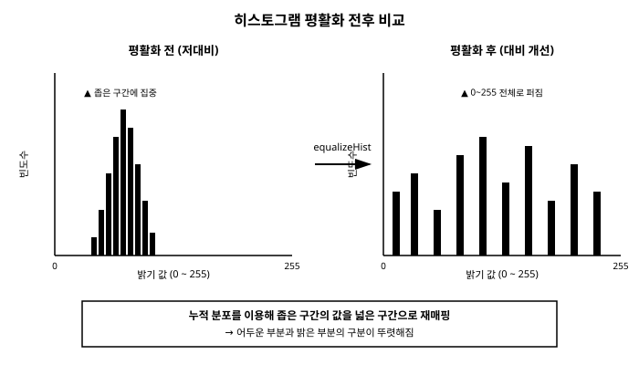

# 14장. 히스토그램

[◀ 이전: 13장. 컨투어 검출과 분석](ch13-컨투어검출과분석.md) | [📖 목차](00-목차.md) | [다음: 15장. 특징점 검출과 매칭 ▶](ch15-특징점검출과매칭.md)


지금까지는 이미지 안의 개별 픽셀 값을 바꾸거나(7장), 픽셀들 사이의 관계를 이용해 필터링하거나(9장), 특정 기준으로 흑과 백을 나누는(10장) 방법을 다뤘습니다. 이 장에서는 관점을 조금 바꿔, 이미지 전체에서 각 밝기 값이 얼마나 자주 나타나는지를 통계적으로 살펴보는 **히스토그램**을 배웁니다. 히스토그램을 이해하면 이미지가 전체적으로 어둡거나 밝은지, 명암 대비가 부족한지를 한눈에 파악할 수 있고, 이를 근거로 화질을 개선하는 기법까지 적용할 수 있습니다. 나아가 두 이미지의 히스토그램을 비교하면 이미지가 서로 얼마나 "닮았는지"까지 수치로 판단할 수 있습니다.

## 14.1 히스토그램이란 무엇인가

**히스토그램(histogram)**은 이미지에서 각 밝기 값(그레이스케일이라면 0부터 255까지)이 몇 개의 픽셀에서 나타나는지를 막대그래프로 나타낸 것입니다. 가로축은 밝기 값(0~255)이고, 세로축은 그 밝기 값을 가진 픽셀의 개수입니다.

예를 들어 어두운 실내에서 찍은 사진은 대부분의 픽셀이 0에 가까운 낮은 값에 몰려 있고, 반대로 눈 덮인 풍경을 찍은 사진은 255에 가까운 높은 값에 픽셀이 몰려 있을 것입니다. 명암 대비가 좋은 사진은 픽셀 값이 0부터 255까지 넓게 퍼져 있는 경향을 보입니다.

히스토그램은 이미지를 눈으로 보는 것과는 다른 방식으로 이미지의 "숫자로 된 성질"을 보여줍니다. 사람의 눈으로는 "약간 어두운 것 같다"는 인상만 받을 수 있지만, 히스토그램을 보면 픽셀의 몇 퍼센트가 어느 밝기 구간에 몰려 있는지를 정량적으로 확인할 수 있습니다.

아래 그림은 저대비(어두운) 이미지와 대비가 개선된 이미지의 히스토그램 모양을 비교한 것입니다.



히스토그램의 활용 범위는 이미지 개선에만 머무르지 않습니다. 이 장에서는 히스토그램을 다음과 같은 세 가지 목적으로 활용하는 방법을 순서대로 배웁니다.

1. **화질 개선**: 명암 대비가 낮은 이미지를 개선한다 (`equalizeHist`, `CLAHE`).
2. **이미지 유사도 측정**: 두 이미지가 색상 분포 면에서 얼마나 비슷한지를 수치로 비교한다 (`compareHist`).
3. **색상 기반 분석**: 색상(H)과 채도(S)를 함께 고려한 2차원 히스토그램으로 특정 색상 영역을 분석한다.

## 14.2 calcHist로 히스토그램 계산하기

OpenCV는 `cv2.calcHist` 함수로 히스토그램을 계산합니다. 매개변수가 다소 많아 처음에는 복잡해 보이지만, 그레이스케일 이미지 하나에 대해 0~255 전체 범위의 히스토그램을 구하는 가장 기본적인 형태로 시작하면 이해하기 쉽습니다.

```python
import cv2
import matplotlib.pyplot as plt

img = cv2.imread("photo.jpg")
gray = cv2.cvtColor(img, cv2.COLOR_BGR2GRAY)

# images, channels, mask, histSize, ranges
hist = cv2.calcHist([gray], [0], None, [256], [0, 256])

plt.plot(hist)
plt.title("Grayscale Histogram")
plt.xlabel("Pixel Value")
plt.ylabel("Frequency")
plt.xlim([0, 256])
plt.show()
```

`calcHist`의 매개변수는 다음과 같은 정보를 담습니다.

- **대상 이미지(들)**: 히스토그램을 계산할 이미지입니다. 여러 이미지를 한 번에 넘길 수 있도록 리스트 형태로 받습니다(대부분 이미지 하나만 넣지만 인터페이스는 리스트를 요구합니다).
- **채널 번호**: 몇 번째 채널의 히스토그램을 구할지 리스트로 지정합니다. 그레이스케일은 채널이 하나뿐이므로 항상 `[0]`입니다.
- **마스크**: 이미지 전체가 아니라 특정 영역에서만 히스토그램을 구하고 싶을 때 사용합니다. 필요 없으면 `None`을 넘깁니다.
- **빈(bin) 개수와 범위**: 밝기 값 0~255를 몇 개의 구간으로 나눌지, 그 범위는 어디부터 어디까지인지를 지정합니다. 그레이스케일 8비트 이미지는 보통 256개의 빈, `[0, 256]` 범위를 그대로 사용합니다.

계산 결과인 `hist`는 `(256, 1)` 모양의 넘파이 배열로, 각 밝기 구간(빈)에 몇 개의 픽셀이 속하는지를 담고 있습니다. `hist.argmax()`로 가장 빈도가 높은 밝기 값을, `hist.sum()`으로 전체 픽셀 수를 확인할 수 있습니다.

```python
print(f"가장 빈도가 높은 밝기 값: {hist.argmax()}")
print(f"전체 픽셀 수(히스토그램 총합): {int(hist.sum())}")
print(f"이미지의 실제 픽셀 수: {gray.shape[0] * gray.shape[1]}")
```

특정 영역만 분석하고 싶다면 마스크를 활용합니다. 마스크는 원본 이미지와 같은 크기의 단일 채널 이미지로, 분석하고 싶은 영역을 255(흰색), 나머지를 0(검은색)으로 채웁니다.

```python
import numpy as np

mask = np.zeros(gray.shape, dtype="uint8")
cv2.rectangle(mask, (100, 100), (300, 300), 255, -1)   # 관심 영역만 흰색으로 채움

hist_roi = cv2.calcHist([gray], [0], mask, [256], [0, 256])
```

### 빈(bin) 개수를 줄여서 히스토그램 단순화하기

`histSize`를 항상 256으로 줄 필요는 없습니다. 예를 들어 `[32]`로 지정하면 0~255 범위를 32개의 구간으로 묶어서(각 구간이 8개의 밝기 값을 포함) 훨씬 더 단순하고 완만한 히스토그램을 얻을 수 있습니다.

```python
hist_fine = cv2.calcHist([gray], [0], None, [256], [0, 256])   # 촘촘한 히스토그램
hist_coarse = cv2.calcHist([gray], [0], None, [32], [0, 256])  # 뭉뚱그린 히스토그램
```

빈 개수를 줄이면 사진마다 존재하는 미세한 잡음(1~2 밝기 값 단위의 흔들림)에 덜 민감해지므로, 14.7절에서 다룰 히스토그램 비교나 분류 작업에서는 오히려 256개보다 32~64개 정도의 적은 빈을 사용하는 것이 더 안정적인 결과를 주는 경우가 많습니다. 반대로 세밀한 밝기 차이까지 구분해야 하는 정밀 분석에는 256개의 빈을 그대로 사용합니다.

### 히스토그램에서 통계량 뽑아내기

히스토그램 자체는 그래프 형태의 값이지만, 여기에서 평균이나 표준편차와 같은 통계량을 계산하면 이미지의 밝기 특성을 단 하나의 숫자로 요약할 수 있습니다. 이는 `gray.mean()`, `gray.std()`처럼 이미지 배열에서 직접 계산해도 되지만, 히스토그램을 이미 계산해 두었다면 각 밝기 값에 해당 빈도(가중치)를 곱해 같은 값을 유도할 수도 있습니다.

```python
import numpy as np

bins = np.arange(256)
total = hist.sum()
mean_brightness = (bins * hist.flatten()).sum() / total
variance = ((bins - mean_brightness) ** 2 * hist.flatten()).sum() / total
std_brightness = np.sqrt(variance)

print(f"평균 밝기: {mean_brightness:.1f}, 표준편차: {std_brightness:.1f}")
```

표준편차가 작다는 것은 픽셀 값들이 좁은 구간에 몰려 있다는 뜻이므로, 다음 절에서 다룰 평활화나 CLAHE로 개선할 필요가 있는 "저대비 이미지"를 자동으로 판별하는 기준으로 활용할 수 있습니다. 예를 들어 `std_brightness`가 특정 임계값(예: 40)보다 작은 이미지에만 자동으로 CLAHE를 적용하는 전처리 파이프라인을 구성할 수 있습니다.

## 14.3 히스토그램 평활화로 명암 대비 개선하기

**히스토그램 평활화(histogram equalization)**는 이미지의 픽셀 값 분포를 0~255 전체 범위에 걸쳐 고르게 펴주는 기법입니다. 어둡게 찍힌 사진은 대부분의 픽셀 값이 낮은 구간(예: 0~80)에 좁게 몰려 있어서 명암 대비가 낮아 보입니다. 이런 이미지에 히스토그램 평활화를 적용하면, 좁게 몰려 있던 픽셀 값들이 0~255 전체 범위로 넓게 펴지면서 어두운 부분과 밝은 부분의 구분이 뚜렷해지고 전반적으로 대비가 개선된 것처럼 보입니다.

원리를 간단히 설명하면, 평활화는 각 밝기 값에 대해 그 값 이하의 픽셀이 전체에서 차지하는 비율(누적 분포)을 계산하고, 이 누적 비율을 새로운 밝기 값으로 다시 매핑합니다. 픽셀 수가 적게 몰려 있던 좁은 구간은 넓은 구간으로 펼쳐지고, 이미 넓게 퍼져 있던 구간은 상대적으로 덜 변합니다. 결과적으로 히스토그램이 평평해지는 방향으로 픽셀 값이 재분배됩니다.

OpenCV에서는 `cv2.equalizeHist` 함수 하나로 이 작업을 수행할 수 있으며, 이 함수는 그레이스케일(단일 채널) 이미지에만 적용할 수 있습니다.

```python
import cv2

img = cv2.imread("dark_photo.jpg")
gray = cv2.cvtColor(img, cv2.COLOR_BGR2GRAY)

equalized = cv2.equalizeHist(gray)

cv2.imshow("Original", gray)
cv2.imshow("Equalized", equalized)
cv2.waitKey(0)
cv2.destroyAllWindows()
```

## 14.4 컬러 이미지의 채널별 히스토그램

지금까지는 그레이스케일 이미지 하나의 히스토그램만 다뤘지만, 컬러 이미지에서는 B, G, R(또는 다른 색공간의 채널) 각각에 대해 히스토그램을 따로 계산하는 경우가 많습니다. 5장에서 다룬 것처럼 컬러 이미지는 여러 채널로 이루어져 있으므로, `calcHist`를 호출할 때 채널 번호만 0, 1, 2로 바꿔가며 각 채널의 히스토그램을 개별적으로 구하면 됩니다.

```python
import cv2
import matplotlib.pyplot as plt

img = cv2.imread("photo.jpg")
colors = ("b", "g", "r")

for i, color in enumerate(colors):
    hist = cv2.calcHist([img], [i], None, [256], [0, 256])
    plt.plot(hist, color=color)
    print(f"{color} 채널의 최대 빈도 밝기 값: {hist.argmax()}")

plt.title("BGR Channel Histograms")
plt.xlim([0, 256])
plt.show()
```

주의할 점은 `equalizeHist`가 단일 채널 이미지에만 동작한다는 것입니다. 컬러 이미지의 대비를 개선하고 싶다고 해서 B, G, R 각 채널에 `equalizeHist`를 따로 적용하면 채널 간 색상 균형이 깨져 색이 부자연스럽게 바뀔 수 있습니다. 컬러 이미지의 대비를 자연스럽게 개선하려면 흔히 5장에서 다룬 색공간 변환을 활용해, HSV의 V(명도) 채널이나 YCrCb의 Y(휘도) 채널처럼 밝기 정보만 담고 있는 채널을 골라 그 채널에만 평활화를 적용한 뒤 다시 원래 색공간으로 되돌리는 방식을 사용합니다.

```python
hsv = cv2.cvtColor(img, cv2.COLOR_BGR2HSV)
h, s, v = cv2.split(hsv)

v_eq = cv2.equalizeHist(v)
hsv_eq = cv2.merge([h, s, v_eq])
result = cv2.cvtColor(hsv_eq, cv2.COLOR_HSV2BGR)
```

이렇게 하면 색상(H)과 채도(S)는 그대로 유지된 채 밝기(V)만 평활화되므로, B/G/R 각 채널을 따로 평활화했을 때 생기는 색 얼룩짐 없이 자연스럽게 대비가 개선됩니다.

## 14.5 실전 예제: 저대비 이미지 개선 전후 비교

이제 어둡거나 대비가 낮은 이미지에 히스토그램 평활화를 적용하고, 원본과 결과를 나란히 놓고 비교하는 예제를 만들어 보겠습니다. 개선 효과를 눈으로만 확인하는 것이 아니라, 평활화 전후의 히스토그램 모양이 실제로 어떻게 달라지는지도 함께 시각화합니다.

```python
import cv2
import numpy as np
import matplotlib.pyplot as plt

img = cv2.imread("dark_photo.jpg")
gray = cv2.cvtColor(img, cv2.COLOR_BGR2GRAY)
equalized = cv2.equalizeHist(gray)

hist_before = cv2.calcHist([gray], [0], None, [256], [0, 256])
hist_after = cv2.calcHist([equalized], [0], None, [256], [0, 256])

# 이미지를 좌우로 나란히 붙여서 눈으로 비교
comparison = np.hstack((gray, equalized))
cv2.imshow("Before (left) vs After (right)", comparison)
cv2.waitKey(0)
cv2.destroyAllWindows()

# 히스토그램 모양 비교
plt.subplot(1, 2, 1)
plt.plot(hist_before)
plt.title("Before Equalization")
plt.xlim([0, 256])

plt.subplot(1, 2, 2)
plt.plot(hist_after)
plt.title("After Equalization")
plt.xlim([0, 256])

plt.show()
```

이 예제를 실제 저대비 사진에 적용해 보면, 평활화 이전에는 좁은 구간에 뾰족하게 몰려 있던 히스토그램이 평활화 이후에는 0~255 전체 구간으로 넓게 펴지는 것을 확인할 수 있습니다. 다만 평활화는 이미지 전체에 대해 일괄적으로 작동하므로, 일부 영역만 어둡고 다른 영역은 이미 적절한 밝기인 사진에서는 밝은 영역이 과도하게 밝아지거나 원치 않는 노이즈가 두드러지는 부작용이 나타날 수 있습니다. 이런 문제를 해결하기 위해 다음 절에서 다룰 CLAHE라는 개선된 기법을 사용할 수 있습니다.

## 14.6 CLAHE: 지역적으로 더 자연스러운 대비 개선

`equalizeHist`는 이미지 전체를 대상으로 단 하나의 누적 분포 함수를 계산해 모든 픽셀에 똑같이 적용합니다. 이 방식은 간단하고 빠르지만, 이미지의 한쪽은 밝고 다른 쪽은 어두운 경우(예: 창문을 등지고 찍은 인물 사진, 그림자가 짙게 진 실외 사진) 전체 히스토그램만 보고 계산한 매핑이 모든 영역에 최적일 수는 없습니다. 어두운 영역은 여전히 어둡게 남거나, 반대로 원래 괜찮았던 밝은 영역이 과도하게 밝아져 디테일이 날아가 버리기도 합니다.

**CLAHE(Contrast Limited Adaptive Histogram Equalization)**는 이 문제를 해결하기 위해 다음과 같은 두 가지 아이디어를 추가한 개선된 평활화 기법입니다.

1. **적응적(Adaptive)**: 이미지 전체가 아니라 작은 타일(tile, 예: 8×8 블록)로 나누어 각 타일마다 별도로 히스토그램 평활화를 수행합니다. 그 결과 지역별로 최적화된 대비 개선이 이루어집니다.
2. **대비 제한(Contrast Limited)**: 타일 단위로 평활화를 하면 하늘처럼 원래 거의 균일한 영역에서 작은 잡음까지 과도하게 증폭되어 부자연스러운 얼룩이 생길 수 있습니다. CLAHE는 히스토그램의 각 빈이 특정 높이(`clipLimit`)를 넘지 못하도록 잘라내어, 이런 과도한 증폭을 억제합니다.
3. 타일 경계에서 밝기가 갑자기 뚝 끊기지 않도록, 인접한 타일 사이의 결과를 **양선형 보간(bilinear interpolation)**으로 부드럽게 이어줍니다.

OpenCV에서는 `cv2.createCLAHE`로 CLAHE 객체를 만들고, `apply` 메서드로 그레이스케일 이미지에 적용합니다.

```python
import cv2

img = cv2.imread("uneven_light.jpg")
gray = cv2.cvtColor(img, cv2.COLOR_BGR2GRAY)

clahe = cv2.createCLAHE(clipLimit=2.0, tileGridSize=(8, 8))
result = clahe.apply(gray)

comparison = cv2.hconcat([gray, cv2.equalizeHist(gray), result])
cv2.imshow("Original | equalizeHist | CLAHE", comparison)
cv2.waitKey(0)
cv2.destroyAllWindows()
```

주요 매개변수는 다음과 같습니다.

- `clipLimit`: 각 타일의 히스토그램에서 허용하는 빈도의 상한값입니다. 이 값을 낮게 주면(예: 1.0~2.0) 대비 개선이 은은하고 자연스러워지고, 높게 주면(예: 4.0 이상) 대비가 강하게 개선되지만 노이즈도 함께 두드러질 수 있습니다.
- `tileGridSize`: 이미지를 몇×몇 개의 타일로 나눌지 지정합니다. `(8, 8)`이 널리 쓰이는 기본값입니다. 타일을 너무 작게 나누면(타일 개수가 많아지면) 지역적인 개선 효과는 커지지만 타일 경계 부근에서 부자연스러움이 생기기 쉽고, 너무 크게 나누면 `equalizeHist`와 결과가 비슷해집니다.

CLAHE는 그레이스케일뿐 아니라 14.4절에서 설명한 방식과 마찬가지로 컬러 이미지의 밝기 채널에만 적용하는 것이 일반적입니다.

```python
hsv = cv2.cvtColor(img, cv2.COLOR_BGR2HSV)
h, s, v = cv2.split(hsv)

clahe = cv2.createCLAHE(clipLimit=2.0, tileGridSize=(8, 8))
v_clahe = clahe.apply(v)

result = cv2.cvtColor(cv2.merge([h, s, v_clahe]), cv2.COLOR_HSV2BGR)
```

CLAHE는 의료 영상(X-ray, CT 등)처럼 이미지 안에 밝기가 크게 차이 나는 영역이 공존하면서도 각 영역의 세부 디테일이 모두 중요한 경우에 특히 널리 쓰입니다. 일반적인 사진 보정에서도 `equalizeHist`보다 훨씬 자연스러운 결과를 주는 경우가 많아, "명암 대비를 개선하고 싶다"는 요구가 있을 때 기본으로 고려해볼 만한 선택입니다.

## 14.7 histogram compareHist로 이미지 유사도 측정하기

히스토그램은 화질 개선 외에도 **두 이미지가 얼마나 비슷한 색 분포를 가지는지 비교**하는 데 사용할 수 있습니다. 직관적으로, 같은 종류의 물체(예: 사과 사진 두 장)는 비슷한 색 분포를 가질 가능성이 높고, 서로 다른 종류의 물체(사과와 하늘 사진)는 색 분포가 크게 다를 가능성이 높습니다. 이 아이디어를 이용하면 이미지 자체의 복잡한 형태를 분석하지 않고도, 히스토그램 비교만으로 간단한 이미지 검색이나 분류를 흉내낼 수 있습니다.

OpenCV에서는 `cv2.compareHist(hist1, hist2, method)` 함수로 두 히스토그램을 비교합니다. 비교하기 전에 두 히스토그램을 **정규화**(`cv2.normalize`)해서 같은 스케일로 맞춰야, 이미지 크기(전체 픽셀 수)가 다른 경우에도 공정하게 비교할 수 있습니다.

```python
import cv2

def get_hist(path):
    img = cv2.imread(path)
    hsv = cv2.cvtColor(img, cv2.COLOR_BGR2HSV)
    hist = cv2.calcHist([hsv], [0, 1], None, [50, 60], [0, 180, 0, 256])
    cv2.normalize(hist, hist, 0, 1, cv2.NORM_MINMAX)
    return hist

hist_a = get_hist("apple1.jpg")
hist_b = get_hist("apple2.jpg")

score = cv2.compareHist(hist_a, hist_b, cv2.HISTCMP_CORREL)
print(f"상관관계(Correlation) 유사도: {score:.3f}")
```

`compareHist`의 세 번째 인수로 지정하는 비교 방법에는 대표적으로 다음 네 가지가 있으며, 각각 값의 범위와 "높을수록 좋은지 낮을수록 좋은지"가 다르므로 주의해야 합니다.

| 방법 | 값의 범위 | 해석 |
|---|---|---|
| `cv2.HISTCMP_CORREL` (상관관계) | -1 ~ 1 | 1에 가까울수록 유사, -1에 가까울수록 반대 분포 |
| `cv2.HISTCMP_CHISQR` (카이제곱) | 0 ~ ∞ | 0에 가까울수록 유사, 클수록 차이가 큼 |
| `cv2.HISTCMP_INTERSECT` (교차) | 0 ~ (정규화 방식에 따른 최대값) | 값이 클수록(두 히스토그램이 겹치는 부분이 많을수록) 유사 |
| `cv2.HISTCMP_BHATTACHARYYA` (바타차야) | 0 ~ 1 | 0에 가까울수록 유사, 1에 가까울수록 완전히 다름 |

- **상관관계(Correlation)**는 두 히스토그램이 같은 모양으로 함께 증가/감소하는 정도를 통계적으로 측정합니다. 직관적으로 이해하기 쉬워 가장 널리 쓰입니다.
- **카이제곱(Chi-Square)**은 통계학에서 두 분포의 차이를 검정할 때 쓰는 방법을 응용한 것으로, 두 히스토그램의 빈별 차이를 제곱해 합산하는 방식이라 큰 차이가 나는 구간에 더 민감합니다.
- **교차(Intersection)**는 두 히스토그램에서 각 빈의 최솟값을 모두 더한 값으로, "두 이미지가 공통으로 가지는 색 분포의 양"을 직접적으로 나타냅니다.
- **바타차야(Bhattacharyya) 거리**는 두 확률 분포 사이의 거리를 재는 방법으로, 통계적으로 잘 정립되어 있어 이미지 검색이나 얼굴 인식 등에서도 자주 사용됩니다.

### 실전 예제: 히스토그램 기반 간단한 이미지 검색

여러 장의 후보 이미지 중에서, 질의(query) 이미지와 색 분포가 가장 비슷한 이미지를 찾아내는 간단한 이미지 검색 프로그램을 만들어 보겠습니다.

```python
import cv2
import glob

def compute_hist(path):
    img = cv2.imread(path)
    hsv = cv2.cvtColor(img, cv2.COLOR_BGR2HSV)
    hist = cv2.calcHist([hsv], [0, 1], None, [50, 60], [0, 180, 0, 256])
    cv2.normalize(hist, hist, 0, 1, cv2.NORM_MINMAX)
    return hist

query_hist = compute_hist("query.jpg")

results = []
for path in glob.glob("dataset/*.jpg"):
    hist = compute_hist(path)
    # 상관관계는 값이 클수록(1에 가까울수록) 더 유사하다
    score = cv2.compareHist(query_hist, hist, cv2.HISTCMP_CORREL)
    results.append((path, score))

# 유사도가 높은 순으로 정렬
results.sort(key=lambda item: item[1], reverse=True)

print("질의 이미지와 가장 비슷한 이미지 순위:")
for path, score in results[:5]:
    print(f"  {path}: 유사도 {score:.3f}")
```

이 예제는 색 분포만을 기준으로 판단하므로, 형태가 완전히 다르더라도 색감이 비슷한 이미지(예: 노란 바나나와 노란 레몬)를 유사하다고 판단할 수 있습니다. 반대로 형태는 같지만 촬영 조명이 크게 달라 색감이 달라진 이미지는 낮은 유사도로 판단될 수 있습니다. 이런 한계를 보완하려면 히스토그램 비교와 함께 13장에서 배운 컨투어 기반의 형태 분석이나, 15장에서 다룰 특징점 매칭을 함께 사용하는 것이 좋습니다. 그럼에도 히스토그램 비교는 계산이 매우 빠르고 구현이 간단하기 때문에, 정교한 형태 분석 전에 후보를 빠르게 걸러내는 1차 필터로 실무에서 자주 사용됩니다.

### 실전 예제: 히스토그램 기반 간단한 이미지 분류

검색과 비슷한 원리로, "이 이미지는 어떤 범주(클래스)에 속하는가"를 판단하는 간단한 분류기도 만들 수 있습니다. 아이디어는 단순합니다. 범주별로 미리 준비된 여러 장의 학습 이미지에서 **평균 히스토그램**을 하나씩 만들어 두고, 새로운 이미지가 들어오면 그 히스토그램을 각 범주의 평균 히스토그램과 비교해 가장 유사도가 높은(또는 거리가 가장 짧은) 범주로 분류하는 방식입니다. 이는 머신러닝의 "최근접 클래스 평균(nearest class mean)" 분류기와 원리가 같습니다.

```python
import cv2
import glob
import numpy as np

def compute_hist(path):
    img = cv2.imread(path)
    hsv = cv2.cvtColor(img, cv2.COLOR_BGR2HSV)
    hist = cv2.calcHist([hsv], [0, 1], None, [50, 60], [0, 180, 0, 256])
    cv2.normalize(hist, hist, 0, 1, cv2.NORM_MINMAX)
    return hist

# 범주별 학습 이미지들로부터 "평균 히스토그램"을 미리 계산해 둔다
class_hists = {}
for class_name in ["apple", "banana", "grape"]:
    hists = [compute_hist(p) for p in glob.glob(f"train/{class_name}/*.jpg")]
    class_hists[class_name] = np.mean(hists, axis=0).astype("float32")

def classify(path):
    hist = compute_hist(path)
    best_class, best_score = None, -1.0
    for class_name, ref_hist in class_hists.items():
        score = cv2.compareHist(hist, ref_hist, cv2.HISTCMP_CORREL)
        if score > best_score:
            best_class, best_score = class_name, score
    return best_class, best_score

predicted, confidence = classify("test/unknown1.jpg")
print(f"예측된 범주: {predicted} (유사도 {confidence:.3f})")
```

이 방식은 색상 분포가 범주를 구별하는 데 충분히 유용한 정보일 때(예: 과일처럼 색이 범주를 강하게 암시하는 경우)는 놀랍도록 잘 동작합니다. 반면 색상만으로는 구분이 어려운 범주(예: 같은 초록색 계열인 오이와 애호박)에는 한계가 뚜렷하므로, 실제 제품에 적용할 때는 색상 히스토그램을 형태 특징이나 딥러닝 기반 분류기와 함께 보조 지표로 사용하는 경우가 많습니다.

## 14.8 2차원 히스토그램으로 색상 분석하기

지금까지 다룬 히스토그램은 모두 **1차원**이었습니다. 그레이스케일 밝기 하나, 또는 B/G/R 채널 하나씩을 독립적으로 분석했습니다. 하지만 색상을 제대로 분석하려면 색상(Hue)과 채도(Saturation)를 **함께** 고려해야 하는 경우가 많습니다. 예를 들어 색상 값만 보면 "빨간색 계열"이라고 판단되더라도, 채도가 매우 낮으면 실제로는 거의 회색에 가까운 흐릿한 색일 수 있습니다. 색상과 채도를 동시에 히스토그램으로 나타낸 것이 **2차원 히스토그램(H-S 히스토그램)**입니다.

`calcHist`는 채널 번호와 빈 개수, 범위를 여러 개 동시에 넘기는 것만으로 다차원 히스토그램을 계산할 수 있습니다. HSV 색공간에서 H, S 두 채널을 함께 사용하는 예는 다음과 같습니다.

```python
import cv2
import numpy as np

img = cv2.imread("fruit.jpg")
hsv = cv2.cvtColor(img, cv2.COLOR_BGR2HSV)

# H 채널(0~180)은 30개 빈, S 채널(0~256)은 32개 빈으로 나눈 2D 히스토그램
hist2d = cv2.calcHist([hsv], [0, 1], None, [30, 32], [0, 180, 0, 256])

print(f"2D 히스토그램 shape: {hist2d.shape}")  # (30, 32)
```

결과인 `hist2d`는 `(30, 32)` 모양의 2차원 배열로, `hist2d[h][s]`가 "색상 구간 h, 채도 구간 s에 속하는 픽셀의 개수"를 나타냅니다. 이 값이 큰 좌표 `(h, s)`를 찾으면 이미지에서 가장 흔하게 나타나는 색상-채도 조합을 알 수 있습니다.

```python
h_idx, s_idx = np.unravel_index(hist2d.argmax(), hist2d.shape)
print(f"가장 빈도가 높은 (색상 구간, 채도 구간): ({h_idx}, {s_idx})")
```

2D 히스토그램은 눈으로 보기에는 1D 그래프보다 해석이 어렵지만, `matplotlib`의 `imshow`를 이용해 흑백 또는 컬러맵 이미지로 시각화하면 어떤 색상-채도 조합이 이미지에서 두드러지는지 한눈에 볼 수 있습니다.

```python
import matplotlib.pyplot as plt

plt.imshow(hist2d, interpolation="nearest")
plt.xlabel("Saturation bins")
plt.ylabel("Hue bins")
plt.title("H-S 2D Histogram")
plt.colorbar()
plt.show()
```

2D 히스토그램은 특정 색상 영역(예: 피부색, 특정 과일의 색, 특정 팀 유니폼의 색)을 통계적으로 학습해두고, 새로운 이미지에서 그 색상 영역에 해당하는 픽셀만 골라내는 **히스토그램 역투영(back projection, `cv2.calcBackProject`)**의 기초가 됩니다. 역투영은 이 책의 범위를 넘어서는 심화 주제이지만, 그 핵심 재료가 바로 이 절에서 다룬 H-S 2차원 히스토그램이라는 점을 기억해 두면, 나중에 색상 기반 객체 추적이나 배경 제거 기법을 접했을 때 이해가 훨씬 빨라질 것입니다.

## 요약

- 히스토그램은 이미지에서 각 밝기 값이 몇 번 나타나는지를 보여주는 분포 그래프로, 이미지가 전체적으로 밝은지 어두운지, 대비가 좋은지를 수치로 파악하는 데 사용합니다.
- `calcHist`는 대상 이미지, 채널 번호, 마스크, 빈 개수, 값의 범위를 지정해 히스토그램을 계산합니다. 그레이스케일 이미지라면 채널은 항상 0번이며, 마스크를 지정하면 이미지의 특정 영역만 분석할 수 있습니다.
- `equalizeHist`는 픽셀 값의 누적 분포를 이용해 좁게 몰린 히스토그램을 0~255 전체로 펴서 명암 대비를 개선합니다. 단일 채널 이미지에만 적용할 수 있으며, 컬러 이미지는 밝기 채널(HSV의 V, YCrCb의 Y 등)에만 적용하는 것이 일반적입니다.
- `createCLAHE`로 만드는 CLAHE는 이미지를 타일로 나누어 지역적으로 평활화하면서도 `clipLimit`으로 과도한 증폭을 억제하여, 밝기가 불균일한 이미지에서 `equalizeHist`보다 더 자연스러운 결과를 줍니다.
- `compareHist`는 상관관계, 카이제곱, 교차, 바타차야 거리 등의 방법으로 두 히스토그램의 유사도를 수치화하며, 이를 이용해 색 분포 기반의 간단한 이미지 검색이나 분류를 구현할 수 있습니다.
- 색상(H)과 채도(S)를 함께 고려하는 2차원 히스토그램은 1차원 히스토그램보다 색상 정보를 더 풍부하게 담아내며, 히스토그램 역투영과 같은 색상 기반 분석 기법의 기초가 됩니다.

## 연습문제

1. 밝은 이미지, 어두운 이미지, 대비가 좋은 이미지 세 장을 각각 그레이스케일로 불러와 히스토그램을 그려보고, 그래프의 모양이 각각 어떻게 다르게 나타나는지 비교해 보세요.
2. 밝기가 불균일한 사진 한 장에 `equalizeHist`와 `CLAHE`를 각각 적용한 뒤 결과 이미지를 나란히 놓고 비교하여, 어느 영역에서 두 방법의 차이가 두드러지는지 설명해 보세요.
3. `clipLimit`을 1.0, 2.0, 4.0, 8.0으로 바꿔가며 같은 이미지에 CLAHE를 적용해 보고, 값이 커질수록 결과 이미지와 노이즈가 어떻게 달라지는지 관찰해 보세요.
4. 같은 물체를 다른 조명에서 찍은 두 사진과, 전혀 다른 물체를 찍은 사진 한 장을 준비해 `compareHist`의 네 가지 방법(상관관계, 카이제곱, 교차, 바타차야)으로 각각 유사도를 계산하고, 방법에 따라 순위가 달라지는지 비교해 보세요.
5. 특정 색(예: 빨간색) 물체가 담긴 이미지에서 H-S 2차원 히스토그램을 계산하고, 빈도가 가장 높은 (H, S) 구간이 실제로 그 물체의 색상 범위와 일치하는지 `cv2.inRange`로 이진화한 결과와 비교해 확인해 보세요.

---

[◀ 이전: 13장. 컨투어 검출과 분석](ch13-컨투어검출과분석.md) | [📖 목차](00-목차.md) | [다음: 15장. 특징점 검출과 매칭 ▶](ch15-특징점검출과매칭.md)
