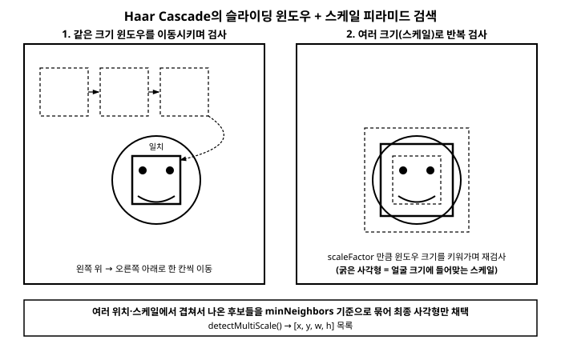

# 17장. 얼굴/객체 검출: Haar Cascade와 DNN 모듈

[◀ 이전: 16장. 비디오 처리와 배경 제거](ch16-비디오처리와배경제거.md) | [📖 목차](00-목차.md) | [다음: 18장. 실전 프로젝트와 성능 최적화 ▶](ch18-실전프로젝트와성능최적화.md)


## 17.1 "검출"이라는 문제

지금까지 다룬 기법들—색공간 변환, 필터링, 임계처리, 컨투어, 특징점 매칭—은 대부분 이미지 안의 "어떤 패턴"을 수학적으로 다루는 도구였다. 이번 장에서는 이 도구들의 자연스러운 응용 사례 중 하나인 **객체 검출(object detection)**, 그중에서도 가장 널리 쓰이는 예시인 **얼굴 검출(face detection)**을 다룬다.

먼저 용어를 정리해두자. "얼굴 검출"은 이미지 안에 얼굴이 어디에 있는지(사각형 좌표)를 찾아내는 작업이고, "얼굴 인식(face recognition)"은 그 얼굴이 누구인지 식별하는 작업이다. 이 장에서 다루는 것은 전자, 즉 검출이다. 누구의 얼굴인지는 관심 없고, "이 사각형 영역에 얼굴이 있다"는 사실만 판단한다.

얼굴 검출에 접근하는 방법은 크게 두 갈래로 나뉜다.

1. **특징 기반의 고전적 방법**: 이미지의 밝기 패턴에서 사람이 미리 설계한 특징(feature)을 뽑아내고, 그 특징들을 조합한 분류기로 "얼굴이다/아니다"를 판단한다. 이 장에서 다룰 **Haar Cascade**가 대표적이다.
2. **딥러닝 기반 방법**: 대량의 데이터로 학습한 신경망이 특징을 스스로 학습해서 얼굴(또는 다른 객체)을 찾아낸다. 최근 실무에서는 이 방식이 정확도 면에서 압도적으로 우세하다.

OpenCV는 이 두 갈래를 모두 지원한다. `CascadeClassifier`로 대표되는 전통적인 API와, `dnn` 모듈로 대표되는 딥러닝 추론 API다. 이 장에서는 먼저 Haar Cascade로 얼굴 검출의 기본 흐름을 익히고, 그 한계를 확인한 뒤, OpenCV가 딥러닝 모델을 어떻게 추론에 활용하는지 개념 수준에서 살펴본다.

## 17.2 Haar Cascade: 밝기 패턴으로 얼굴을 찾는 고전적 방법

Haar Cascade는 2000년대 초반에 제안된 얼굴 검출 알고리즘으로, 지금 기준으로는 오래된 기법이지만 계산이 매우 가볍고 별도의 GPU나 무거운 런타임 없이도 실시간으로 동작한다는 장점 때문에 여전히 임베디드 환경이나 빠른 프로토타이핑에서 종종 쓰인다.

핵심 아이디어는 단순하다. 얼굴에는 "눈 부위는 이마보다 어둡다", "콧대 양옆은 콧대보다 어둡다"처럼 밝기가 대비되는 국소적인 패턴들이 규칙적으로 나타난다. Haar Cascade는 이런 밝기 대비 패턴(Haar-like feature)을 수천 개 정의해두고, 작은 이미지 윈도우 안에서 이 패턴들이 얼마나 들어맞는지를 검사한다. 한 번에 모든 패턴을 다 검사하는 것이 아니라, 계산이 가장 간단하고 걸러내는 효율이 좋은 패턴부터 순서대로 여러 단계(stage)로 나눠 검사하고, 어느 단계에서든 "얼굴이 아니다"라는 판정이 나오면 즉시 그 윈도우를 버리고 다음 위치로 넘어간다. 이렇게 단계를 순차적으로 통과시키는 구조를 "cascade(직렬로 이어진 폭포)"라고 부르며, 배경처럼 명백히 얼굴이 아닌 영역을 초반 몇 단계에서 빠르게 걸러낼 수 있어 전체 탐색이 빨라진다.

이 분류기는 미리 방대한 얼굴/비얼굴 이미지로 학습되어 있고, 그 학습 결과(어떤 패턴을, 어떤 순서로, 어떤 기준값으로 검사할지)가 XML 파일 하나에 통째로 저장되어 있다. 우리가 할 일은 이 XML 파일을 읽어서 분류기를 만들고, 검사하고 싶은 이미지를 넘겨주는 것뿐이다. 모델을 직접 학습시킬 필요가 없다는 점에서, 이는 이미 학습된 모델을 가져와 추론만 수행하는 이 책의 다른 예제들과 성격이 같다.

세 언어에서 이 분류기를 다루는 클래스는 다음과 같이 대응된다.

| 언어 | 클래스/로드 | 검출 메서드 |
|---|---|---|
| Python | `cv2.CascadeClassifier(path)` | `detectMultiScale(...)` |
| C++ | `cv::CascadeClassifier`, `.load(path)` | `detectMultiScale(...)` |
| C# | `OpenCvSharp.CascadeClassifier(path)` | `DetectMultiScale(...)` |

Python에서는 `opencv-python` 패키지 자체에 대표적인 Haar Cascade XML 파일들이 함께 설치되며, `cv2.data.haarcascades`라는 경로 변수로 그 위치를 바로 얻을 수 있어 별도로 파일을 내려받지 않아도 된다. 반면 C++와 C#에서는 라이브러리에 XML 파일이 동봉되어 있지 않으므로, OpenCV 공식 GitHub 저장소의 `data/haarcascades/` 폴더에서 `haarcascade_frontalface_default.xml` 같은 파일을 직접 내려받아 프로젝트 폴더에 넣어두고 그 경로를 지정해줘야 한다.

## 17.3 슬라이딩 윈도우와 스케일 피라미드

Haar Cascade가 이미지 전체에서 얼굴을 찾는 방식을 좀 더 구체적으로 살펴보자. 분류기 하나는 "고정된 크기의 정사각형(또는 정해진 종횡비의 사각형) 윈도우 안에 얼굴이 있는가"만 판단할 수 있다. 그런데 실제 이미지 속 얼굴은 위치도 다르고 크기도 제각각이다. 그래서 검출기는 다음 두 가지를 반복한다.

- **슬라이딩(sliding)**: 작은 윈도우를 이미지의 왼쪽 위부터 오른쪽 아래까지 조금씩 이동시키며 매 위치마다 "얼굴인가?"를 검사한다.
- **스케일(scale)**: 한 가지 윈도우 크기로 이미지 전체를 다 훑은 다음, 윈도우 크기를 키우거나(또는 이미지를 축소하고 윈도우는 고정한 채) 같은 과정을 반복한다. 이렇게 여러 크기로 반복 검사하는 것을 흔히 "스케일 피라미드를 훑는다"고 표현한다.

이 두 과정을 거치면 같은 얼굴 하나에 대해서도 서로 조금씩 겹치는 여러 개의 사각형이 "얼굴 후보"로 검출되는 경우가 많다. `detectMultiScale`은 이렇게 겹쳐서 나온 후보들을 내부적으로 그룹으로 묶어, 충분히 많은 후보가 겹친 영역만 최종 결과로 남기고 나머지는 걸러낸다.



## 17.4 `detectMultiScale`의 주요 파라미터

`detectMultiScale`은 세 언어 모두 이름과 동작이 거의 동일한 파라미터를 받는다.

| 파라미터 | 의미 |
|---|---|
| `scaleFactor` | 다음 스케일로 넘어갈 때 윈도우(또는 이미지)를 얼마나 축소/확대할지 비율. 1.1이면 각 단계마다 10%씩 크기를 바꾼다. 값이 작을수록 더 꼼꼼하게 스케일을 훑지만 느려진다. |
| `minNeighbors` | 하나의 얼굴로 인정하려면 서로 겹치는 후보 사각형이 최소 몇 개 모여야 하는지. 값이 클수록 오검출(false positive)은 줄지만 검출률도 함께 낮아질 수 있다. |
| `minSize` | 검출할 얼굴의 최소 크기(픽셀). 이보다 작은 후보는 무시해서 탐색 범위를 줄인다. |
| `maxSize` | 검출할 얼굴의 최대 크기. 지정하지 않으면 제한이 없다. |

이 파라미터들은 정답이 정해져 있지 않으며, 입력 이미지의 해상도와 얼굴 크기 분포에 맞춰 실험적으로 조정하는 것이 일반적이다.

## 17.5 실전 예제: 얼굴 검출 후 사각형으로 표시하기

이제 위 개념을 실제 코드로 구현해보자. 흐름은 다음과 같다.

1. 이미지를 읽고 그레이스케일로 변환한다(Haar Cascade는 흑백 밝기 패턴만 사용하므로 컬러 정보가 필요 없다).
2. 미리 학습된 XML 모델로 `CascadeClassifier`를 만든다.
3. `detectMultiScale`로 얼굴 사각형 목록을 얻는다.
4. 6장에서 배운 사각형 그리기로 각 얼굴 위치를 원본 컬러 이미지 위에 표시한다.

### Python

```python
import cv2

# opencv-python에 내장된 Haar Cascade 경로를 사용한다.
cascade_path = cv2.data.haarcascades + "haarcascade_frontalface_default.xml"
face_cascade = cv2.CascadeClassifier(cascade_path)

img = cv2.imread("people.jpg")
gray = cv2.cvtColor(img, cv2.COLOR_BGR2GRAY)

# 필요하다면 14장에서 배운 equalizeHist로 대비를 보정하면 검출률이 좋아질 수 있다.
# gray = cv2.equalizeHist(gray)

faces = face_cascade.detectMultiScale(
    gray,
    scaleFactor=1.1,
    minNeighbors=5,
    minSize=(30, 30),
)

print(f"검출된 얼굴 수: {len(faces)}")

for (x, y, w, h) in faces:
    cv2.rectangle(img, (x, y), (x + w, y + h), (255, 0, 0), 2)

cv2.imshow("Faces", img)
cv2.waitKey(0)
cv2.destroyAllWindows()
```

### C++

```cpp
#include <opencv2/opencv.hpp>
#include <iostream>

int main() {
    // 사전에 OpenCV 저장소의 data/haarcascades/ 폴더에서 내려받아둔 파일.
    cv::CascadeClassifier faceCascade;
    if (!faceCascade.load("haarcascade_frontalface_default.xml")) {
        std::cerr << "Cascade 파일을 불러오지 못했습니다." << std::endl;
        return -1;
    }

    cv::Mat img = cv::imread("people.jpg");
    cv::Mat gray;
    cv::cvtColor(img, gray, cv::COLOR_BGR2GRAY);
    // cv::equalizeHist(gray, gray);  // 필요하면 대비 보정(14장)

    std::vector<cv::Rect> faces;
    faceCascade.detectMultiScale(gray, faces, 1.1, 5, 0, cv::Size(30, 30));

    std::cout << "검출된 얼굴 수: " << faces.size() << std::endl;

    for (const auto& r : faces) {
        cv::rectangle(img, r, cv::Scalar(255, 0, 0), 2);
    }

    cv::imshow("Faces", img);
    cv::waitKey(0);
    return 0;
}
```

### C#

```csharp
using OpenCvSharp;

using var faceCascade = new CascadeClassifier("haarcascade_frontalface_default.xml");

Mat img = Cv2.ImRead("people.jpg");
Mat gray = new Mat();
Cv2.CvtColor(img, gray, ColorConversionCodes.BGR2Gray);
// Cv2.EqualizeHist(gray, gray); // 필요하면 대비 보정(14장)

Rect[] faces = faceCascade.DetectMultiScale(
    gray,
    scaleFactor: 1.1,
    minNeighbors: 5,
    flags: HaarDetectionTypes.ScaleImage,
    minSize: new Size(30, 30)
);

Console.WriteLine($"검출된 얼굴 수: {faces.Length}");

foreach (var rect in faces)
{
    Cv2.Rectangle(img, rect, new Scalar(255, 0, 0), 2);
}

Cv2.ImShow("Faces", img);
Cv2.WaitKey(0);
```

세 코드 모두 결과는 동일한 형태로 귀결된다. `detectMultiScale`이 돌려주는 값은 결국 "왼쪽 위 좌표(x, y)와 너비·높이(w, h)"로 구성된 사각형들의 목록이며, 이는 3장과 6장에서 이미 다룬 `Rect`/튜플 구조와 정확히 같은 표현이다. 검출 자체가 새로운 데이터 구조를 요구하는 것이 아니라, 지금까지 배운 사각형 좌표 표현을 그대로 재사용한다는 점을 확인해두자.

## 17.6 Haar Cascade의 한계

Haar Cascade는 가볍고 빠르지만 몇 가지 뚜렷한 한계를 가진다.

- **정면 얼굴에 편향**: `haarcascade_frontalface_default.xml`은 정면을 바라보는 얼굴을 기준으로 학습되었다. 얼굴이 옆으로 크게 돌아가거나 기울어지면 검출률이 급격히 떨어진다(측면용 별도 XML이 존재하지만 역시 완벽하지 않다).
- **조명 민감성**: 강한 역광이나 부분 음영이 있으면 밝기 패턴 자체가 흐트러져 검출에 실패하기 쉽다.
- **오검출과 미검출의 트레이드오프**: `minNeighbors`나 `scaleFactor` 같은 파라미터를 조정해도 오검출(배경을 얼굴로 착각)과 미검출(진짜 얼굴을 놓침) 사이의 균형을 완벽히 맞추기 어렵다.
- **얼굴 외 객체로 일반화하기 어려움**: 다른 종류의 객체(자동차, 특정 상품 등)를 검출하려면 그 객체에 맞는 별도의 Haar Cascade를 새로 학습시켜야 하는데, 이 과정이 번거롭고 성능도 딥러닝 기반 방법에 비해 떨어지는 경우가 많다.

이런 한계 때문에 최근의 실무 환경에서는 얼굴이든 다른 객체든, 검출 정확도가 중요한 경우 딥러닝 기반 검출기를 사용하는 것이 일반적이다. 다행히 OpenCV는 이런 딥러닝 모델을 직접 학습시키는 도구는 아니지만, 이미 학습된 모델을 불러와 추론에 활용할 수 있는 통로를 제공한다.

## 17.7 OpenCV의 DNN 모듈: 딥러닝 모델을 추론에만 활용하기

OpenCV의 `dnn` 모듈은 TensorFlow, PyTorch(ONNX로 변환), Caffe, Darknet 등 다양한 프레임워크에서 학습된 모델 파일을 읽어들여, OpenCV 안에서 순전파(forward pass)만 실행할 수 있게 해주는 추론 전용 인터페이스다. 모델을 설계하거나 학습시키는 기능은 없으며, 그 부분은 각 딥러닝 프레임워크의 몫이다. 즉 "누군가 이미 학습시켜 파일로 내보낸 모델을, 별도의 무거운 프레임워크 설치 없이 OpenCV 하나로 돌려볼 수 있게 해주는 다리" 정도로 이해하면 된다.

모델 파일을 불러오는 함수는 원본 프레임워크에 따라 나뉜다.

| 언어 | ONNX 모델 로드 | TensorFlow 모델 로드 |
|---|---|---|
| Python | `cv2.dnn.readNetFromONNX(path)` | `cv2.dnn.readNetFromTensorflow(pb, pbtxt)` |
| C++ | `cv::dnn::readNetFromONNX(path)` | `cv::dnn::readNetFromTensorflow(pb, pbtxt)` |
| C# | `OpenCvSharp.Dnn.CvDnn.ReadNetFromOnnx(path)` | `OpenCvSharp.Dnn.CvDnn.ReadNetFromTensorflow(pb, pbtxt)` |

이렇게 불러온 네트워크에 이미지를 넣어 추론하는 흐름은 대체로 다음과 같은 세 단계를 따른다.

1. **전처리(`blobFromImage`)**: 이미지를 신경망이 기대하는 입력 형태(고정된 크기로 리사이즈, 픽셀값 정규화, 채널 순서 변경 등)로 변환해 "블롭(blob)"이라는 4차원 배열을 만든다.
2. **입력 설정(`setInput`)**: 만든 블롭을 네트워크의 입력으로 지정한다.
3. **순전파(`forward`)**: 네트워크를 실행해 출력(클래스 확률, 검출 사각형 등 모델마다 다른 형식)을 얻는다.

### Python

```python
import cv2

net = cv2.dnn.readNetFromONNX("model.onnx")

img = cv2.imread("scene.jpg")
blob = cv2.dnn.blobFromImage(
    img, scalefactor=1.0 / 255.0, size=(224, 224),
    mean=(0, 0, 0), swapRB=True, crop=False,
)

net.setInput(blob)
output = net.forward()
print(output.shape)  # 형식은 모델 구조에 따라 달라진다.
```

### C++

```cpp
#include <opencv2/opencv.hpp>
#include <opencv2/dnn.hpp>

int main() {
    cv::dnn::Net net = cv::dnn::readNetFromONNX("model.onnx");

    cv::Mat img = cv::imread("scene.jpg");
    cv::Mat blob = cv::dnn::blobFromImage(
        img, 1.0 / 255.0, cv::Size(224, 224),
        cv::Scalar(0, 0, 0), true, false
    );

    net.setInput(blob);
    cv::Mat output = net.forward();
    // output의 형식(shape)은 모델 구조에 따라 달라진다.
    return 0;
}
```

### C#

```csharp
using OpenCvSharp;
using OpenCvSharp.Dnn;

Net net = CvDnn.ReadNetFromOnnx("model.onnx");

Mat img = Cv2.ImRead("scene.jpg");
Mat blob = CvDnn.BlobFromImage(
    img, scaleFactor: 1.0 / 255.0, size: new Size(224, 224),
    mean: new Scalar(0, 0, 0), swapRB: true, crop: false
);

net.SetInput(blob);
Mat output = net.Forward();
// output의 형식은 모델 구조에 따라 달라진다.
```

여기서 `output`을 어떻게 해석할지—즉 어떤 위치의 값이 클래스 확률인지, 어떤 값이 사각형 좌표인지—는 모델을 설계할 때 정해지는 규약이며, 모델마다 완전히 다르다. 이 후처리 로직을 직접 작성하려면 사용하는 모델의 구조를 정확히 알아야 하는데, 이는 모델 학습·설계의 영역이라 이 책의 범위를 벗어난다. 다만 "OpenCV 안에서 미리 학습된 딥러닝 모델을 불러와 이미지에 대해 추론을 실행할 수 있는 창구가 존재하며, 그 창구를 통과하는 데이터의 형태(블롭)와 절차(전처리 → 입력 설정 → 순전파)는 어떤 모델이든 크게 다르지 않다"는 사실을 알아두는 것만으로도, 앞으로 딥러닝 기반 비전 기능을 프로젝트에 통합할 때 어디서부터 시작해야 할지 감을 잡을 수 있을 것이다.

## 요약

- 얼굴 "검출"은 위치만 찾는 작업이고, 얼굴 "인식"은 신원까지 식별하는 작업으로 서로 다른 문제다.
- `CascadeClassifier`(Python: `cv2.CascadeClassifier`, C++: `cv::CascadeClassifier`, C#: `OpenCvSharp.CascadeClassifier`)는 미리 학습된 Haar Cascade XML 모델을 불러와 얼굴 등을 검출하는 전통적인 방법이다.
- `detectMultiScale`은 이미지 위에서 다양한 위치(슬라이딩)와 다양한 크기(스케일 피라미드)로 윈도우를 반복 검사해 얼굴 후보 사각형들을 찾고, `minNeighbors` 기준으로 겹치는 후보를 묶어 최종 결과를 걸러낸다.
- Haar Cascade는 계산이 가볍지만 정면 얼굴 위주로 학습되었고 조명·각도 변화에 민감하다는 한계가 있어, 정확도가 중요한 실무에서는 딥러닝 기반 검출로 옮겨가는 경우가 많다.
- OpenCV의 `dnn` 모듈(`readNetFromONNX`, `readNetFromTensorflow` 등)은 모델을 직접 학습시키지는 못하지만, 다른 프레임워크에서 학습된 모델을 불러와 `blobFromImage → setInput → forward`의 흐름으로 추론을 실행할 수 있는 통로를 제공한다.

## 연습문제

1. `detectMultiScale`의 `minNeighbors` 값을 1, 5, 10으로 각각 바꿔가며 같은 이미지에 적용해보고, 검출되는 얼굴 사각형의 개수와 오검출 여부가 어떻게 달라지는지 관찰해 보라.
2. 여러 사람이 함께 나온 사진과, 얼굴이 옆으로 돌아간(측면) 사진을 각각 준비해 Haar Cascade로 검출해보고, 정면 사진과 비교했을 때 검출률이 어떻게 달라지는지 확인해 보라.
3. 검출된 얼굴 사각형 영역만 잘라내어(크롭) 별도의 이미지 파일로 저장하는 기능을 세 언어 중 하나로 추가해 보라. (힌트: `Mat`/NumPy 배열의 슬라이싱을 활용한다.)
4. `haarcascade_eye.xml` 같은 다른 Haar Cascade 파일을 찾아보고, 얼굴을 먼저 검출한 뒤 그 얼굴 영역 안에서만 눈을 다시 검출하는 2단계 검출 파이프라인을 설계해 보라.
5. OpenCV의 `dnn` 모듈로 실행할 수 있는 공개된 사전 학습 얼굴 검출 모델(예: SSD 기반 모델)을 조사해보고, Haar Cascade 방식과 비교했을 때 어떤 장단점이 있을지 정리해 보라.

---

[◀ 이전: 16장. 비디오 처리와 배경 제거](ch16-비디오처리와배경제거.md) | [📖 목차](00-목차.md) | [다음: 18장. 실전 프로젝트와 성능 최적화 ▶](ch18-실전프로젝트와성능최적화.md)
