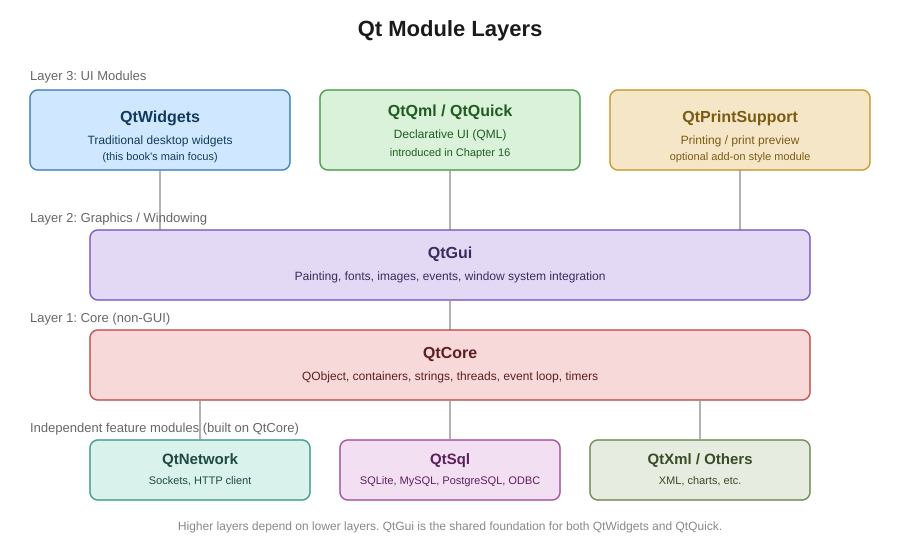

# 1장. Qt란 무엇인가

📖 [◀ 목차](00-목차.md) | [다음: 2장. 개발 환경 설정과 첫 창 ▶](ch02-개발환경설정과첫창.md)

---

## 1.1 Qt 소개

Qt(큐트라고 읽습니다)는 C++로 작성된 크로스플랫폼 애플리케이션 개발 프레임워크입니다. 하나의 소스 코드를 Windows, macOS, Linux는 물론 Android, iOS, 임베디드 리눅스 등 다양한 플랫폼에서 거의 그대로 빌드하여 실행할 수 있도록 설계되었습니다. 흔히 "GUI 툴킷"으로만 알려져 있지만, 실제로는 GUI뿐 아니라 네트워크 통신, 데이터베이스 접근, 파일 시스템 처리, 멀티스레딩, XML/JSON 파싱 등을 아우르는 종합 애플리케이션 프레임워크입니다.

Qt의 핵심 설계 철학은 다음과 같이 요약할 수 있습니다.

- **크로스플랫폼**: 플랫폼별 API 차이를 Qt가 추상화하여, 개발자는 운영체제 세부사항을 몰라도 대부분의 기능을 사용할 수 있습니다.
- **시그널과 슬롯(Signal & Slot)**: 객체 간의 느슨한 결합을 지원하는 이벤트 통신 메커니즘으로, Qt를 다른 C++ GUI 라이브러리와 구분 짓는 대표적인 특징입니다. 이 메커니즘은 3장에서 자세히 다룹니다.
- **풍부한 위젯과 모듈**: 버튼, 텍스트 입력창 같은 기본 UI 요소부터 그래프, 3D 렌더링, 웹 엔진까지 폭넓은 모듈을 제공합니다.
- **도구 체인 통합**: Qt Creator라는 통합 개발 환경, Qt Designer라는 UI 디자인 도구, 다국어 지원 도구(Qt Linguist) 등을 함께 제공합니다.

## 1.2 Qt의 역사

Qt는 1991년 노르웨이의 프로그래머 하바드 노드(Haavard Nord)와 아이릭 쳄비-워(Eirik Chambe-Eng)에 의해 개발이 시작되었고, 1995년 이들이 설립한 트롤텍(Trolltech)이라는 회사를 통해 처음 공개되었습니다. 이후 소유권이 여러 차례 이전되었는데, 대략적인 흐름은 다음과 같습니다.

1. **트롤텍(Trolltech) 시대**: Qt가 처음 탄생하고 리눅스 데스크톱 환경인 KDE의 기반 툴킷으로 채택되면서 오픈소스 커뮤니티에서 널리 알려졌습니다.
2. **노키아(Nokia) 인수**: 2008년 노키아가 트롤텍을 인수하면서 Qt는 모바일 기기용 프레임워크로도 확장을 시도했습니다.
3. **디지아(Digia)와 The Qt Company**: 이후 Qt 사업 부문이 디지아로 이전되었고, 현재는 The Qt Company가 Qt의 개발과 라이선스를 총괄하고 있습니다.

Qt는 오랜 세월 동안 여러 데스크톱 환경과 응용 프로그램의 기반이 되어 왔으며, 대표적으로 리눅스 데스크톱 환경인 KDE Plasma, 3D 그래픽 소프트웨어, 산업용 계측 장비의 조작 화면(HMI), 자동차 인포테인먼트 시스템 등 다양한 분야에서 이름이 언급되는 프레임워크입니다. 이 책에서는 특정 제품의 세부 구현을 다루지는 않지만, Qt가 단순한 학습용 라이브러리가 아니라 실제 산업 현장에서 검증된 프레임워크라는 점을 기억해 두면 좋습니다.

## 1.3 Qt의 모듈 구성

Qt는 하나의 거대한 라이브러리가 아니라, 기능별로 나뉜 여러 모듈의 집합으로 구성되어 있습니다. 필요한 모듈만 선택적으로 링크하여 사용할 수 있다는 것이 특징입니다. 아래 그림은 대표적인 Qt 모듈들의 계층 관계를 보여줍니다.

### QtCore

QtCore는 Qt의 가장 기초가 되는 모듈로, GUI와 무관하게 사용할 수 있는 핵심 기능을 제공합니다.

- `QObject`: Qt 객체 모델의 근간이 되는 클래스로, 시그널/슬롯, 부모-자식 객체 트리, 동적 프로퍼티 시스템 등의 기반을 제공합니다.
- `QString`, `QByteArray`: 유니코드 문자열과 바이트 배열 처리.
- 컨테이너 클래스: `QList`, `QVector`(Qt 6에서는 `QList`로 통합), `QMap`, `QHash` 등.
- `QFile`, `QDir`: 파일 시스템 접근.
- `QThread`, `QMutex`: 멀티스레딩 지원.
- `QTimer`: 타이머 이벤트 처리.

QtCore는 GUI가 필요 없는 콘솔 애플리케이션이나 백그라운드 서비스에서도 단독으로 사용할 수 있습니다.

### QtGui

QtGui는 저수준 그래픽 기능과 윈도우 시스템 통합을 담당합니다. 여기에는 이벤트 처리의 기반, 폰트, 색상, 이미지(`QImage`, `QPixmap`), 2D 벡터 그래픽을 위한 `QPainter`, OpenGL 통합 등이 포함됩니다. 흥미로운 점은 QtGui가 QWidgets와 QtQuick 양쪽 모두의 공통 기반이 된다는 것입니다. 즉, 어떤 방식으로 UI를 그리든 결국 QtGui가 제공하는 저수준 기능 위에서 동작합니다.

### QtWidgets

QtWidgets는 전통적인 데스크톱 스타일의 UI 구성요소, 즉 "위젯(widget)"을 제공하는 모듈입니다. 버튼, 레이블, 텍스트 상자, 테이블, 트리, 메뉴, 다이얼로그 등 데스크톱 애플리케이션에서 흔히 볼 수 있는 모든 구성요소가 여기 포함됩니다. `QWidget` 클래스를 최상위 기반으로 하여 `QPushButton`, `QLineEdit`, `QMainWindow` 등 수많은 클래스가 상속 구조를 이루고 있습니다.

QtWidgets는 명령형(imperative) C++ 코드로 UI를 구성하는 방식에 적합하며, 전통적인 데스크톱 애플리케이션(사무용 도구, 엔지니어링 툴, 데이터 분석 프로그램 등)을 만들 때 여전히 널리 사용됩니다. **이 책은 QtWidgets를 중심으로 진행됩니다.**

### QtQml / QtQuick

QtQml과 QtQuick은 선언적(declarative) 방식으로 UI를 기술하는 QML이라는 언어와 그 실행 엔진을 제공합니다. QML은 JSON과 유사한 문법으로 UI 요소의 계층 구조와 속성을 기술하며, JavaScript로 로직을 결합할 수 있습니다. 애니메이션과 유연한 레이아웃이 필요한 모바일/임베디드 터치 UI, 또는 시각적으로 화려한 대시보드를 만들 때 흔히 선택됩니다.

이 책에서는 QtQml/QtQuick을 본격적으로 다루지 않으며, 16장에서 QWidgets와의 차이점과 간단한 예제를 통해 개념만 소개할 예정입니다.

### QtNetwork

QtNetwork는 TCP/UDP 소켓 프로그래밍, HTTP 요청(`QNetworkAccessManager`), SSL/TLS 통신 등 네트워크 관련 기능을 제공합니다. 데스크톱 애플리케이션이 REST API 서버와 통신하거나 파일을 다운로드하는 등의 작업에 사용됩니다.

### QtSql

QtSql은 SQLite, MySQL, PostgreSQL, ODBC 등 다양한 데이터베이스 드라이버를 통해 SQL 데이터베이스에 접근할 수 있는 통일된 API(`QSqlDatabase`, `QSqlQuery` 등)를 제공합니다.

### 그 밖의 모듈

이 외에도 Qt는 목적에 따라 다양한 모듈을 제공합니다. 예를 들어 다국어 번역 도구와 연동되는 국제화 기능, XML 처리를 위한 QtXml, 프린터 출력을 위한 QtPrintSupport, 차트를 그리는 QtCharts(애드온 모듈), 웹 콘텐츠를 렌더링하는 QtWebEngine 등이 있습니다. 이 책에서는 QtWidgets 애플리케이션을 만드는 데 필요한 핵심 모듈 위주로 다루고, 필요할 때마다 관련 모듈을 함께 소개합니다.

## 1.4 QWidgets와 QML/Qt Quick 비교

Qt로 GUI를 만드는 방법은 크게 두 갈래로 나뉩니다. 어느 쪽을 선택할지는 프로젝트의 성격에 따라 달라집니다.

| 구분 | QWidgets | QML/Qt Quick |
|---|---|---|
| UI 기술 방식 | C++ 코드 또는 Qt Designer의 `.ui` 파일(XML) | 선언적 QML 언어 + JavaScript |
| 주 사용처 | 전통적 데스크톱 앱(도구, 사무용 SW, 산업용 소프트웨어) | 모바일·터치 UI, 애니메이션 중심 UI, 임베디드 화면 |
| 학습 곡선 | C++ 지식만으로 접근 가능 | QML 문법을 추가로 학습해야 함 |
| 레이아웃 | `QVBoxLayout`, `QGridLayout` 등 C++ 레이아웃 클래스 | Anchors, 선언적 속성 바인딩 |
| 그래픽 성능 | CPU 기반 래스터 렌더링이 기본(플랫폼에 따라 가속 가능) | Scene Graph 기반 GPU 가속이 기본 |
| 커스터마이징 | 위젯 상속 및 스타일시트(QSS) | QML 컴포넌트와 셰이더 효과 |

두 방식은 서로 배타적이지 않으며, `QQuickWidget` 같은 클래스를 통해 QWidgets 애플리케이션 안에 QML 화면 일부를 끼워 넣는 것도 가능합니다. 다만 이 책은 학습의 명확성을 위해 QWidgets 하나에 집중하며, QML은 전체 그림을 이해할 수 있도록 16장에서 별도로 간단히 소개합니다.

## 1.5 라이선스 개요

Qt는 이중 라이선스(dual licensing) 정책을 취하고 있습니다. 크게 오픈소스 라이선스(LGPL 계열, GPL)와 상용 라이선스 두 가지 방식으로 제공되며, 어떤 라이선스를 선택하느냐에 따라 배포 조건과 소스코드 공개 의무가 달라집니다. The Qt Company가 상용 라이선스를 판매하는 동시에 커뮤니티를 위한 오픈소스 버전도 유지하는 구조입니다.

> **주의**: 이 책에서 설명하는 라이선스 내용은 개념을 이해하기 위한 개괄적인 소개일 뿐이며, 법률 자문이 아닙니다. 실제 상업적 배포를 계획하고 있다면 반드시 The Qt Company의 공식 라이선스 문서를 확인하고, 필요하다면 법률 전문가와 상담하시기 바랍니다.

이 책의 예제 코드는 학습 목적의 소규모 프로그램이므로 라이선스 문제를 신경 쓰지 않고 자유롭게 따라 해도 무방하지만, 실무에서 Qt 기반 제품을 출시할 때는 반드시 라이선스 조건을 검토해야 합니다.

## 1.6 이 책의 학습 로드맵

이 책은 Qt를 처음 접하는 C++ 개발자를 대상으로, QWidgets 기반 데스크톱 GUI 프로그래밍을 체계적으로 익힐 수 있도록 구성되어 있습니다. 대략적인 흐름은 다음과 같습니다.

1. **기초 다지기(1~4장)**: Qt의 개념, 개발 환경 설정, 시그널/슬롯, 기본 위젯 사용법을 익힙니다.
2. **레이아웃과 UI 구성(5~7장)**: 레이아웃 매니저, 다이얼로그, 메뉴/툴바/상태바 등 애플리케이션의 뼈대를 만드는 방법을 배웁니다.
3. **데이터와 모델(8~10장)**: 모델/뷰 프레임워크, 파일 입출력, 데이터베이스 연동을 다룹니다.
4. **심화 주제(11~15장)**: 커스텀 위젯 제작, 그래픽스 뷰 프레임워크, 멀티스레딩, 네트워크 프로그래밍, 배포와 패키징 등을 학습합니다.
5. **확장 시야(16장)**: QML/Qt Quick을 간략히 소개하여, QWidgets 이외의 선택지도 있다는 것을 보여주며 책을 마무리합니다.

각 장은 개념 설명, 실행 가능한 예제 코드, 요약, 연습문제 순서로 구성되어 있습니다. 실습을 통해 익히는 것이 가장 효과적이므로, 가능하다면 직접 Qt를 설치하고 예제를 따라 작성하며 진행하기를 권장합니다.

## 요약

- Qt는 C++ 기반의 크로스플랫폼 애플리케이션 개발 프레임워크로, GUI뿐 아니라 네트워크, 데이터베이스, 멀티스레딩 등을 아우르는 종합 프레임워크입니다.
- Qt는 1991년 트롤텍에서 시작되어 노키아, 디지아를 거쳐 현재 The Qt Company가 개발과 라이선스를 담당하고 있습니다.
- Qt는 QtCore, QtGui, QtWidgets, QtQml/QtQuick, QtNetwork, QtSql 등 기능별 모듈로 구성되어 있으며, 필요한 모듈만 선택적으로 사용할 수 있습니다.
- QWidgets는 전통적인 명령형 C++ 방식의 데스크톱 UI에, QML/Qt Quick은 선언적이고 애니메이션에 유리한 UI에 적합합니다. 이 책은 QWidgets를 중심으로 다루고 QML은 16장에서 간단히 소개합니다.
- Qt는 오픈소스(LGPL/GPL)와 상용 라이선스를 함께 제공하는 이중 라이선스 정책을 취하고 있으며, 실제 배포 시에는 공식 문서를 반드시 확인해야 합니다.

## 연습문제

1. Qt가 단순한 GUI 툴킷이 아니라 "종합 애플리케이션 프레임워크"라고 불리는 이유를 QtCore, QtNetwork, QtSql 모듈의 역할을 근거로 설명하시오.
2. QtGui 모듈이 QWidgets와 QtQuick 양쪽 모두의 기반이 된다는 것은 어떤 의미인지 서술하시오.
3. QWidgets 방식과 QML/Qt Quick 방식 중 다음 상황에 각각 어느 쪽이 더 적합할지 이유와 함께 설명하시오.
   - (1) 사내에서 사용할 데이터 입력 및 조회용 업무 도구
   - (2) 터치스크린 기반의 스마트홈 제어 패널
4. Qt의 이중 라이선스 정책이 왜 필요한지, The Qt Company의 입장에서 생각해보고 서술하시오.
5. 이 책의 학습 로드맵에서 QML/Qt Quick이 16장에 배치된 이유를 1장의 내용을 근거로 설명하시오.

---

📖 [◀ 목차](00-목차.md) | [다음: 2장. 개발 환경 설정과 첫 창 ▶](ch02-개발환경설정과첫창.md)
