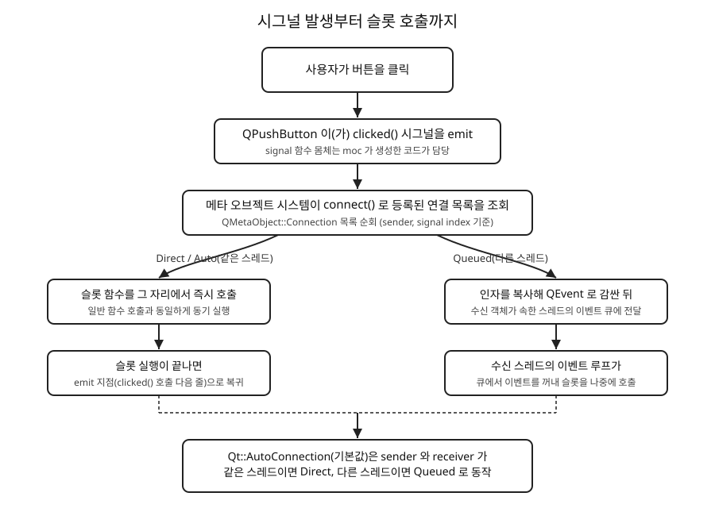

# 3장. 시그널과 슬롯

📖 [◀ 목차](00-목차.md) | [◀ 이전: 2장. 개발 환경 설정과 첫 창](ch02-개발환경설정과첫창.md) | [다음: 4장. 기본 위젯과 레이아웃 시스템 ▶](ch04-기본위젯과레이아웃시스템.md)

---

2장에서 위젯 하나짜리 프로그램을 만들면서, 클래스 선언에 `Q_OBJECT`라는 매크로를 아무 설명 없이 집어넣었습니다. 그리고 버튼을 하나 만들어 놓고도 정작 그 버튼을 눌렀을 때 무슨 일이 일어나게 만들지는 다루지 않았습니다. 이 장에서는 그 두 가지 빈틈을 한꺼번에 채웁니다. `Q_OBJECT`가 실제로 어떤 일을 하는지, 그리고 Qt 프로그램에서 "무언가 일어났다"는 사실을 어떻게 다른 코드에 전달하는지를 시그널(signal)과 슬롯(slot)이라는 Qt 고유의 메커니즘으로 살펴봅니다.

## 왜 시그널과 슬롯이 필요한가

GUI 프로그램은 기본적으로 사용자의 입력을 기다렸다가 반응하는 형태로 동작합니다. 버튼을 클릭하면 무언가 처리되고, 체크박스를 체크하면 다른 위젯이 활성화되고, 슬라이더를 움직이면 숫자가 바뀌는 식입니다. 이런 "이벤트가 발생하면 특정 코드를 실행한다"는 요구는 GUI 툴킷이라면 어떤 형태로든 해결해야 하는 문제입니다.

전통적인 C 스타일 GUI 라이브러리는 이 문제를 콜백 함수 포인터로 해결했습니다. 버튼 객체에 함수 포인터 하나를 등록해 두고, 클릭이 발생하면 그 포인터가 가리키는 함수를 호출하는 방식입니다. 이 방식은 동작하긴 하지만 몇 가지 불편함이 있습니다. 함수 포인터 하나로는 여러 대상에게 동시에 알리기 어렵고, 멤버 함수를 콜백으로 쓰려면 `this` 포인터를 별도로 챙겨야 하며, 인자 타입이 맞지 않아도 컴파일러가 잡아내지 못하는 경우가 많습니다.

Qt는 이 문제를 시그널과 슬롯이라는 자체적인 통신 메커니즘으로 풀어냅니다.

- 시그널(signal)은 "무언가 일어났다"는 사실을 알리는 함수입니다. 버튼의 `clicked()`, 텍스트 입력창의 `textChanged()`가 그 예입니다. 시그널을 발생시키는 쪽은 그 시그널을 누가 듣고 있는지, 몇 명이 듣고 있는지 전혀 알 필요가 없습니다.
- 슬롯(slot)은 시그널에 반응해서 실행되는 함수입니다. 일반적인 멤버 함수와 거의 똑같이 생겼습니다.
- `connect()` 함수는 특정 객체의 시그널을 다른(또는 같은) 객체의 슬롯에 연결합니다. 이 연결은 프로그램 실행 중 언제든 맺거나 끊을 수 있습니다.

이 구조의 핵심은 시그널을 내보내는 쪽(버튼)과 그것을 받아 처리하는 쪽(여러분이 작성하는 슬롯)이 서로의 존재를 전혀 몰라도 된다는 점입니다. `QPushButton` 클래스를 만든 Qt 개발자는 이 버튼이 나중에 어떤 프로그램에서, 어떤 슬롯과 연결될지 전혀 알지 못한 채로 `clicked()` 시그널만 정의해 두었습니다. 반대로 여러분이 작성하는 슬롯도 이 신호를 누가 보내는지 몰라도 됩니다. 이렇게 서로를 몰라도 되는 관계를 느슨한 결합(loose coupling)이라고 부르며, 시그널-슬롯 메커니즘이 주는 가장 큰 이점입니다. 하나의 시그널에 여러 슬롯을 연결할 수도 있고, 여러 시그널을 하나의 슬롯에 연결할 수도 있습니다.

## Q_OBJECT 매크로와 MOC의 역할

시그널과 슬롯이 동작하려면 Qt가 클래스에 대해 몇 가지 추가 정보를 알고 있어야 합니다. 이 클래스에 어떤 시그널과 슬롯이 있는지, 각각의 이름과 매개변수 타입은 무엇인지 같은 정보입니다. 문제는 이것이 표준 C++이 기본으로 제공하는 기능이 아니라는 점입니다. C++은 클래스가 런타임에 자신의 멤버 함수 목록을 스스로 조회하는 기능(리플렉션)을 언어 차원에서 지원하지 않습니다.

Qt는 이 한계를 MOC(Meta-Object Compiler, 메타 오브젝트 컴파일러)라는 자체 도구로 우회합니다. 빌드 과정은 대략 다음과 같은 순서로 진행됩니다.

1. `Q_OBJECT` 매크로가 포함된 헤더 파일을 MOC가 먼저 읽습니다.
2. MOC는 그 헤더 안에서 `signals:`, `slots:`로 표시된 부분과 `Q_OBJECT`, `Q_PROPERTY` 같은 매크로들을 분석합니다.
3. 분석한 정보를 바탕으로 `moc_클래스이름.cpp`라는 새로운 C++ 소스 파일을 생성합니다. 이 파일 안에는 `QMetaObject`라는 클래스의 인스턴스와, 시그널 함수들의 실제 구현, `qt_metacall()`처럼 메타 오브젝트 시스템이 내부적으로 사용하는 함수들이 들어 있습니다.
4. 이렇게 생성된 `moc_클래스이름.cpp`는 여러분이 작성한 다른 소스 파일들과 함께 평범한 C++ 코드로 컴파일되어 최종 실행 파일에 링크됩니다.

즉 MOC는 C++ 언어 자체를 확장하는 것이 아니라, `Q_OBJECT`가 붙은 클래스마다 "이 클래스에는 이런 시그널과 슬롯이 있다"는 사실을 표준 C++ 코드로 미리 풀어써 주는 코드 생성기입니다. 여러분이 헤더에 시그널을 선언만 하고 몸체를 작성하지 않아도 프로그램이 컴파일되고 동작하는 이유도 여기에 있습니다. 시그널 함수의 실제 몸체(그 시그널에 연결된 모든 슬롯을 찾아 호출하는 코드)는 MOC가 생성한 `moc_*.cpp` 파일 안에 들어 있기 때문입니다.

CMake로 Qt 프로젝트를 구성할 때는 보통 다음 설정으로 MOC 실행을 자동화합니다.

```cmake
set(CMAKE_AUTOMOC ON)
```

이 옵션을 켜 두면 `Q_OBJECT`가 포함된 헤더가 바뀔 때마다 CMake가 알아서 MOC를 실행하고 그 결과물을 빌드에 포함시켜 주므로, 개발자가 MOC를 직접 호출할 일은 거의 없습니다.

`Q_OBJECT` 매크로는 시그널·슬롯 기능뿐 아니라 다음과 같은 메타 오브젝트 시스템의 여러 기능을 함께 활성화합니다.

- `qobject_cast<T>()`: `dynamic_cast`와 비슷하게, `QObject` 계층에서 안전한 다운캐스팅을 제공합니다. RTTI(`dynamic_cast`)보다 가볍고, RTTI가 비활성화된 빌드 환경에서도 동작합니다.
- `QObject::metaObject()`, `className()`: 객체의 실제 클래스 이름을 문자열로 얻거나, 상속 관계를 검사할 수 있습니다.
- `Q_PROPERTY`로 선언한 프로퍼티 시스템: Qt Designer나 QML이 객체의 속성을 이름(문자열)으로 읽고 쓸 수 있게 해 줍니다.

이런 이유로 "`QObject`를 상속하면서 시그널이나 슬롯, `Q_PROPERTY`를 하나라도 쓰는 클래스에는 반드시 `Q_OBJECT`를 넣는다"는 규칙을 지켜야 합니다. `Q_OBJECT`를 빠뜨리면 대부분 링커 단계에서 "undefined reference to `vtable for ...`" 같은 알아보기 어려운 오류가 발생하는데, 이는 MOC가 그 클래스에 대한 `moc_*.cpp`를 생성하지 못했기 때문입니다. 처음 Qt를 접할 때 자주 마주치는 오류이니 기억해 두면 원인을 빠르게 짐작할 수 있습니다.

## signals와 public slots 키워드

`Q_OBJECT`가 붙은 클래스 안에서 시그널은 `signals:` 아래에, 슬롯은 `slots:` 아래에 선언합니다. 다음은 값 하나를 감싸고 있는 간단한 `Counter` 클래스입니다.

```cpp
// counter.h
#pragma once
#include <QObject>

class Counter : public QObject
{
    Q_OBJECT

public:
    explicit Counter(QObject *parent = nullptr);

    int value() const { return m_value; }

public slots:
    void setValue(int newValue);
    void increment();

signals:
    void valueChanged(int newValue);

private:
    int m_value = 0;
};
```

```cpp
// counter.cpp
#include "counter.h"

Counter::Counter(QObject *parent)
    : QObject(parent)
{
}

void Counter::setValue(int newValue)
{
    if (m_value == newValue)
        return;

    m_value = newValue;
    emit valueChanged(m_value);
}

void Counter::increment()
{
    setValue(m_value + 1);
}
```

몇 가지 짚어 둘 점이 있습니다.

- 시그널은 선언만 하고 구현(몸체)을 작성하지 않습니다. 시그널의 실제 구현은 MOC가 생성해 주기 때문입니다. `.cpp` 파일에 `void Counter::valueChanged(int) { ... }`를 직접 작성하면 오히려 중복 정의 오류가 납니다.
- 시그널의 반환 타입은 항상 `void`여야 합니다. 시그널은 값을 반환할 방법이 없는 "알림"이기 때문입니다.
- 슬롯은 반환 타입만 `void`가 아니면 되는 것이 아니라, 사실상 평범한 멤버 함수입니다. `setValue`와 `increment`처럼 몸체를 직접 구현합니다.
- `public slots:`, `protected slots:`, `private slots:` 모두 사용할 수 있으며, 각각 일반적인 C++ 접근 지정자와 같은 의미를 가집니다. 다른 클래스에서 직접 호출할 슬롯이라면 `public`, 내부 구현에만 쓰는 슬롯이라면 `private`으로 두는 식입니다.

여기서 한 가지 알아 둘 만한 사실이 있습니다. `signals`와 `slots`는 실제로는 C++ 표준 키워드가 아니라 Qt가 정의한 매크로입니다. `<QObject>` 헤더 안에서 `signals`는 사실상 `public`으로, `slots`는 아무 의미도 없는 빈 매크로로 치환됩니다. 즉 컴파일러 입장에서 `signals:` 아래에 선언된 함수는 그냥 `public:` 아래에 있는 평범한 함수 선언과 다르지 않습니다. 실제로 시그널과 슬롯을 구분하고 특별하게 처리하는 것은 컴파일러가 아니라 MOC입니다. MOC가 헤더를 분석할 때 `signals:`와 `slots:`라는 문자열 자체를 표시로 삼아 "여기부터는 시그널이다", "여기부터는 슬롯이다"라고 인식하는 것입니다.

### Qt6에서는 일반 멤버 함수도 슬롯이 될 수 있다

Qt5부터 도입된(그리고 Qt6에서 일반화된) 함수 포인터 기반 `connect()` 문법을 사용하면, 굳이 `slots:` 섹션 아래에 선언하지 않은 평범한 `public` 멤버 함수도 슬롯처럼 시그널에 연결할 수 있습니다.

```cpp
class Widget : public QWidget
{
    Q_OBJECT
public:
    explicit Widget(QWidget *parent = nullptr);

public:
    void showMessage();  // slots: 에 넣지 않은 평범한 멤버 함수
};
```

```cpp
connect(button, &QPushButton::clicked, widget, &Widget::showMessage);
```

이 코드는 문제없이 컴파일되고 동작합니다. 함수 포인터 문법은 컴파일 타임에 `&Widget::showMessage`라는 멤버 함수 포인터를 직접 사용하므로, 메타 오브젝트 시스템의 문자열 기반 조회 없이도 연결이 가능하기 때문입니다. 그렇다고 해서 `slots:` 섹션이 쓸모없어진 것은 아닙니다. 잠시 뒤에 살펴볼 문자열 기반의 예전 문법(`SIGNAL`/`SLOT` 매크로)이나 Qt Designer의 자동 연결 기능, `QMetaObject::invokeMethod()`로 이름으로 메서드를 호출하는 기능은 여전히 그 함수가 슬롯(또는 `Q_INVOKABLE`)으로 등록되어 있어야 동작합니다. 실무에서는 "이 함수는 시그널에 대한 응답으로 호출되도록 설계되었다"는 의도를 명확히 드러내기 위해 여전히 `public slots:` 섹션에 슬롯을 모아 두는 스타일이 널리 쓰입니다.

## connect() 함수: 시그널과 슬롯 연결하기

시그널과 슬롯을 선언하는 것만으로는 아무 일도 일어나지 않습니다. 둘을 실제로 이어 주는 것은 `QObject::connect()` 함수입니다. Qt는 시간이 지나면서 몇 가지 다른 `connect()` 문법을 제공해 왔습니다.

### 함수 포인터 문법 (Qt5 이상, 권장)

가장 널리 쓰이고 권장되는 방식은 멤버 함수 포인터를 그대로 넘기는 문법입니다.

```cpp
Counter *counter = new Counter(this);
QLabel *label = new QLabel(this);

connect(counter, &Counter::valueChanged, label, [label](int newValue) {
    label->setText(QString::number(newValue));
});
```

방금 예시는 슬롯 자리에 람다를 썼지만, 슬롯 자리에는 다른 객체의 멤버 함수도 그대로 넣을 수 있습니다.

```cpp
connect(counter, &Counter::valueChanged, this, &MainWindow::updateLabel);
```

이 문법의 장점은 명확합니다.

- 컴파일 타임 검사: 시그널과 슬롯의 매개변수 타입이 맞지 않으면 컴파일 오류가 발생합니다. 함수 이름을 오타로 잘못 적어도 즉시 컴파일 오류로 드러납니다.
- IDE 지원: 함수 포인터이므로 IDE의 "정의로 이동", "이름 바꾸기" 같은 리팩터링 기능이 정상적으로 동작합니다.
- 인자 개수를 슬롯 쪽에서 줄일 수 있습니다. 슬롯의 매개변수 개수가 시그널보다 적어도 되며(뒤쪽 인자부터 무시됩니다), 그 반대(슬롯이 시그널보다 인자가 많은 경우)는 허용되지 않습니다.

한 가지 자주 겪는 문제는 오버로드된 시그널을 연결할 때입니다. 예를 들어 Qt5의 `QSpinBox`에는 `valueChanged(int)`와 `valueChanged(const QString &)` 두 가지 오버로드가 있었습니다(Qt6에서는 문자열 버전이 제거되었습니다). 오버로드가 두 개 이상 존재하는 상태에서 `&QSpinBox::valueChanged`만 적으면 컴파일러가 어느 오버로드를 가리키는지 판단하지 못해 오류가 납니다. 이런 경우 `qOverload`(또는 `QOverload<T>::of`)로 원하는 오버로드를 명시적으로 지정합니다.

```cpp
connect(spinBox, qOverload<int>(&QSpinBox::valueChanged),
        this, &MainWindow::onSpinValueChanged);

// 위 코드는 아래와 완전히 동일합니다.
connect(spinBox, QOverload<int>::of(&QSpinBox::valueChanged),
        this, &MainWindow::onSpinValueChanged);
```

### 람다 연결

`connect()`의 슬롯 자리에는 이름 있는 멤버 함수 대신 람다 표현식을 바로 넣을 수도 있습니다. 짧은 처리 로직을 별도의 슬롯 함수로 분리하기 애매할 때 특히 유용합니다.

```cpp
connect(button, &QPushButton::clicked, this, [this]() {
    counter->increment();
});
```

람다를 연결할 때는 되도록 세 번째 인자로 컨텍스트 객체(위 예시의 `this`)를 함께 넘기는 것이 좋습니다. 컨텍스트 객체를 지정해 두면 그 객체가 파괴될 때 이 연결도 Qt가 자동으로 끊어 주기 때문에, 이미 파괴된 객체를 람다 안에서 참조하다가 발생하는 크래시를 예방할 수 있습니다. 컨텍스트 객체 없이 람다만 연결하는 것도 문법적으로는 가능하지만, 람다가 캡처한 객체의 수명 관리를 오롯이 개발자가 책임져야 하므로 권장되지 않습니다.

### SIGNAL/SLOT 매크로 문법 (레거시)

Qt4 시절부터 있었던 예전 방식으로, 문자열 형태로 시그널과 슬롯의 시그니처를 넘깁니다.

```cpp
connect(counter, SIGNAL(valueChanged(int)), label, SLOT(setNum(int)));
```

이 문법은 `SIGNAL()`과 `SLOT()` 매크로가 함수 시그니처를 문자열로 바꾸고, 실제 연결은 런타임에 메타 오브젝트 시스템이 그 문자열과 일치하는 시그널·슬롯을 찾아서 이루어집니다. 그래서 다음과 같은 단점이 있습니다.

- 함수 이름이나 매개변수 타입에 오타가 있어도 컴파일은 성공하고, 실행 중에 "연결에 실패했다"는 경고만 콘솔에 출력됩니다.
- 문자열 안의 공백이나 `int`와 `qint32`처럼 사실상 같은 타입이라도 표기가 다르면 매칭에 실패할 수 있습니다.
- 대상 슬롯은 반드시 `slots:` 섹션 아래에 선언되어 메타 오브젝트에 등록되어 있어야 합니다. 평범한 `public` 멤버 함수는 이 문법으로 연결할 수 없습니다.

이 문법은 지금도 유효하고 여전히 동작하지만, 새로 작성하는 코드에서는 앞서 본 함수 포인터 문법을 사용하는 것이 사실상 표준입니다. 다만 오래된 Qt 코드베이스나 인터넷의 예전 예제에서 여전히 흔하게 보이므로, 읽을 줄은 알아야 합니다.

## 커스텀 시그널 정의와 emit

지금까지의 예제에서 이미 커스텀 시그널을 하나 정의해 보았습니다. 여기서 규칙을 다시 한번 정리합니다.

- 시그널은 클래스 선언의 `signals:` 아래에 함수 원형만 적습니다. 반환 타입은 반드시 `void`입니다.
- 시그널을 실제로 발생시키려면(즉 연결된 모든 슬롯을 호출하려면) `emit` 키워드와 함께 마치 함수를 호출하듯 적습니다.

```cpp
emit valueChanged(m_value);
```

`emit`도 `signals`, `slots`와 마찬가지로 진짜 키워드가 아니라 아무 의미도 없는 빈 매크로로 치환됩니다. 즉 `emit valueChanged(m_value);`는 `valueChanged(m_value);`와 완전히 동일하게 컴파일됩니다. `emit`을 적지 않아도 문법적으로는 문제가 없지만, "이 줄은 평범한 함수 호출이 아니라 시그널을 내보내는 지점"이라는 것을 코드를 읽는 사람에게 알리는 관례로 항상 붙여 주는 것이 좋습니다.

시그널은 클래스 바깥에서 직접 호출하는 것도 문법적으로는 가능합니다(`signals:`가 결국 `public:`으로 치환되기 때문입니다). 하지만 이는 시그널-슬롯 메커니즘의 설계 의도를 벗어나는 사용법이므로 피해야 합니다. 시그널은 항상 그 시그널을 선언한 클래스 내부에서, 상태가 실제로 바뀐 시점에만 `emit`하는 것이 올바른 사용법입니다.

시그널에도 매개변수를 여러 개 둘 수 있고, 기본값을 지정할 수도 있습니다.

```cpp
signals:
    void statusChanged(const QString &message, int code = 0);
```

다만 시그널의 매개변수 타입은 값(값 전달) 또는 `const &`(참조 전달)로 받는 것이 일반적입니다. 슬롯이 큐드 연결(뒤에서 설명합니다)로 호출될 수도 있기 때문에, 인자가 다른 스레드로 복사되어 전달될 수 있다는 점을 염두에 두고 타입을 설계해야 합니다.

## 연결 타입: Auto, Direct, Queued

`connect()`는 다섯 번째(마지막) 인자로 연결 타입을 받을 수 있습니다. 지금까지의 예제는 모두 이 인자를 생략했고, 그 경우 기본값인 `Qt::AutoConnection`이 사용됩니다.

```cpp
connect(sender, &Sender::signalName, receiver, &Receiver::slotName,
        Qt::AutoConnection);
```

`Qt::ConnectionType` 열거형에는 다음과 같은 값들이 있습니다.

- **`Qt::AutoConnection`** (기본값): sender와 receiver가 같은 스레드에 있으면 `Qt::DirectConnection`처럼, 서로 다른 스레드에 있으면 `Qt::QueuedConnection`처럼 동작합니다. 대부분의 GUI 프로그램은 모든 위젯이 메인(GUI) 스레드에서 살아가므로, 이 기본값만으로 충분한 경우가 대부분입니다.
- **`Qt::DirectConnection`**: 시그널이 `emit`되는 그 자리에서, 그 스레드에서 슬롯을 즉시 호출합니다. 일반적인 함수 호출과 동일하게 동작하며, 슬롯이 끝나야 `emit` 다음 코드가 실행됩니다.
- **`Qt::QueuedConnection`**: 슬롯을 즉시 호출하지 않고, 인자들을 복사해 이벤트로 감싼 뒤 수신 객체가 속한 스레드의 이벤트 큐에 넣습니다. 그 스레드의 이벤트 루프가 나중에 이 이벤트를 꺼내 슬롯을 실행합니다. 다른 스레드에서 만들어진 객체와 안전하게 통신할 때 주로 사용합니다.
- **`Qt::BlockingQueuedConnection`**: `QueuedConnection`과 비슷하게 수신 스레드의 이벤트 큐를 사용하지만, 그 슬롯의 실행이 끝날 때까지 emit한 스레드가 멈춰서 기다립니다. sender와 receiver가 같은 스레드인 상태로 사용하면 두 스레드가 서로를 기다리는 교착 상태(deadlock)에 빠지므로 절대 사용해서는 안 됩니다.
- **`Qt::UniqueConnection`**: 단독으로 쓰이지 않고 다른 값과 비트 OR로 함께 지정하는 플래그입니다(예: `Qt::AutoConnection | Qt::UniqueConnection`). 동일한 sender-signal-receiver-slot 조합이 이미 연결되어 있다면 중복 연결을 만들지 않습니다.

지금 단계에서 꼭 기억해야 할 것은 이 정도입니다. "같은 스레드 안에서 시그널-슬롯을 쓸 때는 신경 쓰지 않아도 `Qt::AutoConnection`이 알아서 즉시 호출(Direct)처럼 동작하고, 서로 다른 스레드에 있는 객체끼리 통신할 때는 자동으로 이벤트 큐를 통한 안전한 전달(Queued)로 바뀐다." 스레드 간 통신을 본격적으로 다루는 뒤 장에서 `Qt::QueuedConnection`을 명시적으로 지정해야 하는 상황을 더 자세히 살펴봅니다.

다음 그림은 시그널이 `emit`된 순간부터 슬롯이 호출되기까지의 흐름을, 연결 타입에 따라 갈라지는 경로와 함께 정리한 것입니다.



## 예제: 버튼 클릭 시그널을 커스텀 슬롯에 연결하기

지금까지 배운 내용을 하나로 묶어, 버튼을 누를 때마다 숫자가 하나씩 올라가는 위젯을 만들어 보겠습니다. 앞서 정의한 `Counter` 클래스를 그대로 사용합니다.

```cpp
// clickcounterwidget.h
#pragma once
#include <QWidget>

class QPushButton;
class QLabel;
class Counter;

class ClickCounterWidget : public QWidget
{
    Q_OBJECT

public:
    explicit ClickCounterWidget(QWidget *parent = nullptr);

private slots:
    void onCountChanged(int newValue);

private:
    QPushButton *m_button;
    QLabel *m_label;
    Counter *m_counter;
};
```

```cpp
// clickcounterwidget.cpp
#include "clickcounterwidget.h"
#include "counter.h"

#include <QPushButton>
#include <QLabel>
#include <QVBoxLayout>

ClickCounterWidget::ClickCounterWidget(QWidget *parent)
    : QWidget(parent)
    , m_button(new QPushButton("클릭하세요", this))
    , m_label(new QLabel("클릭 횟수: 0", this))
    , m_counter(new Counter(this))
{
    auto *layout = new QVBoxLayout(this);
    layout->addWidget(m_label);
    layout->addWidget(m_button);

    // 1) 버튼 클릭 -> Counter::increment() (함수 포인터 문법)
    connect(m_button, &QPushButton::clicked, m_counter, &Counter::increment);

    // 2) Counter의 값이 바뀜 -> 이 위젯의 슬롯에서 라벨 갱신
    connect(m_counter, &Counter::valueChanged, this, &ClickCounterWidget::onCountChanged);
}

void ClickCounterWidget::onCountChanged(int newValue)
{
    m_label->setText(QString("클릭 횟수: %1").arg(newValue));
}
```

```cpp
// main.cpp
#include <QApplication>
#include "clickcounterwidget.h"

int main(int argc, char *argv[])
{
    QApplication app(argc, argv);

    ClickCounterWidget widget;
    widget.setWindowTitle("시그널과 슬롯 예제");
    widget.resize(240, 120);
    widget.show();

    return app.exec();
}
```

이 예제에서 시그널-슬롯의 흐름을 짚어 보면 다음과 같습니다.

1. 사용자가 버튼을 클릭하면 `QPushButton`이 `clicked()` 시그널을 `emit`합니다.
2. 이 시그널에 연결된 `Counter::increment()` 슬롯이 호출됩니다.
3. `increment()`는 내부적으로 `setValue()`를 호출하고, 값이 실제로 바뀌었으므로 `setValue()`가 `valueChanged(m_value)`를 `emit`합니다.
4. 이 시그널에 연결된 `ClickCounterWidget::onCountChanged()` 슬롯이 호출되어 라벨 텍스트를 갱신합니다.

`ClickCounterWidget`은 `Counter`가 내부적으로 어떻게 값을 저장하고 계산하는지 전혀 알 필요가 없고, `Counter`도 자신의 값이 바뀌었을 때 그것이 라벨에 표시될지, 콘솔에 출력될지, 아니면 아무도 듣고 있지 않을지 전혀 알지 못합니다. 이렇게 서로 독립적으로 동작하면서도 필요한 순간에만 느슨하게 이어지는 것이 시그널-슬롯 메커니즘이 지향하는 설계입니다.

## 요약

- 시그널과 슬롯은 Qt가 객체 간 통신을 위해 제공하는 메커니즘으로, 콜백 함수 포인터 방식보다 유연하고 안전하며, sender와 receiver가 서로의 존재를 몰라도 되는 느슨한 결합을 가능하게 합니다.
- `Q_OBJECT` 매크로가 붙은 클래스는 빌드 시 MOC(메타 오브젝트 컴파일러)에 의해 분석되어 `moc_*.cpp` 파일이 생성되며, 이 파일이 시그널의 실제 구현과 메타 오브젝트 정보를 담습니다. CMake에서는 `CMAKE_AUTOMOC ON`으로 이 과정을 자동화합니다.
- `signals:`와 `slots:`는 실제 C++ 키워드가 아니라 매크로이며, 시그널은 몸체 없이 선언만 하고 반환 타입은 항상 `void`여야 합니다. Qt5 이상의 함수 포인터 연결 문법에서는 `slots:` 섹션 밖의 평범한 멤버 함수도 슬롯으로 연결할 수 있습니다.
- `connect()`는 함수 포인터 문법(권장, 컴파일 타임 검사), 람다 연결(컨텍스트 객체를 함께 지정하는 것이 안전), `SIGNAL()`/`SLOT()` 매크로를 쓰는 예전 문자열 문법(레거시, 런타임 검사) 세 가지로 시그널과 슬롯을 이을 수 있습니다.
- 커스텀 시그널은 `signals:` 아래에 선언하고, 상태가 바뀐 시점에 `emit 시그널이름(인자)`로 발생시킵니다.
- 연결 타입은 `Qt::AutoConnection`(기본, 같은 스레드면 즉시 호출·다른 스레드면 큐잉), `Qt::DirectConnection`(즉시 호출), `Qt::QueuedConnection`(이벤트 큐를 통한 지연 호출), `Qt::BlockingQueuedConnection`(호출부가 블로킹) 등이 있으며, 대부분의 단일 스레드 GUI 코드는 기본값만으로 충분합니다.

## 연습문제

1. `Q_OBJECT` 매크로를 빠뜨린 채로 시그널을 선언한 `QObject` 파생 클래스를 빌드하면 어떤 종류의 오류가 발생하는지, 그리고 그 원인이 무엇인지 MOC의 역할과 연결 지어 설명해 보세요.
2. 함수 포인터 문법의 `connect()`가 `SIGNAL()`/`SLOT()` 매크로를 쓰는 예전 문법보다 나은 점 두 가지를 구체적인 예와 함께 설명해 보세요.
3. `QCheckBox`의 `toggled(bool)` 시그널을 `QLabel`의 `setEnabled(bool)`가 아니라, 체크 여부에 따라 서로 다른 문자열을 라벨에 표시하는 람다 슬롯에 연결하는 코드를 작성해 보세요. 컨텍스트 객체도 함께 지정하세요.
4. 시그널의 몸체를 개발자가 직접 작성하지 않는데도 프로그램이 정상적으로 링크되고 동작하는 이유를 MOC와 `moc_*.cpp` 파일의 관계로 설명해 보세요.
5. `Qt::BlockingQueuedConnection`을 sender와 receiver가 같은 스레드인 상태에서 사용하면 안 되는 이유를 설명하고, 어떤 상황에서 이 연결 타입이 적절하게 쓰일 수 있을지 추론해 보세요.


---

📖 [◀ 목차](00-목차.md) | [◀ 이전: 2장. 개발 환경 설정과 첫 창](ch02-개발환경설정과첫창.md) | [다음: 4장. 기본 위젯과 레이아웃 시스템 ▶](ch04-기본위젯과레이아웃시스템.md)
