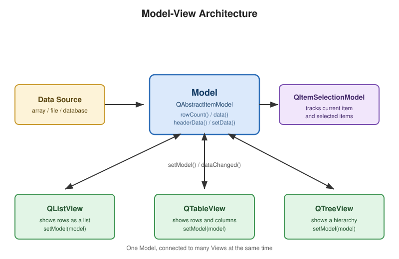

# 7장. 모델/뷰 프로그래밍

📖 [◀ 목차](00-목차.md) | [◀ 이전: 6장. 다이얼로그와 표준 다이얼로그](ch06-다이얼로그와표준다이얼로그.md) | [다음: 8장. 커스텀 위젯과 페인트 이벤트 ▶](ch08-커스텀위젯과페인트이벤트.md)

---

지금까지 만든 화면들은 버튼, 레이블, 입력창처럼 값이 하나뿐인 위젯 위주였다. 하지만 실제 프로그램은 목록, 표, 트리처럼 **여러 건의 데이터를 한꺼번에 보여주는 화면**을 훨씬 자주 다룬다. 파일 탐색기의 폴더 트리, 주소록의 연락처 목록, 스프레드시트 같은 표 형태의 데이터가 전부 여기에 해당한다.

Qt는 이런 다건 데이터를 다루기 위해 두 가지 방법을 제공한다. 하나는 `QListWidget`, `QTableWidget`, `QTreeWidget`처럼 위젯 스스로 데이터 항목을 들고 있는 **아이템 기반 위젯**이고, 다른 하나는 데이터를 담는 역할과 그 데이터를 화면에 그리는 역할을 아예 분리해버린 **모델/뷰(Model/View) 아키텍처**다. 이번 장에서는 두 방식을 순서대로 살펴보면서, 왜 Qt가 후자를 "진짜" 권장 방식으로 밀고 있는지 이해해본다.

## 7.1 Model/View 아키텍처의 철학

전통적인 위젯 라이브러리에서 목록을 보여주는 가장 단순한 방법은, 위젯 안에 항목을 직접 채워 넣는 것이다. `addItem("사과")`처럼 위젯을 호출해서 문자열을 하나씩 넣으면, 위젯 내부에 그 데이터가 저장되고 동시에 화면에도 표시된다. 이 방식은 이해하기 쉽지만 한 가지 구조적인 문제가 있다. **데이터와 그 표시 방식이 하나의 객체 안에 뒤섞여 있다**는 점이다.

만약 같은 데이터를 목록으로도 보여주고 표로도 보여주고 싶다면 어떻게 해야 할까? 아이템 기반 위젯으로는 두 위젯에 데이터를 각각 따로 채워 넣어야 하고, 데이터가 하나라도 바뀌면 두 위젯을 모두 손으로 갱신해줘야 한다. 데이터를 보여주는 창구가 늘어날수록 동기화해야 할 곳도 함께 늘어난다.

Qt의 모델/뷰 아키텍처는 이 문제를 다음과 같은 방식으로 해결한다.

- **모델(Model)**: 실제 데이터를 보관하고, "몇 행 몇 열에 어떤 값이 있는지" 질문에 답하는 역할만 담당한다. 데이터가 배열이든, 데이터베이스든, 파일이든 모델 내부 구현은 자유다.
- **뷰(View)**: 모델에게 데이터를 물어보고, 그 결과를 화면에 그리는 역할만 담당한다. 뷰 자신은 데이터를 소유하지 않는다.
- **델리게이트(Delegate)**: 각 항목을 실제로 어떻게 그리고, 편집할 때 어떤 입력 위젯을 보여줄지 담당한다. 뷰가 기본으로 제공하는 델리게이트만으로도 웬만한 화면은 충분하며, 커스텀 델리게이트는 이후 장에서 다룬다.

이 구조의 핵심 이점은 **하나의 모델에 여러 개의 뷰를 동시에 연결할 수 있다**는 것이다. 모델의 데이터가 바뀌면 신호(signal)를 통해 연결된 모든 뷰에 "다시 그려라"라고 알리고, 각 뷰는 자기 방식대로(목록으로, 표로, 트리로) 최신 데이터를 다시 그린다. 아래 그림은 이 구조를 나타낸다.



이 아키텍처는 MVC(Model-View-Controller) 패턴과 자주 비교되는데, Qt의 모델/뷰는 컨트롤러 역할을 뷰와 델리게이트가 나눠서 흡수한 변형이라고 볼 수 있다. 정확한 명칭 논쟁보다 중요한 것은 "데이터를 보관하는 코드"와 "데이터를 그리는 코드"를 분리해두면 재사용성과 유지보수성이 크게 좋아진다는 실용적인 이유다.

## 7.2 아이템 기반 위젯: QListWidget, QTableWidget, QTreeWidget

모델/뷰의 장점을 설명했지만, 항목이 몇십 개 수준인 작은 목록이나 설정 화면처럼 구조가 단순한 곳에서는 아이템 기반 위젯을 쓰는 편이 오히려 코드가 짧고 직관적이다. Qt는 이런 상황을 위해 `QListWidget`, `QTableWidget`, `QTreeWidget` 세 가지를 제공한다. 셋 다 내부적으로는 `QStandardItemModel`을 감춰서 사용하고 있지만, 겉으로 드러나는 API는 "항목을 직접 추가/조회"하는 방식이라 모델 개념을 몰라도 사용할 수 있다.

### QListWidget

`QListWidget`은 문자열(또는 아이콘이 붙은 항목)의 세로 목록을 보여준다.

```cpp
#include <QListWidget>

QListWidget *listWidget = new QListWidget(this);
listWidget->addItem(QStringLiteral("사과"));
listWidget->addItem(QStringLiteral("바나나"));
listWidget->addItem(QStringLiteral("체리"));

connect(listWidget, &QListWidget::currentTextChanged,
        this, [](const QString &text) {
            qDebug() << "선택된 과일:" << text;
        });
```

`addItem()`은 내부적으로 `QListWidgetItem`을 하나 만들어 목록 끝에 추가한다. 항목에 아이콘이나 사용자 데이터를 함께 담고 싶다면 `QListWidgetItem`을 직접 만들어 `setIcon()`, `setData()`를 호출한 뒤 `addItem()`에 넘기면 된다.

```cpp
QListWidgetItem *item = new QListWidgetItem(QIcon(":/icons/fruit.png"),
                                             QStringLiteral("사과"));
item->setData(Qt::UserRole, 1000); // 항목에 임의의 값(예: 가격)을 붙여둘 수 있다
listWidget->addItem(item);
```

### QTableWidget

`QTableWidget`은 행과 열로 구성된 표를 보여준다. 행/열 개수를 먼저 정하고, 각 칸에 `QTableWidgetItem`을 채워 넣는 방식으로 사용한다.

```cpp
#include <QTableWidget>

QTableWidget *tableWidget = new QTableWidget(3, 2, this); // 3행 2열
tableWidget->setHorizontalHeaderLabels({QStringLiteral("이름"), QStringLiteral("점수")});

tableWidget->setItem(0, 0, new QTableWidgetItem(QStringLiteral("홍길동")));
tableWidget->setItem(0, 1, new QTableWidgetItem(QStringLiteral("95")));

tableWidget->setItem(1, 0, new QTableWidgetItem(QStringLiteral("김철수")));
tableWidget->setItem(1, 1, new QTableWidgetItem(QStringLiteral("88")));
```

칸의 값을 읽어올 때는 `item(row, column)`으로 `QTableWidgetItem` 포인터를 얻은 뒤 `text()`를 호출한다. 아직 아이템을 넣지 않은 칸은 `item()`이 `nullptr`을 반환하므로 반드시 확인 후 사용해야 한다.

```cpp
QTableWidgetItem *cell = tableWidget->item(0, 1);
if (cell) {
    qDebug() << "점수:" << cell->text();
}
```

### QTreeWidget

`QTreeWidget`은 계층 구조를 갖는 데이터, 예를 들어 폴더와 파일처럼 부모-자식 관계가 있는 데이터를 트리 형태로 보여준다.

```cpp
#include <QTreeWidget>

QTreeWidget *treeWidget = new QTreeWidget(this);
treeWidget->setHeaderLabels({QStringLiteral("이름"), QStringLiteral("종류")});

QTreeWidgetItem *fruitRoot = new QTreeWidgetItem(treeWidget,
    QStringList{QStringLiteral("과일"), QStringLiteral("분류")});

QTreeWidgetItem *apple = new QTreeWidgetItem(fruitRoot,
    QStringList{QStringLiteral("사과"), QStringLiteral("품목")});
QTreeWidgetItem *banana = new QTreeWidgetItem(fruitRoot,
    QStringList{QStringLiteral("바나나"), QStringLiteral("품목")});

treeWidget->addTopLevelItem(fruitRoot);
treeWidget->expandAll();
```

`QTreeWidgetItem`의 생성자에 부모 항목을 넘기면 자동으로 그 부모의 자식으로 등록된다. 최상위 항목들은 `addTopLevelItem()`으로 트리 위젯에 직접 등록해야 한다.

## 7.3 아이템 기반 위젯의 한계

세 위젯 모두 사용하기 편하지만, 데이터 양이 많아지거나 요구사항이 복잡해지면 아래와 같은 문제에 부딪힌다.

1. **메모리 낭비**: `QTableWidgetItem`, `QListWidgetItem` 하나하나가 별도의 객체다. 수만 건의 데이터를 담으면 그만큼 객체가 생성되어 메모리를 많이 사용한다.
2. **데이터 중복**: 이미 `QVector<Employee>`처럼 도메인 데이터 구조가 있는데, 화면에 보여주려고 그 값을 다시 `QTableWidgetItem` 문자열로 복사해 넣어야 한다. 원본 데이터가 바뀌면 위젯 쪽도 일일이 다시 채워야 동기화된다.
3. **다중 뷰 불가**: 같은 데이터를 목록과 표 두 곳에 동시에 보여주려면 앞서 설명한 대로 두 위젯에 데이터를 중복해서 넣어야 한다.
4. **대용량 데이터의 성능**: 수십만 행을 보여줘야 하는 경우, 모든 값을 미리 아이템 객체로 만들어두는 방식은 느리고 메모리도 많이 든다. 모델/뷰 아키텍처는 뷰에 보이는 부분만 필요할 때 `data()`를 호출해 값을 얻어오므로 이런 상황에 훨씬 유리하다.

이런 이유로 Qt 공식 문서도 데이터 양이 많거나 여러 뷰에서 같은 데이터를 공유해야 하는 상황이라면 아이템 기반 위젯 대신 모델/뷰 클래스(`QListView`, `QTableView`, `QTreeView`와 그에 연결하는 모델)를 사용하라고 권장한다. 다음 절부터는 직접 모델을 만들어보자.

## 7.4 커스텀 리스트 모델: QAbstractListModel

`QAbstractListModel`은 1차원(행만 있는) 데이터를 다루는 모델을 만들 때 상속받는 추상 클래스다. 최소한으로 오버라이드해야 하는 함수는 `rowCount()`와 `data()`이며, 헤더 텍스트를 보여주고 싶다면 `headerData()`도 함께 오버라이드한다.

아래 예제는 할 일 목록을 관리하는 `TaskListModel`이다.

```cpp
#include <QAbstractListModel>
#include <QVector>
#include <QString>

class TaskListModel : public QAbstractListModel
{
    Q_OBJECT
public:
    explicit TaskListModel(QObject *parent = nullptr);

    int rowCount(const QModelIndex &parent = QModelIndex()) const override;
    QVariant data(const QModelIndex &index, int role = Qt::DisplayRole) const override;
    QVariant headerData(int section, Qt::Orientation orientation,
                         int role = Qt::DisplayRole) const override;
    bool setData(const QModelIndex &index, const QVariant &value,
                 int role = Qt::EditRole) override;
    Qt::ItemFlags flags(const QModelIndex &index) const override;

    void addTask(const QString &text);

private:
    QVector<QString> m_tasks;
};
```

각 함수의 역할을 하나씩 살펴보자.

```cpp
TaskListModel::TaskListModel(QObject *parent)
    : QAbstractListModel(parent)
{
}

int TaskListModel::rowCount(const QModelIndex &parent) const
{
    if (parent.isValid())
        return 0; // 리스트 모델은 계층이 없으므로 부모가 있는 인덱스는 자식이 0개다

    return m_tasks.size();
}

QVariant TaskListModel::data(const QModelIndex &index, int role) const
{
    if (!index.isValid() || index.row() < 0 || index.row() >= m_tasks.size())
        return QVariant();

    if (role == Qt::DisplayRole || role == Qt::EditRole)
        return m_tasks.at(index.row());

    return QVariant();
}

QVariant TaskListModel::headerData(int section, Qt::Orientation orientation, int role) const
{
    if (role != Qt::DisplayRole)
        return QVariant();

    if (orientation == Qt::Horizontal)
        return QStringLiteral("할 일");

    return section + 1; // 세로 헤더에는 1부터 시작하는 행 번호를 보여준다
}
```

`rowCount()`와 `data()`가 핵심이다. 뷰는 화면에 무엇을 그려야 할지 결정하기 위해, 우선 `rowCount()`를 호출해 몇 행이 있는지 알아낸 다음, 화면에 보이는 각 행에 대해 `data(index, Qt::DisplayRole)`을 호출해 실제로 그릴 값을 얻는다. `role` 매개변수가 낯설 수 있는데, 같은 인덱스라도 "화면에 표시할 문자열"(`Qt::DisplayRole`), "편집할 때 보여줄 값"(`Qt::EditRole`), "글자 색"(`Qt::ForegroundRole`) 등 용도별로 다른 값을 돌려줄 수 있게 해주는 열거형이다. 이 장에서는 `Qt::DisplayRole`과 `Qt::EditRole` 두 가지만 사용한다.

`index.isValid()` 검사를 빼먹으면 안 된다. 뷰나 다른 코드가 잘못된(비어 있는) `QModelIndex`로 `data()`를 호출할 수 있고, 이때 유효성 검사 없이 `m_tasks.at(index.row())`를 호출하면 프로그램이 곧바로 크래시한다.

목록을 편집 가능하게 만들려면 `setData()`와 `flags()`도 구현해야 한다.

```cpp
bool TaskListModel::setData(const QModelIndex &index, const QVariant &value, int role)
{
    if (!index.isValid() || role != Qt::EditRole)
        return false;

    m_tasks[index.row()] = value.toString();
    emit dataChanged(index, index, {role});
    return true;
}

Qt::ItemFlags TaskListModel::flags(const QModelIndex &index) const
{
    if (!index.isValid())
        return Qt::NoItemFlags;

    return Qt::ItemIsEnabled | Qt::ItemIsSelectable | Qt::ItemIsEditable;
}
```

`setData()`가 값을 실제로 바꾼 뒤에는 반드시 `dataChanged()` 신호를 발생시켜야 한다. 이 신호가 있어야 연결된 뷰들이 "이 범위의 셀이 바뀌었으니 다시 그려라"라는 것을 알 수 있다. `flags()`는 각 항목이 선택 가능한지, 편집 가능한지, 활성화되어 있는지를 비트 플래그로 알려준다. `Qt::ItemIsEditable`을 빼면 뷰가 더블클릭해도 편집 모드로 들어가지 않는다.

마지막으로 목록에 새 항목을 추가하는 함수를 보자.

```cpp
void TaskListModel::addTask(const QString &text)
{
    const int newRow = m_tasks.size();
    beginInsertRows(QModelIndex(), newRow, newRow);
    m_tasks.append(text);
    endInsertRows();
}
```

행을 추가하거나 삭제할 때는 실제 데이터를 바꾸기 **전에** `beginInsertRows()`(또는 `beginRemoveRows()`)를 호출하고, 데이터를 바꾼 **후에** `endInsertRows()`(또는 `endRemoveRows()`)를 호출해야 한다. 이 쌍을 지키지 않으면 뷰가 내부적으로 관리하는 선택 상태나 스크롤 위치가 실제 데이터와 어긋나 버린다. 두 함수 사이에서 뷰는 "몇 번째 행부터 몇 번째 행까지 새로 생긴다(또는 사라진다)"는 정보를 미리 통지받아 대비할 수 있다.

## 7.5 커스텀 테이블 모델: QAbstractTableModel

`QAbstractTableModel`은 행과 열이 모두 있는 2차원 데이터를 다룰 때 사용한다. `QAbstractListModel`과 거의 같은 방식이지만 `columnCount()`를 추가로 오버라이드해야 하고, `data()`와 `headerData()` 안에서 `index.column()`(또는 `section`)에 따라 다른 값을 돌려줘야 한다.

```cpp
#include <QAbstractTableModel>
#include <QVector>
#include <QString>

class EmployeeTableModel : public QAbstractTableModel
{
    Q_OBJECT
public:
    struct Employee
    {
        QString name;
        int age = 0;
        QString department;
    };

    explicit EmployeeTableModel(QObject *parent = nullptr);

    int rowCount(const QModelIndex &parent = QModelIndex()) const override;
    int columnCount(const QModelIndex &parent = QModelIndex()) const override;
    QVariant data(const QModelIndex &index, int role = Qt::DisplayRole) const override;
    QVariant headerData(int section, Qt::Orientation orientation,
                         int role = Qt::DisplayRole) const override;

    void addEmployee(const Employee &employee);

private:
    QVector<Employee> m_employees;
};
```

```cpp
EmployeeTableModel::EmployeeTableModel(QObject *parent)
    : QAbstractTableModel(parent)
{
}

int EmployeeTableModel::rowCount(const QModelIndex &parent) const
{
    if (parent.isValid())
        return 0;

    return m_employees.size();
}

int EmployeeTableModel::columnCount(const QModelIndex &parent) const
{
    if (parent.isValid())
        return 0;

    return 3; // 이름, 나이, 부서
}

QVariant EmployeeTableModel::data(const QModelIndex &index, int role) const
{
    if (!index.isValid() || index.row() >= m_employees.size())
        return QVariant();

    if (role != Qt::DisplayRole)
        return QVariant();

    const Employee &employee = m_employees.at(index.row());
    switch (index.column()) {
    case 0: return employee.name;
    case 1: return employee.age;
    case 2: return employee.department;
    default: return QVariant();
    }
}

QVariant EmployeeTableModel::headerData(int section, Qt::Orientation orientation, int role) const
{
    if (role != Qt::DisplayRole)
        return QVariant();

    if (orientation == Qt::Horizontal) {
        switch (section) {
        case 0: return QStringLiteral("이름");
        case 1: return QStringLiteral("나이");
        case 2: return QStringLiteral("부서");
        default: return QVariant();
        }
    }

    return section + 1;
}

void EmployeeTableModel::addEmployee(const Employee &employee)
{
    const int newRow = m_employees.size();
    beginInsertRows(QModelIndex(), newRow, newRow);
    m_employees.append(employee);
    endInsertRows();
}
```

패턴은 리스트 모델과 완전히 같다. 달라지는 부분은 오직 "몇 열이 있는가"(`columnCount()`)와 "각 열이 어떤 데이터에 대응하는가"(`data()`의 `switch`문)뿐이다. 이처럼 모델의 내부 저장 방식(여기서는 `QVector<Employee>`)은 `QAbstractTableModel`이 요구하는 인터페이스와 완전히 무관하다는 점이 핵심이다. 데이터를 배열 대신 데이터베이스 쿼리 결과나 네트워크 응답으로 바꿔도, `data()`와 `rowCount()`의 구현만 바꾸면 되고 뷰 쪽 코드는 전혀 손댈 필요가 없다.

## 7.6 뷰에 모델 연결하기: QListView와 QTableView

모델을 다 만들었다면 이제 뷰에 연결할 차례다. 뷰는 `setModel()` 함수 하나로 모델과 연결된다.

```cpp
#include <QListView>

TaskListModel *taskModel = new TaskListModel(this);
taskModel->addTask(QStringLiteral("장보기"));
taskModel->addTask(QStringLiteral("Qt 공부하기"));

QListView *listView = new QListView(this);
listView->setModel(taskModel);
```

```cpp
#include <QTableView>

EmployeeTableModel *employeeModel = new EmployeeTableModel(this);
employeeModel->addEmployee({QStringLiteral("홍길동"), 32, QStringLiteral("개발팀")});
employeeModel->addEmployee({QStringLiteral("김철수"), 28, QStringLiteral("디자인팀")});

QTableView *tableView = new QTableView(this);
tableView->setModel(employeeModel);
tableView->resizeColumnsToContents();
```

`setModel()`을 호출하는 순간부터 뷰는 모델의 `rowCount()`, `columnCount()`, `data()`, `headerData()`를 호출해 화면을 그리기 시작한다. 뷰는 데이터를 복사해두지 않는다. 스크롤하거나 창 크기가 바뀔 때마다 새로 보여야 할 범위에 대해 다시 `data()`를 호출한다. 그래서 모델의 데이터가 바뀌었을 때 `dataChanged()`, `beginInsertRows()`/`endInsertRows()` 같은 신호만 정확히 보내주면, 뷰는 알아서 화면을 최신 상태로 유지한다.

같은 모델을 두 번째 뷰에도 그대로 연결할 수 있다.

```cpp
QListView *secondListView = new QListView(this);
secondListView->setModel(taskModel); // 첫 번째 뷰와 같은 모델을 공유한다

taskModel->addTask(QStringLiteral("코드 리뷰")); // 두 뷰 모두 자동으로 갱신된다
```

이것이 바로 7.1절에서 이야기한 "하나의 모델, 여러 뷰"의 실제 동작이다. `QTreeView`도 원리는 동일하다. 다만 트리는 부모-자식 관계가 있는 데이터를 다뤄야 하므로, `QAbstractItemModel`의 `index()`, `parent()` 함수까지 구현해야 하는 좀 더 복잡한 모델이 필요하다. 이 부분은 계층형 데이터를 본격적으로 다루는 이후 장에서 별도로 살펴본다.

## 7.7 QStandardItemModel로 빠르게 만들기

매번 `QAbstractListModel`이나 `QAbstractTableModel`을 상속받아 클래스를 새로 작성하는 일이 번거로울 때도 있다. 프로토타입을 빠르게 만들거나, 데이터 구조가 단순해서 커스텀 모델까지 만들 필요가 없을 때는 Qt가 기본 제공하는 `QStandardItemModel`을 사용하면 편리하다. `QStandardItemModel`은 `QAbstractItemModel`을 이미 구현해둔 범용 모델로, 값을 `QStandardItem` 객체 형태로 담아 관리한다.

```cpp
#include <QStandardItemModel>
#include <QStandardItem>
#include <QTableView>

QStandardItemModel *model = new QStandardItemModel(0, 2, this); // 0행 2열로 시작
model->setHorizontalHeaderLabels({QStringLiteral("이름"), QStringLiteral("점수")});

model->appendRow({new QStandardItem(QStringLiteral("홍길동")),
                   new QStandardItem(QStringLiteral("95"))});
model->appendRow({new QStandardItem(QStringLiteral("김철수")),
                   new QStandardItem(QStringLiteral("88"))});

QTableView *view = new QTableView(this);
view->setModel(model);
```

`appendRow()`에 `QStandardItem` 포인터로 이루어진 리스트를 넘기면 한 행이 통째로 추가된다. 특정 칸의 값을 나중에 바꾸고 싶다면 `item(row, column)`으로 `QStandardItem`을 얻어 `setText()`를 호출하면 된다.

```cpp
if (QStandardItem *cell = model->item(0, 1))
    cell->setText(QStringLiteral("97"));
```

`QStandardItemModel`은 `QListWidget`, `QTableWidget`, `QTreeWidget`이 내부적으로 사용하는 모델과 사실상 같은 것이다. 즉 아이템 기반 위젯의 편리함과 진짜 모델/뷰 아키텍처의 다중 뷰 지원을 동시에 누릴 수 있는 절충안이라고 볼 수 있다. 다만 대용량 데이터나 이미 존재하는 도메인 객체를 그대로 활용하고 싶은 경우에는, 데이터를 다시 `QStandardItem`으로 복사해야 하므로 여전히 7.3절에서 언급한 "데이터 중복" 문제가 남는다. 그래서 실무에서는 "간단하면 `QStandardItemModel`, 데이터가 이미 정해진 구조를 갖고 있거나 규모가 크면 커스텀 모델"이라는 기준으로 선택하는 경우가 많다.

## 7.8 선택 상태 다루기: QItemSelectionModel

뷰에서 사용자가 어떤 행이나 셀을 선택했는지 알아내려면 `QItemSelectionModel`을 사용한다. 뷰가 `setModel()`로 모델과 연결되면, Qt는 자동으로 그 뷰 전용 `QItemSelectionModel` 인스턴스를 하나 만들어준다. `selectionModel()`로 이 객체를 얻을 수 있다.

```cpp
QItemSelectionModel *selectionModel = tableView->selectionModel();

connect(selectionModel, &QItemSelectionModel::currentChanged,
        this, [](const QModelIndex &current, const QModelIndex &previous) {
            Q_UNUSED(previous);
            if (current.isValid())
                qDebug() << "현재 선택된 행:" << current.row();
        });
```

여러 항목을 한 번에 선택할 수 있게 하려면 뷰의 선택 모드를 먼저 설정한다.

```cpp
tableView->setSelectionMode(QAbstractItemView::ExtendedSelection);
tableView->setSelectionBehavior(QAbstractItemView::SelectRows);
```

`setSelectionBehavior(QAbstractItemView::SelectRows)`는 사용자가 셀 하나를 클릭해도 그 행 전체가 선택되도록 만든다. 이 상태에서 선택된 행들의 목록은 `selectionChanged()` 신호나 `selectedIndexes()`로 얻을 수 있다.

```cpp
connect(selectionModel, &QItemSelectionModel::selectionChanged,
        this, [](const QItemSelection &selected, const QItemSelection &deselected) {
            Q_UNUSED(deselected);
            for (const QModelIndex &index : selected.indexes())
                qDebug() << "새로 선택됨: 행" << index.row() << "열" << index.column();
        });

// 언제든 현재 선택 상태를 조회할 수도 있다
const QModelIndexList selectedRows = tableView->selectionModel()->selectedRows();
qDebug() << "선택된 행 개수:" << selectedRows.size();
```

`currentChanged`는 "현재 포커스를 가진 항목(커런트 아이템)"이 바뀔 때, `selectionChanged`는 "선택된 항목 집합"이 바뀔 때 발생한다는 차이를 기억해두자. 단일 선택 모드에서는 둘이 거의 같은 시점에 발생하지만, 다중 선택 모드에서는 커런트 아이템은 하나뿐인데 선택된 항목은 여러 개일 수 있으므로 두 신호가 서로 다른 정보를 전달한다.

선택 모델도 여러 뷰가 공유할 수 있다. 같은 `QItemSelectionModel` 인스턴스를 두 뷰의 `setSelectionModel()`에 넘겨주면, 한쪽 뷰에서 항목을 선택했을 때 다른 쪽 뷰에도 같은 선택 상태가 반영된다.

```cpp
QListView *secondView = new QListView(this);
secondView->setModel(taskModel);
secondView->setSelectionModel(tableView->selectionModel()); // 선택 상태 공유
```

## 요약

- Qt의 모델/뷰 아키텍처는 데이터를 보관하는 **모델**과 데이터를 화면에 그리는 **뷰**를 분리해, 하나의 데이터를 여러 화면에서 동시에 보여줄 수 있게 한다.
- `QListWidget`, `QTableWidget`, `QTreeWidget`은 아이템을 직접 관리하는 위젯으로, 소규모 데이터를 빠르게 화면에 붙일 때 편리하지만 데이터 중복과 다중 뷰 공유의 한계가 있다.
- `QAbstractListModel`은 `rowCount()`와 `data()`를, `QAbstractTableModel`은 여기에 `columnCount()`를 추가로 오버라이드해 커스텀 모델을 만든다. 편집을 지원하려면 `setData()`와 `flags()`도 구현한다.
- 데이터가 바뀔 때는 `dataChanged()` 신호를, 행이 추가/삭제될 때는 `beginInsertRows()`/`endInsertRows()`(또는 remove 계열)를 반드시 호출해 뷰에 통지해야 한다.
- `QListView`, `QTableView`는 `setModel()`로 모델과 연결되며, 뷰 스스로는 데이터를 저장하지 않고 필요할 때마다 모델에게 값을 물어본다.
- `QStandardItemModel`은 커스텀 모델을 만들지 않고도 `QAbstractItemModel` 인터페이스를 빠르게 활용할 수 있게 해주는 범용 모델이다.
- `QItemSelectionModel`은 뷰의 선택 상태를 관리하며, `currentChanged`와 `selectionChanged` 신호로 각각 커런트 아이템과 선택 집합의 변화를 알려준다.

## 연습문제

1. 아이템 기반 위젯(`QTableWidget` 등)과 모델/뷰 아키텍처(`QTableView` + 커스텀 모델)의 차이를 "데이터 중복"과 "다중 뷰 지원" 두 관점에서 서술하시오.
2. `QAbstractListModel`을 상속해 문자열 대신 `{QString name; double price;}` 구조체를 담는 `ProductListModel`을 설계한다고 할 때, 오버라이드해야 할 함수 목록과 각 함수의 역할을 서술하시오. `data()`에서 `role`에 따라 다른 값을 반환해야 하는 이유도 함께 설명하시오.
3. 본문의 `TaskListModel`에 항목을 삭제하는 `removeTask(int row)` 함수를 추가하려고 한다. `beginRemoveRows()`/`endRemoveRows()`를 어느 위치에 호출해야 하는지 코드로 작성하시오.
4. `dataChanged()` 신호를 발생시키지 않고 모델의 내부 데이터만 직접 바꾸면 어떤 문제가 발생하는지 뷰의 동작 방식을 근거로 설명하시오.
5. 하나의 `QAbstractTableModel`을 `QTableView` 두 개에 연결하고, 두 뷰가 서로 다른 `QItemSelectionModel`을 갖도록 둔 경우와 `setSelectionModel()`로 선택 모델을 공유시킨 경우 사용자 경험이 어떻게 달라지는지 비교하시오.


---

📖 [◀ 목차](00-목차.md) | [◀ 이전: 6장. 다이얼로그와 표준 다이얼로그](ch06-다이얼로그와표준다이얼로그.md) | [다음: 8장. 커스텀 위젯과 페인트 이벤트 ▶](ch08-커스텀위젯과페인트이벤트.md)
