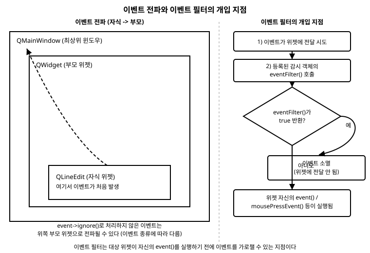

# 9장. 이벤트 처리와 이벤트 필터

📖 [◀ 목차](00-목차.md) | [◀ 이전: 8장. 커스텀 위젯과 페인트 이벤트](ch08-커스텀위젯과페인트이벤트.md) | [다음: 10장. 스타일시트(QSS)와 테마 ▶](ch10-스타일시트와테마.md)

---

지금까지는 시그널과 슬롯을 이용해서 위젯끼리 정보를 주고받는 방법을 주로 다뤘습니다. 버튼의 `clicked()` 시그널을 슬롯에 연결하고, 슬롯 안에서 원하는 동작을 실행하는 방식이었습니다. 하지만 마우스 커서가 정확히 어느 좌표를 눌렀는지, 키보드에서 어떤 키가 눌렸는지, 창의 크기가 어떻게 바뀌었는지처럼 좀 더 구체적인 정보가 필요할 때는 시그널/슬롯만으로는 부족합니다. 이런 저수준 정보는 Qt의 **이벤트(event)** 시스템을 통해 전달됩니다.

이번 장에서는 `QEvent`를 중심으로 한 Qt의 이벤트 시스템이 어떻게 동작하는지 살펴보고, 위젯의 이벤트 처리 함수를 오버라이드해서 마우스·키보드·크기 변경·닫기 동작에 반응하는 방법을 배웁니다. 이어서 이벤트가 위젯 트리를 따라 전파되는 과정과, 다른 위젯의 이벤트를 가로채는 이벤트 필터까지 다룬 뒤, 시그널/슬롯·이벤트 오버라이드·이벤트 필터라는 세 가지 도구를 언제 골라 써야 하는지 정리합니다.

## 9.1 Qt 이벤트 시스템 개요

### QEvent와 이벤트 큐

Qt 애플리케이션에서 발생하는 거의 모든 일—마우스 클릭, 키 입력, 창 크기 조절, 타이머 만료, 심지어 위젯이 화면에 그려져야 한다는 사실까지—은 `QEvent`의 인스턴스(정확히는 `QEvent`를 상속한 구체적인 클래스)로 표현됩니다. `QMouseEvent`, `QKeyEvent`, `QResizeEvent`, `QCloseEvent`, `QPaintEvent` 등이 모두 `QEvent`의 서브클래스입니다.

운영체제가 "마우스 버튼이 눌렸다"와 같은 사실을 알려오면, Qt는 이를 `QEvent` 객체로 포장한 뒤 **이벤트 큐**에 쌓아둡니다. `QApplication::exec()`가 시작하는 이벤트 루프는 이 큐에서 이벤트를 하나씩 꺼내, 이벤트가 향해야 할 대상 객체(보통 위젯)에게 전달합니다. 이벤트를 즉시 처리하지 않고 큐에 쌓아두는 이유는, 이벤트가 발생한 순서를 지키면서도 애플리케이션이 한 번에 하나씩 차분하게 이벤트를 처리할 수 있게 하기 위해서입니다.

이벤트를 직접 큐에 넣거나 즉시 전달하고 싶을 때 쓰는 함수도 있습니다.

- `QCoreApplication::postEvent(QObject *receiver, QEvent *event)`: 이벤트를 큐에 넣고 즉시 반환합니다. 이벤트는 나중에 이벤트 루프가 처리합니다. 큐에 들어간 `QEvent`의 소유권은 Qt로 넘어가므로, `new`로 만든 객체를 넘기고 직접 `delete`하면 안 됩니다.
- `QCoreApplication::sendEvent(QObject *receiver, QEvent *event)`: 큐를 거치지 않고 즉시 대상 객체의 `event()` 함수를 호출합니다. 이 경우 이벤트 객체는 스택에 만들어도 되고, 호출이 끝나면 직접 정리해도 됩니다.

이 두 함수는 커스텀 위젯을 만들 때 "특정 상황에서 마치 사용자가 직접 입력한 것처럼 이벤트를 발생시키고 싶다"는 요구가 있을 때 사용합니다. 일반적인 UI 코드에서는 잘 쓰지 않지만, 이벤트가 큐를 통해 비동기적으로 처리된다는 사실(`postEvent`)과 즉시 동기적으로 처리될 수도 있다는 사실(`sendEvent`)을 아는 것은 이벤트 시스템을 이해하는 데 도움이 됩니다.

### event() 함수

이벤트 큐에서 꺼내진 이벤트는 최종적으로 대상 `QObject`의 가상 함수 `event(QEvent *event)`로 전달됩니다. `QWidget::event()`는 이 함수를 오버라이드해서, 넘어온 이벤트의 타입(`event->type()`)을 검사한 뒤 `mousePressEvent()`, `keyPressEvent()`, `resizeEvent()`처럼 좀 더 구체적인 가상 함수를 호출해 주는 역할을 합니다. 즉 `event()`는 일종의 "분배 담당자"이고, 우리가 평소에 오버라이드하는 `mousePressEvent()` 같은 함수들은 `event()`가 내부적으로 호출해 주는 하위 함수입니다.

```cpp
// QWidget::event()의 동작을 개념적으로 요약하면 다음과 비슷합니다.
bool MyWidget::event(QEvent *event)
{
    switch (event->type()) {
    case QEvent::MouseButtonPress:
        mousePressEvent(static_cast<QMouseEvent *>(event));
        return true;
    case QEvent::KeyPress:
        keyPressEvent(static_cast<QKeyEvent *>(event));
        return true;
    // ... 그 밖의 이벤트 타입들
    default:
        return QWidget::event(event);
    }
}
```

대부분의 경우 `event()`를 직접 오버라이드할 필요는 없습니다. `mousePressEvent()`처럼 이미 분리되어 있는 구체적인 함수를 오버라이드하는 것으로 충분하기 때문입니다. `event()`를 직접 오버라이드하는 경우는 `QEvent::ShortcutOverride`, `QEvent::KeyPress`를 동시에 가로채서 특정 단축키보다 위젯 자신의 키 입력을 우선시키고 싶을 때처럼, Qt가 미리 별도의 가상 함수로 분리해 두지 않은 이벤트를 다뤄야 할 때입니다. `event()`를 오버라이드할 때는 처리하지 않은 이벤트 타입에 대해서 반드시 기본 클래스의 `event()`를 호출해 주어야 다른 표준 동작(포커스 이동을 위한 Tab 키 처리 등)이 깨지지 않습니다.

## 9.2 주요 이벤트 오버라이드

이제 실제로 자주 오버라이드하는 이벤트 처리 함수들을 하나씩 살펴보겠습니다. 아래 예제들은 모두 `QWidget`을 상속한 커스텀 위젯 클래스를 기준으로 작성했습니다.

### mousePressEvent와 mouseMoveEvent

`mousePressEvent()`는 위젯 영역 안에서 마우스 버튼이 눌렸을 때 호출됩니다. `mouseMoveEvent()`는 마우스 포인터가 움직일 때마다 호출되는데, 기본 설정에서는 **버튼이 눌린 상태로 움직일 때만** 호출됩니다. 버튼을 누르지 않은 상태에서도 마우스 이동을 감지하려면 `setMouseTracking(true)`를 호출해 마우스 추적을 켜야 합니다.

다음은 위젯 위에서 마우스를 드래그하면 점을 찍는 간단한 그림판 위젯입니다.

```cpp
// DrawingWidget.h
#pragma once

#include <QWidget>
#include <QVector>
#include <QPoint>

class DrawingWidget : public QWidget
{
    Q_OBJECT

public:
    explicit DrawingWidget(QWidget *parent = nullptr);

protected:
    void mousePressEvent(QMouseEvent *event) override;
    void mouseMoveEvent(QMouseEvent *event) override;
    void mouseReleaseEvent(QMouseEvent *event) override;
    void paintEvent(QPaintEvent *event) override;

private:
    QVector<QPoint> m_points;
    bool m_drawing = false;
};
```

```cpp
// DrawingWidget.cpp
#include "DrawingWidget.h"
#include <QMouseEvent>
#include <QPainter>

DrawingWidget::DrawingWidget(QWidget *parent)
    : QWidget(parent)
{
    setMinimumSize(400, 300);
}

void DrawingWidget::mousePressEvent(QMouseEvent *event)
{
    if (event->button() == Qt::LeftButton) {
        m_drawing = true;
        m_points.append(event->pos());
        update(); // paintEvent()를 다시 호출하도록 예약
    }
}

void DrawingWidget::mouseMoveEvent(QMouseEvent *event)
{
    if (m_drawing && (event->buttons() & Qt::LeftButton)) {
        m_points.append(event->pos());
        update();
    }
}

void DrawingWidget::mouseReleaseEvent(QMouseEvent *event)
{
    if (event->button() == Qt::LeftButton) {
        m_drawing = false;
    }
}

void DrawingWidget::paintEvent(QPaintEvent *event)
{
    Q_UNUSED(event);
    QPainter painter(this);
    painter.setRenderHint(QPainter::Antialiasing);
    painter.setBrush(Qt::black);
    painter.setPen(Qt::NoPen);
    for (const QPoint &p : m_points) {
        painter.drawEllipse(p, 3, 3);
    }
}
```

`event->button()`은 이번 이벤트를 발생시킨 단일 버튼을 알려주고(`mousePressEvent`, `mouseReleaseEvent`에서 사용), `event->buttons()`는 현재 눌려 있는 모든 버튼을 비트 플래그로 알려줍니다(`mouseMoveEvent`에서 "지금 왼쪽 버튼이 눌린 채로 움직이는가"를 확인할 때 사용). 좌표는 `event->pos()`로 얻을 수 있으며, 이는 이벤트를 받은 위젯을 기준으로 한 좌표입니다.

> 참고: Qt 6에서는 `QMouseEvent::pos()`가 정수 좌표 대신 부동소수점 좌표를 반환하는 `position()`(위젯 기준)과 `globalPosition()`(화면 기준)으로 대체되는 흐름입니다. `pos()`는 Qt 6에서도 여전히 동작하지만 더 정밀한 좌표가 필요하다면 `event->position().toPoint()`를 사용하는 것을 권장합니다.

### keyPressEvent

`keyPressEvent()`는 위젯이 포커스를 가진 상태에서 키가 눌렸을 때 호출됩니다. `event->key()`로 어떤 키인지(`Qt::Key` 열거형 값), `event->modifiers()`로 Shift·Ctrl·Alt 등의 보조 키 상태를, `event->text()`로 실제 입력된 문자를 확인할 수 있습니다.

```cpp
void DrawingWidget::keyPressEvent(QKeyEvent *event)
{
    if (event->key() == Qt::Key_Escape) {
        m_points.clear();
        update();
        return;
    }

    if (event->key() == Qt::Key_Z && (event->modifiers() & Qt::ControlModifier)) {
        if (!m_points.isEmpty()) {
            m_points.removeLast();
            update();
        }
        return;
    }

    // 처리하지 않은 키는 기본 클래스에 넘겨서 표준 동작(포커스 이동 등)을 유지합니다.
    QWidget::keyPressEvent(event);
}
```

위젯이 키보드 입력을 받으려면 포커스를 가질 수 있어야 합니다. `QWidget`은 기본적으로 `Qt::NoFocus` 정책이라 마우스로 클릭해도 포커스를 받지 않으므로, 생성자에서 `setFocusPolicy(Qt::StrongFocus)`처럼 포커스 정책을 지정해 주어야 `keyPressEvent()`가 호출됩니다.

### resizeEvent

`resizeEvent()`는 위젯의 크기가 바뀔 때마다 호출됩니다. 레이아웃을 쓰지 않고 자식 위젯의 위치와 크기를 직접 계산해서 배치하는 경우에 특히 유용합니다.

```cpp
void OverlayWidget::resizeEvent(QResizeEvent *event)
{
    QWidget::resizeEvent(event); // 기본 동작을 먼저 호출

    // 우측 하단에 고정 크기로 떠 있는 버튼 위치를 다시 계산합니다.
    const int margin = 12;
    m_closeButton->move(width() - m_closeButton->width() - margin,
                         height() - m_closeButton->height() - margin);
}
```

`event->size()`로 새 크기를, `event->oldSize()`로 변경 전 크기를 확인할 수 있습니다. 대부분의 경우 위젯 자체의 `width()`, `height()`를 바로 읽어도 되지만, 크기가 얼마나 변했는지(증가량/감소량)를 계산해야 한다면 `oldSize()`가 유용합니다.

### closeEvent

`closeEvent()`는 사용자가 창의 닫기 버튼(X)을 누르거나 `close()`가 호출되었을 때 실행됩니다. 저장하지 않은 내용이 있을 때 사용자에게 확인을 받는 용도로 자주 쓰입니다.

```cpp
void MainWindow::closeEvent(QCloseEvent *event)
{
    if (!m_document->isModified()) {
        event->accept();
        return;
    }

    const auto answer = QMessageBox::question(
        this,
        tr("변경 사항 저장"),
        tr("저장하지 않은 변경 사항이 있습니다. 종료하시겠습니까?"),
        QMessageBox::Yes | QMessageBox::No,
        QMessageBox::No);

    if (answer == QMessageBox::Yes) {
        event->accept(); // 창이 닫히도록 허용
    } else {
        event->ignore(); // 창 닫기를 취소
    }
}
```

여기서 `event->accept()`와 `event->ignore()`가 등장합니다. 다음 절에서 이 두 함수가 이벤트 처리 전체에서 어떤 의미를 갖는지 자세히 살펴보겠습니다.

## 9.3 이벤트 전파와 accept()/ignore()

### accept()와 ignore()의 의미

모든 `QEvent`는 내부에 "이 이벤트가 처리되었는가"를 나타내는 accepted 플래그를 갖고 있습니다.

- `event->accept()`: "내가 이 이벤트를 처리했다"고 표시합니다. (참고로 `QCloseEvent`, `QResizeEvent` 같은 일부 이벤트를 제외한 마우스/키 이벤트는 기본값이 이미 accepted 상태인 경우가 많습니다.)
- `event->ignore()`: "나는 이 이벤트를 처리하지 않았다"고 표시합니다.
- `event->isAccepted()`: 현재 플래그 값을 확인합니다.

이 플래그가 실제로 어떤 효과를 내는지는 이벤트 종류에 따라 다릅니다.

- `QCloseEvent`에서 `ignore()`를 호출하면 창이 실제로 닫히지 않습니다. (9.2절의 예제)
- `QKeyEvent`, `QWheelEvent`처럼 부모에게 전파될 수 있는 이벤트는, 자식 위젯이 `ignore()`로 표시하면 Qt가 그 이벤트를 부모 위젯에게 다시 전달합니다. 자식이 `accept()`하면(또는 아무것도 하지 않아 기본값이 accepted로 남으면) 전파가 거기서 멈춥니다.
- `QMouseEvent`의 press/move/release는 전파되지 않는 것이 기본이지만, 위젯이 명시적으로 처리하지 않을 경우 Qt가 상황에 맞게 상위 위젯의 컨텍스트 메뉴 등 별도 메커니즘으로 넘기기도 합니다.

### 자식에서 부모로 이어지는 전파 경로

예를 들어 `QWidget` 안에 자식 `QWidget`이 있고, 자식이 특정 키 이벤트를 처리하지 않는다고 해봅시다.

```cpp
void ChildWidget::keyPressEvent(QKeyEvent *event)
{
    if (event->key() == Qt::Key_F1) {
        showLocalHelp();
        event->accept();
    } else {
        event->ignore(); // 이 키는 내가 처리할 일이 아니다
    }
}
```

`Key_F1`이 아닌 다른 키가 눌리면 `ChildWidget`은 `ignore()`를 호출합니다. 그러면 Qt는 이 키 이벤트를 부모 위젯에게 다시 전달하고, 부모의 `keyPressEvent()`가 호출됩니다. 부모도 처리하지 않으면 그 위의 조상에게 계속 전달되며, 최상위 윈도우까지 아무도 처리하지 않으면 이벤트는 조용히 소멸합니다.

이 전파 경로는 아래 그림의 왼쪽 부분과 같습니다. 자식 위젯에서 이벤트가 발생하고, 처리되지 않은 이벤트가 부모, 그 부모의 부모로 계속 거슬러 올라가는 구조입니다.



`QWidget::keyPressEvent()`의 기본 구현 자체가 "처리하지 않았다"는 뜻으로 `event->ignore()`를 호출하도록 되어 있으므로, 오버라이드한 함수에서 해당 조건을 처리하지 못했을 때 기본 클래스의 구현을 호출해 주면(`QWidget::keyPressEvent(event)`) 자동으로 전파가 이어집니다. 앞서 9.2절의 `keyPressEvent()` 예제에서 처리하지 못한 키를 `QWidget::keyPressEvent(event)`에 넘긴 것도 같은 이유입니다.

## 9.4 이벤트 필터

### 왜 이벤트 필터가 필요한가

이벤트 오버라이드는 내가 직접 작성한(또는 상속한) 위젯 클래스에서만 쓸 수 있습니다. 그런데 `QLineEdit`, `QComboBox`처럼 Qt가 이미 제공하는 위젯의 이벤트 처리 방식을 바꾸고 싶다면 어떻게 해야 할까요? 매번 `QLineEdit`을 상속한 서브클래스를 만들어 `keyPressEvent()`를 오버라이드하는 것은 번거롭고, 폼(form)에 있는 여러 위젯 각각에 대해 이런 서브클래스를 만드는 것은 더더욱 비효율적입니다.

이런 상황을 위해 Qt는 **이벤트 필터(event filter)** 라는 메커니즘을 제공합니다. 이벤트 필터를 이용하면, 위젯을 상속하지 않고도 다른 객체(감시 대상)에게 전달되는 이벤트를 가로채서 미리 살펴보거나 아예 처리해 버릴 수 있습니다.

### installEventFilter()와 eventFilter()

이벤트 필터를 사용하는 절차는 다음과 같습니다.

1. 이벤트를 가로챌 감시자(filter) 역할을 할 `QObject`(보통은 다른 위젯이나 전용 헬퍼 클래스)에서 `bool eventFilter(QObject *watched, QEvent *event)`를 오버라이드합니다.
2. 감시 대상 객체에서 `target->installEventFilter(filterObject)`를 호출해 필터를 등록합니다.

`eventFilter()`가 `true`를 반환하면 "이 이벤트는 내가 처리했으니 대상 객체에게는 더 이상 전달하지 마라"는 뜻이 되어 이벤트가 거기서 소멸합니다. `false`를 반환하면 이벤트가 원래대로 대상 객체에게 계속 전달됩니다. 앞서 본 그림의 오른쪽 부분이 이 흐름을 나타냅니다. 이벤트 필터는 대상 위젯 자신의 `event()`가 실행되기 **이전에** 개입할 수 있는 지점입니다.

다음 예제는 `QLineEdit`을 상속하지 않고도, 숫자가 아닌 문자 입력을 막는 이벤트 필터입니다.

```cpp
// DigitOnlyFilter.h
#pragma once

#include <QObject>

class DigitOnlyFilter : public QObject
{
    Q_OBJECT

public:
    explicit DigitOnlyFilter(QObject *parent = nullptr) : QObject(parent) {}

protected:
    bool eventFilter(QObject *watched, QEvent *event) override;
};
```

```cpp
// DigitOnlyFilter.cpp
#include "DigitOnlyFilter.h"
#include <QKeyEvent>

bool DigitOnlyFilter::eventFilter(QObject *watched, QEvent *event)
{
    if (event->type() == QEvent::KeyPress) {
        auto *keyEvent = static_cast<QKeyEvent *>(event);
        const QString text = keyEvent->text();

        // 숫자, 백스페이스, 화살표 키 등 편집에 필요한 키는 허용하고
        // 그 외 문자가 포함된 입력만 가로막습니다.
        if (!text.isEmpty() && !text.at(0).isDigit()) {
            return true; // 이벤트를 여기서 소멸시켜 QLineEdit에는 전달되지 않게 함
        }
    }

    // 처리하지 않는 나머지 이벤트는 기본 구현에 넘깁니다.
    return QObject::eventFilter(watched, event);
}
```

```cpp
// 사용하는 쪽 코드 (예: MainWindow 생성자)
auto *ageEdit = new QLineEdit(this);
auto *filter = new DigitOnlyFilter(ageEdit); // ageEdit을 부모로 지정해 수명 관리
ageEdit->installEventFilter(filter);
```

`eventFilter()`의 첫 번째 매개변수 `watched`는 이벤트가 원래 향하던 대상 객체입니다. 필터 하나를 여러 위젯에 동시에 설치했다면 `watched`로 어느 위젯에서 온 이벤트인지 구분할 수 있습니다.

```cpp
bool MultiWidgetFilter::eventFilter(QObject *watched, QEvent *event)
{
    if (watched == m_firstNameEdit && event->type() == QEvent::FocusOut) {
        validateFirstName();
    } else if (watched == m_lastNameEdit && event->type() == QEvent::FocusOut) {
        validateLastName();
    }
    return QObject::eventFilter(watched, event);
}
```

이벤트 필터는 여러 개가 동시에 설치될 수 있으며, **가장 나중에 설치된 필터부터** 호출됩니다. 앞선 필터가 `true`를 반환하면 그 뒤에 설치된(먼저 설치된) 필터에게도, 대상 객체 자신에게도 이벤트가 전달되지 않습니다. 더 이상 필터링이 필요 없어지면 `removeEventFilter()`로 등록을 해제할 수 있습니다.

### 애플리케이션 전역 이벤트 필터

`installEventFilter()`는 `QObject`라면 무엇에든 사용할 수 있는데, `QCoreApplication`(또는 `qApp`, `QApplication::instance()`)에 필터를 설치하면 애플리케이션 안의 **모든** 위젯으로 향하는 이벤트를 가로챌 수 있습니다. 전역 단축키를 처리하거나, 모든 위젯의 클릭을 로깅하는 디버깅 도구를 만들 때 활용합니다. 다만 모든 이벤트가 이 필터를 거쳐 가므로 `eventFilter()` 내부의 처리는 최대한 가볍게 유지해야 애플리케이션 전체 성능에 영향을 주지 않습니다.

## 9.5 시그널/슬롯 vs 이벤트 오버라이드 vs 이벤트 필터

세 가지 방식 모두 "무언가에 반응한다"는 목적은 같지만, 적용 범위와 개입 시점이 다릅니다.

| 방식 | 개입 시점 / 대상 | 주로 쓰는 상황 |
|---|---|---|
| 시그널/슬롯 | 위젯이 이미 의미를 해석해서 내보낸 고수준 알림(`clicked()`, `textChanged()` 등) | "버튼이 클릭됐다", "텍스트가 바뀌었다"처럼 위젯이 제공하는 이벤트로 충분할 때. 대부분의 UI 로직은 이 방식으로 처리합니다. |
| 이벤트 오버라이드 (`mousePressEvent` 등) | 내가 상속한 위젯 클래스 자신에게 온 이벤트, `event()`가 분배하기 전 원본에 가까운 정보 | 좌표, 눌린 키, 크기 변화량처럼 시그널로 제공되지 않는 저수준 정보가 필요할 때. 내가 직접 만든(상속한) 위젯의 동작을 바꿀 때. |
| 이벤트 필터 (`eventFilter`) | 다른 객체(내가 상속하지 않은 기존 위젯 포함)에게 가는 이벤트를, 그 객체의 `event()`가 실행되기 전에 가로챔 | Qt가 제공하는 위젯을 상속하지 않고 동작을 바꾸고 싶을 때. 여러 위젯에 공통 로직을 한 곳에서 적용하고 싶을 때. 폼 전체 또는 애플리케이션 전체의 입력을 감시할 때. |

실무에서는 이 세 가지를 함께 사용하는 경우가 많습니다. 버튼 클릭처럼 명확한 의미가 있는 동작은 시그널/슬롯으로 연결하고, 커스텀 그리기 위젯처럼 직접 만든 위젯의 저수준 입력 처리는 이벤트 오버라이드로 구현하며, 기존 위젯의 동작을 침습적으로 바꾸지 않으면서 살짝 가로채고 싶을 때만 이벤트 필터를 사용하는 것이 일반적인 원칙입니다.

## 요약

- Qt의 모든 입력과 상태 변화는 `QEvent`(와 그 서브클래스)로 표현되며, 이벤트 루프가 큐에서 이벤트를 꺼내 대상 객체의 `event()` 함수로 전달합니다. `event()`는 이벤트 타입에 따라 `mousePressEvent()`, `keyPressEvent()` 같은 구체적인 가상 함수를 호출합니다.
- `mousePressEvent`/`mouseMoveEvent`(좌표와 버튼 상태), `keyPressEvent`(눌린 키), `resizeEvent`(크기 변화), `closeEvent`(창 닫기 요청)는 자주 오버라이드하는 대표적인 이벤트 함수입니다.
- `event->accept()`/`event->ignore()`로 이벤트 처리 여부를 표시합니다. `QCloseEvent`에서 `ignore()`는 창 닫기를 취소하고, 키 이벤트 등 일부 이벤트에서 `ignore()`는 이벤트를 부모 위젯에게 전파시킵니다.
- 이벤트 필터는 `installEventFilter()`로 등록하고 `eventFilter(QObject *watched, QEvent *event)`를 오버라이드해서, 내가 상속하지 않은 다른 객체의 이벤트를 대상 객체보다 먼저 가로챌 수 있는 메커니즘입니다. `true`를 반환하면 이벤트가 소멸하고, `false`를 반환하면(또는 기본 클래스 구현을 호출하면) 원래 대상에게 정상적으로 전달됩니다.
- 고수준 알림에는 시그널/슬롯을, 내가 만든 위젯의 저수준 입력 처리에는 이벤트 오버라이드를, 기존 위젯이나 여러 위젯 전반의 동작을 침습 없이 바꾸고 싶을 때는 이벤트 필터를 사용합니다.

## 연습문제

1. `QWidget`을 상속한 커스텀 위젯에서 `mousePressEvent()`와 `mouseMoveEvent()`를 오버라이드해, 마우스를 드래그하는 동안 시작점과 현재 위치를 잇는 직선을 그리는 위젯을 작성해 보세요. (`paintEvent()`에서 `QPainter::drawLine()` 사용)
2. `keyPressEvent()`를 오버라이드해서 방향키(`Qt::Key_Up`, `Qt::Key_Down`, `Qt::Key_Left`, `Qt::Key_Right`)를 누르면 위젯 안의 사각형이 이동하도록 구현해 보세요. 위젯이 키 입력을 받으려면 어떤 설정이 필요한지도 확인하세요.
3. `closeEvent()`를 오버라이드해서, 텍스트 편집 위젯의 내용이 처음 상태와 달라졌을 때만 저장 여부를 묻고, 달라지지 않았다면 바로 닫히도록 구현해 보세요.
4. `QPlainTextEdit`에 이벤트 필터를 설치해서, Ctrl+Enter 키 조합이 눌렸을 때 텍스트 편집을 막고 대신 "제출됨"이라는 메시지를 출력하는 예제를 작성해 보세요. 이 기능을 이벤트 필터 대신 `QPlainTextEdit`을 상속해서 구현한다면 어떤 점이 달라질지 비교해 보세요.
5. 이벤트 오버라이드와 이벤트 필터의 차이를 자신의 말로 설명하고, 각각 어떤 상황에서 선택해야 하는지 구체적인 예를 들어 서술해 보세요.


---

📖 [◀ 목차](00-목차.md) | [◀ 이전: 8장. 커스텀 위젯과 페인트 이벤트](ch08-커스텀위젯과페인트이벤트.md) | [다음: 10장. 스타일시트(QSS)와 테마 ▶](ch10-스타일시트와테마.md)
