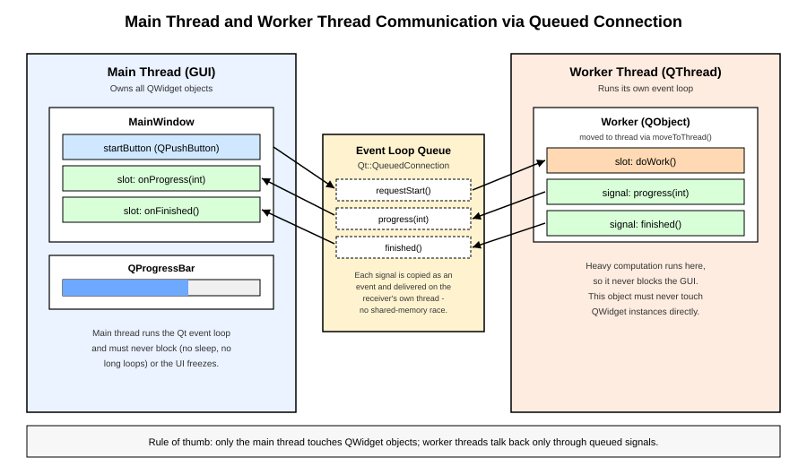

# 14장. 멀티스레딩(QThread)과 동시성

📖 [◀ 목차](00-목차.md) | [◀ 이전: 13장. SQL 데이터베이스 연동(Qt SQL)](ch13-SQL데이터베이스연동.md) | [다음: 15장. 네트워크 프로그래밍 ▶](ch15-네트워크프로그래밍.md)

---

## 14.1 왜 스레드가 필요한가

지금까지 만든 예제들은 사용자가 버튼을 클릭하면 슬롯이 실행되고, 그 슬롯이 끝나야 다음 이벤트를 처리할 수 있는 구조였습니다. 이는 Qt의 GUI 애플리케이션이 기본적으로 **이벤트 루프(event loop)** 하나로 동작하기 때문입니다. `QApplication::exec()`가 시작하는 이 이벤트 루프는 마우스 클릭, 키보드 입력, 타이머, 페인트 요청 등 모든 이벤트를 순서대로 꺼내어 처리합니다.

문제는 어떤 슬롯 안에서 대용량 파일 처리, 복잡한 수치 계산, 느린 네트워크 응답 대기처럼 시간이 오래 걸리는 작업을 실행하면, 그 작업이 끝날 때까지 이벤트 루프가 다음 이벤트를 처리하지 못한다는 점입니다. 그 결과 창이 다시 그려지지 않고, 버튼을 눌러도 반응이 없으며, 운영체제는 이 프로그램을 "응답 없음" 상태로 표시합니다. 이런 현상을 흔히 "UI가 멈춘다" 또는 "UI가 얼어붙는다(freeze)"고 표현합니다.

이 문제를 해결하는 방법은 시간이 오래 걸리는 작업을 **별도의 스레드**로 옮기고, 메인 스레드는 오직 이벤트 루프를 계속 돌리며 UI 반응성을 유지하도록 하는 것입니다. Qt는 이를 위해 `QThread` 클래스와, 스레드 안전성을 지원하는 다양한 도구를 제공합니다.

## 14.2 Qt의 스레드 모델과 GUI 스레드

Qt의 스레드 모델에서 가장 중요한 규칙은 다음 한 문장으로 요약됩니다.

> **QWidget과 그 하위 클래스의 인스턴스는 반드시 그것을 생성한 스레드, 즉 일반적으로 메인(GUI) 스레드에서만 조작해야 합니다.**

`QApplication`을 생성하고 `exec()`를 호출하는 스레드가 바로 GUI 스레드입니다. 워커 스레드에서 `QLabel::setText()`나 `QProgressBar::setValue()` 같은 함수를 직접 호출하면, 대부분의 플랫폼에서 다음과 같은 경고가 출력되거나 프로그램이 예기치 않게 동작할 수 있습니다.

```
QObject::setParent: Cannot set parent, new parent is in a different thread
QPixmap: It is not safe to use pixmaps outside the GUI thread
```

이것은 Qt의 버그가 아니라 의도된 제약입니다. 대부분의 네이티브 윈도우 시스템(Windows의 GDI, macOS의 AppKit, X11 등)이 UI 요소를 단일 스레드에서만 다루도록 설계되어 있기 때문에, Qt도 이 제약을 그대로 반영합니다.

그렇다면 워커 스레드에서 계산한 결과를 어떻게 화면에 반영할까요? 정답은 **시그널과 슬롯**입니다. 워커 스레드는 결과를 시그널로 발생시키기만 하고, 그 시그널에 연결된 슬롯(메인 스레드에 속한 객체의 슬롯)이 실제로 UI를 갱신하도록 설계합니다. 이때 Qt가 스레드 경계를 넘는 연결을 자동으로 안전하게 처리해 준다는 점이 시그널/슬롯 메커니즘의 큰 장점입니다. 이 내용은 14.4절에서 자세히 다룹니다.

### QObject와 스레드 어피니티(affinity)

Qt에서 모든 `QObject`(및 그 파생 클래스)는 항상 특정 스레드에 "소속"됩니다. 이를 스레드 어피니티라고 부르며, `QObject::thread()`로 확인할 수 있습니다. 객체는 기본적으로 자신이 생성된 스레드에 소속되지만, `QObject::moveToThread()`를 호출하면 소속 스레드를 바꿀 수 있습니다(단, `QWidget`은 이동이 지원되지 않습니다). 다음 절에서 다룰 워커 객체 패턴은 바로 이 `moveToThread()`를 활용합니다.

## 14.3 QThread 사용 패턴

Qt에서 새 스레드를 사용하는 방법은 크게 두 가지입니다.

### 14.3.1 방법 1: 워커 객체 + moveToThread() (권장)

권장되는 패턴은 실제 작업을 수행하는 로직을 평범한 `QObject` 파생 클래스(워커)로 작성하고, 이 객체를 `QThread` 인스턴스로 `moveToThread()` 시키는 것입니다. `QThread` 자체는 상속하지 않고 그대로 사용합니다.

```cpp
// worker.h
#pragma once
#include <QObject>

class Worker : public QObject
{
    Q_OBJECT

public:
    explicit Worker(QObject *parent = nullptr) : QObject(parent) {}

public slots:
    void doWork(int iterations)
    {
        for (int i = 0; i < iterations; ++i) {
            // 시간이 오래 걸리는 계산이라고 가정
            long long sum = 0;
            for (int j = 0; j < 5000000; ++j) sum += j;

            emit progress(static_cast<int>((i + 1) * 100.0 / iterations));
        }
        emit finished();
    }

signals:
    void progress(int percent);
    void finished();
};
```

이 워커 객체를 메인 창에서 다음과 같이 사용합니다.

```cpp
// mainwindow.cpp (일부)
#include "worker.h"
#include <QThread>

void MainWindow::startWork()
{
    QThread *thread = new QThread(this);
    Worker *worker = new Worker(); // 부모를 지정하지 않는다.

    worker->moveToThread(thread);

    connect(thread, &QThread::started, worker, [worker]() { worker->doWork(20); });
    connect(worker, &Worker::progress, this, &MainWindow::onProgress);
    connect(worker, &Worker::finished, this, &MainWindow::onWorkFinished);

    // 작업이 끝나면 스레드와 워커 객체를 정리한다.
    connect(worker, &Worker::finished, thread, &QThread::quit);
    connect(worker, &Worker::finished, worker, &QObject::deleteLater);
    connect(thread, &QThread::finished, thread, &QObject::deleteLater);

    thread->start();
}
```

이 패턴에서 지켜야 할 중요한 규칙들이 있습니다.

- 워커 객체는 `moveToThread()`를 호출하기 전까지는 부모를 지정하지 않아야 합니다. `QObject`는 부모-자식 관계에 있는 객체가 서로 다른 스레드에 속할 수 없기 때문입니다. (`Worker` 생성 시 `parent`를 넘기지 않은 이유입니다.)
- `thread->start()`가 호출되면 새 스레드가 시작되고, 그 스레드에서 자체 이벤트 루프가 돌기 시작합니다. `worker`에 연결된 슬롯 호출(`doWork` 등)은 이 이벤트 루프를 통해 워커가 소속된 스레드에서 실행됩니다.
- 작업이 끝나면 `QThread::quit()`으로 스레드의 이벤트 루프를 종료하고, `deleteLater()`로 워커 객체와 스레드 객체를 안전하게 해제합니다. `deleteLater()`는 해당 객체가 소속된 스레드의 이벤트 루프가 다음에 유휴 상태가 될 때 삭제를 예약하므로, 스레드 종료 시점에 안전하게 정리할 수 있습니다.

### 14.3.2 방법 2: QThread 상속 (비권장이지만 알아둘 필요는 있음)

Qt 초창기 예제나 오래된 코드에서는 `QThread`를 상속하여 `run()`을 오버라이드하는 방식을 흔히 볼 수 있습니다.

```cpp
class WorkerThread : public QThread
{
    Q_OBJECT

protected:
    void run() override
    {
        for (int i = 0; i < 20; ++i) {
            long long sum = 0;
            for (int j = 0; j < 5000000; ++j) sum += j;
            emit progress((i + 1) * 5);
        }
    }

signals:
    void progress(int percent);
};
```

```cpp
WorkerThread *thread = new WorkerThread(this);
connect(thread, &WorkerThread::progress, this, &MainWindow::onProgress);
connect(thread, &QThread::finished, thread, &QObject::deleteLater);
thread->start();
```

이 방식은 코드가 짧고 이해하기 쉽다는 장점이 있지만 몇 가지 주의할 점이 있습니다.

- `run()` 안에서 실행되는 코드만 새 스레드에서 동작합니다. 즉 `WorkerThread` 객체 자신은(생성자에서 만들어졌으므로) 여전히 원래 스레드에 소속되어 있으며, `run()` 밖에서 정의한 슬롯을 이 객체에 연결하면 그 슬롯은 새 스레드가 아니라 원래 스레드에서 실행됩니다. 이는 종종 초보자들이 혼동하는 부분입니다.
- 작업 로직이 스레드 클래스 자체에 섞여 있어, 같은 작업을 스레드 없이(예: 테스트 코드에서 동기적으로) 재사용하기 어렵습니다.

Qt 공식 문서 역시 오래전부터 워커 객체 + `moveToThread()` 패턴을 권장하고 있습니다. 다만 `run()`을 오버라이드하는 방식이 완전히 틀린 것은 아니며, `run()` 안에서만 필요한 자원을 만들고 그 안에서 자체적인 루프를 도는 단순한 백그라운드 작업(예: 이벤트 루프가 필요 없는 일회성 계산)에는 여전히 쓰이기도 합니다. 이 책에서는 이후 예제 모두 워커 객체 패턴을 기준으로 설명합니다.

## 14.4 스레드 간 통신: 시그널/슬롯의 Queued Connection

Qt의 시그널/슬롯 메커니즘은 연결 방식(`Qt::ConnectionType`)에 따라 슬롯이 호출되는 방식이 달라집니다. `connect()`의 다섯 번째 인자로 지정할 수 있으며, 생략하면 `Qt::AutoConnection`이 기본값입니다.

- **`Qt::DirectConnection`**: 시그널이 발생한 바로 그 스레드에서, 마치 일반 함수를 호출하듯 슬롯을 즉시 실행합니다.
- **`Qt::QueuedConnection`**: 슬롯을 즉시 실행하지 않고, 인자들을 복사하여 이벤트로 감싼 뒤 수신 객체가 속한 스레드의 이벤트 큐에 넣습니다. 그 스레드의 이벤트 루프가 이 이벤트를 꺼낼 차례가 되면 그제서야 슬롯이 실행됩니다.
- **`Qt::BlockingQueuedConnection`**: `QueuedConnection`과 비슷하게 큐를 사용하지만, 시그널을 발생시킨 스레드는 슬롯 실행이 끝날 때까지 블로킹(대기)합니다. 같은 스레드 내에서 사용하면 데드락이 발생하므로 주의해야 합니다.
- **`Qt::AutoConnection`**(기본값): 시그널을 보내는 객체와 슬롯을 받는 객체가 같은 스레드에 있으면 `DirectConnection`처럼, 서로 다른 스레드에 있으면 `QueuedConnection`처럼 자동으로 동작합니다.

`Qt::AutoConnection`이 기본값이기 때문에, 14.3.1절의 예제처럼 `moveToThread()`로 옮긴 워커 객체의 시그널을 메인 스레드 객체의 슬롯에 `connect()`할 때 연결 타입을 명시하지 않아도 Qt가 자동으로 `QueuedConnection`을 선택해 줍니다. 이것이 바로 워커 스레드에서 발생한 `progress` 시그널이 안전하게 메인 스레드의 `onProgress` 슬롯을 호출할 수 있는 이유입니다.

`QueuedConnection`이 안전한 이유는, 시그널의 인자들이 값으로 복사되어 이벤트 큐에 들어가고, 슬롯은 반드시 수신 객체가 속한 스레드(대개는 메인 스레드)에서 실행되기 때문입니다. 즉 두 스레드가 동시에 같은 메모리에 접근할 일이 없으므로 별도의 락(lock) 없이도 데이터 경합(race condition)을 피할 수 있습니다. 다만 시그널 인자로 사용하는 커스텀 타입은 `Q_DECLARE_METATYPE` 매크로로 등록하고 `qRegisterMetaType()`을 호출해야 큐를 통한 전달이 가능합니다. `int`, `QString`, `QVariant` 등 Qt의 기본 타입들은 이미 등록되어 있어 별도 작업 없이 사용할 수 있습니다.

```cpp
// 커스텀 타입을 시그널 인자로 큐드 연결에 사용하려면
struct ResultData { int code; QString message; };
Q_DECLARE_METATYPE(ResultData)

// main()이나 초기화 코드에서 한 번 등록
qRegisterMetaType<ResultData>("ResultData");
```

아래 다이어그램은 메인 스레드와 워커 스레드가 큐드 연결을 통해 어떻게 안전하게 통신하는지를 보여줍니다.



## 14.5 QMutex와 QWaitCondition

시그널/슬롯의 큐드 연결만으로 대부분의 GUI-워커 통신은 충분하지만, 여러 스레드가 같은 데이터(예: 공유 큐, 카운터, 캐시)에 직접 접근해야 하는 경우도 있습니다. 이런 경우에는 전통적인 동기화 도구가 필요합니다.

### QMutex

`QMutex`(mutual exclusion)는 한 번에 하나의 스레드만 특정 코드 영역(임계 구역, critical section)에 진입할 수 있도록 보장합니다.

```cpp
#include <QMutex>
#include <QMutexLocker>

class Counter
{
public:
    void increment()
    {
        QMutexLocker locker(&m_mutex); // 생성 시 lock(), 소멸 시 자동 unlock()
        ++m_value;
    }

    int value() const
    {
        QMutexLocker locker(&m_mutex);
        return m_value;
    }

private:
    mutable QMutex m_mutex;
    int m_value = 0;
};
```

`QMutex`를 직접 `lock()`/`unlock()`으로 다룰 수도 있지만, 예외가 발생하거나 중간에 `return`이 있는 코드에서 `unlock()` 호출을 빠뜨리기 쉽습니다. `QMutexLocker`는 RAII 패턴으로 락을 관리하여 스코프를 벗어나는 순간(정상 종료든 예외든) 자동으로 `unlock()`을 호출해 주므로, 실무에서는 `QMutexLocker` 사용이 권장됩니다.

### QWaitCondition

`QWaitCondition`은 어떤 조건이 만족될 때까지 스레드를 잠재웠다가, 다른 스레드가 조건이 바뀌었음을 알려주면 깨어나도록 하는 도구입니다. 생산자-소비자(producer-consumer) 패턴에서 자주 사용됩니다.

```cpp
#include <QMutex>
#include <QWaitCondition>
#include <QQueue>

class TaskQueue
{
public:
    void addTask(int task)
    {
        QMutexLocker locker(&m_mutex);
        m_queue.enqueue(task);
        m_condition.wakeOne(); // 대기 중인 소비자 스레드를 하나 깨운다.
    }

    int takeTask()
    {
        QMutexLocker locker(&m_mutex);
        while (m_queue.isEmpty()) {
            m_condition.wait(&m_mutex); // 큐가 빌 동안 대기(뮤텍스는 잠시 풀린다)
        }
        return m_queue.dequeue();
    }

private:
    QQueue<int> m_queue;
    QMutex m_mutex;
    QWaitCondition m_condition;
};
```

`m_condition.wait(&m_mutex)`는 호출되는 순간 뮤텍스를 잠시 풀어주고 스레드를 대기 상태로 만들며, 다른 스레드가 `wakeOne()`이나 `wakeAll()`을 호출하면 다시 뮤텍스를 획득한 뒤 깨어납니다. `while` 문으로 조건을 다시 검사하는 이유는, 깨어난 시점에 다른 스레드가 먼저 큐를 비워갔을 수도 있는 "허위 각성(spurious wakeup)"에 대비하기 위함입니다.

`QMutex`와 `QWaitCondition`은 저수준 도구이므로, 가능하다면 이 장의 다른 절에서 소개하는 시그널/슬롯이나 `QtConcurrent`처럼 더 높은 수준의 추상화를 우선 검토하고, 세밀한 제어가 정말 필요할 때만 사용하는 것이 좋습니다.

## 14.6 QtConcurrent와 QFuture/QFutureWatcher

`QThread`를 직접 다루는 방식은 유연하지만, 단순히 "이 함수를 백그라운드에서 한 번 실행하고 결과를 받고 싶다"는 요구에는 코드가 다소 장황합니다. `QtConcurrent` 네임스페이스는 스레드를 직접 만들지 않고도 Qt가 관리하는 스레드 풀에서 함수를 실행할 수 있게 해 주는 고수준 API입니다.

`QT += concurrent` (또는 CMake의 `Qt6::Concurrent`)를 프로젝트에 추가하면 사용할 수 있습니다.

### 14.6.1 QtConcurrent::run()

```cpp
#include <QtConcurrent/QtConcurrent>
#include <QFuture>

int heavyCalculation(int input)
{
    long long sum = 0;
    for (int i = 0; i < input; ++i) sum += i;
    return static_cast<int>(sum % 1000000);
}

void MainWindow::startBackgroundJob()
{
    QFuture<int> future = QtConcurrent::run(heavyCalculation, 100000000);
    // future는 즉시 반환되며, 계산은 스레드 풀의 다른 스레드에서 진행된다.
}
```

`QFuture<T>`는 비동기 작업의 결과를 나타내는 객체입니다. `future.result()`를 호출하면 계산이 끝날 때까지 현재 스레드를 블로킹하고 결과를 반환하므로, GUI 스레드에서 `result()`를 곧바로 호출하면 다시 UI가 멈추는 문제가 재발합니다. 이 문제를 피하려면 `QFutureWatcher`를 사용합니다.

### 14.6.2 QFutureWatcher로 결과를 시그널로 받기

`QFutureWatcher<T>`는 `QFuture<T>`를 감싸서, 작업이 끝났을 때 `finished()` 시그널을 발생시켜 주는 어댑터입니다. 덕분에 블로킹 호출 없이 시그널/슬롯 방식으로 결과를 받을 수 있습니다.

```cpp
#include <QFutureWatcher>

void MainWindow::startBackgroundJob()
{
    auto *watcher = new QFutureWatcher<int>(this);

    connect(watcher, &QFutureWatcher<int>::finished, this, [this, watcher]() {
        int result = watcher->result();
        statusBar()->showMessage(tr("계산 결과: %1").arg(result));
        watcher->deleteLater();
    });

    QFuture<int> future = QtConcurrent::run(heavyCalculation, 100000000);
    watcher->setFuture(future);
}
```

`watcher`의 `finished` 시그널에 연결된 람다는 메인 스레드에서 실행되므로, 그 안에서 위젯을 안전하게 조작할 수 있습니다.

`QtConcurrent`는 이 밖에도 컨테이너의 각 원소에 함수를 병렬로 적용하는 `QtConcurrent::map()`, 결과들을 하나로 합치는 `QtConcurrent::mappedReduced()` 등을 제공하지만, 이 책에서는 개념 소개 수준으로 다루며 자세한 내용은 Qt 공식 문서를 참고하기 바랍니다.

## 14.7 예제: 워커 스레드로 오래 걸리는 계산을 수행하고 진행률 표시하기

이번 예제는 "소수(prime number) 개수 세기"처럼 시간이 걸리는 계산을 워커 스레드에서 수행하면서, 진행 상황을 `QProgressBar`에 실시간으로 반영하는 프로그램입니다. 14.3.1절에서 소개한 워커 객체 + `moveToThread()` 패턴을 사용합니다.

```cpp
// primeworker.h
#pragma once
#include <QObject>

class PrimeWorker : public QObject
{
    Q_OBJECT

public:
    explicit PrimeWorker(QObject *parent = nullptr) : QObject(parent) {}

public slots:
    void countPrimes(int upperBound)
    {
        int count = 0;
        int lastReportedPercent = -1;

        for (int n = 2; n <= upperBound; ++n) {
            if (m_stopRequested.loadRelaxed()) {
                break;
            }

            bool isPrime = true;
            for (int d = 2; d * d <= n; ++d) {
                if (n % d == 0) {
                    isPrime = false;
                    break;
                }
            }
            if (isPrime) {
                ++count;
            }

            int percent = static_cast<int>(n * 100.0 / upperBound);
            if (percent != lastReportedPercent) {
                lastReportedPercent = percent;
                emit progress(percent);
            }
        }

        emit resultReady(count);
        emit finished();
    }

    void requestStop()
    {
        m_stopRequested.storeRelaxed(1);
    }

signals:
    void progress(int percent);
    void resultReady(int primeCount);
    void finished();

private:
    QAtomicInt m_stopRequested{0};
};
```

`m_stopRequested`에 `QAtomicInt`를 사용한 이유는, "중지" 버튼을 누르는 동작은 메인 스레드에서 일어나지만 이 값을 읽는 것은 워커 스레드이기 때문입니다. 단순한 플래그 하나를 여러 스레드에서 읽고 쓸 때는 뮤텍스보다 가벼운 원자적(atomic) 연산이 적합합니다.

```cpp
// mainwindow.h
#pragma once
#include <QMainWindow>

class QProgressBar;
class QPushButton;
class QLabel;
class QThread;
class PrimeWorker;

class MainWindow : public QMainWindow
{
    Q_OBJECT

public:
    explicit MainWindow(QWidget *parent = nullptr);

private slots:
    void onStartClicked();
    void onStopClicked();
    void onProgress(int percent);
    void onResultReady(int primeCount);
    void onWorkFinished();

private:
    QProgressBar *m_progressBar = nullptr;
    QPushButton *m_startButton = nullptr;
    QPushButton *m_stopButton = nullptr;
    QLabel *m_resultLabel = nullptr;

    QThread *m_thread = nullptr;
    PrimeWorker *m_worker = nullptr;
};
```

```cpp
// mainwindow.cpp
#include "mainwindow.h"
#include "primeworker.h"

#include <QProgressBar>
#include <QPushButton>
#include <QLabel>
#include <QThread>
#include <QVBoxLayout>
#include <QWidget>

MainWindow::MainWindow(QWidget *parent)
    : QMainWindow(parent)
{
    m_progressBar = new QProgressBar(this);
    m_progressBar->setRange(0, 100);

    m_startButton = new QPushButton(tr("계산 시작"), this);
    m_stopButton = new QPushButton(tr("중지"), this);
    m_stopButton->setEnabled(false);

    m_resultLabel = new QLabel(tr("대기 중"), this);

    connect(m_startButton, &QPushButton::clicked, this, &MainWindow::onStartClicked);
    connect(m_stopButton, &QPushButton::clicked, this, &MainWindow::onStopClicked);

    auto *layout = new QVBoxLayout;
    layout->addWidget(m_progressBar);
    layout->addWidget(m_startButton);
    layout->addWidget(m_stopButton);
    layout->addWidget(m_resultLabel);

    auto *central = new QWidget(this);
    central->setLayout(layout);
    setCentralWidget(central);
    resize(320, 180);
    setWindowTitle(tr("소수 개수 세기"));
}

void MainWindow::onStartClicked()
{
    m_startButton->setEnabled(false);
    m_stopButton->setEnabled(true);
    m_progressBar->setValue(0);
    m_resultLabel->setText(tr("계산 중..."));

    m_thread = new QThread(this);
    m_worker = new PrimeWorker(); // moveToThread 전이므로 부모를 지정하지 않는다.
    m_worker->moveToThread(m_thread);

    connect(m_thread, &QThread::started, m_worker, [this]() {
        m_worker->countPrimes(3000000);
    });
    connect(m_worker, &PrimeWorker::progress, this, &MainWindow::onProgress);
    connect(m_worker, &PrimeWorker::resultReady, this, &MainWindow::onResultReady);
    connect(m_worker, &PrimeWorker::finished, this, &MainWindow::onWorkFinished);

    connect(m_worker, &PrimeWorker::finished, m_thread, &QThread::quit);
    connect(m_worker, &PrimeWorker::finished, m_worker, &QObject::deleteLater);
    connect(m_thread, &QThread::finished, m_thread, &QObject::deleteLater);

    m_thread->start();
}

void MainWindow::onStopClicked()
{
    if (m_worker) {
        m_worker->requestStop();
    }
}

void MainWindow::onProgress(int percent)
{
    m_progressBar->setValue(percent);
}

void MainWindow::onResultReady(int primeCount)
{
    m_resultLabel->setText(tr("소수 개수: %1").arg(primeCount));
}

void MainWindow::onWorkFinished()
{
    m_startButton->setEnabled(true);
    m_stopButton->setEnabled(false);
    m_thread = nullptr;
    m_worker = nullptr;
}
```

```cpp
// main.cpp
#include <QApplication>
#include "mainwindow.h"

int main(int argc, char *argv[])
{
    QApplication app(argc, argv);

    MainWindow window;
    window.show();

    return app.exec();
}
```

이 예제에서 주목할 부분을 정리하면 다음과 같습니다.

- `PrimeWorker`는 `QWidget`을 전혀 알지 못합니다. 오직 `progress`, `resultReady`, `finished` 시그널만 발생시킬 뿐이며, 실제 UI 갱신은 메인 스레드에 있는 `MainWindow`의 슬롯이 담당합니다. 이렇게 역할을 분리하면 워커 클래스를 다른 UI(예: 콘솔 프로그램이나 다른 창)에서도 그대로 재사용할 수 있습니다.
- `onProgress()`와 `onResultReady()`는 `Qt::AutoConnection`에 의해 자동으로 `QueuedConnection`으로 동작하므로, 워커 스레드에서 `emit progress(...)`가 호출되어도 실제 슬롯 실행은 메인 스레드의 이벤트 루프 차례가 되었을 때 안전하게 이루어집니다.
- "중지" 버튼은 스레드를 강제로 종료(`terminate()`)하는 대신, `QAtomicInt` 플래그를 세워 워커 스스로 반복문을 빠져나오도록 유도합니다. `QThread::terminate()`는 스레드를 임의의 시점에 강제 종료시키므로 자원 정리가 제대로 이루어지지 않을 위험이 있어 일반적으로 권장되지 않습니다.
- 작업이 끝나면 `finished` 시그널 체인을 통해 `QThread::quit()`과 `deleteLater()`가 순서대로 호출되어 스레드와 워커 객체가 안전하게 정리됩니다.

## 요약

- Qt 애플리케이션은 하나의 이벤트 루프(주로 GUI 스레드)로 동작하며, 오래 걸리는 작업을 메인 스레드에서 직접 실행하면 UI가 멈춥니다. `QWidget`과 그 하위 클래스는 반드시 자신을 생성한 스레드(대개 메인 스레드)에서만 조작해야 합니다.
- 새 스레드를 사용하는 두 가지 방식 중, 작업 로직을 담은 `QObject` 파생 워커를 만들고 `moveToThread()`로 옮기는 방식이 권장되며, `QThread` 자체를 상속하여 `run()`을 오버라이드하는 방식은 혼동의 여지가 있어 비권장이지만 알아둘 필요가 있습니다.
- 스레드 간 통신은 시그널/슬롯의 `Qt::QueuedConnection`(기본값인 `Qt::AutoConnection`이 서로 다른 스레드 사이에서 자동으로 선택)을 이용하면, 인자가 값으로 복사되어 수신 객체의 스레드에서 슬롯이 실행되므로 별도의 락 없이 안전하게 데이터를 주고받을 수 있습니다.
- 공유 자원을 여러 스레드가 직접 다뤄야 할 때는 `QMutex`(및 RAII 래퍼 `QMutexLocker`)로 임계 구역을 보호하고, 조건이 만족될 때까지 스레드를 재우고 깨우는 데는 `QWaitCondition`을 사용합니다.
- 단순한 백그라운드 함수 실행에는 `QThread`를 직접 다루는 대신 `QtConcurrent::run()`으로 스레드 풀에 작업을 맡기고, `QFutureWatcher`의 `finished` 시그널로 결과를 안전하게 받아오는 방식이 더 간결합니다.

## 연습문제

1. GUI 스레드에서 시간이 오래 걸리는 작업을 직접 실행하면 어떤 문제가 발생하는지, Qt의 이벤트 루프 개념을 근거로 설명하시오.
2. 워커 객체를 `moveToThread()`로 옮기는 패턴과 `QThread`를 상속하여 `run()`을 오버라이드하는 패턴의 차이를 설명하고, 후자에서 흔히 발생하는 오해(어떤 코드가 실제로 새 스레드에서 실행되는가)를 예로 들어 서술하시오.
3. `Qt::DirectConnection`과 `Qt::QueuedConnection`의 차이를 설명하고, 워커 스레드의 시그널을 메인 스레드의 슬롯에 연결할 때 `Qt::AutoConnection`이 실제로 어떤 연결 방식으로 동작하는지 설명하시오.
4. `QMutexLocker`가 `QMutex`를 직접 `lock()`/`unlock()`으로 다루는 것보다 권장되는 이유를 RAII 개념과 예외 안전성 관점에서 설명하시오.
5. 14.7절의 소수 개수 세기 예제를 확장하여, "일시정지"와 "재개" 버튼을 추가하시오. `QWaitCondition`을 사용하여 일시정지 상태에서는 워커 스레드가 대기하도록 구현하고, 왜 단순한 `while` 루프로 대기 상태를 구현하면 안 되는지(CPU 사용량 관점에서) 설명하시오.


---

📖 [◀ 목차](00-목차.md) | [◀ 이전: 13장. SQL 데이터베이스 연동(Qt SQL)](ch13-SQL데이터베이스연동.md) | [다음: 15장. 네트워크 프로그래밍 ▶](ch15-네트워크프로그래밍.md)
