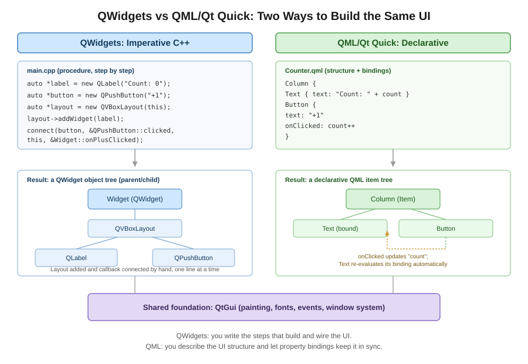

# 16장. QML과 Qt Quick 연동 기초

📖 [◀ 목차](00-목차.md) | [◀ 이전: 15장. 네트워크 프로그래밍](ch15-네트워크프로그래밍.md) | [다음: 17장. 배포와 패키징 ▶](ch17-배포와패키징.md)

---

## 16.1 이 장에서 다루는 것

1장에서 이야기했듯이 이 책은 처음부터 끝까지 QWidgets를 중심에 두고 진행되었습니다. 버튼과 레이아웃을 C++ 코드로 직접 배치하고, 시그널과 슬롯으로 로직을 연결하고, 모델/뷰 프레임워크로 데이터를 화면에 뿌리는 방식은 모두 QWidgets의 방식입니다. 이 방식은 여전히 수많은 실무 데스크톱 애플리케이션(사무용 도구, 엔지니어링 소프트웨어, 산업용 제어 프로그램 등)에서 표준으로 사용되고 있으며, 앞선 15개 장에서 배운 내용만으로도 상당히 복잡한 애플리케이션을 만들 수 있습니다.

다만 Qt를 다루다 보면 QML과 Qt Quick이라는 이름을 자주 마주치게 됩니다. 이 장에서는 QWidgets 중심의 학습 흐름을 벗어나지 않는 선에서, QML이 무엇인지, 기존 QWidgets 프로젝트에 QML 화면을 부분적으로 도입하려면 어떻게 해야 하는지, 그리고 C++과 QML이 서로 데이터를 주고받는 기본 개념을 살펴봅니다. QML 자체를 깊이 있게 다루는 것은 이 책의 범위를 벗어나므로, "이런 것이 있고 이렇게 연동할 수 있다"는 감을 잡는 데 목적을 둡니다.

## 16.2 QML과 Qt Quick 기본 문법

QML(Qt Modeling Language)은 UI의 구조와 모양을 선언적(declarative)으로 기술하는 언어입니다. C++ 코드처럼 "위젯을 생성하고, 레이아웃에 추가하고, 속성을 설정하는" 절차를 한 줄씩 작성하는 대신, 화면에 무엇이 어떻게 있어야 하는지를 트리 구조로 "선언"합니다. QML 코드는 `.qml` 확장자를 가진 파일에 작성하며, Qt Quick 모듈이 QML 엔진과 기본 UI 요소(Item, Rectangle, Text 등)를 제공합니다.

다음은 사각형 안에 글자가 있고, 클릭하면 색이 바뀌는 아주 단순한 QML 예제입니다.

```qml
// ColorBox.qml
import QtQuick

Rectangle {
    id: box
    width: 200
    height: 120
    color: "lightsteelblue"
    radius: 8

    Text {
        anchors.centerIn: parent
        text: "클릭해 보세요"
        font.pixelSize: 16
    }

    MouseArea {
        anchors.fill: parent
        onClicked: {
            box.color = (box.color === "lightsteelblue") ? "tomato" : "lightsteelblue"
        }
    }
}
```

이 짧은 코드에서 QML의 기본 개념을 몇 가지 확인할 수 있습니다.

- **`import QtQuick`**: Qt Quick 모듈이 제공하는 기본 요소(Item, Rectangle, Text, MouseArea 등)를 사용하겠다는 선언입니다.
- **요소의 중첩으로 트리를 구성**: `Rectangle` 안에 `Text`와 `MouseArea`가 중첩되어 있습니다. 이는 QWidgets에서 부모 위젯 안에 자식 위젯을 두는 것과 비슷한 개념이지만, 레이아웃 매니저를 별도로 만드는 대신 `anchors` 같은 속성으로 위치를 지정합니다.
- **`id`**: 요소에 이름을 붙여 QML 내부의 다른 위치에서 그 요소를 참조할 수 있게 합니다. 위 예제의 `box`가 그 예입니다.
- **속성(property)과 바인딩**: `width`, `height`, `color`처럼 `이름: 값` 형태로 속성을 설정합니다. 속성 값에는 상수뿐 아니라 자바스크립트 표현식도 쓸 수 있고, 참조한 다른 속성이 바뀌면 자동으로 값이 갱신되는 바인딩(binding)이 QML의 핵심 특징 중 하나입니다.
- **시그널 핸들러**: `onClicked`처럼 `on요소이름` 형태로 시그널에 대응하는 핸들러를 작성합니다. `MouseArea`는 클릭, 눌림, 뗌 같은 마우스 동작을 감지해 시그널을 발생시키는 투명한 영역입니다.

QWidgets의 `QVBoxLayout`, `QHBoxLayout`에 대응하는 개념으로는 `Column`, `Row`, `Grid` 같은 배치용 요소가 있습니다.

```qml
import QtQuick

Column {
    spacing: 8

    Text { text: "이름" }
    Text { text: "이메일" }
    Text { text: "가입일" }
}
```

QML은 이 외에도 애니메이션(`NumberAnimation`, `Behavior`), 상태 전환(`State`, `Transition`), 모델/뷰 요소(`ListView`, `Repeater`) 등을 풍부하게 제공하지만, 이 책에서는 자세히 다루지 않습니다. 여기서 기억할 것은 QML이 "선언적으로 UI 트리와 속성 바인딩을 기술하는 언어"라는 점과, 실제 파일 확장자가 `.qml`이라는 점입니다.

## 16.3 QWidgets 애플리케이션에 QML 화면 내장하기

기존에 QWidgets로 만들어진 애플리케이션이라고 해서 QML을 전혀 쓸 수 없는 것은 아닙니다. Qt는 QWidgets 화면 일부에 QML로 만든 화면을 끼워 넣을 수 있는 방법을 제공합니다. 대표적으로 `QQuickWidget`과 `QQuickView` 두 가지가 있습니다.

### 16.3.1 QQuickWidget

`QQuickWidget`은 `QWidget`을 상속한 클래스로, QML 장면을 오프스크린 이미지로 렌더링한 뒤 위젯 화면에 그려 줍니다. `QWidget`의 자손이기 때문에 기존 레이아웃 시스템(`QVBoxLayout`, `QGridLayout` 등)에 다른 위젯들과 똑같이 추가할 수 있다는 것이 가장 큰 장점입니다. 기존 QWidgets 프로젝트에 QML 화면 하나를 자연스럽게 끼워 넣고 싶을 때 가장 먼저 고려할 만한 방법입니다.

`QQuickWidget`을 사용하려면 프로젝트에 관련 모듈을 추가해야 합니다.

```
# .pro 파일
QT += quickwidgets
```

```cmake
# CMakeLists.txt
find_package(Qt6 REQUIRED COMPONENTS QuickWidgets)
target_link_libraries(myapp PRIVATE Qt6::QuickWidgets)
```

다음은 `QMainWindow`의 중앙 위젯에 QML 화면을 내장하는 예제입니다.

```cpp
// mainwindow.h
#pragma once

#include <QMainWindow>

class QQuickWidget;

class MainWindow : public QMainWindow
{
    Q_OBJECT

public:
    explicit MainWindow(QWidget *parent = nullptr);

private:
    QQuickWidget *m_quickWidget;
};
```

```cpp
// mainwindow.cpp
#include "mainwindow.h"

#include <QQuickWidget>
#include <QDockWidget>
#include <QUrl>

MainWindow::MainWindow(QWidget *parent)
    : QMainWindow(parent)
{
    m_quickWidget = new QQuickWidget(this);

    // QML의 루트 요소 크기를 QQuickWidget의 크기에 맞춰 자동으로 늘리거나 줄인다.
    m_quickWidget->setResizeMode(QQuickWidget::SizeRootObjectToView);

    // 리소스 시스템(.qrc)에 등록해 둔 QML 파일을 불러온다.
    m_quickWidget->setSource(QUrl("qrc:/qml/ColorBox.qml"));

    // 기존 QWidgets 코드와 마찬가지로 도크 위젯이나 중앙 위젯으로 배치할 수 있다.
    setCentralWidget(m_quickWidget);
}
```

이 예제에서 볼 수 있듯, `QQuickWidget`을 다루는 코드는 다른 QWidgets 코드와 거의 다르지 않습니다. `setSource()`로 어떤 QML 파일을 보여줄지 지정하고, `setCentralWidget()`이나 `layout->addWidget()`으로 다른 위젯들처럼 배치하면 됩니다.

### 16.3.2 QQuickView와 createWindowContainer

`QQuickView`는 `QQuickWidget`과 달리 `QWidget`이 아니라 `QWindow`를 상속합니다. 즉 그 자체로는 위젯 트리에 들어갈 수 없는 독립적인 네이티브 창입니다. `QQuickView`는 QML 장면을 오프스크린 이미지로 거치지 않고 직접 화면에 렌더링하기 때문에 일반적으로 `QQuickWidget`보다 렌더링 성능이 좋습니다.

`QQuickView`를 기존 QWidgets 레이아웃 안에 넣고 싶다면, `QWidget::createWindowContainer()`라는 정적 함수로 `QWindow`를 감싸는 래퍼 위젯을 만들어야 합니다.

```cpp
#include <QQuickView>
#include <QWidget>
#include <QVBoxLayout>
#include <QUrl>

// ...

auto *quickView = new QQuickView();
quickView->setResizeMode(QQuickView::SizeRootObjectToView);
quickView->setSource(QUrl("qrc:/qml/ColorBox.qml"));

// QWindow를 QWidget처럼 다룰 수 있게 감싸주는 컨테이너를 만든다.
QWidget *container = QWidget::createWindowContainer(quickView, this);

auto *layout = new QVBoxLayout(this);
layout->addWidget(container);
```

`createWindowContainer()`로 만든 위젯은 일반 위젯과 완전히 동일하게 동작하지는 않습니다. 예를 들어 이 컨테이너 위에 다른 위젯을 겹쳐서 그리는 것과 같은 특수한 배치는 제대로 동작하지 않을 수 있습니다. 이런 제약 때문에, 특별히 렌더링 성능이 중요한 경우가 아니라면 대부분의 QWidgets 프로젝트에서는 다루기 간단한 `QQuickWidget`을 우선적으로 고려하고, 성능이 정말 문제가 될 때 `QQuickView` + `createWindowContainer()` 조합을 검토하는 것이 실무적인 순서입니다.

## 16.4 C++과 QML 사이의 데이터 연동

QML 화면을 그냥 보여주는 것만으로는 실제 애플리케이션에 쓸모가 없습니다. C++ 쪽의 데이터를 QML에 보여주거나, QML에서 발생한 사용자 동작을 C++ 코드가 알 수 있어야 합니다. Qt는 이를 위한 몇 가지 표준적인 방법을 제공합니다. 여기서는 자세한 구현보다는 각 방법이 어떤 역할을 하는지 개념 위주로 소개합니다.

### 16.4.1 setContextProperty()로 C++ 객체를 QML에 노출하기

가장 간단한 연동 방법은 C++에서 만든 `QObject` 파생 객체를 QML 쪽에 이름 있는 전역 변수처럼 등록하는 것입니다. `QQuickWidget::rootContext()` 또는 `QQuickView::rootContext()`가 반환하는 `QQmlContext` 객체의 `setContextProperty()`를 사용합니다.

```cpp
#include <QQmlContext>

// backend는 QObject를 상속한 C++ 객체
m_quickWidget->rootContext()->setContextProperty("backend", backend);
m_quickWidget->setSource(QUrl("qrc:/qml/Dashboard.qml"));
```

이렇게 등록하면 QML 코드 안에서 `backend`라는 이름으로 그 C++ 객체에 바로 접근할 수 있습니다.

```qml
Text {
    text: "카운터: " + backend.counter
}

MouseArea {
    anchors.fill: parent
    onClicked: backend.increment()
}
```

### 16.4.2 Q_PROPERTY로 값 노출하고 변경 알리기

위 예제의 `backend.counter`처럼 QML에서 C++ 객체의 값을 속성처럼 읽으려면, C++ 클래스에 `Q_PROPERTY` 매크로로 프로퍼티를 선언해야 합니다. `Q_PROPERTY`는 READ 함수, 필요하다면 WRITE 함수, 그리고 값이 바뀔 때 발생시킬 NOTIFY 시그널을 지정합니다.

```cpp
// backend.h
#pragma once

#include <QObject>

class Backend : public QObject
{
    Q_OBJECT
    Q_PROPERTY(int counter READ counter NOTIFY counterChanged)

public:
    explicit Backend(QObject *parent = nullptr) : QObject(parent) {}

    int counter() const { return m_counter; }

    Q_INVOKABLE void increment()
    {
        ++m_counter;
        emit counterChanged();
    }

signals:
    void counterChanged();

private:
    int m_counter = 0;
};
```

`counterChanged` 시그널을 NOTIFY로 지정해 두면, QML 쪽의 `backend.counter`를 사용하는 화면 요소들은 이 시그널이 발생할 때마다 자동으로 값을 다시 읽어 화면을 갱신합니다. 즉 C++ 코드가 값을 바꾸고 시그널만 발생시키면, QML 쪽 바인딩이 알아서 최신 상태를 반영하는 것입니다.

### 16.4.3 Q_INVOKABLE로 QML에서 C++ 함수 호출하기

위 예제의 `increment()` 함수 선언 앞에 붙은 `Q_INVOKABLE`은, 이 함수를 QML 코드에서 마치 자바스크립트 함수처럼 호출할 수 있도록 노출한다는 의미입니다. 슬롯(slot)으로 선언된 함수도 기본적으로 QML에서 호출할 수 있지만, 시그널/슬롯 연결과 무관하게 QML에서 호출할 목적의 일반 멤버 함수라면 `Q_INVOKABLE`을 붙이는 것이 의도를 더 명확히 드러냅니다.

정리하면, C++과 QML 사이의 데이터 연동에는 대략 다음과 같은 대응 관계가 있습니다.

| C++ 쪽 요소 | QML에서의 역할 |
|---|---|
| `setContextProperty("이름", 객체)` | QML 전역에서 그 이름으로 C++ 객체 자체에 접근 |
| `Q_PROPERTY(... NOTIFY 시그널)` | QML에서 속성처럼 읽고, 값이 바뀌면 자동으로 화면 갱신 |
| `Q_INVOKABLE` 함수 / `public slots` | QML 코드에서 함수처럼 호출 가능 |
| C++ 쪽 `signal` | QML의 `Connections` 요소 등으로 QML에서도 감지 가능 |

이 외에도 `qmlRegisterType<T>()`을 사용하면 특정 C++ 클래스를 QML 안에서 직접 `MyType { ... }`처럼 하나의 요소로 인스턴스화할 수 있게 등록할 수 있습니다. 이는 `setContextProperty()`로 이미 만들어진 객체 하나를 노출하는 것과 달리, QML 쪽에서 필요할 때마다 새 인스턴스를 만들 수 있게 해주는 방법입니다. 다만 이 책에서는 개념만 언급하고 자세한 사용법은 다루지 않습니다.

## 16.5 언제 QWidgets를, 언제 QML을 선택할 것인가

아래 그림은 지금까지 이 책에서 다룬 QWidgets 방식과, 이 장에서 살펴본 QML/Qt Quick 방식이 UI를 구성하는 접근 방법의 차이를 보여줍니다.



두 방식 중 무엇을 선택할지는 프로젝트의 성격에 따라 달라집니다. 지금까지 배운 내용을 바탕으로 실무적인 기준을 정리하면 다음과 같습니다.

**QWidgets가 더 적합한 경우**

- 표, 트리, 입력 폼처럼 정형화된 데이터 조회/입력 화면이 중심인 사무용·엔지니어링 소프트웨어
- 운영체제의 네이티브 룩앤필(look and feel)을 그대로 따르는 것이 중요한 애플리케이션
- 마우스와 키보드 중심의 전통적인 데스크톱 워크플로
- 이 책에서 다룬 모델/뷰 프레임워크, 다이얼로그, 도킹 시스템 등 QWidgets 생태계의 성숙한 구성요소를 최대한 활용하고 싶은 경우

**QML/Qt Quick이 더 적합한 경우**

- 터치 조작이 중심이 되는 화면, 또는 모바일/임베디드 디바이스의 UI
- 애니메이션과 화려한 시각 효과, 유동적인 레이아웃 전환이 자주 필요한 화면
- GPU 가속 렌더링의 이점을 살릴 수 있는 대시보드, 게이지, 실시간 그래프 등

**두 방식을 함께 쓰는 경우**

실무에서는 둘 중 하나만 선택하기보다, 기존 QWidgets 애플리케이션의 특정 패널만 QML로 대체하는 절충안도 자주 사용됩니다. 예를 들어 산업 현장의 계측 프로그램이 대부분 QWidgets 기반의 표와 설정 화면으로 이루어져 있더라도, 실시간 센서 값을 보여주는 애니메이션 게이지 패널 하나만 QML로 만들어 `QQuickWidget`으로 끼워 넣는 식입니다. 이렇게 하면 기존에 익숙한 QWidgets 코드 자산을 그대로 유지하면서도, QML이 잘하는 부분(애니메이션, 유려한 시각 효과)만 선택적으로 가져올 수 있습니다.

결국 QWidgets와 QML은 경쟁 관계가 아니라, 화면의 성격에 따라 선택하거나 섞어 쓸 수 있는 도구입니다. 이 책은 QWidgets를 중심으로 데스크톱 GUI 프로그래밍의 기초를 다지는 데 집중했지만, 이 장에서 살펴본 개념을 기억해 두면 이후 QML이 필요한 프로젝트를 만나더라도 당황하지 않고 필요한 부분만 점진적으로 도입할 수 있을 것입니다.

## 요약

- 이 책은 QWidgets를 중심으로 다루었으며, QML/Qt Quick은 선언적 UI 언어와 그 실행 엔진으로 QWidgets와는 다른 방식으로 UI를 구성합니다.
- QML은 `.qml` 파일에 `Rectangle`, `Text`, `MouseArea` 같은 요소를 계층적으로 배치하고, 속성 바인딩과 시그널 핸들러(`onClicked` 등)로 동작을 기술합니다.
- 기존 QWidgets 애플리케이션에 QML 화면을 내장할 때는 `QWidget`을 상속한 `QQuickWidget`을 우선 고려하고, 렌더링 성능이 특히 중요하다면 `QQuickView`와 `QWidget::createWindowContainer()` 조합을 검토합니다.
- C++과 QML은 `setContextProperty()`로 객체를 노출하고, `Q_PROPERTY`(READ/NOTIFY)로 값과 변경 통지를, `Q_INVOKABLE`로 호출 가능한 함수를 주고받으며 연동합니다.
- QWidgets는 정형화된 데스크톱 업무용 화면에, QML은 터치/애니메이션 중심 화면에 강점이 있으며, 실무에서는 기존 QWidgets 애플리케이션의 일부 패널만 QML로 대체하는 하이브리드 구성도 널리 사용됩니다.

## 연습문제

1. QML이 "선언적" 언어라고 불리는 이유를 QWidgets에서 위젯을 생성하고 배치하는 절차적(imperative) 방식과 비교하여 설명하시오.
2. `QQuickWidget`과 `QQuickView`(+`createWindowContainer()`)의 차이를 상속 구조와 렌더링 방식 관점에서 설명하고, 각각 어떤 상황에 더 적합한지 서술하시오.
3. `Q_PROPERTY`에 NOTIFY 시그널을 지정하지 않으면 QML 쪽에서 어떤 문제가 생길 수 있는지 16.4.2절의 `Backend` 예제를 근거로 설명하시오.
4. `setContextProperty()`로 C++ 객체를 QML에 노출하는 방법과, `qmlRegisterType()`으로 타입을 등록해 QML에서 직접 인스턴스화하는 방법의 차이를 설명하시오.
5. 기존 QWidgets 기반의 사내 재고 관리 프로그램에 "출고량 추이를 보여주는 애니메이션 그래프 패널"을 추가하려고 한다. 이 패널을 QWidgets로 구현할 때와 QML로 구현해 QQuickWidget으로 내장할 때의 장단점을 비교하여 서술하시오.


---

📖 [◀ 목차](00-목차.md) | [◀ 이전: 15장. 네트워크 프로그래밍](ch15-네트워크프로그래밍.md) | [다음: 17장. 배포와 패키징 ▶](ch17-배포와패키징.md)
