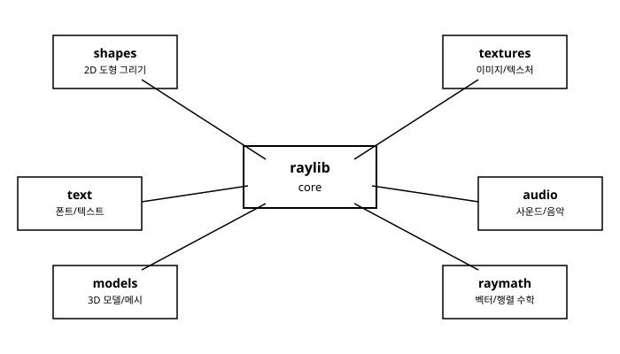

# 1장. raylib란 무엇인가

[◀ 이전: 목차](00-목차.md) | [📖 목차](00-목차.md) | [다음: 2장. 개발 환경 설정과 첫 창 ▶](ch02-개발환경설정과첫창.md)


프로그래밍을 배우다 보면 누구나 한 번쯤 "화면에 뭔가 움직이는 걸 직접 만들어보고 싶다"는 생각을 한다. 문제는 그 첫걸음이 생각보다 험난하다는 데 있다. 창 하나를 띄우기 위해 운영체제별 API 문서를 뒤지고, 그래픽 드라이버 초기화 코드를 수십 줄 작성하고, 렌더링 파이프라인을 설정하다 보면 정작 "게임을 만들고 싶다"는 원래의 동기는 온데간데없이 사라지기 쉽다. raylib는 바로 이 지점에서 태어난 라이브러리다.

이번 장에서는 raylib가 어떤 배경에서 만들어졌고, 어떤 철학으로 설계되었으며, 실제로 어떤 곳에서 쓰이고 있는지 살펴본다. 또한 raylib 내부가 어떤 모듈들로 구성되어 있는지 큰 그림을 그려봄으로써, 앞으로 이 책에서 다룰 내용들이 전체 그림에서 어디에 해당하는지 미리 감을 잡아본다.

## raylib의 탄생 배경

raylib는 스페인의 프로그래머 라몬 산타마리아(Ramon Santamaria, 온라인에서는 흔히 raysan5라는 이름으로 활동한다)가 시작한 오픈소스 프로젝트다. 그는 대학에서 비디오게임 개발을 가르치는 강사이기도 했는데, 학생들에게 그래픽스 프로그래밍의 기본 개념(창 띄우기, 도형 그리기, 입력 처리, 텍스처 다루기 등)을 가르칠 때마다 매번 같은 문제에 부딪혔다. 기존의 그래픽 라이브러리들은 대부분 저수준 API를 직접 다루도록 설계되어 있어서, 학생이 "삼각형 하나를 화면에 그린다"는 개념을 이해하기도 전에 그래픽스 컨텍스트 생성, 버퍼 관리, 셰이더 컴파일 같은 부수적인 지식부터 익혀야 했다.

이런 경험에서 출발해 산타마리아는 교육용으로 쓸 수 있을 만큼 단순하면서도, 실제로 쓸만한 게임을 만들 수 있을 정도로 충분히 강력한 라이브러리를 직접 만들기 시작했다. 이것이 raylib의 시작이다. 이후 raylib는 학교 안에서만 쓰이는 도구를 넘어, 전 세계 개발자들이 참여하는 활발한 오픈소스 프로젝트로 성장했다. GitHub에서 누구나 소스 코드를 확인할 수 있으며, zlib/libpng 라이선스로 배포되어 상업적 이용을 포함해 자유롭게 사용할 수 있다.

## 설계 철학: "enjoy game programming"

raylib 공식 사이트와 문서 곳곳에는 "enjoy game programming"이라는 문구가 등장한다. 이는 단순한 슬로건이 아니라 라이브러리 전체를 관통하는 설계 원칙이다. raylib를 만든 목적은 화려한 기능을 최대한 많이 욱여넣는 것이 아니라, 프로그래머가 그래픽스 API의 세부 사항에 발목 잡히지 않고 "만들고 싶은 것"에 곧바로 집중할 수 있게 돕는 것이다.

이 철학은 실제 코드에서 명확하게 드러난다. raylib로 창을 하나 띄우고 그 안에 텍스트를 표시하는 데 필요한 코드는 단 몇 줄이면 충분하다.

```c
#include "raylib.h"

int main(void)
{
    InitWindow(800, 450, "raylib 첫 창");

    while (!WindowShouldClose())
    {
        BeginDrawing();
        ClearBackground(RAYWHITE);
        DrawText("Hello, raylib!", 190, 200, 20, BLACK);
        EndDrawing();
    }

    CloseWindow();
    return 0;
}
```

별도의 그래픽 카드 초기화 코드도, 복잡한 이벤트 루프 설정도 없다. `InitWindow`로 창을 열고, `while` 반복문 안에서 매 프레임 그림을 그리고, 마지막에 `CloseWindow`로 정리하는 것이 전부다. 이 예제의 각 함수가 정확히 무엇을 하는지는 2장에서 한 줄씩 자세히 다룬다.

이렇게 진입 장벽을 낮추는 대신 raylib가 포기한 것은 무엇일까? raylib는 최신 3A급 게임 엔진들이 제공하는 방대한 에디터, 물리 엔진, 네트워킹 스택 같은 것들을 기본으로 제공하지 않는다. 대신 그래픽스와 입력, 오디오처럼 게임 프로그래밍의 근본이 되는 부분을 아주 얇고 명확한 C API로 노출한다. 필요한 기능이 있다면 라이브러리가 대신 처리해주는 게 아니라, 개발자가 직접 코드로 구현하는 경우가 많다. 이 점이 오히려 raylib의 큰 장점이기도 하다. 내부에서 무슨 일이 일어나는지 감춰지지 않고 눈에 보이기 때문에, 배우는 사람 입장에서는 "블랙박스" 없이 원리를 이해하며 성장할 수 있다.

## raylib가 활약하는 분야

raylib의 이런 단순함과 즉각적인 피드백은 몇 가지 특정한 상황에서 특히 큰 힘을 발휘한다.

**게임 잼(game jam)**. 게임 잼은 보통 48시간에서 일주일 정도의 짧은 시간 안에 아이디어를 실제로 동작하는 게임으로 만들어내는 행사다. 이런 환경에서는 엔진 설정에 시간을 쓸 여유가 없다. raylib는 설치 후 몇 분 안에 첫 화면을 띄울 수 있고, 복잡한 프로젝트 구조 없이도 아이디어를 빠르게 구현할 수 있어 게임 잼 참가자들 사이에서 꾸준히 사랑받고 있다.

**게임 프로그래밍 교육**. 앞서 이야기했듯 raylib는 애초에 교육 목적으로 태어난 라이브러리다. 벡터 수학, 충돌 감지, 게임 루프 같은 개념을 가르칠 때, 학생이 그래픽스 API의 세부 구현에 시간을 뺏기지 않고 개념 자체에 집중할 수 있게 해준다. 이 책 역시 그런 이유로 raylib를 교재로 선택했다.

**빠른 프로토타이핑**. 게임 디자이너나 엔지니어가 새로운 게임 메커니즘을 시험해보고 싶을 때, 무거운 엔진을 띄우고 프로젝트를 세팅하는 것보다 raylib로 간단한 프로토타입을 짜는 편이 훨씬 빠를 때가 많다. 도형 몇 개로 캐릭터를 표현하고 움직임과 규칙만 검증하는 식의 개발에 raylib는 안성맞춤이다.

**툴 제작**. 게임 개발 과정에서 필요한 레벨 에디터, 애니메이션 뷰어, 데이터 시각화 도구 같은 보조 프로그램을 만들 때도 raylib가 자주 쓰인다. 즉시 모드(immediate mode) 방식의 그리기 API와 간단한 입력 처리 덕분에, 이런 소규모 GUI 도구를 빠르게 뚝딱 만들어낼 수 있다.

## raylib의 모듈 구성

raylib는 기능별로 명확하게 나뉜 몇 개의 모듈로 구성되어 있다. 각 모듈은 독립적인 역할을 담당하지만, 모두 raylib라는 하나의 라이브러리 안에 통합되어 있어서 별도의 설정 없이 함께 사용할 수 있다. 전체 구조를 먼저 그림으로 살펴보자.



- **core**: 창 생성과 관리, 키보드·마우스·게임패드 입력 처리, 프레임 타이밍, 기본적인 수학 유틸리티 등 raylib의 가장 근본적인 기능을 담당한다. 이번 장 예제에서 사용한 `InitWindow`, `WindowShouldClose`, `CloseWindow`가 모두 core 모듈에 속한다. 2장과 4장에서 자세히 다룬다.
- **shapes**: 사각형, 원, 선, 삼각형 같은 2D 도형을 그리는 함수들을 제공한다. `DrawRectangle`, `DrawCircle` 같은 함수가 여기 속하며, 3장에서 집중적으로 다룬다.
- **textures**: 이미지 파일을 불러와 화면에 그릴 수 있는 텍스처로 변환하고 관리하는 기능을 담당한다. 스프라이트 기반 2D 게임을 만들 때 핵심이 되는 모듈로, 6장과 7장에서 다룬다.
- **text**: 폰트를 불러오고 화면에 문자열을 그리는 기능을 제공한다. 앞선 예제의 `DrawText`가 이 모듈에 속하며, 10장에서 자세히 살펴본다.
- **models**: 3D 모델과 메시를 불러오고 그리는 기능을 담당한다. 12장과 13장에서 3D 프로그래밍을 다룰 때 등장한다.
- **audio**: 효과음과 배경음악을 재생하고 제어하는 기능을 제공한다. 9장에서 다룬다.

이 밖에도 raylib에는 벡터, 행렬, 쿼터니언 연산을 돕는 raymath라는 보조 헤더가 함께 제공된다. 게임 프로그래밍에서 빼놓을 수 없는 벡터 수학은 5장에서 raymath와 함께 다룬다.

이 책에서는 이 모듈들을 순서대로 하나씩 짚어가며, 각 장이 끝날 때마다 여러분이 직접 실행해볼 수 있는 예제 코드를 통해 개념을 확인한다.

## 다양한 언어 바인딩, 그리고 이 책의 선택

raylib는 C 언어로 작성된 라이브러리다. 하지만 raylib의 간결한 API 덕분에 커뮤니티에서 만든 바인딩(binding)을 통해 C++, C#, Python, Go, Rust, Lua 등 수십 개의 다른 언어에서도 raylib를 사용할 수 있다. 이런 바인딩들은 원본 C API의 함수 이름과 사용법을 최대한 그대로 유지하는 경우가 많아서, 하나의 언어로 raylib를 익혀두면 다른 언어의 바인딩으로 옮겨가는 것도 그리 어렵지 않다.

이 책에서는 raylib가 원래 만들어진 언어인 C를 그대로 사용해 진행한다. 바인딩을 거치지 않고 원본 API를 직접 다루기 때문에 raylib의 공식 문서나 예제 코드와 가장 매끄럽게 연결되며, C의 단순한 문법 덕분에 오히려 라이브러리 자체의 동작 원리에 더 집중할 수 있다는 장점도 있다. 다음 장에서는 이 C 환경을 실제로 컴퓨터에 구축하고, 첫 창을 띄워보는 과정을 진행한다.

## 요약

- raylib는 라몬 산타마리아가 대학에서 게임 프로그래밍을 가르치던 경험에서 출발해 만든 오픈소스 그래픽스/게임 라이브러리다.
- "enjoy game programming"이라는 철학 아래, 복잡한 보일러플레이트 없이 몇 줄의 코드만으로 창을 띄우고 그림을 그릴 수 있도록 설계되었다.
- 게임 잼, 게임 프로그래밍 교육, 빠른 프로토타이핑, 개발 도구 제작 등 즉각적인 결과 확인이 중요한 상황에서 특히 널리 쓰인다.
- raylib는 core, shapes, textures, text, models, audio 등 기능별 모듈로 구성되어 있으며, 이 책은 이 순서를 따라가며 각 모듈을 다룬다.
- raylib는 원래 C로 작성되었고, C++/C#/Python/Go 등 다양한 언어 바인딩이 존재한다. 이 책은 원본 그대로인 C를 사용한다.

## 연습문제

1. raylib가 처음 만들어진 배경을 자신의 말로 한두 문장으로 설명해보자. 어떤 문제를 해결하기 위해 시작되었는가?
2. "enjoy game programming"이라는 raylib의 설계 철학이 실제 코드(이번 장의 예제)에서 어떻게 드러나는지 구체적으로 짚어보자.
3. raylib가 게임 잼에서 특히 인기 있는 이유는 무엇일지, raylib의 특징과 게임 잼이라는 행사의 특성을 연결지어 설명해보자.
4. raylib의 여섯 개 핵심 모듈(core, shapes, textures, text, models, audio) 중 자신이 가장 먼저 다뤄보고 싶은 모듈은 무엇이며, 그 이유는 무엇인가?
5. raylib에는 다양한 언어 바인딩이 존재함에도 이 책이 C를 선택한 이유를 본문 내용을 바탕으로 정리해보자.

---

[◀ 이전: 목차](00-목차.md) | [📖 목차](00-목차.md) | [다음: 2장. 개발 환경 설정과 첫 창 ▶](ch02-개발환경설정과첫창.md)
