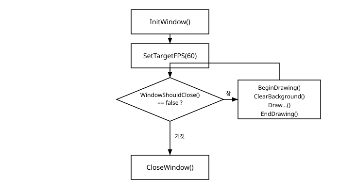

# 2장. 개발 환경 설정과 첫 창

[◀ 이전: 1장. raylib란 무엇인가](ch01-raylib란무엇인가.md) | [📖 목차](00-목차.md) | [다음: 3장. 게임 루프와 기본 도형 그리기 ▶](ch03-게임루프와기본도형그리기.md)


1장에서 raylib가 어떤 라이브러리이고 어떤 철학으로 만들어졌는지 살펴봤다면, 이번 장에서는 실제로 손을 움직여볼 차례다. raylib를 컴퓨터에 설치하고, CMake로 프로젝트를 구성해서 raylib를 링크하고, 마지막으로 화면에 글자 하나를 띄우는 "Hello, raylib!" 예제를 처음부터 끝까지 완성해본다.

## raylib 설치하기

raylib를 설치하는 방법은 여러 가지가 있지만, 이 책에서는 크게 두 가지 경로를 소개한다.

### 방법 1: 공식 사이트에서 미리 빌드된 라이브러리 받기

raylib 공식 사이트(https://www.raylib.com)에는 Windows, macOS, Linux용으로 미리 컴파일된 라이브러리 파일을 내려받을 수 있는 링크가 마련되어 있다. 압축을 풀면 헤더 파일(`raylib.h`)과 정적/동적 라이브러리 파일이 들어있는데, 이를 컴파일러가 찾을 수 있는 경로에 두고 컴파일 옵션에서 헤더 경로와 라이브러리 경로, 그리고 링크할 라이브러리 이름을 지정해주면 된다. 이 방식은 별도의 패키지 관리자 없이 빠르게 시작할 수 있다는 장점이 있지만, 경로를 직접 관리해야 하고 다른 컴퓨터에서 같은 프로젝트를 빌드하려면 설정을 다시 맞춰야 한다는 번거로움이 있다.

### 방법 2: 패키지 관리자로 설치하기

이런 번거로움을 줄여주는 것이 vcpkg 같은 C++ 패키지 관리자다. 터미널에서 다음 한 줄이면 raylib를 설치할 수 있다.

```
vcpkg install raylib
```

vcpkg로 설치하면 라이브러리 파일의 경로를 일일이 손으로 지정할 필요 없이, CMake의 `find_package` 메커니즘을 통해 raylib를 자동으로 찾아 링크할 수 있다. 이는 뒤에서 살펴볼 CMake 설정과 자연스럽게 맞물리며, 팀원들과 같은 프로젝트를 공유하거나 다른 컴퓨터로 프로젝트를 옮길 때도 설정이 그대로 재현된다는 장점이 있다. C++ 개발 환경 자체를 vcpkg와 CMake로 구축하는 방법을 더 자세히 알고 싶다면 관련 서적을 참고해도 좋다. 이 책에서는 raylib 사용에 필요한 부분만 짚고 넘어간다.

이 책의 예제들은 어떤 방식으로 raylib를 설치했든 상관없이 동일하게 동작한다. 중요한 것은 컴파일러가 `raylib.h` 헤더와 raylib 라이브러리 파일을 찾을 수 있도록 경로가 올바르게 설정되어 있는가이다.

## CMake로 raylib 링크하기

vcpkg로 raylib를 설치했다면, CMake 프로젝트에서 다음과 같이 최소한의 설정만으로 raylib를 링크할 수 있다.

```cmake
cmake_minimum_required(VERSION 3.15)
project(hello_raylib C)

set(CMAKE_C_STANDARD 99)

find_package(raylib REQUIRED)

add_executable(hello_raylib main.c)
target_link_libraries(hello_raylib PRIVATE raylib)
```

`find_package(raylib REQUIRED)`는 vcpkg가 설치한 raylib 패키지를 찾아 `raylib`라는 이름의 CMake 타깃으로 만들어준다. 이후 `target_link_libraries`에서 이 타깃을 지정해주기만 하면, 헤더 경로와 라이브러리 경로, 그리고 필요한 경우 raylib가 의존하는 OpenGL 같은 시스템 라이브러리까지 CMake가 알아서 연결해준다. 개발자가 직접 신경 써야 할 부분은 거의 없다.

vcpkg를 CMake와 함께 사용할 때는 보통 프로젝트를 구성(configure)할 때 vcpkg의 툴체인 파일을 지정해준다. 예를 들어 명령줄에서는 다음과 같은 형태로 사용한다.

```
cmake -B build -S . -DCMAKE_TOOLCHAIN_FILE=[vcpkg 경로]/scripts/buildsystems/vcpkg.cmake
```

이렇게 구성한 뒤 빌드하면, `find_package(raylib REQUIRED)`가 vcpkg가 설치해둔 raylib를 정상적으로 찾아낸다. 이 책에서는 이 설정이 이미 되어 있다고 가정하고, 이후 장부터는 CMake 설정에 대한 언급 없이 곧바로 C 코드에 집중한다.

## 게임 루프의 기본 구조

raylib로 만드는 거의 모든 프로그램은 동일한 기본 골격을 따른다. 이 골격을 흔히 **게임 루프(game loop)**라고 부른다. 게임이든, 간단한 시각화 도구든, raylib로 만드는 프로그램은 대부분 다음 네 단계를 거친다.

1. `InitWindow()`로 창을 생성한다.
2. `SetTargetFPS()`로 초당 프레임 수를 설정한다.
3. `WindowShouldClose()`가 참이 될 때까지 반복되는 루프 안에서, 매 프레임 화면을 그린다.
4. 루프가 끝나면 `CloseWindow()`로 자원을 정리한다.

이 흐름을 그림으로 나타내면 다음과 같다.



각 단계가 실제로 무엇을 하는지 하나씩 짚어보자.

**`InitWindow(width, height, "제목")`**. 지정한 너비와 높이를 가진 창을 만들고, 동시에 raylib 내부적으로 그래픽스 컨텍스트를 초기화한다. raylib로 만드는 프로그램에서 그래픽 관련 함수를 호출하기 전에 반드시 가장 먼저 호출해야 하는 함수다.

**`SetTargetFPS(60)`**. 프로그램이 초당 몇 프레임으로 실행될지를 지정한다. 이 값을 설정하지 않으면 프로그램은 컴퓨터가 낼 수 있는 최대 속도로 루프를 돌게 되어, 사양이 다른 컴퓨터마다 게임의 체감 속도가 달라지는 문제가 생길 수 있다. 보통 60을 지정해 초당 60프레임으로 고정하는 것이 일반적이다.

**`while (!WindowShouldClose())`**. 이 반복문이 바로 게임 루프의 몸통이다. `WindowShouldClose()`는 사용자가 창의 닫기 버튼을 누르거나 Esc 키를 눌렀을 때 참(true)을 반환한다. 즉 이 루프는 사용자가 프로그램을 종료하려는 신호를 보낼 때까지 계속 반복된다.

루프 안에서는 항상 다음 패턴이 반복된다.

- **`BeginDrawing()`**: 이번 프레임의 그리기 작업을 시작한다고 raylib에게 알린다.
- **`ClearBackground(RAYWHITE)`**: 화면을 지정한 색으로 지운다. 이전 프레임에 그렸던 내용이 남아있지 않도록, 매 프레임 가장 먼저 호출하는 것이 일반적이다. `RAYWHITE`는 raylib가 기본으로 제공하는 밝은 회백색 상수다.
- **도형이나 텍스트를 그리는 함수들**: `DrawText`, `DrawRectangle`, `DrawCircle` 같은 함수들이 이 사이에 위치한다. 이 함수들은 3장에서 본격적으로 다룬다.
- **`EndDrawing()`**: 이번 프레임의 그리기 작업이 끝났음을 알리고, 실제로 화면에 결과를 표시한다.

**`CloseWindow()`**. 루프를 빠져나온 뒤, 즉 사용자가 프로그램을 종료하려 할 때 호출한다. `InitWindow()`에서 할당했던 창과 그래픽스 관련 자원을 모두 정리한다.

이 네 단계의 흐름은 이후 장에서 다루는 거의 모든 예제 코드에서 반복된다. 지금 단계에서 이 구조를 확실히 익혀두면, 뒤에서 새로운 기능(입력 처리, 텍스처, 3D 등)을 배울 때마다 "이 코드가 루프의 어느 부분에 들어가는가"만 생각하면 되므로 훨씬 수월하게 따라갈 수 있다.

## Hello, raylib!

이제 지금까지 설명한 내용을 하나로 합쳐, 실제로 실행 가능한 첫 raylib 프로그램을 완성해보자. 이 프로그램은 800x450 크기의 창을 열고, 그 안에 "Hello, raylib!"라는 문구를 표시한다.

```c
#include "raylib.h"

int main(void)
{
    // 1. 창 생성: 너비 800, 높이 450, 제목은 "Hello, raylib!"
    InitWindow(800, 450, "Hello, raylib!");

    // 2. 초당 프레임 수를 60으로 고정
    SetTargetFPS(60);

    // 3. 게임 루프: 창을 닫으라는 신호가 올 때까지 반복
    while (!WindowShouldClose())
    {
        BeginDrawing();

        ClearBackground(RAYWHITE);
        DrawText("Hello, raylib!", 280, 200, 30, BLACK);

        EndDrawing();
    }

    // 4. 자원 정리
    CloseWindow();

    return 0;
}
```

이 코드를 CMake 설정과 함께 빌드하고 실행하면, 밝은 회백색 배경 위에 검은색 글씨로 "Hello, raylib!"라고 적힌 창이 뜬다. 창의 닫기 버튼을 누르거나 Esc 키를 누르면 `WindowShouldClose()`가 참이 되면서 루프를 빠져나오고, `CloseWindow()`가 호출되며 프로그램이 정상적으로 종료된다.

`DrawText` 함수는 순서대로 표시할 문자열, x좌표, y좌표, 글자 크기, 색상을 인자로 받는다. 여기서 사용한 `280`, `200`이라는 좌표는 800x450 창 안에서 글자가 대략 중앙 부근에 오도록 대충 맞춘 값이다. raylib의 좌표계는 화면 왼쪽 위를 원점 (0, 0)으로 삼고, x는 오른쪽으로, y는 아래쪽으로 증가한다는 점을 기억해두자. 텍스트를 픽셀 단위로 정확히 원하는 위치에 배치하는 방법은 10장에서 더 자세히 다룬다.

축하한다. 이제 여러분은 raylib로 창을 띄우고 화면에 무언가를 그리는 가장 기본적인 프로그램을 완성했다. 다음 장에서는 `DrawText` 외에 raylib가 제공하는 다양한 2D 도형 그리기 함수들을 살펴보고, 이 게임 루프 안에서 도형들을 움직이는 방법을 알아본다.

## 요약

- raylib는 공식 사이트에서 미리 빌드된 라이브러리를 내려받거나, `vcpkg install raylib`처럼 패키지 관리자를 통해 설치할 수 있다.
- CMake 프로젝트에서는 `find_package(raylib REQUIRED)`와 `target_link_libraries`만으로 raylib를 손쉽게 링크할 수 있다.
- raylib 프로그램의 기본 골격은 `InitWindow()` → `SetTargetFPS()` → `while (!WindowShouldClose())` 루프 → `CloseWindow()`라는 게임 루프 구조를 따른다.
- 루프 안에서는 `BeginDrawing()`으로 시작해 `ClearBackground()`로 화면을 지우고, 도형/텍스트를 그린 뒤 `EndDrawing()`으로 마무리하는 패턴이 매 프레임 반복된다.
- `DrawText("문자열", x, y, 글자크기, 색상)` 함수 하나만으로도 화면에 텍스트를 표시하는 완전한 raylib 프로그램을 작성할 수 있다.

## 연습문제

1. `InitWindow()`, `SetTargetFPS()`, `WindowShouldClose()`, `CloseWindow()` 각각이 게임 루프에서 어떤 역할을 하는지 자신의 말로 설명해보자.
2. `SetTargetFPS(60)`을 호출하지 않으면 프로그램에 어떤 문제가 생길 수 있는지 설명해보자.
3. 이번 장의 "Hello, raylib!" 예제를 직접 빌드하고 실행해본 뒤, 창 크기를 1024x600으로 바꾸고 텍스트가 화면 중앙 부근에 오도록 좌표를 조정해보자.
4. `ClearBackground(RAYWHITE)`를 루프 안에서 매 프레임 호출하지 않고 루프 시작 전에 딱 한 번만 호출하면 어떤 현상이 벌어질지 예상해보고, 실제로 코드를 바꿔 확인해보자.
5. `find_package(raylib REQUIRED)`가 CMake 빌드 과정에서 구체적으로 어떤 일을 하는지, 이번 장 내용을 바탕으로 정리해보자.

---

[◀ 이전: 1장. raylib란 무엇인가](ch01-raylib란무엇인가.md) | [📖 목차](00-목차.md) | [다음: 3장. 게임 루프와 기본 도형 그리기 ▶](ch03-게임루프와기본도형그리기.md)
