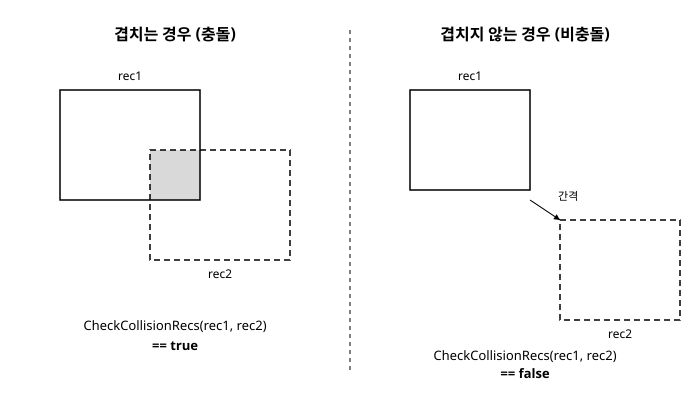

# 8장. 충돌 감지

[◀ 이전: 7장. 애니메이션 기초](ch07-애니메이션기초.md) | [📖 목차](00-목차.md) | [다음: 9장. 오디오 ▶](ch09-오디오.md)


지금까지 만든 예제들은 도형과 스프라이트를 화면에 그리고 움직이는 데 집중했습니다. 하지만 실제 게임을 게임답게 만드는 것은 오브젝트들이 "서로 부딪혔을 때" 벌어지는 일입니다. 캐릭터가 벽에 막히고, 총알이 적에게 맞으면 사라지고, 플레이어가 코인 위를 지나가면 코인을 먹는 것. 이 모든 상호작용의 출발점이 바로 충돌 감지(collision detection)입니다.

충돌 감지 자체는 사실 순수한 수학 문제입니다. "이 도형과 저 도형이 겹치는가?"를 좌표만으로 판단하는 것이지요. raylib은 이 계산을 직접 구현할 필요 없이 바로 쓸 수 있는 함수들을 제공하기 때문에, 우리는 계산 방법보다 "어떤 상황에 어떤 충돌 함수를 쓸 것인가", 그리고 "충돌이 감지된 다음에 무엇을 할 것인가"에 집중할 수 있습니다.

## 충돌 감지가 왜 중요한가

거의 모든 게임 장르에서 충돌 감지가 핵심 역할을 합니다.

- **캐릭터와 장애물**: 플레이어가 벽이나 바닥을 뚫고 지나가지 않도록 막습니다.
- **총알과 적**: 총알이 적과 겹치는 순간 적에게 피해를 주고 총알을 없앱니다.
- **아이템 획득**: 플레이어가 코인이나 포션 위를 지나가면 아이템을 인벤토리에 넣고 화면에서 제거합니다.
- **UI 버튼**: 마우스 커서가 버튼 영역 안에 있는지, 그 상태에서 클릭했는지를 판정해 버튼을 눌렀다고 인식합니다.

이처럼 충돌 감지는 물리적인 충돌뿐 아니라 "두 영역이 겹치는가"라는 더 넓은 개념으로 쓰입니다. raylib은 사각형, 원, 점이라는 세 가지 기본 도형을 조합한 충돌 판정 함수들을 제공하며, 대부분의 2D 게임은 이 조합만으로 필요한 충돌 로직을 구성할 수 있습니다.

## 사각형 충돌: AABB

가장 널리 쓰이는 충돌 판정은 사각형과 사각형의 충돌입니다. 여기서 사각형은 회전하지 않고 가로축·세로축에 평행하게 정렬된 사각형이라는 뜻에서 AABB(Axis-Aligned Bounding Box, 축 정렬 바운딩 박스)라고 부릅니다. 캐릭터, 플랫폼, UI 패널처럼 회전이 없는 대부분의 게임 오브젝트를 감싸는 대표적인 방법입니다.

두 AABB가 겹치는지 판정하는 원리는 직관적입니다. 두 사각형이 겹치지 **않으려면** 한쪽이 다른 쪽보다 완전히 왼쪽에 있거나, 완전히 오른쪽에 있거나, 완전히 위에 있거나, 완전히 아래에 있어야 합니다. 이 네 가지 조건 중 어느 하나라도 참이면 충돌이 아니고, 넷 다 거짓이면 반드시 겹칩니다. raylib의 `CheckCollisionRecs`는 이 판정을 대신 해줍니다.

```c
bool CheckCollisionRecs(Rectangle rec1, Rectangle rec2);
```

사용법은 간단합니다.

```c
#include "raylib.h"

int main(void)
{
    InitWindow(800, 450, "8장 - 사각형 충돌 (AABB)");

    Rectangle player = { 100, 200, 50, 50 };
    Rectangle wall   = { 400, 150, 60, 200 };

    SetTargetFPS(60);

    while (!WindowShouldClose())
    {
        float speed = 200.0f * GetFrameTime();
        if (IsKeyDown(KEY_RIGHT)) player.x += speed;
        if (IsKeyDown(KEY_LEFT))  player.x -= speed;
        if (IsKeyDown(KEY_UP))    player.y -= speed;
        if (IsKeyDown(KEY_DOWN))  player.y += speed;

        bool isColliding = CheckCollisionRecs(player, wall);

        BeginDrawing();
            ClearBackground(RAYWHITE);
            DrawRectangleRec(wall, GRAY);
            DrawRectangleRec(player, isColliding ? RED : BLUE);
            DrawText(isColliding ? "충돌!" : "이동하세요 (방향키)", 10, 10, 20, DARKGRAY);
        EndDrawing();
    }

    CloseWindow();
    return 0;
}
```

이 예제는 충돌이 일어났다는 사실만 알려줄 뿐, 플레이어가 벽을 통과하지 못하게 막지는 않습니다. 진짜로 벽을 막으려면 "충돌이 예상되면 이동을 취소한다"거나 "겹친 만큼 밀어낸다" 같은 후속 처리가 필요한데, 이는 뒤에서 다룰 충돌 응답의 영역입니다. 우선은 `CheckCollisionRecs`가 두 사각형의 겹침 여부를 불리언 값 하나로 알려준다는 사실을 기억해두세요. 아래 그림은 AABB가 겹치는 경우와 겹치지 않는 경우를 나란히 보여줍니다.



## 원형 충돌

캐릭터나 총알처럼 둥근 형태에 가까운 오브젝트는 사각형보다 원으로 감싸는 편이 더 자연스러운 충돌 판정을 만들어냅니다. 사각형은 모서리 부분에서 실제 그림보다 넓게 판정되는 반면, 원은 중심점과 반지름만으로 이루어져 있어 계산이 가볍고 회전에 영향을 받지 않는다는 장점도 있습니다.

```c
bool CheckCollisionCircles(Vector2 center1, float radius1, Vector2 center2, float radius2);
```

두 원의 중심 사이 거리가 두 반지름의 합보다 작거나 같으면 충돌로 판정합니다.

```c
#include "raylib.h"

int main(void)
{
    InitWindow(800, 450, "8장 - 원형 충돌");

    Vector2 player = { 200, 225 };
    float playerRadius = 25.0f;

    Vector2 enemy = { 500, 225 };
    float enemyRadius = 35.0f;

    SetTargetFPS(60);

    while (!WindowShouldClose())
    {
        float speed = 200.0f * GetFrameTime();
        if (IsKeyDown(KEY_RIGHT)) player.x += speed;
        if (IsKeyDown(KEY_LEFT))  player.x -= speed;

        bool isColliding = CheckCollisionCircles(player, playerRadius, enemy, enemyRadius);

        BeginDrawing();
            ClearBackground(RAYWHITE);
            DrawCircleV(enemy, enemyRadius, isColliding ? RED : MAROON);
            DrawCircleV(player, playerRadius, isColliding ? RED : BLUE);
        EndDrawing();
    }

    CloseWindow();
    return 0;
}
```

원과 사각형처럼 서로 다른 도형이 섞인 경우를 위한 함수도 있습니다. 예를 들어 둥근 총알이 사각형 모양의 상자와 부딪히는지 확인할 때 유용합니다.

```c
bool CheckCollisionCircleRec(Vector2 center, float radius, Rectangle rec);
```

```c
Vector2 bullet = { 350, 220 };
float bulletRadius = 8.0f;
Rectangle crate = { 400, 150, 80, 140 };

bool hit = CheckCollisionCircleRec(bullet, bulletRadius, crate);
```

원-사각형 충돌은 두 개의 원이나 두 개의 사각형을 비교하는 것보다 계산이 조금 더 복잡한데(사각형에서 원의 중심에 가장 가까운 점을 찾아 그 점과의 거리를 비교하는 방식입니다), `CheckCollisionCircleRec` 안에서 이 계산을 모두 처리해주므로 우리는 세부 구현을 몰라도 됩니다.

## 점이 도형 안에 있는지 확인하기

마우스 클릭으로 버튼을 누르거나, 특정 좌표가 어떤 영역 안에 들어와 있는지 확인해야 하는 경우가 많습니다. 이때는 점(point)과 도형 사이의 충돌 판정 함수를 씁니다.

```c
bool CheckCollisionPointRec(Vector2 point, Rectangle rec);
bool CheckCollisionPointCircle(Vector2 point, Vector2 center, float radius);
```

가장 흔한 활용 사례는 마우스로 버튼을 누르는 것을 감지하는 UI 코드입니다.

```c
#include "raylib.h"

int main(void)
{
    InitWindow(800, 450, "8장 - 점과 사각형 충돌로 버튼 만들기");

    Rectangle button = { 320, 190, 160, 60 };

    SetTargetFPS(60);

    while (!WindowShouldClose())
    {
        Vector2 mouse = GetMousePosition();
        bool isHovered = CheckCollisionPointRec(mouse, button);
        bool isClicked = isHovered && IsMouseButtonPressed(MOUSE_BUTTON_LEFT);

        BeginDrawing();
            ClearBackground(RAYWHITE);
            DrawRectangleRec(button, isHovered ? SKYBLUE : LIGHTGRAY);
            DrawRectangleLinesEx(button, 2, DARKGRAY);
            DrawText("클릭하세요", button.x + 30, button.y + 20, 20, DARKGRAY);
            if (isClicked) DrawText("버튼이 눌렸습니다!", 300, 280, 20, RED);
        EndDrawing();
    }

    CloseWindow();
    return 0;
}
```

이 패턴, 즉 "마우스 좌표가 버튼 영역 안에 있는지 먼저 확인하고, 그 상태에서 클릭 이벤트가 발생했는지 확인한다"는 거의 모든 raylib UI 코드의 기본 골격입니다. `IsMouseButtonPressed`는 4장에서 다룬 것처럼 그 프레임에 막 눌린 순간만 참이 되므로, 버튼을 누르고 있는 동안 이벤트가 여러 번 발생하지 않습니다.

원 형태의 버튼이나 아이콘에는 `CheckCollisionPointCircle`을 같은 방식으로 사용하면 됩니다.

```c
Vector2 iconCenter = { 400, 100 };
float iconRadius = 30.0f;
bool isHovered = CheckCollisionPointCircle(GetMousePosition(), iconCenter, iconRadius);
```

## 충돌 응답: 감지 이후의 처리

충돌을 감지하는 것은 시작일 뿐입니다. 게임을 실제로 재미있게 만드는 것은 "충돌이 일어났을 때 무엇을 할 것인가"를 결정하는 충돌 응답(collision response)입니다. 대표적인 응답 패턴은 다음과 같습니다.

- **제거**: 총알이 적과 부딪히면 총알과 적 모두를 화면에서 없앱니다.
- **반사**: 공이 벽에 부딪히면 진행 방향을 반대로 바꿉니다.
- **수치 변화**: 캐릭터가 함정에 닿으면 체력을 깎습니다.

이 중 반사 패턴을 벽에 튕기는 공 예제로 직접 구현해 보겠습니다. 5장에서 배운 `Vector2` 연산을 그대로 활용합니다.

```c
#include "raylib.h"

int main(void)
{
    const int screenWidth = 800;
    const int screenHeight = 450;
    InitWindow(screenWidth, screenHeight, "8장 - 충돌 응답: 벽에 튕기는 공");

    Vector2 ballPosition = { screenWidth / 2.0f, screenHeight / 2.0f };
    Vector2 ballSpeed = { 250.0f, 200.0f };
    float ballRadius = 20.0f;

    SetTargetFPS(60);

    while (!WindowShouldClose())
    {
        float dt = GetFrameTime();
        ballPosition.x += ballSpeed.x * dt;
        ballPosition.y += ballSpeed.y * dt;

        // 좌우 벽과의 충돌: 화면 경계를 넘으면 x 방향 속도를 반전
        if ((ballPosition.x - ballRadius) <= 0 ||
            (ballPosition.x + ballRadius) >= screenWidth)
        {
            ballSpeed.x *= -1.0f;
        }

        // 위아래 벽과의 충돌: y 방향 속도를 반전
        if ((ballPosition.y - ballRadius) <= 0 ||
            (ballPosition.y + ballRadius) >= screenHeight)
        {
            ballSpeed.y *= -1.0f;
        }

        BeginDrawing();
            ClearBackground(RAYWHITE);
            DrawCircleV(ballPosition, ballRadius, MAROON);
        EndDrawing();
    }

    CloseWindow();
    return 0;
}
```

여기서는 화면 경계를 넘는지 직접 좌표로 비교했지만, 벽을 `Rectangle`로 표현했다면 `CheckCollisionCircleRec`로 같은 판정을 할 수 있습니다. 중요한 것은 반사 로직 자체입니다. 속도 벡터의 x 성분 부호를 뒤집으면 공은 좌우로 반사되고, y 성분 부호를 뒤집으면 상하로 반사됩니다. 이는 "충돌이 일어난 축의 속도 성분만 반전시킨다"는 물리 시뮬레이션의 기본 아이디어이며, 벽돌 깨기나 퐁(Pong) 같은 클래식 게임의 핵심 로직이기도 합니다.

제거 패턴도 함께 살펴보면, 총알과 적 배열이 있을 때 충돌이 감지된 오브젝트를 비활성화하는 식으로 흔히 구현합니다.

```c
typedef struct {
    Vector2 position;
    float radius;
    bool active;
} Bullet;

// ... 매 프레임 갱신 루프 안에서
for (int i = 0; i < bulletCount; i++)
{
    if (!bullets[i].active) continue;

    if (CheckCollisionCircleRec(bullets[i].position, bullets[i].radius, enemy))
    {
        bullets[i].active = false;   // 총알 제거
        enemyHealth -= 10;            // 체력 감소
    }
}
```

`active` 플래그를 두고 충돌 시 `false`로 바꾼 뒤, 그리기 단계에서 `active`가 참인 오브젝트만 그리는 방식은 배열 중간에서 원소를 직접 삭제하지 않아도 되어 구현이 간단하고 안전합니다. 게임에 등장하는 여러 종류의 오브젝트를 이런 식으로 배열이나 리스트로 관리하고, 충돌·수명·상태 전환을 함께 처리하는 방법은 15장과 16장에서 파티클과 게임 오브젝트 관리를 다룰 때 다시 등장합니다.

## 요약

- 충돌 감지는 캐릭터와 장애물, 총알과 적, 아이템 획득, 버튼 클릭 등 거의 모든 게임 상호작용의 기반입니다.
- `CheckCollisionRecs(rec1, rec2)`는 두 AABB(축 정렬 사각형)가 겹치는지 판정합니다. AABB는 회전하지 않는 사각형으로, 게임 오브젝트를 감싸는 가장 흔한 형태입니다.
- `CheckCollisionCircles(center1, radius1, center2, radius2)`는 두 원의 충돌을, `CheckCollisionCircleRec(center, radius, rec)`는 원과 사각형의 충돌을 판정합니다.
- `CheckCollisionPointRec(point, rec)`와 `CheckCollisionPointCircle(point, center, radius)`는 한 점이 도형 안에 있는지 확인하며, 마우스 좌표와 조합해 버튼 클릭 감지 등에 자주 쓰입니다.
- 충돌 감지 이후에는 오브젝트 제거, 속도 반전을 통한 반사, 체력 감소 같은 충돌 응답을 구현해야 실제 게임플레이가 완성됩니다.

## 연습문제

1. "사각형 충돌: AABB" 절의 예제를 수정해, 플레이어가 벽과 충돌했을 때 실제로 벽을 통과하지 못하고 그 자리에 멈추도록 만들어 보세요. (힌트: 이동을 적용하기 전에 이동 후 위치로 충돌을 미리 검사합니다.)
2. `CheckCollisionCircleRec`를 사용해, 마우스로 조종하는 원이 화면에 고정된 여러 개의 사각형 장애물과 충돌하는지 검사하고 충돌한 장애물의 색을 바꾸는 프로그램을 작성해 보세요.
3. 벽에 튕기는 공 예제에 사각형 형태의 패들(막대)을 추가하고, `CheckCollisionCircleRec`로 공과 패들의 충돌을 감지해 공이 패들에 맞으면 위로 튕기도록 만들어 보세요.
4. `CheckCollisionPointCircle`을 이용해 원형 아이콘 3개를 화면에 배치하고, 마우스가 올라간 아이콘만 커지도록(반지름을 크게 그리도록) 만들어 보세요.
5. 총알-적 충돌 예제를 확장해, 적도 배열로 여러 개 두고 총알이 적과 부딪히면 각각의 `active` 플래그를 갱신하는 이중 반복문 구조를 직접 작성해 보세요.

---

[◀ 이전: 7장. 애니메이션 기초](ch07-애니메이션기초.md) | [📖 목차](00-목차.md) | [다음: 9장. 오디오 ▶](ch09-오디오.md)
