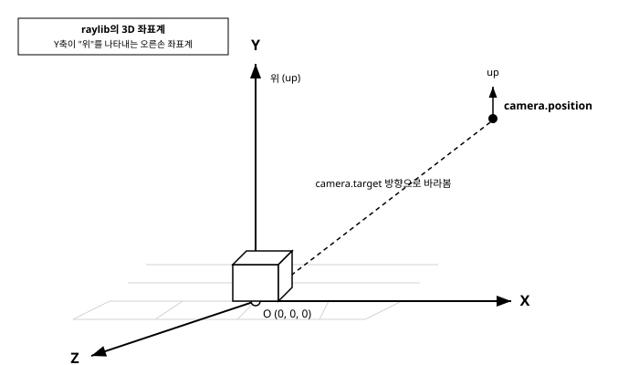

# 12장. 3D 기초

[◀ 이전: 11장. 2D 카메라 시스템](ch11-2D카메라시스템.md) | [📖 목차](00-목차.md) | [다음: 13장. 모델과 메시 ▶](ch13-모델과메시.md)


지금까지 다룬 모든 예제는 평면 위에서 벌어지는 일이었다. 도형은 가로(x)와 세로(y) 두 축만으로 위치가 정해졌고, 카메라 역시 11장에서 살펴본 `Camera2D`처럼 이 평면을 어디서 얼마나 확대해서 볼지만 결정하면 충분했다. 이번 장부터는 여기에 깊이라는 세 번째 축을 더해 3D 공간으로 넘어간다.

raylib는 2D를 다룰 때와 마찬가지로 3D 역시 최소한의 코드로 시작할 수 있도록 설계되어 있다. 복잡한 렌더링 파이프라인이나 좌표 변환 행렬을 직접 다루지 않아도, `Camera3D` 구조체 하나와 `BeginMode3D`/`EndMode3D` 함수 쌍만으로 3차원 공간에 도형을 띄우고 카메라로 둘러볼 수 있다. 이번 장에서는 3D 좌표계의 기본 개념, `Camera3D`의 구조, 기본 3D 도형을 그리는 방법, 그리고 raylib가 기본 제공하는 카메라 이동 기능을 살펴본다. 여기서 다지는 기초는 13장에서 3D 모델과 메시를 불러와 다루고, 14장에서 셰이더로 표현력을 더할 때 계속 이어진다.

## 2D에서 3D로: 좌표계의 확장

2D 예제에서는 위치를 표현할 때 `Vector2` 구조체를 사용했다. 3D에서는 여기에 깊이를 나타내는 `z` 성분이 하나 더 붙은 `Vector3` 구조체를 사용한다.

```c
typedef struct Vector3 {
    float x;
    float y;
    float z;
} Vector3;
```

여기서 반드시 짚고 넘어가야 할 것이 raylib가 채택한 좌표계의 관례다. raylib의 3D 좌표계에서는 **Y축이 "위"를 나타낸다**. 화면을 정면에서 바라볼 때, X축은 오른쪽으로, Y축은 위쪽으로, Z축은 화면 바깥쪽, 즉 보는 사람 쪽으로 향한다. 이는 게임 엔진에서 흔히 쓰이는 관례 중 하나로(반대로 Z축을 "위"로 삼는 도구도 있으니, 다른 3D 프로그램이나 엔진과 데이터를 주고받을 때는 이 축 관례의 차이를 항상 확인해야 한다), raylib로 3D 콘텐츠를 다룰 때는 "바닥은 XZ 평면, 높이는 Y"라고 기억해두면 좌표를 다룰 때 헷갈리지 않는다.

아래 다이어그램은 이 좌표계와, 잠시 후 살펴볼 `Camera3D`의 `position`, `target`, `up` 개념을 함께 보여준다.



원점 `(0, 0, 0)`을 기준으로 오른쪽이 X축, 위쪽이 Y축, 화면 앞쪽(보는 사람 방향)이 Z축이다. 3D에서 도형을 배치한다는 것은 결국 이 세 축을 기준으로 한 좌표 `Vector3`를 정하는 일이다.

## Camera3D 구조체

2D에서 `Camera2D`가 게임 세계와 화면 사이를 연결해주었듯이, 3D에서는 `Camera3D`가 그 역할을 한다. 다만 3D 카메라는 2D보다 조금 더 많은 정보가 필요하다. 3차원 공간에서 카메라가 "어디에 있는지"뿐 아니라 "어느 방향을 보는지", "어느 쪽이 위인지", "얼마나 넓은 시야로 보는지"까지 정해야 하기 때문이다.

```c
typedef struct Camera3D {
    Vector3 position;      // 카메라의 위치 (세계 좌표)
    Vector3 target;        // 카메라가 바라보는 지점 (세계 좌표)
    Vector3 up;            // 카메라 기준 "위" 방향을 나타내는 벡터
    float fovy;             // 시야각(field of view), 세로 방향, 도 단위
    int projection;         // 투영 방식: CAMERA_PERSPECTIVE 또는 CAMERA_ORTHOGRAPHIC
} Camera3D;
```

각 필드를 하나씩 짚어보자.

- **position**: 카메라, 즉 우리 눈이 세계 공간의 어느 좌표에 있는지를 나타낸다.
- **target**: 카메라가 바라보는 지점이다. `position`에서 `target`을 향하는 방향이 곧 카메라의 시선 방향이 된다.
- **up**: 카메라 입장에서 "위쪽"이 어느 방향인지를 나타내는 벡터다. 일반적으로 `(0.0f, 1.0f, 0.0f)`, 즉 월드의 Y축 방향을 그대로 사용한다. 이 값은 카메라가 옆으로 기울어지지 않고 똑바로 서 있도록 잡아주는 기준이 된다.
- **fovy**: 시야각으로, 카메라가 세로 방향으로 얼마나 넓은 범위를 볼 수 있는지를 도(degree) 단위로 나타낸다. 값이 클수록 광각 렌즈처럼 넓은 범위가 한 화면에 들어오고, 값이 작을수록 망원 렌즈처럼 좁고 확대된 화면이 된다. `45.0f` 정도가 일반적으로 자연스러운 시야각으로 많이 쓰인다.
- **projection**: 원근감을 어떻게 표현할지를 정한다. `CAMERA_PERSPECTIVE`는 우리가 실제로 눈으로 보는 것처럼 멀리 있는 물체가 작게 보이는 원근 투영이고, `CAMERA_ORTHOGRAPHIC`은 거리와 상관없이 물체의 크기가 항상 같게 보이는 직교 투영이다. 건축 설계도나 전략 게임의 맵처럼 크기 왜곡 없이 보여줘야 하는 경우가 아니라면, 대부분의 3D 게임에서는 `CAMERA_PERSPECTIVE`를 사용한다.

카메라를 초기화하는 코드는 다음과 같은 형태를 띤다.

```c
Camera3D camera = { 0 };
camera.position = (Vector3){ 10.0f, 10.0f, 10.0f };
camera.target = (Vector3){ 0.0f, 0.0f, 0.0f };
camera.up = (Vector3){ 0.0f, 1.0f, 0.0f };
camera.fovy = 45.0f;
camera.projection = CAMERA_PERSPECTIVE;
```

이 설정은 원점 `(0, 0, 0)`을 바라보되, 카메라 자신은 원점에서 대각선 위쪽 `(10, 10, 10)` 지점에 위치한 상태를 의미한다.

## BeginMode3D와 EndMode3D

2D에서 `BeginMode2D`/`EndMode2D`가 그렇듯, 3D 도형을 그리려면 `BeginMode3D(camera)`와 `EndMode3D()` 사이에서 그리기 함수를 호출해야 한다.

```c
void BeginMode3D(Camera3D camera);
void EndMode3D(void);
```

이 블록 안에서는 `Vector3`로 표현한 세계 좌표를 기준으로 3D 도형을 그릴 수 있다. 반대로 이 블록 바깥은 여전히 화면 좌표를 기준으로 하는 2D 그리기 영역이므로, 점수판이나 조준선(crosshair) 같은 UI는 11장에서 다룬 2D 그리기와 마찬가지로 `EndMode3D()` 호출 이후에 그리면 된다.

```c
BeginDrawing();
ClearBackground(RAYWHITE);

BeginMode3D(camera);
    // 여기서는 Vector3 세계 좌표로 3D 도형을 그린다
EndMode3D();

// 여기서는 2D 화면 좌표로 UI를 그린다
DrawFPS(10, 10);

EndDrawing();
```

## 기본 3D 도형 그리기

raylib는 shapes 모듈이 2D 도형을 제공했던 것처럼, models 모듈을 통해 큐브, 구, 원기둥 같은 기본적인 3D 도형을 그리는 함수를 제공한다. 별도의 모델 파일을 불러오지 않아도 이 함수들만으로 3D 장면의 얼개를 빠르게 만들어볼 수 있다.

```c
void DrawCube(Vector3 position, float width, float height, float length, Color color);
void DrawSphere(Vector3 centerPos, float radius, Color color);
void DrawCylinder(Vector3 position, float radiusTop, float radiusBottom, float height, int slices, Color color);
void DrawGrid(int slices, float spacing);
```

- `DrawCube`는 `position`을 중심으로 가로(`width`), 세로(`height`), 깊이(`length`) 크기의 직육면체를 그린다.
- `DrawSphere`는 `centerPos`를 중심으로 반지름 `radius`의 구를 그린다.
- `DrawCylinder`는 `position`을 밑면 중심으로 하여, 위쪽 반지름(`radiusTop`)과 아래쪽 반지름(`radiusBottom`)을 각각 지정해 원기둥이나 원뿔을 그린다. `slices`는 원 둘레를 몇 개의 다각형으로 근사할지를 정하며, 값이 클수록 매끄러운 곡면이 된다.
- `DrawGrid`는 XZ 평면 위에 바둑판 모양의 격자를 그려서 바닥의 기준을 시각적으로 보여준다. `slices`는 격자를 몇 칸으로 나눌지, `spacing`은 한 칸의 간격을 정한다.

이 함수들을 조합한 간단한 예제를 살펴보자.

```c
#include "raylib.h"

int main(void)
{
    const int screenWidth = 800;
    const int screenHeight = 450;

    InitWindow(screenWidth, screenHeight, "raylib 3D 기초");

    Camera3D camera = { 0 };
    camera.position = (Vector3){ 10.0f, 10.0f, 10.0f };
    camera.target = (Vector3){ 0.0f, 0.0f, 0.0f };
    camera.up = (Vector3){ 0.0f, 1.0f, 0.0f };
    camera.fovy = 45.0f;
    camera.projection = CAMERA_PERSPECTIVE;

    SetTargetFPS(60);

    while (!WindowShouldClose())
    {
        BeginDrawing();
        ClearBackground(RAYWHITE);

        BeginMode3D(camera);
            DrawGrid(20, 1.0f);

            DrawCube((Vector3){ -3.0f, 0.5f, 0.0f }, 1.5f, 1.0f, 1.5f, RED);
            DrawCubeWires((Vector3){ -3.0f, 0.5f, 0.0f }, 1.5f, 1.0f, 1.5f, MAROON);

            DrawSphere((Vector3){ 0.0f, 1.0f, 0.0f }, 1.0f, BLUE);

            DrawCylinder((Vector3){ 3.0f, 0.0f, 0.0f }, 1.0f, 1.0f, 2.0f, 16, GREEN);
        EndMode3D();

        DrawText("raylib 기본 3D 도형", 10, 10, 20, BLACK);

        EndDrawing();
    }

    CloseWindow();
    return 0;
}
```

`DrawGrid(20, 1.0f)`는 한 칸의 간격이 `1.0f`인 격자를 가로세로 20칸씩 그려서, 바닥이 어디인지와 물체들 사이의 상대적인 크기감을 한눈에 파악할 수 있게 해준다. 3D 장면을 새로 만들 때는 습관적으로 `DrawGrid`를 가장 먼저 그려 넣는 것이 좋다. 도형들이 허공에 붕 뜬 것처럼 보이는지, 바닥에 제대로 놓여 있는지를 즉시 확인할 수 있기 때문이다. 예제에 함께 쓰인 `DrawCubeWires`는 `DrawCube`와 짝을 이루는 함수로, 채워진 면 대신 윤곽선만 그려서 도형의 경계를 뚜렷하게 보여준다.

## UpdateCamera로 카메라 움직이기

지금까지의 예제에서는 카메라의 `position`과 `target`을 한 번 설정한 뒤 계속 고정해 두었다. 하지만 3D 장면을 자유롭게 둘러보려면 카메라도 사용자의 입력에 반응해 움직여야 한다. 이 움직임을 처음부터 직접 구현하려면 마우스 이동량을 회전 각도로 바꾸고, 그 각도로 `position`과 `target`을 갱신하는 삼각함수 계산이 필요해서 손이 많이 간다.

raylib는 이런 대표적인 카메라 조작 방식들을 `UpdateCamera` 함수 하나로 미리 구현해서 제공한다.

```c
void UpdateCamera(Camera3D *camera, int mode);
```

이 함수는 마우스와 키보드 입력을 매 프레임 읽어서, 지정한 모드에 맞게 `camera`의 `position`과 `target`을 자동으로 갱신해준다. 사용법은 간단하다. 게임 루프 안에서 매 프레임 한 번씩 호출하면 된다.

```c
while (!WindowShouldClose())
{
    UpdateCamera(&camera, CAMERA_FREE);

    BeginDrawing();
    ClearBackground(RAYWHITE);

    BeginMode3D(camera);
        DrawGrid(20, 1.0f);
        DrawCube((Vector3){ 0.0f, 0.5f, 0.0f }, 1.0f, 1.0f, 1.0f, RED);
    EndMode3D();

    EndDrawing();
}
```

`mode`로 지정할 수 있는 대표적인 카메라 모드는 다음과 같다.

- **CAMERA_FREE**: 마우스와 휠로 카메라를 자유롭게 회전시키고 확대·축소할 수 있는 모드다. 3D 장면을 이리저리 살펴보는 뷰어나 에디터 도구를 만들 때 적합하다.
- **CAMERA_ORBITAL**: 카메라가 `target` 지점을 중심으로 궤도를 돌 듯이 회전하는 모드다. 특정 오브젝트를 여러 각도에서 감상하고 싶을 때, 예를 들어 상점에서 캐릭터나 아이템을 360도로 회전시켜 보여주는 화면에 어울린다.
- **CAMERA_FIRST_PERSON**: 1인칭 슈팅 게임처럼, 마우스로 시선을 돌리고 키보드로 걸어 다니는 1인칭 시점 카메라다.
- **CAMERA_THIRD_PERSON**: 캐릭터를 뒤쪽 또는 옆쪽에서 비추며 따라다니는 3인칭 시점 카메라다.
- **CAMERA_CUSTOM**: `UpdateCamera`가 자동으로 카메라를 조작하지 않도록 하는 모드로, 카메라 이동 로직을 완전히 직접 구현하고 싶을 때 사용한다.

이 모드들은 프로토타입 단계에서 카메라 조작을 빠르게 붙여보거나, 간단한 3D 도구를 만들 때 특히 유용하다. 실제 게임에서는 이 기본 모드들을 그대로 쓰기보다, `CAMERA_CUSTOM`으로 두고 카메라의 `position`과 `target`을 게임 로직에 맞게 직접 계산하는 경우도 많다. 예를 들어 캐릭터의 등 뒤 일정 거리에서 따라오되 벽에 부딪히지 않도록 카메라 위치를 보정하는 로직은, 정해진 카메라 모드만으로는 표현하기 어렵기 때문이다. 다음 장에서는 이렇게 만든 3D 공간에 기본 도형 대신 실제 모델 파일을 불러와 배치하는 방법을 다룬다.

## 요약

- 3D에서는 위치를 `x`, `y`, `z` 세 성분을 가진 `Vector3`로 표현하며, raylib의 좌표계에서는 Y축이 "위"를 나타낸다.
- `Camera3D`는 `position`(카메라 위치), `target`(바라보는 지점), `up`(위쪽 방향), `fovy`(시야각), `projection`(투영 방식) 필드로 3D 카메라를 정의한다.
- `BeginMode3D(camera)`와 `EndMode3D()` 사이에서 `Vector3` 세계 좌표로 3D 도형을 그리며, 그 바깥은 여전히 2D 화면 좌표 영역이다.
- `DrawCube`, `DrawSphere`, `DrawCylinder`로 기본 3D 도형을 그릴 수 있고, `DrawGrid`로 바닥 기준선을 그려 장면의 크기감과 위치를 가늠할 수 있다.
- `UpdateCamera(&camera, mode)`를 매 프레임 호출하면 `CAMERA_FREE`, `CAMERA_ORBITAL`, `CAMERA_FIRST_PERSON`, `CAMERA_THIRD_PERSON` 같은 미리 구현된 카메라 조작 방식을 손쉽게 사용할 수 있다.

## 연습문제

1. raylib의 3D 좌표계에서 어느 축이 "위"를 나타내는지 설명하고, 이 관례가 도형을 배치할 때 어떤 의미를 갖는지 이야기해보자.
2. `Camera3D`의 다섯 필드(`position`, `target`, `up`, `fovy`, `projection`) 각각이 카메라의 어떤 특성을 결정하는지 정리해보자.
3. `DrawGrid`를 3D 장면에 가장 먼저 그려 넣는 습관이 왜 도움이 되는지, 본문 내용을 바탕으로 설명해보자.
4. `CAMERA_FREE`, `CAMERA_ORBITAL`, `CAMERA_FIRST_PERSON`, `CAMERA_THIRD_PERSON` 중 상점에서 아이템을 회전시켜 보여주는 화면에 가장 적합한 모드는 무엇이며, 그 이유는 무엇인가?
5. `CAMERA_PERSPECTIVE`와 `CAMERA_ORTHOGRAPHIC` 투영 방식의 차이를 설명하고, 각각이 어울리는 게임/애플리케이션 예시를 하나씩 들어보자.

---

[◀ 이전: 11장. 2D 카메라 시스템](ch11-2D카메라시스템.md) | [📖 목차](00-목차.md) | [다음: 13장. 모델과 메시 ▶](ch13-모델과메시.md)
