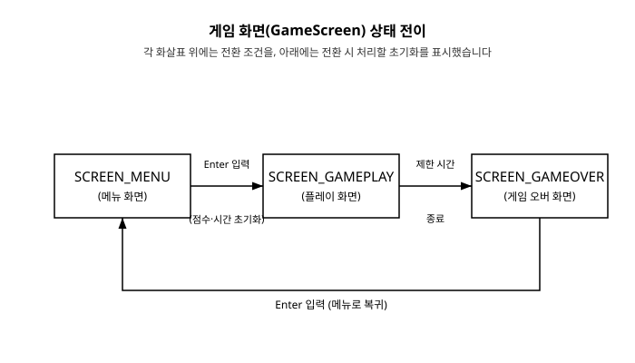

# 15장. 게임 상태 관리와 씬 전환

[◀ 이전: 14장. 셰이더 기초](ch14-셰이더기초.md) | [📖 목차](00-목차.md) | [다음: 16장. 파티클 시스템과 이펙트 ▶](ch16-파티클시스템과이펙트.md)


지금까지 만든 예제들은 대부분 창을 열자마자 곧바로 게임 플레이 화면이 시작되는 구조였습니다. 하지만 실제로 우리가 즐기는 게임을 떠올려 보면 그렇지 않습니다. 게임을 실행하면 먼저 제목과 "시작하기" 버튼이 있는 메인 메뉴가 뜨고, 시작 버튼을 누르면 실제 플레이 화면으로 넘어가며, 캐릭터가 죽으면 점수를 보여주는 게임 오버 화면이 나타납니다. 이렇게 게임은 여러 개의 "화면" 혹은 "장면(scene)"으로 이루어져 있고, 플레이어의 행동에 따라 그 화면들 사이를 오갑니다.

이번 장에서는 이런 여러 화면을 코드로 어떻게 구조화하는지 다룹니다. 열거형(enum)으로 "지금 어떤 화면인가"를 표현하고, `switch` 문으로 화면별 갱신·그리기 로직을 나누고, 화면이 바뀌는 순간 필요한 초기화를 어디서 처리해야 하는지 살펴봅니다. 사실 이 원리는 7장에서 캐릭터의 `idle`/`walk`/`jump` 애니메이션 상태를 전환할 때 이미 작은 규모로 다뤄본 적이 있습니다. 이번 장에서는 그 아이디어를 게임 전체 화면 단위로 확장합니다.

## 화면이 하나뿐일 때 생기는 문제

메뉴, 플레이, 게임 오버 세 화면을 만든다고 해봅시다. 아무 구조 없이 `if`/`else`만으로 접근하면 다음과 같은 코드가 나올 수 있습니다.

```c
// 좋지 않은 예: 상태 없이 플래그만으로 화면을 구분
bool showMenu = true;
bool showGameplay = false;
bool showGameOver = false;

while (!WindowShouldClose())
{
    if (showMenu)
    {
        if (IsKeyPressed(KEY_ENTER))
        {
            showMenu = false;
            showGameplay = true;
        }
    }
    else if (showGameplay)
    {
        // 플레이 로직...
    }
    else if (showGameOver)
    {
        // 게임 오버 로직...
    }

    BeginDrawing();
        ClearBackground(RAYWHITE);
        if (showMenu) { /* 메뉴 그리기 */ }
        if (showGameplay) { /* 플레이 그리기 */ }
        if (showGameOver) { /* 게임 오버 그리기 */ }
    EndDrawing();
}
```

불 변수 세 개로도 지금 당장은 동작합니다. 하지만 화면이 하나 더 늘어날 때마다(예: 일시정지 화면, 옵션 화면) 불 변수가 하나씩 추가되고, "지금 정확히 어떤 화면인가"를 보장하는 규칙(예: 두 플래그가 동시에 `true`가 되면 안 된다)은 프로그래머가 스스로 지켜야 합니다. 실수로 `showGameplay`를 `false`로 만드는 것을 깜빡하면 두 화면이 겹쳐 그려지는 버그가 생깁니다. 화면이 "여러 개 중 하나"라는 사실은 불 변수 여러 개보다 값 하나로 표현하는 편이 훨씬 안전합니다.

## enum GameScreen으로 현재 화면 표현하기

C의 열거형(enum)은 "여러 값 중 정확히 하나"를 표현하는 데 알맞은 도구입니다. 게임이 가질 수 있는 화면들을 다음처럼 정의합니다.

```c
typedef enum GameScreen {
    SCREEN_MENU,
    SCREEN_GAMEPLAY,
    SCREEN_GAMEOVER
} GameScreen;
```

그리고 현재 화면을 나타내는 변수를 하나만 둡니다.

```c
GameScreen currentScreen = SCREEN_MENU;
```

이제 `currentScreen`은 항상 세 값 중 정확히 하나만 가질 수 있습니다. "메뉴이면서 동시에 플레이 화면"이라는 모순된 상태는 애초에 표현할 방법이 없으므로, 방금 살펴본 것과 같은 종류의 버그가 구조적으로 발생하지 않습니다.

## switch 문으로 화면별 로직 분리하기

`currentScreen` 값에 따라 다른 갱신 함수와 그리기 함수를 호출하려면 `switch` 문을 사용합니다. 화면마다 처리할 내용이 늘어날 것을 대비해, 각 화면의 로직을 별도의 함수로 미리 분리해 두는 것이 좋습니다.

```c
static void UpdateMenuScreen(void)
{
    if (IsKeyPressed(KEY_ENTER))
    {
        currentScreen = SCREEN_GAMEPLAY;
    }
}

static void DrawMenuScreen(void)
{
    DrawText("MY GAME", 320, 150, 40, DARKGRAY);
    DrawText("Enter를 눌러 시작하세요", 250, 220, 20, GRAY);
}
```

메인 루프에서는 다음처럼 갱신과 그리기 각각에 `switch` 문을 하나씩 둡니다.

```c
switch (currentScreen)
{
    case SCREEN_MENU:     UpdateMenuScreen(); break;
    case SCREEN_GAMEPLAY: UpdateGameplayScreen(); break;
    case SCREEN_GAMEOVER: UpdateGameOverScreen(); break;
}

BeginDrawing();

    ClearBackground(RAYWHITE);

    switch (currentScreen)
    {
        case SCREEN_MENU:     DrawMenuScreen(); break;
        case SCREEN_GAMEPLAY: DrawGameplayScreen(); break;
        case SCREEN_GAMEOVER: DrawGameOverScreen(); break;
    }

EndDrawing();
```

이 구조의 장점은 각 화면의 코드가 서로 완전히 독립적이라는 점입니다. `UpdateGameplayScreen` 안의 코드는 메뉴 화면이나 게임 오버 화면에 대해 전혀 알 필요가 없습니다. 새 화면(예: 일시정지)을 추가하고 싶다면 `enum`에 값을 하나 더하고, 그에 대응하는 `Update.../Draw...` 함수 한 쌍을 만들고, 두 `switch` 문에 `case`를 하나씩 추가하면 됩니다. 기존 화면의 코드는 건드릴 필요가 없습니다.

## 상태가 전환되는 순간 초기화하기

화면을 바꾸는 것만으로는 부족할 때가 많습니다. 예를 들어 메뉴에서 게임 오버로, 다시 게임 오버에서 메뉴로 돌아왔다가 새 게임을 시작한다고 해봅시다. 이때 점수, 플레이어 위치, 남은 시간 같은 값들이 이전 판의 값을 그대로 이어받으면 안 됩니다. **화면이 전환되는 바로 그 순간**, 즉 `currentScreen` 값을 바꾸는 코드 바로 옆에서 필요한 초기화를 함께 처리하는 것이 핵심입니다.

```c
static int score = 0;
static float timeLeft = 0.0f;

static void ResetGameplay(void)
{
    score = 0;
    timeLeft = 10.0f;
}

static void UpdateMenuScreen(void)
{
    if (IsKeyPressed(KEY_ENTER))
    {
        ResetGameplay();              // 화면을 바꾸기 전에 상태부터 초기화
        currentScreen = SCREEN_GAMEPLAY;
    }
}
```

여기서 중요한 점은 초기화 코드를 `UpdateGameplayScreen` 안, 즉 "매 프레임 실행되는 코드"에 넣지 않았다는 것입니다. 만약 `score = 0`을 `UpdateGameplayScreen`의 맨 앞에 두면 게임 플레이 중에도 매 프레임 점수가 0으로 리셋되어버려 전혀 다른 결과가 나옵니다. 초기화는 반드시 "전환이 일어나는 그 한순간"에만 실행되어야 하므로, 전환을 일으키는 코드(`currentScreen = ...`)와 초기화 코드를 같은 자리에 짝지어 두는 것이 가장 안전한 방법입니다.

화면이 많아지고 전환 경로가 복잡해지면 "이전 화면이 무엇이었는가"에 따라 다른 초기화가 필요할 수도 있습니다. 이런 경우에는 `previousScreen` 변수를 하나 더 두고 매 프레임 끝에 `previousScreen = currentScreen`으로 갱신하면서, 전환 직후 프레임에서 `previousScreen != currentScreen`을 검사해 초기화를 처리하는 방법도 있습니다. 다만 대부분의 2D 게임에서는 지금 보여드린 것처럼 전환을 일으키는 코드 옆에 초기화 함수를 직접 호출하는 방식으로 충분합니다.

## 7장의 애니메이션 상태와 같은 원리

7장 "애니메이션 기초"에서 `idle`, `walk`, `jump` 세 가지 애니메이션 상태를 `AnimState` 열거형으로 표현하고, 상태가 바뀔 때 다음처럼 처리했던 것을 기억할 것입니다.

```c
if (newState != currentState)
{
    currentState = newState;
    animations[currentState].currentFrame = 0;   // 상태가 바뀌면 처음 프레임부터
    animations[currentState].frameTimer = 0.0f;
}
```

이 코드와 이번 장의 `ResetGameplay` 패턴을 나란히 놓고 보면 구조가 똑같다는 것을 알 수 있습니다.

- 여러 값 중 하나를 나타내는 열거형(`AnimState` ↔ `GameScreen`)
- 값이 바뀌는 순간을 감지하는 조건문(`newState != currentState` ↔ 입력을 감지하는 `if`)
- 전환되는 그 순간에만 실행되는 초기화(`currentFrame = 0` ↔ `score = 0`)

캐릭터 애니메이션의 상태 전환은 "캐릭터 하나가 어떤 동작을 하고 있는가"를 다루는 작은 규모의 상태 머신(state machine)이고, 이번 장에서 다루는 화면 전환은 "게임 전체가 지금 어떤 국면에 있는가"를 다루는 훨씬 큰 규모의 상태 머신입니다. 다루는 대상의 크기만 다를 뿐, "현재 상태를 값 하나로 표현하고, 전환 시점에 필요한 초기화를 처리한다"는 원리는 동일합니다. 이 패턴은 게임 개발 전반에서 반복해서 등장하므로, 이번 장에서 확실히 익혀두면 이후 더 복잡한 시스템(예: 적 AI의 행동 상태, 메뉴 안의 하위 메뉴)을 설계할 때도 그대로 응용할 수 있습니다.

다음 다이어그램은 메뉴, 플레이, 게임 오버 세 화면이 어떤 조건으로 서로 전환되는지를 보여줍니다.



## 실전 예제: 메뉴 → 플레이 → 게임 오버 전체 흐름

지금까지 다룬 내용을 하나의 완전한 프로그램으로 모아보겠습니다. 메뉴에서 Enter를 누르면 플레이 화면이 시작되고, 좌우 화살표로 원을 움직이는 동안 10초의 제한 시간이 흐르며, 시간이 다 되면 게임 오버 화면에서 최종 점수를 보여준 뒤 다시 Enter로 메뉴로 돌아갑니다.

```c
#include "raylib.h"

typedef enum GameScreen {
    SCREEN_MENU,
    SCREEN_GAMEPLAY,
    SCREEN_GAMEOVER
} GameScreen;

static GameScreen currentScreen = SCREEN_MENU;

static int score = 0;
static float playerX = 400.0f;
static float timeLeft = 10.0f;

static void ResetGameplay(void)
{
    score = 0;
    playerX = 400.0f;
    timeLeft = 10.0f;
}

static void UpdateMenuScreen(void)
{
    if (IsKeyPressed(KEY_ENTER))
    {
        ResetGameplay();
        currentScreen = SCREEN_GAMEPLAY;
    }
}

static void DrawMenuScreen(void)
{
    DrawText("MY GAME", 320, 150, 40, DARKGRAY);
    DrawText("Enter를 눌러 시작하세요", 250, 220, 20, GRAY);
}

static void UpdateGameplayScreen(void)
{
    float dt = GetFrameTime();

    if (IsKeyDown(KEY_RIGHT)) playerX += 200.0f * dt;
    if (IsKeyDown(KEY_LEFT))  playerX -= 200.0f * dt;

    timeLeft -= dt;
    score += (int)(dt * 10.0f);

    if (timeLeft <= 0.0f)
    {
        timeLeft = 0.0f;
        currentScreen = SCREEN_GAMEOVER;
    }
}

static void DrawGameplayScreen(void)
{
    DrawCircle((int)playerX, 300, 20, BLUE);
    DrawText(TextFormat("점수: %d", score), 20, 20, 20, DARKGRAY);
    DrawText(TextFormat("남은 시간: %.1f", timeLeft), 20, 50, 20, DARKGRAY);
}

static void UpdateGameOverScreen(void)
{
    if (IsKeyPressed(KEY_ENTER))
    {
        currentScreen = SCREEN_MENU;
    }
}

static void DrawGameOverScreen(void)
{
    DrawText("GAME OVER", 300, 150, 40, MAROON);
    DrawText(TextFormat("최종 점수: %d", score), 300, 210, 20, DARKGRAY);
    DrawText("Enter를 눌러 메뉴로", 280, 250, 20, GRAY);
}

int main(void)
{
    InitWindow(800, 450, "15장 - 게임 상태 관리와 씬 전환");
    SetTargetFPS(60);

    while (!WindowShouldClose())
    {
        switch (currentScreen)
        {
            case SCREEN_MENU:     UpdateMenuScreen(); break;
            case SCREEN_GAMEPLAY: UpdateGameplayScreen(); break;
            case SCREEN_GAMEOVER: UpdateGameOverScreen(); break;
        }

        BeginDrawing();

            ClearBackground(RAYWHITE);

            switch (currentScreen)
            {
                case SCREEN_MENU:     DrawMenuScreen(); break;
                case SCREEN_GAMEPLAY: DrawGameplayScreen(); break;
                case SCREEN_GAMEOVER: DrawGameOverScreen(); break;
            }

        EndDrawing();
    }

    CloseWindow();
    return 0;
}
```

이 예제에서 화면 전환은 정확히 두 지점에서만 일어납니다. `UpdateMenuScreen`에서 `SCREEN_GAMEPLAY`로, `UpdateGameplayScreen`에서 `SCREEN_GAMEOVER`로, 그리고 `UpdateGameOverScreen`에서 다시 `SCREEN_MENU`로. 각 전환 지점 옆에는 그 전환에 필요한 초기화(`ResetGameplay` 호출, `timeLeft`를 정확히 0으로 맞추는 처리 등)가 함께 놓여 있습니다. 이런 식으로 "전환이 일어나는 곳"과 "그 전환에 필요한 준비"를 같은 자리에 두는 습관을 들이면, 화면이 아무리 많아져도 어디서 무엇이 초기화되는지 코드만 보고 바로 파악할 수 있습니다.

게임이 커지면 화면 하나하나가 텍스처, 사운드 등 저마다의 리소스를 가지게 됩니다. 화면에 진입할 때 `LoadTexture`로 불러온 리소스는 그 화면을 벗어나기 전에(또는 프로그램이 끝나기 직전에) `UnloadTexture`로 반드시 해제해야 한다는 점은 6장에서 다룬 원칙이 여기서도 그대로 적용됩니다. 화면 전환 구조 안에서 리소스를 관리하는 요령은 17장 "파일 입출력과 세이브/로드"에서 저장 데이터를 다룰 때 다시 살펴봅니다.

## 요약

- 게임이 여러 화면(메뉴, 플레이, 게임 오버 등)을 가질 때는 불 변수 여러 개보다 `enum GameScreen`처럼 "여러 값 중 하나"를 표현하는 열거형과 현재 상태를 담는 변수 하나로 관리하는 것이 안전합니다.
- 메인 루프에서 `switch (currentScreen)`으로 화면별 갱신 함수와 그리기 함수를 각각 호출하면, 화면마다 독립된 코드로 분리할 수 있고 새 화면을 추가하기도 쉬워집니다.
- 점수 리셋처럼 상태 전환 시 필요한 초기화는 매 프레임 실행되는 갱신 함수 안이 아니라, `currentScreen` 값을 바꾸는 바로 그 지점에서 한 번만 실행되도록 짜야 합니다.
- 7장에서 다룬 캐릭터 애니메이션의 `idle`/`walk`/`jump` 상태 전환은 이번 장의 화면 전환과 같은 원리(현재 상태 표현, 전환 감지, 전환 시 초기화)를 더 작은 규모에 적용한 것입니다.

## 연습문제

1. `enum GameScreen`에 `SCREEN_PAUSE`를 추가하고, 플레이 화면에서 `P` 키를 누르면 일시정지 화면으로 전환되며 다시 `P`를 누르면 플레이 화면으로 돌아오도록 만들어 보세요. 일시정지 중에는 `timeLeft`가 줄어들지 않아야 합니다.
2. 본문 예제의 `ResetGameplay`를 호출하는 지점을 실수로 지운 채 실행해 보고, 게임 오버 후 메뉴를 거쳐 다시 시작했을 때 점수와 제한 시간이 어떻게 잘못 동작하는지 관찰해 보세요.
3. 게임 오버 화면에 진입한 총 횟수를 세는 `int gameOverCount` 전역 변수를 추가하고, `UpdateGameplayScreen`에서 `SCREEN_GAMEOVER`로 전환되는 순간에만 1씩 증가하도록 구현해 보세요. (힌트: 매 프레임 증가하면 안 됩니다.)
4. 두 개의 `switch` 문(갱신용, 그리기용)을 하나로 합쳐 화면마다 "갱신 후 그리기"를 한 번에 처리하는 함수 하나로 바꿔보고, 이 방식과 본문의 방식 각각 어떤 장단점이 있을지 생각해 보세요.
5. `previousScreen` 변수를 추가해 매 프레임 끝에 `currentScreen` 값을 저장해 두고, `previousScreen != currentScreen`일 때만 실행되는 로그 출력(`TraceLog` 또는 `printf`)을 넣어 화면이 실제로 언제 전환되는지 콘솔에서 확인해 보세요.

---

[◀ 이전: 14장. 셰이더 기초](ch14-셰이더기초.md) | [📖 목차](00-목차.md) | [다음: 16장. 파티클 시스템과 이펙트 ▶](ch16-파티클시스템과이펙트.md)
