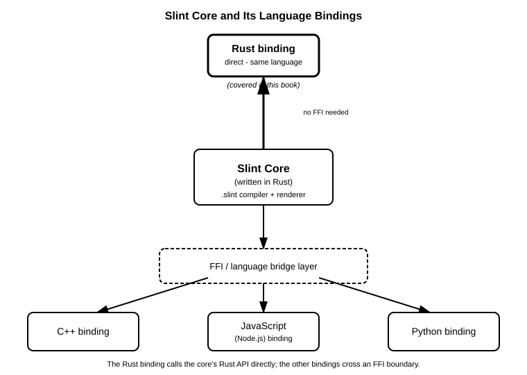

# 1장. Slint란 무엇인가

📖 [◀ 목차](00-목차.md) | [다음: 2장. 개발 환경 설정과 첫 창 ▶](ch02-개발환경설정과첫창.md)

---

## 이 책에서 다루는 것

Slint는 데스크톱, 모바일, 임베디드 기기를 아우르는 애플리케이션의 사용자 인터페이스(UI)를 만들기 위한 선언적(declarative) GUI 툴킷입니다. Slint 프로젝트의 핵심 엔진(`.slint` 컴파일러와 렌더링 런타임)은 전부 Rust로 작성되어 있으며, 그 위에 여러 언어를 위한 바인딩(binding)이 얹혀 있습니다. 2026년 현재 공식적으로 지원되는 바인딩은 Rust, C++, JavaScript(Node.js), Python 네 가지입니다. 어떤 언어를 선택하든 UI를 기술하는 `.slint` 마크업 자체는 동일하며, 그 UI에 로직을 붙이는 애플리케이션 코드만 각 언어의 문법과 관례를 따르게 됩니다.

이 책은 그중에서도 **Rust 바인딩**을 사용해 Slint로 GUI 애플리케이션을 만드는 방법을 다룹니다. 이 저장소에는 이미 C++ 바인딩을 다루는 "Slint로 배우는 C++ GUI 프로그래밍"이라는 책이 존재합니다. 두 책은 `.slint` 마크업 언어의 기초 문법(컴포넌트, 프로퍼티, 레이아웃 등)에서는 상당 부분 같은 내용을 다루게 되지만, 애플리케이션 로직을 UI와 연결하는 방법—즉 프로퍼티를 읽고 쓰는 방법, 콜백을 등록하는 방법, 모델을 구성하는 방법—은 전적으로 Rust API를 기준으로 설명합니다. 뒤에서 다시 설명하겠지만, Rust 바인딩은 Slint 코어와 같은 언어로 작성되어 있다는 점에서 네 바인딩 중 가장 직접적인 위치에 있습니다.

## 선언적 UI와 .slint 마크업 언어

전통적인 명령형(imperative) GUI 코드에서는 버튼을 만들고, 크기를 지정하고, 레이아웃에 배치하고, 클릭 시 동작할 콜백을 등록하는 과정을 모두 애플리케이션 언어(예: Rust) 코드로 한 줄씩 작성합니다. 위젯 트리를 손으로 조립하는 셈입니다.

Slint는 접근 방식이 다릅니다. UI의 구조와 모양을 `.slint`라는 확장자를 가진 별도의 파일에, Slint 자체의 도메인 특화 언어(DSL, Domain-Specific Language)로 기술합니다. 이 마크업은 "어떤 화면이 어떻게 생겼는가"를 선언적으로 표현하는 데 특화되어 있으며, Rust 코드와는 물리적으로도 분리된 파일에 존재합니다.

```slint
component Greeting inherits Window {
    width: 300px;
    height: 100px;

    Text {
        text: "안녕하세요, Slint!";
        font-size: 20px;
    }
}
```

이런 방식은 UI를 마크업으로 기술하고 뒤에서 네이티브 코드로 변환한다는 점에서 QML(Qt)이나 XAML(WPF, Avalonia 등)과 포지션이 비슷합니다. 화면 구조를 선언적 문법으로 표현하고, 그 뒤에서 애플리케이션 로직 언어와 연결한다는 큰 그림은 같습니다. 하지만 Slint의 `.slint` 문법은 QML이나 XAML을 그대로 가져온 것이 아니라, Slint 프로젝트가 독자적으로 설계한 고유한 언어입니다. 프로퍼티 바인딩, 레이아웃 지정, 상태 전환 등을 표현하는 구체적인 문법은 Slint만의 규칙을 따릅니다.

`.slint` 파일과 Rust 코드가 실제로 어떻게 하나의 실행 파일로 묶이는지는 2장에서 첫 예제를 통해 직접 확인합니다.

## 컴파일 타임 변환과 임베디드 지향 설계

Slint를 다른 GUI 프레임워크와 구별 짓는 또 하나의 특징은 `.slint` 파일이 처리되는 시점입니다. 많은 선언적 UI 시스템이 마크업을 런타임에 파싱하고 해석하는 반면, Slint는 빌드 시점에 `.slint` 파일을 네이티브 코드로 컴파일합니다. Rust 프로젝트에서는 이 변환이 `build.rs` 빌드 스크립트 안에서 `slint-build` 크레이트를 통해 일어나며, 그 결과로 생성된 Rust 코드가 일반 소스 파일처럼 컴파일 과정에 포함됩니다. 애플리케이션이 실행될 때는 마크업을 다시 읽고 해석하는 과정이 없고, 이미 컴파일된 위젯 트리와 바인딩 로직이 곧바로 동작합니다. 이 방식은 런타임 오버헤드를 줄이고, 타입 오류나 문법 오류 같은 문제를 실행 전 빌드 단계에서 미리 걸러낼 수 있게 해줍니다.

이런 설계는 Slint가 목표로 삼는 실행 환경의 폭과도 맞닿아 있습니다. Slint는 일반적인 데스크톱 애플리케이션은 물론, RAM과 연산 능력이 극도로 제한된 마이크로컨트롤러(MCU) 기반 임베디드 기기까지 실행 대상으로 삼습니다. 화면이 있는 작은 산업용 장비, 가전제품의 제어판, 웨어러블 기기처럼 운영체제 없이 혹은 아주 가벼운 런타임 위에서 동작해야 하는 환경까지 같은 `.slint` 마크업으로 UI를 개발할 수 있다는 점이 Slint의 핵심 차별점입니다. Rust는 이런 임베디드 타겟에서도 널리 쓰이는 언어이기 때문에, Rust 바인딩은 데스크톱과 임베디드 양쪽 모두에서 자연스럽게 맞아떨어집니다.

## 왜 Rust 바인딩이 가장 직접적인가

Slint 코어 자체가 Rust로 작성되었다는 사실은 Rust 바인딩의 성격을 결정짓습니다. C++, JavaScript, Python 바인딩은 Rust로 작성된 코어의 기능을 각 언어에서 사용할 수 있도록 감싸는 FFI(Foreign Function Interface) 경계를 거쳐야 합니다. 반면 Rust 바인딩은 코어와 같은 언어로 작성되어 있으므로, 이 경계를 새로 만들 필요가 없습니다. `slint` 크레이트는 코어가 제공하는 타입과 트레이트를 그대로, 혹은 아주 얇은 래퍼(wrapper)만 씌워 노출합니다.

이는 실무적으로 몇 가지 이점으로 이어집니다.

- **타입 시스템의 자연스러운 연동**: `.slint`에서 선언한 프로퍼티가 Rust의 `i32`, `f32`, `bool`, `SharedString`, 사용자 정의 구조체 등으로 직접 매핑되며, 별도의 언어 간 타입 변환 계층을 신경 쓸 필요가 적습니다.
- **빌드 파이프라인의 단순함**: `.slint` 파일을 코드로 변환하는 작업이 `build.rs`라는 Rust 생태계의 표준 메커니즘 안에서 이루어집니다. CMake나 별도의 코드 생성 도구를 프로젝트에 추가로 끌어들이지 않아도 됩니다.
- **에러 메시지와 디버깅의 일관성**: FFI 경계를 넘나들 때 발생할 수 있는 정보 손실 없이, 컴파일 오류나 런타임 패닉이 Rust의 방식 그대로 보고됩니다.

아래 다이어그램은 Rust로 작성된 Slint 코어와 그 위에 얹힌 네 가지 언어 바인딩의 관계를 보여줍니다. Rust 바인딩만이 FFI 경계 없이 코어에 직접 연결된다는 점에 주목하세요.



## 다른 Rust GUI 프레임워크들과의 위치

Rust 생태계에는 이미 여러 GUI 프레임워크가 존재합니다. Slint가 그 사이에서 어떤 위치에 있는지 이름만 간단히 짚어 보면 다음과 같습니다.

- **egui**: 즉시 모드(immediate mode) GUI 라이브러리로, 매 프레임마다 Rust 함수 호출로 위젯을 다시 그리도록 명령하는 방식입니다. 별도의 마크업 언어가 없습니다.
- **iced**: Elm 아키텍처에서 영감을 받은 유지 모드(retained mode) GUI 라이브러리로, UI 구성과 상태 갱신을 모두 Rust 코드(타입과 함수)로 표현합니다.
- **gtk-rs**: C로 작성된 GTK 툴킷을 Rust에서 사용할 수 있도록 감싼 바인딩으로, GTK의 위젯 모델과 이벤트 시스템을 그대로 계승합니다.
- **Slint**: `.slint`라는 독자적인 DSL로 UI 구조를 선언하고, 이를 빌드 시점에 Rust 코드로 컴파일해 사용하는 유지 모드 툴킷입니다. UI 선언과 애플리케이션 로직이 문법적으로 분리되어 있다는 점에서 egui, iced와 구분되고, 코어가 처음부터 Rust로 설계되었다는 점에서 gtk-rs와 같은 언어 바인딩형 프로젝트와도 결이 다릅니다.

이 목록은 우열을 가리기 위한 것이 아니라, Slint가 "UI를 어떻게 기술할 것인가"라는 질문에 내놓은 답이 Rust 생태계 안에서 유일한 답이 아니라는 점을 보여주기 위한 것입니다. 이 책은 그중 Slint가 선택한 길—별도 DSL과 컴파일 타임 변환—을 Rust 개발자의 시점에서 하나씩 따라갑니다.

## 이 책의 학습 로드맵

이 책은 다음과 같은 순서로 Slint의 Rust 바인딩을 익혀 나갑니다.

1. **2장**에서 개발 환경을 갖추고 창 하나만 띄우는 첫 프로젝트를 완성합니다.
2. 이후 장들에서 `.slint` 언어의 기초 문법, 레이아웃, 프로퍼티와 바인딩, 콜백 처리를 다루며 점차 UI를 정교하게 만드는 방법을 익힙니다.
3. Rust 쪽에서 `.slint`가 생성한 타입을 다루는 방법—프로퍼티를 읽고 쓰는 `get_*`/`set_*` 메서드, 콜백을 연결하는 클로저, 리스트를 다루는 모델 트레이트—을 순서대로 학습합니다.
4. 전역 싱글톤, 다중 창, 커스텀 스타일링, 타이머와 비동기 작업 연동처럼 실전 애플리케이션에서 필요한 주제들을 다룹니다.
5. 마지막 장에서는 지금까지 배운 내용을 종합해 작은 규모의 실전 프로젝트를 완성합니다.

`.slint` 마크업 언어의 기초 문법 자체는 언어 바인딩과 무관하게 동일하므로, 이 책의 초반 장들은 이 저장소의 C++판 Slint 책과 내용이 겹치는 부분이 있습니다. 다만 애플리케이션 로직을 다루는 장부터는 전적으로 Rust API—`slint` 크레이트가 제공하는 타입, 트레이트, 매크로—를 기준으로 설명이 진행된다는 점이 두 책의 가장 큰 차이입니다.

## 요약

- Slint는 Rust로 작성된 선언적 GUI 툴킷 코어이며, Rust, C++, JavaScript(Node.js), Python 바인딩을 공식 지원합니다. 이 책은 Rust 바인딩을 다룹니다.
- UI는 `.slint`라는 독자적인 DSL 마크업 파일에 선언적으로 기술하며, 이는 QML이나 XAML과 포지션은 비슷하지만 문법은 Slint 고유의 것입니다.
- `.slint` 파일은 런타임이 아니라 빌드 시점(`build.rs`를 통한 `slint-build` 크레이트 처리)에 Rust 코드로 컴파일되어 런타임 오버헤드가 적습니다.
- Slint 코어가 Rust로 작성되어 있으므로 Rust 바인딩은 FFI 경계 없이 코어에 직접 연결되는, 네 바인딩 중 가장 직접적인 위치에 있습니다.
- egui(즉시 모드), iced(Elm 아키텍처 기반 유지 모드), gtk-rs(GTK 바인딩), Slint(독자 DSL 기반 선언적 UI)는 Rust GUI를 다루는 서로 다른 접근 방식입니다.
- 이 책은 `.slint` 언어 기초를 거쳐 Rust API로 프로퍼티, 콜백, 모델을 다루는 순서로 진행되며, C++판 Slint 책과는 마크업 문법 설명이 일부 겹치되 언어 연동 부분은 전적으로 다릅니다.

## 연습문제

1. Slint 코어가 어떤 언어로 작성되어 있으며, 현재 공식 지원되는 언어 바인딩 네 가지를 나열해 보세요.
2. Rust 바인딩이 C++, JavaScript, Python 바인딩과 비교했을 때 구조적으로 가장 직접적이라고 말할 수 있는 이유를 한 문단으로 설명해 보세요.
3. Slint가 `.slint` 파일을 런타임이 아니라 빌드 시점에 처리한다는 것이, Rust 프로젝트의 `build.rs` 메커니즘과 어떻게 맞물리는지 설명해 보세요.
4. egui, iced, gtk-rs, Slint 네 가지 Rust GUI 프레임워크를 "UI를 어떤 방식으로 기술하는가"라는 기준으로 각각 한 문장씩 비교해 보세요.
5. Slint가 임베디드/마이크로컨트롤러 환경까지 타겟으로 삼는다는 사실이, Rust 언어의 특성(예: 가비지 컬렉터 부재, 저수준 제어 가능성)과 어떻게 잘 맞아떨어지는지 생각해 보세요.


---

📖 [◀ 목차](00-목차.md) | [다음: 2장. 개발 환경 설정과 첫 창 ▶](ch02-개발환경설정과첫창.md)
