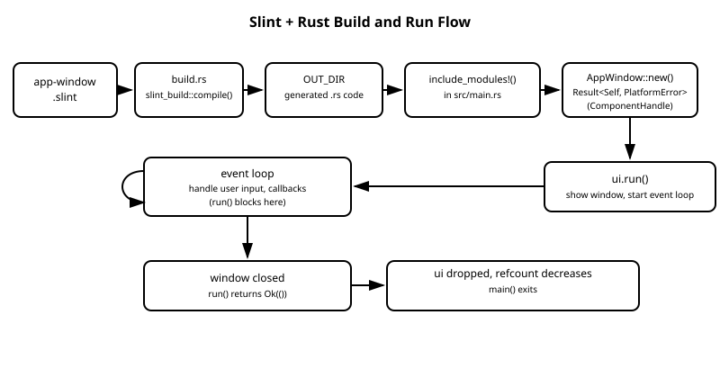

# 7장. Rust와 Slint 연동 기초

📖 [◀ 목차](00-목차.md) | [◀ 이전: 6장. 콜백과 이벤트 처리](ch06-콜백과이벤트처리.md) | [다음: 8장. Rust에서 프로퍼티 제어하기 ▶](ch08-Rust에서프로퍼티제어하기.md)

---

지금까지 여러 장에 걸쳐 `.slint` 언어 자체를 다뤘습니다. 컴포넌트를 선언하고, 레이아웃을 배치하고, 프로퍼티와 바인딩으로 상태를 표현하고, 콜백으로 사용자 입력에 반응하는 방법까지 살펴봤습니다. 이 모든 것은 `.slint` 파일 안에서 완결되는 이야기였습니다.

하지만 실제 애플리케이션은 UI만으로 이루어지지 않습니다. 파일을 읽고, 네트워크 요청을 보내고, 데이터베이스를 조회하고, 복잡한 계산을 수행하는 로직은 결국 Rust 코드로 작성됩니다. Slint가 실용적인 GUI 툴킷이 되려면 이 Rust 로직과 `.slint`로 선언한 UI가 서로 데이터를 주고받을 수 있어야 합니다.

이번 장에서는 그 다리를 놓는 기초를 다룹니다. `.slint` 파일이 어떻게 Rust 코드로 변신하는지, 그렇게 생성된 타입을 Rust 코드에서 어떻게 생성하고 실행하는지를 처음부터 끝까지 짚어보겠습니다. 8장에서는 여기서 한 걸음 더 나아가 프로퍼티를 통해 Rust와 UI가 실시간으로 데이터를 주고받는 방법을 다룹니다.

## 7.1 slint-build와 build.rs 다시 보기

2장에서 개발 환경을 설정하고 첫 창을 띄울 때, `Cargo.toml`에 `slint`와 `slint-build`를 추가하고 `build.rs`를 작성하는 과정을 이미 한 번 밟아 보았습니다. 그때는 그저 예제를 따라 치는 데 집중했다면, 이번 절에서는 그 각 단계가 실제로 무엇을 하는지 깊이 들여다보겠습니다.

Slint는 `.slint` 파일을 **인터프리터가 실행 중에 읽어들이는 스크립트**로 취급하지 않습니다. 대신 빌드 시점에 `.slint` 파일을 컴파일러가 읽어 대응하는 Rust 코드를 생성합니다. 즉 `.slint` 파일은 최종 실행 파일에 직접 포함되는 것이 아니라, 빌드 과정 중간에 Rust 코드로 번역된 뒤 나머지 Rust 코드와 함께 컴파일됩니다.

이 번역을 담당하는 것이 `slint-build` 크레이트이고, 그 진입점을 마련하는 것이 `build.rs`입니다.

```toml
# Cargo.toml
[package]
name = "hello_slint"
version = "0.1.0"
edition = "2021"

[dependencies]
slint = "1.8"

[build-dependencies]
slint-build = "1.8"
```

```rust
// build.rs
fn main() {
    slint_build::compile("ui/app-window.slint").unwrap();
}
```

`build.rs`는 Cargo가 인식하는 특별한 파일입니다. Cargo는 `hello_slint` 크레이트 본체를 컴파일하기 전에 `build.rs`를 먼저 별도의 작은 프로그램으로 컴파일하고 실행합니다. 이 실행 과정을 단계별로 풀어보면 다음과 같습니다.

1. **빌드 스크립트 실행**: Cargo가 `build.rs`를 컴파일해 빌드 스크립트로 실행합니다. 이 스크립트는 우리가 최종적으로 만들 애플리케이션의 일부가 아니라, 애플리케이션을 만들기 위한 사전 준비 작업입니다.
2. **Slint 컴파일러 호출**: `slint_build::compile("ui/app-window.slint")`가 호출되면, Slint 컴파일러가 `ui/app-window.slint`와 그 안에서 `import`한 파일들을 파싱합니다.
3. **Rust 코드 생성**: 파싱 결과로부터 `export`된 최상위 컴포넌트마다 대응하는 Rust `struct`와 그 구조체의 `impl` 블록(생성자, 프로퍼티 getter/setter, 콜백 연결 메서드 등)을 생성합니다. 생성된 코드는 Cargo가 각 크레이트마다 자동으로 할당하는 빌드 산출물 전용 디렉터리인 `OUT_DIR`에 `.rs` 파일로 저장됩니다. `OUT_DIR`이 실제로 어느 경로를 가리키는지는 신경 쓸 필요가 없습니다.
4. **재빌드 추적**: `slint_build::compile()`은 내부적으로 `cargo:rerun-if-changed` 지시자를 출력해, 컴파일한 `.slint` 파일(및 그것이 `import`하는 파일들)이 수정되면 Cargo가 이를 감지해 `build.rs`부터 다시 실행하도록 만듭니다. 일반 `.rs` 파일이 수정됐을 때 재컴파일되는 것과 동일한 감각으로 동작합니다.

핵심은 **컴포넌트 하나당 Rust 구조체 하나가 생성된다**는 점입니다. `app-window.slint`에 `export component AppWindow { ... }`라고 선언했다면, 빌드 후에는 `AppWindow`라는 이름의 Rust 구조체가 `OUT_DIR` 어딘가의 `.rs` 파일에 만들어집니다. 이 이름은 `.slint` 안에서 선언한 컴포넌트 이름과 그대로 일치하므로, UI 쪽 이름 규칙만 알면 Rust 쪽 타입 이름도 예측할 수 있습니다.

`slint_build::compile()`은 `Result<(), slint_build::CompileError>`를 반환합니다. 위 예제에서는 `.unwrap()`으로 처리했는데, `.slint` 파일에 문법 오류가 있으면 이 시점에 `build.rs`가 패닉을 일으키며 빌드가 중단되고, 어떤 파일의 몇 번째 줄이 문제인지 알려주는 오류 메시지가 출력됩니다. 즉 UI의 문법 오류를 실행 시점이 아니라 **빌드 시점에** 잡아낼 수 있다는 뜻입니다.

> 생성된 코드를 직접 열어 편집하고 싶은 유혹이 들 수 있지만, 그러지 않는 것이 좋습니다. 빌드할 때마다 다시 생성되므로 수정 내용이 사라질 뿐 아니라, 애초에 이 코드는 `.slint` 파일의 내용을 그대로 반영하도록 설계되어 있습니다. UI를 바꾸고 싶다면 `.slint` 파일을, 로직을 바꾸고 싶다면 `main.rs`(또는 다른 `.rs` 파일)를 수정하는 것이 올바른 역할 분담입니다. 정 궁금하다면 `cargo build` 후 `target/debug/build/<패키지명>-<해시>/out/` 아래에서 생성된 파일을 눈으로 확인해 볼 수는 있습니다.

## 7.2 include_modules!()로 생성된 코드 가져오기

`build.rs`가 `OUT_DIR`에 Rust 코드를 만들어 두었다고 해도, 그 코드는 아직 우리가 작성하는 `main.rs`와는 별개의 파일입니다. 이 둘을 연결하는 것이 `slint::include_modules!()` 매크로입니다.

```rust
// src/main.rs
slint::include_modules!();

fn main() -> Result<(), slint::PlatformError> {
    let ui = AppWindow::new()?;
    ui.run()
}
```

`include_modules!()`는 인자를 받지 않는 매크로로, 보통 `main.rs`(또는 `lib.rs`)의 맨 위, 다른 코드보다 먼저 호출합니다. 이 매크로가 하는 일의 원리는 다음과 같습니다.

Cargo의 빌드 스크립트는 표준 출력에 `cargo:rustc-env=KEY=VALUE` 형태의 줄을 출력해서, 뒤이어 컴파일되는 크레이트 본체에 환경 변수를 전달할 수 있습니다. `slint_build::compile()`은 이 메커니즘을 이용해 "방금 생성한 Rust 코드가 정확히 어느 경로에 있는지"를 환경 변수 형태로 남깁니다. `slint::include_modules!()`는 매크로 확장 시점에 이 환경 변수를 읽어, 대략 다음과 동일한 효과를 내는 코드로 스스로를 치환합니다.

```rust
include!(concat!(env!("OUT_DIR"), "/생성된_파일_이름.rs"));
```

즉 `include_modules!()`는 `OUT_DIR`에 저장된 Rust 소스 코드를 텍스트 그대로 현재 모듈에 붙여넣는 것과 같은 효과를 냅니다. 그 결과 생성된 코드 안에 정의된 `pub struct AppWindow { ... }`와 그 `impl` 블록이 마치 우리가 직접 `main.rs`에 타이핑한 것처럼 현재 모듈 스코프에 그대로 들어오고, 곧바로 `AppWindow::new()`처럼 사용할 수 있게 됩니다.

이 원리에서 자연스럽게 따라오는 규칙이 하나 있습니다. `include_modules!()`는 `build.rs`에서 `slint_build::compile()`(또는 뒤에서 다룰 `compile_with_config()`)을 **정확히 한 번** 호출했다는 것을 전제로 동작합니다. 한 프로젝트 안에서 서로 무관한 여러 개의 진입점 `.slint` 파일을 각각 컴파일하고 싶다면, `include_modules!()` 대신 `include!(concat!(env!("OUT_DIR"), "/파일이름.rs"))`처럼 경로를 직접 지정해서 필요한 만큼 가져와야 합니다. 다만 대부분의 프로젝트에서는 진입점 `.slint` 파일 하나가 `import`로 다른 `.slint` 파일들을 끌어들이는 구조로 충분하며, 이 방식은 7.5절에서 다룹니다.

## 7.3 생성된 컴포넌트와 ComponentHandle 트레이트

빌드가 끝나면 `AppWindow`라는 Rust 구조체가 현재 모듈에 존재하게 됩니다. 이 구조체를 다루는 방법은 두 갈래로 나뉩니다. 하나는 그 구조체에만 있는 고유한 연관 함수(associated function)이고, 다른 하나는 `slint` 크레이트가 정의한 `ComponentHandle` 트레이트를 통해 제공되는 공통 메서드입니다.

**`new()`는 각 컴포넌트 타입마다 생성되는 고유한 연관 함수**입니다.

```rust
impl AppWindow {
    pub fn new() -> Result<Self, slint::PlatformError> {
        // ... 내부적으로 플랫폼 윈도우 시스템과의 연결을 준비하고
        //     .slint에서 선언한 초기 프로퍼티 값을 설정합니다.
    }
}
```

`new()`가 `Result`를 반환하는 이유는, 창을 생성하는 과정에서 그래픽 백엔드 초기화 실패처럼 복구 불가능한 플랫폼 오류가 발생할 수 있기 때문입니다. `?` 연산자로 오류를 바로 전파하는 것이 일반적인 사용법입니다.

**나머지 메서드들은 `slint::ComponentHandle` 트레이트가 정의하고, 생성된 `AppWindow`가 이를 구현(`impl ComponentHandle for AppWindow`)하는 형태로 제공됩니다.** 개념 설명을 위해 핵심 메서드만 단순화해서 옮기면 다음과 같은 모양입니다.

```rust
// slint 크레이트가 제공하는 트레이트를 이해를 돕기 위해 단순화한 형태
pub trait ComponentHandle {
    fn show(&self) -> Result<(), slint::PlatformError>;
    fn hide(&self) -> Result<(), slint::PlatformError>;
    fn run(&self) -> Result<(), slint::PlatformError>;
    fn window(&self) -> &slint::Window;
    fn as_weak(&self) -> slint::Weak<Self> where Self: Sized;
    fn clone_strong(&self) -> Self;
}
```

각 메서드의 역할은 다음과 같습니다.

- **`show(&self)`**: 창을 화면에 표시합니다. 다만 이 메서드 자체는 이벤트 루프를 시작하지 않습니다. 여러 개의 창을 각각 `show()`한 뒤 이벤트 루프를 한 번만 시작하고 싶을 때(예: 멀티 윈도우 애플리케이션) 유용합니다.
- **`hide(&self)`**: 화면에서 창을 숨깁니다.
- **`run(&self)`**: 이번 장에서 가장 자주 쓰게 될 메서드로, 내부적으로 `show()`를 호출한 뒤 이벤트 루프를 시작하고, 이벤트 루프가 끝나면 다시 `hide()`를 호출하는 편의 메서드입니다. 단일 창 애플리케이션이라면 대부분 `show()`/`hide()`를 직접 호출할 필요 없이 `run()` 하나로 충분합니다.
- **`window(&self)`**: `slint::Window`에 대한 참조를 반환합니다. 창의 위치나 전체 화면 전환처럼 컴포넌트 자체의 프로퍼티로는 표현되지 않는, 더 저수준의 창 제어가 필요할 때 이 값을 사용합니다. 예를 들어 `ui.window().set_fullscreen(true);`처럼 호출할 수 있습니다.
- **`as_weak(&self)`**: 이 컴포넌트를 가리키는 약한 참조(`slint::Weak<Self>`)를 만듭니다. 콜백 클로저 안에서 컴포넌트 자기 자신을 참조해야 할 때 강한 참조 순환을 피하기 위해 사용하며, 8장에서 자세히 다룹니다.
- **`clone_strong(&self)`**: 같은 컴포넌트를 가리키는 새로운 강한 핸들을 복제합니다.

### run()의 블로킹 특성

`ComponentHandle::run()`을 호출하는 순간 다음과 같은 일이 일어납니다.

1. 운영체제에 실제 윈도우가 생성되고 화면에 표시됩니다.
2. Slint의 **이벤트 루프**가 시작됩니다. 이벤트 루프란 마우스 클릭, 키보드 입력, 창 크기 변경, 다시 그리기 요청 같은 이벤트를 끊임없이 받아 처리하는 반복 구조입니다.
3. 사용자가 버튼을 클릭하면 콜백이 트리거되고, 프로퍼티가 바뀌면 화면이 다시 그려지는 등, `.slint`에서 선언한 모든 반응형 동작이 실제로 작동하기 시작합니다.

여기서 반드시 기억해야 할 특징이 하나 있습니다. **`run()`은 블로킹(blocking) 호출**이라는 점입니다. 즉 사용자가 창을 닫기 전까지 `run()`은 반환되지 않습니다.

```rust
fn main() -> Result<(), slint::PlatformError> {
    let ui = AppWindow::new()?;

    ui.run()?; // 창이 닫힐 때까지 여기서 멈춰 있습니다

    // 창이 닫힌 뒤에야 이 지점에 도달합니다
    Ok(())
}
```

일반적인 데스크톱 GUI 애플리케이션의 `main()` 함수는 결국 다음과 같은 아주 단순한 구조로 요약됩니다.

- UI를 생성한다 (`AppWindow::new()`)
- 필요하다면 콜백을 연결하고 초기 상태를 설정한다 (8장에서 다룹니다)
- 이벤트 루프를 시작한다 (`run()`)
- 창이 닫히면 값이 스코프를 벗어나며 자동으로 정리된다

`ui`가 함수 스코프를 벗어나 소멸되면 Rust의 소유권 규칙에 따라 `Drop`이 호출되면서 내부 참조 카운트가 감소하고, 마지막 참조가 사라지면 컴포넌트 인스턴스도 함께 해제됩니다. C나 C++처럼 별도의 해제 함수를 직접 호출할 필요가 없습니다.

## 7.4 완전한 예제: Hello Slint를 Rust 관점에서 다시 보기

2장에서 만들었던 첫 창 예제를 이번에는 Rust 쪽 흐름에 집중해서 다시 살펴보겠습니다. 프로젝트 구조는 다음과 같다고 가정합니다.

```
hello_slint/
├── Cargo.toml
├── build.rs
├── src/
│   └── main.rs
└── ui/
    └── app-window.slint
```

`ui/app-window.slint`는 창 하나에 텍스트를 표시하는 아주 단순한 컴포넌트입니다.

```slint
export component AppWindow inherits Window {
    width: 320px;
    height: 200px;
    title: "Hello Slint";

    Text {
        text: "Hello, Slint from Rust!";
        font-size: 20px;
        horizontal-alignment: center;
        vertical-alignment: center;
    }
}
```

`build.rs`와 `Cargo.toml`은 7.1절에서 살펴본 것과 동일한 형태입니다.

```rust
// build.rs
fn main() {
    slint_build::compile("ui/app-window.slint").unwrap();
}
```

이제 `src/main.rs`를 앞서 배운 세 단계 — `include_modules!()`, `new()`, `run()` — 을 명시적으로 나눠서 작성해 보겠습니다.

```rust
// src/main.rs

// build.rs가 app-window.slint로부터 생성한 코드를 현재 모듈로 가져옵니다.
// 이 코드 안에 pub struct AppWindow { ... }가 정의되어 있습니다.
slint::include_modules!();

fn main() -> Result<(), slint::PlatformError> {
    // 1단계: AppWindow::new()로 인스턴스를 생성합니다.
    //         반환 타입은 Result<AppWindow, slint::PlatformError>입니다.
    let ui = AppWindow::new()?;

    // 2단계: run()을 호출해 창을 띄우고 이벤트 루프를 시작합니다.
    //         이 호출은 창이 닫힐 때까지 반환되지 않습니다.
    ui.run()

    // 3단계: 창이 닫히면 run()이 Ok(())를 반환하고,
    //         main()도 곧바로 종료됩니다. ui는 스코프를 벗어나며
    //         자동으로 정리됩니다.
}
```

빌드하고 실행하면 "Hello, Slint from Rust!"라는 문구가 담긴 320x200 크기의 창이 뜹니다. 창을 닫으면 `run()`이 `Ok(())`를 반환하고 `main()`도 곧바로 종료됩니다.

이 짧은 예제 안에 이번 장에서 다룬 개념이 모두 들어 있습니다.

- `.slint` 파일은 빌드 시점에 `slint-build`에 의해 컴파일되어 Rust 코드로 번역된다 (`app-window.slint` → `OUT_DIR` 안의 `.rs` 파일)
- `slint::include_modules!()`는 그 생성된 코드를 현재 모듈로 가져온다
- 생성된 구조체는 `T::new()`로 인스턴스를 만들고, `ComponentHandle` 트레이트의 `run()`으로 창을 띄운다
- `run()`은 창을 띄우고 이벤트 루프를 시작하며, 창이 닫힐 때까지 블로킹된다

아래 다이어그램은 이 전체 흐름을 `.slint` 파일 작성부터 창이 닫히기까지 한눈에 정리한 것입니다.



지금까지는 UI를 그냥 띄우기만 했을 뿐, Rust 코드와 UI 사이에 데이터가 오가지는 않았습니다. 다음 장에서는 `.slint`에서 선언한 프로퍼티를 Rust에서 읽고 쓰는 방법, 그리고 콜백을 통해 UI와 Rust 로직이 서로 신호를 주고받는 방법을 다룹니다.

## 7.5 여러 .slint 파일로 프로젝트 구성하기

지금까지는 `.slint` 파일이 하나뿐인 단순한 예제만 다뤘습니다. 하지만 프로젝트가 커지면 컴포넌트를 여러 파일로 나누고 싶어집니다. Slint 언어는 `import` 문으로 이를 지원하며, `build.rs` 쪽 설정은 사실 거의 달라지지 않습니다.

프로젝트 구조가 다음과 같다고 가정해 봅시다.

```
hello_slint/
├── Cargo.toml
├── build.rs
├── src/
│   └── main.rs
└── ui/
    ├── app-window.slint
    └── counter-view.slint
```

`ui/counter-view.slint`는 재사용 가능한 카운터 표시 컴포넌트입니다.

```slint
// ui/counter-view.slint
export component CounterView inherits Rectangle {
    in-out property <int> count: 0;

    Text {
        text: "count: " + count;
        font-size: 20px;
        horizontal-alignment: center;
        vertical-alignment: center;
    }
}
```

`ui/app-window.slint`는 `import` 문으로 이 컴포넌트를 가져와 사용합니다.

```slint
// ui/app-window.slint
import { CounterView } from "counter-view.slint";

export component AppWindow inherits Window {
    width: 320px;
    height: 200px;
    title: "Hello Slint";

    CounterView {
        count: 42;
    }
}
```

여기서 눈여겨볼 점은 **`build.rs`가 여전히 진입점 파일 하나만 컴파일하면 된다**는 것입니다.

```rust
// build.rs
fn main() {
    slint_build::compile("ui/app-window.slint").unwrap();
}
```

`import { CounterView } from "counter-view.slint";`처럼 상대 경로로 다른 `.slint` 파일을 지정하면, Slint 컴파일러가 `app-window.slint`가 있는 디렉터리를 기준으로 그 파일을 찾아 함께 파싱합니다. 즉 여러 `.slint` 파일이 있더라도 `slint_build::compile()`은 **진입점 파일 하나**만 알려주면 되고, 나머지는 `import` 관계를 따라 자동으로 컴파일 대상에 포함됩니다.

다만 한 가지 규칙이 있습니다. `include_modules!()`를 통해 Rust 쪽에서 `T::new()`로 직접 생성할 수 있는 타입은 **진입점 파일에서 `export`된 컴포넌트**뿐입니다. 위 예제에서 `CounterView`는 `counter-view.slint`에서 `export`되어 있지만, `app-window.slint`에서는 그것을 가져다 쓸 뿐 다시 내보내지 않았으므로 Rust 쪽에는 `CounterView`라는 타입이 생성되지 않습니다. `main.rs`에서 `AppWindow`만 다룰 수 있고, `AppWindow`의 프로퍼티를 통해 내부 상태를 제어하는 것이 일반적인 패턴입니다.

만약 `CounterView`도 Rust 쪽에서 직접 다루고 싶다면(예: 별도의 팝업 창으로 독립적으로 띄우고 싶은 경우), 진입점 파일에서 다시 내보내면 됩니다.

```slint
// ui/app-window.slint
export { CounterView } from "counter-view.slint";

import { CounterView } from "counter-view.slint";

export component AppWindow inherits Window {
    // ...
}
```

> **여러 개의 독립적인 진입점이 필요하다면**: 서로 `import` 관계가 없는 완전히 별개의 `.slint` 파일 여러 개를 한 프로젝트에서 컴파일하고 싶을 수도 있습니다. 이 경우 `build.rs`에서 `slint_build::compile()`을 여러 번 호출할 수는 있지만, `slint::include_modules!()`는 그중 하나만 가져올 수 있습니다. 나머지는 7.2절에서 설명한 것처럼 `include!(concat!(env!("OUT_DIR"), "/파일이름.rs"))` 형태로 직접 경로를 지정해 가져와야 합니다. 대부분의 실무 프로젝트에서는 이런 구성보다, 지금 살펴본 것처럼 진입점 파일 하나가 `import`로 나머지를 묶는 구조가 훨씬 관리하기 쉽습니다.

## 7.6 대안: slint! 매크로로 인라인 UI 작성하기

지금까지 다룬 "`.slint` 파일 + `build.rs` + `include_modules!()`" 조합이 실무에서 권장되는 표준 방식입니다. 하지만 아주 짧은 예제나 실험적인 코드를 작성할 때, 별도 파일을 만들고 `build.rs`를 설정하는 절차가 번거롭게 느껴질 수 있습니다. 이런 상황을 위해 Slint는 `slint::slint!` 매크로를 제공합니다.

```rust
// build.rs나 별도 .slint 파일 없이, Rust 소스 코드 안에 UI를 직접 작성합니다.
slint::slint! {
    export component AppWindow inherits Window {
        width: 320px;
        height: 200px;
        title: "Hello Slint";

        Text {
            text: "Hello from the slint! macro";
            font-size: 20px;
            horizontal-alignment: center;
            vertical-alignment: center;
        }
    }
}

fn main() -> Result<(), slint::PlatformError> {
    let ui = AppWindow::new()?;
    ui.run()
}
```

`slint!` 매크로는 중괄호 안의 내용을 `.slint` 파일과 동일한 문법으로 해석해, 컴파일 시점에 `include_modules!()`가 가져오는 것과 사실상 동등한 Rust 코드를 그 자리에 생성합니다. 이 방식을 쓰면 `Cargo.toml`에 `slint-build`를 build-dependency로 추가하거나 `build.rs`를 작성할 필요조차 없이, `slint` 크레이트 하나만으로 UI와 로직을 한 `.rs` 파일 안에 완결시킬 수 있습니다.

다만 실무 프로젝트에서는 별도 `.slint` 파일 방식을 더 권장합니다. 이유는 다음과 같습니다.

- **도구 지원**: Slint의 VS Code 확장이나 `slint-viewer` 같은 미리보기 도구는 `.slint` 파일을 대상으로 동작합니다. `slint!` 매크로로 Rust 문자열처럼 파묻힌 UI 코드는 이런 도구의 실시간 미리보기나 구문 강조 지원을 온전히 받기 어렵습니다.
- **역할 분리**: UI 디자인과 Rust 로직이 물리적으로 다른 파일에 있으면, 디자이너와 개발자가 각자의 파일을 건드리며 협업하기 쉽습니다. 하나의 `.rs` 파일 안에 UI 마크업과 비즈니스 로직이 뒤섞이면 파일이 길어질수록 가독성이 떨어집니다.
- **재사용성**: `.slint` 파일은 여러 진입점(예: 데스크톱 앱과 데모 뷰어)에서 동일하게 재사용하기 쉽지만, 매크로 안에 작성한 UI는 그 자리에 고정됩니다.

따라서 `slint!` 매크로는 짧은 프로토타입이나 이 책의 다음 장들에서 개념을 빠르게 보여주는 용도로는 유용하지만, 이 책의 예제 대부분은 계속해서 `.slint` 파일 + `build.rs` 조합을 기본으로 삼습니다.

## 요약

- `.slint` 파일은 실행 시점에 해석되는 스크립트가 아니라, **빌드 시점에 `slint-build` 크레이트가 컴파일해 Rust 코드로 변환**합니다. `build.rs`에서 `slint_build::compile("경로")`를 호출하면 이 코드 생성 과정이 트리거되며, 생성된 코드는 `OUT_DIR`에 저장됩니다.
- `slint::include_modules!()`는 `OUT_DIR`에 생성된 Rust 코드를 현재 모듈로 가져오는 매크로입니다. `build.rs`가 남긴 환경 변수를 읽어, 생성된 파일을 `include!`하는 것과 동등한 효과를 냅니다.
- 생성된 컴포넌트 타입(예: `AppWindow`)은 고유한 연관 함수 `new() -> Result<Self, PlatformError>`로 생성하고, `slint::ComponentHandle` 트레이트가 제공하는 `run()`, `show()`, `hide()`, `window()`, `as_weak()` 등의 메서드로 다룹니다.
- `run()`은 창을 화면에 표시하고 이벤트 루프를 시작하는 **블로킹** 호출입니다. 창이 닫히면 `Ok(())`를 반환합니다.
- 여러 `.slint` 파일은 `import` 문으로 연결하며, `build.rs`는 여전히 진입점 파일 하나만 지정하면 됩니다. Rust에서 직접 생성할 수 있는 타입은 진입점 파일에서 `export`된 컴포넌트뿐입니다.
- `slint::slint!` 매크로로 `.slint` 코드를 Rust 소스 안에 인라인으로 작성할 수도 있지만, 도구 지원과 역할 분리 측면에서 실무에서는 별도 `.slint` 파일 방식이 더 권장됩니다.

## 연습문제

1. `.slint` 파일이 인터프리터 방식이 아니라 빌드 시점에 Rust 코드로 컴파일되는 방식을 택했을 때 얻을 수 있는 장점을 두 가지 이상 생각해 보세요.
2. `AppWindow::new()`가 `Self`가 아니라 `Result<Self, slint::PlatformError>`를 반환하는 이유를 설명해 보세요. 만약 `new()`가 실패할 수 없다고 가정했다면 어떤 문제가 생길 수 있을까요?
3. `ComponentHandle::run()`이 내부적으로 `show()` 호출, 이벤트 루프 시작, `hide()` 호출을 차례로 수행하는 편의 메서드라는 점을 이용해, `run()` 대신 `show()`를 직접 호출해야 하는 상황을 하나 생각해 보세요.
4. 7.5절의 예제에서 `app-window.slint`가 `CounterView`를 `import`만 하고 다시 `export`하지 않았을 때, `main.rs`에서 `CounterView::new()`를 호출하면 어떤 컴파일 오류가 발생할지 예상해 보세요.
5. `slint::slint!` 매크로 방식과 `.slint` 파일 + `build.rs` 방식 중 하나를 골라야 하는 다음 두 상황에 대해 각각 어느 쪽이 더 적합할지, 그리고 그 이유를 설명해 보세요. (a) 컴파일러 기능을 확인하기 위한 5줄짜리 테스트 코드, (b) 디자이너와 개발자가 함께 작업하는 상용 데스크톱 애플리케이션.


---

📖 [◀ 목차](00-목차.md) | [◀ 이전: 6장. 콜백과 이벤트 처리](ch06-콜백과이벤트처리.md) | [다음: 8장. Rust에서 프로퍼티 제어하기 ▶](ch08-Rust에서프로퍼티제어하기.md)
