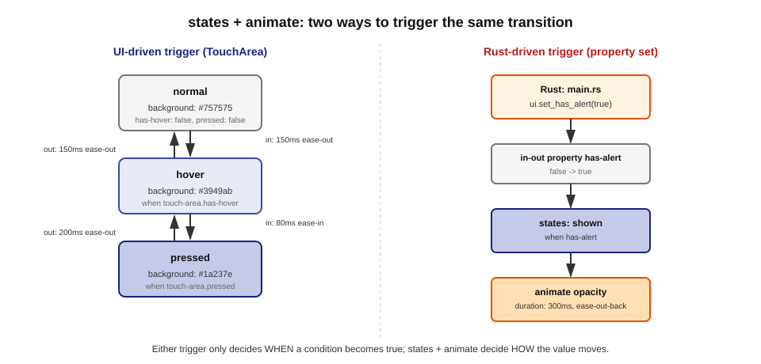

# 10장. 상태(states)와 애니메이션

📖 [◀ 목차](00-목차.md) | [◀ 이전: 9장. 표준 위젯 라이브러리(std-widgets)](ch09-표준위젯라이브러리.md) | [다음: 11장. 리스트와 모델(Model) ▶](ch11-리스트와모델.md)

---

## 조건이 늘어날수록 삼항 연산자는 버거워진다

버튼 하나를 만들 때 "눌려 있으면 진한 색, 아니면 옅은 색"이라는 조건은 삼항 연산자만으로 충분히 표현할 수 있습니다.

```slint
background: touch-area.pressed ? darkblue : gray;
```

하지만 실제 UI 부품은 눌림 상태 하나만 갖는 경우가 드뭅니다. 마우스가 올라와 있는지(hover), 눌려 있는지(pressed), 비활성화되었는지(disabled)처럼 여러 조건이 동시에 존재할 수 있고, 조건마다 배경색뿐 아니라 테두리 두께, 글자색, 그림자 같은 여러 프로퍼티가 함께 바뀌어야 할 수도 있습니다. 이런 조건을 프로퍼티마다 따로 삼항 연산자로 적으면, "지금 이 컴포넌트가 어떤 모습이어야 하는가"라는 전체 그림을 한눈에 파악하기가 점점 어려워집니다. Slint는 이 문제를 위해 `states`라는 전용 문법을 제공합니다.

## states 블록: 이름 붙은 상태 정의하기

`states` 블록은 컴포넌트가 가질 수 있는 여러 "상태"에 이름을 붙이고, 각 상태에서 프로퍼티 값이 무엇이어야 하는지를 한곳에 모아 선언합니다.

```slint
component StateBadge inherits Rectangle {
    width: 160px;
    height: 48px;
    border-radius: 8px;
    background: gray;

    touch-area := TouchArea {}

    states [
        pressed when touch-area.pressed: {
            background: darkblue;
        }
        normal: {
            background: gray;
        }
    ]
}
```

`states [ ... ]` 안에는 상태를 하나씩 나열합니다. `pressed when touch-area.pressed: { ... }`는 "`touch-area.pressed`가 참일 때 `pressed`라는 이름의 상태가 되고, 이 상태에서는 `background`가 `darkblue`다"라는 선언입니다. `when` 뒤의 조건식은 프로퍼티 바인딩에 쓰는 표현식과 동일한 문법을 그대로 사용합니다. `when`이 없는 `normal: { ... }`은 다른 상태의 조건이 하나도 참이 아닐 때 적용되는 기본 상태 역할을 합니다.

상태가 늘어나고 각 상태에서 바뀌는 프로퍼티가 여러 개로 늘어날수록 `states`의 이점이 뚜렷해집니다.

```slint
states [
    pressed when touch-area.pressed: {
        background: darkblue;
        border-width: 2px;
    }
    hover when touch-area.has-hover: {
        background: royalblue;
        border-width: 1px;
    }
    normal: {
        background: gray;
        border-width: 1px;
    }
]
```

각 상태 안에서 바뀌는 프로퍼티들을 한 블록에 모아 적을 수 있으므로, 프로퍼티별로 조건을 흩어 적는 대신 상태별로 "이 상태에서는 이렇게 보인다"를 모아 적을 수 있습니다.

## 상태 전환은 선언될 뿐, 명령되지 않는다

`states` 블록에서 가장 중요한 특징은, 어떤 상태로 "전환하라"고 명령형으로 지시하는 코드가 어디에도 없다는 점입니다. 각 상태에 붙은 `when` 조건식이 참이 되는 순간 Slint 런타임이 알아서 해당 상태를 적용합니다. 개발자가 하는 일은 "언제 어떤 모습이어야 하는가"를 선언하는 것뿐이고, 그 조건을 언제 평가해서 실제로 전환을 일으킬지는 전적으로 프레임워크의 책임입니다.

이는 프로퍼티 바인딩에서부터 이어지는 Slint의 선언적 철학의 연장선입니다. `background: touch-area.pressed ? darkblue : gray;`라는 바인딩을 쓸 때도 "`pressed`가 바뀔 때마다 다시 계산해서 반영하라"고 명령한 적은 없었습니다. `pressed`와 `background` 사이의 관계만 선언했을 뿐, 그 관계를 언제 갱신할지는 Slint가 알아서 처리했습니다. `states`는 이 아이디어를 여러 프로퍼티, 여러 조건으로 확장한 것뿐입니다.

## animate 키워드: 값 변화를 부드럽게 만들기

지금까지의 예제는 조건이 바뀌는 순간 프로퍼티 값이 즉시 뒤바뀝니다. 회색에서 남색으로 색이 한 프레임 만에 툭 바뀌는 것입니다. 대부분의 UI에서는 값이 짧은 시간에 걸쳐 부드럽게 바뀌는 편이 더 자연스럽게 느껴집니다. Slint는 이를 위해 `animate` 키워드를 제공합니다.

```slint
component AnimatedBadge inherits Rectangle {
    width: 160px;
    height: 48px;
    background: gray;

    animate background {
        duration: 200ms;
        easing: ease-in-out;
    }

    touch-area := TouchArea {}

    states [
        pressed when touch-area.pressed: {
            background: darkblue;
        }
        normal: {
            background: gray;
        }
    ]
}
```

`animate background { duration: 200ms; easing: ease-in-out; }`는 "`background` 값이 바뀔 때마다 그 변화를 200밀리초에 걸쳐 `ease-in-out` 곡선을 따라 진행시켜라"라는 선언입니다. 이 선언을 컴포넌트 본문에 한 번 적어두면, 그 뒤로 `background`가 어떤 이유로 바뀌든(`states`에 의해서든, 다른 바인딩이나 Rust 코드에 의해서든) 자동으로 애니메이션이 적용됩니다.

`animate` 블록에는 다음과 같은 필드를 쓸 수 있습니다.

- `duration`: 애니메이션이 진행되는 시간. `200ms`, `1s`처럼 밀리초나 초 단위를 붙입니다.
- `easing`: 시간에 따라 값이 변화하는 속도 곡선. `linear`(일정한 속도), `ease`, `ease-in`(천천히 시작), `ease-out`(천천히 멈춤), `ease-in-out`(양 끝이 느림) 외에도 `ease-in-quad` 계열, `ease-in-back`/`ease-out-back`/`ease-in-out-back`(살짝 튕기는 느낌), `ease-in-elastic` 계열, `ease-in-bounce` 계열처럼 더 다양한 곡선을 쓸 수 있고, CSS와 같은 형식의 `cubic-bezier(x1, y1, x2, y2)`로 직접 곡선을 정의할 수도 있습니다.
- `delay`: 값이 바뀐 시점부터 애니메이션이 실제로 시작하기까지 기다리는 시간.
- `iteration-count`: 애니메이션을 반복할 횟수. 음수를 주면 무한히 반복합니다.

색상뿐 아니라 숫자로 표현되는 대부분의 프로퍼티(`width`, `height`, `opacity`, `x`, `y` 등)에도 `animate`를 똑같이 적용할 수 있습니다. 또한 같은 지속 시간과 곡선을 여러 프로퍼티에 함께 적용하고 싶다면, 프로퍼티 이름을 쉼표로 나열하면 됩니다.

```slint
animate background, border-width {
    duration: 200ms;
    easing: ease-in-out;
}
```

이렇게 하면 `background`와 `border-width`가 매번 같은 방식으로, 같은 타이밍에 함께 애니메이션됩니다.

## 상태별로 다른 애니메이션 지정하기: in과 out

지금까지 본 `animate` 선언은 해당 프로퍼티가 어떤 방향으로 바뀌든 항상 같은 지속 시간과 곡선을 사용합니다. 하지만 "버튼을 누르는 순간은 빠르게 반응하고, 손을 떼서 돌아올 때는 좀 더 여유 있게 풀어지는" 것처럼 들어가는 방향과 나가는 방향의 느낌을 다르게 주고 싶을 때가 있습니다. `states` 블록의 각 상태 안에는 `in`과 `out`이라는 하위 블록을 둘 수 있는데, 여기에 그 상태로 **들어올 때**와 그 상태에서 **나갈 때** 적용할 애니메이션을 따로 지정할 수 있습니다.

```slint
states [
    pressed when touch-area.pressed: {
        background: darkblue;
        in {
            animate background { duration: 80ms; easing: ease-in; }
        }
        out {
            animate background { duration: 200ms; easing: ease-out; }
        }
    }
    normal: {
        background: gray;
    }
]
```

`pressed` 상태에 진입할 때(`in`)는 80밀리초 만에 재빠르게 어두운 색으로 바뀌고, `pressed` 상태를 벗어날 때(`out`)는 200밀리초에 걸쳐 천천히 원래 색으로 풀립니다. 이 절 뒤에 나오는 실전 예제에서 이 문법을 다시 사용합니다.

## 상태와 애니메이션 결합하기: 마우스 오버·눌림 버튼

이제 `states`와 `animate`를 함께 사용해, 마우스를 올렸을 때와 눌렀을 때 색이 서로 다른 속도로 부드럽게 바뀌는 실전 버튼을 만들어 보겠습니다.

```slint
export component HoverButton inherits Rectangle {
    width: 160px;
    height: 48px;
    border-radius: 8px;
    background: #757575;

    callback clicked <=> touch-area.clicked;

    touch-area := TouchArea {}

    states [
        pressed when touch-area.pressed: {
            background: #1a237e;
            in {
                animate background { duration: 80ms; easing: ease-in; }
            }
            out {
                animate background { duration: 200ms; easing: ease-out; }
            }
        }
        hover when touch-area.has-hover: {
            background: #3949ab;
            in {
                animate background { duration: 150ms; easing: ease-out; }
            }
            out {
                animate background { duration: 150ms; easing: ease-out; }
            }
        }
        normal: {
            background: #757575;
        }
    ]

    Text {
        text: "클릭하세요";
        color: white;
        horizontal-alignment: center;
        vertical-alignment: center;
    }
}
```

이 컴포넌트가 동작하는 흐름을 정리하면 다음과 같습니다.

1. 평소에는 `touch-area.pressed`도 `touch-area.has-hover`도 거짓이므로 `normal` 상태가 적용되어 `background`는 `#757575`(회색)입니다.
2. 마우스를 버튼 위로 가져가면 `touch-area.has-hover`가 참이 되어 `hover` 상태로 전환되고, `hover`의 `in` 블록에 따라 150밀리초에 걸쳐 `#3949ab`(남색 계열)로 부드럽게 바뀝니다.
3. 버튼을 누르면 `touch-area.pressed`가 참이 되어 `pressed` 상태로 전환되고, `pressed`의 `in` 블록에 따라 단 80밀리초 만에 `#1a237e`(더 짙은 남색)로 재빠르게 반응합니다. 클릭에는 즉각적인 피드백이 중요하기 때문에 진입 애니메이션을 의도적으로 짧게 잡았습니다.
4. 손을 떼면 다시 `hover` 또는 `normal` 상태로 돌아가는데, 이때는 `pressed`의 `out` 블록이 적용되어 200밀리초에 걸쳐 한결 여유 있게 색이 풀립니다.

여기서 개발자가 작성한 코드는 "각 상태에서 배경색이 무엇인가"와 "그 상태로 들어오고 나갈 때 각각 어떻게 전환할 것인가"라는 선언뿐입니다. 마우스 진입·이탈, 클릭·해제 이벤트를 감지해서 애니메이션을 언제 시작하고 끝낼지 계산하는 코드는 한 줄도 없습니다.

## Rust에서 상태 변화를 유발하기: 프로퍼티 설정이라는 트리거

지금까지의 예제는 모두 `TouchArea`가 감지하는 마우스 동작이 `when` 조건을 참으로 만들었습니다. 그런데 `when` 조건에 들어가는 프로퍼티가 반드시 UI 내부의 이벤트에서만 나와야 하는 것은 아닙니다. 루트 컴포넌트가 `in-out property`로 선언한 프로퍼티라면, Rust 쪽에서 생성된 `set_<이름>(...)` 함수로 그 값을 바꿀 수 있고, 그 순간 `when` 조건이 재평가되어 상태 전환과 애니메이션이 그대로 일어납니다. 즉 Rust 코드에서 프로퍼티 하나를 설정하는 것이, `states`와 `animate`가 이미 준비해 둔 시각적 전환을 "발사"하는 트리거가 되는 셈입니다.

알림이 도착했을 때 배지가 튀어나오듯 나타나는 컴포넌트로 이 관계를 확인해 보겠습니다.

```slint
// ui/notification_badge.slint
import { Button } from "std-widgets.slint";

export component NotificationBadge inherits Rectangle {
    width: 220px;
    height: 90px;

    in-out property <bool> has-alert: false;
    callback dismissed();

    badge := Rectangle {
        x: 96px;
        y: 12px;
        width: 28px;
        height: 28px;
        border-radius: 14px;
        background: #d32f2f;

        states [
            shown when has-alert: {
                opacity: 1.0;
                in {
                    animate opacity { duration: 300ms; easing: ease-out-back; }
                }
            }
            hidden when !has-alert: {
                opacity: 0.0;
                in {
                    animate opacity { duration: 150ms; easing: ease-in; }
                }
            }
        ]
    }

    Button {
        y: 52px;
        text: "확인";
        enabled: has-alert;
        clicked => {
            has-alert = false;
            dismissed();
        }
    }
}
```

`has-alert`가 거짓에서 참으로 바뀌는 순간 `badge`는 `shown` 상태로 전환되고, `ease-out-back` 곡선 덕분에 살짝 튕기듯 나타납니다. "확인" 버튼을 누르면 `has-alert`를 다시 거짓으로 되돌리면서 `dismissed` 콜백을 호출하고, 이번에는 `hidden` 상태의 `in` 블록에 따라 좀 더 빠르게 사라집니다.

이 컴포넌트를 Rust에서 띄우면서, 마치 서버에서 알림이 도착한 것처럼 2초 뒤에 `has-alert`를 참으로 바꿔 보겠습니다.

```rust
// src/main.rs
slint::include_modules!();

use std::time::Duration;

fn main() -> Result<(), slint::PlatformError> {
    let ui = NotificationBadge::new()?;

    ui.on_dismissed(|| {
        println!("알림을 확인했습니다");
    });

    slint::Timer::single_shot(Duration::from_secs(2), {
        let ui_weak = ui.as_weak();
        move || {
            if let Some(ui) = ui_weak.upgrade() {
                ui.set_has_alert(true);
            }
        }
    });

    ui.run()
}
```

`slint::Timer::single_shot(duration, closure)`는 지정한 시간이 지난 뒤 이벤트 루프 안에서 클로저를 한 번 실행합니다. 여기서도 클로저는 `ui`를 직접 캡처하지 않고 `ui.as_weak()`로 얻은 약한 참조를 캡처한 뒤, 실행 시점에 `.upgrade()`로 강한 참조를 얻어 `set_has_alert(true)`를 호출합니다. 창이 이미 닫힌 뒤에 타이머가 실행되더라도 `upgrade()`가 `None`을 돌려줄 뿐이므로 안전합니다.

이 예제에서 Rust 코드와 `.slint` 코드의 역할은 명확히 나뉩니다.

- Rust 코드가 하는 일은 오직 `set_has_alert(true)`처럼 **프로퍼티 값을 바꾸는 것**뿐입니다. 배지를 "몇 밀리초에 걸쳐 어떻게 나타나게 할지"는 Rust 코드 어디에도 없습니다.
- `.slint` 코드는 `has-alert`라는 조건과 그 조건에 따른 모습(`states`), 그리고 그 모습이 바뀔 때의 전환 방식(`animate`, `in`/`out`)만 선언합니다. 그 값이 마우스 이벤트에서 오는지, 타이머에서 오는지, 네트워크 응답을 처리한 뒤에 오는지는 전혀 신경 쓰지 않습니다.

이렇게 트리거(프로퍼티 설정)와 시각적 전환(states + animate)을 완전히 분리해 두면, 나중에 "타이머 대신 실제 서버 푸시 알림이 왔을 때 배지를 띄운다"로 로직을 바꾸더라도 `set_has_alert(true)`를 호출하는 위치만 바뀔 뿐, `.slint` 쪽의 애니메이션 코드는 한 줄도 손댈 필요가 없습니다.

아래 다이어그램은 이 관계를 두 갈래로 정리해 보여줍니다. 왼쪽은 `HoverButton`처럼 UI 내부 이벤트(`has-hover`, `pressed`)가 `states`를 오가는 흐름이고, 오른쪽은 Rust 코드가 프로퍼티를 설정해 같은 메커니즘을 트리거하는 흐름입니다. 두 경우 모두 상태가 바뀌는 순간의 값 변화는 `animate`가 보간해 화면에 부드럽게 반영합니다.



## 요약

- `states [ ... ]` 블록은 컴포넌트가 가질 수 있는 여러 상태에 이름을 붙이고, 각 상태에서 프로퍼티 값이 어떻게 달라지는지를 한곳에 모아 선언하는 문법입니다. `이름 when 조건식: { 프로퍼티: 값; ... }` 형태로 쓰며, `when`이 없는 상태는 다른 조건이 모두 거짓일 때의 기본값 역할을 합니다.
- 상태 전환은 명령형으로 지시되지 않고, `when` 뒤의 조건식이 참이 되는 순간 자동으로 이루어집니다. 이는 프로퍼티 바인딩의 선언적 철학이 여러 프로퍼티·여러 조건으로 확장된 것입니다.
- `animate 프로퍼티 { duration: ...; easing: ...; }`는 프로퍼티 값이 바뀔 때마다 그 변화를 지정한 시간과 곡선에 따라 부드럽게 전환시킵니다. 쉼표로 여러 프로퍼티를 나열하면 한 번에 같은 방식으로 애니메이션할 수 있고, `delay`와 `iteration-count`로 시작 지연과 반복 횟수를 조절할 수 있습니다.
- 상태 블록 안의 `in { ... }` / `out { ... }` 하위 블록을 쓰면, 그 상태로 들어올 때와 나갈 때 서로 다른 `animate` 설정을 적용할 수 있습니다.
- Rust 쪽에서 생성된 `set_<이름>(...)` 함수로 `in-out property`의 값을 바꾸는 것은, `.slint`에 이미 선언된 `states`/`animate`를 발동시키는 트리거 역할을 합니다. Rust는 "무엇이 참이 되었는가"만 알리고, "그 결과 화면이 어떻게 바뀌는가"는 전적으로 `.slint` 쪽의 선언에 맡겨집니다.
- 컴포넌트 바깥에서 지연 실행이 필요하다면 `slint::Timer::single_shot`을, 콜백이나 타이머 클로저 안에서 컴포넌트 자신을 다시 조작해야 한다면 `as_weak()`/`upgrade()` 패턴을 사용해 참조 순환을 피합니다.

## 연습문제

1. `states` 블록을 쓰지 않고 삼항 연산자만으로 hover, pressed, normal 세 가지 상태와 각 상태의 배경색·테두리 두께를 표현하려고 할 때 어떤 어려움이 생기는지 설명해 보세요.
2. `states` 블록에서 `when` 조건을 생략한 상태가 어떤 역할을 하는지, 그리고 그런 상태를 블록의 어느 위치에 두는 것이 자연스러운지 설명해 보세요.
3. `pressed` 상태의 `in` 블록과 `out` 블록에 서로 다른 `duration`을 지정하는 것이 실제 사용자 경험에 어떤 차이를 만드는지, 이 장의 `HoverButton` 예제를 근거로 설명해 보세요.
4. 이 장의 `NotificationBadge` 예제에서 `slint::Timer::single_shot` 대신 사용자가 직접 누르는 버튼으로 `has-alert`를 참으로 바꾸도록 코드를 바꾼다면, `.slint` 파일과 `main.rs` 중 어느 쪽을 얼마나 고쳐야 하는지 생각해 보세요.
5. 여러분이 만들고 있는(또는 만들 예정인) 화면에서 Rust 쪽 이벤트(타이머, 네트워크 응답, 파일 읽기 완료 등)가 프로퍼티를 통해 `states`를 트리거해야 하는 상황을 하나 떠올려 보고, 그 프로퍼티 이름과 상태 이름을 설계해 보세요.


---

📖 [◀ 목차](00-목차.md) | [◀ 이전: 9장. 표준 위젯 라이브러리(std-widgets)](ch09-표준위젯라이브러리.md) | [다음: 11장. 리스트와 모델(Model) ▶](ch11-리스트와모델.md)
