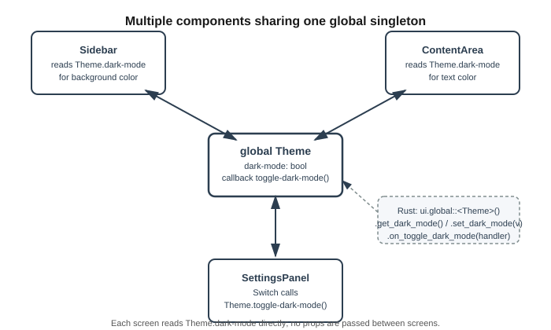

# 12장. 전역 싱글톤(Global)

📖 [◀ 목차](00-목차.md) | [◀ 이전: 11장. 리스트와 모델(Model)](ch11-리스트와모델.md) | [다음: 13장. 다중 창과 팝업 ▶](ch13-다중창과팝업.md)

---

애플리케이션의 화면이 하나만 있는 동안에는 문제가 되지 않던 것들이, 화면이 두세 개로 나뉘는 순간 골칫거리로 바뀌곤 합니다. 사이드바, 본문 영역, 설정 패널처럼 서로 다른 컴포넌트로 나뉜 화면들이 "지금 다크 모드가 켜져 있는지" 같은 정보를 똑같이 알아야 하는 상황이 대표적입니다. 이번 장에서는 이런 애플리케이션 전역 상태를 다루기 위한 Slint의 메커니즘, **전역 싱글톤(global singleton)**을 살펴봅니다.

## 문제 상황: 여러 컴포넌트가 같은 값을 알아야 할 때

다크 모드 여부를 사이드바와 본문 영역이 함께 참조해야 하는 화면을 생각해 보겠습니다. 지금까지 배운 도구만으로 풀어 보면, 다크 모드 값을 최상위 컴포넌트에 프로퍼티로 두고 이를 필요로 하는 자식 컴포넌트마다 프로퍼티로 넘겨주는 방식이 됩니다.

```slint
component Sidebar inherits Rectangle {
    in property <bool> dark-mode;
    background: dark-mode ? #1e1e1e : #f5f5f5;
}

component ContentArea inherits Rectangle {
    in property <bool> dark-mode;
    background: dark-mode ? #2b2b2b : #ffffff;
}

component AppWindow inherits Window {
    property <bool> dark-mode: false;

    HorizontalLayout {
        Sidebar { dark-mode: dark-mode; width: 120px; }
        ContentArea { dark-mode: dark-mode; }
    }
}
```

컴포넌트가 두 개뿐이라면 아직 견딜 만합니다. 하지만 화면이 늘어나고 그 화면들이 다시 여러 단계의 하위 컴포넌트로 쪼개져 있다면 어떻게 될까요? `dark-mode` 하나를 전달하기 위해 중간에 낀 컴포넌트마다 자신과는 무관한 프로퍼티를 선언하고 그대로 다시 넘겨주는 코드가 계속 늘어납니다. 이런 방식을 흔히 프로퍼티 드릴링(prop drilling)이라 부르는데, 코드가 장황해질 뿐 아니라 "이 값이 원래 어디서 시작해서 어디까지 전달되는지" 추적하기도 점점 어려워집니다. 애플리케이션 전체가 공유해야 하는 설정값에는 더 나은 방법이 필요합니다.

## `global` 문법: 전역 싱글톤 선언하기

Slint는 이런 상황을 위해 `global` 키워드를 제공합니다. `global`로 선언한 블록은 컴포넌트 트리와 무관하게 애플리케이션 전체에서 단 하나만 존재하며, 어떤 컴포넌트에서든 이름으로 곧바로 접근할 수 있습니다.

```slint
export global Theme {
    in-out property <bool> dark-mode: false;
    callback toggle-dark-mode();
}
```

문법은 `global 이름 { ... }` 형태이고, 중괄호 안에는 지금까지 컴포넌트 안에서 써 왔던 것과 똑같이 `property`와 `callback`을 선언합니다. 위 예제는 `dark-mode`라는 `bool` 프로퍼티 하나와 `toggle-dark-mode`라는 콜백 하나를 가진 `Theme`라는 전역 싱글톤입니다. Rust 쪽에서 이 전역에 접근하려면 앞에 `export`를 붙여야 하는데, 이는 8장에서 다룬 컴포넌트 `export` 규칙과 정확히 같은 이유입니다.

## 다른 컴포넌트에서 전역 싱글톤 참조하기

`global` 블록으로 선언한 프로퍼티와 콜백은 `전역이름.프로퍼티이름`, `전역이름.콜백이름()` 형태로 어느 컴포넌트에서든 곧바로 참조할 수 있습니다. 부모로부터 값을 넘겨받을 필요가 없습니다.

```slint
export global Theme {
    in-out property <bool> dark-mode: false;
    callback toggle-dark-mode();
}

component Sidebar inherits Rectangle {
    background: Theme.dark-mode ? #1e1e1e : #f5f5f5;

    Text {
        text: "메뉴";
        color: Theme.dark-mode ? #ffffff : #2c3e50;
    }
}

component ContentArea inherits Rectangle {
    background: Theme.dark-mode ? #2b2b2b : #ffffff;

    Text {
        text: Theme.dark-mode ? "다크 모드로 보는 중입니다" : "라이트 모드로 보는 중입니다";
        color: Theme.dark-mode ? #ecf0f1 : #2c3e50;
    }
}

export component AppWindow inherits Window {
    width: 400px;
    height: 260px;

    HorizontalLayout {
        Sidebar { width: 120px; }
        ContentArea { }
    }
}
```

`Sidebar`와 `ContentArea`는 서로 다른 컴포넌트이고 부모-자식 관계도 아니지만(둘 다 `AppWindow`의 자식일 뿐입니다), 둘 다 `Theme.dark-mode`를 똑같이 참조하고 있습니다. 두 컴포넌트 사이에 값을 전달하는 코드가 전혀 필요 없다는 점이 눈에 띕니다. `Theme.dark-mode` 값이 바뀌면, 5장에서 배운 바인딩의 원리에 따라 이 값을 참조하는 모든 표현식이 자동으로 다시 계산되어 화면에 반영됩니다.

여러 화면을 각각 별도의 `.slint` 파일로 나누어 작성하는 프로젝트에서는, `global` 선언을 `theme.slint` 같은 별도 파일에 두고 `import { Theme } from "theme.slint";` 구문으로 필요한 파일마다 불러와 쓰는 구성이 일반적입니다. 지금 단계에서는 "`global`은 파일과 컴포넌트 경계를 넘어 하나의 값을 공유하는 수단"이라는 개념만 확실히 잡아 두면 충분합니다.

## 여러 화면이 하나의 전역 싱글톤을 공유하는 구조

아래 다이어그램은 서로 다른 두 화면과 설정 패널이 하나의 `Theme` 전역 싱글톤을 공유하는 구조를 보여줍니다. 화면들끼리는 서로의 존재를 알 필요가 없고, 각자 가운데의 `Theme`만 바라보면 됩니다.



## Rust에서 전역 싱글톤에 접근하기

7장과 8장에서 살펴본 것처럼, `.slint` 파일의 컴포넌트는 빌드 시점에 대응하는 Rust 구조체로 변환됩니다. `global` 싱글톤도 마찬가지로 변환 대상에 포함되는데, 일반 컴포넌트와 달리 독립된 구조체가 아니라 최상위 창 구조체가 만든 인스턴스에 딸린 형태로 노출됩니다. 생성된 최상위 구조체(예제에서는 `AppWindow`)는 `global::<전역이름>()` 메서드를 제공하며, 이 메서드가 돌려주는 값을 통해 전역 싱글톤의 프로퍼티를 읽고 쓰거나 콜백을 연결할 수 있습니다.

```rust
slint::include_modules!();

fn main() -> Result<(), Box<dyn std::error::Error>> {
    let ui = AppWindow::new()?;

    // 전역 싱글톤의 프로퍼티를 설정
    ui.global::<Theme>().set_dark_mode(true);

    // 전역 싱글톤의 프로퍼티를 읽기
    let is_dark = ui.global::<Theme>().get_dark_mode();
    println!("현재 다크 모드 여부: {is_dark}");

    // 전역 싱글톤의 콜백을 처리
    let ui_weak = ui.as_weak();
    ui.global::<Theme>().on_toggle_dark_mode(move || {
        let ui = ui_weak.unwrap();
        let current = ui.global::<Theme>().get_dark_mode();
        ui.global::<Theme>().set_dark_mode(!current);
    });

    ui.run()?;
    Ok(())
}
```

`ui.global::<Theme>()`처럼 생성된 최상위 구조체에 `global::<전역이름>()`을 호출하면 그 전역 싱글톤에 접근할 수 있는 값을 얻습니다. 이후로는 8장에서 익힌 프로퍼티 getter·setter 규칙(`get_이름`, `set_이름`)과 6장·7장에서 익힌 콜백 등록 규칙(`on_이름`)이 그대로 적용됩니다. 즉 `.slint`의 `dark-mode` 프로퍼티는 `get_dark_mode()` / `set_dark_mode(값)`으로, `toggle-dark-mode` 콜백은 `on_toggle_dark_mode(핸들러)`로 대응됩니다.

`ui.global::<Theme>()` 대신 `Theme::get(&ui)`라는 형태로도 같은 값을 얻을 수 있습니다. 두 방식은 동일한 결과를 내며, 어느 쪽을 쓸지는 취향의 문제입니다. 이 책에서는 어떤 전역에 접근하는지 코드만 보고도 알기 쉬운 `ui.global::<이름>()` 형태를 계속 사용하겠습니다.

콜백 핸들러 안에서 `ui`를 캡처할 때 `ui.as_weak()`로 얻은 약한 참조를 사용한 점도 눈여겨보세요. 전역 싱글톤 자체도 내부적으로 자신이 속한 창을 강하게 참조하고 있으므로, `ui.global::<Theme>()`가 반환하는 값을 클로저 안에 그대로 오래 붙잡아 두기보다는, 이번 예제처럼 창의 약한 참조만 캡처해 두었다가 콜백이 실행되는 시점에 `.unwrap()`으로 다시 창을 얻고 그때그때 `global::<Theme>()`을 호출하는 편이 순환 참조를 피하는 데 안전합니다.

## 실전 예제: 설정 화면의 스위치로 다른 화면 동기화하기

9장에서 다룬 위젯 라이브러리의 `Switch`를 이용해, 설정 패널에서 스위치를 켜고 끄면 사이드바와 본문 영역의 배경이 함께 바뀌는 예제를 완성해 보겠습니다.

```slint
import { Switch } from "std-widgets.slint";

export global Theme {
    in-out property <bool> dark-mode: false;
    callback toggle-dark-mode();
}

component Sidebar inherits Rectangle {
    width: 120px;
    background: Theme.dark-mode ? #1e1e1e : #f5f5f5;

    Text {
        text: "메뉴";
        color: Theme.dark-mode ? #ffffff : #2c3e50;
    }
}

component ContentArea inherits Rectangle {
    background: Theme.dark-mode ? #2b2b2b : #ffffff;

    VerticalLayout {
        padding: 16px;
        spacing: 12px;
        alignment: start;

        Text {
            text: Theme.dark-mode ? "다크 모드입니다" : "라이트 모드입니다";
            color: Theme.dark-mode ? #ecf0f1 : #2c3e50;
        }

        Switch {
            text: "다크 모드";
            checked: Theme.dark-mode;
            toggled => { Theme.toggle-dark-mode(); }
        }
    }
}

export component AppWindow inherits Window {
    width: 420px;
    height: 240px;
    title: "설정 동기화 예제";

    HorizontalLayout {
        Sidebar { }
        ContentArea { }
    }
}
```

`Switch`의 `checked` 프로퍼티를 `Theme.dark-mode`에 바인딩해 두었으므로, 전역 값이 바뀌면 스위치의 표시 상태도 함께 따라 움직입니다. 사용자가 스위치를 조작하면 `toggled` 콜백이 발생하는데, 여기서 `Theme.dark-mode`를 직접 대입하는 대신 `Theme.toggle-dark-mode()` 콜백을 호출하도록 했습니다. 이렇게 하면 "다크 모드를 바꾸는 통로는 오직 `toggle-dark-mode` 콜백 하나뿐"이라는 규칙을 지킬 수 있고, 그 규칙을 실제로 지키는 로직은 Rust 쪽에 모아 둘 수 있습니다.

```rust
slint::include_modules!();

fn main() -> Result<(), Box<dyn std::error::Error>> {
    let ui = AppWindow::new()?;

    let ui_weak = ui.as_weak();
    ui.global::<Theme>().on_toggle_dark_mode(move || {
        let ui = ui_weak.unwrap();
        let theme = ui.global::<Theme>();
        let next = !theme.get_dark_mode();
        theme.set_dark_mode(next);
        println!("다크 모드: {next}");
    });

    ui.run()?;
    Ok(())
}
```

`Sidebar`와 `ContentArea`는 서로의 존재를 전혀 모르지만, 둘 다 `Theme.dark-mode`를 참조하고 있으므로 스위치 하나로 두 영역의 배경색이 동시에 바뀝니다. 화면이 셋, 넷으로 늘어나도 새 화면에 `Theme.dark-mode`를 참조하는 코드 한 줄만 추가하면 되며, 기존 화면이나 `AppWindow`의 코드는 전혀 손댈 필요가 없습니다.

## Global을 남용하면 안 되는 이유

전역 싱글톤은 프로퍼티 드릴링 문제를 깔끔하게 해결해 주지만, 그렇다고 모든 상태를 `global`로 옮기는 것이 좋은 설계는 아닙니다. 편하다는 이유로 특정 컴포넌트 안에서만 의미 있는 상태(예: 어떤 다이얼로그가 지금 펼쳐져 있는지, 어떤 입력창이 포커스를 가지고 있는지)까지 전역으로 선언하기 시작하면 다음과 같은 문제가 생깁니다.

**어디서 값이 바뀌는지 추적하기 어려워집니다.** 프로퍼티가 특정 컴포넌트 안에 있으면 그 값을 바꾸는 코드의 범위도 그 컴포넌트와 자식들로 한정됩니다. 하지만 전역 싱글톤의 프로퍼티는 애플리케이션의 어느 컴포넌트에서든, 어느 Rust 콜백 핸들러에서든 값을 바꿀 수 있습니다. 프로젝트가 커질수록 "이 값이 지금 왜 이런 상태인지"를 알아내려고 코드베이스 전체를 뒤져야 하는 상황이 잦아집니다.

**컴포넌트의 재사용성이 떨어집니다.** 컴포넌트가 필요한 데이터를 프로퍼티로 입력받는 대신 전역 싱글톤을 직접 참조하도록 만들면, 그 컴포넌트는 항상 그 전역이 존재하는 환경에서만 동작합니다. 같은 컴포넌트를 다른 프로젝트에서 재사용하거나 독립적으로 테스트하기가 어려워집니다.

**의도치 않은 부수 효과가 생기기 쉽습니다.** 여러 화면이 같은 전역 프로퍼티를 각자의 사정에 맞춰 수정하다 보면, 한 화면의 코드가 다른 화면의 상태를 뜻하지 않게 바꿔 버리는 일이 생길 수 있습니다. 두 화면 사이의 연결고리가 코드에 명시적으로 드러나지 않으므로 이런 버그는 원인을 찾기가 특히 까다롭습니다.

이런 이유로, 전역 싱글톤은 다음 원칙에 따라 절제해서 사용하는 것이 좋습니다.

- **정말로 여러 화면이 공유해야 하는 상태만 전역으로 둡니다.** 다크 모드 여부, 로그인한 사용자 정보, 서버 연결 상태처럼 애플리케이션 차원의 데이터가 좋은 후보입니다.
- **한 컴포넌트 안에서만 의미가 있는 상태는 그 컴포넌트의 로컬 프로퍼티로 둡니다.** "이 입력창이 지금 포커스를 가지고 있는가" 같은 정보를 전역으로 끌어올릴 이유는 거의 없습니다.
- **전역 프로퍼티를 직접 대입하는 대신, 콜백을 통해 값을 바꾸는 편이 추적하기 쉬운 경우가 많습니다.** 이번 장의 `toggle-dark-mode`처럼 "다크 모드는 반드시 이 콜백을 거쳐서만 바뀐다"는 규칙을 세워 두면, 값이 바뀌는 지점을 한곳으로 모을 수 있습니다.

정리하면, 전역 싱글톤은 "여러 컴포넌트가 정말로 함께 알아야 하는 최소한의 상태"를 위한 도구입니다. 편리하다고 모든 프로퍼티를 전역으로 몰아넣기보다는, 각 상태가 실제로 어느 범위에서 의미를 갖는지 판단해 로컬 프로퍼티와 전역 싱글톤을 구분해 쓰는 습관이 장기적으로 유지보수하기 쉬운 코드를 만듭니다.

## 요약

- 여러 화면이 같은 데이터를 공유해야 할 때, 프로퍼티를 계속 아래로 전달하는 방식(프로퍼티 드릴링)은 코드가 장황해지고 추적하기 어려워지는 문제가 있습니다.
- `global 이름 { property <타입> ...; callback ...; }` 문법으로 전역 싱글톤을 선언하면, 어떤 컴포넌트에서든 `이름.프로퍼티이름` 형태로 값을 직접 참조할 수 있습니다. Rust에서 접근하려면 컴포넌트와 마찬가지로 `export`를 붙여야 합니다.
- 전역 프로퍼티 값이 바뀌면 그 값을 참조하는 모든 컴포넌트가 자동으로 갱신되는 것은 일반 프로퍼티 바인딩과 같은 원리입니다.
- Rust에서는 생성된 최상위 구조체의 `global::<전역이름>()` 메서드(또는 동등한 `전역이름::get(&ui)`)로 전역 싱글톤에 접근하며, 그 값에서 `get_이름` / `set_이름` / `on_콜백이름`을 일반 프로퍼티·콜백과 똑같은 규칙으로 사용할 수 있습니다.
- 콜백 안에서 전역 싱글톤을 다루려면 창의 `as_weak()`로 약한 참조를 캡처해 두었다가, 콜백이 실행되는 시점에 다시 `global::<이름>()`을 호출하는 패턴이 순환 참조를 피하는 데 안전합니다.
- 전역 싱글톤은 편리하지만 남용하면 상태 변경 지점을 추적하기 어렵고 컴포넌트 재사용성이 떨어집니다. 꼭 여러 화면이 공유해야 하는 최소한의 상태만 전역으로 두고, 나머지는 컴포넌트 로컬 프로퍼티로 관리하는 것이 바람직합니다.

## 연습문제

1. `Settings`라는 이름의 전역 싱글톤을 선언하고, `float` 타입의 `font-scale` 프로퍼티(기본값 1.0)를 추가해 보세요. 서로 다른 두 컴포넌트에서 이 값을 참조해 `Text`의 `font-size`를 다르게 계산해 보세요.
2. 이번 장의 `Theme` 예제를 확장하여, `reset-theme`이라는 콜백을 추가하고 이 콜백이 호출되면 `dark-mode`가 무조건 `false`로 돌아가도록 만들어 보세요.
3. Rust 쪽에서 `ui.global::<Theme>().on_toggle_dark_mode(...)` 대신 `Theme::get(&ui).on_toggle_dark_mode(...)` 형태로 같은 동작을 구현해 보고, 두 표현이 실제로 동일하게 동작하는지 확인해 보세요.
4. 도입부의 프로퍼티 드릴링 예제(`Sidebar`, `ContentArea`가 `dark-mode`를 프로퍼티로 전달받는 버전)를 전역 싱글톤을 사용하는 형태로 직접 다시 작성해 보고, 두 방식의 코드량과 가독성을 비교해 보세요.
5. "현재 열려 있는 다이얼로그의 종류"처럼 여러 화면이 공유해야 할 것 같으면서도, 사실은 한 컴포넌트 안에 두는 것이 더 나을 수도 있는 상태를 하나 떠올려 보고, 어떤 기준으로 전역과 로컬을 구분할지 자신의 근거를 정리해 보세요.


---

📖 [◀ 목차](00-목차.md) | [◀ 이전: 11장. 리스트와 모델(Model)](ch11-리스트와모델.md) | [다음: 13장. 다중 창과 팝업 ▶](ch13-다중창과팝업.md)
