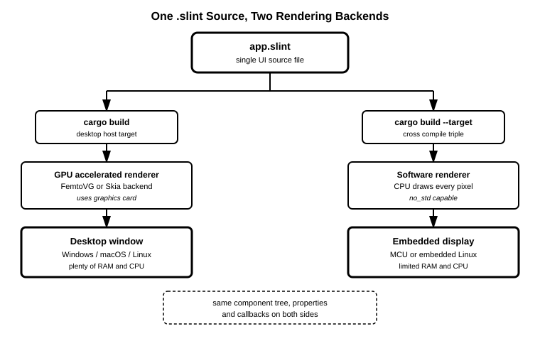

# 17장. 임베디드/크로스플랫폼 타겟팅

📖 [◀ 목차](00-목차.md) | [◀ 이전: 16장. 이미지와 커스텀 렌더링](ch16-이미지와커스텀렌더링.md) | [다음: 18장. 실전 프로젝트: 할 일 관리 앱 만들기 ▶](ch18-실전프로젝트할일관리앱만들기.md)

---

지금까지 우리는 이 책의 모든 예제를 Windows, macOS, Linux 같은 일반 데스크톱 환경에서 `cargo run`으로 실행해 왔습니다. 개발용 PC에서 창이 뜨고, 마우스와 키보드로 조작하고, 결과를 바로 눈으로 확인하는 흐름이었습니다. 이번 장에서는 잠시 그 흐름에서 벗어나, Slint가 데스크톱 바깥에서는 어떤 모습으로 동작할 수 있는지를 개념 위주로 살펴봅니다.

미리 밝혀두자면, 실제 임베디드 보드를 대상으로 크로스 컴파일 툴체인을 구성하고 펌웨어를 굽는 작업은 보드마다 사정이 크게 다른 전문 영역이라 이 책의 범위를 벗어납니다. 이 장의 목표는 여러분이 지금 당장 MCU에 Slint 앱을 올릴 수 있게 만드는 것이 아니라, "Rust와 Slint의 조합이 데스크톱 GUI 개발 도구에서 그치지 않는다"는 그림을 그려서, 필요할 때 무엇을 검색해야 할지 감을 잡게 하는 것입니다.

## 17.1 데스크톱 너머: Slint가 노리는 실행 환경의 폭

이 책 전체에서 우리가 실행한 프로그램은 운영체제가 창을 만들어주고, 그 위에 Slint가 UI를 그려 넣는 구조였습니다. 이런 조건은 일반적인 GUI 툴킷 대부분이 전제로 삼는 환경이기도 합니다.

Slint는 이 조건 하나만을 목표로 설계되지 않았습니다. 같은 Slint 런타임과 같은 `.slint` 언어로 다음과 같이 서로 다른 실행 환경까지 UI를 올릴 수 있도록 설계되어 있습니다.

- **일반 데스크톱**: 지금까지 다룬 Windows, macOS, Linux 환경. 창 관리자와 GPU 드라이버가 준비되어 있습니다.
- **임베디드 리눅스**: 리눅스 커널은 돌아가지만 X11이나 Wayland 같은 데스크톱 창 시스템 없이, 화면 프레임버퍼에 직접 그리는 산업용 보드나 셋톱박스 같은 장치입니다.
- **운영체제 없는 마이크로컨트롤러(MCU)**: 운영체제 자체 없이 펌웨어가 하드웨어를 직접 제어하는 초소형 칩으로, 메모리가 수백 킬로바이트 단위로 제한되는 경우도 흔합니다.

세 환경은 사용 가능한 메모리, CPU 성능, 그래픽 하드웨어의 유무가 완전히 다릅니다. 그런데도 Slint는 "같은 `.slint` 파일로 정의한 UI를 이 모든 환경에서 실행한다"는 목표를 추구합니다. 이것이 가능한 이유는 다음 절에서 다룰 **렌더링 백엔드**라는 개념 덕분입니다.

## 17.2 렌더링 백엔드라는 개념

`.slint` 파일을 컴파일하면 컴포넌트 트리, 프로퍼티 바인딩, 레이아웃 계산 로직처럼 "UI가 어떻게 구성되고 동작하는가"에 대한 정보가 Rust 코드로 생성됩니다(2장에서 다룬 `slint::include_modules!()`가 바로 이 생성된 코드를 현재 크레이트에 끌어옵니다). 하지만 이 정보만으로는 화면에 실제 픽셀을 찍을 수 없습니다. 계산된 사각형, 텍스트, 색상을 실제 화면이나 프레임버퍼에 그려 넣는 마지막 단계를 담당하는 것이 **렌더링 백엔드(rendering backend)**입니다.

Slint는 UI 정의와 렌더링 방식을 서로 분리해서 설계했습니다. `.slint`로 작성한 UI 자체는 어떤 렌더링 백엔드가 붙을지 전혀 알 필요가 없고, 실행 환경에 맞는 백엔드를 골라 연결하면 됩니다. 이 분리 덕분에 같은 UI 정의가 서로 다른 하드웨어 조건에서도 재사용될 수 있습니다.

크게 나누면 데스크톱처럼 GPU를 활용할 수 있는 환경을 위한 **GPU 가속 렌더러**와, GPU가 없거나 쓸 수 없는 환경을 위한 **소프트웨어 렌더러**로 구분할 수 있습니다.

## 17.3 데스크톱의 GPU 가속 렌더러

지금까지 여러분이 실행해 온 예제들은 내부적으로 GPU 가속 렌더러를 사용해 그려졌습니다. Slint는 데스크톱 환경을 위해 **FemtoVG**와 **Skia**라는 이름의 렌더링 백엔드를 제공합니다. 둘 다 그래픽 카드의 하드웨어 가속을 활용해 사각형, 텍스트, 둥근 모서리, 그림자 같은 도형을 빠르게 그려내며, 10장에서 다룬 애니메이션처럼 매 프레임 화면을 다시 그려야 하는 작업도 부드럽게 처리합니다.

두 이름 모두 Slint가 자체적으로 만든 것이 아니라, 2D 벡터 그래픽 렌더링을 위해 널리 쓰이는 기존 라이브러리의 이름입니다. `slint` 크레이트는 이 라이브러리들을 Cargo 피처(feature)로 노출하며, 어떤 백엔드를 쓸지는 대체로 기본값이 자동으로 선택되지만 명시적으로 지정할 수도 있습니다.

```toml
# Cargo.toml — 데스크톱에서 FemtoVG 백엔드를 명시적으로 선택하는 예
[dependencies]
slint = { version = "1", default-features = false, features = [
    "std",
    "backend-winit",
    "renderer-femtovg",
] }
```

이 책에서는 두 백엔드의 존재와 역할을 아는 것으로 충분하며, 세부적인 성능 특성이나 피처 조합 하나하나까지 파고들지는 않습니다. 정확한 피처 이름과 조합은 Slint 버전에 따라 달라질 수 있으므로, 실제로 백엔드를 바꿔야 할 상황이 오면 그 시점의 공식 문서를 확인하는 것이 안전합니다. 지금 단계에서 기억할 것은 하나뿐입니다. **GPU가 있는 데스크톱 환경에서는 Slint가 그 GPU를 최대한 활용해서 화면을 그린다**는 것입니다.

## 17.4 리소스가 제한된 세계: 소프트웨어 렌더러

반대로 GPU 자체가 없는 마이크로컨트롤러나, GPU가 있어도 드라이버 스택이 무거워서 쓰기 부담스러운 임베디드 보드에서는 FemtoVG나 Skia 같은 GPU 가속 렌더러를 쓸 수 없습니다. 이런 환경을 위해 Slint는 **소프트웨어 렌더러(software renderer)**라는 또 다른 백엔드를 제공합니다.

소프트웨어 렌더러는 그래픽 카드의 도움 없이, CPU가 직접 계산해서 프레임버퍼의 픽셀 값을 하나씩 채워 넣는 방식으로 동작합니다. GPU 가속 렌더러만큼 화려한 효과나 매끄러운 프레임률을 뽑아내기는 어렵지만, 그 대신 훨씬 적은 메모리와 연산 자원으로도 UI를 화면에 띄울 수 있습니다.

```toml
# Cargo.toml — 임베디드 타겟을 겨냥한 최소 구성 예
[dependencies]
slint = { version = "1", default-features = false, features = [
    "renderer-software",
    "unsafe-single-threaded",
] }
```

`default-features = false`로 데스크톱용 기본 백엔드를 빼고, `renderer-software` 피처만 남겨 소프트웨어 렌더러를 사용하도록 구성했습니다. `unsafe-single-threaded`는 스레드가 하나뿐인 MCU처럼 운영체제 수준의 스레드 지원이 없는 환경을 위한 피처로, 이런 이름의 피처가 존재한다는 정도만 기억해두면 충분합니다.

여기서 중요한 것은, 소프트웨어 렌더러를 쓴다고 해서 `.slint` 파일을 다시 작성하거나 UI 구조를 바꿔야 하는 것이 아니라는 점입니다. 같은 `component`, 같은 `property`, 같은 레이아웃 문법으로 작성한 UI가 그대로 소프트웨어 렌더러 위에서도 동작합니다. 달라지는 것은 "그 UI 정보를 픽셀로 바꾸는 마지막 단계"와 그것을 감싸는 Cargo 피처 구성뿐입니다.

아래 다이어그램은 하나의 `.slint` 소스가 데스크톱용 GPU 가속 렌더러 경로와 임베디드용 소프트웨어 렌더러 경로, 두 가지로 각각 컴파일되는 흐름을 보여줍니다.



## 17.5 no_std 환경에서의 Slint

임베디드 세계에서 더 극단적인 경우는 운영체제 자체가 없는 마이크로컨트롤러입니다. 이런 칩 위에서 동작하는 Rust 펌웨어는 흔히 표준 라이브러리(`std`) 없이 `#![no_std]`로 작성됩니다. `std`는 힙 할당자, 파일 시스템, 스레드, 운영체제 콜을 전제로 하는데, MCU 펌웨어에는 이런 것들이 아예 없거나 아주 제한적인 형태로만 존재하기 때문입니다.

Slint는 이런 `no_std` 환경까지 염두에 두고 설계되어 있습니다. 앞서 본 것처럼 `default-features = false`로 시작해 `std` 피처까지 빼면, Slint 런타임을 표준 라이브러리 없이 빌드하는 것이 가능합니다. 이 경우 애플리케이션 쪽에서 다음과 같은 것들을 직접 챙겨야 합니다.

- **`slint::platform::Platform` 트레이트 구현**: 어떤 화면 어댑터를 사용할지, 시간은 어떻게 측정할지 같은, 보통은 운영체제가 대신 해주는 일을 애플리케이션이 직접 정의해서 Slint에 알려줍니다.
- **소프트웨어 렌더러와의 결합**: `slint::platform::software_renderer` 모듈이 제공하는, 픽셀 버퍼를 직접 다루는 창 어댑터를 `Platform` 구현과 연결해서 프레임버퍼에 그림을 그리게 합니다.
- **힙 할당자 준비**: `no_std`라고 해서 힙 자체가 없는 것은 아닙니다. `alloc` 크레이트와 함께 사용할 전역 할당자를 보드 환경에 맞게 직접 구성해야 하는 경우가 많습니다.

이 세 가지 모두 보드와 마이크로컨트롤러 종류에 따라 구체적인 코드가 크게 달라지는 저수준 작업이라, 이 책에서는 "이런 것들을 직접 구현하면 `no_std` 환경에서도 Slint UI를 띄울 수 있다"는 개념만 소개하고 실제 코드는 다루지 않습니다. 핵심은 Slint의 UI 언어와 컴포넌트 모델 자체는 운영체제의 유무와 무관하게 설계되어 있고, 그 아래를 받치는 렌더링·플랫폼 계층만 환경에 맞게 갈아 끼우면 된다는 점입니다.

## 17.6 크로스 컴파일이라는 관문

데스크톱에서 개발한 애플리케이션을 실제 임베디드 보드에 올리려면, 개발 PC와는 다른 CPU 아키텍처를 겨냥해 코드를 빌드하는 **크로스 컴파일(cross compilation)**이 필요합니다. Rust와 Cargo는 `--target` 옵션으로 이 과정을 지원합니다.

```bash
# 지원하는 타겟 목록에 새 타겟을 추가한 뒤
rustup target add aarch64-unknown-linux-gnu

# 해당 타겟을 겨냥해 빌드한다
cargo build --release --target aarch64-unknown-linux-gnu
```

여기서 `aarch64-unknown-linux-gnu`처럼 하이픈으로 이어진 문자열을 **타겟 트리플(target triple)**이라고 부릅니다. CPU 아키텍처, 벤더, 운영체제, ABI 정보를 담고 있으며, 임베디드 리눅스 보드용으로는 `armv7-unknown-linux-gnueabihf`, 운영체제가 없는 Cortex-M 계열 MCU용으로는 `thumbv7em-none-eabihf` 같은 트리플이 쓰입니다. 이 책에서는 이런 이름들이 존재한다는 것만 소개하며, 실제로 어떤 트리플을 골라야 하는지, 링커나 C 툴체인을 어떻게 함께 구성해야 하는지 같은 세부 사항은 보드별 문서를 참고해야 하는 범위 밖의 주제로 남겨둡니다.

중요한 것은 `.slint` UI 정의와 그것을 다루는 Rust 애플리케이션 로직 자체는 타겟 트리플이 바뀐다고 해서 달라지지 않는다는 사실입니다. 바뀌는 것은 Cargo에게 "이 아키텍처용으로 빌드해 달라"고 알려주는 빌드 설정과, 앞 절에서 다룬 렌더링 백엔드 선택뿐입니다.

## 17.7 데스크톱 UI를 임베디드로 옮길 때 고려할 점

같은 `.slint` 소스를 재사용할 수 있다고 해서, 데스크톱에서 잘 동작하던 UI가 아무 손질 없이 임베디드 보드에서도 똑같이 좋은 경험을 준다는 보장은 없습니다. 실제로 이전을 고려한다면 다음 세 가지를 미리 점검해볼 필요가 있습니다.

- **메모리 제약**: 데스크톱은 기가바이트 단위의 메모리를 당연하게 여기지만, MCU는 수백 킬로바이트 단위로 제한되는 경우가 흔합니다. 11장에서 다룬 모델에 수만 개의 항목을 담아두는 설계나, 16장에서 다룬 대용량 이미지를 그대로 임베딩하는 방식은 임베디드 타겟에서 메모리 부족으로 이어질 수 있습니다.
- **렌더링 성능**: 소프트웨어 렌더러는 CPU로 픽셀을 직접 계산하므로, GPU 가속 렌더러만큼 화려한 그림자나 블러, 매끄러운 애니메이션 프레임률을 기대하기 어렵습니다. 10장에서 배운 `animate`를 화면 전체에 걸쳐 남발하기보다는, 꼭 필요한 요소에만 절제해서 적용하는 편이 임베디드 환경에서 더 안정적입니다.
- **폰트 임베딩**: 데스크톱은 운영체제가 이미 여러 서체를 시스템에 설치해두고 있지만, 임베디드 보드에는 그런 시스템 폰트가 아예 없을 수 있습니다. Slint는 `.slint` 파일에서 폰트 파일을 다음과 같이 직접 임포트해서 컴파일 타임에 애플리케이션에 포함시킬 수 있습니다.

```slint
// ui/app.slint — 폰트 파일을 컴파일 타임에 임베딩
import "./fonts/NotoSansKR-Regular.ttf";

export component AppWindow inherits Window {
    default-font-family: "Noto Sans KR";
    // ...
}
```

이렇게 임포트한 폰트는 실행 환경에 시스템 폰트가 있는지 여부와 무관하게 애플리케이션 바이너리(또는 그 리소스)에 포함되어 항상 사용할 수 있습니다. 데스크톱에서는 시스템 폰트에 의존하다가 임베디드로 옮기는 시점에 이렇게 폰트를 명시적으로 임베딩하는 방식으로 바꾸는 것이 흔한 이전 패턴입니다.

## 17.8 이 책은 데스크톱을 기준으로 합니다

여기까지 살펴본 내용은 모두 "Slint가 데스크톱 너머로도 갈 수 있다"는 가능성에 대한 것입니다. 다시 한번 분명히 해두자면, 이 책의 1장부터 16장, 그리고 다음 장의 실전 프로젝트까지 모든 예제는 데스크톱 실행을 기준으로 설명했고 앞으로도 그렇습니다. `cargo run` 한 번으로 창이 뜨고 바로 결과를 확인할 수 있다는 것은 학습 단계에서 매우 큰 이점이며, 이 책이 데스크톱을 기본 무대로 삼은 이유이기도 합니다.

임베디드 타겟팅은 어디까지나 "같은 지식이 어디까지 확장될 수 있는가"를 보여주는 지평선으로 이해하면 됩니다. 여러분이 이 책에서 배운 `component`, `property`, 콜백, 모델, Global, 그리고 `ComponentHandle`과 `Weak` 같은 Rust 쪽 패턴은 임베디드 타겟에서도 그대로 유효합니다. 달라지는 것은 그 아래를 받치는 렌더링 백엔드와 빌드 설정뿐입니다. 다음 장에서는 다시 데스크톱으로 돌아와, 지금까지 배운 내용을 모두 모아 실전 프로젝트 하나를 완성해보겠습니다.

## 요약

- Slint는 일반 데스크톱뿐 아니라 임베디드 리눅스, 운영체제 없는 마이크로컨트롤러(MCU)까지 실행 대상으로 삼도록 설계되었습니다.
- `.slint` UI 정의와 실제 픽셀을 그리는 작업은 렌더링 백엔드라는 개념으로 분리되어 있습니다.
- 데스크톱에서는 FemtoVG, Skia 같은 GPU 가속 렌더러를 사용하며, 이는 Cargo 피처로 선택할 수 있습니다.
- GPU가 없거나 쓸 수 없는 임베디드 환경에서는 `renderer-software` 피처로 소프트웨어 렌더러를 사용할 수 있고, `default-features = false`로 `std` 의존성까지 뺀 `no_std` 구성도 가능합니다.
- `no_std` 환경에서는 `slint::platform::Platform` 트레이트 구현, 소프트웨어 렌더러 결합, 힙 할당자 준비를 애플리케이션이 직접 챙겨야 합니다.
- `cargo build --target <타겟 트리플>`로 크로스 컴파일을 수행하며, `.slint` UI와 애플리케이션 로직 자체는 타겟이 바뀌어도 그대로 재사용됩니다.
- 데스크톱 UI를 임베디드로 옮길 때는 메모리 제약, 렌더링 성능, 폰트 임베딩(`.slint`에서 폰트 파일을 직접 `import`) 세 가지를 특히 점검해야 합니다.
- 이 책의 모든 예제는 데스크톱 실행을 기준으로 하며, 임베디드 타겟팅의 실제 빌드·배포 작업은 이 책의 범위를 넘어서는 전문적인 주제입니다.

## 연습문제

1. GPU 가속 렌더러와 소프트웨어 렌더러의 차이를 "누가 픽셀을 계산하는가"라는 관점에서 설명해 보세요.
2. `Cargo.toml`에서 `default-features = false`로 시작해 `renderer-software`만 남기는 구성이 왜 임베디드 타겟에 적합한지 설명해 보세요.
3. 타겟 트리플이 무엇을 나타내는 문자열인지, 그리고 데스크톱용 빌드와 임베디드용 빌드에서 각각 어떤 트리플이 쓰일 수 있는지 예를 들어 설명해 보세요.
4. 데스크톱에서 시스템 폰트에 의존하던 UI를 임베디드로 옮길 때 폰트를 `.slint` 파일에서 직접 `import`해야 하는 이유를 설명해 보세요.
5. 여러분이 알고 있는 가전제품이나 산업 장비 중 "화면은 있지만 일반 PC 수준의 자원은 없는" 제품을 하나 떠올려 보고, 그 제품에 임베디드 Slint를 적용한다면 메모리·렌더링 성능·폰트 세 가지 측면에서 각각 어떤 점을 신경 써야 할지 추측해 보세요.


---

📖 [◀ 목차](00-목차.md) | [◀ 이전: 16장. 이미지와 커스텀 렌더링](ch16-이미지와커스텀렌더링.md) | [다음: 18장. 실전 프로젝트: 할 일 관리 앱 만들기 ▶](ch18-실전프로젝트할일관리앱만들기.md)
