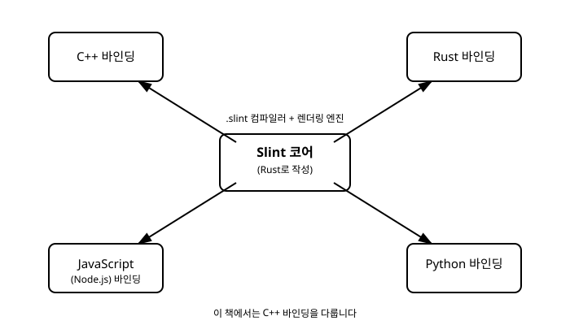

# 1장. Slint란 무엇인가

[◀ 이전: 목차](00-목차.md) | [📖 목차](00-목차.md) | [다음: 2장. 개발 환경 설정과 첫 창 ▶](ch02-개발환경설정과첫창.md)


## 이 책에서 다루는 것

Slint는 데스크톱, 모바일, 임베디드 기기까지 아우르는 애플리케이션의 사용자 인터페이스(UI)를 만들기 위한 선언적(declarative) GUI 툴킷입니다. 핵심 엔진은 Rust로 작성되어 있지만, Slint 프로젝트는 그 엔진 위에 여러 언어를 위한 바인딩(binding)을 함께 제공합니다. 현재 공식적으로 지원되는 바인딩은 Rust, C++, JavaScript(Node.js), Python 네 가지이며, 어떤 언어를 선택하든 UI를 기술하는 방식 자체는 동일합니다. UI 로직을 담당하는 애플리케이션 코드만 각 언어의 문법을 따르게 되는 구조입니다.

이 책은 그중에서도 **C++ 바인딩**을 사용해 Slint로 GUI 애플리케이션을 만드는 방법을 다룹니다. C++로 GUI를 작성해본 경험이 있는 독자라면 Qt나 wxWidgets 같은 툴킷과 사뭇 다른 개발 경험을 마주하게 될 텐데, 그 차이의 핵심은 다음 절에서 설명할 "UI를 별도의 언어로 선언한다"는 Slint의 근본적인 설계 철학에 있습니다.

## 선언적 UI와 .slint 마크업 언어

전통적인 C++ GUI 툴킷에서는 버튼을 만들고, 크기를 지정하고, 레이아웃에 배치하고, 클릭 시 동작할 콜백을 등록하는 과정을 모두 C++ 코드로 명령형(imperative)으로 작성합니다. 위젯 트리를 손으로 조립하는 셈입니다.

Slint는 접근 방식이 다릅니다. UI의 구조와 모양을 `.slint`라는 확장자를 가진 별도의 파일에, Slint 자체의 도메인 특화 언어(DSL, Domain-Specific Language)로 기술합니다. 이 마크업은 "어떤 화면이 어떻게 생겼는가"를 선언적으로 표현하는 데 특화되어 있으며, C++ 코드와는 물리적으로도 분리된 파일에 존재합니다.

```slint
component Greeting inherits Window {
    width: 300px;
    height: 100px;

    Text {
        text: "안녕하세요, Slint!";
        font-size: 20px;
    }
}
```

이런 방식은 UI를 마크업으로 기술하고 뒤에서 네이티브 코드로 변환한다는 점에서 QML(Qt)이나 XAML(WPF, Avalonia 등)과 포지션이 비슷합니다. 화면 구조를 선언적 문법으로 표현하고, 그 뒤에서 애플리케이션 로직 언어와 연결한다는 큰 그림은 같습니다. 하지만 Slint의 `.slint` 문법은 QML이나 XAML을 그대로 가져온 것이 아니라, Slint 프로젝트가 독자적으로 설계한 고유한 언어입니다. 프로퍼티 바인딩, 레이아웃 지정, 상태 전환 등을 표현하는 구체적인 문법은 Slint만의 규칙을 따르며, 이는 3장에서 본격적으로 다룹니다.

`.slint` 파일과 C++ 코드가 어떻게 서로 연결되는지, 즉 이 마크업이 실제로 어떤 C++ 클래스로 변환되어 프로그램에 포함되는지는 2장에서 첫 예제를 통해 직접 확인합니다.

## 컴파일 타임 변환과 임베디드 지향 설계

Slint를 다른 GUI 프레임워크와 구별 짓는 또 하나의 특징은 `.slint` 파일이 처리되는 시점입니다. 많은 선언적 UI 시스템이 마크업을 런타임에 파싱하고 해석하는 반면, Slint는 빌드 시점에 `.slint` 파일을 네이티브 코드로 컴파일합니다. 애플리케이션이 실행될 때는 마크업을 다시 읽고 해석하는 과정이 없고, 이미 컴파일된 위젯 트리와 바인딩 로직이 곧바로 동작합니다. 이 방식은 런타임 오버헤드를 줄이고, 타입 오류나 문법 오류 같은 문제를 실행 전 빌드 단계에서 미리 걸러낼 수 있게 해줍니다.

이런 설계는 Slint가 목표로 삼는 실행 환경의 폭과도 맞닿아 있습니다. Slint는 일반적인 데스크톱 애플리케이션은 물론, RAM과 연산 능력이 극도로 제한된 마이크로컨트롤러(MCU) 기반 임베디드 기기까지 실행 대상으로 삼습니다. 이는 데스크톱·모바일 환경을 전제로 설계된 다른 다수의 GUI 프레임워크와 뚜렷하게 구분되는 지점입니다. 화면이 있는 작은 산업용 장비, 가전제품의 제어판, 웨어러블 기기처럼 운영체제 없이 혹은 아주 가벼운 런타임 위에서 동작해야 하는 환경까지 같은 `.slint` 마크업과 같은 C++ API로 UI를 개발할 수 있다는 점이 Slint의 핵심 차별점입니다. 이 임베디드·크로스플랫폼 타겟팅 이야기는 17장에서 더 깊이 다룹니다.

아래 다이어그램은 Rust로 작성된 Slint 코어와, 그 위에 얹힌 네 가지 언어 바인딩의 관계를 보여줍니다.



## 다른 C++ GUI 접근 방식과의 비교

같은 저장소 안의 다른 책들에서 다루는 GUI 프레임워크들과 나란히 놓아 보면 Slint의 위치가 더 선명해집니다.

- **Avalonia (C#/.NET)**: .NET 생태계 위에서 동작하는 유지 모드(retained mode) UI 프레임워크입니다. XAML로 UI를 선언하고, 위젯 객체 트리가 메모리에 계속 유지되면서 프로퍼티 변경에 따라 갱신됩니다. 언어와 런타임이 .NET에 묶여 있습니다.
- **Dear ImGui (C++)**: 즉시 모드(immediate mode) UI 라이브러리입니다. 별도의 마크업 언어 없이, 매 프레임마다 C++ 함수 호출로 위젯을 다시 그리도록 명령합니다. 위젯 객체가 프레임 사이에 유지되지 않는다는 점에서 유지 모드 툴킷들과 근본적으로 다릅니다.
- **Slint (C++)**: `.slint`라는 독자적인 DSL로 UI를 선언하고, 이를 빌드 시점에 네이티브 C++ 코드로 컴파일해 사용하는 유지 모드 툴킷입니다. UI 구조 기술과 애플리케이션 로직이 문법적으로 분리되어 있으면서도, 결과물은 가볍고 임베디드 환경까지 노릴 수 있는 네이티브 코드라는 점이 특징입니다.

세 프레임워크는 "UI를 어떻게 기술하고, 그것을 어떻게 화면에 반영할 것인가"라는 질문에 각기 다른 답을 내놓고 있는 셈입니다. Avalonia는 .NET과 XAML을, ImGui는 매 프레임 재호출을, Slint는 독자 DSL과 컴파일 타임 변환을 선택했습니다. 이 책에서는 Slint가 선택한 길을 C++ 개발자의 시점에서 하나씩 따라가 봅니다.

## 요약

- Slint는 Rust로 작성된 선언적 GUI 툴킷 코어이며, C++, Rust, JavaScript(Node.js), Python 바인딩을 공식 지원합니다. 이 책은 C++ 바인딩을 다룹니다.
- UI는 `.slint`라는 독자적인 DSL 마크업 파일에 선언적으로 기술하며, 이는 QML이나 XAML과 포지션은 비슷하지만 문법은 Slint 고유의 것입니다.
- `.slint` 파일은 런타임이 아니라 빌드 시점에 네이티브 코드로 컴파일되어 런타임 오버헤드가 적습니다.
- Slint는 데스크톱뿐 아니라 리소스가 극히 제한된 임베디드/마이크로컨트롤러 환경까지 실행 대상으로 삼는다는 점에서 차별화됩니다(17장에서 심화).
- Avalonia(.NET 유지 모드), Dear ImGui(C++ 즉시 모드), Slint(독자 DSL 기반 선언적 UI)는 GUI를 다루는 세 가지 서로 다른 접근 방식입니다.

## 연습문제

1. Slint 코어가 어떤 언어로 작성되어 있으며, 현재 공식 지원되는 언어 바인딩 네 가지를 나열해 보세요.
2. `.slint` 마크업 언어가 QML이나 XAML과 포지션 면에서 어떻게 비슷하고, 문법 면에서 어떻게 다른지 한 문단으로 설명해 보세요.
3. Slint가 `.slint` 파일을 런타임이 아니라 빌드 시점에 처리한다는 것이 어떤 실질적인 이점을 가져오는지 두 가지 이상 적어 보세요.
4. Slint가 임베디드/마이크로컨트롤러 환경까지 타겟으로 삼는다는 사실이, 데스크톱 전용 GUI 프레임워크와 비교했을 때 어떤 제약이나 설계 선택으로 이어질지 추측해 보세요.
5. Avalonia, Dear ImGui, Slint 세 프레임워크를 "UI 상태가 어떻게 유지되는가"라는 기준으로 비교해 보세요.

---

[◀ 이전: 목차](00-목차.md) | [📖 목차](00-목차.md) | [다음: 2장. 개발 환경 설정과 첫 창 ▶](ch02-개발환경설정과첫창.md)
