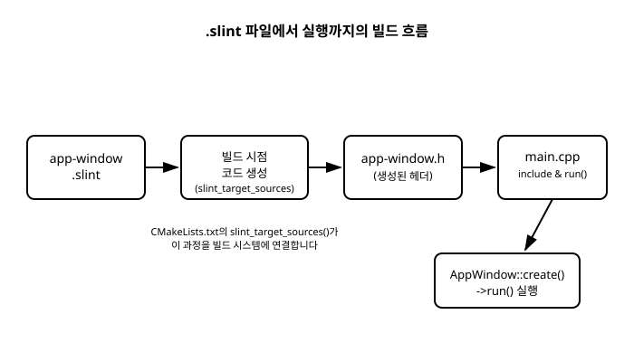

# 2장. 개발 환경 설정과 첫 창

[◀ 이전: 1장. Slint란 무엇인가](ch01-Slint란무엇인가.md) | [📖 목차](00-목차.md) | [다음: 3장. Slint 언어(.slint) 기초 문법 ▶](ch03-Slint언어기초문법.md)


1장에서 살펴본 것처럼 Slint 애플리케이션은 `.slint` 파일과 C++ 코드 두 부분으로 나뉩니다. 이 장에서는 그 두 부분을 실제로 하나의 프로젝트로 묶어, 창 하나만 띄우는 가장 단순한 Slint 애플리케이션을 빌드하고 실행해 봅니다.

## CMake 프로젝트에 Slint 통합하기

Slint의 C++ 바인딩은 CMake를 통해 빌드 시스템에 통합하는 것이 표준적인 방법입니다. 큰 그림에서 필요한 작업은 세 가지입니다.

1. `find_package`로 Slint 패키지를 찾는다.
2. `slint_target_sources`로 `.slint` 파일을 타겟에 등록한다.
3. `target_link_libraries`로 생성된 라이브러리를 링크한다.

```cmake
cmake_minimum_required(VERSION 3.21)
project(hello_slint LANGUAGES CXX)

find_package(Slint REQUIRED)

add_executable(hello_slint main.cpp)
slint_target_sources(hello_slint ui/app-window.slint)
target_link_libraries(hello_slint PRIVATE Slint::Slint)
```

`find_package(Slint REQUIRED)`가 성공하려면 CMake가 Slint 패키지의 위치를 알아야 합니다. Slint를 시스템에 준비하는 방법은 크게 두 가지입니다.

- **vcpkg 사용**: vcpkg로 Slint 포트를 설치하고, vcpkg의 툴체인 파일을 CMake에 넘겨주는 방식입니다. 이 저장소의 "VS Code로 구축하는 C++ 개발환경" 책에서 다룬 vcpkg 기반 CMake 워크플로를 그대로 따르는 독자라면 익숙한 흐름일 것입니다.
- **CMake `FetchContent` 사용**: Slint 소스를 CMake가 빌드 시점에 내려받아 서브 프로젝트로 포함시키는 방식입니다. 별도의 패키지 매니저 설치 없이 `CMakeLists.txt`만으로 의존성을 해결할 수 있습니다.

두 방식 모두 결과적으로는 `find_package(Slint REQUIRED)`가 성공하고 `Slint::Slint`라는 CMake 타겟이 만들어진다는 점은 동일합니다. 이 책에서는 어느 쪽을 쓰든 이후 예제 코드가 그대로 동작하므로, 구체적인 설치 스크립트보다는 이후 장들에서 다룰 Slint 자체의 문법과 API에 집중합니다.

`slint_target_sources(hello_slint ui/app-window.slint)`가 핵심입니다. 이 한 줄이 빌드 시스템에게 "`ui/app-window.slint` 파일을 Slint 컴파일러로 처리해서 C++ 헤더를 생성하고, 그 결과를 `hello_slint` 타겟의 빌드 과정에 포함시켜라"라고 지시합니다. 프로젝트에 `.slint` 파일이 여러 개라면 이 함수에 파일을 이어서 나열하거나 여러 번 호출해 각각 등록할 수 있습니다.

## 가장 단순한 .slint 파일

`ui/app-window.slint` 파일을 다음과 같이 작성합니다. 창(Window) 하나를 정의하고, 그 안에 텍스트 하나를 표시하는 것이 전부입니다.

```slint
component AppWindow inherits Window {
    width: 320px;
    height: 200px;
    title: "Hello, Slint!";

    Text {
        text: "Hello, Slint!";
        font-size: 24px;
        horizontal-alignment: center;
        vertical-alignment: center;
    }
}
```

`component AppWindow inherits Window { ... }`는 `AppWindow`라는 이름의 컴포넌트를 선언하면서, 이 컴포넌트가 `Window`(최상위 창)의 성질을 상속받는다는 뜻입니다. 중괄호 안에는 창의 프로퍼티(`width`, `height`, `title`)와 그 자식 요소인 `Text`가 나열되어 있습니다. `.slint` 문법 자체의 세부 규칙은 3장에서 다시 차근차근 다룰 것이므로, 지금은 "이 파일 하나가 창 하나를 정의한다"는 전체 그림만 파악하고 넘어가도 충분합니다.

## 빌드 시 자동 생성되는 C++ 헤더

`slint_target_sources`로 등록된 `.slint` 파일은 빌드가 실행될 때 Slint 컴파일러를 거쳐 대응하는 C++ 헤더 파일로 변환됩니다. 파일 이름 규칙은 단순합니다. `app-window.slint`라면 `app-window.h`라는 헤더가 생성되고, 그 안에는 `.slint`에서 선언한 컴포넌트 이름(`AppWindow`)과 같은 이름의 C++ 클래스가 정의됩니다.

이 생성 과정은 소스 코드를 직접 눈으로 볼 필요 없이, `main.cpp`에서 마치 원래부터 존재하던 헤더인 것처럼 `#include`해서 쓰면 됩니다.

```cpp
#include "app-window.h"

int main() {
    auto app_window = AppWindow::create();
    app_window->run();
    return 0;
}
```

`AppWindow::create()`는 생성된 `AppWindow` 클래스의 인스턴스를 만들어 `slint::ComponentHandle<AppWindow>`라는 스마트 포인터로 감싸 반환합니다. 이 핸들이 살아 있는 동안 실제 UI 컴포넌트도 메모리에 유지됩니다. `->run()`을 호출하면 이벤트 루프가 시작되어 창이 화면에 표시되고, 사용자가 창을 닫을 때까지 프로그램이 그 자리에서 대기합니다.

이 짧은 `main.cpp`와 앞서 작성한 `app-window.slint`, `CMakeLists.txt` 세 파일만으로 텍스트 하나가 표시된 창을 여는 완전한 애플리케이션이 완성됩니다. `.slint`에 정의한 프로퍼티를 C++ 코드에서 읽고 쓰는 방법, 즉 `get_*`/`set_*` 메서드는 8장에서 자세히 다룹니다.

아래 다이어그램은 `.slint` 파일이 빌드 과정을 거쳐 실행 중인 창이 되기까지의 흐름을 정리한 것입니다.



## slint-viewer로 빠르게 미리보기하기

UI 마크업을 조금씩 고칠 때마다 매번 C++ 프로젝트 전체를 다시 빌드하는 것은 번거롭습니다. Slint는 이런 반복 작업을 위해 `slint-viewer`라는 별도의 도구를 제공합니다. `.slint` 파일 하나를 인자로 넘기면 C++ 빌드 과정 없이 그 파일이 정의하는 창을 곧바로 열어 보여줍니다.

```bash
slint-viewer ui/app-window.slint
```

레이아웃을 조정하거나 색상, 텍스트를 바꾸는 것처럼 UI의 겉모습을 다듬는 단계에서는 `slint-viewer`로 결과를 즉시 확인하면서 `.slint` 파일만 반복해서 수정하는 편이 훨씬 빠릅니다. 마크업이 어느 정도 자리를 잡은 뒤에 비로소 C++ 프로젝트에 통합해 애플리케이션 로직을 연결하는 순서로 작업하면 개발 흐름이 한결 매끄러워집니다.

## 요약

- Slint를 CMake 프로젝트에 통합하려면 `find_package(Slint REQUIRED)`, `slint_target_sources(타겟 파일.slint)`, `target_link_libraries(타겟 PRIVATE Slint::Slint)` 세 가지가 필요합니다.
- Slint 자체는 vcpkg 또는 CMake `FetchContent`로 프로젝트에 가져올 수 있습니다.
- `component AppWindow inherits Window { ... }` 형태로 창 하나를 선언하는 것이 가장 단순한 `.slint` 파일입니다.
- `app-window.slint`는 빌드 시점에 `app-window.h`로 변환되며, 그 안에 `AppWindow` C++ 클래스가 생성됩니다.
- `AppWindow::create()`로 인스턴스(`slint::ComponentHandle<AppWindow>`)를 만들고 `->run()`으로 이벤트 루프를 시작합니다.
- `slint-viewer`를 사용하면 C++ 빌드 없이 `.slint` 파일만으로 UI를 빠르게 미리볼 수 있습니다.

## 연습문제

1. `CMakeLists.txt`에서 `.slint` 파일을 타겟에 등록하는 함수의 이름과, 그 함수가 빌드 과정에서 실제로 하는 일을 설명해 보세요.
2. `ui/greeting.slint`에 `component Greeting inherits Window { ... }`를 정의했다면, 빌드 시 생성되는 헤더 파일 이름과 C++ 클래스 이름은 각각 무엇일지 적어 보세요.
3. `AppWindow::create()`가 반환하는 값의 타입은 무엇이며, 이 타입이 일반 포인터 대신 사용되는 이유를 생각해 보세요.
4. `main.cpp`를 작성해, 이 장의 `app-window.slint`를 그대로 사용하되 창 크기를 `400x300`으로 바꿔 실행되도록 만들어 보세요. (힌트: `width`, `height` 프로퍼티는 `.slint` 쪽에서 수정합니다.)
5. `slint-viewer`가 유용한 개발 시나리오와, 반대로 C++ 프로젝트 전체를 빌드해서 확인해야만 하는 상황을 각각 하나씩 예로 들어 보세요.

---

[◀ 이전: 1장. Slint란 무엇인가](ch01-Slint란무엇인가.md) | [📖 목차](00-목차.md) | [다음: 3장. Slint 언어(.slint) 기초 문법 ▶](ch03-Slint언어기초문법.md)
