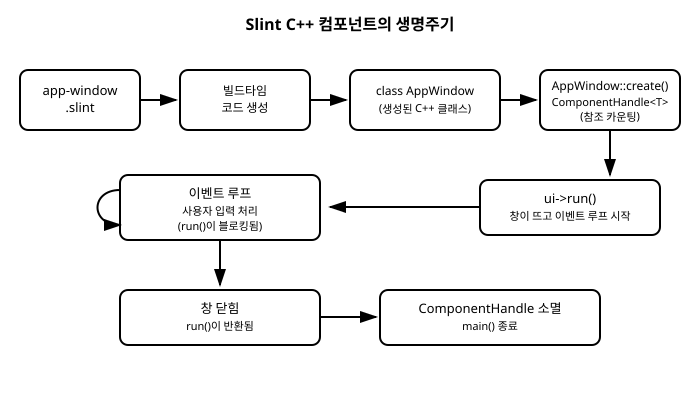

# 7장. C++와 Slint 연동 기초

[◀ 이전: 6장. 콜백과 이벤트 처리](ch06-콜백과이벤트처리.md) | [📖 목차](00-목차.md) | [다음: 8장. C++에서 프로퍼티 제어하기 ▶](ch08-CPP에서프로퍼티제어하기.md)


지금까지 6장에 걸쳐 `.slint` 언어 자체를 다뤘습니다. 컴포넌트를 선언하고, 레이아웃을 배치하고, 프로퍼티와 바인딩으로 상태를 표현하고, 콜백으로 사용자 입력에 반응하는 방법까지 살펴봤습니다. 이 모든 것은 `.slint` 파일 안에서 완결되는 이야기였습니다.

하지만 실제 애플리케이션은 UI만으로 이루어지지 않습니다. 파일을 읽고, 네트워크 요청을 보내고, 데이터베이스를 조회하고, 복잡한 계산을 수행하는 로직은 결국 C++ 코드로 작성됩니다. Slint가 실용적인 GUI 툴킷이 되려면 이 C++ 로직과 `.slint`로 선언한 UI가 서로 데이터를 주고받을 수 있어야 합니다.

이번 장에서는 그 다리를 놓는 기초를 다룹니다. `.slint` 파일이 어떻게 C++ 클래스로 변신하는지, 그 클래스를 C++ 코드에서 어떻게 생성하고 실행하는지를 처음부터 끝까지 짚어보겠습니다. 8장에서는 여기서 한 걸음 더 나아가 프로퍼티와 콜백을 통해 C++와 UI가 실시간으로 데이터를 주고받는 방법을 다룹니다.

## 7.1 Slint의 빌드 모델 다시 보기

2장에서 첫 창을 띄울 때 이미 Slint의 빌드 모델을 한 번 경험했습니다. 여기서는 그 과정을 조금 더 깊이 들여다보겠습니다.

Slint는 `.slint` 파일을 **인터프리터가 실행 중에 읽어들이는 스크립트**로 취급하지 않습니다. 대신 빌드 시점에 `.slint` 파일을 컴파일러가 읽어 대응하는 C++ 소스 코드(정확히는 헤더 파일)를 생성합니다. 즉 `.slint` 파일은 최종 실행 파일에 직접 포함되는 것이 아니라, 빌드 과정 중간에 C++ 코드로 번역된 뒤 나머지 C++ 코드와 함께 컴파일됩니다.

이 흐름을 CMake 프로젝트를 기준으로 정리하면 다음과 같습니다.

```cmake
cmake_minimum_required(VERSION 3.21)
project(hello_slint LANGUAGES CXX)

find_package(Slint REQUIRED)

add_executable(hello_slint main.cpp)
slint_target_sources(hello_slint app-window.slint)
target_link_libraries(hello_slint PRIVATE Slint::Slint)
```

`slint_target_sources()`는 Slint가 제공하는 CMake 함수로, 지정한 `.slint` 파일을 빌드 그래프에 연결합니다. 이 함수가 하는 일을 단계별로 풀어보면 다음과 같습니다.

1. **컴파일 규칙 등록**: CMake 구성 시점에 `app-window.slint`를 입력으로, 생성된 헤더(예: `app-window.h`)를 출력으로 하는 빌드 규칙을 만듭니다.
2. **Slint 컴파일러 호출**: 실제 빌드가 실행되면 이 규칙에 따라 Slint 컴파일러가 `app-window.slint`를 파싱하고, 그 안에 선언된 최상위 컴포넌트(export된 컴포넌트)마다 대응하는 C++ 클래스 정의를 생성합니다.
3. **헤더 노출**: 생성된 헤더 파일의 경로가 `hello_slint` 타겟의 include 경로에 자동으로 추가됩니다. 그래서 `main.cpp`에서 `#include "app-window.h"`라고만 쓰면 됩니다. 이 헤더가 실제로 어느 빌드 디렉터리에 생성되는지는 신경 쓸 필요가 없습니다.
4. **재빌드 추적**: `.slint` 파일이 수정되면 CMake/Ninja(또는 사용 중인 빌드 시스템)가 이를 감지해 코드 생성 단계부터 다시 실행합니다. 일반 `.cpp` 파일이 수정됐을 때 재컴파일되는 것과 동일한 방식으로 동작합니다.

핵심은 **컴포넌트 하나당 C++ 클래스 하나가 생성된다**는 점입니다. `app-window.slint`에 `export component AppWindow { ... }`라고 선언했다면, 빌드 후에는 `AppWindow`라는 이름의 C++ 클래스를 담은 `app-window.h`가 만들어집니다. 이 클래스 이름은 `.slint` 안에서 선언한 컴포넌트 이름과 그대로 일치하므로, UI 쪽 이름 규칙만 알면 C++ 쪽 클래스 이름도 예측할 수 있습니다.

> 이 자동 생성 코드를 직접 열어 편집하고 싶은 유혹이 들 수 있지만, 그러지 않는 것이 좋습니다. 빌드할 때마다 다시 생성되므로 수정 내용이 사라질 뿐 아니라, 애초에 이 클래스는 `.slint` 파일의 내용을 그대로 반영하도록 설계되어 있습니다. UI를 바꾸고 싶다면 `.slint` 파일을, 로직을 바꾸고 싶다면 `main.cpp`(또는 다른 `.cpp` 파일)를 수정하는 것이 올바른 역할 분담입니다.

## 7.2 생성된 클래스와 ComponentHandle

빌드가 끝나면 `AppWindow`라는 C++ 클래스가 존재하게 됩니다. 그런데 이 클래스를 코드에서 다룰 때는 보통 `AppWindow` 타입을 직접 변수로 선언하지 않습니다. 대신 다음과 같은 형태를 씁니다.

```cpp
#include "app-window.h"

int main() {
    slint::ComponentHandle<AppWindow> ui = AppWindow::create();
    ui->run();
}
```

여기서 눈여겨볼 것이 두 가지입니다.

**첫째, `slint::ComponentHandle<T>`**입니다. 이것은 Slint 런타임이 UI 컴포넌트의 수명을 관리하기 위해 제공하는 스마트 포인터 타입입니다. 내부적으로 참조 카운팅(reference counting) 방식으로 동작하는데, 이는 C++ 표준 라이브러리의 `std::shared_ptr`과 비슷한 개념입니다. `ComponentHandle`을 복사하면 참조 카운트가 늘어나고, 마지막 핸들이 소멸할 때 실제 컴포넌트 인스턴스가 해제됩니다. 왜 원시 포인터나 값 타입 대신 참조 카운팅 핸들을 쓸까요? UI 컴포넌트는 Slint 런타임 내부(렌더링 트리, 이벤트 시스템 등)에서도 동시에 참조되기 때문입니다. 화면에 그려지는 동안에는 컴포넌트가 살아있어야 하고, 여러 곳에서 동시에 같은 컴포넌트를 참조할 수 있어야 하므로 참조 카운팅이 자연스러운 선택입니다.

실무에서는 `ComponentHandle<AppWindow>`라는 긴 타입을 매번 쓰는 대신 `auto`를 사용하는 것이 일반적입니다.

```cpp
auto ui = AppWindow::create();
```

**둘째, `T::create()` 정적 팩토리 함수**입니다. 생성된 각 클래스에는 생성자 대신(또는 생성자와 별개로) `create()`라는 정적 멤버 함수가 있고, 이 함수가 `ComponentHandle<T>`를 반환합니다. `new AppWindow()`처럼 직접 생성하지 않고 `AppWindow::create()`를 통해서만 인스턴스를 만드는 것이 Slint의 규칙입니다. 이는 앞서 설명한 참조 카운팅 수명 관리와 맞물려 있습니다. `create()`는 내부적으로 필요한 초기화(플랫폼 윈도우 시스템과의 연결 준비, 초기 프로퍼티 값 설정 등)를 수행한 뒤 관리 가능한 핸들을 돌려줍니다.

정리하면, 생성된 C++ 클래스를 다루는 패턴은 항상 다음 형태를 따릅니다.

```cpp
auto ui = ComponentName::create();  // ComponentHandle<ComponentName> 반환
```

## 7.3 run()으로 이벤트 루프 시작하기

`ComponentHandle`을 얻었다고 해서 아직 화면에 창이 나타나지는 않습니다. 창을 실제로 띄우고 사용자 입력을 처리하기 시작하려면 `run()` 멤버 함수를 호출해야 합니다.

```cpp
ui->run();
```

`run()`이 호출되는 순간 다음과 같은 일이 일어납니다.

1. 운영체제에 실제 윈도우가 생성되고 화면에 표시됩니다.
2. Slint의 **이벤트 루프**가 시작됩니다. 이벤트 루프란 마우스 클릭, 키보드 입력, 창 크기 변경, 다시 그리기 요청 같은 이벤트를 끊임없이 받아 처리하는 반복 구조입니다.
3. 사용자가 버튼을 클릭하면 6장에서 다룬 콜백이 트리거되고, 프로퍼티가 바뀌면 화면이 다시 그려지는 등, 지금까지 `.slint`에서 선언한 모든 반응형 동작이 실제로 작동하기 시작합니다.

여기서 반드시 기억해야 할 특징이 하나 있습니다. **`run()`은 블로킹(blocking) 호출**이라는 점입니다. 즉 사용자가 창을 닫기 전까지 `run()`은 반환되지 않습니다. `ui->run()` 다음 줄에 있는 코드는 창이 닫힌 뒤에야 실행됩니다.

```cpp
int main() {
    auto ui = AppWindow::create();

    ui->run(); // 창이 닫힐 때까지 여기서 멈춰 있습니다

    // 창이 닫힌 뒤에야 이 지점에 도달합니다
    return 0;
}
```

이 특성은 콘솔 프로그램에서 `std::cin >> x;`가 입력을 받을 때까지 멈춰 있는 것과 비슷한 감각으로 이해하면 됩니다. 다만 `run()`은 단순히 하나의 입력을 기다리는 것이 아니라, 창이 열려 있는 동안 발생하는 모든 이벤트를 지속적으로 처리하는 루프를 돌립니다.

일반적인 데스크톱 GUI 애플리케이션의 `main()` 함수는 결국 다음과 같은 아주 단순한 구조로 요약됩니다.

- UI를 생성한다 (`create()`)
- 필요하다면 콜백을 연결하고 초기 상태를 설정한다 (8장에서 다룹니다)
- 이벤트 루프를 시작한다 (`run()`)
- 창이 닫히면 프로그램을 정리하고 종료한다

`ui`가 함수 스코프를 벗어나 소멸되면(예를 들어 `main()`이 끝나면) `ComponentHandle`의 참조 카운트가 0이 되면서 내부 컴포넌트도 함께 해제됩니다. 별도로 `delete`를 호출하거나 소멸자를 직접 관리할 필요가 없습니다.

## 7.4 완전한 예제: Hello Slint를 C++ 관점에서 다시 보기

2장에서 만들었던 첫 창 예제를 이번에는 C++ 쪽 흐름에 집중해서 다시 살펴보겠습니다. 프로젝트 구조는 다음과 같다고 가정합니다.

```
hello_slint/
├── CMakeLists.txt
├── main.cpp
└── app-window.slint
```

`app-window.slint`는 창 하나에 텍스트를 표시하는 아주 단순한 컴포넌트입니다.

```slint
export component AppWindow inherits Window {
    width: 320px;
    height: 200px;
    title: "Hello Slint";

    Text {
        text: "Hello, Slint from C++!";
        font-size: 20px;
        horizontal-alignment: center;
        vertical-alignment: center;
    }
}
```

`CMakeLists.txt`는 앞서 7.1절에서 살펴본 것과 동일한 형태입니다.

```cmake
cmake_minimum_required(VERSION 3.21)
project(hello_slint LANGUAGES CXX)

find_package(Slint REQUIRED)

add_executable(hello_slint main.cpp)
slint_target_sources(hello_slint app-window.slint)
target_link_libraries(hello_slint PRIVATE Slint::Slint)
```

이제 `main.cpp`를 앞서 배운 세 단계 — include, create, run — 을 명시적으로 나눠서 작성해 보겠습니다.

```cpp
// main.cpp

// 빌드 시점에 app-window.slint로부터 생성된 헤더.
// 이 헤더 안에 class AppWindow { ... } 가 정의되어 있습니다.
#include "app-window.h"

int main() {
    // 1단계: AppWindow::create()로 인스턴스를 생성합니다.
    //         반환 타입은 slint::ComponentHandle<AppWindow>이며
    //         auto로 받는 것이 관례입니다.
    auto ui = AppWindow::create();

    // 2단계: run()을 호출해 창을 띄우고 이벤트 루프를 시작합니다.
    //         이 호출은 창이 닫힐 때까지 반환되지 않습니다.
    ui->run();

    // 3단계: 창이 닫히면 여기에 도달합니다.
    //         ui가 스코프를 벗어나며 자동으로 정리됩니다.
    return 0;
}
```

빌드하고 실행하면 "Hello, Slint from C++!"라는 문구가 담긴 320x200 크기의 창이 뜹니다. 창을 닫으면 `run()`이 반환되고 `main()`도 곧바로 종료됩니다.

이 짧은 예제 안에 이번 장에서 다룬 개념이 모두 들어 있습니다.

- `.slint` 파일은 빌드 시점에 컴파일되어 C++ 헤더로 번역된다 (`app-window.slint` → `app-window.h`)
- 생성된 클래스는 `ComponentHandle<T>`로 다뤄지며, `T::create()`로 인스턴스를 만든다
- `->run()`은 창을 띄우고 이벤트 루프를 시작하며, 창이 닫힐 때까지 블로킹된다

아래 다이어그램은 이 전체 흐름을 `.slint` 파일 작성부터 창이 닫히기까지 한눈에 정리한 것입니다.



지금까지는 UI를 그냥 띄우기만 했을 뿐, C++ 코드와 UI 사이에 데이터가 오가지는 않았습니다. 다음 장에서는 `.slint`에서 선언한 프로퍼티를 C++에서 읽고 쓰는 방법, 그리고 콜백을 통해 UI와 C++ 로직이 서로 신호를 주고받는 방법을 다룹니다.

## 요약

- `.slint` 파일은 실행 시점에 해석되는 스크립트가 아니라, **빌드 시점에 컴파일되어 C++ 클래스로 변환**됩니다. CMake에서는 `slint_target_sources()`가 이 코드 생성 과정을 빌드 그래프에 연결합니다.
- `.slint`에서 선언한 컴포넌트 하나마다 같은 이름의 C++ 클래스가 생성된 헤더에 정의됩니다. (예: `AppWindow` 컴포넌트 → `class AppWindow`)
- 생성된 클래스의 인스턴스는 `slint::ComponentHandle<T>`라는 참조 카운팅 기반 스마트 포인터로 다룹니다. 인스턴스는 `T::create()` 정적 함수로 생성하며, `auto`로 받는 것이 일반적입니다.
- `ui->run()`을 호출하면 창이 화면에 표시되고 이벤트 루프가 시작됩니다. 이 호출은 **블로킹**되어 창이 닫힐 때까지 반환되지 않습니다.
- 일반적인 `main()` 함수의 골격은 "생성 → (필요시 콜백 연결/초기화) → run() → 종료" 네 단계로 요약됩니다.

## 연습문제

1. `.slint` 파일이 인터프리터 방식이 아니라 빌드 시점에 C++ 코드로 컴파일되는 방식을 택했을 때 얻을 수 있는 장점을 두 가지 이상 생각해 보세요.
2. `slint::ComponentHandle<T>`가 원시 포인터(`T*`)나 값 타입(`T`) 대신 참조 카운팅 스마트 포인터로 설계된 이유를 UI 렌더링 시스템의 관점에서 설명해 보세요.
3. `ui->run()`이 블로킹 호출이라는 사실이 `main()` 함수의 구조에 어떤 제약을 주는지 설명해 보세요. 만약 `run()` 호출 이전에 반드시 실행해야 하는 초기화 로직이 있다면 어디에 위치해야 할까요?
4. 이번 장의 `app-window.slint`에서 컴포넌트 이름을 `AppWindow`에서 `MainWindow`로 바꾸면, `main.cpp`에서 어떤 부분들을 함께 수정해야 하는지 나열해 보세요.
5. `CMakeLists.txt`에서 `slint_target_sources(hello_slint app-window.slint)` 줄을 삭제하고 빌드하면 어떤 컴파일 오류가 발생할지 예상해 보세요.

---

[◀ 이전: 6장. 콜백과 이벤트 처리](ch06-콜백과이벤트처리.md) | [📖 목차](00-목차.md) | [다음: 8장. C++에서 프로퍼티 제어하기 ▶](ch08-CPP에서프로퍼티제어하기.md)
