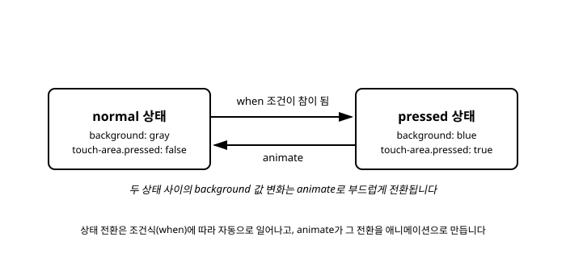

# 10장. 상태(states)와 애니메이션

[◀ 이전: 9장. 표준 위젯 라이브러리(std-widgets)](ch09-표준위젯라이브러리.md) | [📖 목차](00-목차.md) | [다음: 11장. 리스트와 모델(Model) ▶](ch11-리스트와모델.md)


## 조건에 따라 달라지는 모양

6장에서 만든 커스텀 버튼을 떠올려 보면, `touch-area.pressed`라는 프로퍼티 값에 따라 배경색을 다르게 보여주는 바인딩을 작성했습니다. 5장에서 배운 것처럼 이는 "눌려 있으면 파란색, 아니면 회색"이라는 조건식을 `background` 프로퍼티에 직접 연결하는 방식이었습니다.

```slint
background: touch-area.pressed ? blue : gray;
```

버튼 하나에 신경 써야 할 프로퍼티가 배경색 하나뿐이라면 이런 삼항 연산자로도 충분합니다. 하지만 실제 UI 컴포넌트는 눌림 상태 하나만 갖는 경우가 드뭅니다. 마우스가 올라와 있는지(hover), 포커스를 받았는지(focus), 비활성화되었는지(disabled), 눌려 있는지(pressed)처럼 여러 조건이 동시에 존재할 수 있고, 각 조건마다 배경색뿐 아니라 글자색, 테두리 두께, 그림자 등 여러 프로퍼티가 함께 바뀌어야 할 수도 있습니다. 이런 경우 삼항 연산자를 프로퍼티마다 나열하면 코드가 금세 읽기 어려워집니다. Slint는 이 문제를 위해 `states`라는 전용 문법을 제공합니다.

## states 블록: 이름 붙은 상태 정의하기

`states` 블록은 컴포넌트가 가질 수 있는 여러 "상태"에 이름을 붙이고, 각 상태에서 프로퍼티 값이 무엇이어야 하는지를 한곳에 모아 선언합니다.

```slint
import { TouchArea } from "std-widgets.slint";

component StateButton inherits Rectangle {
    width: 160px;
    height: 48px;
    border-radius: 8px;
    background: gray;

    touch-area := TouchArea {}

    states [
        pressed when touch-area.pressed: {
            background: blue;
        }
        normal: {
            background: gray;
        }
    ]
}
```

`states [ ... ]` 안에는 상태를 하나씩 나열합니다. `pressed when touch-area.pressed: { ... }`는 "`touch-area.pressed`가 참일 때 `pressed`라는 이름의 상태로 진입하고, 이 상태에서는 `background`가 `blue`가 된다"는 뜻입니다. `when` 뒤에 붙는 조건식은 5장에서 다룬 프로퍼티 표현식과 동일한 문법을 그대로 사용합니다. 조건이 없는 `normal: { ... }`처럼 `when`을 생략한 상태는 다른 상태의 조건이 하나도 참이 아닐 때 적용되는 기본 상태 역할을 합니다.

이 예제는 앞서 본 삼항 연산자 버전과 최종 결과는 같지만, 프로퍼티가 여러 개로 늘어났을 때의 차이가 분명해집니다.

```slint
states [
    pressed when touch-area.pressed: {
        background: darkblue;
        border-width: 2px;
    }
    hover when touch-area.has-hover: {
        background: royalblue;
        border-width: 1px;
    }
    normal: {
        background: gray;
        border-width: 1px;
    }
]
```

각 상태 안에서 바뀌는 프로퍼티들을 한 블록에 모아 적을 수 있으므로, "이 상태일 때 이 컴포넌트가 어떻게 보이는가"를 한눈에 파악할 수 있습니다. 프로퍼티별로 조건을 흩어 적는 것과 상태별로 프로퍼티를 모아 적는 것의 차이라고 볼 수 있습니다.

## 상태 전환은 자동으로 일어난다

`states` 블록에서 가장 중요한 특징은, 어떤 상태로 "전환하라"고 명령형으로 지시하는 코드가 어디에도 없다는 점입니다. 각 상태에 붙은 `when` 조건식이 참이 되는 순간, Slint 런타임이 알아서 해당 상태를 적용합니다. 개발자가 할 일은 "언제 어떤 모습이어야 하는가"를 선언하는 것뿐이고, 그 조건을 언제 평가해서 실제로 전환을 일으킬지는 전적으로 프레임워크의 책임입니다.

이는 5장에서 다룬 선언적 바인딩 철학의 연장선입니다. `background: touch-area.pressed ? blue : gray;`라는 바인딩을 작성할 때도 "`pressed`가 바뀔 때마다 다시 계산해서 화면에 반영하라"고 명령한 적이 없었습니다. `pressed`라는 프로퍼티와 `background`라는 프로퍼티 사이의 관계만 선언했을 뿐, 그 관계를 언제 어떻게 갱신할지는 Slint가 알아서 처리했습니다. `states`는 이 아이디어를 여러 프로퍼티, 여러 조건으로 확장한 것뿐입니다. 즉 "지금 pressed 상태로 바꿔라" 같은 명령형 코드 대신, "`touch-area.pressed`가 참이면 `pressed` 상태다"라는 사실만 선언하면, 사용자가 버튼을 누르고 떼는 매 순간 그 사실에 맞춰 상태가 자동으로 갱신됩니다.

## animate 키워드: 값 변화를 부드럽게 만들기

지금까지의 `states` 예제는 조건이 바뀌는 순간 프로퍼티 값이 즉시 뒤바뀝니다. 회색에서 파란색으로 색이 한 프레임 만에 툭 전환되는 것입니다. 대부분의 UI에서는 이런 갑작스러운 전환보다, 값이 짧은 시간에 걸쳐 부드럽게 바뀌는 편이 더 자연스럽게 느껴집니다. Slint는 이를 위해 `animate` 키워드를 제공합니다.

```slint
component AnimatedButton inherits Rectangle {
    width: 160px;
    height: 48px;
    background: gray;

    animate background {
        duration: 200ms;
        easing: ease-in-out;
    }

    touch-area := TouchArea {}

    states [
        pressed when touch-area.pressed: {
            background: blue;
        }
        normal: {
            background: gray;
        }
    ]
}
```

`animate background { duration: 200ms; easing: ease-in-out; }`는 "`background` 프로퍼티의 값이 바뀔 때마다, 그 변화를 200밀리초에 걸쳐 `ease-in-out` 곡선을 따라 진행시켜라"라는 선언입니다. 이 선언을 컴포넌트 본문에 한 번 적어 두면, 그 뒤로 `background` 값이 어떤 이유로 바뀌든(states 블록에 의해서든, 다른 바인딩에 의해서든) 자동으로 애니메이션이 적용됩니다.

`animate` 블록에서 자주 쓰는 옵션은 다음 두 가지입니다.

- `duration`: 애니메이션이 진행되는 시간입니다. `200ms`, `1s`처럼 밀리초나 초 단위를 붙여 씁니다.
- `easing`: 시간에 따라 값이 변화하는 속도 곡선입니다. `linear`(일정한 속도), `ease-in`(천천히 시작해서 빨라짐), `ease-out`(빠르게 시작해서 천천히 멈춤), `ease-in-out`(양 끝이 느리고 중간이 빠름) 등을 지정할 수 있습니다.

색상뿐 아니라 숫자로 표현되는 대부분의 프로퍼티(`width`, `height`, `opacity`, `x`, `y` 등)에도 `animate`를 똑같이 적용할 수 있습니다.

## 상태와 애니메이션 결합하기: 마우스 오버 실전 예제

이제 `states`와 `animate`를 함께 사용해, 마우스를 올렸을 때 버튼 색이 부드럽게 바뀌는 실전 예제를 만들어 보겠습니다. 6장에서 배운 `TouchArea`를 사용해 마우스 진입 여부(`has-hover`)와 눌림 여부(`pressed`)를 모두 감지합니다.

```slint
export component HoverButton inherits Rectangle {
    width: 160px;
    height: 48px;
    border-radius: 8px;
    background: gray;

    callback clicked <=> touch-area.clicked;

    animate background {
        duration: 200ms;
        easing: ease-in-out;
    }

    touch-area := TouchArea {}

    states [
        pressed when touch-area.pressed: {
            background: darkblue;
        }
        hover when touch-area.has-hover: {
            background: royalblue;
        }
        normal: {
            background: gray;
        }
    ]

    Text {
        text: "클릭하세요";
        color: white;
        horizontal-alignment: center;
        vertical-alignment: center;
    }
}
```

이 컴포넌트가 동작하는 흐름을 정리하면 다음과 같습니다.

1. 평소에는 `touch-area.pressed`도 `touch-area.has-hover`도 거짓이므로 `normal` 상태가 적용되어 `background`는 `gray`입니다.
2. 사용자가 마우스를 버튼 위로 가져가면 `touch-area.has-hover`가 참이 되고, `hover` 상태로 자동 전환되어 `background`가 `royalblue`로 바뀌어야 한다고 선언됩니다.
3. `animate background { duration: 200ms; ... }` 선언 덕분에, `gray`에서 `royalblue`로의 변화는 순간적으로 튀지 않고 200밀리초에 걸쳐 부드럽게 이어집니다.
4. 사용자가 버튼을 누르면 `touch-area.pressed`가 참이 되어 `pressed` 상태로 다시 전환되고, `background`는 `darkblue`로 또 한 번 부드럽게 바뀝니다.
5. 마우스를 떼거나 버튼 밖으로 옮기면 두 조건이 모두 거짓이 되어 `normal` 상태로 돌아오고, `background`는 다시 `gray`로 애니메이션과 함께 복귀합니다.

여기서 개발자가 작성한 코드는 "각 상태에서 배경색이 무엇인가"와 "배경색이 바뀔 때 어떻게 전환할 것인가"라는 두 가지 선언뿐입니다. 마우스 진입/이탈, 클릭/해제 같은 이벤트를 감지해서 애니메이션을 언제 시작하고 끝낼지 계산하는 코드는 한 줄도 없습니다. 이 모든 것을 `states`와 `animate`가 대신 처리해 줍니다.

아래 다이어그램은 `normal` 상태와 `pressed` 상태, 그리고 그 사이를 `animate`가 부드럽게 이어주는 관계를 보여줍니다.



## 요약

- `states [ ... ]` 블록은 컴포넌트가 가질 수 있는 여러 상태에 이름을 붙이고, 각 상태에서 프로퍼티 값이 어떻게 달라지는지를 한곳에 모아 선언하는 문법입니다. `이름 when 조건식: { 프로퍼티: 값; ... }` 형태로 작성하며, `when`이 없는 상태는 다른 조건이 모두 거짓일 때의 기본값 역할을 합니다.
- 상태 전환은 명령형으로 "지금 상태를 바꿔라"라고 지시하지 않고, `when` 뒤의 조건식이 참이 되는 순간 자동으로 이루어집니다. 이는 5장에서 배운 선언적 바인딩 철학이 여러 프로퍼티·여러 조건으로 확장된 것입니다.
- `animate 프로퍼티 { duration: ...; easing: ...; }`는 해당 프로퍼티의 값이 바뀔 때마다 그 변화를 지정한 시간과 곡선에 따라 부드럽게 전환시킵니다. `duration`은 전환 시간을, `easing`은 속도 곡선(`linear`, `ease-in`, `ease-out`, `ease-in-out` 등)을 지정합니다.
- `states`와 `animate`를 함께 쓰면, 상태 전환 조건과 시각적 결과값만 선언하는 것만으로 마우스 오버·눌림 같은 상호작용에 부드러운 색상·크기 전환 효과를 자동으로 얻을 수 있습니다.

## 연습문제

1. `states` 블록을 사용하지 않고 삼항 연산자만으로 hover, pressed, normal 세 가지 상태를 표현하려고 할 때 어떤 어려움이 생기는지 설명해 보세요.
2. `states` 블록에서 `when` 조건을 생략한 상태가 어떤 역할을 하는지, 그리고 그런 상태를 블록의 어느 위치에 두는 것이 자연스러운지 설명해 보세요.
3. `animate` 선언이 특정 상태 전환에만 적용되는 것이 아니라 해당 프로퍼티의 모든 값 변화에 적용된다는 것이, `states` 블록과 함께 쓸 때 어떤 의미를 가지는지 생각해 보세요.
4. `duration`을 `50ms`로 아주 짧게 주는 경우와 `1s`로 길게 주는 경우, 사용자 경험이 각각 어떻게 달라질지 비교해 보세요.
5. 6장에서 여러분이 만들었던 커스텀 버튼 컴포넌트에 이 장에서 배운 `states`와 `animate`를 적용해, 마우스 오버 시 부드럽게 색이 바뀌도록 고쳐 보세요.

---

[◀ 이전: 9장. 표준 위젯 라이브러리(std-widgets)](ch09-표준위젯라이브러리.md) | [📖 목차](00-목차.md) | [다음: 11장. 리스트와 모델(Model) ▶](ch11-리스트와모델.md)
