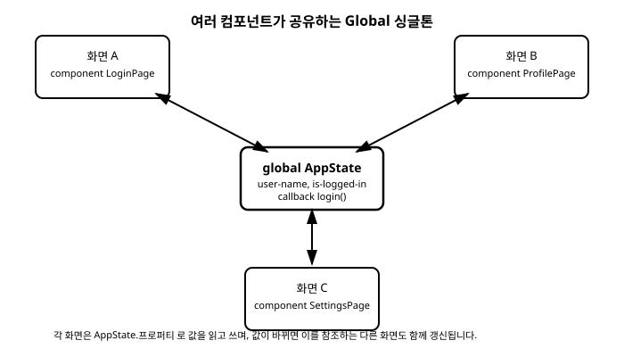

# 12장. 전역 싱글톤(Global)

[◀ 이전: 11장. 리스트와 모델(Model)](ch11-리스트와모델.md) | [📖 목차](00-목차.md) | [다음: 13장. 다중 창과 팝업 ▶](ch13-다중창과팝업.md)


애플리케이션이 조금만 커져도 화면 하나로는 부족해집니다. 로그인 화면, 프로필 화면, 설정 화면처럼 여러 컴포넌트가 나뉘어 있고, 그 화면들이 "지금 로그인한 사용자가 누구인지", "다크 모드가 켜져 있는지" 같은 같은 정보를 공유해야 하는 상황이 자연스럽게 생깁니다. 이번 장에서는 이런 공유 상태를 다루는 Slint의 메커니즘인 **전역 싱글톤(global singleton)**을 살펴봅니다.

## 문제 상황: 여러 화면이 같은 데이터를 필요로 할 때

사용자 이름을 표시해야 하는 화면이 셋 있다고 해 봅시다. 지금까지 배운 도구만으로 이 문제를 풀려면, 사용자 이름을 최상위 컴포넌트에 프로퍼티로 두고, 그 값을 필요로 하는 자식 컴포넌트에 프로퍼티를 통해 계속 전달해 내려가야 합니다.

```slint
component ProfilePage inherits Rectangle {
    in property <string> user-name;
    // user-name을 사용하는 내용
}

component SettingsPage inherits Rectangle {
    in property <string> user-name;
    // user-name을 사용하는 내용
}

component AppWindow inherits Window {
    property <string> user-name: "손님";

    ProfilePage {
        user-name: user-name;
    }

    SettingsPage {
        user-name: user-name;
    }
}
```

두 화면 정도면 아직 견딜 만합니다. 하지만 화면이 늘어나고, 그 화면들이 다시 여러 단계의 하위 컴포넌트로 나뉘어 있다면 어떨까요? `user-name` 하나를 전달하기 위해 중간에 낀 컴포넌트마다 관련 없는 프로퍼티를 선언하고 그대로 다시 넘겨주는 "프로퍼티 릴레이" 코드가 계속 늘어납니다. 이런 방식을 흔히 프로퍼티 드릴링(prop drilling)이라고 부르는데, 코드가 장황해질 뿐 아니라 "이 값이 실제로 어디서 시작해서 어디까지 전달되는지" 추적하기도 점점 어려워집니다. 로그인한 사용자 정보나 앱 전역 설정처럼 애플리케이션 전체가 공유해야 하는 데이터에는 더 나은 방법이 필요합니다.

## `global` 문법: 전역 싱글톤 선언하기

Slint는 이런 상황을 위해 `global` 키워드를 제공합니다. `global`로 선언한 블록은 컴포넌트 트리와 무관하게 애플리케이션 전체에서 단 하나만 존재하는 저장소 역할을 하며, 어떤 컴포넌트에서든 이름으로 직접 접근할 수 있습니다.

```slint
global AppState {
    property <string> user-name: "손님";
    property <bool> is-logged-in: false;

    callback login(string);
    callback logout();
}
```

문법은 `global 이름 { ... }` 형태로, 중괄호 안에는 지금까지 컴포넌트 안에서 써 왔던 것과 똑같은 방식으로 `property`와 `callback`을 선언합니다. 위 예제에서는 `user-name`, `is-logged-in` 두 프로퍼티와 `login`, `logout` 두 콜백을 가진 `AppState`라는 전역 싱글톤을 만들었습니다.

## 다른 컴포넌트에서 전역 싱글톤 사용하기

`global` 블록으로 선언한 프로퍼티와 콜백은 `전역이름.프로퍼티이름` 형태로 어느 컴포넌트에서든 참조할 수 있습니다. 부모로부터 프로퍼티를 넘겨받을 필요가 없습니다.

```slint
global AppState {
    property <string> user-name: "손님";
    property <bool> is-logged-in: false;

    callback login(string);
    callback logout();
}

component ProfilePage inherits Rectangle {
    Text {
        text: AppState.is-logged-in
            ? "환영합니다, " + AppState.user-name
            : "로그인이 필요합니다";
    }
}

component SettingsPage inherits Rectangle {
    Text {
        text: "현재 사용자: " + AppState.user-name;
    }
}

export component AppWindow inherits Window {
    width: 400px;
    height: 300px;

    VerticalLayout {
        ProfilePage { }
        SettingsPage { }
    }
}
```

`ProfilePage`와 `SettingsPage`는 서로 다른 컴포넌트이고 부모-자식 관계도 아니지만(둘 다 `AppWindow`의 자식일 뿐입니다), 둘 다 `AppState.user-name`과 `AppState.is-logged-in`을 똑같이 참조하고 있습니다. 이 두 컴포넌트 사이에 프로퍼티를 전달하는 코드가 전혀 필요 없다는 점이 눈에 띕니다. `AppState`의 `user-name` 값이 바뀌면, 5장에서 배운 바인딩의 원리에 따라 이 값을 참조하고 있는 `ProfilePage`와 `SettingsPage`의 `Text`가 자동으로 다시 계산되어 화면에 반영됩니다.

여러 화면을 각각 별도의 `.slint` 파일로 나누어 작성하는 큰 프로젝트에서는, `global` 선언을 별도의 파일(가령 `app-state.slint`)에 두고 `import { AppState } from "app-state.slint";` 구문으로 필요한 파일마다 불러와 쓰는 구성이 일반적입니다. 여러 파일로 이루어진 프로젝트를 구성하는 자세한 방법은 13장에서 다중 창을 다룰 때 조금 더 살펴보겠습니다. 지금 단계에서는 "`global`은 파일과 컴포넌트 경계를 넘어 하나의 값을 공유하는 수단"이라는 개념만 확실히 잡아 두면 충분합니다.

## 전역 싱글톤을 화면 사이에서 공유하는 구조

아래 다이어그램은 서로 다른 세 화면이 하나의 `AppState` 전역 싱글톤을 공유하는 구조를 보여줍니다. 화면들끼리는 서로를 알 필요가 없고, 각자 가운데의 `AppState`만 바라보면 됩니다.



## C++에서 전역 싱글톤에 접근하기

7장과 8장에서 살펴본 것처럼, `.slint` 파일의 컴포넌트는 빌드 시점에 대응하는 C++ 클래스로 변환됩니다. `global` 싱글톤도 마찬가지로 변환 대상에 포함되는데, 다만 일반 컴포넌트와 달리 최상위 창 클래스가 생성한 인스턴스 하나에 딸려 있는 형태로 노출됩니다. 즉 생성된 최상위 클래스(`AppWindow`라고 합시다)는 `AppState`라는 전역 싱글톤에 접근하기 위한 별도의 인터페이스를 함께 제공하며, 이 인터페이스를 통해 전역 싱글톤의 프로퍼티를 읽고 쓰거나 콜백을 연결할 수 있습니다.

```cpp
#include "app-window.h"
#include <slint.h>

int main() {
    auto ui = AppWindow::create();

    // 전역 싱글톤의 프로퍼티를 설정
    ui->global<AppState>().set_user_name("김철수");
    ui->global<AppState>().set_is_logged_in(true);

    // 전역 싱글톤의 콜백을 처리
    ui->global<AppState>().on_login([ui = slint::ComponentWeakHandle(ui)](slint::SharedString name) {
        if (auto locked_ui = ui.lock()) {
            (*locked_ui)->global<AppState>().set_user_name(name);
            (*locked_ui)->global<AppState>().set_is_logged_in(true);
        }
    });

    // 전역 싱글톤의 프로퍼티를 읽기
    auto current_name = ui->global<AppState>().get_user_name();

    ui->run();
}
```

`ui->global<AppState>()`처럼 생성된 최상위 클래스에 `global<전역이름>()`을 호출하면 그 전역 싱글톤에 접근할 수 있는 인터페이스를 얻습니다. 이후로는 8장에서 익힌 프로퍼티 getter·setter 규칙(`get_이름`, `set_이름`)과 6장·7장에서 익힌 콜백 등록 규칙(`on_이름`)이 그대로 적용됩니다. 즉 `.slint`의 `user-name` 프로퍼티는 `get_user_name()` / `set_user_name(값)`으로, `login` 콜백은 `on_login(핸들러)`로 대응됩니다. 정확한 메서드 이름이나 반환 타입의 세부 사항은 Slint 버전에 따라 조금씩 달라질 수 있으므로, 실제로 코드를 작성할 때는 빌드 과정에서 생성된 헤더 파일을 참고하는 것이 가장 정확합니다. 지금 단계에서 기억해야 할 핵심은 "생성된 최상위 클래스는 전역 싱글톤에 접근하기 위한 별도의 진입점을 제공하며, 그 진입점을 통해 일반 프로퍼티·콜백과 똑같은 방식으로 값을 읽고 쓸 수 있다"는 개념입니다.

## Global을 남용하면 안 되는 이유

전역 싱글톤은 프로퍼티 드릴링 문제를 깔끔하게 해결해 주지만, 그렇다고 모든 상태를 `global`로 옮기는 것은 좋은 설계가 아닙니다. 편하다는 이유로 컴포넌트 내부에서만 쓰이는 상태(예: 특정 다이얼로그가 지금 펼쳐져 있는지, 어떤 입력 필드에 포커스가 가 있는지)까지 전역으로 선언하기 시작하면 다음과 같은 문제가 생깁니다.

**어디서 값이 바뀌는지 추적하기 어려워집니다.** 프로퍼티가 특정 컴포넌트 안에 있으면, 그 값을 바꾸는 코드는 그 컴포넌트와 그 자식들로 범위가 제한됩니다. 하지만 전역 싱글톤의 프로퍼티는 애플리케이션의 어느 컴포넌트에서든, 어느 C++ 콜백 핸들러에서든 값을 바꿀 수 있습니다. 프로젝트가 커질수록 "이 값이 지금 왜 이런 값인지"를 알아내기 위해 코드베이스 전체를 뒤져야 하는 상황이 잦아집니다.

**컴포넌트의 재사용성이 떨어집니다.** 컴포넌트가 필요한 데이터를 프로퍼티로 입력받는 대신 전역 싱글톤을 직접 참조하도록 만들면, 그 컴포넌트는 항상 그 전역 싱글톤이 존재하는 환경에서만 동작합니다. 같은 컴포넌트를 다른 맥락에서 재사용하거나 독립적으로 테스트하기가 어려워집니다.

**의도치 않은 부수 효과가 생기기 쉽습니다.** 여러 화면이 같은 전역 프로퍼티를 각자의 사정에 맞춰 수정하다 보면, 한 화면의 코드가 다른 화면의 상태를 의도치 않게 바꿔 버리는 일이 생길 수 있습니다. 이런 버그는 두 화면 사이의 연결고리가 코드에 명시적으로 드러나지 않기 때문에 원인을 찾기가 특히 까다롭습니다.

이런 이유로, 전역 싱글톤은 다음과 같은 원칙을 세워 절제해서 사용하는 것이 좋습니다.

- **정말로 여러 화면이 공유해야 하는 상태만 전역으로 둡니다.** 로그인한 사용자 정보, 앱의 다크 모드 여부, 전체 서버 연결 상태처럼 애플리케이션 차원의 데이터가 좋은 후보입니다.
- **한 컴포넌트 안에서만 의미가 있는 상태는 그 컴포넌트의 로컬 프로퍼티로 둡니다.** "이 입력창이 지금 포커스를 가지고 있는가" 같은 정보를 전역으로 끌어올릴 이유는 거의 없습니다.
- **전역 싱글톤의 프로퍼티를 직접 수정하는 대신, 콜백을 통해 값을 바꾸는 편이 추적하기 쉬운 경우가 많습니다.** 이번 장의 `AppState` 예제에서 `login` 콜백을 통해서만 `user-name`과 `is-logged-in`을 바꾸도록 설계한 것도 같은 이유입니다. 값을 직접 대입할 수 있는 통로를 여러 군데에 열어 두는 것보다, "로그인은 반드시 `login` 콜백을 거친다"는 규칙을 두면 상태가 바뀌는 지점을 한곳으로 모을 수 있습니다.

정리하면, 전역 싱글톤은 "여러 컴포넌트가 정말로 함께 알아야 하는 최소한의 상태"를 위한 도구입니다. 편리하다고 해서 모든 프로퍼티를 전역으로 몰아넣기보다는, 각 상태가 실제로 어느 범위에서 의미를 갖는지 판단해 로컬 프로퍼티와 전역 싱글톤을 구분해 쓰는 습관을 들이는 것이 장기적으로 유지보수하기 쉬운 코드를 만듭니다.

## 요약

- 여러 화면·컴포넌트가 같은 데이터를 공유해야 할 때, 프로퍼티를 계속 아래로 전달하는 방식(프로퍼티 드릴링)은 코드가 장황해지고 추적하기 어려워지는 문제가 있습니다.
- `global 이름 { property <타입> ...; callback ...; }` 문법으로 전역 싱글톤을 선언하면, 어떤 컴포넌트에서든 `이름.프로퍼티이름` 형태로 직접 접근할 수 있습니다.
- 값이 바뀌면 그 값을 참조하는 모든 컴포넌트가 자동으로 갱신되는 것은 일반 프로퍼티 바인딩과 동일한 원리입니다.
- C++에서는 생성된 최상위 클래스가 `global<전역이름>()`을 통해 전역 싱글톤에 접근하는 별도의 인터페이스를 제공하며, 그 인터페이스에서 `get_이름` / `set_이름` / `on_콜백이름`을 그대로 사용할 수 있습니다.
- 전역 싱글톤은 편리하지만 남용하면 상태 변경 지점을 추적하기 어렵고 컴포넌트 재사용성이 떨어집니다. 꼭 여러 화면이 공유해야 하는 최소한의 상태만 전역으로 두고, 나머지는 컴포넌트 로컬 프로퍼티로 관리하는 것이 바람직합니다.

## 연습문제

1. `Theme`이라는 이름의 전역 싱글톤을 선언하고, `bool` 타입의 `is-dark-mode` 프로퍼티와 `toggle()` 콜백을 추가해 보세요. 서로 다른 두 컴포넌트에서 이 프로퍼티를 참조해 배경색을 다르게 표시해 보세요.
2. 이번 장의 `AppState` 예제를 확장하여, `logout` 콜백이 호출되면 `is-logged-in`을 `false`로, `user-name`을 다시 `"손님"`으로 되돌리도록 만들어 보세요.
3. C++ 쪽에서 `ui->global<AppState>().on_logout(...)`을 사용해 `logout` 콜백을 처리하는 핸들러를 등록하고, 콘솔에 "로그아웃되었습니다"를 출력해 보세요.
4. 프로퍼티 드릴링으로 작성된 코드(이번 장 도입부의 `user-name` 예제)를 전역 싱글톤을 사용하는 형태로 직접 다시 작성해 보고, 두 방식의 코드량과 가독성을 비교해 보세요.
5. "장바구니에 담긴 상품 개수"처럼 여러 화면이 공유해야 할 것 같으면서도, 사실은 한 컴포넌트 안에 두는 것이 더 나을 수도 있는 상태를 하나 떠올려 보고, 어떤 기준으로 전역과 로컬을 구분할지 자신의 근거를 정리해 보세요.

---

[◀ 이전: 11장. 리스트와 모델(Model)](ch11-리스트와모델.md) | [📖 목차](00-목차.md) | [다음: 13장. 다중 창과 팝업 ▶](ch13-다중창과팝업.md)
