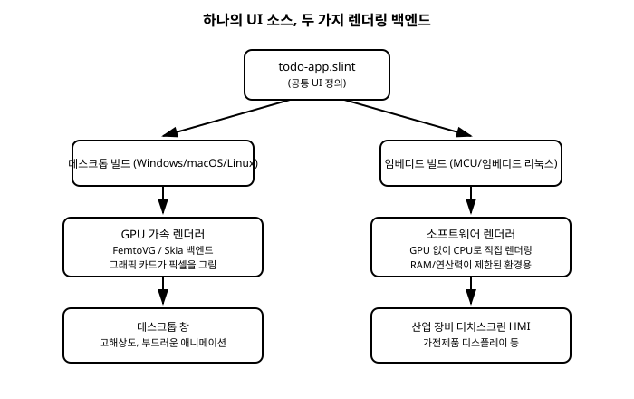

# 17장. 임베디드/크로스플랫폼 타겟팅

[◀ 이전: 16장. 이미지와 커스텀 렌더링](ch16-이미지와커스텀렌더링.md) | [📖 목차](00-목차.md) | [다음: 18장. 실전 프로젝트: 할 일 관리 앱 만들기 ▶](ch18-실전프로젝트할일관리앱만들기.md)

1장에서 Slint를 소개하며 "RAM과 연산 능력이 극도로 제한된 마이크로컨트롤러(MCU) 기반 임베디드 기기까지 실행 대상으로 삼는다"는 이야기를 잠깐 꺼낸 뒤 17장으로 미뤄두었습니다. 지금까지 우리는 Windows, macOS, Linux 같은 일반 데스크톱 환경에서 `slint-viewer`와 C++ 프로젝트를 빌드하며 예제를 실행해 왔습니다. 이번 장에서는 그 경험을 발판 삼아, 같은 Slint 애플리케이션이 데스크톱을 넘어 얼마나 다른 종류의 화면까지 그려낼 수 있는지 그 개념을 짚어봅니다.

미리 밝혀두자면, 임베디드 타겟을 실제로 빌드하고 배포하는 작업은 크로스 컴파일 툴체인 구성, 보드별 드라이버 연동, 메모리 제약 튜닝처럼 이 책의 범위를 벗어나는 전문적인 주제입니다. 이 장의 목표는 여러분이 그 작업을 당장 할 수 있게 만드는 것이 아니라, "Slint로 이런 것까지 가능하다"는 그림을 그려서 이후 필요할 때 올바른 방향으로 더 찾아볼 수 있게 하는 것입니다.

## 17.1 데스크톱 너머: Slint가 노리는 실행 환경의 폭

지금까지 우리가 실행해 온 애플리케이션은 모두 운영체제(Windows, macOS, Linux)가 창을 관리해주고, 그 위에서 Slint가 자신의 UI를 그려 넣는 구조였습니다. 이런 환경은 일반적인 GUI 프레임워크 대부분이 전제로 삼는 조건이기도 합니다.

Slint는 이 조건 하나만을 목표로 설계되지 않았습니다. 같은 Slint 런타임과 같은 `.slint` 언어로 다음과 같이 서로 매우 다른 환경까지 UI를 올릴 수 있도록 설계되어 있습니다.

- **일반 데스크톱**: 지금까지 다룬 Windows, macOS, Linux 환경. 창 관리자가 있고, GPU 드라이버가 준비되어 있습니다.
- **임베디드 리눅스**: 리눅스 커널은 돌아가지만 데스크톱 환경(X11, Wayland 같은 창 시스템)은 없이, 화면 프레임버퍼에 직접 그리는 산업용 보드나 셋톱박스 같은 장치입니다.
- **운영체제 없는 마이크로컨트롤러(MCU)**: 운영체제 자체가 없이 펌웨어가 하드웨어를 직접 제어하는 초소형 칩입니다. 메모리가 수백 킬로바이트 단위로 제한되는 경우도 흔합니다.

이 세 환경은 사용 가능한 메모리, CPU 성능, 그래픽 하드웨어의 유무가 완전히 다릅니다. 그런데도 Slint는 이 모든 환경에서 "같은 `.slint` 파일로 정의한 UI를 실행한다"는 목표를 추구합니다. 이것이 가능한 이유는 다음 절에서 다룰 **렌더링 백엔드**라는 개념 덕분입니다.

## 17.2 렌더링 백엔드라는 개념

`.slint` 파일을 컴파일하면 위젯 트리, 프로퍼티 바인딩, 레이아웃 계산 로직 같은 "UI가 어떻게 구성되고 동작하는가"에 대한 정보가 만들어집니다. 하지만 이 정보만으로는 화면에 실제 픽셀을 찍을 수 없습니다. 계산된 사각형, 텍스트, 색상을 실제 화면(또는 프레임버퍼)에 그려 넣는 마지막 단계를 담당하는 것이 **렌더링 백엔드(rendering backend)**입니다.

Slint는 UI 정의와 렌더링 방식을 서로 분리해서 설계했습니다. `.slint`로 작성한 UI 자체는 렌더링 백엔드가 무엇인지 전혀 알 필요가 없고, 실행 환경에 따라 적절한 백엔드를 선택해서 붙이면 됩니다. 이 분리 덕분에 같은 UI 정의가 서로 다른 하드웨어 조건에서도 재사용될 수 있습니다.

크게 나누면 데스크톱처럼 GPU를 활용할 수 있는 환경을 위한 **GPU 가속 렌더러**와, GPU가 없거나 쓸 수 없는 환경을 위한 **소프트웨어 렌더러**로 구분할 수 있습니다.

## 17.3 데스크톱의 GPU 가속 렌더러

지금까지 여러분이 실행해 온 예제들은 내부적으로 GPU 가속 렌더러를 사용해 그려졌습니다. Slint는 이런 데스크톱 환경을 위해 **FemtoVG**와 **Skia**라는 이름의 렌더링 백엔드를 제공합니다. 둘 다 그래픽 카드의 하드웨어 가속을 활용해 사각형, 텍스트, 둥근 모서리, 그림자 같은 도형을 빠르게 그려내며, 10장에서 다룬 애니메이션처럼 매 프레임 화면을 다시 그려야 하는 작업도 부드럽게 처리합니다.

두 이름 모두 Slint가 자체적으로 만든 것이 아니라, 2D 벡터 그래픽 렌더링을 위해 널리 쓰이는 기존 라이브러리의 이름입니다. Slint는 이 라이브러리들을 자신의 렌더링 백엔드로 통합해서 제공하며, 어떤 백엔드를 쓸지는 대체로 빌드 설정이나 실행 환경에 따라 자동으로 선택됩니다. 이 책에서는 두 백엔드의 존재와 역할을 아는 것으로 충분하며, 세부적인 성능 특성이나 선택 기준까지 파고들지는 않습니다. 지금 단계에서 기억할 것은 하나뿐입니다. **GPU가 있는 데스크톱 환경에서는 Slint가 그 GPU를 최대한 활용해서 화면을 그린다**는 것입니다.

## 17.4 리소스가 제한된 세계: 소프트웨어 렌더러

반대로 GPU 자체가 없는 마이크로컨트롤러나, GPU가 있어도 드라이버 스택이 무거워서 쓰기 부담스러운 임베디드 보드에서는 FemtoVG나 Skia 같은 GPU 가속 렌더러를 쓸 수 없습니다. 이런 환경을 위해 Slint는 **소프트웨어 렌더러(software renderer)**라는 또 다른 백엔드를 제공합니다.

소프트웨어 렌더러는 그래픽 카드의 도움 없이, CPU가 직접 계산해서 프레임버퍼의 픽셀 값을 하나씩 채워 넣는 방식으로 동작합니다. GPU 가속 렌더러만큼 화려한 효과나 매끄러운 프레임률을 뽑아내기는 어렵지만, 그 대신 훨씬 적은 메모리와 연산 자원으로도 UI를 화면에 띄울 수 있습니다. 산업용 계측 장비의 작은 흑백 또는 저해상도 컬러 디스플레이, 배터리로 구동되는 소형 기기처럼 GPU를 넣을 여유가 없는 하드웨어가 소프트웨어 렌더러의 주된 무대입니다.

여기서 중요한 것은, 소프트웨어 렌더러를 쓴다고 해서 `.slint` 파일을 다시 작성하거나 UI 구조를 바꿔야 하는 것이 아니라는 점입니다. 같은 `component`, 같은 `property`, 같은 레이아웃 문법으로 작성한 UI가 그대로 소프트웨어 렌더러 위에서도 동작합니다. 달라지는 것은 "그 UI 정보를 픽셀로 바꾸는 마지막 단계"뿐입니다.

아래 다이어그램은 하나의 `.slint` 소스가 데스크톱용 GPU 가속 렌더러와 임베디드용 소프트웨어 렌더러라는 서로 다른 두 경로로 각각 컴파일되는 흐름을 보여줍니다.

## 17.5 하나의 UI 소스, 여러 타겟 — Slint의 핵심 가치 제안

지금까지 살펴본 내용을 한 문장으로 요약하면 이렇습니다. **같은 `.slint` UI 정의를 데스크톱과 임베디드 양쪽에서 재사용할 수 있다는 것이 Slint의 핵심 가치 제안 중 하나입니다.**

이것이 왜 중요한지는 실제 제품 개발 과정을 떠올려 보면 분명해집니다. 산업 장비나 가전제품을 만드는 팀은 흔히 두 종류의 화면을 모두 필요로 합니다.

- **개발/테스트용 데스크톱 화면**: 실제 하드웨어가 준비되기 전, 또는 하드웨어 없이도 UI 로직을 빠르게 검증하고 싶을 때 개발자의 PC에서 곧바로 실행해볼 수 있는 버전입니다.
- **실제 제품에 들어가는 임베디드 화면**: 최종적으로 장비에 내장되는, 훨씬 제한된 하드웨어에서 동작해야 하는 버전입니다.

전통적인 GUI 개발 방식에서는 이 두 화면을 아예 다른 기술 스택으로 각각 구현하는 일이 드물지 않았습니다. 데스크톱 프로토타입은 한 프레임워크로, 실제 임베디드 펌웨어의 UI는 완전히 다른 저수준 그래픽 라이브러리로 따로 만드는 식입니다. 이렇게 되면 UI를 한 번 고칠 때마다 두 곳의 코드를 각각 수정해야 하고, 두 화면이 조금씩 다르게 동작하는 불일치도 쌓이기 쉽습니다.

Slint에서는 원칙적으로 같은 `.slint` 파일 하나로 데스크톱 빌드와 임베디드 빌드를 모두 만들 수 있습니다. 개발 단계에서는 데스크톱에서 GPU 가속 렌더러로 빠르게 반복 작업을 하다가, 실제 타겟 하드웨어에 올릴 때는 같은 UI 정의를 소프트웨어 렌더러로 빌드해서 배포하는 흐름이 가능해지는 것입니다. C++ 애플리케이션 로직(콜백, 프로퍼티 제어) 역시 7~8장에서 다룬 것과 같은 API를 그대로 사용합니다.

## 17.6 임베디드 Slint가 쓰이는 자리: 산업 HMI와 가전 디스플레이

이런 크로스플랫폼 타겟팅이 실제로 유용하게 쓰이는 대표적인 자리가 **HMI(Human-Machine Interface)**입니다. 공장 설비나 계측 장비에 붙은 터치스크린 조작 패널을 떠올려 보면, 그 화면은 대개 범용 데스크톱 OS가 아니라 임베디드 리눅스나 전용 펌웨어 위에서 동작합니다. 이 저장소의 "C#/.NET 장비 제어 소프트웨어" 책에서 산업 장비의 HMI를 데스크톱 기술로 구현하는 사례를 다룬 것과 같은 맥락에서, Slint는 그 화면을 임베디드 하드웨어 위에 직접 올리는 선택지를 제공한다고 볼 수 있습니다.

이 외에도 세탁기나 전자레인지 같은 가전제품의 작은 컬러 디스플레이, 웨어러블 기기의 화면, 의료 기기의 조작 패널처럼 "화면은 있지만 일반 PC 수준의 자원은 없는" 제품군 전반이 임베디드 Slint의 잠재적인 활용처입니다. 이런 제품들은 공통적으로 두 가지를 동시에 요구합니다. 하나는 최종 사용자가 보기에 매끄럽고 현대적인 UI이고, 다른 하나는 제한된 메모리와 연산 자원 안에서 안정적으로 동작해야 한다는 제약입니다. Slint가 소프트웨어 렌더러와 컴파일 타임 코드 생성(1장 참고)을 함께 제공하는 것은 바로 이 두 요구를 동시에 만족시키기 위한 설계라고 이해할 수 있습니다.

## 요약

- Slint는 일반 데스크톱(Windows/macOS/Linux)뿐 아니라 임베디드 리눅스, 운영체제 없는 마이크로컨트롤러(MCU)까지 실행 대상으로 삼도록 설계되었습니다.
- `.slint` UI 정의와 실제 픽셀을 그리는 작업은 렌더링 백엔드라는 개념으로 분리되어 있습니다.
- 데스크톱에서는 FemtoVG, Skia 같은 GPU 가속 렌더러를 사용해 하드웨어 가속으로 화면을 그립니다.
- GPU가 없거나 쓸 수 없는 임베디드 환경에서는 CPU가 직접 픽셀을 계산하는 소프트웨어 렌더러를 사용할 수 있습니다.
- 같은 `.slint` UI 소스를 데스크톱과 임베디드 양쪽에서 재사용할 수 있다는 것이 Slint의 핵심 가치 제안 중 하나이며, 이는 개발용 프로토타입과 실제 제품 화면 사이의 코드 중복과 불일치를 줄여줍니다.
- 산업 장비의 터치스크린 HMI, 가전제품 디스플레이 같은 "화면은 있지만 자원은 제한된" 제품군이 임베디드 Slint의 대표적인 활용처입니다.
- 임베디드 타겟을 실제로 빌드하는 작업(크로스 컴파일, 보드별 드라이버 연동 등)은 이 책의 범위를 넘어서는 전문적인 주제입니다.

## 연습문제

1. GPU 가속 렌더러와 소프트웨어 렌더러의 차이를 "누가 픽셀을 계산하는가"라는 관점에서 설명해 보세요.
2. Slint가 `.slint` UI 정의와 렌더링 백엔드를 분리해서 설계한 것이 크로스플랫폼 타겟팅에 왜 유리한지 설명해 보세요.
3. 데스크톱 프로토타입과 실제 임베디드 제품 화면을 서로 다른 기술 스택으로 각각 구현할 경우 생길 수 있는 문제점을 두 가지 이상 들어 보세요.
4. 여러분이 알고 있는 가전제품이나 산업 장비 중 "화면은 있지만 일반 PC 수준의 자원은 없는" 제품을 하나 떠올려 보고, 그 제품에 임베디드 Slint를 적용한다면 어떤 이점이 있을지 추측해 보세요.
5. 1장에서 소개한 Slint의 "컴파일 타임 변환" 특징이 임베디드 환경에서 왜 특히 중요한지, 런타임에 마크업을 해석하는 방식과 비교해서 설명해 보세요.

---

[◀ 이전: 16장. 이미지와 커스텀 렌더링](ch16-이미지와커스텀렌더링.md) | [📖 목차](00-목차.md) | [다음: 18장. 실전 프로젝트: 할 일 관리 앱 만들기 ▶](ch18-실전프로젝트할일관리앱만들기.md)
